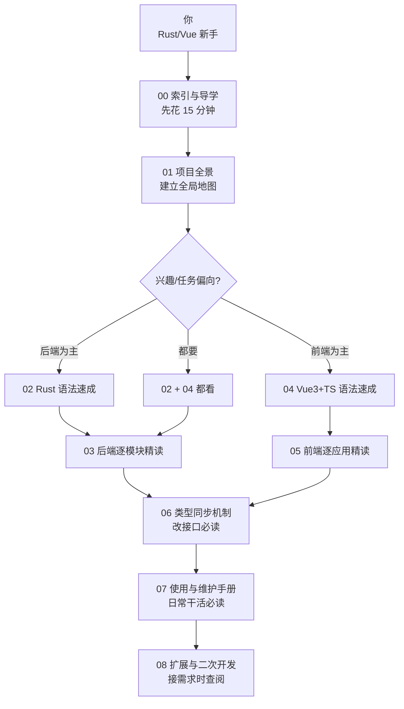
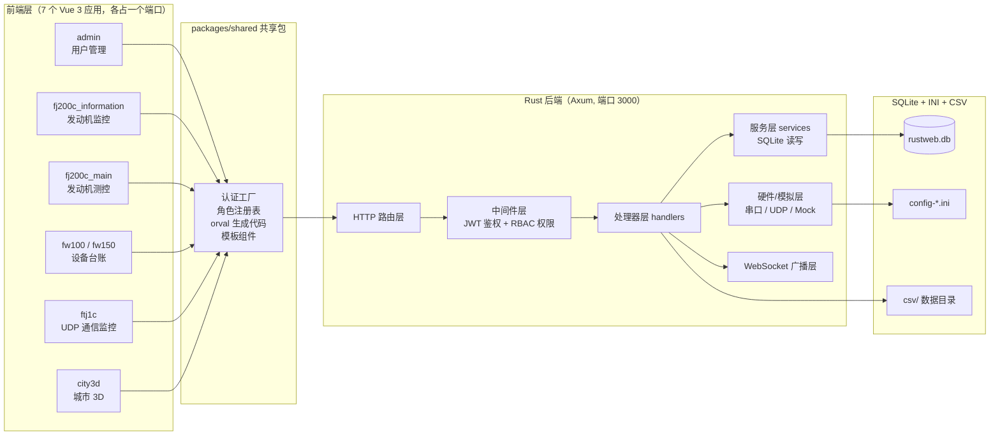

# RustWeb-Vue 全栈项目接手指南（新手向）

> 适用对象：即将接手本项目、但 Rust 与 Vue 经验有限的新手开发者。
> 本指南共 9 个文档（含本索引），全文约 12 万字，含 30+ 张 Mermaid 图表，以项目**真实代码**为教材（每个关键点都标注了源码路径，可随时打开对照）。
> 写作基准：本指南内容以 `AGENTS.md`（项目根目录与仓库根目录各一份）与当前代码库为准。注意 `README.md` 已部分过时（仍写着 6 个前端应用与单一 fj200c 模块，实际为 7 个应用、fj200c 已拆分），阅读时以本指南与 AGENTS.md 为准。

---

## 一、这套文档能帮你什么

如果你是完全的新手，读完这套文档后你将能够：

1. **看懂这个项目**——知道后端 Rust 代码的每一层（路由、处理器、服务、数据库）在干什么，知道前端 7 个 Vue 应用为什么长得一模一样却各自独立。
2. **跑起来**——从零搭建环境，启动后端和任意前端，用种子账号登录，让模拟数据流转起来。
3. **改代码**——在既有模块里改功能、加接口、加页面，不破坏现有结构。
4. **加新业务**——按照"新增角色七步流程"把一套全新的业务模块（新角色 + 新前端 + 新接口）完整接入系统。
5. **发布上线**——理解 `deploy.bat` 一键部署的原理，掌握单 exe 内嵌前端的构建方式。

这套文档**不是**完整的 Rust 语言教程或 Vue 官方文档，而是"以本项目为教材"的语法速成 + 架构精读。所有语法点都用项目里的真实代码举例，看完语法马上就能在项目里找到对应代码。

## 二、文档总目录与阅读路线

| 文档 | 主题 | 适合谁 | 建议耗时 |
|---|---|---|---|
| **00-索引与导学**（本文件） | 总目录、阅读路线、学习方法 | 所有人 | 15 分钟 |
| **01-项目全景** | 系统定位、技术栈、7 应用总览、三层架构、一次完整请求的全链路、目录逐层解析 | 所有人，必读 | 1~2 小时 |
| **02-Rust语法速成** | 所有权/借用、Option/Result、枚举与模式匹配、trait、async/await、宏、错误处理——全部用项目代码举例 | Rust 新手必读 | 4~6 小时 |
| **03-后端逐模块精读** | main.rs 启动、routes/roles/database、common 公共层（JWT/中间件/WS/工具）、auth 登录流程、fj200c_information 完整数据流、其余业务模块差异 | 想深入后端的人 | 6~8 小时 |
| **04-Vue3与TS语法速成** | 组合式 API、ref/reactive/computed/watch、TypeScript 类型、Vue Router 守卫、Pinia、Element Plus、WebSocket、ECharts——全部用项目代码举例 | Vue/TS 新手必读 | 4~6 小时 |
| **05-前端逐应用精读** | shared 公共层解剖（角色注册表/会话/认证工厂/请求封装）、典型应用 fj200c_information 全文件走读、fj200c_main 的 WS 单例模式、其余应用差异 | 想深入前端的人 | 6~8 小时 |
| **06-前后端类型同步** | utoipa 注解 → export_openapi → orval → generated 代码，改一个接口的完整流程 | 所有要改接口的人 | 1~2 小时 |
| **07-使用与维护手册** | 环境搭建、启动、种子账号、3 个 INI 配置、调试三板斧、deploy.bat 逐行、常见陷阱 FAQ | 日常使用与维护者 | 2~3 小时 |
| **08-扩展与二次开发** | 新增角色七步全流程（图文）、加接口、加配置项、新前端接入、city3d 扩展、性能与安全注意事项 | 做二次开发的人 | 3~4 小时 |



**建议速通路线（最快 3 天）**：01 → 02 挑"所有权、Result、枚举"三节 → 03 挑"main.rs、auth 登录、fj200c_information"三节 → 04 挑"组合式 API、Pinia、路由守卫"三节 → 05 挑"shared 公共层、典型应用走读"两节 → 06 → 07。其余章节作为手册按需查阅。

## 三、项目一句话画像



**一句话总结**：这是一个"一台机器上的工业设备监控与管理系统"——Rust 后端负责登录鉴权、设备串口/UDP 通信、数据解码与广播；7 个前端按角色分工展示不同业务；SQLite 存用户与台账数据；INI 存设备通信配置；CSV 存试验数据；orval 保证前后端类型契约永远一致。

## 四、学习环境准备（写代码前先读）

在开始精读之前，建议先准备好环境，边读边运行边对照：

1. **Rust 工具链**：安装 [rustup](https://rustup.rs)，确认 `cargo --version` 可用（项目用的是 Rust 2021 edition，任意 1.65+ 版本即可）。
2. **Node.js**：建议 18+（Vite 6 要求），确认 `node --version`、`npm --version` 可用。
3. **VS Code**：安装扩展 `rust-analyzer`（Rust 智能提示）、`Volar`（Vue 3 智能提示，注意已弃用 Vetur）、`Prettier`、`Mermaid Preview`（本地预览本套文档的图表）。
4. **数据库工具**：任意 SQLite 客户端（如 DB Browser for SQLite），用于查看 `rustweb.db`。
5. **浏览器**：Chrome/Edge，F12 开发者工具要会用（网络面板看 API 请求、控制台看报错）。

环境验证命令（在项目根目录）：

```powershell
cargo --version        # 例如 cargo 1.80.0
node --version         # 例如 v20.11.0
npm --version          # 例如 10.2.4
```

## 五、学习方法建议

1. **边读边跑**：读完第 01 章后立刻按第 07 章把项目跑起来，登录 `admin@rustweb.dev`，点开各个页面，对照文档理解。
2. **代码要对照着看**：每个标注了 `src/xxx.rs:123` 的代码块，都建议打开真实文件对照。文档中的代码可能经过删节（用 `...` 表示），完整代码以仓库为准。
3. **用好 rust-analyzer**：把鼠标悬停在变量/类型上，看推断类型；右键"转到定义"，在代码里跳来跳去理解结构。
4. **先读后改**：第 08 章的扩展流程是建立在第 02~06 章理解之上的，不要跳步。
5. **mermaid 图怎么用**：GitHub 网页端可以直接渲染；VS Code 装 Mermaid Preview 后可本地预览；命令行可用 `npx @mermaid-js/mermaid-cli` 导出 PNG/SVG（本项目根目录 devDependencies 已内置 mmdc）。

## 六、术语速查表（先混个脸熟）

| 术语 | 含义 | 在本项目中的位置 |
|---|---|---|
| Axum | Rust 最流行的 Web 框架，类似 Express/Flask | 后端框架本体 |
| Handler | HTTP 处理函数，一个接口一个函数 | `src/*/handlers.rs` |
| Middleware | 中间件，在请求到达 handler 前拦截处理 | `src/common/middleware.rs` |
| JWT | JSON Web Token，无状态登录凭证 | `src/common/jwt.rs` |
| RBAC | 基于角色的权限控制 | `src/roles.rs` 角色注册表 |
| Permission | 权限点，一个权限点控制一类操作 | `src/common/models.rs` 的 `Permission` 枚举 |
| sqlx | Rust 的 SQL 库，支持编译期检查 | 所有 services 层 |
| ORM | 对象关系映射（本项目没用 ORM，用 sqlx 写 SQL） | — |
| WS | WebSocket，服务端→前端实时推送 | `src/common/ws.rs` + 各模块 ws_handler |
| broadcast | tokio 的广播通道，一对多消息分发 | `src/fj200c_information/mod.rs` |
| OnceLock | Rust 单例容器，进程内全局唯一 | 各模块全局状态 |
| ArcSwap | 无锁读写共享指针，热更新配置用 | `src/common/quad_frame.rs` 等 |
| Pinia | Vue 3 官方状态管理库（相当于 Vuex 的升级） | 各前端 `stores/` |
| Composition API | Vue 3 组合式 API，用函数组织逻辑 | 所有 `.vue` 的 `<script setup>` |
| Vite | 前端构建工具与开发服务器 | 各前端 `vite.config.ts` |
| Element Plus | 基于 Vue 3 的 UI 组件库 | 所有页面组件 |
| orval | 根据 OpenAPI 自动生成 TS 请求代码的工具 | 根目录 `orval.config.ts` |
| utoipa | Rust 侧自动生成 OpenAPI 文档的宏框架 | handler 上的 `#[utoipa::path]` 注解 |
| workspace | npm 多包仓库管理（monorepo） | 根 `package.json` 的 `workspaces` 字段 |

---

## 七、常见问题解答（读文档前先看）

### Q1：我是完全零基础，这套文档能看懂吗？

能。02 章与 04 章是专门为零基础写的语法速成，所有语法点都用本项目真实代码举例，并标注了源码路径。建议顺序：01 → 02 → 03（后端线）或 01 → 04 → 05（前端线），最后汇合到 06。

### Q2：我只想改一个页面，要看哪些章节？

最快路径：00 索引 → 05 章前端逐应用精读（找到对应应用的走读）→ 04 章（查语法）。改页面通常只涉及单个前端应用，无需读完整个后端文档。

### Q3：我想加一个全新的业务模块，看哪章？

08 章「扩展与二次开发」的 8.2 节有完整七步流程，配合 06 章类型同步机制使用。建议先通读 01、03 两章建立全局概念再动手。

### Q4：文档里的代码和仓库不一致怎么办？

文档中的代码可能经过删节（用 `...` 省略与主题无关的部分），完整代码以仓库为准。每个代码块都有路径标注，打开真实文件对照阅读。

### Q5：mermaid 图在 VS Code 里不显示怎么办？

安装 Mermaid Preview 扩展，或在 GitHub 网页端查看（自动渲染）。也可以运行 `npx @mermaid-js/mermaid-cli` 导出为 PNG 查看。

### Q6：如何快速定位一个文件属于哪个章节？

用 00 章的术语速查表 + 01 章的目录解析（含完整目录树）。遇到具体文件时，也可以直接使用 IDE 的全局搜索（Ctrl+Shift+F）。

## 八、文档维护约定（给后续维护者）

1. 每章末尾统一以「> 

下一节：**0X-xxx**。」结尾，方便衔接。
2. 章节号与文件名前缀保持一致（00~08）。
3. 新增内容优先追加到对应章节末尾，避免打乱原有编号。
4. 引用代码时标注 `文件路径:行号`（如 `src/routes.rs:45`）。
5. 修改 AGENTS.md 中的架构事实时，同步更新本套文档相关章节。

---

## 九、阅读路线图（按天规划）

如果希望**系统化**学完，可以参考以下节奏（每章约 1~3 小时）：

### 第 1~2 天：先建全局

```
第 1 天：00 章（本索引）+ 01 章（项目全景）
第 2 天：02 章（Rust 语法）+ 03 章第 1 节（后端总览）
```

### 第 3~5 天：后端

```
第 3 天：03 章（auth/admin/common）
第 4 天：03 章（fj200c_information/fj200c_main）
第 5 天：03 章（ftj1c/fw100/fw150/city3d）
```

### 第 6~8 天：前端

```
第 6 天：04 章（Vue3/TS 语法）
第 7 天：05 章（admin/fj200c_information/fj200c_main）
第 8 天：05 章（fw100/fw150/ftj1c/city3d）
```

### 第 9~10 天：工程与维护

```
第 9 天：06 章（类型同步）+ 07 章（使用维护）
第 10 天：08 章（扩展实战）+ 总复习
```

**灵活变通**：只想用系统 → 只读 07 章；只想改前端 → 04+05+06；只想改后端 → 02+03+06。

## 十、结语与开始

这套系统的核心脉络只有三句话：

> **后端：Rust + Axum + SQLite，一次启动，七路服务。**
> **前端：七个 Vue 3 应用，一套 shared，一个登录态。**
> **契约：utoipa → OpenAPI → orval，生成代码即类型。**

现在，打开 `01-项目全景.md`，开始你的旅程。祝学习愉快！

## 十一、给新手的学习避坑提示

### 11.1 常见误区

```
1. 想先学完 Rust 再看项目 → 学不完。先看项目，遇到语法去 02 章查
2. 只读不敲 → 记不住。每章自测题要动手敲
3. 一次读完全部 → 消化不良。按九节路线图分天
4. 代码不跑 → 不踏实。按 01 章搭好环境跑起来
```

### 11.2 正确的学习姿势

```
1. 环境先跑起来（01 章）
2. 每章读完 → 做自测 → 动手改一个小地方
3. 卡住 → 用 00 章索引定位 → 精读对应节
4. 反复修改 → 加深理解（改坏了 git checkout 还原）
```

### 11.3 遇到问题怎么办

```
1. 报错先读完整错误信息（前 5 行）
2. 搜索错误关键字（中文社区 + 官方文档）
3. 看本项目类似代码怎么写的
4. 实在不行 → 问同事/记录到文档
```

## 十二、全书结构一页纸（速记版）

```
00 索引与导学      ← 你现在在这
01 项目全景        ← 系统是什么
02 Rust 语法速成   ← 读后端的钥匙
03 后端逐模块精读  ← 后端源码地图
04 Vue3/TS 语法    ← 读前端的钥匙
05 前端逐应用精读  ← 前端源码地图
06 类型同步机制    ← 前后端怎么握手
07 使用与维护      ← 怎么跑/怎么修
08 扩展与二次开发  ← 怎么加功能
```

**两条主线**：

```
后端线：02 → 03 → 06 → 08
前端线：04 → 05 → 06 → 08
```

## 十三、致读者的一段话

这套文档没有学院派的堆砌，只有"代码在哪儿、为什么这么写、怎么改"三件事。你不需要记住每一行，只需要知道：**遇到问题去哪个文件、哪个章节找答案**。

读的时候请记住：

```
1. 每个代码块都有出处（文件路径:行号）——去源码里验证
2. 每个 mermaid 图都是讲稿——能对着图讲出来就算懂
3. 每章自测题都要写——写出来才算会
4. 学完 08 章，你就能自己加功能了
```

现在，关掉聊天窗口，打开编辑器，我们开始。

## 十四、关于本套文档的字数说明

本套教程共 9 章，合计超过 10 万汉字，目标读者是"能看懂代码但没写过 Rust/Vue 的新手"。文档追求的不是面面俱到，而是"每个概念都能在项目里找到真实例子"。

如果读的时候发现某个概念在文档里没有直接答案，请记住：

```
1. 先在对应章节的"深入/补充"小节里找
2. 再到源码里搜关键字
3. 最后把问题记下来——欢迎完善文档
```

## 十五、最后再嘱咐三件事

第一，**这套系统的代码是活的**——文档写于某个时间点，代码可能继续演进。遇到文档与代码不符时，以代码为准，并把差异记下来反馈给文档维护者。

第二，**学习最重要的是动手**。每章的自测题、动手任务、08 章的实战案例，都是为动手准备的。看完不做，等于白看。

第三，**保持好奇心**。遇到"为什么这么设计"的问题，翻代码、翻 git 历史（git log 能看到演进）、翻 AGENTS.md，答案通常都在。

祝学习顺利，早日成为能独立改这个系统的人。

---


再强调一次：遇到看不懂的代码，不要死磕，先带着问题往下走，回头再看自然就懂了。每一章都给出了代码位置与运行命令，跟着敲一遍，胜过看十遍。坚持读完九章，你就具备了独立维护这套系统、乃至从零搭建类似系统的完整能力。

> 下一节：**01-项目全景**——开始建立全局地图。
