# 01 项目全景：先建立全局地图

> 本章目标：让你在 1~2 小时内建立对整个系统的完整地图——系统是什么、有哪些部分组成、数据怎么流动、目录怎么组织。读完本章你就能在任何代码文件里"找得到北"。
>
> 全文约 1.6 万字，含 9 张 Mermaid 图。建议边读边打开对应文件对照。

---

## 1.1 这个项目到底是个什么系统

### 1.1.1 一句话定位

**RustWeb-Vue 是一套运行在工业内网环境中的"多业务管理平台"**：一个 Rust 编写的后端进程负责登录鉴权、与硬件设备（串口、UDP 组播）通信、数据解码与实时推送；**八个 Vue 3 前端应用**各自面向一类业务角色，通过浏览器访问同一后端。

这些业务包括：

| 业务 | 干什么 |
|---|---|
| 发动机监控（fj200c_information） | 读取发动机试车台的多路串口数据帧，实时监控、可视化、记录 CSV 试验数据 |
| 发动机测控（fj200c_main） | 更复杂的测控台：ECU/Adam4015/Adam4117/Dyno/Flux **五路串口**同时采集，支持指令下发、试验信息录入、报表生成 |
| 通信监控（ftj1c） | 监控 UDP 组播通信链路（16 路组播地址），查看遥测帧数据 |
| 设备台账（fw100 / fw150） | 两套设备台账列表展示（演示数据） |
| 城市 3D（city3d） | 城市区域/建筑/事件的三维可视化展示与数据管理 |
| 协议生成（protocol_generator） | 通信协议参数表 CSV 读写/解析、协议 C# 代码生成、Excel/Markdown 导出 |
| 管理后台（admin） | 用户管理：创建用户、分配角色、删除用户 |

你可以把它理解成：**一个带登录系统的、前后端分离的、能接硬件数据的工业管理系统**。硬件部分（串口/UDP）都有 Mock 模拟模式，没有真实硬件也能完整体验所有功能——这是项目刻意设计的（配置文件里 `InProcess = true`、`Mock = true`、`SimulationMenu = true` 之类开关）。

### 1.1.2 为什么会有 8 个前端而不是 1 个

这是新人最容易困惑的问题。传统 Web 项目是一个前端包含所有页面，这里却是 8 个独立应用。原因：

1. **按角色隔离**：每个角色只应该看到自己的业务页面。8 个应用与 8 个角色一一对应（admin 对应管理角色，其余 7 个各对应一个业务角色）。
2. **互不干扰**：每个应用独立构建、独立部署路径（`/admin`、`/fj200c_information`...），业务升级一个应用不影响其他。
3. **规模适中**：每个应用其实都不大（几个页面），单页应用的组织成本低。

代价是：公共代码需要抽到 `packages/shared` 共享包，避免 8 份重复代码。这就是"8 个应用长得几乎一模一样"的原因——它们都是同一套模板（同样的 main.ts、同样的 AppShell、同样的认证 store）套出来的。

### 1.1.3 这个项目不是 Tauri 项目

项目目录名带 `TauriProjects` 前缀（仓库上级目录），但本项目**不是 Tauri**：没有 `src-tauri/`，不打包桌面应用，就是一个普通的 Web 前后端项目。上级仓库里的其他目录（demo-base 等）才是 Tauri 项目。别混淆。

---

## 1.2 技术栈总览

### 1.2.1 后端技术栈（Rust）

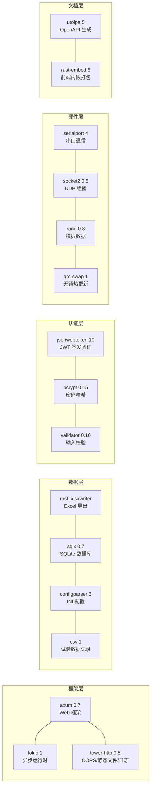

依赖清单在 `Cargo.toml`（项目根目录，共 66 行），按功能分组注释，是个很好的依赖清单范本。核心依赖版本：axum 0.7、sqlx 0.7、tokio 1、utoipa 5、rust-embed 8、jsonwebtoken 10.3（`rust_crypto` feature，HS256 纯 Rust 实现）、rust_xlsxwriter 0.97。**注意：没有 `notify` 依赖**——所谓"配置热加载"是采集线程每轮循环重新读盘实现的，不是文件监听（详情见 1.15 节）。

### 1.2.2 前端技术栈（Vue）

| 技术 | 版本 | 用途 |
|---|---|---|
| Vue 3 | ^3.5 | 前端框架（组合式 API + `<script setup>`） |
| Vite 6 | ^6.0 | 构建工具与开发服务器 |
| TypeScript | ^5.x | 类型系统（`strict` 模式全开） |
| Element Plus | ^2.x | UI 组件库（表格/表单/弹窗/消息） |
| Pinia | ^2.x | 状态管理 |
| Vue Router | ^4.x | 路由与守卫 |
| ECharts | ^5.x | 图表（fj200c_information/fj200c_main） |
| Three.js | 仅 city3d 直接依赖 | 3D 场景（city3d） |
| hiprint | 仅 protocol_generator | 协议打印 |

> 注意：8 个应用各自的 `package.json` 依赖并不完全相同。例如只有 city3d 有 three.js、只有 fj200c_information/fj200c_main 有 echarts、只有 protocol_generator 注册了 hiprint。但 npm workspaces 模式下，依赖统一在**根目录** `npm install` 一次安装完成；构建类 devDependencies（vite/typescript/vue-tsc/@vitejs/plugin-vue/orval 等）已**提升到根 package.json**，各子包不再各自声明。

### 1.2.3 前后端之间的"契约"机制

这是本项目最有特色的部分，必须一开始就建立概念：

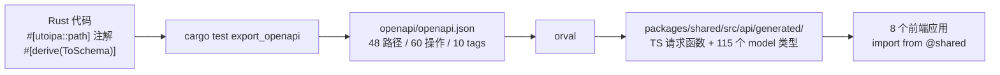

**后端是类型的唯一真相源**：前端调用的每个接口、每个数据结构，都是后端代码注解自动生成的。后端改了接口，`npm run gen:api`（= `cargo test export_openapi && orval`）重新生成，前端 `vue-tsc` 立刻报错——报错的地方就是需要同步修改的调用点。这套机制保证了"改了后端不会悄悄破坏前端"。

---

## 1.3 八个前端应用总览

### 1.3.1 应用一览表

| 目录 | 角色 key | 权限 | dev 端口 | prod 路径 | WS 代理 | 主要页面 |
|---|---|---|---|---|---|---|
| `frontend/fj200c_information` | fj200c_information | Fj200cInformationMonitor | 5173 | `/fj200c_information` | ✔ | 监控、可视化、数据、配置、帮助 |
| `frontend/admin` | admin | SystemAdmin + Users* | 5174 | `/admin` | — | 用户列表、创建用户、403 |
| `frontend/fw100` | fw100 | Fw100Monitor | 5175 | `/fw100` | ✔ | 台账面板 |
| `frontend/ftj1c` | ftj1c | Ftj1cMonitor + Ftj1cHelp | 5176 | `/ftj1c` | ✔ | 通信监控、帮助 |
| `frontend/city3d` | city3d | City3dView | 5177 | `/city3d` | ✔ | 3D 场景、数据管理 |
| `frontend/fw150` | fw150 | Fw150Monitor | 5178 | `/fw150` | ✔ | 台账面板 |
| `frontend/fj200c_main` | fj200c_main | Fj200cMainMonitor | 5179 | `/fj200c_main` | ✔ | 监控、试验、报表、数据、配置、帮助 |
| `frontend/protocol_generator` | protocol_generator | ProtocolGeneratorMonitor | 5180 | `/protocol_generator` | — | 协议编辑、CSV 参数表 |

**6 个应用在 vite.config.ts 里开启了 `ws: true` 代理**（fj200c_information/fw100/ftj1c/city3d/fw150/fj200c_main），因为它们的页面要连 WebSocket；admin 和 protocol_generator 纯 HTTP，不需要。所有应用的 `vite.config.ts` 都极薄——真正配置在共享工厂 `build/vite.base.ts` 的 `defineAppConfig({ app, port, ws? }, __dirname)` 里。

### 1.3.2 应用间如何跳转

这 8 个应用共享同一个浏览器 localStorage（同一个域名 `localhost`），token 存同一个 key（`SESSION_KEY = "session"`）。登录任何应用后，token 自动带过去；如果登录的账号角色不属于当前应用，登录页会**自动跳转到该角色自己的应用**：

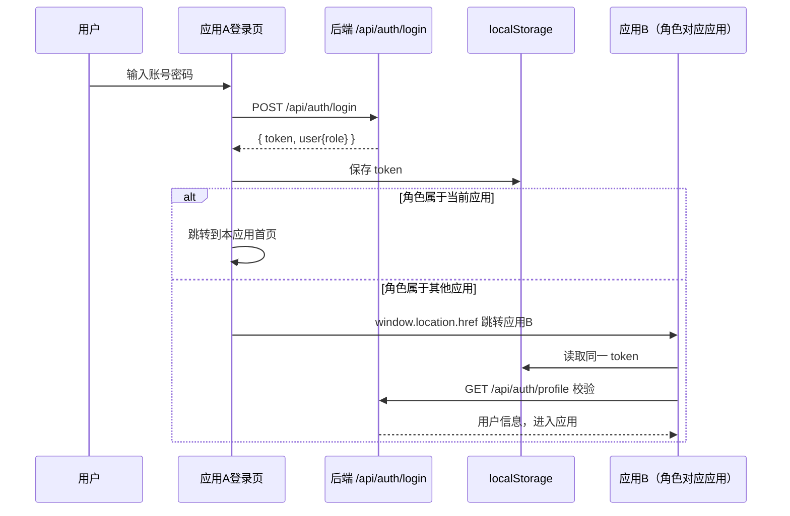

这个跳转逻辑在 `packages/shared/src/template/LoginPage.vue` 里，跳转目标地址在 `packages/shared/src/roles.ts` 的 `ROLE_APP_URLS` 映射表里（dev 是 `http://localhost:517x`，prod 是 `/应用路径`）。

### 1.3.3 为什么端口是 5173~5180

Vite 默认端口就是 5173，后面的应用依次递增，避免 dev 时端口冲突。8 个应用可以**同时启动**，各自连接同一个后端（3000 端口）。这在调试时很方便：开 8 个终端，每个 `npm run dev`。

---

## 1.4 后端模块总览

### 1.4.1 目录树（两级目录结构）

2026 年的一次架构统一（commit 61a4b8e）把后端角色模块改成了**两级目录**：一级目录只保留模板骨架（`mod.rs` / `handlers.rs` / `routes.rs` / `service(s).rs`），角色专有的实现文件全部下沉到二级目录 `src/<role>/<role>/`：

```
src/
├── main.rs                 # 程序入口：启动编排（日志/配置/数据库/CORS/路由/静态托管）332 行
├── routes.rs               # 路由集中注册：把全部子路由拼成一个 Router
├── roles.rs                # 角色注册表 ROLE_REGISTRY（RBAC 的唯一源，8 个角色）
├── database.rs             # 建表 + 种子数据（1360 行，无迁移文件，单事务）
├── api_docs.rs             # utoipa OpenAPI 聚合 + export_openapi 防漂移测试
├── config.rs               # 读取环境变量（PORT/DATABASE_URL）
├── embedded_assets.rs      # 单 exe 模式：embed_assets!/embed_app_routes! 宏内嵌 8 个前端 dist
│
├── common/                 # ★ 公共基础设施（所有角色共用，19 个文件 + auth/ 子目录）
│   ├── mod.rs              #   子模块声明 + /health 健康检查
│   ├── models.rs           #   Permission 枚举（12 值）+ User 模型 + ApiResponse
│   ├── middleware.rs       #   auth / permission / role 三个鉴权中间件（198 行）
│   ├── jwt.rs              #   JWT 签发与验证（167 行，jwt::init() 启动时缓存密钥）
│   ├── error.rs            #   AppError 统一错误类型
│   ├── rate_limit.rs       #   登录限流（滑动窗口 60s/5 次）
│   ├── dto.rs              #   公共响应 DTO
│   ├── ws.rs               #   WS 事件桥：event_broadcast! 宏 + ws_bridge + verify_query_token
│   ├── auth/               #   登录/用户信息（routes/handlers/services）
│   ├── service.rs          #   ServiceRuntime 服务启停线程管理（stop_in_background）
│   ├── io.rs               #   IoControl trait（串口/模拟统一抽象）
│   ├── frame_extractor.rs  #   字节流→定长帧提取器
│   ├── quad_frame.rs       #   四槽帧缓冲（主备切换）
│   ├── latest_frame.rs     #   最新帧跟踪器
│   ├── global_var.rs       #   全局 KV 存储（试验信息等）
│   ├── ledger.rs           #   设备台账演示数据
│   ├── csv_writer.rs       #   CSV 批量写入器（公共版，各模块共用）
│   ├── config.rs           #   INI 配置封装 + config_singleton! 宏
│   ├── utils.rs            #   hex/时间/CSV 工具函数
│   └── least_squares.rs    #   最小二乘拟合
│
├── admin/                  # 用户管理（仅模板四件套，无二级目录）
│   ├── mod.rs / routes.rs / handlers.rs / services.rs
│
├── fj200c_information/     # 发动机监控（一级骨架）
│   ├── mod.rs              #   事件枚举 + 广播通道（event_broadcast! 展开）
│   ├── routes.rs / handlers.rs / service.rs
│   └── fj200c_information/ # ★ 二级目录：角色专有实现
│       ├── config.rs / state.rs / decode.rs / session.rs
│       └── csv_sink.rs / com.rs / mock.rs / frame_bundle.rs / mock_feeder.rs
│   （config-fj200c_information.ini 样本等非 rs 文件留在一级目录）
│
├── fj200c_main/            # 发动机测控（一级骨架）
│   ├── mod.rs / routes.rs / handlers.rs / service.rs / config.rs / state.rs
│   └── fj200c_main/        # ★ 二级目录
│       ├── com.rs / abstract_com.rs / mock.rs / decode.rs / types.rs / report.rs
│
├── ftj1c/                  # UDP 组播通信监控（一级骨架）
│   ├── mod.rs / routes.rs / handlers.rs / service.rs / config.rs / models.rs / quad_frame.rs
│   └── ftj1c/              # ★ 二级目录
│       ├── state.rs / udp.rs / process.rs / com.rs
│       └── help_doc.md     #   include_str! 相对引用，不可移出一级
│
├── fw100/  fw150/          # 设备台账（极简：仅模板四件套）
│   └── mod.rs / routes.rs / handlers.rs / services.rs
│
├── city3d/                 # 城市 3D 数据管理（一级骨架）
│   ├── mod.rs / routes.rs / handlers.rs / services.rs
│   └── city3d/             # ★ 二级目录
│       └── models.rs       #   Building/District/CityEvent/Overview
│
├── protocol_generator/     # 协议生成（第 8 个角色，一级骨架）
│   ├── mod.rs / routes.rs / handlers.rs / services.rs
│   └── protocol_generator/ # ★ 二级目录
│       ├── mod.rs / models.rs / generator.rs
│
└── role_template/          # ★ 新角色参考模板（仅模板四件套，自带启用说明）
```

**两级目录规则**（务必理解，否则找文件会迷路）：

- 一级 `mod.rs` 用 `pub mod <role>;` 声明二级目录，并用 `pub use <role>::{...};` **再导出**——外部代码路径保持 `crate::<role>::x` 不变，只有文件物理位置变了。
- 一级目录只有：`mod.rs` / `handlers.rs` / `routes.rs` / `service(s).rs` 这四个骨架文件（部分角色另有 `config.rs`/`state.rs`/`models.rs` 等）。
- **例外**：admin / fw100 / fw150 / role_template 只有模板四件套，无二级目录（业务太薄）；city3d 二级只有 `models.rs`。
- **非 rs 文件必须留在一级目录**：`config-*.ini` 样本、`help_doc.md`（handlers.rs 用 `include_str!("help_doc.md")` 相对引用，移动会编译失败）。

### 1.4.2 各角色二级目录实际文件清单

| 角色模块 | 一级骨架 | 二级目录 `src/<role>/<role>/` |
|---|---|---|
| admin | mod/routes/handlers/services | 无 |
| fj200c_information | mod/routes/handlers/service | config.rs、state.rs、decode.rs、session.rs、csv_sink.rs、com.rs、mock.rs、frame_bundle.rs、mock_feeder.rs |
| fj200c_main | mod/routes/handlers/service/config/state | com.rs、abstract_com.rs、mock.rs、decode.rs、types.rs、report.rs |
| ftj1c | mod/routes/handlers/service/config/models/quad_frame | state.rs、udp.rs、process.rs、com.rs（+ 一级 help_doc.md） |
| fw100 / fw150 | mod/routes/handlers/services | 无 |
| city3d | mod/routes/handlers/services | models.rs |
| protocol_generator | mod/routes/handlers/services | mod.rs、models.rs、generator.rs |
| role_template | 模板四件套 | 无 |

### 1.4.3 模块的三种"体型"

看目录就能发现业务模块分三种复杂程度，理解这点对读代码很重要：

| 体型 | 模块 | 特征 |
|---|---|---|
| 极简型（约 100 行/模块） | fw100、fw150 | 只有 `GET /items` 一个接口，返回演示数据 |
| 中型 | admin、city3d、protocol_generator | 纯数据库/文件 CRUD，无硬件、无 WS |
| 大型（带硬件+WS） | fj200c_information、fj200c_main、ftj1c | 有串口/UDP/模拟数据源、服务启停、WS 广播、CSV 记录 |

新手接手时，**先读极简型建立模式感**（fw100 四个文件 15 分钟读完），再读中型（admin 理解权限+CRUD），最后啃大型（fj200c_information 是最佳的"硬件模块范本"）。

### 1.4.4 统一的分层模式

每个业务模块都遵循同样的三层结构：

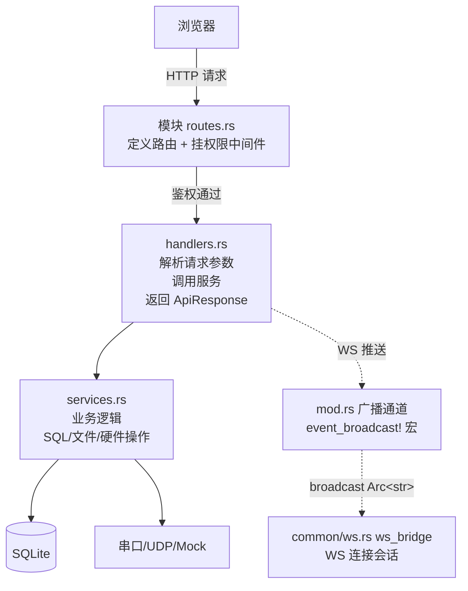

- **routes.rs**：只做路由与中间件编排，不写业务。
- **handlers.rs**：参数提取（`State`/`Json`/`Query`/`Path`）、调用 service、包 `ApiResponse`。带 `#[utoipa::path]` 注解。
- **services.rs**：纯业务逻辑，可复用。
- **mod.rs**：模块声明 + 事件枚举 + 广播通道等"模块级基础设施"。

---

## 1.5 一次完整请求的全链路（HTTP 版）

以"admin 登录后查询用户列表"为例，走一遍完整链路。这是全项目最核心的理解，务必吃透：


要点提炼：

1. **开发时**浏览器访问的是前端端口，`/api` 路径由 Vite 代理转发到后端（`vite.config.ts` 的 `server.proxy`）；**生产时**前端被后端托管，不存在跨域问题。
2. **每个请求必须带** `Authorization: Bearer <token>` 头，由前端 axios 请求拦截器自动附加。
3. **中间件链按顺序执行**：auth 鉴权 → 权限检查 → 业务 handler。不同路由挂不同中间件组合；admin 是双层（角色中间件在外、权限中间件在内）。
4. **所有响应统一包装**成 `{ success, message, data }`（`ApiResponse<T>`），前端统一用 `response.success / response.data / response.message`。
5. **任何错误**（数据库异常、权限不足、参数错误）都转成 `AppError`，最终输出同样的 JSON 结构，前端错误处理逻辑统一。

---

## 1.6 WebSocket 实时数据链路（硬件模块）

硬件模块（发动机监控/测控、UDP 监控）需要把设备数据**实时推**到浏览器，HTTP 轮询不够，于是用 WebSocket。链路如下：

```mermaid
sequenceDiagram
    participant S as service.rs 启停服务
    participant T as 采集线程（std::thread）
    participant B as 广播通道 broadcast::Sender<br/>event_broadcast! 生成，容量 1024
    participant W as common/ws.rs ws_bridge
    participant F as 浏览器 WebSocket
    S->>T: 启动 8 路采集线程（串口/模拟）
    loop 每帧数据
        T->>T: 帧提取 + 解码
        T->>T: ws::serialize(event) 序列化为 Arc&lt;str&gt;（只序列化一次）
        T->>B: tx.send(payload)（克隆指针，不重复 to_string）
    end
    F->>W: 建立 WS 连接（?token= 鉴权）
    W->>W: 订阅 broadcast::Receiver（从 Sender clone）
    loop 持续推送
        B->>W: 事件（若有）
        W->>F: JSON 文本消息
        F->>F: useFj200cInformationEvents 分发到 store/组件
    end
    Note over W,F: 客户端太慢？Lagged 事件直接丢弃，不阻塞采集
```

关键设计点（后面章节会逐行展开）：

- **线程模型**：采集线程是普通 `std::thread`（阻塞式串口读），HTTP/WS 是 tokio 异步，两者用 `broadcast::channel(1024)` 桥接，互不阻塞。
- **预序列化载荷（2026 架构优化）**：广播载荷类型是 `EventPayload = Arc<str>`（`src/common/ws.rs`），生产端只做**一次** JSON 序列化，之后广播只是克隆 `Arc` 指针；`ws_bridge` 接收时 `payload.to_string()` 转成文本帧（`ws.rs:126` 注释："仅克隆指针并转成 String 帧"）——昂贵的序列化只发生一次，每个客户端只付出一次廉价拷贝。
- **宏生成通道**：每个角色的全局通道由 `event_broadcast!(XXX_TX, xxx_tx)` 宏生成，通道形态完全一致（OnceLock + 容量 1024，满丢弃最旧）。
- **连接时先发快照**：`ws_bridge_with_initial` 支持连接建立后立即推一帧当前数据快照（`initial_text`），前端刷新页面立刻看到最新状态。
- **token 走查询参数**：浏览器 WebSocket 无法自定义 HTTP 头，所以 `ws://...?token=xxx`，`ws::verify_query_token()` 在升级前校验，无效返回 401。
- **前端自动重连**：断开 1.5 秒后自动重连，生产环境网络抖动不会白屏。

---

## 1.7 数据存储全景

系统有四种数据形态，分工明确：

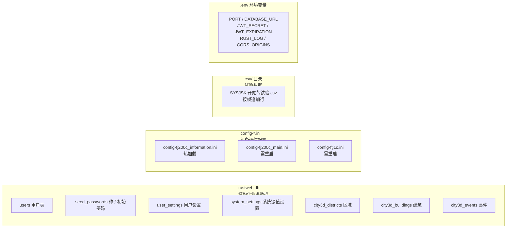

| 数据形态 | 存什么 | 谁写 | 谁读 | 位置 |
|---|---|---|---|---|
| SQLite | 用户、设置、城市 3D 业务数据 | services 层 | 前端 API 调用 | 运行目录 `rustweb.db` |
| INI | 硬件连接与模拟开关配置 | 前端配置页（HTTP PUT 保存）/手工编辑 | 服务启动/热加载 | 运行目录 `config-*.ini` |
| CSV | 试验过程数据 | 采集线程（csv_writer 批量 flush） | 前端数据页 + 报表 | `csv/` 目录 |
| .env | 运行参数 | 手工编辑/deploy.bat 生成 | main.rs 启动时 | 运行目录 `.env` |

### 1.7.1 数据库表清单（共 7 张）

| 表 | 用途 |
|---|---|
| `users` | 用户（id/email/password_hash/is_active，角色走注册表不建表） |
| `seed_passwords` | 种子账号的**随机初始密码明文**（展示用，`GET /admin/pwd` 查询） |
| `user_settings` | 用户设置（如主题偏好） |
| `system_settings` | 系统级键值设置（如 `pwd_route_disabled` 停用开关） |
| `city3d_districts` | 城市区域（种子 5 条） |
| `city3d_buildings` | 城市建筑（种子 51 条） |
| `city3d_events` | 城市事件（种子 8 条） |

**建表与种子数据没有迁移文件**，全部在 `src/database.rs`（1360 行）里用代码建：全部建表 + 全部种子数据包在**一个事务**里（启动毫秒级），幂等（`CREATE TABLE IF NOT EXISTS` + 按固定 UUID `INSERT OR IGNORE`）。还包含幂等清理历史表（user_roles/roles/posts/menu_items/user_devices/data_export_requests 等旧表）与历史角色迁移（moderator→user、user→fj200c_information、fj200c→fj200c_information）。删库重跑会自动重建并填充种子账号。

### 1.7.2 种子账号与密码机制（注意！与直觉相反）

8 个种子账号，邮箱域名是 **@7304.com**：

`admin@7304.com`、`fj200c_information@7304.com`、`fw100@7304.com`、`ftj1c@7304.com`、`city3d@7304.com`、`fw150@7304.com`、`fj200c_main@7304.com`、`protocol_generator@7304.com`

密码机制（`database.rs` 的 `random_password(12)`）：

```rust
// 返回值：(实际入库密码, 展示用随机串)
fn random_password(len: usize) -> (String, String)
```

1. **实际 bcrypt 入库的是固定密码 `"123456"`**——有意保留的开发默认密码，方便所有人开箱即用；
2. **`seed_passwords` 表里存的是一条随机 12 位串**——那是"展示用"的（模拟真实生产环境"初始随机密码"的形态）；
3. 随机明文**不打印启动日志**，通过公开端点 **`GET /admin/pwd`** 查询（无认证，可被管理端停用，见 1.17 节）；
4. 历史库账号缺少 seed_passwords 记录时，启动会一次性迁移补写。

> 新手常踩的坑：登录时用 seed_passwords 表里的随机串会失败，**密码是 123456**；表里那串只是"名义上的初始密码"。

---

## 1.8 目录逐层解析（动手对照）

现在打开你的 VS Code，把项目根目录展开，逐项对照：

### 1.8.1 根目录文件

| 文件/目录 | 是什么 | 需要注意 |
|---|---|---|
| `Cargo.toml` | Rust 后端依赖清单 | `embedded` feature 用于单 exe 打包 |
| `package.json` | npm workspaces 根 | 9 个 workspace（8 前端 + shared）+ `gen:api` 脚本 + 提升的 devDeps |
| `orval.config.ts` | OpenAPI→TS 代码生成配置 | 只由 `npm run gen:api` 驱动 |
| `deploy.bat` | 一键部署脚本 | 顺序不可颠倒（先前端后后端） |
| `build-frontends.ps1` | 并行构建 8 个前端的脚本 | deploy.bat 调用，max 4 并发 |
| `build/vite.base.ts` | 共享 Vite 配置工厂 | `defineAppConfig`，各应用 vite.config.ts 都是薄封装 |
| `src/` | 后端源码 | 主战场 |
| `frontend/` | 8 个前端应用 | 主战场 |
| `packages/shared/` | 共享包 | 公共逻辑集中地 |
| `openapi/` | 生成的 OpenAPI spec | **勿手改**，由测试生成 |
| `config-fj200c_information.ini` 等 | 开发时配置 | 运行目录即根目录，服务读这里 |
| `rustweb.db*` | 开发数据库 | 可随时删，重启自动重建 |
| `csv/` | CSV 输出目录 | 可清空 |
| `deploy/` | 部署产物 | git 忽略，`deploy.bat` 生成 |
| `docs/` | 设计文档 | 现在包含本套教程 |
| `AGENTS.md` | 项目说明 | **最重要的架构文档**，本教程与其一致 |

### 1.8.2 一个前端应用的内部结构（两级目录）

2026 年架构统一后，前端同样采用两级目录：一级 `src/` 只保留模板骨架，角色专有文件全部下沉到二级目录 `src/<role>/`。以 fj200c_information 为例：

```
frontend/fj200c_information/
├── vite.config.ts        # 薄封装：defineAppConfig({app:"fj200c_information", port:5173, ws:true})
├── tsconfig.json         # strict + paths 映射 @/* 和 @shared/*
├── package.json          # 依赖（vue/pinia/router/element-plus/echarts）
├── index.html            # Vite 入口 HTML
├── src/                  # ★ 一级：只保留模板骨架
│   ├── main.ts           # 创建应用：Pinia + Router + ElementPlus（import "@shared/style.css"）
│   ├── App.vue           # 根组件：10 行薄封装 <AppShell/>
│   ├── vite-env.d.ts
│   ├── router/index.ts   # createAppRouter 工厂（守卫 + 路由表）
│   ├── stores/auth.ts    # createAuthStore 工厂（id/appKind/allowedRoles）
│   ├── api/index.ts      # api 实例 + setApiInstance + api 对象
│   ├── types/index.ts    # re-export @shared/types
│   ├── utils/responsive.ts
│   └── views/Login.vue   # 通用登录页薄包装
└── src/fj200c_information/     # ★ 二级：角色专有代码全在这里
    ├── api/fj200c_information.ts   # facade：HTTP + WS 封装
    ├── views/            # Monitor / Visual / Data / Config / Help
    ├── components/       # CommandPanel / DataPanel / ServiceNavButton / StatusBar ...
    ├── composables/      # useFj200cInformationEvents / useService / useCommandChannel ...
    ├── utils/            # hex / check / ascii 工具
    └── fj200c_information.css     # 本应用专属样式
```

**两级目录的意义**：一级骨架在所有 8 个应用里几乎逐字节相同（改一处等于改 8 份的时期已过去——现在这些骨架文件本身也极薄，大部分逻辑在 `packages/shared` 的工厂函数/组件里）；想找"这个应用独有的东西"，直接进二级目录 `src/<role>/`，不用在模板代码里翻。

### 1.8.3 packages/shared 结构

```
packages/shared/src/
├── index.ts               # 统一出口（对外 API，85 行）
├── roles.ts               # MENU_CONFIG 菜单 + ROLE_APP_URLS 应用地址 + loadRoleRegistry()（562 行）
├── types.ts               # re-export generated 类型 + MenuItem（84 行）
├── session.ts             # localStorage 会话（SESSION_KEY="session"）+ buildWebSocketUrl（253 行）
├── router.ts              # createAppRouter 工厂（102 行）
├── responsive.ts          # breakpoints / useResponsive / useLayoutConfig（147 行）
├── style.css              # ★ 全局样式（326 行，6 份相同的本地 style.css 已收敛于此）
├── api/
│   ├── index.ts           # createApiClient：axios 工厂（token 注入/401 处理，120 行）
│   ├── auth.ts            # createAuthApi：登录/用户信息请求封装（24 行）
│   ├── custom-instance.ts # orval mutator：所有生成请求走这里（47 行）
│   └── generated/         # ★ orval 生成，勿手改
│       ├── api/<tag>/*.ts # 10 个 tag 的请求函数
│       └── model/*.ts     # 115 个类型文件
├── stores/auth.ts         # createAuthStore 工厂（228 行，全部应用的认证逻辑）
└── template/
    ├── AppShell.vue       # ★ AppNavbar + router-view + initAuth 的薄壳（46 行，6 个应用使用）
    ├── AppNavbar.vue      # 通用导航栏（764 行，含自动隐藏、brandText 中文角色名）
    ├── LedgerPanel.vue    # ★ 台账面板（151 行，fw100/fw150 共享，props 鸭子类型）
    ├── LoginPage.vue      # 通用登录页（688 行，宇航员动画 + 跨应用跳转）
    └── TemplatePanel.vue  # 模板演示面板（336 行，导出 RoleTemplatePanel）
```

注意共享组件的取舍：**AppShell/LedgerPanel** 等共享组件被 6 个应用复用；**fj200c_main 和 city3d 用自定义 App.vue**（前者要加命令按钮插槽和主题切换，后者要暗色 body），这两个应用的 style.css 也保留本地版本（city3d 是 182 行暗黑变体、fj200c_main 是 48 行精简版），其余 6 个应用统一 `import "@shared/style.css"`。

---

## 1.9 构建与部署全景

### 1.9.1 开发模式（日常开发）

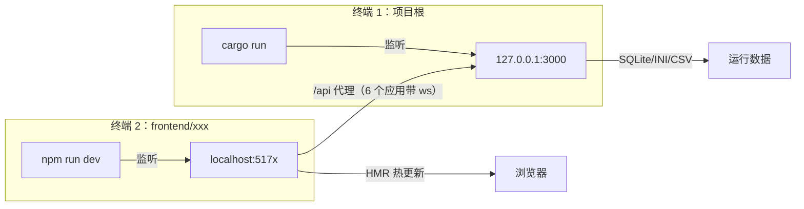

开发时后端读根目录 `rustweb.db`、根目录三个 ini；前端静态资源由 Vite 自己服务，`/api` 代理转发。**后端只负责 API，前端自己渲染自己**。

### 1.9.2 生产模式（单 exe）

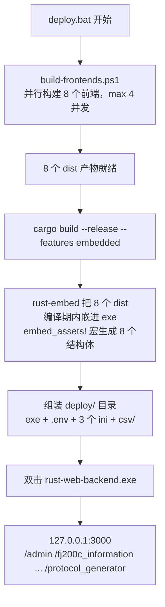

**顺序不可颠倒**——前端必须先构建，因为 dist 是在编译期被嵌进去的（`--features embedded` 启用 rust-embed + mime_guess）。`deploy.bat`（226 行）内部：`build-frontends.ps1` 以 **max 4 并发**并行构建 8 个前端（顺序构建 8 个太慢）→ `cargo build --release --features embedded` → 复制 exe 到 deploy/ → 生成 `.env`（PORT/DATABASE_URL/JWT_SECRET/JWT_EXPIRATION/RUST_LOG/**CORS_ORIGINS**）→ 逐角色复制 config INI + csv 目录。

### 1.9.3 静态托管与 embed 宏

后端双模式（`src/main.rs`，332 行）：

- **dev 模式**（默认）：读磁盘 `dist-*/` 目录（8 个 `dist-<app>`），用 tower-http `ServeDir` 托管；
- **embedded 模式**（`--features embedded`）：`src/embedded_assets.rs` 的 `embed_assets!` 宏一次性生成 8 个 `#[derive(RustEmbed)]` 结构体，`embed_app_routes!` 宏生成 8 组路由（消灭了手写的 24 条路由样板），内存服务静态资源，SPA 深链接回退 index.html；
- 根路径 `/` → 302 重定向到 `/admin`；
- 静态缓存头：`assets/` 永久缓存 immutable，`.html` no-cache。

---

## 1.10 权限体系全景（RBAC）

权限是本项目的骨架，几乎所有改动都涉及它。先建立整体概念：

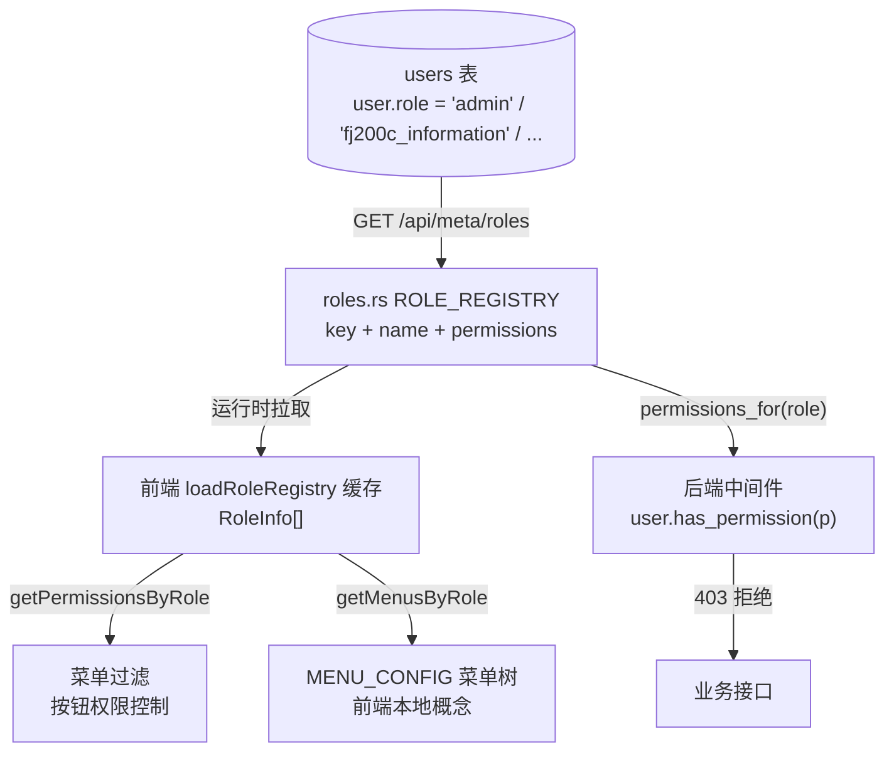

核心要点（后面 03/05 章会逐行展开）：

1. **角色注册表唯一源在后端** `src/roles.rs`：`RoleDef { key, name, permissions }` 数组，8 个角色，通过 `GET /api/meta/roles` 公开；前端**运行时拉取**（`loadRoleRegistry()` 缓存，失败缓存空数组不阻塞登录），无手写副本。
2. **用户只有角色字段**：`users.role = 'fj200c_information'`，权限是查注册表推出来的，不存数据库。
3. **前端菜单是纯 UI 概念**：`packages/shared/src/roles.ts` 的 `MENU_CONFIG`（8 角色菜单树）与 `ROLE_APP_URLS`（应用地址）是**手写**的，按权限过滤后渲染导航栏。
4. **权限点枚举** `Permission`（后端 `src/common/models.rs`）：**12 个值**，前后端类型同步。
5. **三层落地**：路由层中间件（后端强制）、路由守卫（前端路由）、按钮禁用（前端 UI）。

### 1.10.1 角色 × 权限表（8 角色 × 12 权限）

`Permission` 枚举 12 个变体：`Fj200cInformationMonitor`、`Fw100Monitor`、`Ftj1cMonitor`、**`Ftj1cHelp`**、`City3dView`、`Fw150Monitor`、`Fj200cMainMonitor`、**`ProtocolGeneratorMonitor`**、`UsersRead`、`UsersWrite`、`UsersDelete`、`SystemAdmin`。

| 角色 key | 权限 | 对应前端 | dev 端口 |
|---|---|---|---|
| `admin` | SystemAdmin + UsersRead/Write/Delete | admin | 5174 |
| `fj200c_information` | Fj200cInformationMonitor | fj200c_information | 5173 |
| `fj200c_main` | Fj200cMainMonitor | fj200c_main | 5179 |
| `fw100` | Fw100Monitor | fw100 | 5175 |
| `fw150` | Fw150Monitor | fw150 | 5178 |
| `ftj1c` | **Ftj1cMonitor + Ftj1cHelp** | ftj1c | 5176 |
| `city3d` | City3dView | city3d | 5177 |
| `protocol_generator` | ProtocolGeneratorMonitor | protocol_generator | 5180 |

注意 `ftj1c` 是唯一拥有**两个**业务权限点的角色：`Ftj1cHelp` 只用于保护 `GET /api/ftj1c/help` 这一个帮助文档端点（帮助页可以不开放给所有通信监控用户）。

---

## 1.11 本章小结与自测

读到这里，你应该能回答：

1. 这个系统有几个前端应用？为什么是 8 个？各自什么端口？
2. 哪 6 个应用的 Vite 代理开了 `ws: true`？为什么 admin 和 protocol_generator 不需要？
3. 后端两级目录结构是什么规则？哪些角色没有二级目录？
4. 一次 HTTP 请求要经过哪些层？统一响应结构是什么？
5. WS 数据是怎么从采集线程到浏览器的？广播载荷为什么是 `Arc<str>`？
6. 种子账号密码到底是多少？`seed_passwords` 表存的是什么？怎么查？
7. RBAC 的角色注册表在哪里？前端菜单又在哪里？谁驱动谁？

如果都能答上来，恭喜你，地图已经建立。下一章进入第一片主战场：Rust 语法速成（以本项目代码为教材）。

---

## 1.12 深入：Cargo.toml 依赖逐个讲（新手对照表）

新手打开 `Cargo.toml` 往往一头雾水，这里把每个依赖讲透。这些依赖分成六组，每一组对应一类能力：

```toml
# ---- 第一组：Web 框架三件套 ----
axum = { version = "0.7", features = ["ws"] }        # Web 框架本体 + WebSocket 支持
tokio = { version = "1.0", features = ["macros", "net", "sync", "signal", "rt-multi-thread"] }
tower-http = { version = "0.5", features = ["cors", "fs", "trace"] }  # CORS + 静态文件 + 日志
futures-util = "0.3"                                  # WS 消息流操作（StreamExt 扩展）
```

| 依赖 | 类比（你熟悉的语言） | 在本项目中的角色 |
|---|---|---|
| axum | Express / Flask / Spring MVC | 路由注册、请求处理、WS 升级 |
| tokio | Node.js 事件循环 / asyncio | 所有 `async fn` 的调度器；HTTP 服务建立 |
| tower-http | CORS 中间件库 | 开发时前端跨域放行；静态文件服务；TraceLayer |
| futures-util | — | WebSocket 双向流需要 `.next()` 取消息 |

```toml
# ---- 第二组：数据与序列化 ----
serde = { version = "1.0", features = ["derive"] }   # 序列化（JSON 转换）
serde_json = "1.0"                                    # JSON 具体实现
sqlx = { version = "0.7", features = ["runtime-tokio-rustls", "sqlite", "chrono", "uuid"] }
csv = "1"                                             # CSV 读写
configparser = "3"                                    # INI 配置解析
rust_xlsxwriter = "0.97.0"                            # Excel 导出（protocol_generator）
```

| 依赖 | 类比 | 说明 |
|---|---|---|
| serde | JSON.stringify / Gson | `#[derive(Serialize, Deserialize)]` 后结构体可自动转 JSON |
| sqlx | 手写 SQL 的连接池 + PreparedStatement | **不是 ORM**！本项目手写 SQL 字符串 |
| csv | pandas.to_csv | 试验数据记录 |
| configparser | configparser（Python） | 读 `config-*.ini` |
| rust_xlsxwriter | Apache POI / openpyxl | 内存生成 .xlsx（协议生成模块导出 Excel） |

```toml
# ---- 第三组：认证与安全 ----
jsonwebtoken = { version = "10.3", features = ["rust_crypto"] }  # JWT 签发/验证
bcrypt = "0.15"         # 密码哈希（不可逆）
validator = { version = "0.16", features = ["derive"] }  # 输入校验
uuid = { version = "1.0", features = ["v4", "serde"] }   # 主键
chrono = { version = "0.4", features = ["serde"] }       # 时间
dotenvy = "0.15"        # .env 环境变量（dotenv 维护分支）
```

> 注意 jsonwebtoken 的两处坑（Cargo.toml 注释原文）：`>= 10.3.0` 修复了 CVE-2026-25537（畸形 nbf/exp 类型绕过时间校验）；且 10.x 起默认 features 不含 crypto 后端，必须显式启用 `rust_crypto`（纯 Rust，HS256 足够），否则运行时 panic。

```toml
# ---- 第四组：日志 ----
tracing = "0.1"                                    # 日志门面（类似 log4j/slf4j）
tracing-subscriber = { version = "0.3", features = ["env-filter"] }  # 日志输出实现
```

`RUST_LOG=debug cargo run` 就能看到调试日志，这是后端调试的第一手段。

```toml
# ---- 第五组：硬件与通信 ----
serialport = "4"   # 串口（COM3、115200 波特率...）
socket2 = "0.5"    # UDP 底层 socket 选项（SO_REUSEADDR 组播）
arc-swap = "1"     # 原子交换指针（无锁共享最新数据，fj200c_main 五路最新帧）
rand = "0.8"       # 模拟数据随机数
```

```toml
# ---- 第六组：OpenAPI 与打包 ----
utoipa = { version = "5", features = ["chrono", "uuid"] }  # 代码→OpenAPI 文档
rust-embed = { version = "8", optional = true }   # 编译期把前端 dist 嵌进 exe（仅 embedded feature）
mime_guess = { version = "2", optional = true }   # 根据扩展名猜 Content-Type（仅 embedded feature）
```

**给新手的读依赖建议**：不需要记住所有依赖，只需要知道"我想做什么事 → 查对应依赖"：写接口找 axum、查数据库找 sqlx、解析配置找 configparser、日志找 tracing、硬件找 serialport/socket2、Excel 导出找 rust_xlsxwriter。

---

## 1.13 深入：运行时进程与线程模型

后端是一个进程（`rust-web-backend.exe`），内部线程分成三大类，理解这个模型对排查"为什么卡住/为什么重启不了"至关重要：

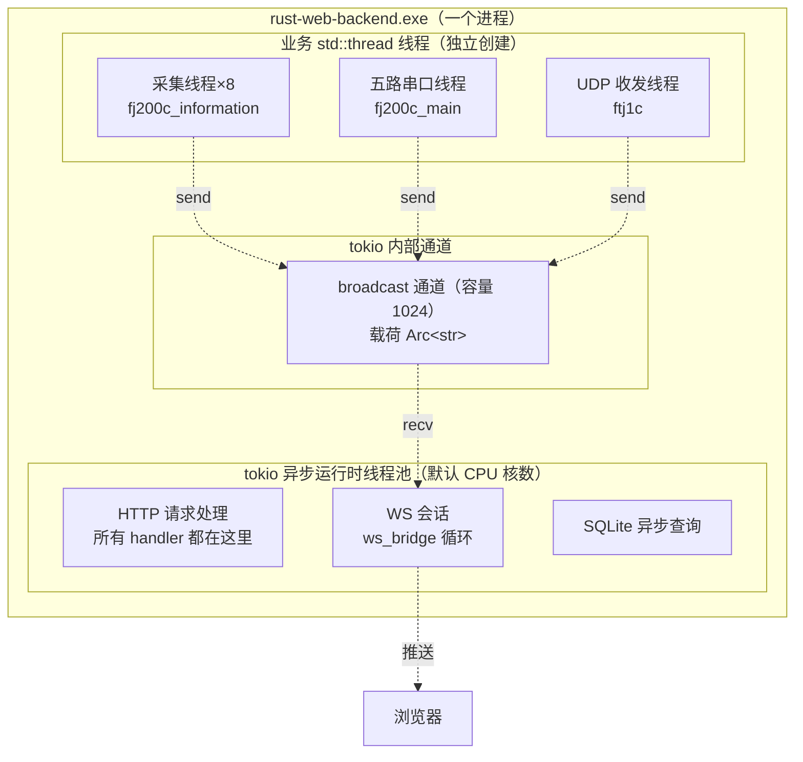

关键结论：

1. **采集线程阻塞是正常的**：串口 `read` 是阻塞式 API，所以硬件代码用 `std::thread` 而不是 async——卡住采集线程不会卡 HTTP。
2. **broadcast 是桥**：两套线程模型之间只有广播通道这一个通信点，采集线程 `send` 永不阻塞（除非 1024 个消费者都太慢导致被丢弃）。
3. **重启服务 = join 线程**：`stop_service` 把停止标志置 true，线程循环退出，主线程 join 等待，超时强杀；`ServiceRuntime::stop_in_background()` 提供异步停止骨架。
4. **HTTP 是 async 的**：handler 里如果做 CPU 密集（如 bcrypt 校验密码），用 `spawn_blocking` 丢到阻塞线程池，避免卡住整个 HTTP 服务——`src/common/auth/services.rs` 里就有这个例子。

---

## 1.14 深入：8 个前端应用逐个认识

### 1.14.1 admin（管理后台，端口 5174）

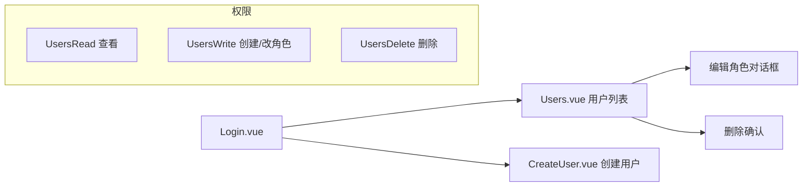

页面：
- **Users.vue**（570 行）：用户表格 + 搜索框（用户名/邮箱）+ 角色筛选下拉 + 分页 + "编辑角色"对话框 + "删除"按钮 + 「**停用初始密码查询**」勾选框（读写 `GET/PUT /api/users/settings/pwd-route`，关掉后 `/admin/pwd` 返回 403）。按钮用 `authStore.hasPermission(...)` 控制可用性。
- **CreateUser.vue**（259 行）：创建用户表单（用户名/邮箱/密码/角色），角色下拉来自 `getAllRoles()`（后端注册表驱动，新角色自动出现）。
- **NoPermission.vue**（68 行）：403 页面，权限不足时跳到这里（防止守卫死循环）。

特点：admin 是唯一 `appKind: "admin"` 的应用，路由 `homePath: /users`、`noPermission: "403"`；二级目录 `src/admin/` 只有 api/users.ts、api/settings.ts、views 三件。

### 1.14.2 fj200c_information（发动机监控，端口 5173）

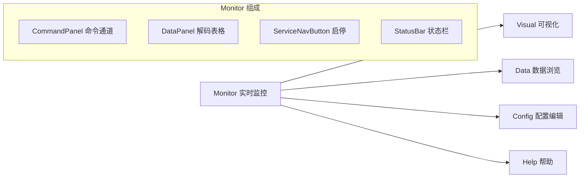

- **Monitor.vue**（412 行）：实时监控主界面。顶部启停服务按钮，中间命令通道（可发自定义 hex 指令），下方解码数据表格（28 个字段），底部状态栏（服务状态/连接/时钟）。
- **Visual.vue**（284 行）：ECharts 六仪表盘 + 实时曲线。
- **Data.vue**（264 行）：左侧 CSV 文件列表，右侧按列渲染表格（文件名防穿越由后端保证）。
- **Config.vue**（77 行）：读取/编辑/保存 `config-fj200c_information.ini`（**热加载**，保存立即生效）。
- **Help.vue**（49 行）：帮助说明页。

### 1.14.3 fj200c_main（发动机测控，端口 5179）——最复杂

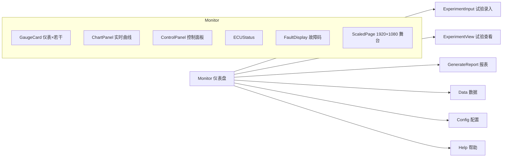

特点（注意：**已经从三路串口升级为五路**，这是与旧文档最大的区别）：

- **五路串口**（`config-fj200c_main.ini` `[COM] Count = 5`）：见下方 1.14.3.1 表格。
- **ScaledPage**：1920×1080 设计稿缩放容器，任意分辨率下布局不变形。
- **双主题**：深色/浅色主题 CSS 变量（`THEME_IS_DARK` 默认深色），主题状态存服务端（WS 广播同步所有页面）。
- **App.vue 级 WS 常驻**：`useBackendPorts` 模块级单例 WS + 引用计数（05 章详述），切页面不断连；App.vue（128 行）是自定义的（不用 AppShell），带 #actions 插槽：保存数据/停止保存、模拟运行/停止模拟（ElMessageBox 确认）、深色/浅色主题按钮。
- **报表**：试验数据 → 状态点插值 → 4 张表（基本信息/性能数据/标准数据/设计点数据）+ 水印 `©7304厂` + `window.print()` 原生打印（打印时隐藏导航栏）。
- **命令面板**：8 个命令按钮（空中起动 0x91、起动 0xA1、燃气发生器冷运转 0xB1、停止冷运转 0xC1、恒定油门设定 0xD1、停车 0xE1、油路排气 0xF1、电控器自检 0x10），帧格式 `EB 90 10` + frame[3] 序号 + frame[15] 校验和。

#### 1.14.3.1 五路串口一览（重要）

| index | Section | 设备 | 帧格式 |
|---|---|---|---|
| 0 | COM0 | ECU 电控器 | **42 字节**，头 `EB 90 2A`（ComSpec：头/38B/偏移 1） |
| 1 | COM1 | Adam4015 环境采集 | `>` 开头 + 8 通道 ASCII（ComSpec：b'>'/57） |
| 2 | COM2 | Adam4117 环境采集 | `>` 开头 + 8 通道 ASCII（ComSpec：b'>'/57） |
| 3 | COM3 | Dyno 测功机 | Dyno 帧（ComSpec：`FF FF`/14/2） |
| 4 | COM4 | Flux 燃油流量 | `FF FF` 头 + u16 流量（与 dyno 规格相同） |

- `types.rs`：`EcuFields`（含 `FaultCodeFlags` 27 个布尔故障位）、`Adam4015Fields{channels:[f64;8]}`、`Adam4117Fields{channels:[f64;8]}`、`DynoFields{njzs,nj,njgl}`（扭矩转速/扭矩/扭矩功率）、`FluxFields{ll}`（燃油流量）、`ChannelData` 枚举（**5 个变体**）、`ExperimentInfo`、`ReportOutput`、`all_csv_entries()` **64 列 CSV 表头**。
- `com.rs`（592 行）：`SharedPortData`（5×LatestFrame + 5×ArcSwap\<Fields\>）、`init_all_from_config`、`start_processing_thread`、mock senders；`define_com_port!` 宏生成五路端口。
- `abstract_com.rs`：`ComSpec` 协议规格表 + `AbstractCom` 抽象。
- `mock.rs`：`MockProfile` 枚举 + `from_section` 启发式映射（MOCK_COM2→Adam4117、MOCK_COM3→Dyno、MOCK_COM4→Flux）。
- **环境参数 8 项映射**（commit f4f950a）：大气温度℃=Adam4117 ch0、大气湿度%=Adam4117 ch1、大气压力KPa=Adam4117 ch2、进口温度℃=Adam4015 ch3、燃油流量L/h=Flux、扭矩转速r/min=Dyno njzs、扭矩N·m=Dyno nj、扭矩功率kW=Dyno njgl。
- **仪表盘**：5 个 GaugeCard（Ng转速 15000/排气温度 1200/测功机功率 50kW/燃油流量 6000/Np转速 15000）+ 环境参数 8 行表格。
- `config-fj200c_main.ini` 修改后**需重启服务**（与 fj200c_information 热加载不同）；`[REPORT] StatePoints` 24 个状态点 30000→53000 步进 1000；`[MOCK] SimulationMenu = true` 模拟运行；`[CSV] Dir = csv`。

### 1.14.4 fw100 / fw150（设备台账，端口 5175/5178）

最简应用：登录 → Panel.vue（**12 行**，就一行 `<LedgerPanel role-key="fw100" permission-key="fw100:monitor" :api="fw100Api"/>`）→ 表格展示 `GET /api/fw100/items` 返回的演示台账数据。后端 `common/ledger.rs` 生成演示数据。**两个应用代码几乎一模一样**，只是路径/端口/类型名不同（fw150 有独立 `Fw150LedgerItem` schema）。`LedgerPanel` 是共享组件：el-table 编号/名称/类别/状态（在线=green tag），通过 `roleKey/permissionKey/api` props 以鸭子类型适配两个应用。

### 1.14.5 ftj1c（UDP 通信监控，端口 5176）

- Monitor.vue（559 行）：4×4 卡片网格（**8 路连接** × 2 张卡片，显示每路 UDP 连接的收发状态与帧内容）；顶部服务控制（启停）；IP 配置对话框（读写 `config-ftj1c.ini` 的 `[IP]` 16 路组播地址：IP0 主/IP1 备/IP2..IP15 扩展，239.0.0.1..239.0.0.16，Port=5000，TimeoutMs=100）。
- **Help.vue**（183 行）：MarkdownIt 渲染 `GET /api/ftj1c/help` 返回的帮助文档（唯一需要 `Ftj1cHelp` 权限的端点，后端 `include_str!("help_doc.md")`）。
- 后端：udp.rs 组播 SO_REUSEADDR + 1MB 接收缓冲、断线重连；process.rs（936 行）mock 200ms 发 `EB 90 5B` 帧、IP11 主链 5-10s 暂停演示、**2 接收 + 6 单发 + 3 串行线程**；com.rs（735 行）ULH→ECEF→CGCS2000 坐标转换。
- **95 字节帧布局**：`EB 90 5B | SLOT 01~04 | SEQ LE u32 | 85B 载荷 | CHECKSUM LE u16`。
- 修改配置需重启服务；WS 由页面内建立（组件级连接模式）。

### 1.14.6 city3d（城市 3D，端口 5177）

- **CityScene.vue**（942 行）：全屏 Three.js 场景 + 玻璃拟态 HUD 覆盖层（区域列表/统计卡片/事件流/底部控制栏）；`/city3d/main` 当前主页面。
- **Panorama.vue**（257 行）：**已废弃未挂路由**，保留作参考。
- **DataPanel.vue**（219 行）：el-tabs CRUD（区域/建筑/事件）。
- **useCityScene**（1200 行）：程序化城市/发光窗户 CanvasTexture/960 点交通粒子 CatmullRom/Bloom/Raycaster 悬停/4 时段昼夜/天气粒子/热力色模式；timeOfDay.ts 4 配置；shaders/ 2 组 GLSL；HudTopBar/StatPanel/EventFeed/BuildingTooltip。
- 数据 **5 秒轮询**（`useCityData`）；天气/时段/热力/自动旋转控制；自定义 App.vue（48 行，暗色 body #0a0e1a）+ 本地 style.css 暗黑变体（182 行）。

### 1.14.7 protocol_generator（协议生成，端口 5180）——第 8 个角色

- 页面：**ProtocolEditor.vue**（363 行）——协议表编辑、参数目录自动填充、**C# 代码生成**、**Excel 导出**、JSON 上传下载、hiprint 打印、Markdown 预览；**CsvEditor.vue**（207 行）——默认参数表读写、CSV 文件导入、导出。
- 菜单：协议编辑 `/protocol_generator/editor`、CSV 参数表 `/protocol_generator/csv`（views/Editor.vue 与 Csv.vue 各 9 行，都是薄包装）。
- 后端：二级目录 `protocol_generator/` 的 models.rs（`ProtocolField{index,byteRange,dataType,length:Option,unit,remark}`、`ParameterDef`、`ProtocolExportRequest`、`CsvParseRequest`、`TextContent`）与 generator.rs（`CSV_HEADERS=[参数名称,别名,单位,数据类型,备注]`、`DEFAULT_CSV_CONTENT` 7 行 BOM 种子、export_markdown 表格、export_excel 用 rust_xlsxwriter 内存 Blob、parse/serialize CSV 兼容 UTF-8 BOM）。
- 类型工具：types/protocol.ts 的 `CSharpTypes` 15 个 C# 类型带大小、`getTypeSize`；utils/protocol.ts 的 `recalcFields` 按类型大小重排序号与字节范围。
- **路由守卫陷阱（历史 bug）**：`homePath` 必须存在于路由表，否则 404 兜底 + 守卫死循环（commit a4a7f7c 修复）。

---

## 1.15 深入：后端"带硬件"模块的共同骨架

fj200c_information / fj200c_main / ftj1c 三个模块虽然业务不同，但骨架完全一致。掌握这个骨架，等于同时掌握三个模块：

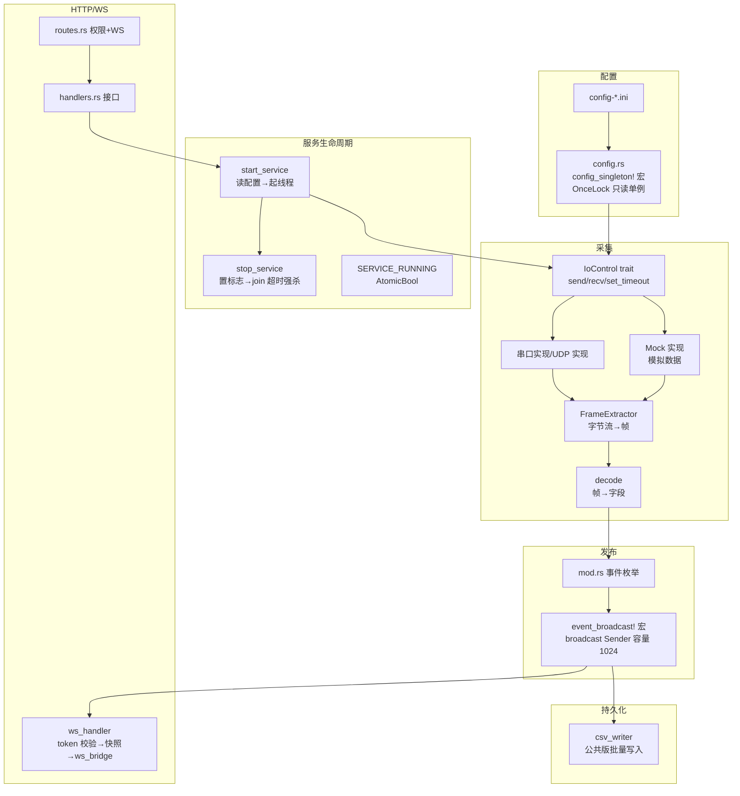

### 1.15.1 三个公共宏（2026 架构统一，commit 61a4b8e）

**① `event_broadcast!`（`src/common/ws.rs`）**——生成角色的全局广播通道单例。以 fj200c_information 的 mod.rs 为例：

```rust
// src/fj200c_information/mod.rs（宏展开后的形态与手写版等价）
event_broadcast!(FJ200C_INFORMATION_TX, fj200c_information_tx);

// 等价于：
static FJ200C_INFORMATION_TX: OnceLock<broadcast::Sender<EventPayload>> = OnceLock::new();

pub fn fj200c_information_tx() -> broadcast::Sender<EventPayload> {
    FJ200C_INFORMATION_TX
        .get_or_init(|| broadcast::channel(1024).0)  // 首次调用创建，之后复用
        .clone()  // 返回克隆（引用计数 +1），多线程各自持有
}
```

关键点：**载荷类型统一是 `EventPayload = Arc<str>`**（`src/common/ws.rs`）。生产端调用 `ws::serialize(&event)` 序列化一次得到 `Arc<str>`，`tx.send()` 只克隆指针；`ws_bridge` 接收后 `Message::Text(payload.to_string())` 转成文本帧——**昂贵的 JSON 序列化只发生一次**，每个客户端只多一次廉价的字符串拷贝。通道容量统一 1024，满丢弃最旧（`Lagged` 降级为 trace 日志，不阻塞采集）。

**② `config_singleton!`（`src/common/config.rs`）**——生成只读配置单例：

```rust
config_singleton!(GLOBAL, global, set_global);
// 展开：static GLOBAL: OnceLock<Config>
//       pub fn global() -> Option<&'static Config>
//       pub fn set_global(cfg: Config) -> Result<(), Config>  // 只能 set 一次
```

fj200c_information / ftj1c 用它（OnceLock 只读）；**fj200c_main 例外**——因需要热替换，保持手写的 `OnceLock<RwLock<Option<Config>>>` + `clear_global()`。

**③ `embed_assets!` / `embed_app_routes!`（`src/embedded_assets.rs`）**——宏生成 8 个 RustEmbed 结构体与 8 组静态路由，消灭手写 24 条路由样板（详见 1.9.3）。

### 1.15.2 关于"配置热加载"的真相

旧文档说 fj200c_information 的配置"热加载"由 notify 文件监听实现——**事实不是**：项目**没有 notify 依赖**。真相是采集线程在会话循环里**每轮重新读配置文件**（`config-fj200c_information.ini` 修改立即生效，无需重启服务）；而 fj200c_main 与 ftj1c 的配置读取时机在服务启动时，所以需要重启。`src/common/csv_writer.rs` 是公共 CSV 写入器（fj200c_information 的 csv_sink.rs 引用公共版，删除本地重复实现）。

### 1.15.3 公共函数

- `ServiceRuntime::stop_in_background()`：异步停止骨架（避免在 handler 里阻塞等待线程 join）。
- `ws::verify_query_token()`：`?token=` 查询参数校验（401）。
- `ws::ws_bridge_with_initial()`：WS 会话主循环，可带初始快照。
- `common::csv_writer`：CSV 批量写入器（公共版，500ms 级别批量 flush，各模块共用）。

---

## 1.16 本章必读文件清单（先读这 6 个文件）

在进入语法章节前，强烈建议先打开这 6 个文件通读一遍（都是小文件）：

| 优先级 | 文件 | 为什么先读它 |
|---|---|---|
| ★★★ | `src/main.rs` | 程序入口，整个启动流程（332 行） |
| ★★★ | `src/routes.rs` | 路由全景，所有接口的挂载点 |
| ★★★ | `src/roles.rs` | RBAC 唯一源，8 个角色定义 |
| ★★☆ | `src/common/models.rs` | Permission 枚举（12 值）+ ApiResponse + User |
| ★★☆ | `src/common/jwt.rs` | JWT 签发验证（167 行，含 jwt::init） |
| ★★☆ | `src/database.rs` 前 150 行 | 建表逻辑 + 种子账号机制 |

读完这 6 个文件，你对后端的骨架就有感觉了；02 章语法速成里会逐行拆解其中的关键代码。

---

## 1.17 深入：安全设计概览（接盘前必知）

本项目虽在工业内网运行，安全设计仍然完善，接盘维护时**不要破坏这些防线**。逐条列出，后续章节会看到具体实现：

### 1.17.1 认证与授权

| 防线 | 实现位置 | 说明 |
|---|---|---|
| 密码存储 | `src/common/auth/services.rs` | bcrypt 哈希（不可逆，登录/创建用户走 `spawn_blocking` 阻塞池），`User.password_hash` `#[serde(skip_serializing)]` + `#[sqlx(default)]` **永不返回哈希** |
| 登录限流 | `src/common/rate_limit.rs` | 滑动窗口 **60 秒 / 5 次**，key = `{ip}:{email}`，`check_and_record()`/`clear()`，CLEANUP_THRESHOLD 10000；登录 handler 用 `ConnectInfo<SocketAddr>` 取 IP |
| 登录凭证 | `src/common/jwt.rs` | HS256 签名 JWT；`jwt::init()` 在 main.rs 启动时调用，缓存 JWT_SECRET 与 JWT_EXPIRATION（默认 86400 秒）到 OnceLock；**dev 模式缺失 JWT_SECRET 用 `"dev-insecure-secret-key"`（warn）；生产模式（!debug_assertions）缺失则拒绝启动** |
| 接口鉴权 | `src/common/middleware.rs` `auth_middleware` | 每个受保护路由必经：验证 Bearer token → 查用户 → 注入 Extension |
| 角色权限 | `permission_middleware` / `role_middleware` | 检查用户是否有特定 Permission 或 SystemAdmin 角色，无则 403 |
| 前端路由守卫 | 各应用 `router/index.ts`（createAppRouter） | 未登录跳登录页，无权限跳回有权限的首页 |
| 前端按钮禁用 | 组件内 `hasPermission` | UI 层控制，权限不足按钮置灰 |

### 1.17.2 数据安全

| 防线 | 实现位置 | 说明 |
|---|---|---|
| CSV 文件名防穿越 | `fj200c_information/handlers.rs` | 校验文件名不含 `..`/`/`，防止 `GET /csv/../../../etc/passwd` 类攻击 |
| 用户角色白名单 | `admin/handlers.rs` | 创建用户时角色必须在注册表内 |
| 不能删自己 | `admin/handlers.rs` | 删除/改角色时校验目标不是当前登录用户 |
| 不能移除自己的管理权限 | 同上 | 防止误操作把自己锁在门外 |
| SQL 注入 | sqlx 绑定参数 `?`/`$1` | 所有查询用绑定参数，不用字符串拼接 |
| 密码回显 | `User` serde skip | 序列化时排除密码字段 |
| 参数校验 | validator crate | 邮箱格式、必填等 `LoginRequest` 声明式校验 |
| 分页钳制 | `city3d/handlers.rs` | `page_size` 上限钳制，防大分页拖垮数据库 |
| 初始密码停用 | `system_settings.pwd_route_disabled` | admin 前端勾选"停用初始密码查询"后，`GET /admin/pwd` 返回 403 |

### 1.17.3 传输层

- 开发环境 CORS 全放行（`allow_origin(Any)`），因为 dev 时前端端口不同；**生产模式必须设置 `CORS_ORIGINS` 环境变量**（逗号分隔白名单），否则拒绝启动（`main.rs`）。
- WS 连接用 `?token=` 查询参数鉴权——浏览器 WS API 无法自定义请求头，这是标准做法；**token 会出现在 URL 里**，属可接受权衡（内网 + 短有效期）。
- 静态缓存头（`static_cache_headers`）：`assets/` 永久缓存 immutable，`.html` no-cache。
- 优雅退出：`with_graceful_shutdown`（Ctrl+C / Windows ctrl_shutdown）。

### 1.17.4 部署安全

- 生产 `.env` 必须配 `JWT_SECRET` 与 `CORS_ORIGINS`（缺失拒绝启动，这是硬性约束不是建议）。
- 服务只绑定 `127.0.0.1`（`src/main.rs`），外网访问才需要改 `0.0.0.0`——默认绑回环是安全默认值。

---

## 1.18 深入：代码风格与阅读约定

这个项目是"教学型代码"：几乎每个语法点都有中文注释。了解它的风格约定，读代码事半功倍：

### 1.18.1 注释约定

```rust
// 行注释：解释"为什么"或"这一步在干嘛"
// 例如：// 顺序不可颠倒：前端 dist 在编译期内嵌进 exe，必须先构建前端再编译后端
```

```rust
/// 文档注释（三斜杠）：函数/类型说明，rust-analyzer 悬停可显示
/// 例如：/// 服务停止：等待线程优雅退出（最长 3 秒），超时强制终止
pub fn stop_service() { ... }
```

```rust
//! 模块级文档注释（文件顶部）：说明整个文件的用途
//! 例如：//! 发动机监控模块（从 fj200c.informatization 迁移）
```

### 1.18.2 命名约定

| 项 | 约定 | 例子 |
|---|---|---|
| 模块/文件 | snake_case | `fj200c_information`、`frame_extractor.rs` |
| 函数 | snake_case | `start_service`、`verify_token` |
| 结构体/枚举 | PascalCase | `ApiResponse`、`Fj200cInformationEvent` |
| 常量 | SCREAMING_SNAKE | `SERVICE_RUNNING`、`CONFIG_PATH` |
| 全局单例 | 类型名小写 + `_tx`/`_()` | `fj200c_information_tx()` |
| HTTP 路径 | 模块同名 | `/api/fj200c_information/service/start` |
| 前端组件 | PascalCase | `CommandPanel.vue` |
| 前端组合式函数 | useXxx | `useService`、`useBackendPorts` |

### 1.18.3 分层职责铁律

读代码时不断自问："这段逻辑放在这一层对吗？"本项目的铁律：

- **handler 不写业务**：只做"取参数 → 调 service → 包装响应"。看到 handler 里出现复杂 SQL 或文件操作，就是坏味道。
- **service 不管 HTTP**：不碰 `Request`/`Response`，只处理数据。
- **routes 只编排**：挂中间件、拼路由，不出现业务。
- **mod.rs 是模块门面**：声明子模块 + 模块级基础设施（事件枚举、广播通道）。

### 1.18.4 错误处理约定

全项目统一 `Result<T, AppError>` + `?` 链。看到 `?` 就理解为"出错就往上抛，交给统一错误处理器"：

```rust
let user = AuthService::login(&db, login_data)
    .await
    .map_err(|e| AppError::bad_request(e.to_string()))?;  // 失败→400 错误
let token = jwt::create_token(&user)?;                    // 失败→500 错误
Ok(Json(ApiResponse::success(LoginResponse { token, user })))
```

前端看到的是：`{ success: false, message: "..." }`，永远一致。

---

## 1.19 深入：全局状态盘点（哪些"全局变量"要心里有数）

Rust 的全局状态用 `OnceLock`（惰性单例）承载，散落在各模块。接盘后排查问题常需要"全局状态地图"：

| 全局单例 | 类型 | 位置 | 用途 |
|---|---|---|---|
| `FJ200C_INFORMATION_TX` | `OnceLock<broadcast::Sender<EventPayload>>` | `src/fj200c_information/mod.rs`（宏展开） | 发动机监控广播 |
| `SERVICE_RUNNING` | `AtomicBool` | `src/fj200c_information/state.rs` | 服务运行标志 |
| `SHARED_DATA` | `SharedData`（16 个候选字段中 7 个启用 + 2 个指纹码，new() 实际初始化 9 个） | `src/fj200c_information/fj200c_information/state.rs` | 最新解码字段 |
| `GLOBAL`（配置） | `OnceLock<Config>` | `src/fj200c_information/fj200c_information/config.rs`（config_singleton! 展开） | 配置单例 |
| `FJ200C_MAIN_TX` | `OnceLock<broadcast::Sender<EventPayload>>` | `src/fj200c_main/mod.rs`（宏展开） | 测控广播 |
| `THEME_IS_DARK` | `AtomicU8 = 1` | `src/fj200c_main/fj200c_main/state.rs` | 主题（默认深色） |
| `SIMULATION_MODE` | `AtomicBool` | 同上 | 模拟运行标志 |
| `CSV_RECORDING` | `AtomicU8` | 同上 | CSV 录制状态机 |
| `ECU_SEND_DATA` | `OnceLock<ArcSwap<String>>` | 同上 | ECU 指令默认串 "EB901000000000000000000000000000" |
| `GLOBAL_VAR` | `GlobalVar`（KV 存储） | `src/common/global_var.rs` | 试验信息/主题等 |
| `FTJ1C_TX` | `OnceLock<broadcast::Sender<EventPayload>>` | `src/ftj1c/mod.rs`（宏展开） | UDP 广播 |
| `QUAD_FRAME` | `OnceLock<Arc<QuadFrame<95>>>` | `src/ftj1c/state.rs` | 最新帧 |
| `RUNTIME` | `ServiceRuntime` | `src/common/service.rs` | 全局线程句柄池 |

特点总结：
1. 全部惰性初始化（首次访问才创建）。
2. 广播通道全部容量 1024、载荷统一 `Arc<str>`，`Sender::clone()` 按引用计数共享。
3. 可变全局状态用 `RwLock`/`Atomic*`/`ArcSwap`，尽量少用 `Mutex`（读多写少场景）。
4. 最新帧用 `ArcSwap`（无锁读，热替换），见 `common/quad_frame.rs` 与 `latest_frame.rs`。

---

## 1.20 项目的时间线：git 历史透露了什么

新人接盘前扫一眼 git log，能快速了解项目演化脉络。近期主线（按时间倒序）：

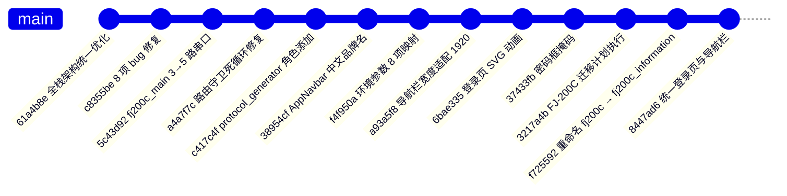

可观察到的演化方向：
1. **fj200c 一拆二**：早期只有一个 fj200c 模块，后来拆成 information（监控）+ main（测控），main 又从三路串口扩到五路。
2. **角色持续增加**：protocol_generator 是最新加入的第 8 个角色（从 demo-protocol 迁移）。
3. **工程化治理**：全栈架构统一（宏收敛、共享组件、共享样式、devDeps 提升、构建脚本并行化）。
4. **稳定性修复**：路由守卫死循环（homePath 缺失）、导航栏自动隐藏——这些是**前车之鉴**：改 shared 组件要小心，一次改动影响 8 个应用。

---

## 1.21 自测题答案与延伸阅读

### 1.21.1 自测题简答（对应 1.11 节）

1. **几个前端？** 8 个：admin/fj200c_information/fj200c_main/fw100/fw150/ftj1c/city3d/protocol_generator，端口 5173~5180（admin 5174）。
2. **WS 代理？** 6 个（fj200c_information/fw100/ftj1c/city3d/fw150/fj200c_main 有 `ws: true`），admin 与 protocol_generator 纯 HTTP 不需要。
3. **两级目录？** 后端一级 `src/<role>/` 只留 mod/handlers/routes/services 骨架，角色专有实现下沉二级 `src/<role>/<role>/`；admin/fw100/fw150/role_template 无二级目录；非 rs 文件（ini 样本、help_doc.md）必须留一级。
4. **请求链路？** 浏览器 → Vite 代理 → Axum 路由 → 中间件链（JWT 鉴权 + 权限）→ handler → service → SQLite → 逐层返回，统一 `ApiResponse<T>` 包装。
5. **WS 链路？** 采集线程（std::thread）→ 预序列化 `Arc<str>` → broadcast 通道（event_broadcast!，容量 1024）→ ws_bridge → 浏览器；连接时先发快照；token 走查询参数。
6. **种子密码？** 登录密码是固定 `123456`（bcrypt 入库）；`seed_passwords` 表存的是随机 12 位"展示用"初始密码，经 `GET /admin/pwd` 查询（可被管理端停用）。
7. **RBAC？** 注册表唯一源在后端 `roles.rs`（8 角色），`GET /api/meta/roles` 运行时同步；前端菜单 `MENU_CONFIG` / `ROLE_APP_URLS` 是纯 UI 手写概念；用户表只存 role 字段。

### 1.21.2 建议延伸阅读顺序

1. 把 `src/main.rs`、`src/routes.rs`、`src/roles.rs` 通读一遍（1.16 节清单）。
2. 启动项目（按 07 章操作），登录 admin，创建用户、切换角色体验权限差异。
3. 开 F12 Network 面板，登录时观察 `POST /api/auth/login` 请求与响应结构。
4. 进入 fj200c_information 应用，启动模拟服务，观察 WS 帧推送（Network 面板 WS 标签页）。

---

## 1.22 端到端案例走读：模拟数据从硬件层到浏览器页面

作为全景章节的收官，我们走一遍最典型的完整业务流——**fj200c_information 启动模拟服务后，数据如何从"虚拟串口"流到浏览器表格**。这个案例把本章讲的所有概念串成一条线。

### 第一步：前端点"启动服务"

用户在 Monitor.vue 顶部点"启动服务"按钮 → `fj200cInformationApi.startService()` → 请求 `POST /api/fj200c_information/service/start`。这个接口带 `Fj200cInformationMonitor` 权限，中间件放行后进入 `handlers.rs` 的 `start_service_handler`：

```rust
// src/fj200c_information/handlers.rs（真实代码）
pub async fn start_service_handler(
    State(_db): State<DatabaseConnection>,
) -> Json<ApiResponse<ServiceStatus>> {
    match service::start_service(fj200c_information_tx()) {
        Ok(()) => Json(ApiResponse::success(ServiceStatus { running: true })),
        Err(e) => Json(ApiResponse::error(e)),
    }
}
```

注意两个细节：handler 不再接收 `AppError`（错误已包进 `ApiResponse::error`）；配置读取发生在 `service::start_service` 内部（从 config_singleton 单例或重新读盘），handler 只传广播 Sender。

### 第二步：后端启动 8 路采集线程

`service.rs` 的 `start_service` 读取 INI（`config-fj200c_information.ini`，`MAX_CONNECTIONS = 8`），对每个 `[ConnectionN]` 节判断 `Enabled`，然后分支到真实串口或模拟器：

```rust
// 伪代码（service.rs 实际逻辑）
for connection in 0..MAX_CONNECTIONS {
    if !config.is_enabled(connection) { continue; }
    if config.mock_enabled() {
        let mock = MockControl::create();            // 模拟数据源（20Hz 正弦+噪声）
        RUNTIME.push(spawn_thread(move || {
            run_one_connection(connection, mock, tx)  // 会话线程
        }));
    } else {
        let port = open_serial_port(connection)?;    // 真实串口
        RUNTIME.push(spawn_thread(move || {
            run_one_connection(connection, port, tx) // 会话线程
        }));
    }
}
```

关键点：**模拟器实现了与串口相同的 `IoControl` trait**——上层代码完全不知道数据来自哪里，这就是"Mock 模式开箱即用"的架构基础。

### 第三步：帧提取、解码与广播（注意帧的真实规格）

模拟器每 50ms 产生一帧（20Hz）。**帧的真实规格以代码常量为准**（`decode.rs` / `mock.rs`）：

```rust
// src/fj200c_information/fj200c_information/decode.rs
pub const FRAME_LEN: usize = 0x3C;                    // 60 字节（不是 100！）
pub const HEADER: [u8; 3] = [0xEB, 0x90, 0x3C];       // 帧头（0x3C 是帧长，不是 0x64）
```

> ⚠️ **踩坑提醒**：decode.rs 文件内**旧注释**写的是"100 字节帧 / 0xEB 0x90 0x64"，那是旧协议残留注释；**代码常量是权威**——60 字节、帧头 `EB 90 3C`。校验和 = 前 59 字节累加 `% 256`，存帧尾。

`FrameType` 枚举 8 个有效值（第 3 字节）：

| 值 | 枚举 | 中文名 | CSV 状态机角色 |
|---|---|---|---|
| 0xEF | CSSZZL | 参数设置 | — |
| 0xED | CSDQZL | 参数读取 | — |
| 0xDE | SYSJXZZL | 试验数据下载 | — |
| 0xDC | SYSJSK | 试验数据首块 | 创建 CSV + 写表头 |
| 0xBD | SYSJZJK | 试验数据中间块 | 每帧追加一行 |
| 0xDB | SYSJMK | 试验数据末块 | flush + 关闭文件 |
| 0xBF | JBCSQCZL | 基本参数清除 | — |
| 0xBE | SYSJQCZL | 试验数据清除 | — |

每个会话线程（`session.rs`，461 行，200ms 节流）循环执行：

```rust
// 伪代码（session.rs）
loop {
    let bytes = io.recv()?;                       // 阻塞读（模拟器每 50ms 产生一帧）
    if let Some(frame) = frame_extractor.process(&bytes) {   // 完整帧（校验和验证）
        if let Some(row) = decode_shared_data(&frame) {      // 28 字段解码
            *SHARED_DATA.update(...) = row;                  // 全局最新状态
            let payload = ws::serialize(&Fj200cInformationEvent::TableData { row })?;
            if tx.send(payload).is_err() { break; }  // 所有接收端关闭则退出
        }
    }
    if SERVICE_RUNNING.is_stopped() { break; }     // 停止标志轮询
}
```

注意：**先 `ws::serialize` 序列化成 `Arc<str>` 再 `send`**——无论多少个 WS 客户端，序列化只发生一次。

### 第四步：WS 桥推送到浏览器

浏览器 Monitor.vue 挂载时建立 WS（`useFj200cInformationEvents`，180 行），后端 `/ws` 路由**不挂权限中间件**（`routes.rs`），在 handler 内用 `ws::verify_query_token()` 校验 `?token=` 后启动 `ws_bridge_with_initial`：订阅广播通道 + 先发一帧当前快照，把每个事件转发为 JSON 文本帧。

### 第五步：前端分发到表格

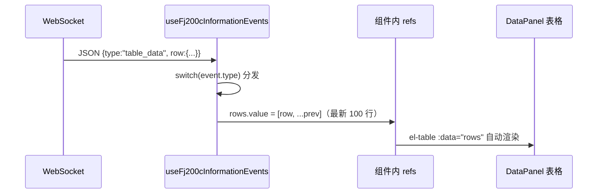

用户看到的效果：**表格每 50ms 跳动一行**（20Hz 模拟帧），状态栏显示"运行中"，点"停止服务"后线程优雅退出。

### 第六步：CSV 记录（可选）

如果 INI 里 `[CSV] Enabled = true`，会话线程同时维护 CSV 状态机：收到 `SYSJSK`（试验开始）帧 → 创建文件 `fj200c_information_YYYYMMDD_HHMMSS.csv` 并写 28 个中文表头（`CSV_HEADERS`）；`SYSJZJK`（数据中）帧 → 每帧追加一行；`SYSJMK`（结束）帧 → flush 关闭。写入经 `csv_sink.rs` 的独立线程（`CsvCommand{Begin,Row,End,Shutdown}`）批量落盘。数据页（Data.vue）调 `GET /api/fj200c_information/csv/files` 列出文件，`GET /csv/{name}` 读取内容。

### 1.22.1 这个案例暴露的架构要点（回顾清单）

1. **trait 抽象（IoControl）**让 Mock/真实硬件可替换——这是硬件模块的灵魂。
2. **状态机（CSV）**用事件驱动，不写一堆 if 嵌套。
3. **全局状态（SHARED_DATA）**与广播（TX）分离：一个给新连接发快照，一个持续推送增量。
4. **预序列化（Arc\<str\>）**让广播成本与客户端数量无关。
5. **线程 + 广播**是唯一数据通路，HTTP 请求（启动/停止/状态）与数据流互不干扰。
6. **前端页面很薄**：WS 收到事件 → store/refs 更新 → 组件自动渲染，没有轮询、没有手动 DOM 操作。

---

## 1.23 补充：API 路由一览表（最新全量）

| 前缀 | 权限要求 | 说明 |
|---|---|---|
| `/api/auth/*` | 公开/已登录 | login、profile（所有角色共用） |
| `/api/meta/roles` | 公开 | 角色注册表（key/name/permissions 唯一源） |
| `/api/users/*` | SystemAdmin + Users* | 用户管理 + `settings/pwd-route` 停用开关 |
| `/admin/pwd` | 公开（可停用） | 种子账号初始密码查询（system_settings 停用开关，停用后 403） |
| `/api/fj200c_information/*` | Fj200cInformationMonitor | service start/stop/status、command、config GET/PUT、csv/files、csv/{name}；`WS /ws?token=` |
| `/api/fj200c_main/*` | Fj200cMainMonitor | service start/stop/status、command、config、csv/files、csv/{name}、recording/toggle、simulation/toggle、theme/set、experiment GET/PUT、report、help；`WS /ws?token=` |
| `/api/fw100/*` | Fw100Monitor | items（`GET /api/fw100/items`） |
| `/api/fw150/*` | Fw150Monitor | items（`GET /api/fw150/items`） |
| `/api/ftj1c/*` | Ftj1cMonitor + **Ftj1cHelp** | service start/stop/status、ip-config、config GET/PUT、**help（Ftj1cHelp 权限）**；`WS /ws?token=` |
| `/api/city3d/*` | City3dView | buildings/districts/events CRUD + overview |
| `/api/protocol_generator/*` | **ProtocolGeneratorMonitor** | default-csv GET/PUT、markdown、excel、csv/parse、csv/serialize |
| `/api-docs/openapi.json` | 公开 | 实时 OpenAPI spec（配合 Swagger UI 等工具） |

**admin 双层中间件**：`role_middleware(SystemAdmin)` 在外，`users_read/write/delete_middleware`（permission_middleware 包装）在内。WebSocket 不走 JWT header（浏览器 WS 不支持自定义头），token 通过 `?token=` 查询参数，handler 内部校验。

**OpenAPI 规模**：48 个 path、60 个 HTTP 操作（不含 WS）、10 个 tag（admin/auth/city3d/fj200c-information/fj200c-main/ftj1c/fw100/fw150/meta/protocol-generator）、115 个 model 文件。`api_docs.rs` 内置断言（路径/operationId 数量），`cargo test export_openapi` 漂移即失败。

---

## 1.24 补充：数据库表结构速查

| 表 | 关键列 | 种子数据 |
|---|---|---|
| `users` | id、email（唯一）、password_hash、role、is_active、created_at | 8 个 @7304.com 账号，bcrypt("123456") |
| `seed_passwords` | username、password（随机 12 位明文）、created_at、updated_at | 8 条，对应种子账号 |
| `user_settings` | 用户维度设置 | — |
| `system_settings` | 键值对（`pwd_route_disabled` 等） | — |
| `city3d_districts` | 区域数据 | 5 条 |
| `city3d_buildings` | 建筑数据 | 51 条 |
| `city3d_events` | 事件数据 | 8 条 |

表设计特点：SQLite 单文件无需安装；外键少（关联靠 service 层查询）；无迁移文件（database.rs 建表 + 种子包在**单事务**内，幂等，启动毫秒级）；历史表（user_roles/roles/posts/menu_items/user_devices/data_export_requests）与冗余索引由启动逻辑幂等清理，旧角色（moderator/user/fj200c）自动迁移到新体系。

---

## 1.25 补充：文档使用的核心概念对照表（翻译手册）

### 1.25.1 中文术语 → 代码概念

| 文档用语 | 代码里的位置 |
|---|---|
| 路由 | routes.rs / Router |
| 接口 | handler + #[utoipa::path] |
| 权限点 | Permission 枚举（12 值） |
| 角色 | roles.rs ROLE_REGISTRY（8 角色） |
| 契约 | openapi.json / generated（115 models） |
| 全局状态 | OnceLock + ArcSwap + Atomic* |
| 数据帧 | 60 字节帧（EB 90 3C） / 42 字节 ECU 帧（EB 90 2A） / 95 字节 UDP 帧（EB 90 5B） |
| 广播 | event_broadcast! + broadcast 通道（Arc\<str\>） |
| 台账 | common/ledger.rs 演示数据 |
| 会话 | JWT + AuthUser |

### 1.25.2 前端术语 → 代码概念

| 文档用语 | 代码里的位置 |
|---|---|
| 页面 | `src/<role>/views/*.vue`（二级目录） |
| 路由守卫 | router.ts createAppRouter |
| 状态管理 | stores/auth.ts + `src/<role>/store/*.ts` |
| 组合式函数 | `src/<role>/composables/*.ts` |
| API 封装 | `src/<role>/api/*.ts` facade |
| 生成代码 | shared/api/generated |
| 实时数据 | WS + session.ts buildWebSocketUrl |
| 共享组件 | shared/template/（AppShell/AppNavbar/LedgerPanel/LoginPage/TemplatePanel） |

### 1.25.3 使用方式

```
读文档遇到术语 → 查此表 → 定位代码位置
改代码时 → 用此表反查文档章节
```

---

## 1.26 补充：设计思想与学习路线（为什么值得学）

### 1.26.1 五个值得学的点

```
1. 契约驱动：类型自动同步（utoipa → openapi.json → orval → TS），前后端不脱节
2. 模块化：8 应用 + 模块化后端，边界清晰
3. 配置驱动：ini 免编译调整（fj200c_information 还支持热加载）
4. 模拟优先：无硬件也能开发演示（Mock/SimulationMenu 开关）
5. 单文件部署：rust-embed 内嵌前端，拷贝即用
```

### 1.26.2 三个真实的工程教训

```
1. 类型不一致的痛（ts-rs 到 utoipa+orval 的升级）
2. 依赖重复的痛（npm workspaces 根目录统一安装 + devDeps 提升）
3. 部署顺序的痛（前端必须先构建，dist 编译期内嵌）
```

### 1.26.3 学习本系统的推荐实战顺序

| 级别 | 任务 |
|---|---|
| 初级（改配置） | 改 .env 端口 / 改 ini 模拟模式 / 改种子账号密码 / 改前端标题 |
| 中级（改逻辑） | 给台账加字段（后端 + 契约 + 前端）/ 加一个查询接口 / 改表格列显示 / 调整 CSV 记录频率 |
| 高级（加功能） | 加新协议（参考 protocol_generator 迁移）/ 加新角色/应用（参考 role_template + AGENTS.md 七步流程）/ 加报表导出 |

### 1.26.4 学完后你能带走的

```
1. Rust + Axum 全栈实战经验
2. Vue 3 多应用工程化经验
3. 契约驱动开发方法论
4. 实时数据系统（WS）实战
5. 完整部署运维经验（deploy.bat 一键部署）
```

---

## 1.27 补充：01 章综合自测（10 题）

1. 8 个前端应用的端口分别是？哪 6 个开了 WS 代理？
2. 后端两级目录的规则是什么？哪些角色的二级目录有哪些文件？
3. 12 个 Permission 变体是哪些？ftj1c 角色为什么有两个权限点？
4. OpenAPI 规模是多少（paths/operations/tags/models）？哪个命令重新生成契约？
5. fj200c_information 的帧规格是什么（帧长/帧头/校验和/FrameType 8 值）？为什么文档强调"以代码常量为准"？
6. fj200c_main 五路串口分别是什么设备？`ChannelData` 枚举有几个变体？CSV 多少列？
7. 种子账号邮箱域名是什么？登录密码是多少？`seed_passwords` 表存的是什么？`GET /admin/pwd` 怎么停用？
8. 登录限流的参数是什么？生产模式下 JWT_SECRET / CORS_ORIGINS 缺失会发生什么？
9. `event_broadcast!` / `config_singleton!` / `embed_assets!` 三个宏各自生成什么？
10. deploy.bat 的构建顺序是什么？build-frontends.ps1 的并发上限是多少？为什么顺序不能颠倒？

**答对 8+ → 01 章地图建立完成**，可以进入语法速成章节。

---

> 下一节：**02-Rust语法速成**——第一片主战场。
