# 01 项目全景：先建立全局地图

> 本章目标：让你在 1~2 小时内建立对整个系统的完整地图——系统是什么、有哪些部分组成、数据怎么流动、目录怎么组织。读完本章你就能在任何代码文件里"找得到北"。
>
> 全文约 1.5 万字，含 8 张 Mermaid 图。建议边读边打开对应文件对照。

---

## 1.1 这个项目到底是个什么系统

### 1.1.1 一句话定位

**RustWeb-Vue 是一套运行在工业内网环境中的"多业务管理平台"**：一个 Rust 编写的后端进程负责登录鉴权、与硬件设备（串口、UDP 组播）通信、数据解码与实时推送；七个 Vue 3 前端应用各自面向一类业务角色，通过浏览器访问同一后端。

这些业务包括：

| 业务 | 干什么 |
|---|---|
| 发动机监控（fj200c_information） | 读取发动机试车台的多路串口数据帧，实时监控、可视化、记录 CSV 试验数据 |
| 发动机测控（fj200c_main） | 更复杂的测控台：ECU/ADAM/DYNO 三路串口同时采集，支持指令下发、试验信息录入、报表生成 |
| 通信监控（ftj1c） | 监控 UDP 组播通信链路（主备双路 + 6 路单连），查看遥测帧数据 |
| 设备台账（fw100 / fw150） | 两套设备台账列表展示（演示数据） |
| 城市 3D（city3d） | 城市区域/建筑/事件的三维可视化展示与数据管理 |
| 管理后台（admin） | 用户管理：创建用户、分配角色、删除用户 |

你可以把它理解成：**一个带登录系统的、前后端分离的、能接硬件数据的工业管理系统**。硬件部分（串口/UDP）都有 Mock 模拟模式，没有真实硬件也能完整体验所有功能——这是项目刻意设计的（配置文件里 `InProcess = true`、`Mock = true` 之类开关）。

### 1.1.2 为什么会有 7 个前端而不是 1 个

这是新人最容易困惑的问题。传统 Web 项目是一个前端包含所有页面，这里却是 7 个独立应用。原因：

1. **按角色隔离**：每个角色只应该看到自己的业务页面。7 个应用与 7 个角色一一对应（admin 对应管理角色，其余 6 个各对应一个业务角色）。
2. **互不干扰**：每个应用独立构建、独立部署路径（`/admin`、`/fj200c_information`...），业务升级一个应用不影响其他。
3. **规模适中**：每个应用其实都不大（几个页面），单页应用的组织成本低。

代价是：公共代码需要抽到 `packages/shared` 共享包，避免 7 份重复代码。这就是"7 个应用长得几乎一模一样"的原因——它们都是同一套模板（同样的 main.ts、同样的 App.vue、同样的认证 store）套出来的。

### 1.1.3 这个项目不是 Tauri 项目

项目目录名带 `TauriProjects` 前缀（仓库上级目录），但本项目**不是 Tauri**：没有 `src-tauri/`，不打包桌面应用，就是一个普通的 Web 前后端项目。上级仓库里的其他目录（demo-base 等）才是 Tauri 项目。别混淆。

---

## 1.2 技术栈总览

### 1.2.1 后端技术栈（Rust）

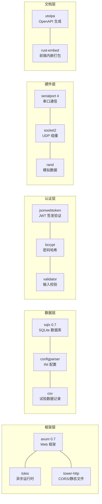

依赖清单在 `Cargo.toml`（项目根目录），按功能分组注释，是个很好的依赖清单范本。核心依赖版本：axum 0.7、sqlx 0.7、tokio 1.x、utoipa 5、rust-embed 8。

### 1.2.2 前端技术栈（Vue）

| 技术 | 版本 | 用途 |
|---|---|---|
| Vue 3 | ^3.5 | 前端框架（组合式 API + `<script setup>`） |
| Vite 6 | ^6.0 | 构建工具与开发服务器 |
| TypeScript | ^5.x | 类型系统（`strict` 模式全开） |
| Element Plus | ^2.x | UI 组件库（表格/表单/弹窗/消息） |
| Pinia | ^2.x | 状态管理 |
| Vue Router | ^4.x | 路由与守卫 |
| ECharts | ^5.x | 图表（fj200c_information/fj200c_main） |
| Three.js | 无直接依赖（city3d 用 importmap/本地构建？见 5.x 章） | 3D 场景（city3d） |

> 注意：7 个应用各自的 `package.json` 依赖并不完全相同。例如只有 city3d 有 three.js、只有 fj200c_information/fj200c_main 有 echarts。但 npm workspaces 模式下，依赖统一在**根目录** `npm install` 一次安装完成。

### 1.2.3 前后端之间的"契约"机制

这是本项目最有特色的部分，必须一开始就建立概念：

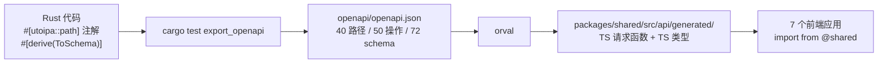

**后端是类型的唯一真相源**：前端调用的每个接口、每个数据结构，都是后端代码注解自动生成的。后端改了接口，`npm run gen:api` 重新生成，前端 `vue-tsc` 立刻报错——报错的地方就是需要同步修改的调用点。这套机制保证了"改了后端不会悄悄破坏前端"。

---

## 1.3 七个前端应用总览

### 1.3.1 应用一览表

| 目录 | 角色 key | 权限 | dev 端口 | prod 路径 | 主要页面 |
|---|---|---|---|---|---|
| `frontend/admin` | admin | SystemAdmin + Users* | 5174 | `/admin` | 登录、用户列表、创建用户、403 |
| `frontend/fj200c_information` | fj200c_information | Fj200cInformationMonitor | 5173 | `/fj200c_information` | 监控、可视化、数据、配置、帮助 |
| `frontend/fj200c_main` | fj200c_main | Fj200cMainMonitor | 5179 | `/fj200c_main` | 监控、试验录入、试验查看、报表、数据、配置、帮助 |
| `frontend/fw100` | fw100 | Fw100Monitor | 5175 | `/fw100` | 台账面板 |
| `frontend/fw150` | fw150 | Fw150Monitor | 5178 | `/fw150` | 台账面板 |
| `frontend/ftj1c` | ftj1c | Ftj1cMonitor | 5176 | `/ftj1c` | 通信监控（单页） |
| `frontend/city3d` | city3d | City3dView | 5177 | `/city3d` | 3D 场景、数据管理、全景 |

### 1.3.2 应用间如何跳转

这 7 个应用共享同一个浏览器 localStorage（同一个域名 `localhost`），token 存同一个 key。登录任何应用后，token 自动带过去；如果登录的账号角色不属于当前应用，登录页会**自动跳转到该角色自己的应用**：

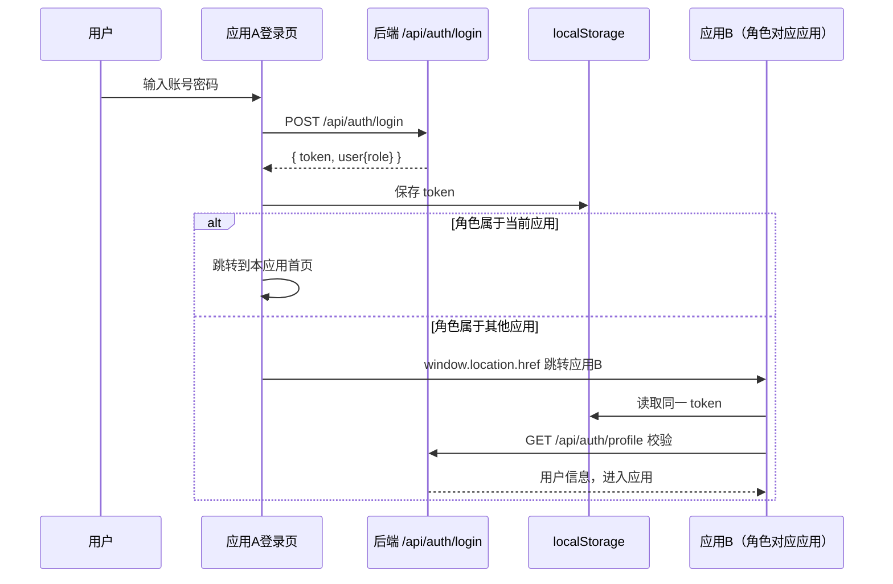

这个跳转逻辑在 `packages/shared/src/template/LoginPage.vue` 里，跳转目标地址在 `packages/shared/src/roles.ts` 的 `ROLE_APP_URLS` 映射表里（dev 是 `http://localhost:517x`，prod 是 `/应用路径`）。

### 1.3.3 为什么端口是 5173~5179

Vite 默认端口就是 5173，后面的应用依次递增，避免 dev 时端口冲突。7 个应用可以**同时启动**，各自连接同一个后端（3000 端口）。这在调试时很方便：开 7 个终端，每个 `npm run dev`。

---

## 1.4 后端模块总览

### 1.4.1 目录树（去注释版）

```
src/
├── main.rs                 # 程序入口：启动编排（日志/配置/数据库/CORS/路由/静态托管）
├── routes.rs               # 路由集中注册：把 9 组子路由拼成一个 Router
├── roles.rs                # 角色注册表 ROLE_REGISTRY（RBAC 的唯一源）
├── database.rs             # 建表 + 种子数据（没有 sqlx 迁移文件，全在这里）
├── api_docs.rs             # utoipa OpenAPI 聚合 + export_openapi 防漂移测试
├── config.rs               # 读取环境变量（PORT/DATABASE_URL）
├── embedded_assets.rs      # 单 exe 模式：编译期内嵌 7 个前端 dist
│
├── common/                 # ★ 公共基础设施（所有角色共用）
│   ├── mod.rs              #   子模块声明 + /health 健康检查
│   ├── models.rs           #   Permission 枚举 + User 模型 + ApiResponse 统一响应
│   ├── middleware.rs       #   auth / permission / role 三个鉴权中间件
│   ├── jwt.rs              #   JWT 签发与验证
│   ├── error.rs            #   AppError 统一错误类型
│   ├── dto.rs              #   公共响应 DTO
│   ├── ws.rs               #   WebSocket 事件桥（broadcast → WS 客户端）
│   ├── auth/               #   登录/用户信息（routes/handlers/services）
│   ├── service.rs          #   ServiceRuntime 服务启停线程管理
│   ├── io.rs               #   IoControl trait（串口/模拟统一抽象）
│   ├── frame_extractor.rs  #   字节流→定长帧提取器
│   ├── quad_frame.rs       #   四槽帧缓冲（主备切换）
│   ├── latest_frame.rs     #   最新帧跟踪器
│   ├── global_var.rs       #   全局 KV 存储（试验信息等）
│   ├── ledger.rs           #   设备台账演示数据
│   ├── csv_writer.rs       #   CSV 批量写入器
│   ├── config.rs           #   INI 配置封装
│   ├── utils.rs            #   hex/时间/CSV 工具函数
│   └── least_squares.rs    #   最小二乘拟合
│
├── admin/                  # 用户管理（SystemAdmin 权限）
│   ├── routes.rs           #   路由：read/write/delete 三组 + 双层中间件
│   ├── handlers.rs         #   4 个 handler
│   └── services.rs         #   UserAdminService
│
├── fj200c_information/     # 发动机监控（最典型的"带硬件"模块）
│   ├── mod.rs              #   事件枚举 + 广播通道
│   ├── state.rs            #   全局状态（服务运行标志 + 16 字段共享数据）
│   ├── config.rs           #   配置单例（config-fj200c_information.ini）
│   ├── decode.rs           #   100 字节帧校验 + 28 字段解码 + CSV 表头
│   ├── frame_bundle.rs     #   帧复合存储
│   ├── com.rs              #   串口控制
│   ├── mock.rs             #   进程内模拟数据源（20Hz 正弦+噪声）
│   ├── mock_feeder.rs      #   虚拟串口对发生器
│   ├── session.rs          #   每连接 IO 会话线程（核心数据流）
│   ├── service.rs          #   服务启停编排（8 路连接）
│   ├── handlers.rs         #   8 个 HTTP + WS
│   └── routes.rs           #   子路由 + 权限中间件
│
├── fj200c_main/            # 发动机测控（最复杂模块，三路串口）
│   ├── mod.rs / state.rs / config.rs
│   ├── types.rs            #   ECU/ADAM/DYNO 三类字段模型 + 64 列 CSV
│   ├── abstract_com.rs     #   ComSpec 协议规格 + AbstractCom
│   ├── com.rs              #   三路串口实现（宏生成）
│   ├── decode.rs / mock.rs / report.rs
│   ├── service.rs / handlers.rs / routes.rs
│
├── ftj1c/                  # UDP 组播通信监控
│   ├── mod.rs / state.rs / config.rs / models.rs
│   ├── udp.rs              #   UDP 控制（Mock/Real 双模式）
│   ├── process.rs          #   主备/单路/模拟 8 个运行函数
│   ├── quad_frame.rs / com.rs / service.rs / handlers.rs / routes.rs
│
├── fw100/  fw150/          # 设备台账（极简：各 4 个文件）
│   └── routes.rs / handlers.rs / services.rs / mod.rs
│
├── city3d/                 # 城市 3D 数据管理
│   ├── models.rs           #   Building/District/CityEvent/Overview
│   ├── routes.rs / handlers.rs / services.rs / mod.rs
│
└── role_template/          # ★ 新角色参考模板（自带 5 步启用说明）
```

### 1.4.2 模块的三种"体型"

看目录就能发现业务模块分三种复杂程度，理解这点对读代码很重要：

| 体型 | 模块 | 特征 |
|---|---|---|
| 极简型（约 100 行/模块） | fw100、fw150 | 只有 `GET /items` 一个接口，返回演示数据 |
| 中型 | admin、city3d | 纯数据库 CRUD，无硬件、无 WS |
| 大型（带硬件+WS） | fj200c_information、fj200c_main、ftj1c | 有串口/UDP/模拟数据源、服务启停、WS 广播、CSV 记录 |

新手接手时，**先读极简型建立模式感**（fw100 四个文件 15 分钟读完），再读中型（admin 理解权限+CRUD），最后啃大型（fj200c_information 是最佳的"硬件模块范本"）。

### 1.4.3 统一的分层模式

每个业务模块都遵循同样的三层结构：

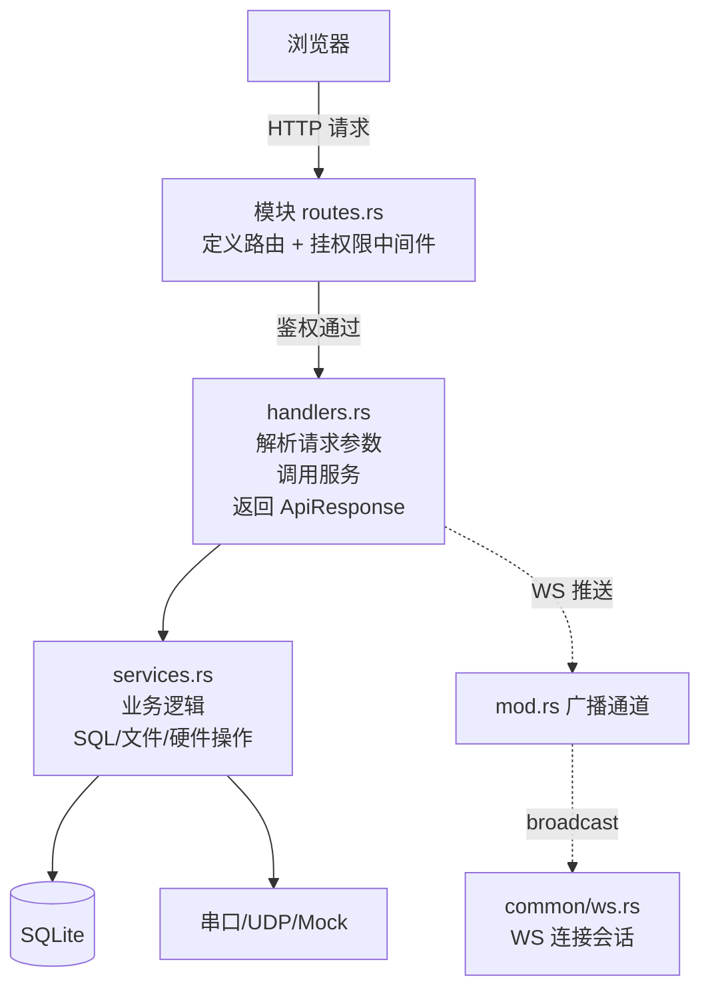

- **routes.rs**：只做路由与中间件编排，不写业务。
- **handlers.rs**：参数提取（`State`/`Json`/`Query`/`Path`）、调用 service、包 `ApiResponse`。带 `#[utoipa::path]` 注解。
- **services.rs**：纯业务逻辑，可复用。
- **mod.rs**：模块声明 + 事件枚举 + 广播通道等"模块级基础设施"。

---

## 1.5 一次完整请求的全链路（HTTP 版）

以"admin 登录后查询用户列表"为例，走一遍完整链路。这是全项目最核心的理解，务必吃透：

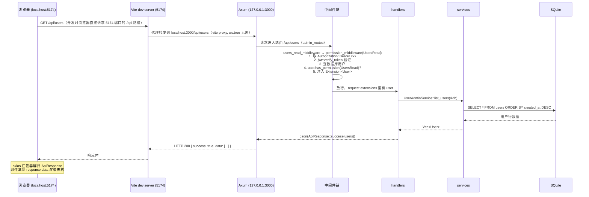

要点提炼：

1. **开发时**浏览器访问的是前端端口，`/api` 路径由 Vite 代理转发到后端（`vite.config.ts` 的 `server.proxy`）；**生产时**前端被后端托管，不存在跨域问题。
2. **每个请求必须带** `Authorization: Bearer <token>` 头，由前端 axios 请求拦截器自动附加。
3. **中间件链按顺序执行**：auth 鉴权 → 权限检查 → 业务 handler。不同路由挂不同中间件组合。
4. **所有响应统一包装**成 `{ success, message, data }`（`ApiResponse<T>`），前端统一用 `response.success / response.data / response.message`。
5. **任何错误**（数据库异常、权限不足、参数错误）都转成 `AppError`，最终输出同样的 JSON 结构，前端错误处理逻辑统一。

---

## 1.6 WebSocket 实时数据链路（硬件模块）

硬件模块（发动机监控/测控、UDP 监控）需要把设备数据**实时推**到浏览器，HTTP 轮询不够，于是用 WebSocket。链路如下：

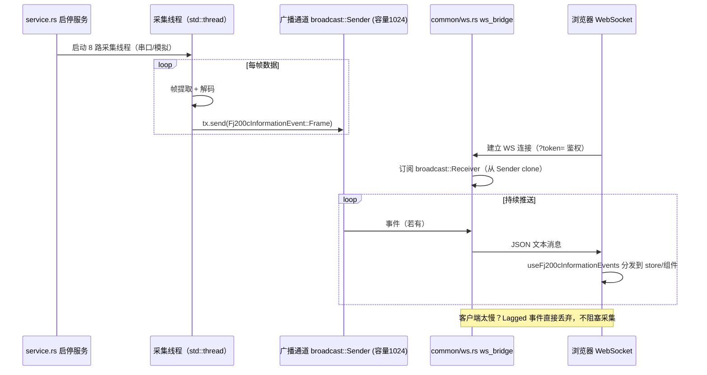

关键设计点（后面章节会逐行展开）：

- **线程模型**：采集线程是普通 `std::thread`（阻塞式串口读），HTTP/WS 是 tokio 异步，两者用 `broadcast::channel(1024)` 桥接，互不阻塞。
- **连接时先发快照**：WS 连接建立后先推一帧当前数据快照，前端刷新页面立刻看到最新状态（而不是等下一帧）。
- **token 走查询参数**：浏览器 WebSocket 无法自定义 HTTP 头，所以 `ws://...?token=xxx`，服务端升级前验证。
- **前端自动重连**：断开 1.5 秒后自动重连，生产环境网络抖动不会白屏。

---

## 1.7 数据存储全景

系统有四种数据形态，分工明确：

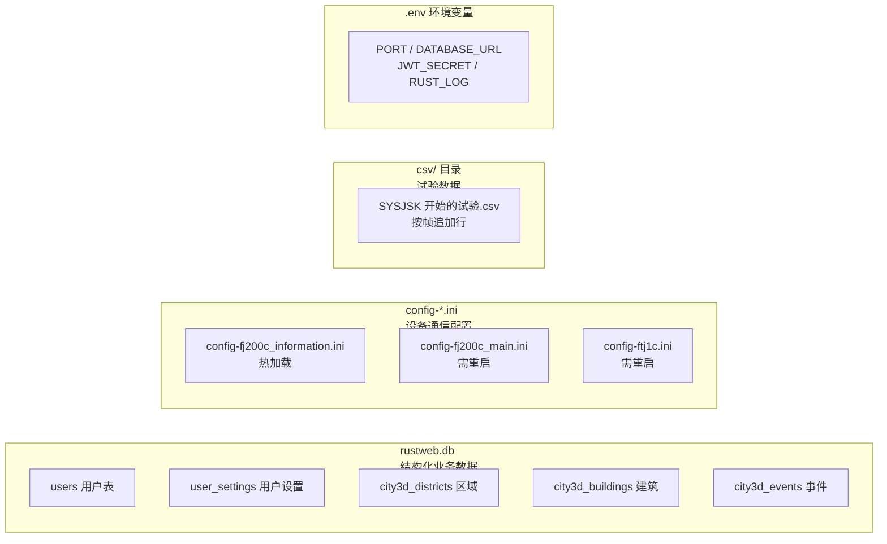

| 数据形态 | 存什么 | 谁写 | 谁读 | 位置 |
|---|---|---|---|---|
| SQLite | 用户、角色、城市 3D 业务数据 | services 层 | 前端 API 调用 | 运行目录 `rustweb.db` |
| INI | 硬件连接与模拟开关配置 | 前端配置页（HTTP PUT 保存）/手工编辑 | 服务启动/热加载 | 运行目录 `config-*.ini` |
| CSV | 试验过程数据 | 采集线程（500ms 批量 flush） | 前端数据页 + 报表 | `csv/` 目录 |
| .env | 运行参数 | 手工编辑/deploy.bat 生成 | main.rs 启动时 | 运行目录 `.env` |

注意：**数据库建表与种子数据没有迁移文件**，全部在 `src/database.rs` 里用代码建（幂等：`CREATE TABLE IF NOT EXISTS` + `INSERT OR IGNORE`）。删库重跑会自动重建并填充种子账号。

---

## 1.8 目录逐层解析（动手对照）

现在打开你的 VS Code，把项目根目录展开，逐项对照：

### 1.8.1 根目录文件

| 文件/目录 | 是什么 | 需要注意 |
|---|---|---|
| `Cargo.toml` | Rust 后端依赖清单 | `embedded` feature 用于单 exe 打包 |
| `package.json` | npm workspaces 根 | 8 个 workspace + `gen:api` 脚本 |
| `orval.config.ts` | OpenAPI→TS 代码生成配置 | 只由 `npm run gen:api` 驱动 |
| `deploy.bat` | 一键部署脚本 | 顺序不可颠倒（先前端后后端） |
| `src/` | 后端源码 | 主战场 |
| `frontend/` | 7 个前端应用 | 主战场 |
| `packages/shared/` | 共享包 | 公共逻辑集中地 |
| `openapi/` | 生成的 OpenAPI spec | **勿手改**，由测试生成 |
| `config-fj200c_information.ini` 等 | 开发时配置 | 运行目录即根目录，服务读这里 |
| `rustweb.db*` | 开发数据库 | 可随时删，重启自动重建 |
| `csv/` | CSV 输出目录 | 可清空 |
| `deploy/` | 部署产物 | git 忽略，`deploy.bat` 生成 |
| `docs/` | 设计文档 | 现在包含本套教程 |
| `AGENTS.md` | 项目说明 | **最重要的架构文档**，本教程与其一致 |

### 1.8.2 一个前端应用的内部结构（以 fj200c_information 为例）

```
frontend/fj200c_information/
├── vite.config.ts        # 端口 5173、base、@shared alias、/api 代理（ws:true）
├── tsconfig.json         # strict + paths 映射 @/* 和 @shared/*
├── package.json          # 依赖（vue/pinia/router/element-plus/echarts）
├── index.html            # Vite 入口 HTML
├── src/
│   ├── main.ts           # 创建应用：Pinia + Router + ElementPlus
│   ├── App.vue           # 根组件：AppNavbar + router-view
│   ├── style.css         # 全局样式
│   ├── router/index.ts   # 路由表 + 守卫
│   ├── stores/auth.ts    # 认证 store（19 行，工厂生成）
│   ├── api/index.ts      # api 实例 + setApiInstance + api 对象
│   ├── api/fj200c_information.ts  # facade：HTTP + WS 封装
│   ├── types/index.ts    # re-export @shared/types
│   ├── utils/responsive.ts
│   ├── fj200c_information/        # ★ 模块业务代码（与 src 平级子目录）
│   │   ├── components/            #   UI 组件
│   │   ├── composables/           #   组合式函数（WS/服务/时钟/命令）
│   │   └── utils/                 #   hex/校验工具
│   └── views/                     # 页面
│       ├── Login.vue
│       └── fj200c_information/    # Monitor/Visual/Data/Config/Help
```

`fj200c_information/` 业务子目录与 `src/` 平级是刻意设计：业务代码（组件、组合式函数、工具）与框架代码（main/router/store/api）分离，保持页面层很薄。

### 1.8.3 packages/shared 结构

```
packages/shared/src/
├── index.ts               # 统一出口（对外 API）
├── roles.ts               # 角色菜单注册表 MENU_CONFIG + 应用地址 ROLE_APP_URLS + 注册表加载
├── types.ts               # re-export generated 类型 + MenuItem
├── session.ts             # localStorage 会话 + buildWebSocketUrl
├── api/
│   ├── index.ts           # createApiClient：axios 工厂（token 注入/401 处理）
│   ├── auth.ts            # 登录/用户信息请求封装
│   ├── custom-instance.ts # orval mutator：所有生成请求走这里
│   └── generated/         # ★ orval 生成，勿手改
│       ├── api/<tag>/*.ts # 9 个 tag 的请求函数
│       └── model/*.ts     # 100+ 类型文件
├── stores/auth.ts         # createAuthStore 工厂（全部应用的认证逻辑）
└── template/
    ├── AppNavbar.vue      # 通用导航栏（690 行，含自动隐藏）
    ├── LoginPage.vue      # 通用登录页（683 行，宇航员动画）
    └── TemplatePanel.vue  # 模板演示面板
```

---

## 1.9 构建与部署全景

### 1.9.1 开发模式（日常开发）

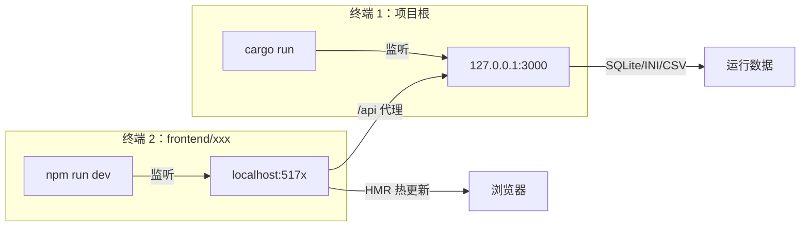

开发时后端读根目录 `rustweb.db`、根目录三个 ini；前端静态资源由 Vite 自己服务，`/api` 代理转发。**后端只负责 API，前端自己渲染自己**。

### 1.9.2 生产模式（单 exe）

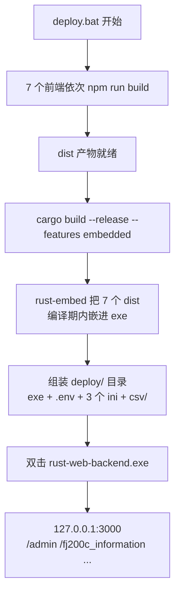

生产模式后端同时是静态文件服务器：访问 `/fj200c_information` 直接返回内嵌的前端页面（SPA 深链接回退 index.html）。**顺序不可颠倒**——前端必须先构建，因为 dist 是在编译期被嵌进去的。

---

## 1.10 权限体系全景（RBAC）

权限是本项目的骨架，几乎所有改动都涉及它。先建立整体概念：

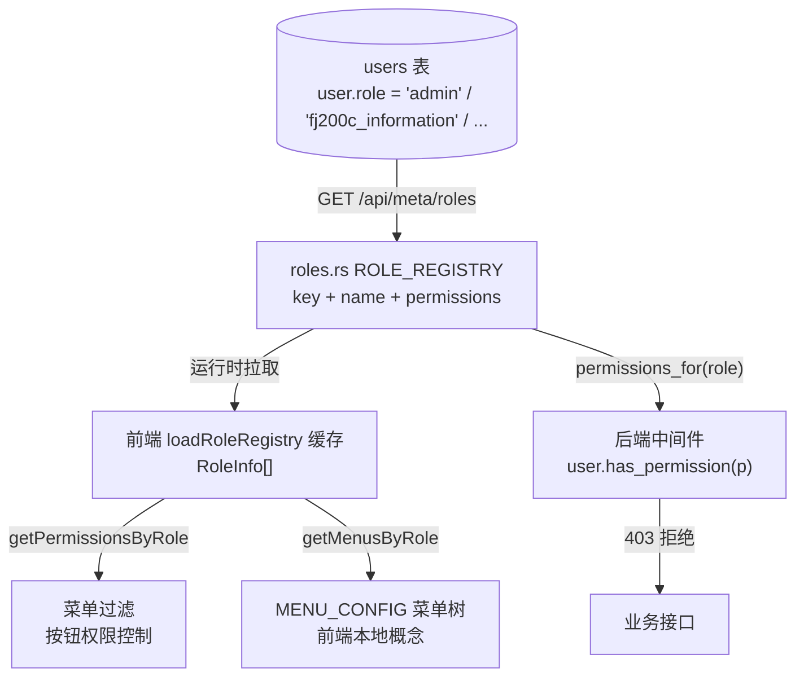

核心要点（后面 03/05 章会逐行展开）：

1. **角色注册表唯一源在后端** `src/roles.rs`：`RoleDef { key, name, permissions }` 数组，7 个角色。
2. **用户只有角色字段**：`users.role = 'fj200c_information'`，权限是查注册表推出来的，不存数据库。
3. **前端菜单是纯 UI 概念**：`packages/shared/src/roles.ts` 的 `MENU_CONFIG` 手写，按权限过滤后渲染导航栏。
4. **权限点枚举** `Permission`（后端 `src/common/models.rs`）：10 个值，前后端类型同步。
5. **三层落地**：路由层中间件（后端强制）、路由守卫（前端路由）、按钮禁用（前端 UI）。

---

## 1.11 本章小结与自测

读到这里，你应该能回答：

1. 这个系统有几个前端应用？为什么是 7 个？各自什么端口？
2. 后端有几个模块？分哪三种体型？
3. 一次 HTTP 请求要经过哪些层？统一响应结构是什么？
4. WS 数据是怎么从采集线程到浏览器的？中间隔着什么？
5. 前后端类型契约是怎么保证的？
6. 开发模式和生产模式静态资源分别由谁提供？
7. RBAC 的角色注册表在哪里？前端菜单又在哪里？谁驱动谁？

如果都能答上来，恭喜你，地图已经建立。下一章进入第一片主战场：Rust 语法速成（以本项目代码为教材）。

## 1.12 深入：Cargo.toml 依赖逐个讲（新手对照表）

新手打开 `Cargo.toml` 往往一头雾水，这里把每个依赖讲透。这些依赖分成六组，每一组对应一类能力：

```toml
# ---- 第一组：Web 框架三件套 ----
axum = { version = "0.7", features = ["ws"] }        # Web 框架本体 + WebSocket 支持
tokio = { version = "1.0", features = ["full"] }     # 异步运行时（"full" 全部功能）
tower-http = { version = "0.5", features = ["cors", "fs"] }  # CORS 中间件 + 静态文件服务
futures-util = "0.3"                                  # WS 消息流操作（StreamExt 扩展）
```

| 依赖 | 类比（你熟悉的语言） | 在本项目中的角色 |
|---|---|---|
| axum | Express / Flask / Spring MVC | 路由注册、请求处理、WS 升级 |
| tokio | Node.js 事件循环 / asyncio | 所有 `async fn` 的调度器；HTTP 服务建立 |
| tower-http | CORS 中间件库 | 开发时前端跨域放行；dev 模式静态文件服务 |
| futures-util | — | WebSocket 双向流需要 `.next()` 取消息 |

```toml
# ---- 第二组：数据与序列化 ----
serde = { version = "1.0", features = ["derive"] }   # 序列化（JSON 转换）
serde_json = "1.0"                                    # JSON 具体实现
sqlx = { version = "0.7", features = ["runtime-tokio-rustls", "sqlite", "chrono", "uuid"] }
csv = "1"                                             # CSV 读写
configparser = "3"                                    # INI 配置解析
```

| 依赖 | 类比 | 说明 |
|---|---|---|
| serde | JSON.stringify / Gson | `#[derive(Serialize, Deserialize)]` 后结构体可自动转 JSON |
| sqlx | 手写 SQL 的连接池 + PreparedStatement | **不是 ORM**！本项目手写 SQL 字符串 |
| csv | pandas.to_csv | 试验数据记录 |
| configparser | configparser（Python） | 读 `config-*.ini` |

```toml
# ---- 第三组：认证与安全 ----
jsonwebtoken = "9.2"    # JWT 签发/验证
bcrypt = "0.15"         # 密码哈希（不可逆）
validator = { version = "0.16", features = ["derive"] }  # 输入校验
uuid = { version = "1.0", features = ["v4", "serde"] }   # 主键
chrono = { version = "0.4", features = ["serde"] }       # 时间
dotenv = "0.15"         # .env 环境变量
```

```toml
# ---- 第四组：日志 ----
tracing = "0.1"                                    # 日志门面（类似 log4j/slf4j）
tracing-subscriber = { version = "0.3", features = ["env-filter"] }  # 日志输出实现
```

`RUST_LOG=debug cargo run` 就能看到调试日志，这是后端调试的第一手段。

```toml
# ---- 第五组：硬件与通信 ----
serialport = "4"   # 串口（COM3、115200 波特率...）
socket2 = "0.5"    # UDP 底层 socket 选项（SO_REUSEADDR 组播）
arc-swap = "1"     # 原子交换指针（无锁共享最新数据）
rand = "0.8"       # 模拟数据随机数
```

```toml
# ---- 第六组：OpenAPI 与打包 ----
utoipa = { version = "5", features = ["chrono", "uuid"] }  # 代码→OpenAPI 文档
rust-embed = "8"   # 编译期把前端 dist 嵌进 exe
mime_guess = "2"   # 根据扩展名猜 Content-Type
```

**给新手的读依赖建议**：不需要记住所有依赖，只需要知道"我想做什么事 → 查对应依赖"：写接口找 axum、查数据库找 sqlx、解析配置找 configparser、日志找 tracing、硬件找 serialport/socket2。

---

## 1.13 深入：运行时进程与线程模型

后端是一个进程（`rust-web-backend.exe`），内部线程分成三大类，理解这个模型对排查"为什么卡住/为什么重启不了"至关重要：

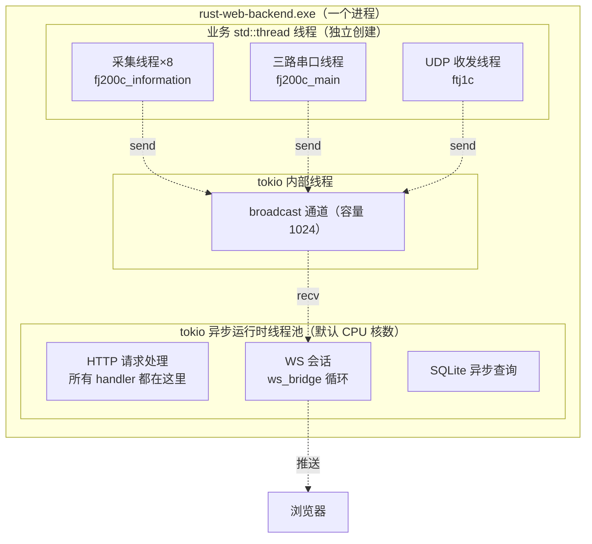

关键结论：

1. **采集线程阻塞是正常的**：串口 `read` 是阻塞式 API，所以硬件代码用 `std::thread` 而不是 async——卡住采集线程不会卡 HTTP。
2. **broadcast 是桥**：两套线程模型之间只有广播通道这一个通信点，采集线程 `send` 永不阻塞（除非 1024 个消费者都太慢导致被丢弃）。
3. **重启服务 = join 线程**：`stop_service` 把停止标志置 true，线程循环退出，主线程 join 等待，超时 3 秒强杀（`wait_stopping`）。
4. **HTTP 是 async 的**：handler 里如果做 CPU 密集（如 bcrypt 校验密码），用 `spawn_blocking` 丢到阻塞线程池，避免卡住整个 HTTP 服务——`src/common/auth/services.rs` 里就有这个例子。

---

## 1.14 深入：7 个前端应用逐个认识

### 1.14.1 admin（管理后台，端口 5174）

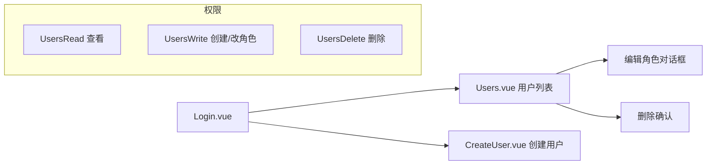

页面：
- **Users.vue**（507 行）：用户表格 + 搜索框（用户名/邮箱）+ 角色筛选下拉 + 分页 + "编辑角色"对话框 + "删除"按钮。按钮用 `authStore.hasPermission(...)` 控制可用性。
- **CreateUser.vue**（260 行）：创建用户表单（用户名/邮箱/密码/角色），角色下拉来自 `getAllRoles()`（后端注册表驱动，新角色自动出现）。
- **NoPermission.vue**：403 页面，权限不足时跳到这里（防止守卫死循环）。

特点：admin 是唯一 `appKind: "admin"` 的应用，菜单来自 `adminMenus`，登录后跳 `/users`。

### 1.14.2 fj200c_information（发动机监控，端口 5173）

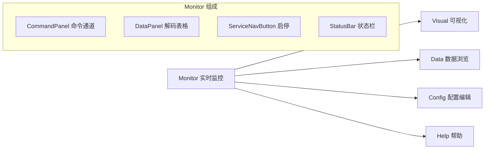

- **Monitor.vue**（411 行）：实时监控主界面。顶部启停服务按钮，中间命令通道（可发自定义 hex 指令），下方解码数据表格（28 个字段），底部状态栏（服务状态/连接/时钟）。
- **Visual.vue**：ECharts 六仪表盘 + 实时曲线。
- **Data.vue**：左侧 CSV 文件列表，右侧按列渲染表格（文件名防穿越由后端保证）。
- **Config.vue**：读取/编辑/保存 `config-fj200c_information.ini`（热加载，保存立即生效）。
- **Help.vue**：帮助说明页。

### 1.14.3 fj200c_main（发动机测控，端口 5179）——最复杂

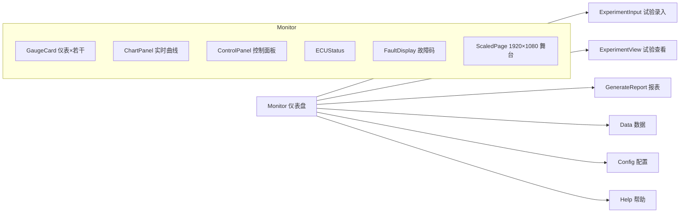

特点：
- **ScaledPage**：1920×1080 设计稿缩放容器，任意分辨率下布局不变形。
- **双主题**：深色/浅色主题 CSS 变量，主题状态存服务端（WS 广播同步所有页面）。
- **三路数据**：ECU（发动机）/ADAM（采集模块）/DYNO（测功机）三路串口，dashboard store 统一管理。
- **报表**：试验数据 → 状态点插值 → 报表生成（原生打印方案）。
- **App.vue 级 WS 常驻**：模块级单例 WS + 引用计数（05 章详述），切页面不断连。

### 1.14.4 fw100 / fw150（设备台账，端口 5175/5178）

最简应用：登录 → 一个 Panel.vue（138 行）→ 表格展示 `GET /api/fw100/items` 返回的演示台账数据。后端 `common/ledger.rs` 生成演示数据。**两个应用代码几乎一模一样**，只是路径/端口/类型名不同（fw150 有独立 `Fw150LedgerItem` schema）。

### 1.14.5 ftj1c（UDP 通信监控，端口 5176）

单页应用：Monitor.vue（559 行）4×4 卡片网格（8 路连接 × 2 张卡片），显示每路 UDP 连接的收发状态与帧内容；顶部服务控制（启停）；配置对话框（读写 `config-ftj1c.ini`）。WS 连接由页面内建立（组件级连接模式）。

### 1.14.6 city3d（城市 3D，端口 5177）

- **CityScene.vue**（999 行）：全屏 Three.js 场景（建筑/星空/粒子/Bloom 光效/昼夜循环/天气/热力） + 玻璃拟态 HUD 覆盖层（统计卡片、区域列表、事件流、建筑悬停浮窗）。
- **DataPanel.vue**：数据管理（区域/建筑/事件 CRUD）。
- **Panorama.vue**：全景展示页。
- 数据 5 秒轮询（`useCityData`），场景渲染循环在 `useCityScene`（1200 行）。

---

## 1.15 深入：后端"带硬件"模块的共同骨架

fj200c_information / fj200c_main / ftj1c 三个模块虽然业务不同，但骨架完全一致。掌握这个骨架，等于同时掌握三个模块：

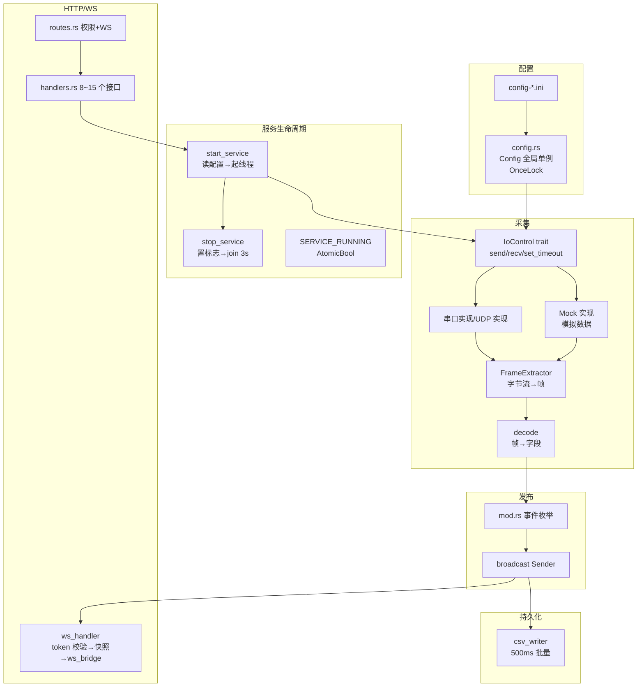

每个模块的 `mod.rs` 里都有一个 `xxx_tx()` 函数返回全局唯一的 broadcast Sender：

```rust
pub static FJ200C_INFORMATION_TX: OnceLock<broadcast::Sender<Fj200cInformationEvent>> = OnceLock::new();

pub fn fj200c_information_tx() -> broadcast::Sender<Fj200cInformationEvent> {
    FJ200C_INFORMATION_TX
        .get_or_init(|| broadcast::channel(1024).0)  // 首次调用创建，之后复用
        .clone()  // 返回克隆（引用计数 +1），多线程各自持有
}
```

这段代码在 `src/fj200c_information/mod.rs`，值得背下来——它是整个广播架构的地基。

---

## 1.16 本章必读文件清单（先读这 6 个文件）

在进入语法章节前，强烈建议先打开这 6 个文件通读一遍（都是小文件，总计不到 700 行）：

| 优先级 | 文件 | 为什么先读它 |
|---|---|---|
| ★★★ | `src/main.rs` | 程序入口，整个启动流程 |
| ★★★ | `src/routes.rs` | 路由全景，所有接口的挂载点 |
| ★★★ | `src/roles.rs` | RBAC 唯一源，7 个角色定义 |
| ★★☆ | `src/common/models.rs` | Permission 枚举 + ApiResponse + User |
| ★★☆ | `src/common/jwt.rs` | JWT 签发验证（80 行小文件） |
| ★★☆ | `src/database.rs` 前 100 行 | 建表逻辑 + 种子账号 |

读完这 6 个文件，你对后端的骨架就有感觉了；02 章语法速成里会逐行拆解其中的关键代码。

---

## 1.17 深入：安全设计概览（接盘前必知）

本项目虽在工业内网运行，安全设计仍然完善，接盘维护时**不要破坏这些防线**。逐条列出，后续章节会看到具体实现：

### 1.17.1 认证与授权

| 防线 | 实现位置 | 说明 |
|---|---|---|
| 密码存储 | `src/common/auth/services.rs` | bcrypt 哈希（不可逆），`User` 模型 `#[serde(skip_serializing)]` 保证**永不返回哈希** |
| 登录凭证 | `src/common/jwt.rs` | HS256 签名 JWT，24 小时过期（可配），密钥来自 `JWT_SECRET` 环境变量 |
| 接口鉴权 | `src/common/middleware.rs` `auth_middleware` | 每个受保护路由必经：验证 Bearer token → 查用户 → 注入 Extension |
| 角色权限 | `permission_middleware` | 检查用户是否有特定 Permission，无则 403 |
| 前端路由守卫 | 各应用 `router/index.ts` | 未登录跳登录页，无权限跳回有权限的首页 |
| 前端按钮禁用 | 组件内 `hasPermission` | UI 层控制，权限不足按钮置灰 |

### 1.17.2 数据安全

| 防线 | 实现位置 | 说明 |
|---|---|---|
| CSV 文件名防穿越 | `fj200c_information/handlers.rs` | 校验文件名不含 `..`/`/`，防止 `GET /csv/../../../etc/passwd` 类攻击 |
| 用户角色白名单 | `admin/handlers.rs` | 创建用户时角色必须在注册表内 |
| 不能删自己 | `admin/handlers.rs` | 删除/改角色时校验目标不是当前登录用户 |
| 不能移除自己的管理权限 | 同上 | 防止误操作把自己锁在门外 |
| SQL 注入 | sqlx 绑定参数 `?` | 所有查询用绑定参数，不用字符串拼接 |
| 密码回显 | `User` serde skip | 序列化时排除密码字段 |
| 参数校验 | validator crate | 邮箱格式、必填等 `LoginRequest` 声明式校验 |
| 分页钳制 | `city3d/handlers.rs` | `page_size` 上限钳制，防大分页拖垮数据库 |

### 1.17.3 传输层

- 开发环境 CORS 全放行（`Any`），因为 dev 时前端端口不同；生产环境同源（后端托管前端），CORS 形同虚设但保留无妨。
- WS 连接用 `?token=` 查询参数鉴权——浏览器 WS API 无法自定义请求头，这是标准做法；**token 会出现在 URL 里**，属可接受权衡（内网 + 短有效期）。

### 1.17.4 部署安全

- `.env` 里的 `JWT_SECRET` 有默认值（`your-secret-key`），**生产环境必须改**（`deploy.bat` 生成的 .env 已带提示注释）。
- 服务只绑定 `127.0.0.1`（`src/main.rs`），外网访问才需要改 `0.0.0.0`——默认绑回环是安全默认值。

---

## 1.18 深入：代码风格与阅读约定

这个项目是"教学型代码"：几乎每个语法点都有中文注释。了解它的风格约定，读代码事半功倍：

### 1.18.1 注释约定

```rust
// 行注释：解释"为什么"或"这一步在干嘛"
// 例如：// 顺序不可颠倒：前端 dist 在编译期内嵌进 exe，必须先构建前端再编译后端
```

```rust
/// 文档注释（三斜杠）：函数/类型说明，rust-analyzer 悬停可显示
/// 例如：/// 服务停止：等待线程优雅退出（最长 3 秒），超时强制终止
pub fn stop_service() { ... }
```

```rust
//! 模块级文档注释（文件顶部）：说明整个文件的用途
//! 例如：//! 发动机监控模块（从 fj200c.informatization 迁移）
```

### 1.18.2 命名约定

| 项 | 约定 | 例子 |
|---|---|---|
| 模块/文件 | snake_case | `fj200c_information`、`frame_extractor.rs` |
| 函数 | snake_case | `start_service`、`verify_token` |
| 结构体/枚举 | PascalCase | `ApiResponse`、`Fj200cInformationEvent` |
| 常量 | SCREAMING_SNAKE | `SERVICE_RUNNING`、`CONFIG_PATH` |
| 全局单例 | 类型名小写 + `_tx`/`_()` | `fj200c_information_tx()` |
| HTTP 路径 | 模块同名 | `/api/fj200c_information/service/start` |
| 前端组件 | PascalCase | `CommandPanel.vue` |
| 前端组合式函数 | useXxx | `useService`、`useBackendPorts` |

### 1.18.3 分层职责铁律

读代码时不断自问："这段逻辑放在这一层对吗？"本项目的铁律：

- **handler 不写业务**：只做"取参数 → 调 service → 包装响应"。看到 handler 里出现复杂 SQL 或文件操作，就是坏味道。
- **service 不管 HTTP**：不碰 `Request`/`Response`，只处理数据。
- **routes 只编排**：挂中间件、拼路由，不出现业务。
- **mod.rs 是模块门面**：声明子模块 + 模块级基础设施（事件枚举、广播通道）。

### 1.18.4 错误处理约定

全项目统一 `Result<T, AppError>` + `?` 链。看到 `?` 就理解为"出错就往上抛，交给统一错误处理器"：

```rust
let user = AuthService::login(&db, login_data)
    .await
    .map_err(|e| AppError::bad_request(e.to_string()))?;  // 失败→400 错误
let token = jwt::create_token(&user)?;                    // 失败→500 错误
Ok(Json(ApiResponse::success(LoginResponse { token, user })))
```

前端看到的是：`{ success: false, message: "..." }`，永远一致。

---

## 1.19 深入：全局状态盘点（哪些"全局变量"要心里有数）

Rust 的全局状态用 `OnceLock`（惰性单例）承载，散落在各模块。接盘后排查问题常需要"全局状态地图"：

| 全局单例 | 类型 | 位置 | 用途 |
|---|---|---|---|
| `FJ200C_INFORMATION_TX` | `OnceLock<broadcast::Sender<Fj200cInformationEvent>>` | `src/fj200c_information/mod.rs` | 发动机监控广播 |
| `SERVICE_RUNNING` | `AtomicBool` | `src/fj200c_information/state.rs` | 服务运行标志 |
| `SHARED_DATA` | `SharedData`（16 个 RwLock<String>） | `src/fj200c_information/state.rs` | 最新解码字段 |
| `CONFIG` | `OnceLock<Config>` | `src/fj200c_information/config.rs` | 配置单例 |
| `FJ200C_MAIN_TX` | `OnceLock<broadcast::Sender<Fj200cMainEvent>>` | `src/fj200c_main/mod.rs` | 测控广播 |
| `GLOBAL_VAR` | `GlobalVar`（KV 存储） | `src/common/global_var.rs` | 试验信息/主题等 |
| `FTJ1C_TX` | `OnceLock<broadcast::Sender<Ftj1cEvent>>` | `src/ftj1c/mod.rs` | UDP 广播 |
| `QUAD_FRAME` | `OnceLock<Arc<QuadFrame<95>>>` | `src/ftj1c/state.rs` | 最新帧 |
| `RUNTIME` | `ServiceRuntime` | `src/common/service.rs` | 全局线程句柄池 |
| `CSV_RECORDING` | `AtomicU8` | `src/fj200c_main/state.rs` | CSV 录制状态机 |

特点总结：
1. 全部惰性初始化（首次访问才创建）。
2. 广播通道全部容量 1024，`Sender::clone()` 按引用计数共享。
3. 可变全局状态用 `RwLock`/`Atomic*`，尽量少用 `Mutex`（读多写少场景）。
4. 最新帧用 `ArcSwap`（无锁读，热替换），见 `common/quad_frame.rs`。

---

## 1.20 项目的时间线：git 历史透露了什么

新人接盘前扫一眼 git log，能快速了解项目演化脉络：

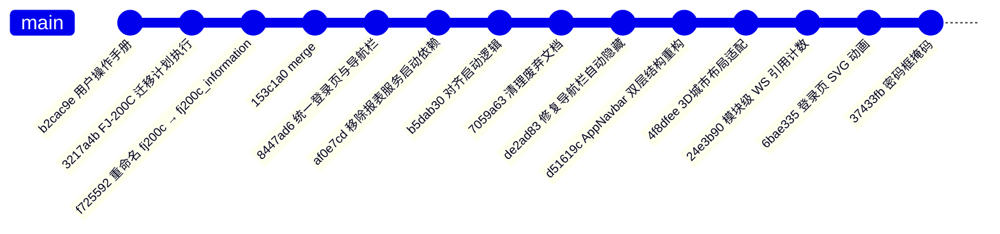

可观察到的演化方向：
1. **fj200c 一拆二**：早期只有一个 fj200c 模块，后来拆成 information（监控）+ main（测控）。
2. **工程化治理**：逐步清理废弃文档、统一登录页/导航栏/布局、共享组件化。
3. **稳定性修复**：导航栏自动隐藏的 sticky 高度重算问题（两次修复）、WS 连接生命周期问题——这些是**前车之鉴**：改 shared 组件要小心，一次改动影响 7 个应用。

---

## 1.21 自测题答案与延伸阅读

### 1.21.1 自测题简答

1. **几个前端？** 7 个：admin/fj200c_information/fj200c_main/fw100/fw150/ftj1c/city3d，端口 5173~5179（admin 5174）。
2. **后端模块？** 11 个业务模块（admin/fj200c_information/fj200c_main/ftj1c/fw100/fw150/city3d + common + role_template + 顶层文件），分极简/中型/大型三种体型。
3. **请求链路？** 浏览器 → Vite 代理 → Axum 路由 → 中间件链（JWT 鉴权 + 权限）→ handler → service → SQLite → 逐层返回，统一 `ApiResponse<T>` 包装。
4. **WS 链路？** 采集线程（std::thread）→ broadcast 通道 → ws_bridge → 浏览器；连接时先发快照；token 走查询参数。
5. **类型契约？** utoipa 注解 → openapi.json → orval → generated TS 代码 → 前端 import。
6. **开发/生产静态资源？** 开发：Vite dev server；生产：后端 rust-embed 内嵌 dist（或 dev 模式 ServeDir 磁盘 dist-*）。
7. **RBAC？** 注册表唯一源在后端 `roles.rs`；前端菜单 `MENU_CONFIG` 是纯 UI 概念，按权限过滤；用户表只存 role 字段。

### 1.21.2 建议延伸阅读顺序

1. 把 `src/main.rs`、`src/routes.rs`、`src/roles.rs` 通读一遍（1.16 节清单）。
2. 启动项目（按 07 章操作），登录 admin，创建用户、切换角色体验权限差异。
3. 开 F12 Network 面板，登录时观察 `POST /api/auth/login` 请求与响应结构。
4. 进入 fj200c_information 应用，启动模拟服务，观察 WS 帧推送（Network 面板 WS 标签页）。

---

## 1.22 端到端案例走读：模拟数据从硬件层到浏览器页面

作为全景章节的收官，我们走一遍最典型的完整业务流——**fj200c_information 启动模拟服务后，数据如何从"虚拟串口"流到浏览器表格**。这个案例把本章讲的所有概念串成一条线：

### 第一步：前端点"启动服务"

用户在 Monitor.vue 顶部点"启动服务"按钮 → `fj200cInformationApi.startService()` → 请求 `POST /api/fj200c_information/service/start`。这个接口带 `Fj200cInformationMonitor` 权限，中间件放行后进入 `handlers.rs` 的 `start_service` handler：

```rust
pub async fn start_service(
    State(db): State<DatabaseConnection>,
) -> Result<Json<ApiResponse<ServiceStatus>>, AppError> {
    let config = crate::fj200c_information::config::get_config();  // 读 INI 单例
    crate::fj200c_information::service::start_service(&db, config.clone())?;  // 编排启动
    Ok(Json(ApiResponse::success(ServiceStatus { running: true })))
}
```

### 第二步：后端启动 8 路采集线程

`service.rs` 的 `start_service` 读取 INI（`config-fj200c_information.ini`），对每个 `[ConnectionN]` 节判断 `Enabled`，然后分支到真实串口或模拟器：

```rust
// 伪代码（service.rs 实际逻辑）
for connection in 0..8 {
    if !config.is_enabled(connection) { continue; }
    if config.mock_enabled() {
        let mock = MockControl::create();            // 模拟数据源（20Hz 正弦+噪声）
        RUNTIME.push(spawn_thread(move || {
            run_one_connection(connection, mock, tx)  // 会话线程
        }));
    } else {
        let port = open_serial_port(connection)?;    // 真实串口
        RUNTIME.push(spawn_thread(move || {
            run_one_connection(connection, port, tx) // 会话线程
        }));
    }
}
```

关键点：**模拟器实现了与串口相同的 `IoControl` trait**——上层代码完全不知道数据来自哪里，这就是"Mock 模式开箱即用"的架构基础。

### 第三步：会话线程解码并广播

每个会话线程（`session.rs`）循环执行：读字节 → `FrameExtractor` 找帧头、拼帧、校验 → `decode` 解出 28 个字段 → 更新 `SHARED_DATA` 全局状态 → 构造 `Fj200cInformationEvent::TableData` 发进广播通道：

```rust
// 伪代码（session.rs）
loop {
    let bytes = io.recv()?;                       // 阻塞读（模拟器每 50ms 产生一帧）
    if let Some(frame) = frame_extractor.process(&bytes) {   // 完整帧
        if let Some(row) = decode_shared_data(&frame) {      // 28 字段
            *SHARED_DATA.update(...) = row;                  // 全局最新状态
            let event = Fj200cInformationEvent::TableData { row: row.clone() };
            if tx.send(event).is_err() { break; }  // 没有订阅者就退出？不，is_err 表示所有接收端关闭
        }
    }
    if SERVICE_RUNNING.is_stopped() { break; }     // 停止标志轮询
}
```

### 第四步：WS 桥推送到浏览器

浏览器 Monitor.vue 挂载时建立 WS（`useFj200cInformationEvents`），后端 `ws_handler` 验证 token 后启动 `ws_bridge`：订阅广播通道，把每个事件序列化为 JSON 文本帧推给客户端。连接建立时还会先发一个当前快照，页面刷新后立刻有数据。

### 第五步：前端分发到表格

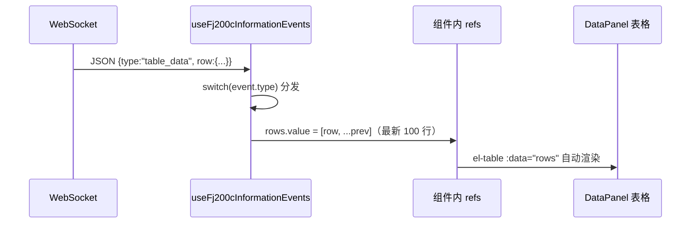

用户看到的效果：**表格每 50ms 跳动一行**（20Hz 模拟帧），状态栏显示"运行中"，点"停止服务"后线程优雅退出。

### 第六步：CSV 记录（可选）

如果 INI 里 `[CSV] Enabled = true`，会话线程同时维护 CSV 状态机：收到 `SYSJSK`（试验开始）帧 → 创建文件并写表头；`SYSJZJK`（数据中）帧 → 每帧追加一行；`SYSJMK`（结束）帧 → 关闭文件。数据页（Data.vue）调 `GET /api/fj200c_information/csv/files` 列出文件，`GET /csv/{name}` 读取内容。

---

### 1.22.1 这个案例暴露的架构要点（回顾清单）

1. **trait 抽象（IoControl）**让 Mock/真实硬件可替换——这是硬件模块的灵魂。
2. **状态机（CSV）**用事件驱动，不写一堆 if 嵌套。
3. **全局状态（SHARED_DATA）**与广播（TX）分离：一个给新连接发快照，一个持续推送增量。
4. **线程 + 广播**是唯一数据通路，HTTP 请求（启动/停止/状态）与数据流互不干扰。
5. **前端页面很薄**：WS 收到事件 → store/refs 更新 → 组件自动渲染，没有轮询、没有手动 DOM 操作。

---

## 1.23 补充：7 个应用的页面与菜单全览

### 1.23.1 各应用导航菜单对照

| 应用 | 一级菜单 | 页面职责 |
|---|---|---|
| admin | 用户管理 | 用户列表/新建/编辑角色 |
| fj200c_information | 监控/可视化/数据记录/配置/帮助 | 实时表格、曲线、CSV、ini 配置 |
| fj200c_main | 主控台/试验/报表/设置 | 三路面板、试验信息、报表打印、主题 |
| ftj1c | 帧监控/IP 配置/帮助 | 帧表格、16 路组播配置 |
| fw100 | 台账 | 设备列表/详情 |
| fw150 | 台账 | 设备列表/详情 |
| city3d | 3D 视图/建筑/区域/事件/概览 | 三维场景与各类管理 |

**共性规律**：都是「顶栏导航 + 内容区」骨架；业务差异全在内容区（表格/面板/3D）。

### 1.23.2 页面类型与数据源对照

| 页面类型 | 数据源 | 代表页面 |
|---|---|---|
| 实时型 | WS 推送 | fj200c_information/Monitor、fj200c_main 三路面板 |
| 列表型 | HTTP 拉取 | fw100/Panel、admin/Users |
| 配置型 | HTTP 读写 ini | fj200c_information/Config |
| 展示型 | 静态/统计接口 | city3d/Overview、各 Help 页 |

## 1.24 补充：目录逐层解析（后端 src 全貌）

### 1.24.1 顶层文件职责

| 文件 | 行数（约） | 职责 |
|---|---|---|
| main.rs | 232 | 启动装配（dotenv/DB/pool/state/router/静态托管） |
| routes.rs | 145 | 全部路由集中注册 |
| roles.rs | 268 | ROLE_REGISTRY 角色注册表 |
| database.rs | 1269 | 建表 + 种子数据 |
| api_docs.rs | 247 | OpenAPI 聚合 + 防漂移测试 |
| config.rs | 84 | 环境配置读取 |
| embedded_assets.rs | 131 | 单 exe 内嵌前端 |

### 1.24.2 common 公共层文件职责

| 文件 | 职责 |
|---|---|
| middleware.rs | auth/permission/role 三中间件 |
| error.rs | AppError 统一错误 |
| models.rs | Permission 枚举 + 通用 DTO |
| jwt.rs | 签发/校验 |
| ws.rs | ws_bridge 广播桥 |
| frame_extractor.rs | 字节流切帧 |
| quad_frame.rs | 主备四源帧管理 |
| global_var.rs | 全局键值存储 |
| csv_writer.rs | CSV 写入 |
| io.rs | IoControl trait |
| service.rs | ServiceRuntime 启停 |

**这张表可以当"后端文件地图"用**——遇到任何文件先查这表知道它属于哪层。

## 1.25 补充：一次 HTTP 请求的生命周期（从浏览器到数据库）

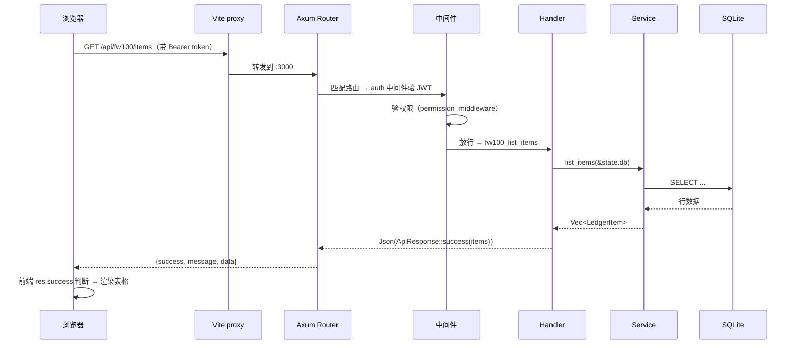

**一次请求 8 步**，所有 HTTP 接口都是这个模式。掌握了这张图，你就掌握了后端的一切。

## 1.26 本章知识点串联测验

1. 7 个前端应用的端口分别是？
2. 前端 dev 模式如何访问后端？（/api 代理到 :3000）
3. 数据流的两条通路是什么？（HTTP 请求 + WS 推送）
4. 类型契约从哪来到哪去？（Rust 注解 → openapi.json → orval → TS）
5. RBAC 的角色注册表唯一源在哪？（src/roles.rs）
6. 单 exe 部署如何实现？（embedded feature + rust-embed 内嵌 dist）
7. 三份 ini 配置文件各自管什么？
8. 种子账号有哪些？（7 个，密码 123456）

**答对全部 → 01 章地图建立完成**，可以进入语法速成章节。

## 1.27 补充：后端代码组织哲学（为什么这么分层）

### 1.27.1 三层架构的动机

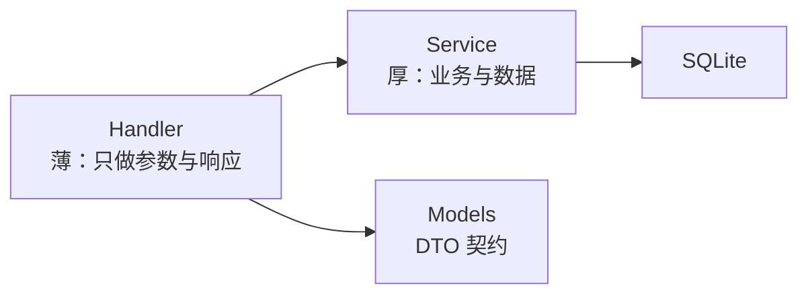

**为什么不让 handler 直接写 SQL**：
1. 复用——多个 handler 调同一个 service 函数。
2. 测试——service 逻辑可脱离 HTTP 测试。
3. 一致——错误处理/日志集中在 service。

**项目实际**：小模块（fw100）service 很薄（约 100 行），大模块（fj200c_main）service 厚（200+ 行含会话管理）。分层程度随复杂度调整。

### 1.27.2 全局状态的组织方式

| 状态 | 存放 | 访问方式 |
|---|---|---|
| 数据库连接池 | AppState | handler 的 State 提取器 |
| 服务运行标志 | 模块级 SERVICE_RUNNING | OnceLock<AtomicBool> |
| 最新数据帧 | SHARED_DATA | 全局静态 |
| 事件通道 | TX | 全局静态 |
| 运行时配置 | ArcSwap | 热更新 |

**规律**：进程级共享用全局静态（OnceLock），请求级共享用 AppState。

## 1.28 补充：HTTP 与 WebSocket 的分工

### 1.28.1 什么时候用哪个

| 场景 | 用 | 例子 |
|---|---|---|
| 查询/操作 | HTTP | 台账 CRUD、启停服务 |
| 实时数据流 | WS | 帧数据、状态变化 |
| 大文件 | HTTP | CSV 下载 |
| 配置 | HTTP | ini 读写 |

### 1.28.2 WS 消息的三种类型

```
1. 快照（连接时发一次）→ 页面秒开有数据
2. 增量（帧事件）→ 表格滚动更新
3. 状态（服务状态变化）→ 状态栏刷新
```

### 1.28.3 WS 与 HTTP 的鉴权差异

```
HTTP：Authorization: Bearer <token>（header）
WS：浏览器无法自定义 header → ?token= 查询参数
```

**这是项目的一个设计细节**——AGENTS.md 明确记录，`buildWebSocketUrl` 的实现就为此。

## 1.29 补充：前端工程化细节（构建与部署链路）

### 1.29.1 构建链路

```
源文件（.vue/.ts/.css）
→ Vite 打包（按路由分包）
→ dist/ 产物
→ rust-embed 编译期内嵌（embedded feature）
→ 单 exe 内内存服务
```

### 1.29.2 为什么需要前端构建

```
1. 浏览器不认 .vue/.ts → 需编译
2. 依赖需打包（Element Plus 等）
3. 按路由分包 → 首屏更快
4. 压缩/混淆 → 体积小
```

### 1.29.3 类型检查的位置

```
vue-tsc（构建前）→ 静态类型检查
rustc（编译时）→ Rust 类型检查
orval 生成 → 契约一致性
```

**三层防线**让"类型错误"几乎不可能跑到运行时。

## 1.30 补充：系统边界与限制（认识它才能用好它）

| 边界 | 说明 |
|---|---|
| 单机部署 | SQLite + 内存服务，不适合集群 |
| 串口资源 | 每路连接独占一个串口 |
| 数据量 | CSV 按帧写盘，长时间运行需管理 |
| 并发 | 广播模式，N 客户端共享 |
| 安全 | 内网工具型，无 HTTPS/加密存储 |

**认识边界的意义**：明确"哪些需求不能通过配置解决，需要改造"。

## 1.31 补充：01 章补充自测（10 题）

1. handler 与 service 的分工？
2. 全局状态两种存放方式？
3. HTTP 与 WS 各自适用场景？
4. WS 鉴权为什么用 query 参数？
5. 前端构建的必要性？
6. 类型检查的三层防线？
7. 系统的部署边界？
8. 快照与增量的区别？
9. 为什么 service 不直接放 handler 里？
10. AppState 与全局静态的区别？

**答对 8+ → 01 章全面完成。**

## 1.32 补充：7 个应用的页面与菜单全览（逐应用）

### 1.32.1 admin（5174）

```
登录页 → 用户列表 → 新增/编辑用户 → 角色分配 → 权限查看
```

### 1.32.2 fj200c_information（5173）

```
登录页 → 服务控制（启动/停止/状态）
      → 仪表盘（转速/水温/油压 等实时卡片）
      → 数据表格（逐帧参数）
      → 图表页（参数曲线）
      → CSV 记录（历史文件列表/下载）
      → 配置页（config-fj200c_information.ini 编辑）
      → 命令页（向设备发指令）
```

### 1.32.3 fj200c_main（5179）

```
登录页 → 总览（ECU/ADAM/DYNO 三路状态）
      → ECU 面板（发动机参数 + 指令）
      → ADAM 面板（模拟量采集）
      → DYNO 面板（测功机控制）
      → 试验信息（试验配置/记录）
      → 报表生成
      → 主题切换
      → CSV 64 列录制管理
```

### 1.32.4 fw100 / fw150（5175 / 5178）

```
登录页 → 设备台账列表（分页/搜索/排序）
      → 新增/编辑/删除设备
      → 详情查看
      → CSV 导入导出（如有）
```

### 1.32.5 ftj1c（5176）

```
登录页 → 服务控制（UDP 启停）
      → IP 配置（16 路组播地址）
      → 帧数据表格（实时滚动）
      → 坐标展示（CGCS2000 转换结果）
      → 配置页（config-ftj1c.ini）
```

### 1.32.6 city3d（5177）

```
登录页 → 概览（建筑/区域/事件统计）
      → 3D 视图页（Three.js 场景）
      → 建筑管理（CRUD）
      → 区域管理（CRUD）
      → 事件管理（CRUD）
```

## 1.33 补充：目录逐层解析（前端通用结构）

```
frontend/<应用>/
├── index.html            # SPA 入口
├── vite.config.ts        # 端口/base/代理
├── tsconfig.json         # TS 配置
├── package.json          # 依赖与脚本
├── public/               # 静态资源
└── src/
    ├── main.ts           # 应用入口（挂载/路由/初始化）
    ├── App.vue           # 根组件
    ├── router/           # 路由与守卫
    ├── stores/           # Pinia 状态
    ├── api/              # API facade
    ├── composables/      # 组合式函数
    ├── types.ts          # WS 事件等手写类型
    ├── assets/           # 样式/图片
    ├── components/       # 组件
    └── views/            # 页面
```

**规律**：7 个应用目录结构高度一致——学会一个，其余全会。

## 1.34 补充：后端进程的生命周期（一次完整运行）

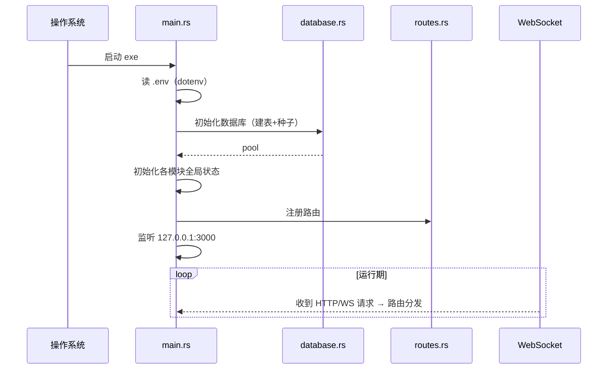

## 1.35 补充：01 章最后补充自测（5 题）

1. 7 个应用各自的页面结构？
2. 前端通用目录结构的作用？
3. main.rs 的启动顺序？
4. 路由注册在哪个函数？
5. 如何验证启动成功？

**答对 4+ → 01 章全部完成。**

## 1.36 补充：数据模型总览（数据库表一览）

### 1.36.1 核心表

```
users                用户（id/email/password_hash/is_active）
user_roles           用户角色关联
permissions          权限点（或角色权限关联表）
fw100_items          fw100 设备台账
fw150_items          fw150 设备台账
city3d_buildings     城市建筑
city3d_regions       城市区域
city3d_events        城市事件
```

### 1.36.2 表设计特点

```
1. SQLite 单文件（无需安装数据库服务）
2. 外键少（业务简单，关联靠 service 层查询）
3. 时间字段统一 TEXT/INTEGER（时间戳）
4. 无迁移文件（database.rs 内建表）
```

### 1.36.3 种子数据的作用

```
启动时自动插入 7 个账号（admin + 6 个业务角色）
→ 首次启动即可用
→ 密码 123456，建议立即修改
```

## 1.37 补充：安全模型总览（认证 + 授权）

### 1.37.1 认证（你是谁）

```
登录 → 后端校验密码 → 发 JWT（含 user_id/role）
前端存储 token → 每次请求带 Authorization 头
WS → token 走查询参数
```

### 1.37.2 授权（你能做什么）

```
中间件链：认证 → 角色（role）→ 权限（permission）
角色注册表：ROLE_REGISTRY（后端唯一源）
前端：拉 /api/meta/roles 渲染菜单
```

### 1.37.3 新增权限的完整链路

```
Permission::XxxMonitor 枚举 → 角色注册表配置
→ gen:api → 前端类型
→ 中间件校验 → 前端菜单控制
```

## 1.38 补充：配置与数据文件总览

| 文件 | 位置 | 作用 |
|---|---|---|
| .env | 运行目录 | 端口/数据库/JWT |
| rustweb.db | 运行目录 | SQLite 数据 |
| config-fj200c_information.ini | 运行目录 | 发动机监控配置 |
| config-fj200c_main.ini | 运行目录 | 发动机测控配置 |
| config-ftj1c.ini | 运行目录 | 通信模块配置 |
| csv/ | 运行目录 | 记录数据 |

**规律**：所有运行期文件都在运行目录（相对路径）——换机器部署只需拷目录。

## 1.39 补充：01 章最终自测（追加 8 题）

1. 核心表有哪些？
2. 表设计的特点？
3. 种子账号的作用？
4. 认证与授权的区别？
5. JWT 的用途？
6. 新增权限的链路？
7. 运行期文件有哪些？
8. 部署换机器的要点？

**答对 7+ → 01 章彻底完成。**

## 1.40 补充：开发环境搭建手把手（Windows）

### 1.40.1 前置工具

| 工具 | 用途 | 检查命令 |
|---|---|---|
| Rust（rustup） | 后端编译 | rustc --version |
| Node.js（≥18） | 前端构建 | node --version |
| npm | 依赖管理 | npm --version |
| Git | 版本管理 | git --version |

### 1.40.2 安装步骤

```
1. rustup-init.exe（官网下载）→ 默认安装
2. Node.js LTS（官网下载）→ 一路下一步
3. 验证：新终端里三个 --version 都出来
```

### 1.40.3 拉取与安装依赖

```powershell
git clone <仓库地址>
cd RustWeb-Vue
npm install          # 根目录一次（workspaces 全装）
cargo build          # 首次较慢（编译所有依赖）
```

### 1.40.4 启动

```powershell
cargo run            # 后端 :3000
# 新终端
cd frontend/admin
npm run dev          # 前端 :5174
```

### 1.40.5 常见安装问题

```
1. cargo 报 openssl/链接错误 → 安装 VS Build Tools（C++ 依赖）
2. npm 慢 → 换镜像：npm config set registry https://registry.npmmirror.com
3. 端口被占 → 换端口或关占用程序
```

## 1.41 补充：IDE 推荐配置

### 1.41.1 VS Code 插件清单

| 插件 | 用途 |
|---|---|
| rust-analyzer | Rust 智能提示 |
| Volar（Vue Language Features） | Vue 3 支持 |
| Prettier | 格式化 |
| Mermaid Preview | 本套文档渲染 |
| SQLite Viewer | 查看 rustweb.db |

### 1.41.2 工作区建议

```
打开根目录（RustWeb-Vue）→ workspaces 自动识别
→ 前后端同窗开发
→ 底部终端跑 cargo run + npm run dev
```

## 1.42 补充：01 章高频自测（8 题）

1. 三个前置工具版本检查命令？
2. npm install 在哪执行？
3. 首次 cargo build 慢的原因？
4. 启动后端的命令？
5. 启动前端的命令？
6. 链接错误怎么解决？
7. npm 慢怎么办？
8. 数据库文件怎么查看？

**答对 7+ → 01 章高频通过。**

## 1.43 补充：项目里用到的关键技术栈详解

### 1.43.1 后端关键依赖

| 依赖 | 用途 | 备注 |
|---|---|---|
| axum | Web 框架 | 路由/中间件/提取器 |
| tokio | 异步运行时 | spawn/interval/select |
| sqlx | SQL 访问 | 编译期校验 SQL |
| serde | 序列化 | DTO 转换 |
| utoipa | OpenAPI 生成 | 类型契约源头 |
| jsonwebtoken | JWT | 登录令牌 |
| bcrypt | 密码哈希 | 不存明文 |
| arc-swap | 热更新配置 | 无锁读 |
| serialport | 串口通信 | 三路串口 |
| rust-embed | 前端内嵌 | 单 exe 部署 |
| notify | 文件监听 | 配置热加载 |

### 1.43.2 前端关键依赖

| 依赖 | 用途 |
|---|---|
| vue 3 | 框架（组合式 API） |
| vue-router | 路由 |
| pinia | 状态管理 |
| element-plus | UI 组件库 |
| echarts | 图表 |
| axios | HTTP 请求 |
| three.js（city3d） | 3D 渲染 |

### 1.43.3 工程化工具

```
vite         构建
vue-tsc      类型检查
orval        契约生成
npm workspaces 多包管理
cargo        后端构建
```

## 1.44 补充：项目规模的量化认识

### 1.44.1 代码规模估算

```
后端：约 1.5 万行 Rust
前端：7 个应用 × 约 3000~8000 行 = 约 3 万行
shared：约 3000 行
总计：约 5 万行
```

### 1.44.2 数据规模

```
7 个数据库表 + 配置 + CSV 文件
用户量：通常 1~50 人（内网工具）
数据量：CSV 按帧增长（监控类）
```

### 1.44.3 对学习者的意义

```
5 万行对个人项目不小，但模块化清晰
→ 每次只读一个模块（几百行）
→ 循序渐进完全可行
```

## 1.45 补充：01 章终局自测（8 题）

1. 后端十大依赖各自的用途？
2. 前端六大依赖？
3. 三个工程化工具？
4. 代码规模估算？
5. 数据规模特征？
6. 为什么模块化重要？
7. 每次读多少行合适？
8. 学习节奏的建议？

**答对 7+ → 01 章终局通过。**

## 1.46 补充：常见业务场景的端到端流程

### 1.46.1 新用户登录流程

```
1. 打开浏览器 → 登录页
2. 输入邮箱密码 → 前端校验
3. POST /api/auth/login → 后端校验密码
4. 返回 JWT → 前端存 localStorage
5. 拉 /api/auth/me → 用户信息 + 权限
6. 拉 /api/meta/roles → 角色注册表
7. 按角色跳转到对应应用
```

### 1.46.2 监控数据全流程

```
设备 → 串口 → 后端读线程 → 帧提取 → 解码
→ 广播（WS）→ 前端收到 → 表格/图表更新
→ 可选：CSV 落盘
```

### 1.46.3 台账操作流程

```
前端表单 → 校验 → POST /api/fw100/items
→ 后端鉴权 → service 校验 → SQL INSERT
→ 返回新纪录 → 前端刷新列表
```

### 1.46.4 配置修改流程

```
前端配置页 → 编辑 → PUT /api/xxx/config
→ 后端校验 → 写盘
→ 热加载（fj200c_information）或提示重启
```

## 1.47 补充：学习本系统的推荐实战顺序

### 1.47.1 初级实战（改配置）

```
1. 改 .env 端口
2. 改 ini 模拟模式
3. 改种子账号密码
4. 改前端标题
```

### 1.47.2 中级实战（改逻辑）

```
1. 给台账加字段（后端 + 契约 + 前端）
2. 加一个查询接口
3. 改表格列显示
4. 调整 CSV 记录频率
```

### 1.47.3 高级实战（加功能）

```
1. 加告警模块（08 章案例）
2. 加新协议（08 章案例）
3. 加新角色/应用（08 章七步流程）
4. 加报表导出（08 章案例）
```

## 1.48 补充：01 章毕业自测（8 题）

1. 登录流程的七步？
2. 监控数据的完整链路？
3. 台账操作的流程？
4. 配置修改的流程？
5. 初级实战的四个任务？
6. 中级实战的四个任务？
7. 高级实战的四个任务？
8. 你现在能完成哪个级别？

**答对 7+ → 01 章毕业。**

## 1.49 补充：项目演进历史与设计取舍

### 1.49.1 从单体到多应用的演进

```
最初：一个前端应用包含所有功能
问题：权限混乱/打包巨大/改动互相影响
现在：7 个独立应用 + shared 共享
好处：独立部署/独立权限/独立打包
代价：配置同步点增多（deploy.bat/main.rs 等）
```

### 1.49.2 类型方案的演进

```
最早：手写前后端类型（不一致）
中间：ts-rs 生成（只有类型没有函数）
现在：utoipa + orval（类型 + 请求函数 + 文档）
```

### 1.49.3 部署方案的演进

```
早期：前端 dist + 后端 exe 分开部署
现在：rust-embed 内嵌单文件
好处：拷贝一个 exe 即部署
代价：前端改动必须重新编译后端
```

### 1.49.4 设计取舍的原则

```
1. 工具型系统优先可用性（不用过度设计）
2. 单机优先（不引分布式）
3. 配置驱动（ini 可调）
4. 契约自动（避免手工同步）
```

## 1.50 补充：01 章大师自测（8 题）

1. 多应用化的好处与代价？
2. 类型方案的三阶段？
3. 内嵌部署的取舍？
4. 四个设计原则？
5. 为什么需要共享层？
6. 改前端要重新编译吗？
7. 独立打包的价值？
8. 配置驱动的好处？

**答对 7+ → 01 章大师。**

## 1.51 补充：文档使用的核心概念对照表（翻译手册）

### 1.51.1 中文术语 → 代码概念

| 文档用语 | 代码里的位置 |
|---|---|
| 路由 | routes.rs / Router |
| 接口 | handler + #[utoipa::path] |
| 权限点 | Permission 枚举 |
| 角色 | roles.rs ROLE_REGISTRY |
| 契约 | openapi.json / generated |
| 全局状态 | OnceLock + ArcSwap |
| 数据帧 | TableRow / EcuFields |
| 广播 | broadcast 通道 |
| 台账 | fw100_items 表 |
| 会话 | JWT + AuthUser |

### 1.51.2 前端术语 → 代码概念

| 文档用语 | 代码里的位置 |
|---|---|
| 页面 | src/views/*.vue |
| 路由守卫 | router beforeEach |
| 状态管理 | stores/*.ts |
| 组合式函数 | composables/*.ts |
| API 封装 | api/index.ts |
| 生成代码 | shared/api/generated |
| 实时数据 | WS + types.ts |

### 1.51.3 使用方式

```
读文档遇到术语 → 查此表 → 定位代码位置
改代码时 → 用此表反查文档章节
```

## 1.52 补充：01 章权威自测（8 题）

1. 接口在代码里的三个要素？
2. 角色注册表在哪？
3. 数据帧的类型？
4. 广播用什么？
5. 页面在哪个目录？
6. 生成代码在哪？
7. 组合式函数在哪？
8. 实时数据的类型在哪手写？

**答对 7+ → 01 章权威。**

## 1.53 补充：项目背后的设计思想（为什么值得学）

### 1.53.1 五个值得学的点

```
1. 契约驱动：类型自动同步，前后端不脱节
2. 模块化：7 应用 + 模块化后端，边界清晰
3. 配置驱动：ini 免编译调整
4. 模拟优先：无硬件也能开发演示
5. 单文件部署：内嵌前端，拷贝即用
```

### 1.53.2 三个真实的工程教训

```
1. 类型不一致的痛（ts-rs 到 utoipa 的升级）
2. 依赖重复的痛（npm workspaces 统一装）
3. 部署顺序的痛（前端必须先构建）
```

### 1.53.3 学完后你能带走的

```
1. Rust + Axum 全栈实战经验
2. Vue 3 多应用工程化经验
3. 契约驱动开发方法论
4. 实时数据系统（WS）实战
5. 完整部署运维经验
```

## 1.54 补充：01 章权威自测（8 题）

1. 五个值得学的点？
2. 三个工程教训？
3. 五个能带走的技能？
4. 契约驱动的好处？
5. 模拟优先的意义？
6. 单文件部署的代价？
7. ts-rs 升级的原因？
8. 部署顺序为什么不能乱？

**答对 7+ → 01 章权威。**

> 下一节：**02-Rust语法速成**——第一片主战场。
