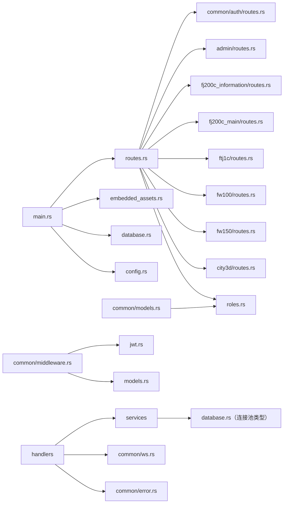
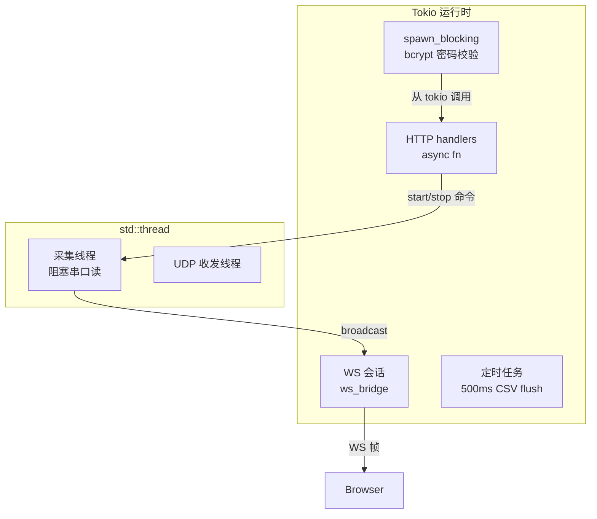
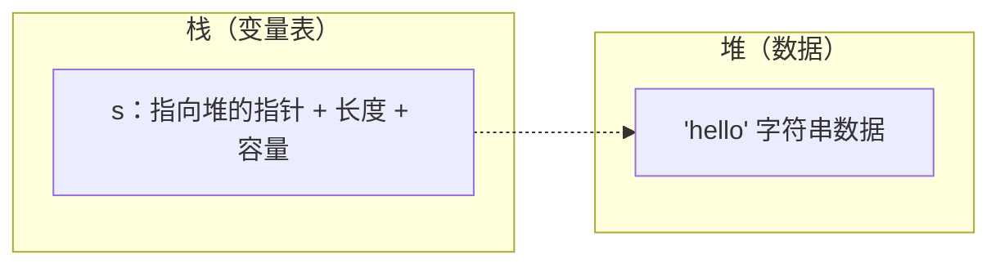
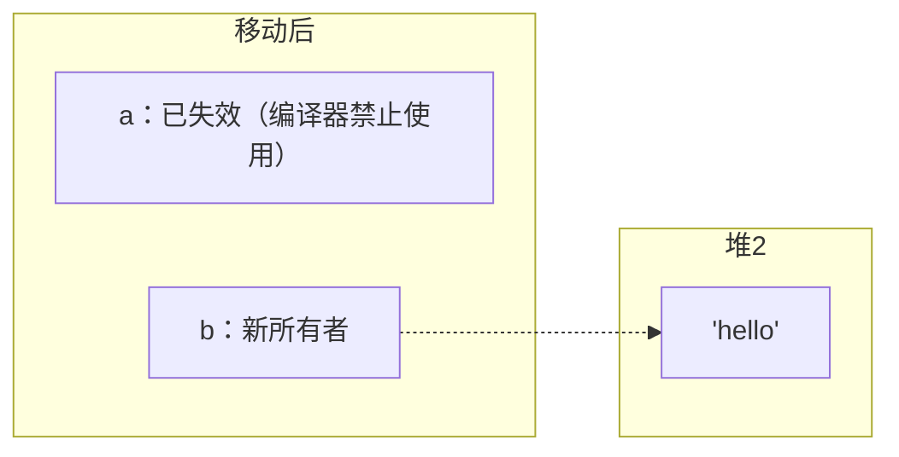
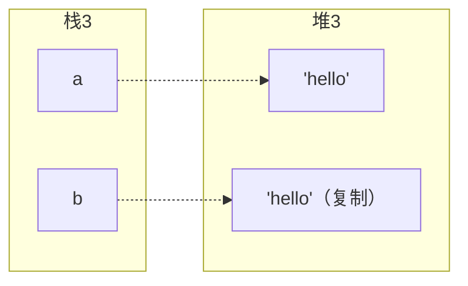
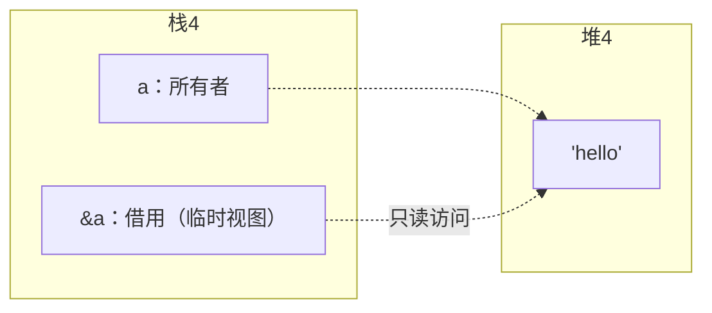
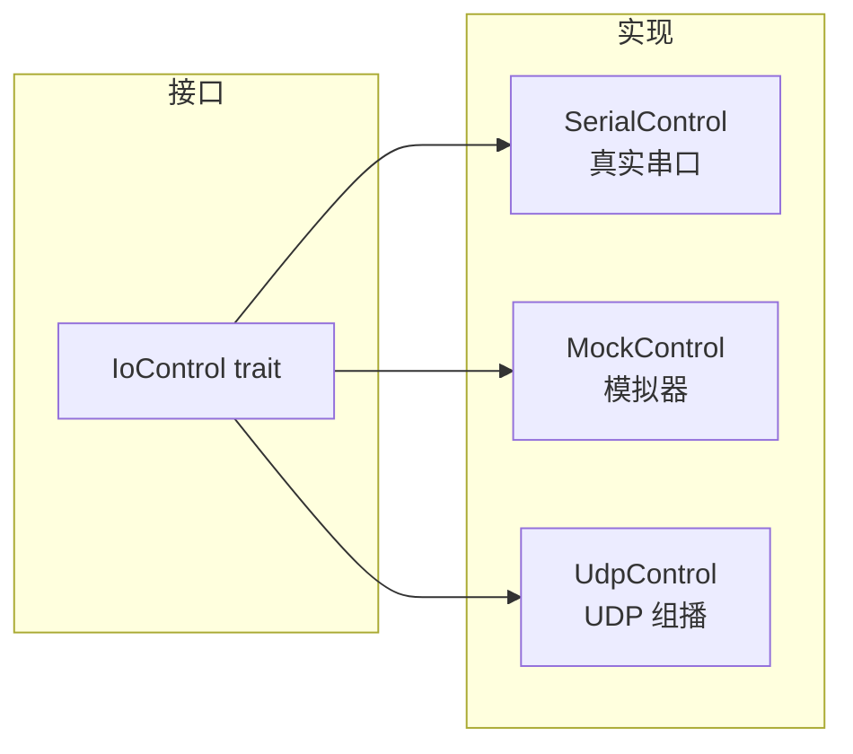
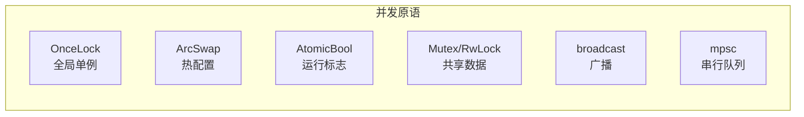

# 02 Rust 语法速成（以本项目代码为教材）

> 适用对象：Rust 零基础或入门不久的新手。
> 教学目标：不是系统学习 Rust，而是**看懂并修改本项目的 Rust 代码**——语法点全部用项目真实代码举例，每个例子都标注源码位置，建议边读边打开文件对照。
> 全文约 2 万字。如果你有编程经验（Java/Python/JS 均可），预计 4~6 小时可读完并消化。

---

## 2.1 先建立正确心态：Rust 的"三座大山"其实没那么可怕

新手听说 Rust 难，主要难在三个概念：**所有权（Ownership）**、**借用（Borrowing）**、**生命周期（Lifetime）**。本项目的代码大量使用这些概念，但你不需要精通它们才能开始——你只需要掌握**阅读模式**和**修改模式**：

| 场景 | 你需要会什么 |
|---|---|
| 读代码 | 能看出"这个变量被谁拥有""这个引用是从哪来的" |
| 小改代码 | 能照着周围代码的样子抄（编译器会告诉你哪里错了） |
| 大改代码 | 才需要真正理解所有权规则 |

Rust 编译器的报错信息是全球公认最好的——它会告诉你具体改法。所以**大胆编译**，让编译器当你的老师。本项目后端改动后用 `cargo build` 验证，报错看不懂就问，或者贴给 AI。

还有一个好消息：本项目代码风格统一、注释详尽（几乎每个语法点都有中文注释），是最好的 Rust 阅读材料之一。

---

## 2.2 工具链准备（5 分钟）

```powershell
# 1. 安装 rustup（Windows 用官方安装器，或 winget install Rustlang.Rustup）
# 2. 验证
rustc --version      # 编译器
cargo --version      # 构建/包管理工具（npm 的 Rust 版）
rustup --version     # 工具链管理
# 3. VS Code 装 rust-analyzer 扩展（自动分析、悬停提示、跳转定义）
# 4. 进入项目根目录
cargo check          # 只检查不编译产物，比 cargo build 快（日常开发用这个）
cargo run            # 编译并运行
cargo build --release --features embedded   # 生产构建（单 exe）
```

> 术语：**crate** = 包（一个 Cargo 项目）；**module** = 模块（一个 .rs 文件或目录）；`cargo` 类似 `npm`，但 Rust 是编译型语言，"npm run" 在 Rust 里是 `cargo run`。

---

## 2.3 变量、类型与 let

### 2.3.1 基本变量

```rust
// src/config.rs —— 环境变量读取（最典型的 let 用法）
pub fn load() -> Result<AppConfig, Box<dyn std::error::Error>> {
    let port: u16 = std::env::var("PORT")          // 读环境变量（返回 Result<String>）
        .unwrap_or_else(|_| "3000".to_string())    // 出错时用默认值 "3000"
        .parse()?;                                 // 字符串转 u16（? 见 2.5 节）
    let database_url = std::env::var("DATABASE_URL")
        .unwrap_or_else(|_| "sqlite://rustweb.db".to_string());
    Ok(AppConfig { port, database_url })
}
```

新手要掌握的点：

1. **`let` 声明变量，默认不可变**：`let x = 5;` 之后 `x = 6` 会编译报错。要可变需写 `let mut x = 5;`。本项目大量利用这一点——不可变变量让代码意图清晰。
2. **类型可以推断**：`let port: u16 = ...` 显式标注了类型；很多地方可以省略 `let x = 5`（自动推断 i32）。
3. **`.to_string()`**：任何可打印类型转 `String`。
4. **`.unwrap_or_else(闭包)`**：`Result`/`Option` 出错时的兜底值模式——**项目里"配置有默认值"全部用这个模式**。
5. **`.parse::<T>()`**：字符串解析为数值类型，返回 `Result`（可能失败）。

### 2.3.2 常量与静态变量

```rust
// src/fj200c_information/state.rs —— 模块常量
pub const CONFIG_PATH: &str = "config-fj200c_information.ini";  // 编译期常量

// src/common/service.rs —— 全局静态可变状态（线程安全）
pub static RUNTIME: OnceLock<Mutex<Vec<JoinHandle<()>>>> = OnceLock::new();
```

| 关键字 | 含义 | 区别 |
|---|---|---|
| `const` | 编译期常量 | 无内存地址，内联展开；类型必须是字面量可表示的 |
| `static` | 全局静态变量 | 有固定内存地址，生命周期为整个程序 |
| `static mut` | 全局可变静态 | **禁止直接使用**（不安全），本项目用 `OnceLock`/`AtomicBool`/`RwLock` 包一层 | 

Rust 不允许随意访问可变全局变量（数据竞争），所以本项目所有全局状态都用 `OnceLock`（单例容器）、`AtomicBool`（原子布尔）、`RwLock`（读写锁）包裹——**看到这些类型，就知道这是"全局状态"**。

### 2.3.3 元组与结构体字段访问

```rust
// src/common/auth/handlers.rs —— 返回元组类型
// axum handler 提取器可以组合，这里用 () 表示无额外参数
// (State(db), Json(login_data)) 是元组解构的典型用法：
// let (a, b) = (1, 2);  // 元组解构赋值
```

```rust
// src/common/models.rs —— 结构体字段访问
let email = &user.email;          // 取字段（借用）
let name = user.username.clone(); // 取字段（克隆，拥有所有权）
```

---

## 2.4 结构体与枚举（本项目最核心的两种类型）

### 2.4.1 结构体（struct）

```rust
// src/common/models.rs —— 用户模型（节选）
#[derive(Debug, Clone, Serialize, Deserialize, utoipa::ToSchema)]
pub struct User {
    pub id: uuid::Uuid,
    pub username: String,
    pub email: String,
    #[serde(skip_serializing)]
    pub password_hash: String,    // 序列化时跳过！永不下发到前端
    pub role: String,
    pub created_at: chrono::NaiveDateTime,
}
```

要点：

1. `pub` = 公开字段，模块外可访问（本项目几乎所有字段都是 pub，简化跨模块访问）。
2. `#[derive(...)]` 自动实现 trait（见 2.8 节宏）：`Clone`（可复制）、`Serialize/Deserialize`（JSON 转换）、`ToSchema`（OpenAPI 文档）。
3. `#[serde(skip_serializing)]` 属性：JSON 输出时**排除**该字段——密码哈希永不外泄。这是 serde 属性的经典例子。
4. **创建结构体**：`User { id, username, ... }` 字段名与变量名相同时可简写（`User { id, ... }` 中的 `id` 即 `id: id`）。

结构体的方法定义（impl 块）：

```rust
// src/common/models.rs —— User 的方法
impl User {
    /// 计算用户的权限列表（查角色注册表）
    pub fn permissions(&self) -> Vec<Permission> {
        crate::roles::permissions_for(&self.role)
    }

    /// 判断是否拥有某权限
    pub fn has_permission(&self, permission: &Permission) -> bool {
        self.permissions().contains(permission)
    }
}
```

要点：`&self` = 只读借用（类似 `this` 但不可修改）；`&mut self` = 可变借用；`self` = 消费所有权。本项目方法几乎全是 `&self`（只读查询）。

### 2.4.2 枚举（enum）——本项目最常用的类型

```rust
// src/common/models.rs —— 权限枚举（10 个权限点）
#[derive(Debug, Serialize, Deserialize, Clone, PartialEq, Eq, Hash, utoipa::ToSchema)]
pub enum Permission {
    Fj200cInformationMonitor,
    Fj200cMainMonitor,
    Fw100Monitor,
    Fw150Monitor,
    Ftj1cMonitor,
    City3dView,
    UsersRead,
    UsersWrite,
    UsersDelete,
    SystemAdmin,
}
```

要点：

1. 枚举成员默认没有值（unit variant），用于"标记"场景——权限就是纯标记。
2. `PartialEq, Eq` 用于 `==` 比较（`user.has_permission` 里 `contains(permission)` 就依赖它）；`Hash` 用于放 HashSet 键。
3. serde 对枚举默认序列化为**字符串**（如 `"UsersRead"`），前端 orval 生成同名 TS 枚举——这就是前后端权限点类型同步的基础。

枚举也可以**携带数据**——这是项目里事件系统的基础：

```rust
// src/fj200c_information/mod.rs —— 事件枚举（WS 推送的载荷类型）
#[derive(Debug, Clone, Serialize, utoipa::ToSchema)]
#[serde(tag = "type")]   // 序列化时加 "type" 字段做判别标签
pub enum Fj200cInformationEvent {
    /// 解码后的完整数据行（前端表格更新用）
    TableData { row: TableRow },
    /// 原始数据帧（16 进制字符串）
    Frame { hex: String },
    /// 载荷数据
    Payload { hex: String },
}
```

这里的 `#[serde(tag = "type")]` 叫**内部标签枚举（internally tagged enum）**，序列化结果形如：

```json
{ "type": "TableData", "row": { ... } }
```

前端 JS 用 `switch (event.type)` 分发——这就是前后端事件协议的契约。**带数据枚举 + serde tag 是 WebSocket 推送的标准模式**，三个硬件模块全部这么用。

### 2.4.3 枚举是"类型安全的 if"

在别的语言里，你可能会写 `if (type == 1)` 或魔法字符串；Rust 用枚举 + match 保证编译器强制处理所有分支（见 2.6 节）。

---

## 2.5 Option 与 Result：没有 null 的世界

### 2.5.1 Option：可能有值

```rust
// src/common/ws.rs —— WS 桥的可选初始消息
async fn ws_bridge_with_initial(
    tx: broadcast::Sender<T>,
    socket: WebSocket,
    prefix: &str,
    initial: Option<String>,   // 要么 Some(内容)，要么 None（无）
) {
    // ...
}
```

| 模式 | 说明 | 本项目例子 |
|---|---|---|
| `Option<T>` | 有值/无值 | WS 初始快照、配置可选字段 |
| `.unwrap()` | 有值直接取出，无值 panic（崩溃） | **避免在生产路径用**，测试里常见 |
| `.unwrap_or(default)` | 无值用默认值 | 配置读取 |
| `.ok_or(err)?` | 无值转成错误并返回 | 见下 |
| `if let Some(x) = ...` | 有值才处理 | 见 2.6 |

### 2.5.2 Result：可能出错

```rust
// src/common/jwt.rs —— 验证 token（Result 的教科书用法）
pub fn verify_token(token: &str) -> Result<Uuid, AppError> {
    let data = jsonwebtoken::decode::<Claims>(   // decode 返回 Result，? 自动转 AppError
        token,
        &DecodingKey::from_secret(SECRET.as_bytes()),
        &Validation::default(),
    )
    .map_err(|e| AppError::unauthorized(format!("无效 token: {e}")))?;
    // ... 检查过期
    Ok(data.claims.sub)   // 成功：返回用户 ID
}
```

`Result<T, E>` 的含义：**成功时是 T，失败时是 E**。项目统一 `Result<T, AppError>`。

新手必会的 Result 操作：

```rust
let x: Result<u32, String> = Ok(42);

x.unwrap()                // 42；失败则 panic（程序崩溃）
x.expect("说明文字")       // 同上，带自定义错误信息（比 unwrap 好）
x?                        // 成功取出 42；失败则函数提前返回错误（★最常用）
x.map(|v| v * 2)          // 成功时转换值：Ok(84)
x.map_err(|e| ...)        // 失败时转换错误类型
x.ok()?                   // 只关心值，错误直接抛（转 Option）
x.is_ok() / x.is_err()    // 判断
```

### 2.5.3 项目里最经典的组合：链式调用

```rust
// src/common/auth/handlers.rs —— 登录 handler
login_data.validate()?;    // 校验失败 → 400
let user = AuthService::login(&db, login_data)
    .await
    .map_err(|e| AppError::bad_request(e.to_string()))?;   // 登录失败 → 400
let token = jwt::create_token(&user)?;                     // 签发失败 → 500
Ok(Json(ApiResponse::success(LoginResponse { token, user })))
```

**读法口诀**：看到 `?` 就念"出错了就返回"，看到 `.map_err(|e| AppError::xxx(...))` 就念"把错误转换成 HTTP 错误码"。

---

## 2.6 模式匹配：match / if let / let else

### 2.6.1 match：穷尽所有分支

```rust
// src/fj200c_main/decode.rs —— 状态机映射（match 的经典用法）
pub fn engine_status_str(status: u8) -> &'static str {
    match status {
        0x01 => "停车",
        0x02 => "启动",
        0x03 => "运行",
        0x04 => "故障",
        _ => "未知",   // 通配分支：其他值都到这里
    }
}
```

要点：

1. **必须穷尽**：match 要求覆盖所有情况，否则编译错误。`_` 是"其他所有"。
2. 每个分支是表达式，match 整体可以赋值：`let s = match x { 1 => "a", _ => "b" };`。
3. 模式可以是字面量、枚举成员、带 `|` 的多模式（`0x01 | 0x02 => "启动"`）、带守卫（`n if n > 10 => ...`）。

### 2.6.2 if let：只关心一种情况

```rust
// src/common/ws.rs —— WS 桥循环里的消息判断
match msg {
    Ok(Some(Message::Text(text))) => { /* 客户端发来文本 */ }
    Ok(Some(Message::Close(_))) => break,
    _ => {}
}
```

if let 简化"只关心一种情况"的 match：

```rust
if let Some(user) = request.extensions().get::<User>() {
    // 有用户（中间件已注入），处理业务
}
```

### 2.6.3 let-else：不满足就提前返回

```rust
// src/fj200c_information/handlers.rs —— CSV 文件名防目录穿越
let Ok(name) = url::percent_decode_str(name).decode_utf8() else {
    return Err(AppError::bad_request("文件名编码无效".to_string()));
};
let Some(file_name) = name.rsplit('/').next() else {
    return Err(AppError::bad_request("文件名不合法".to_string()));
};
```

`let ... else` 是"反直觉守卫"：模式匹配**失败**时执行 else 分支（通常提前 return）。它让"校验后继续"的代码不产生嵌套地狱。

### 2.6.4 模式匹配在项目中的使用场景清单

| 场景 | 位置 |
|---|---|
| 十六进制状态码 → 中文名称 | `fj200c_main/decode.rs` |
| WS 消息类型分发 | `common/ws.rs`、各模块 ws 循环 |
| 事件枚举分发（前端） | `useFj200cInformationEvents.ts`（TS 侧） |
| 帧类型匹配（CSV 状态机） | `fj200c_information/session.rs` |
| 序列化标签分发 | 各 `decode.rs` |

---

## 2.7 trait：接口与抽象

### 2.7.1 trait 是什么

trait 类似 Java 的接口 / TypeScript 的 interface：定义一组方法签名，让不同类型实现同一套行为。

```rust
// src/common/io.rs —— 硬件抽象（本项目最重要的 trait）
/// 串口与模拟器的统一抽象：上层代码不关心数据来自真实硬件还是模拟器
pub trait IoControl {
    fn send(&self, data: &[u8]) -> Result<(), String>;
    fn recv(&self) -> Result<Vec<u8>, String>;
    fn set_timeout(&self, timeout_ms: u32) -> Result<(), String>;
}
```

实现者（两种）：

```rust
// src/fj200c_information/com.rs —— 真实串口实现
pub struct SerialControl { port: Mutex<Box<dyn SerialPort>> }
impl IoControl for SerialControl {
    fn send(&self, data: &[u8]) -> Result<(), String> {
        self.port.lock().unwrap().write(data)
            .map_err(|e| e.to_string())?;
        Ok(())
    }
    // ...
}

// src/fj200c_information/mock.rs —— 模拟器实现
pub struct MockControl { /* 模拟数据生成状态 */ }
impl IoControl for MockControl {
    fn send(&self, _data: &[u8]) -> Result<(), String> { Ok(()) }
    fn recv(&self) -> Result<Vec<u8>, String> {
        // 每 50ms 生成一帧 20Hz 正弦+噪声模拟数据
        Ok(generate_frame())
    }
    // ...
}
```

**这就是 Mock 开关的魔法来源**：`config.ini` 里 `InProcess = true` 时，启动服务就传 `MockControl`；否则传 `SerialControl`。上层 `session.rs` 拿到的是 `Box<dyn IoControl>`（trait 对象），完全不感知差异：

```rust
// 抽象调用处（session.rs 伪代码）
let io: Box<dyn IoControl> = if mock { Box::new(MockControl::create()) }
                              else { Box::new(SerialControl::open(&cfg)?) };
io.recv()  // 不管底下是串口还是模拟器，接口一致
```

### 2.7.2 trait 对象与泛型

| 写法 | 含义 | 本项目例子 |
|---|---|---|
| `Box<dyn IoControl>` | trait 对象：运行时多态（堆上，动态分发） | 会话线程持有的 IO |
| `impl IoControl`（参数位置） | 泛型糖：编译期静态分发 | 较少 |
| `<T: IoControl>` | 泛型约束 | `FrameExtractor::new` 内部 |
| `A: RustEmbed` | 泛型约束（嵌入式资源） | `embedded_assets.rs` |

### 2.7.3 本项目用到的标准库 trait（背下来）

| trait | 作用 | 看到它就想到 |
|---|---|---|
| `Serialize` / `Deserialize` | JSON 序列化/反序列化 | DTO 结构体必带 |
| `Clone` | 深度复制 | 跨线程传数据需要 |
| `Debug` | `{:?}` 打印调试 | 日志/测试 |
| `PartialEq` / `Eq` | `==` 比较 | 枚举、配置比较 |
| `Send` / `Sync` | 跨线程安全标记 | **所有跨线程的类型必须满足**，编译器强制检查 |
| `ToSchema` | OpenAPI 文档生成 | DTO 必带（utoipa） |
| `From<T>` / `Into<T>` | 类型转换 | `AppError` 自动转换（见 2.9） |
| `Default` | `Default::default()` 默认值 | 配置结构体 |
| `IntoResponse` | 转 HTTP 响应 | `AppError`、handler 返回值 |
| `FromRow` | 数据库行转结构体 | sqlx 查询结果 |

---

## 2.8 宏：derive 宏与声明式宏

### 2.8.1 derive 宏：自动实现

`#[derive(Serialize)]` 不是装饰器，而是**代码生成器**：编译器展开后为你的结构体自动生成几十行 `Serialize` 实现代码。本项目里：

```rust
#[derive(Debug, Clone, Serialize, Deserialize, ToSchema)]  // 一行顶几十行
pub struct Building { ... }
```

新手只需要：**新写 DTO 时照抄现有 DTO 的 derive 行**（要什么能力就抄什么：要进 OpenAPI 就加 ToSchema；要 JSON 就加 Serialize/Deserialize；要跨线程传就加 Clone）。

### 2.8.2 属性宏：utoipa::path

```rust
#[utoipa::path(
    post,
    tag = "auth",
    path = "/api/auth/login",
    operation_id = "authLogin",
    request_body = LoginRequest,
    responses((status = 200, description = "登录成功", body = ApiResponse<LoginResponse>))
)]
pub async fn login(State(db): State<DatabaseConnection>, Json(login_data): Json<LoginRequest>)
    -> Result<Json<ApiResponse<LoginResponse>>, AppError>
{ ... }
```

这行注解生成 OpenAPI 文档条目（06 章详述）。**写新接口时必须加**，否则 `cargo test export_openapi` 的防漂移断言会失败。

### 2.8.3 声明式宏：macro_rules!

```rust
// src/fj200c_main/com.rs —— 用宏生成三个结构相似的串口实现
macro_rules! define_com_port {
    ($name:ident, $spec:expr) => {
        pub struct $name { /* ... */ }
        impl $name {
            pub fn new(...) -> Result<Self, String> { ... }
            pub fn run(...) { ... }
        }
    };
}
define_com_port!(ECUCom,  ComSpec::ecu_protocol());
define_com_port!(AdamCom, ComSpec::adam_protocol());
define_com_port!(DynoCom, ComSpec::dyno_protocol());
```

宏的作用是**消除重复代码**：三个串口实现只有协议规格不同，写三遍太蠢，用宏"参数化类型名"。

```rust
// src/fj200c_information/session.rs —— 表行宏（把 N 个字段打包成表行）
macro_rules! push_row {
    ($row:expr, $table:expr, $($field:expr),+) => {
        $table.push(Row::new(&[$($field),+]).with_cells(...));
    };
}
```

新手不需要会写宏，但要**能读懂宏的调用**，并知道"想改这个行为要动哪里"。

---

## 2.9 错误处理：AppError 体系

### 2.9.1 统一错误类型

```rust
// src/common/error.rs
pub struct AppError {
    pub status_code: u16,   // HTTP 状态码
    pub message: String,    // 人类可读信息
}

impl AppError {
    pub fn bad_request(msg: String) -> Self { Self { status_code: 400, message: msg } }
    pub fn unauthorized(msg: String) -> Self { Self { status_code: 401, message: msg } }
    pub fn forbidden(msg: String) -> Self { Self { status_code: 403, message: msg } }
    pub fn not_found(msg: String) -> Self { Self { status_code: 404, message: msg } }
    pub fn internal(msg: String) -> Self { Self { status_code: 500, message: msg } }
}
```

### 2.9.2 自动转 HTTP 响应

```rust
// src/common/error.rs —— 让 AppError 变成合法的 handler 返回值
impl IntoResponse for AppError {
    fn into_response(self) -> Response {
        let body = serde_json::json!({
            "success": false,
            "message": self.message,
        });
        (StatusCode::from_u16(self.status_code).unwrap(), Json(body)).into_response()
    }
}
```

因为实现了 `IntoResponse`，handler 返回 `Result<T, AppError>` 时，`Err(AppError)` 会被自动序列化成上面的 JSON 响应。

### 2.9.3 From 转换：错误自动升级

```rust
// src/common/error.rs —— 常见错误 → AppError 的自动转换
impl From<sqlx::Error> for AppError {
    fn from(err: sqlx::Error) -> Self {
        match err {
            sqlx::Error::RowNotFound => AppError::not_found("记录不存在".to_string()),
            sqlx::Error::Database(ref db_err) if db_err.is_unique_violation() =>
                AppError::bad_request("记录已存在".to_string()),
            other => AppError::internal(other.to_string()),
        }
    }
}
impl From<jsonwebtoken::Error> for AppError { ... }   // → 401
impl From<bcrypt::Error> for AppError { ... }         // → 500
impl From<validator::ValidationErrors> for AppError { ... }  // → 400
```

**这个机制是 `?` 能工作的关键**：函数返回 `Result<_, AppError>` 时，如果内部错误类型实现了 `From<E> for AppError`，`?` 会自动调用转换。所以代码里可以随便写：

```rust
let user = sqlx::query_as::<_, User>("SELECT ...")
    .fetch_one(&db)
    .await?;    // sqlx::Error 自动转 AppError，一行都不用写转换
```

### 2.9.4 新手错误处理口诀

1. handler 返回 `Result<Json<ApiResponse<T>>, AppError>`。
2. 业务错误用工厂方法：`AppError::bad_request(...)`。
3. 内部错误靠 `From` + `?` 自动转。
4. 前端永远收到 `{ success, message, data? }`。

---

## 2.10 async/await 与 tokio

### 2.10.1 什么是异步

**同步代码**：一个请求占一个线程，线程阻塞等 IO（数据库、网络）。**异步代码**：少数线程轮流处理大量请求，阻塞等待期间让出线程。Axum 的 handler 全部是异步函数。

```rust
#[tokio::main]        // 宏：把 main 变成 tokio 异步运行时入口
async fn main() -> Result<(), Box<dyn std::error::Error>> {
    let pool = init_database(&config.database_url).await?;  // 异步等待数据库连接
    let listener = tokio::net::TcpListener::bind(addr).await?;
    axum::serve(listener, app).await?;   // 一直跑，直到服务器关闭
    Ok(())
}
```

要点：
1. `async fn` 的函数调用**不会立刻执行**，返回一个 Future，必须 `.await` 才会推进。
2. `.await` 遇到阻塞会自动让出线程，其他请求乘机执行。
3. 项目中 handler 都是 `async fn`；HTTP/WS/数据库操作都有异步版本。
4. **CPU 密集任务不能用 async 处理**：bcrypt 哈希会阻塞线程。项目用 `tokio::task::spawn_blocking` 把它丢到阻塞线程池：

```rust
// src/common/auth/services.rs —— 密码校验（CPU 密集 → spawn_blocking）
let valid = tokio::task::spawn_blocking(move || {
    bcrypt::verify(&password, &user.password_hash).unwrap_or(false)
})
.await
.unwrap_or(false);
```

### 2.10.2 tokio::select!：同时监听多个源

```rust
// src/common/ws.rs —— WS 桥的核心循环
loop {
    tokio::select! {
        msg = receiver.next() => {          // 分支一：客户端发来消息
            match msg { Some(Ok(Message::Close(_))) | None => break, ... }
        }
        event = rx.recv() => {              // 分支二：广播通道有事件
            match event {
                Ok(evt) => { /* 序列化并推给客户端 */ }
                Err(RecvError::Lagged(_)) => continue,   // 客户端太慢，丢弃
                Err(RecvError::Closed) => break,
            }
        }
    }
}
```

`tokio::select!` 同时等待两个 future，**谁先完成执行谁**——这是"WS 双向通信"的惯用模式。`Lagged` 是 broadcast 通道的特性：接收端跟不上时旧消息被丢弃，用 `continue` 跳过即可（不让客户端拖慢系统）。

### 2.10.3 新手 async 避坑

1. **不要在 async 里做阻塞操作**（串口读、文件大读写、CPU 计算）——用 `spawn_blocking` 或 `std::thread`。
2. **`std::thread::sleep` 会阻塞整个 tokio 线程**——异步代码里用 `tokio::time::sleep`。
3. 本项目采集线程用 `std::thread`（阻塞串口读），HTTP 用 tokio，两者靠 broadcast 桥接——**不要试图把串口读改成 async**。

---

## 2.11 线程与并发（本项目并发全景）

### 2.11.1 std::thread：独立线程

```rust
// src/common/service.rs —— 线程句柄管理
pub struct ServiceRuntime {
    handles: Mutex<Vec<JoinHandle<()>>>,   // 线程句柄集合
    stop: AtomicBool,                       // 停止标志
}

impl ServiceRuntime {
    pub fn push(&self, handle: JoinHandle<()>) {   // 记录线程
        self.handles.lock().unwrap().push(handle);
    }
    pub fn wait_stopping(&self, timeout_secs: u64) {
        let deadline = Instant::now() + Duration::from_secs(timeout_secs);
        let mut handles = self.handles.lock().unwrap();
        while let Some(handle) = handles.pop() {
            let remaining = deadline.saturating_duration_since(Instant::now());
            let _ = handle.thread().unpark();   // 唤醒
            let _ = handle.join_timeout(remaining).unwrap_or_else(|_| handle);  // 等待
        }
    }
}
```

启动线程的模式：

```rust
// src/fj200c_information/service.rs（示意）
let tx = fj200c_information_tx();
let handle = std::thread::spawn(move || {   // move：闭包拿走 tx 的所有权（克隆引用）
    run_one_connection(connection, io, tx); // 会话线程主函数
});
RUNTIME.push(handle);
```

要点：
- `thread::spawn` 的闭包用 `move` 关键字**捕获环境**（把变量所有权移入线程）——`tx` 是 `Sender` 的克隆，跨线程合法（`Sender<T>` 实现 `Send`）。
- 线程结束方式：轮询 `AtomicBool` 停止标志 + `join` 等待。
- **停止模式**：`stop_service` 置标志 → 线程循环看到标志 break → join 收尾（最长等 3 秒）。

### 2.11.2 共享状态的三件套

| 类型 | 用途 | 项目位置 |
|---|---|---|
| `Arc<T>` | 多线程共享只读数据 | `Arc<QuadFrame<95>>`（ftj1c） |
| `Arc<Mutex<T>>` | 多线程共享可变数据（互斥锁） | `ServiceRuntime.handles` |
| `Arc<RwLock<T>>` | 读多写少共享数据 | `SHARED_DATA` 16 字段 |
| `AtomicBool` / `AtomicU8` / `AtomicUsize` | 单个数值的线程安全读写 | 停止标志、CSV 状态机 |
| `ArcSwap<T>` | 无锁热替换（高频读） | 最新帧存储 |

```rust
// src/common/global_var.rs —— 全局 KV 存储（RwLock 的典型用法）
pub struct GlobalVar {
    inner: RwLock<HashMap<String, String>>,   // 读锁可并发，写锁独占
}

impl GlobalVar {
    pub fn set(&self, key: &str, value: &str) {
        let mut map = self.inner.write().unwrap();   // 写锁
        map.insert(key.to_string(), value.to_string());
    }
    pub fn get(&self, key: &str) -> Option<String> {
        let map = self.inner.read().unwrap();        // 读锁
        map.get(key).cloned()
    }
}
```

`OnceLock<T>`：**全局单例容器**——要么未初始化，要么已初始化，只能设置一次：

```rust
// src/fj200c_information/mod.rs —— 广播通道单例
pub static FJ200C_INFORMATION_TX: OnceLock<broadcast::Sender<Fj200cInformationEvent>> = OnceLock::new();

pub fn fj200c_information_tx() -> broadcast::Sender<Fj200cInformationEvent> {
    FJ200C_INFORMATION_TX
        .get_or_init(|| broadcast::channel(1024).0)  // 首次调用创建
        .clone()                                      // 克隆给调用者（计数+1）
}
```

### 2.11.3 broadcast：一对多广播通道

```rust
let (tx, _rx) = broadcast::channel(1024);   // 创建：发送端 + 接收端
let rx2 = tx.subscribe();                    // 每个新接收端从当前 Sender 派生
tx.send(event);                              // 广播给所有订阅者
rx.recv().await                              // 异步接收；Lagged → 丢旧消息
```

| 特性 | 说明 |
|---|---|
| 容量 | 1024 条；满了之后最旧的被丢弃，慢订阅者收 `Lagged` |
| 多接收者 | 每个 `subscribe()` 独立游标，互不干扰 |
| 自动清理 | 所有接收端 drop 后 send 返回 Err（会话线程据此退出） |
| 线程安全 | `Sender` 可克隆到任意线程 |

**架构地位**：广播通道是"采集线程 → WS 推送"的唯一桥梁，也是"HTTP 操作 → 采集线程"命令通道（mpsc，见下）的姊妹机制。

### 2.11.4 mpsc：多生产者单消费者命令通道

```rust
// src/fj200c_information/session.rs（示意）：命令通道
// 服务启动时给每条连接创建一个 (tx, rx)，rx 传给会话线程
// handler 通过 mpsc tx 发送命令，会话线程 try_recv 消费
if let Ok(cmd) = command_rx.try_recv() {
    io.send(&cmd)?;   // 把命令写进串口/模拟器
}
```

`try_recv` 是**非阻塞**取命令：会话线程每轮循环检查一次，有命令就发，没命令就继续收帧——命令与数据流互不阻塞。

### 2.11.5 ArcSwap：无锁热替换

```rust
// src/common/quad_frame.rs —— 四槽帧缓冲
pub struct QuadFrame<const FRAME_LEN: usize> {
    frames: [ArcSwap<[u8; FRAME_LEN]>; 4],   // 4 个槽位，主备双源
    sequence: AtomicU32,
}
// 读：load() 无锁取当前帧（高频读场景，绝不停顿）
// 写：store(new) 原子替换（写者不阻塞读者）
```

ArcSwap 用于"高频读、低频写"的热数据（最新帧），比 RwLock 更快（读完全无锁）。理解即可，不必深入。

---

## 2.12 生命周期与借用：rust-analyzer 是你的眼睛

### 2.12.1 借用的两条规则

1. **一个可变借用 OR 多个只读借用**（不能同时可变+只读）。
2. **借用不能超过所有者的生命**（借用者存活期间，所有者不能被销毁）。

新手读项目代码时的实际体验：

```rust
let rows = Vec::new();
// 传给函数：传借用 &rows（不移动所有权），函数用完还能继续用 rows
let json = serde_json::to_string(&rows)?;
println!("{}", rows.len());   // ✓ rows 还在

// 传所有权（无 &）：rows 被"移动"，之后不能再碰
let json = serde_json::to_string(rows)?;
println!("{}", rows.len());   // ✗ 编译错误：rows 已被移动
```

### 2.12.2 生命周期标注 `'a`：编译器给你做证明题

```rust
// src/common/quad_frame.rs —— 泛型生命周期（&'a str）
// 含义："返回值活得不会比参数 a/b 更久"
fn foo<'a>(a: &'a str, b: &'a str) -> &'a str { if a.len() > b.len() { a } else { b } }
```

新手策略：
1. **90% 的情况编译器自动推断**（省略生命周期标注）。
2. 看到 `'static`：表示"整个程序生命周期"——`&'static str` 即字符串常量（`CONFIG_PATH` 那种）。
3. 看到 `&'a str`：只是编译器在检查借用时长，**不要慌，通常不用你改**。

### 2.12.3 新手最常遇到的借用错误与修法

| 编译错误 | 原因 | 修法 |
|---|---|---|
| `cannot borrow as mutable` | 已有不可变借用又取可变借用 | 缩小借用范围/用 RwLock |
| `value moved here` | 用了移动（无 &） | 加 `.clone()` 或改传 `&` |
| `borrow of moved value` | 移动后又用 | 结构体实现 Clone 后 clone |
| `lifetime may not live long enough` | 返回值借用被提前释放 | 返回 owned 值（String/Vec）而不是引用 |
| `captured variable in FnOnce` | 闭包用 move 后原变量失效 | 先 clone 一份再 move 进闭包 |

**实用技巧**：改完代码编译报借用错误，优先看编译器建议（它经常直接给出修法），其次参考**同一文件相邻代码的写法**——项目代码风格统一，照抄即可。

---

## 2.13 字符串与集合

### 2.13.1 String vs &str

```rust
let s: String = String::from("hello");    // 堆上、可增长、拥有所有权
let s2: String = "hello".to_string();     // 同上（常用写法）
let slice: &str = &s;                     // 借用视图，不可变
let lit: &'static str = "hello";          // 编译期字符串常量
```

项目约定：**配置常量用 `&'static str`，动态数据用 `String`，函数参数尽量 `&str`**（可接受两者传入）。

```rust
// 项目里随处可见的模式：&str 参数 + 内部 to_string
pub fn set(&self, key: &str, value: &str) { ... }
// 调用：set("key", &value)  —— &String 自动强转 &str
```

### 2.13.2 Vec：动态数组

```rust
let mut v = Vec::new();      // 创建空数组
v.push(1);                   // 追加
let x = v[0];                // 索引访问（越界 panic）
let first = v.first();       // Option 安全访问
v.iter()                     // 迭代器（借用）
v.len()                      // 长度
```

### 2.13.3 HashMap：键值对

```rust
let mut map: HashMap<String, String> = HashMap::new();
map.insert("k".into(), "v".into());
map.get("k")              // Option<&String>
map.entry("k").or_insert("default".into())   // 不存在才插入
```

项目使用场景：`global_var.rs` 的 KV 存储、`ftj1c/models.rs` 的 16 组 IP 配置、`jwt.rs` 解码后的 Claims。

### 2.13.4 迭代器链（读代码必备）

```rust
// src/city3d/services.rs（示意）—— 常见迭代器链
let names: Vec<String> = districts.iter()      // 遍历引用
    .filter(|d| d.enabled)                     // 过滤
    .map(|d| d.name.clone())                   // 转换
    .collect();                                // 收集成 Vec
```

项目里迭代器链主要用于：列表转换、权限过滤（`permissions_for`）、配置解析、CSV 行拼接。

---

## 2.14 模块系统：mod / use / crate::

### 2.14.1 模块声明

```rust
// src/common/mod.rs —— 模块目录的门面
pub mod auth;
pub mod config;
pub mod csv_writer;
pub mod dto;
pub mod error;
pub mod frame_extractor;
pub mod global_var;
pub mod io;
pub mod jwt;
pub mod latest_frame;
pub mod ledger;
pub mod least_squares;
pub mod middleware;
pub mod models;
pub mod quad_frame;
pub mod service;
pub mod utils;
pub mod ws;
```

规则：
- 目录下必须有 `mod.rs`（Rust 2018 后也可用同名目录+文件），声明其子模块。
- `pub mod` 对外可见；`pub(crate)` 仅本 crate 可见。
- 子模块文件内 `use crate::common::models::...` 引用。

### 2.14.2 路径三种写法

```rust
// 1. crate:: 绝对路径（从 crate 根开始）——项目主用风格
crate::roles::permissions_for(&self.role)

// 2. super:: 相对路径（上一级）
super::fj200c_information_tx()

// 3. use 导入后直接用
use crate::common::error::AppError;
use crate::common::models::ApiResponse;
```

### 2.14.3 项目跨模块引用关系图



**规则**：业务模块只向上引用 `common`（公共层），不互相引用（fw100 不 import fw150）。新增模块照此办理。

---

## 2.15 条件编译：#[cfg]

```rust
// src/main.rs —— 根据 feature 编译不同分支
let app = {
    let base = create_router(pool)
        .layer(cors)
        .route("/", get(|| async { Redirect::permanent("/admin") }));
    #[cfg(feature = "embedded")]
    let app = base.merge(embedded_assets::embedded_router());  // 生产：内存内嵌

    #[cfg(not(feature = "embedded"))]
    let app = base
        .nest_service("/admin", ServeDir::new("dist-admin").fallback(...))  // 开发：磁盘目录
        /* ... 7 个前端 ... */;
    app
};
```

| 写法 | 含义 |
|---|---|
| `#[cfg(feature = "embedded")]` | 启用 embedded feature 才编译这一段 |
| `#[cfg(not(...))]` | 相反 |
| `#[cfg(test)]` | 仅测试编译 |
| `#[cfg(debug_assertions)]` | 仅 debug 构建 |

`cargo run`（无 feature）→ 开发模式读磁盘 dist-*；`cargo build --release --features embedded` → 单 exe。**同一套代码两种部署形态**。

---

## 2.16 测试

```rust
// src/fj200c_information/mock.rs —— 模块内测试
#[cfg(test)]
mod tests {
    use super::*;
    #[test]
    fn test_generate_frame() {
        let frame = generate_frame();
        assert_eq!(frame.len(), FRAME_LEN);   // 帧长必须正确
        assert_eq!(&frame[0..3], &[0xEB, 0x90, 0x64]);  // 帧头必须正确
    }
}
```

```powershell
cargo test            # 跑全部测试
cargo test export_openapi   # 只跑这个测试（生成 openapi.json 并防漂移校验）
```

本项目测试很少（两个位置），**重要的测试是 `export_openapi`**（`src/api_docs.rs`）：它生成 openapi.json，并断言所有 40 个路径、50 个操作都有 operationId——防漂移关卡，改接口后必须跑（06 章详述）。

---

## 2.17 新手常见编译错误速查（本项目语境）

| # | 报错片段 | 原因 | 本项目修法示例 |
|---|---|---|---|
| 1 | `E0382: use of moved value` | 无 `&` 传参移动了所有权 | 调用处加 `&` 或 `.clone()` |
| 2 | `E0502: cannot borrow as mutable because it is also borrowed as immutable` | 借用冲突 | 提前结束借用作用域，或改用 `RwLock` |
| 3 | `E0277: the trait bound ... Send is not satisfied` | 类型不能跨线程 | 检查是否用了 `Rc`（应换 `Arc`）；struct 字段加 `Arc`/`Mutex` |
| 4 | `E0433: failed to resolve: use of undeclared crate or module` | 模块未声明/未导入 | `mod.rs` 加 `pub mod xxx;` 或 `use crate::xxx` |
| 5 | `E0601: main function not found` | 入口缺失 | 确认 main.rs 存在且 fn main |
| 6 | `E0107: wrong number of lifetime parameters` | 生命周期标注错误 | 删掉多余标注让编译器推断 |
| 7 | `error[E0596]: cannot borrow *x as mutable` | 只读引用上取可变 | 改成 `Arc<Mutex<T>>` + `.lock()` |
| 8 | `error: could not compile ... due to previous error` | 连锁错误 | 先修第一个错误，其他多是衍生 |
| 9 | `the trait 'ToSchema' is not implemented for ...` | DTO 没加 derive | 结构体加 `utoipa::ToSchema`（06 章） |
| 10 | `custom attribute panicked` | utoipa 注解写错 | 检查 operation_id 是否唯一、request_body 类型是否实现了 ToSchema |

**万能口诀**：报错 → 看行号 → 看编译器建议 → 看同文件相邻代码 → 编译 → 循环。通常 3 轮以内解决。

---

## 2.18 语法索引表（改代码时快速定位）

| 你想写的代码 | 语法 | 项目参考位置 |
|---|---|---|
| 定义 DTO | `#[derive(Serialize, Deserialize, Clone, ToSchema)] pub struct X` | `common/models.rs` |
| 定义枚举（含事件） | `#[serde(tag="type")] pub enum E { A { .. }, B }` | `fj200c_information/mod.rs` |
| 写一个 HTTP handler | `async fn h(State(db): State<..>, Json(b): Json<T>) -> Result<Json<ApiResponse<U>>, AppError>` | `admin/handlers.rs` |
| 查询数据库 | `sqlx::query_as::<_, User>("SELECT ... WHERE id = ?").bind(id).fetch_optional(&db).await?` | `common/auth/services.rs` |
| 写服务层 | `pub struct XService; impl XService { pub async fn fn_name(&self, db: &..) -> Result<.., AppError> }` | 各模块 services.rs |
| 读配置 | `get_config()` 单例 + `Config::get_or("section", "key", "default")` | `fj200c_information/config.rs` |
| 日志 | `tracing::info!("..."); tracing::error!("...")` | 各模块 service.rs |
| 启动线程 | `thread::spawn(move || { ... })` + `RUNTIME.push(handle)` | `common/service.rs` |
| 广播事件 | `tx.send(Event::X { .. })` | 各模块 session.rs / service.rs |
| 验证 token | `jwt::verify_token(token)?` | `common/middleware.rs` |
| 错误处理 | `AppError::bad_request(msg)` 或 `?` | `common/error.rs` |
| 时间 | `chrono::Utc::now()` / `SystemTime::now()` | `database.rs` 种子 |
| hex 转换 | `utils::parse_hex()` / `format_hex()` | `common/utils.rs` |

---

## 2.19 所有权与借用：项目实战案例精讲

### 2.19.1 案例一：跨线程数据传递（session.rs 的模式）

采集线程需要持有数据源（IO）、广播发送端（tx）、停止标志。看项目怎么传：

```rust
// src/fj200c_information/service.rs（示意，结构还原）
let tx = fj200c_information_tx();          // broadcast::Sender 克隆（Arc 内部计数）
let stop = SERVICE_RUNNING.clone();        // Arc<AtomicBool> 克隆（共享同一标志）
let io = io;                               // Box<dyn IoControl> 唯一所有权

let handle = std::thread::spawn(move || {  // move：三样东西的所有权移入闭包
    run_one_connection(connection_index, io, tx, stop);
});
RUNTIME.push(handle);                      // JoinHandle 也存起来（后面 join）
```

| 变量 | 类型 | 传递方式 | 为什么 |
|---|---|---|---|
| `tx` | `broadcast::Sender` | 克隆 | 内部是 Arc，克隆=引用计数+1，多处共享 |
| `stop` | `Arc<AtomicBool>` | 克隆 | 所有线程共享同一个停止标志 |
| `io` | `Box<dyn IoControl>` | 移动 | 每线程一份，不需要共享 |
| `handle` | `JoinHandle` | 移动进 RUNTIME | 主线程统一管理 |

**新手要点**：`move` 闭包把捕获的变量**全部移动**进新线程。如果之后还要用某个变量，先 `.clone()` 一份。这是项目最常出现的模式。

### 2.19.2 案例二：借用与修改（SHARED_DATA 更新）

```rust
// src/fj200c_information/session.rs —— 解码结果写全局（RwLock 写锁）
let mut guard = SHARED_DATA.lock().unwrap();   // 拿到写锁
guard.set("ng_speed", &value.to_string());      // 修改
// guard 作用域结束自动释放锁
```

RwLock 的 `lock()` 返回 `RwLockWriteGuard`（智能指针），支持 `*guard = ...` 解引用赋值，或用 `guard.method()`。**锁的释放是自动的**：guard 离开作用域即 drop。新手经常担心"忘了解锁"——Rust 里不存在这个问题。

### 2.19.3 案例三：避免"借用地狱"的两种写法

```rust
// 写法 A：先取出再操作（借用结束，再进入下一步）
let rows = self.rows.clone();        // 克隆出来（小数据量可接受）
process(&rows);                      // 之后 rows 随便用

// 写法 B：缩小借用作用域（用花括号包住借用）
let sum = {
    let guard = self.data.lock().unwrap();
    guard.iter().sum::<u64>()
};                                    // guard 在此释放
println!("{sum}");                    // 之后可再借用
```

**原则**：要么克隆，要么用块缩小作用域，要么用锁容器。项目三种都用了，注意分辨。

---

## 2.20 serde 属性大全（JSON 序列化实战）

serde 是 Rust 的 JSON 神器，本项目大量使用其属性。以下是全部用法的速查表：

```rust
// 1. 跳过字段（密码、内部状态）
#[serde(skip_serializing)]
pub password_hash: String,      // 只跳过序列化（还能反序列化）

// 2. 默认值（反序列化缺字段时用）
#[serde(default)]
pub page_size: i64,

// 3. 字段重命名（Rust snake_case → JSON camelCase）
#[serde(rename = "ngSpeed")]
pub ng_speed: f64,
// 等价全局写法（整个结构体）：#[serde(rename_all = "camelCase")]

// 4. 可选字段（对应 TS 的 ?）
#[serde(default)]
pub description: Option<String>,   // 反序列化缺省 → None

// 5. 枚举的 JSON 形态
//    #[serde(rename_all = "camelCase")]    → 值变 camelCase
//    #[serde(tag = "type")]                → 内部标签（事件用）
//    #[serde(untagged)]                    → 不加标签（按字段试匹配）

// 6. 自定义转换（Serialize 手写 impl）
impl Serialize for User { ... }    // 项目很少用，但可看 jwt Claims 的写法
```

**项目实战观察**：前端字段全是 camelCase（如 `ngSpeed`、`faultCodes`），后端 Rust 字段是 snake_case，靠 serde 属性转换——orval 生成的 TS 类型因此直接可用，无需前端再转换。

```rust
// src/fj200c_main/types.rs —— 实际例子（节选）
#[derive(Debug, Clone, Serialize, Deserialize, Default, ToSchema)]
#[serde(rename_all = "camelCase")]
pub struct EcuFields {
    #[serde(default)]
    pub ng_speed: f64,       // 转速
    #[serde(default)]
    pub torque: f64,         // 扭矩
    // ... 29 个字段
}
```

---

## 2.21 sqlx 查询语法大全（数据库实战）

本项目不用 ORM，全部手写 SQL + 绑定参数。掌握以下五种写法就能读写任何表：

### 2.21.1 查一行（可能有/无）

```rust
// src/common/auth/services.rs —— 按邮箱查用户
let user: Option<User> = sqlx::query_as::<_, User>(
    "SELECT * FROM users WHERE email = ?1",
)
.bind(&login_data.email)       // 绑定参数（防注入）
.fetch_optional(&db)           // Option：0 行 → None
.await?;
```

### 2.21.2 查多行

```rust
// src/admin/services.rs —— 列表
let users: Vec<User> = sqlx::query_as::<_, User>(
    "SELECT * FROM users ORDER BY created_at DESC",
)
.fetch_all(&db)
.await?;
```

### 2.21.3 插入并返回自增/生成值

```rust
// src/common/auth/services.rs —— 建用户
let user = sqlx::query_as::<_, User>(
    "INSERT INTO users (id, username, email, password_hash, role)
     VALUES (?, ?, ?, ?, ?)
     RETURNING *",              // SQLite 支持 RETURNING
)
.bind(user_id)                  // uuid::Uuid
.bind(&login_data.username)
.bind(&login_data.email)
.bind(&password_hash)
.bind("fj200c_information")
.fetch_one(&db)
.await?;
```

### 2.21.4 更新/删除（不返回行）

```rust
// src/admin/services.rs —— 改角色
let result = sqlx::query(
    "UPDATE users SET role = ?1 WHERE id = ?2",
)
.bind(&role)
.bind(&user_id)
.execute(&db)
.await?;
// result.rows_affected() 返回受影响行数，可判断是否成功
```

### 2.21.5 动态查询（分页 + 聚合）

```rust
// src/city3d/services.rs —— 分页
let buildings = sqlx::query_as::<_, Building>(
    "SELECT * FROM city3d_buildings
     WHERE district_id = ?1
     ORDER BY name
     LIMIT ?2 OFFSET ?3",
)
.bind(&district_id)
.bind(page_size)
.bind(offset)
.fetch_all(&db)
.await?;

let total: i64 = sqlx::query_scalar(
    "SELECT COUNT(*) FROM city3d_buildings WHERE district_id = ?1",
)
.bind(&district_id)
.fetch_one(&db)
.await?;
```

### 2.21.6 手写 FromRow（JSON 字段解析）

```rust
// src/common/models.rs —— user_settings 表（含 JSON 数组字段）
#[derive(Debug, Clone, Serialize, Deserialize)]
pub struct UserSettings {
    pub columns: Vec<String>,        // JSON 数组
    pub order: Vec<String>,
}

impl<'r> FromRow<'r, SqliteRow> for UserSettings {
    fn from_row(row: &'r SqliteRow) -> sqlx::Result<Self> {
        let raw: String = row.try_get("value")?;      // 取原始 JSON 字符串
        let parsed = serde_json::from_str(&raw)       // 手动解析
            .unwrap_or_default();
        Ok(parsed)
    }
}
```

**表 → 结构体自动映射的规则**：sqlx 按**列名**匹配结构体字段（`id` → `id`，`password_hash` → `password_hash`）。所以数据库列名必须与 Rust 字段名一致（snake_case）。不一致时用 `SELECT id AS user_id` 或手写 FromRow。

### 2.21.7 新手 sqlx 避坑

1. `query_as` 需要结构体实现 `FromRow`：普通结构体 `#[derive(FromRow)]`；**有自定义解析的字段**（JSON/枚举）必须手写。
2. 占位符 `?` 或 `?1`/`?2`（SQLite 支持命名序号），**必须与 bind 顺序一致**。
3. 数据库连接用 `State(db): State<DatabaseConnection>` 拿（Axum 状态注入，03 章详述）。
4. 迁移没有文件：改表结构要改 `database.rs` 的 `create_tables`，并且**注意幂等**（`CREATE TABLE IF NOT EXISTS`）。

---

## 2.22 Axum 提取器大全（handler 参数的秘密）

Axum 的 handler 参数**按类型自动注入**，这叫"提取器（extractor）"。看到一个 handler，先看它的参数类型就知道它需要什么：

```rust
// src/common/auth/handlers.rs —— 最全的提取器组合
pub async fn login(
    State(db): State<DatabaseConnection>,   // ① 应用状态（数据库连接池）
    Json(login_data): Json<LoginRequest>,   // ② JSON 请求体
) -> Result<Json<ApiResponse<LoginResponse>>, AppError>  // ③ 返回值也自动变响应
```

```rust
// src/admin/handlers.rs —— 路径参数
pub async fn update_user_role(
    Path(id): Path<uuid::Uuid>,             // URL 路径 :id
    State(db): State<DatabaseConnection>,
    Json(body): Json<UpdateUserRoleRequest>,
) -> Result<Json<ApiResponse<User>>, AppError>
```

```rust
// src/city3d/handlers.rs —— 查询参数
pub async fn list_buildings(
    State(db): State<DatabaseConnection>,
    Query(params): Query<PaginationParams>,   // ?page=1&page_size=10
) -> Result<Json<ApiResponse<BuildingPage>>, AppError>
```

```rust
// src/common/middleware.rs —— 自定义 Extension 提取（中间件注入的用户）
// handler 里拿当前登录用户：
Extension(user): Extension<User>  // 由 permission_middleware 注入
```

```rust
// src/fj200c_information/handlers.rs —— WebSocket 升级
pub async fn ws_handler(
    ws: WebSocketUpgrade,                  // 升级请求
    Query(params): Query<HashMap<String, String>>,  // ?token=xxx
    State(_db): State<DatabaseConnection>,
) -> Result<Response, axum::http::StatusCode> {
    let token = params.get("token")...;    // WS 不走 header，token 走查询参数
    jwt::verify_token(token)...;
    Ok(ws.on_upgrade(|socket| ws_session(socket)))  // 升级为 WS 会话
}
```

**提取器速查表**：

| 提取器 | 用途 | 失败行为 |
|---|---|---|
| `State<T>` | 共享应用状态（数据库） | — |
| `Json<T>` | JSON 请求体（自动反序列化） | 400 |
| `Query<T>` | URL 查询参数 | 400 |
| `Path<T>` | URL 路径参数 | 404 |
| `Extension<T>` | 中间件注入的数据 | 500（未注入） |
| `WebSocketUpgrade` | WS 升级请求 | 仅 WS 路由使用 |
| `HeaderMap` | 读取请求头 | — |

**返回值规则**：handler 返回 `impl IntoResponse`。`Result<Json<...>, AppError>`、`StatusCode`、`Response` 都行。项目统一 `Result<Json<ApiResponse<T>>, AppError>`。

---

## 2.23 配置文件解析（configparser 实战）

三个模块都有 INI 配置，解析方式统一（`src/common/config.rs` 封装）：

```rust
// src/common/config.rs —— INI 封装（精简还原）
use configparser::ini::Ini;

#[derive(Clone)]
pub struct Config {
    inner: Ini,
}

impl Config {
    pub fn from_file(path: &str) -> Result<Self, String> {
        let mut ini = Ini::new();
        ini.load(path).map_err(|e| format!("加载配置失败: {e}"))?;
        Ok(Self { inner: ini })
    }

    /// 读取节-键，带默认值；节不存在返回 None → 默认
    pub fn get_or(&self, section: &str, key: &str, default: &str) -> String {
        self.inner.get(section, key)
            .unwrap_or_else(|| default.to_string())
    }

    pub fn get_bool(&self, section: &str, key: &str) -> bool {
        self.get_or(section, key, "false").to_lowercase() == "true"
    }
}
```

```rust
// 使用（fj200c_information/config.rs）：
let mock_enabled = config.get_bool("Mock", "InProcess");       // true/false
let port = config.get_or("Connection0", "ComPort", "COM3");    // COM3
let baud: u32 = config.get_or("Connection0", "BaudRate", "115200").parse().unwrap_or(115200);
```

**INI 文件长什么样**（`config-fj200c_information.ini`）：

```ini
[Mock]
InProcess = true          ; 模拟模式开（无需硬件）
[Connection0]
Enabled = true
ComPort = COM3
BaudRate = 115200
[CSV]
Enabled = true
Dir = csv
```

**热加载机制**（fj200c_information 特有）：服务会话线程每轮循环**重新读配置文件**（或定期重读），修改保存后下一帧生效，无需重启。fj200c_main/ftj1c 则是启动时读一次，改后需重启服务（`stop` + `start`）。

---

## 2.24 CSV 读写实战（csv crate）

### 2.24.1 写入（csv_writer 封装）

```rust
// src/common/csv_writer.rs —— 批量写入器（500ms 刷新一次）
pub struct CsvWriter {
    path: PathBuf,
    writer: csv::Writer<BufWriter<File>>,   // 缓冲写入
    buffer: Mutex<Vec<Vec<String>>>,        // 内存暂存
}

impl CsvWriter {
    pub fn new(path: &Path) -> Result<Self, String> {
        let file = File::create(path).map_err(|e| e.to_string())?;
        let writer = csv::Writer::from_writer(BufWriter::new(file));
        Ok(Self { path: path.to_path_buf(), writer, buffer: Mutex::new(Vec::new()) })
    }

    pub fn write_row(&self, row: Vec<String>) {
        self.buffer.lock().unwrap().push(row);   // 只进内存
        // 每满 N 条或定时触发 flush
    }

    pub fn flush(&mut self) -> Result<(), String> {
        let mut rows = self.buffer.lock().unwrap().drain(..).collect::<Vec<_>>();
        for row in rows {
            self.writer.write_record(&row).map_err(|e| e.to_string())?;
        }
        self.writer.flush().map_err(|e| e.to_string())  // 落盘
    }
}

impl Drop for CsvWriter {
    fn drop(&mut self) {
        let _ = self.flush();   // 对象销毁时兜底刷新（防丢数据）
    }
}
```

设计要点：**高频写不直接碰磁盘**，先进内存缓冲，500ms 或满量时批量落盘——避免每帧一次磁盘 IO。

### 2.24.2 读取（csv crate 读取）

```rust
// src/common/utils.rs —— 读 CSV 转 Map（简化示意）
pub fn read_csv_to_map(path: &str) -> Vec<HashMap<String, String>> {
    let mut reader = csv::Reader::from_path(path).unwrap();
    let headers = reader.headers().unwrap().clone();
    reader.records()
        .filter_map(|r| r.ok())
        .map(|record| {
            headers.iter().enumerate()
                .map(|(i, h)| (h.to_string(), record.get(i).unwrap_or("").to_string()))
                .collect()
        })
        .collect()
}
```

### 2.24.3 报表插值（csv → 报表）

```rust
// src/fj200c_main/report.rs —— 状态点插值（简化示意）
// 从试验 CSV 中取指定状态点（如转速 30000）对应的性能值
fn fill_forward(xs: &[f64], ys: &[f64], x: f64) -> f64 {
    // 找到 x 两侧的点，线性插值
    for i in 0..xs.len() - 1 {
        if xs[i] <= x && x <= xs[i + 1] {
            let t = (x - xs[i]) / (xs[i + 1] - xs[i]);
            return ys[i] + t * (ys[i + 1] - ys[i]);
        }
    }
    ys.last().copied().unwrap_or(0.0)  // 超出范围取末尾值
}
```

---

## 2.25 串口与 UDP 实战

### 2.25.1 serialport：打开与读写

```rust
// src/fj200c_information/com.rs（结构还原）
use serialport::SerialPort;

pub struct SerialControl {
    port: Mutex<Box<dyn SerialPort>>,   // Mutex：串口读写在多线程间互斥
}

impl SerialControl {
    pub fn open(com_port: &str, baud: u32) -> Result<Self, String> {
        let port = serialport::new(com_port, baud)
            .data_bits(serialport::DataBits::Eight)
            .stop_bits(serialport::StopBits::One)
            .parity(serialport::Parity::None)
            .timeout(Duration::from_millis(100))
            .open()
            .map_err(|e| format!("打开串口 {com_port} 失败: {e}"))?;
        Ok(Self { port: Mutex::new(port) })
    }
}

impl IoControl for SerialControl {
    fn recv(&self) -> Result<Vec<u8>, String> {
        let mut buf = [0u8; 256];
        let n = self.port.lock().unwrap().read(&mut buf)   // 阻塞读，超时 100ms
            .map_err(|e| e.to_string())?;
        Ok(buf[..n].to_vec())
    }
}
```

新手注意：串口 `read` 是**阻塞**的，所以整个硬件采集都在 `std::thread` 里跑，绝不进 tokio。

### 2.25.2 socket2 + tokio：UDP 组播

```rust
// src/ftj1c/udp.rs（结构还原）—— UDP 组播接收
use socket2::{Socket, Domain, Type, Protocol, SockAddr};

let address: std::net::SocketAddr = ip.parse()?;
let socket = Socket::new(Domain::IPV4, Type::DGRAM, Some(Protocol::UDP))?;
socket.set_reuse_address(true)?;                       // 组播必备
socket.bind(&SockAddr::from(address))?;                // 绑定本地端口
socket.join_multicast_v4(&multicast_addr, &local_addr)?; // 加入组播组
// 1MB 接收缓冲（组播高吞吐）
socket.set_recv_buffer_size(1024 * 1024)?;
// 转为 tokio 异步 UDP socket
let udp: tokio::net::UdpSocket = socket.into();
```

UDP 是**无连接**的，接收循环：`udp.recv_from(&mut buf).await` 拿到数据报和来源地址。ftj1c 用 std::thread + 阻塞 socket2 还是 tokio 看具体实现，但模式一致：一个收发线程 + 广播。

---

## 2.26 rust-embed：把前端嵌进 exe

```rust
// src/embedded_assets.rs
use rust_embed::RustEmbed;

#[derive(RustEmbed)]
#[folder = "frontend/admin/dist/"]          // 编译期读取的目录（相对 crate 根）
pub struct AdminAssets;

#[derive(RustEmbed)]
#[folder = "frontend/fj200c_information/dist/"]
pub struct Fj200cInformationAssets;
// ... 7 个应用各一个

// 读取内嵌文件：AdminAssets::get("index.html") → Option<EmbeddedFile>
// 泛型处理器：
pub async fn serve_embedded<A: RustEmbed>(path: &str) -> Response {
    if path.is_empty() {
        return serve_index::<A>();           // 根路径 → index.html
    }
    match A::get(path) {
        Some(file) => {                      // 命中 → 返回文件（带 MIME）
            let mime = mime_guess::from_path(path).first_or_octet_stream();
            ([(header::CONTENT_TYPE, mime.as_ref())], file.data.as_ref()).into_response()
        }
        None => serve_index::<A>(),          // 未命中 → SPA 回退 index.html
    }
}
```

**部署流程**：前端先 `npm run build`（产生 dist）→ `cargo build --features embedded`（把 dist 编译进二进制）→ 单 exe 自带全部页面。这就是"为什么顺序不可颠倒"的原因。

---

## 2.27 常用标准库与第三方类型速查

| 类型 | 说明 | 项目例子 |
|---|---|---|
| `uuid::Uuid` | 主键 | 用户 id、建筑 id |
| `chrono::NaiveDateTime` / `DateTime<Utc>` | 时间 | `created_at` |
| `PathBuf` / `Path` | 文件路径 | CSV 目录 |
| `Duration` / `Instant` | 时间间隔 | 超时、节流 |
| `serde_json::json!` | 构建 JSON | 错误响应 |
| `Box<T>` | 堆分配 | trait 对象 |
| `VecDeque` | 双端队列 | 环形缓冲 |
| `HashSet` | 集合 | 权限判重（可查） |

```rust
// src/database.rs —— UUID 生成种子（从固定值递增，保证幂等）
let base = Uuid::from_u128(0x00000000000000000000000000000001);  // 固定起始
for i in 1..=51 {
    let id = Uuid::from_u128(base.as_u128() + i as u128);        // 递增
    // INSERT OR IGNORE ...
}
```

```rust
// src/common/utils.rs —— 时间戳毫秒
pub fn now_ms() -> u128 {
    SystemTime::now()
        .duration_since(UNIX_EPOCH)
        .map(|d| d.as_millis())
        .unwrap_or(0)
}
```

---

## 2.28 学习资源与路线图（如果你还想深入 Rust）

本项目代码之外，推荐按顺序补充：

1. **官方书《The Rust Programming Language》（rust book）**：前 10 章（所有权、借用、结构体、枚举、模块、集合、错误处理、trait）——在线阅读免费，中文翻译 rustwiki.cn。
2. **Rust 语言圣经（course.rs）**：中文社区经典，更通俗。
3. **《Rust 程序设计（Programming Rust）》**：进阶必读。
4. **axum 官方示例**：`github.com/tokio-rs/axum/tree/main/examples`——本项目很多写法就是从官方例子学来的。
5. **tokio 官方教程**：`tokio.rs/tokio/tutorial`——理解 async 生态。
6. **SQLite 官方文档**：了解 `RETURNING`、`ON CONFLICT`、`WAL` 模式（本项目全用了）。

**练习建议**：
- 改 fw100 加一个字段（最小改动热身）。
- 给 fj200c_information 加一个新接口（走完整 utoipa → gen:api 流程）。
- 自己写一个小模块（照 role_template）。

---

## 2.29 读代码演练一：jwt.rs 逐行精读（154 行）

把 02 章学的所有概念放一起，逐行走读 `src/common/jwt.rs` 全文件。这个文件是全项目最"教科书"的文件——注释详细到每个语法点。

### 2.29.1 模块文档（1-31 行）

```rust
//! # JWT 令牌模块
//!
//! 本模块提供 JWT（JSON Web Token）令牌的创建和验证功能。
//!
//! # JWT 结构
//!
//! JWT 由三部分组成，用 `.` 分隔：
//! ```text
//! Header.Payload.Signature
//! ```
//!
//! - **Header**: 算法和令牌类型
//! - **Payload**: 载荷数据（用户ID、过期时间等）
//! - **Signature**: 签名（防止篡改）
```

`//!` 是模块级文档注释，写在文件顶部。rust-analyzer 悬停能看到。项目每个文件都有这种"文件说明书"，读新文件先扫这段。

### 2.29.2 导入（33-38 行）

```rust
use crate::common::models::User;  // 用户结构体
use jsonwebtoken::{decode, encode, DecodingKey, EncodingKey, Header, Validation};
use serde::{Deserialize, Serialize};
use std::env;
use uuid::Uuid;
```

| 导入 | 用途 | 归属 |
|---|---|---|
| `User` | create_token 需要用户信息 | 本项目（crate::common::models） |
| `jsonwebtoken::{...}` | JWT 编解码 | 第三方库 |
| `serde::{...}` | Claims 的序列化 | 第三方库 |
| `std::env` | 读环境变量 | 标准库 |
| `uuid::Uuid` | 用户 ID 类型 | 第三方库 |

**新手读法**：扫一眼 import 就知道这个文件依赖什么；看到 `crate::` 就是项目内部模块。

### 2.29.3 Claims 结构体（56-64 行）

```rust
#[derive(Debug, Serialize, Deserialize)]
pub struct Claims {
    pub sub: String,    // 主题（用户 ID）
    pub exp: usize,     // 过期时间（Unix 时间戳秒）
    pub iat: usize,     // 签发时间（Unix 时间戳秒）
}
```

注意：`sub`/`exp`/`iat` 是 JWT 标准字段名（规范要求），所以这里**没有**用 snake_case——标准字段名必须遵守。

### 2.29.4 create_token（86-116 行）

```rust
pub fn create_token(user: &User) -> Result<String, jsonwebtoken::errors::Error> {
```

- `&User`：只读借用，不拿走用户数据。
- 返回 `Result<String, jsonwebtoken::errors::Error>`：失败类型是库自带的错误。

```rust
    let secret = env::var("JWT_SECRET").unwrap_or_else(|_| "your-secret-key".to_string());
    let expiration = env::var("JWT_EXPIRATION")
        .unwrap_or_else(|_| "86400".to_string())
        .parse::<u64>()
        .unwrap_or(86400);
```

配置读取三连：`env::var` 读 → `unwrap_or_else` 兜底 → `parse` 转类型（解析失败再兜底）。

```rust
    let now = chrono::Utc::now();
    let expires_at = now + chrono::Duration::seconds(expiration as i64);

    let claims = Claims {
        sub: user.id.to_string(),
        exp: expires_at.timestamp() as usize,
        iat: now.timestamp() as usize,
    };
```

- `chrono::Utc::now()` 当前 UTC 时间；时间运算用 `Duration::seconds`。
- `as usize`：**as 是 Rust 的类型强转**（类似 JS 的 Number(x)，但 Rust 只做数值转换）。
- 结构体初始化：字段名简写（`sub: user.id.to_string()` 是完整写法，注意这里不是简写）。

```rust
    encode(
        &Header::default(),
        &claims,
        &EncodingKey::from_secret(secret.as_ref()),
    )
}
```

- `Header::default()`：默认头（HS256）。
- `EncodingKey::from_secret(secret.as_ref())`：`&String → &str`（`as_ref()` 自动转换）。
- **最后的 `encode(...)` 没有分号**：这是"尾表达式"，即函数的返回值。等同于 `return encode(...);`。

### 2.29.5 verify_token（138-153 行）

```rust
pub fn verify_token(token: &str) -> Result<Uuid, jsonwebtoken::errors::Error> {
    let secret = env::var("JWT_SECRET").unwrap_or_else(|_| "your-secret-key".to_string());

    let token_data = decode::<Claims>(
        token,
        &DecodingKey::from_secret(secret.as_ref()),
        &Validation::default(),
    )?;
```

- `decode::<Claims>`：**泛型函数**——`<Claims>` 指定解码成什么类型。
- `?`：解码失败直接返回错误（调用方处理）。

```rust
    Uuid::parse_str(&token_data.claims.sub)
        .map_err(|_| jsonwebtoken::errors::Error::from(
            jsonwebtoken::errors::ErrorKind::InvalidToken))
}
```

- `Uuid::parse_str` 把字符串转回 UUID，失败时 `map_err` 转成 JWT 库的错误类型（保持函数签名一致）。
- 整个表达式是尾表达式 → 返回值。

**读完这个文件，你应该能回答**：
1. JWT 的三部分是什么？各存什么？
2. 密钥从哪来？默认值是什么？为什么生产必须改？
3. 过期时间怎么算的？默认多久？
4. `?` 在这里做什么？`map_err` 呢？尾表达式呢？

---

## 2.30 读代码演练二：config.rs 逐行精读（84 行）

再精读一个更小的文件 `src/config.rs`——环境变量加载。

```rust
//! # 应用配置模块
//!
//! 本模块负责从环境变量加载应用配置。
//!
//! # 配置项
//!
//! | 环境变量 | 类型 | 默认值 | 说明 |
//! |----------|------|--------|------|
//! | `PORT` | u16 | 3000 | 服务器监听端口 |
//! | `DATABASE_URL` | String | `sqlite://rustweb.db` | 数据库连接 URL |
```

模块文档还带 markdown 表格——项目注释规范：**配置项全部列在文件头**。

```rust
#[derive(Debug, Deserialize)]
pub struct AppConfig {
    pub port: u16,
    pub database_url: String,
}
```

注意：这里 `Deserialize` 是给谁用的？**目前代码是手动 env::var 读取的**，derive 是为了将来兼容（或已废弃用法）。这是项目的"历史包袱"，读到类似代码不用慌——**不用的 derive 不影响运行**。

```rust
pub fn load() -> Result<Self, Box<dyn std::error::Error>> {
    let port = env::var("PORT")
        .unwrap_or_else(|_| "3000".to_string())
        .parse::<u16>()?;

    let database_url = env::var("DATABASE_URL")
        .unwrap_or_else(|_| "sqlite://rustweb.db".to_string());

    Ok(AppConfig {
        port,
        database_url,
    })
}
```

**这里出现了字段简写**：`port` 相当于 `port: port`——局部变量名与字段同名时省略。`Box<dyn std::error::Error>` 是"任意错误"类型（trait 对象），小脚本类函数常用；本项目其他函数用更严格的 `AppError`。

**读文件的方法论**（以后所有文件都这么读）：
1. 先读顶部 `//!` 模块文档（文件是干嘛的）。
2. 再看 import（依赖谁）。
3. 看公开类型/函数签名（有什么能力）。
4. 挑核心函数逐行走读。
5. 看函数里的注释（项目注释就是导学）。

---

## 2.31 读代码演练三：utils.rs 里的"奇技淫巧"

```rust
// src/common/utils.rs —— 小端字节转 ASCII（发动机报文解码用）
pub fn little_endian_bytes_to_ascii(bytes: &[u8]) -> String {
    bytes
        .chunks(2)                       // 每 2 字节一组（小端 16 位字符）
        .map(|chunk| {
            let v = u16::from_le_bytes([chunk[0], chunk[1]]);  // 组装小端 u16
            char::from_u32(v as u32).unwrap_or('?')            // 转字符
        })
        .collect()                       // 收集成 String
}
```

这个函数把"报文里以小端序存储的 16 位字符"转回可读文本。读懂它的关键：**迭代器链**（chunks → map → collect），前面 2.13.4 讲过。

```rust
// src/common/utils.rs —— 十六进制解析与格式化
pub fn parse_hex(hex_str: &str) -> Vec<u8> {
    // "EB 90 64" / "eb9064" → [0xEB, 0x90, 0x64]
    hex_str
        .split(|c: char| c.is_ascii_whitespace())  // 按空白分割
        .filter(|s| !s.is_empty())
        .filter_map(|s| u8::from_str_radix(s, 16).ok())  // 16 进制解析，失败跳过
        .collect()
}
```

`filter_map` = 过滤 + 转换一步完成（失败就丢掉）。前端"命令通道"发送 hex 指令就靠它。

```rust
// src/common/utils.rs —— 时间戳
pub fn now_ms() -> u128 {
    SystemTime::now()
        .duration_since(UNIX_EPOCH)
        .map(|d| d.as_millis())
        .unwrap_or(0)
}
```

`SystemTime::now().duration_since(UNIX_EPOCH)` 返回 Result（理论上可能系统时间在 1970 前，实际不会），`unwrap_or(0)` 兜底。

**这些工具函数是给硬件模块用的**——理解硬件模块前先扫一眼 utils.rs 的十几个函数，后面读 session.rs/decode.rs 会轻松很多。

---

## 2.32 深入：泛型与 trait 对象（读懂 embed 与 quad_frame）

### 2.32.1 泛型结构体

```rust
// src/common/quad_frame.rs —— 常量泛型（const generic）
pub struct QuadFrame<const FRAME_LEN: usize> {
    frames: [ArcSwap<[u8; FRAME_LEN]>; 4],   // FRAME_LEN 是编译期常量
    sequence: AtomicU32,
}
// 使用：QuadFrame<95> —— ftj1c 的帧长 95 字节
```

`<const FRAME_LEN: usize>` 是"常量泛型"：类型参数是数值而不是类型。数组 `[T; N]` 的长度必须是编译期常量，所以用常量泛型参数化。

### 2.32.2 泛型函数与 trait 约束

```rust
// src/embedded_assets.rs —— 泛型 + trait 约束
pub async fn serve_embedded<A: RustEmbed>(path: &str) -> Response {
    match A::get(path) { ... }
}
```

`<A: RustEmbed>`：A 是实现了 RustEmbed trait 的类型。调用时 `serve_embedded::<AdminAssets>("index.html")` 指定 A。

### 2.32.3 泛型 vs trait 对象（dyn）

```rust
// 泛型：编译期展开（静态分发，更快，代码膨胀）
fn handle<T: IoControl>(io: &T) { io.recv(); }

// trait 对象：运行时查虚表（动态分发，灵活，略微慢）
fn handle(io: &dyn IoControl) { io.recv(); }
```

本项目两个都用：**集合里存异构类型用 `dyn`**（`Box<dyn IoControl>`），**单点调用用泛型**。新手看到 `dyn` 就理解为"接口引用"，看到 `<T: Trait>` 就理解为"类型参数约束"。

### 2.32.4 Arc vs Rc（多线程 vs 单线程）

```rust
// Rc<T>：单线程引用计数（多线程编译报错！）
// Arc<T>：原子引用计数（多线程安全）
// 本项目所有共享都是 Arc，因为采集线程+HTTP 跨线程
```

新手如果写单线程组件用了 Rc 而代码运行在多线程上下文，编译器会直接报错并提示换 Arc——照做即可。

### 2.32.5 Mutex vs RwLock vs Atomic

| 场景 | 选型 |
|---|---|
| 写多读多 | `Mutex<T>`（简单可靠） |
| 读多写少 | `RwLock<T>`（读并发） |
| 单个布尔/数字 | `AtomicBool` / `AtomicU8`（最快） |
| 高频读低频写的大数据 | `ArcSwap<T>`（无锁读） |

本项目对照：停止标志=AtomicBool，CSV 状态机=AtomicU8，SHARED_DATA=带锁容器，最新帧=ArcSwap。**选型逻辑一目了然**。

---

## 2.33 深入：闭包与函数式风格

### 2.33.1 闭包写法

```rust
// 完整写法：|参数| { 函数体 }
let f = |x: i64| { x * 2 };

// 省略写法（类型推断）
let f = |x| x * 2;

// 多参数
let g = |a, b| a + b;

// 移动捕获（move 关键字）：把环境变量移动进闭包
thread::spawn(move || run_one_connection(...));  // 项目最常见
```

### 2.33.2 闭包在项目中的用法清单

| 用途 | 例子 |
|---|---|
| 线程体 | `thread::spawn(move || { ... })` |
| 错误兜底 | `.unwrap_or_else(|_| "default".to_string())` |
| 错误转换 | `.map_err(|e| AppError::bad_request(e.to_string()))` |
| 单例初始化 | `ONCELOCK.get_or_init(|| broadcast::channel(1024).0)` |
| 集合转换 | `.map(|d| d.name.clone())` |
| 条件过滤 | `.filter(|u| u.role == "admin")` |

**读法**：`|参数| 表达式` 就是"一个临时函数"；看到 `move ||` 就是"把这个函数连同它用到的变量一起搬到另一个线程"。

---

## 2.34 深入：常见困惑辨析（Rust 新手高频问题）

### 2.34.1 String 和 &str 到底怎么选？

| 场景 | 选 |
|---|---|
| 函数参数（只读） | `&str`（可接受 String 和 &str 传入） |
| 返回值（新数据） | `String`（拥有所有权，可修改） |
| 常量/字面量 | `&'static str` |
| 结构体字段 | `String`（除非特意共享只读） |

```rust
// 项目范例
pub fn get(&self, key: &str) -> Option<String> {   // 参数 &str，返回 String
    self.map.get(key).cloned()                      // cloned: Option<&String> → Option<String>
}
```

### 2.34.2 Result 和 Option 怎么分？

- `Option`：值**可能不存在**（无错误概念）。
- `Result`：操作**可能失败**（有错误信息）。
- 转换：`Option → Result` 用 `.ok_or(msg)?`；`Result → Option` 用 `.ok()`。

### 2.34.3 `?` 到底怎么工作？

```rust
fn f() -> Result<u32, AppError> {
    let x: u32 = g().map_err(|e| AppError::bad_request(e.to_string()))?;
    // 等价于：
    let x: u32 = match g() {
        Ok(v) => v,
        Err(e) => return Err(AppError::bad_request(e.to_string())),
    };
    Ok(x)
}
```

`?` 需要"错误类型可转换"：`From<E> for AppError` 存在时直接 `?`；否则先 `map_err`。**这是 2.9 节 From 转换的实际效果**。

### 2.34.4 `mut` 什么时候必须加？

- 变量声明后要**重新赋值**：`let mut x = 1; x = 2;`
- 要**调用 &mut self 方法**（如 `vec.push()`）——注意：`let mut v = vec![1]; v.push(2);` push 需要可变借用。
- 结构体字段可变：`let mut user = user; user.role = ...`（需要 `mut` 绑定）。

### 2.34.5 为什么结构体字段全是 pub 也没关系？

本项目结构体字段几乎都是 `pub`，因为模块间频繁跨层传递数据（handler → service → 模型），pub 简化访问。**项目内部代码**这么约定没问题；如果要对外发布库，才需要封装。**别在项目里引入 getter/setter 风格**，保持统一。

### 2.34.6 编译慢怎么办？

```powershell
cargo check    # 只检查类型，不生成二进制（快很多）
cargo build    # 完整编译
cargo run      # build + 运行
```

依赖第一次编译慢（tokio/axum/sqlx 全家桶），之后增量编译很快。改一个小文件用 `cargo check` 足够。

### 2.34.7 调试输出怎么办？

```rust
// 1. 日志（生产也用）
tracing::info!("用户登录成功: {}", user.email);
tracing::debug!("帧数据: {:?}", frame);
tracing::error!("串口打开失败: {e}");

// 2. println!（快速临时调试，用完全删）
println!("debug: {:?}", x);

// 3. dbg! 宏（打印并返回值，可插在表达式中间）
let x = dbg!(compute());
```

`RUST_LOG=debug cargo run` 打开调试日志看全链路。

---

## 2.35 本章自测：你能独立读这段代码吗？

最后做个小测验。不看 2.29 节，独立读这段真实代码（`src/common/middleware.rs` 的权限中间件，摘录），回答三个问题：

```rust
pub async fn permission_middleware(
    required_permission: Permission,
    State(db): State<DatabaseConnection>,
    mut request: Request,
    next: Next,
) -> Result<Response, StatusCode> {
    let user_id = extract_user_id(&request)?;
    let user = load_user(&db, user_id).await?;
    if !user.has_permission(&required_permission) {
        return Err(StatusCode::FORBIDDEN);
    }
    request.extensions_mut().insert(user);
    Ok(next.run(request).await)
}
```

**问题**：
1. 这个函数是异步的吗？如何看出？
2. `?` 在这里传播的是什么错误类型？
3. `request.extensions_mut().insert(user)` 在干嘛？user 为什么能放进去？

**参考答案**：
1. 是，`async fn` 关键字。
2. `?` 传播 `StatusCode`（函数返回 `Result<Response, StatusCode>`；`extract_user_id` 返回 `Result<Uuid, StatusCode>`，类型匹配直接 `?`）。
3. 把当前登录用户塞进请求的扩展区（一个 HashMap），后续 handler 用 `Extension(user): Extension<User>` 取出来用。这是 Axum 中间件向 handler 传数据的标准机制。

如果三个问题都能答对，你的 Rust 阅读能力已经足够支撑本项目日常开发了。本章目标达成。

## 2.36 深入：tokio 任务并发模型（spawn / join / select）

### 2.36.1 tokio::spawn：异步任务

```rust
// 把 async 任务丢进 tokio 线程池并发执行，返回 JoinHandle
let handle = tokio::spawn(async move {
    do_something().await
});
// 之后可以 handle.await 等待结果
```

项目里 async 任务主要用于：WS 会话、初始化、spawn_blocking。**注意区分**：`std::thread::spawn` 创建的是**系统线程**（硬件阻塞用），`tokio::spawn` 创建的是**异步任务**（IO 等待用）。

### 2.36.2 tokio::join! / try_join!：并发等待

```rust
// join!：并发执行多个 future，都完成才返回
let (a, b) = tokio::join!(f1(), f2());

// try_join!：任一失败立即返回 Err
let (a, b) = tokio::try_join!(f1(), f2())?;
```

### 2.36.3 tokio::time：定时任务

```rust
// 每 500ms 执行一次（CSV 刷新、状态轮询等场景）
let mut interval = tokio::time::interval(Duration::from_millis(500));
loop {
    interval.tick().await;
    csv_writer.flush();
}
```

### 2.36.4 项目里的异步/线程混合模型总结



**为什么混合**：串口 read 是阻塞 API，Tokio 的异步模型管不了它；HTTP 是 async 友好的。两者用 broadcast 桥接后互不干扰。这是本项目的核心并发设计，理解它胜过背十条语法。

---

## 2.37 深入：tracing 日志系统

### 2.37.1 用法

```rust
use tracing::{info, warn, error, debug, trace};

info!("服务已启动");
debug!("收到帧: {:?}", frame);
error!("启动失败: {e}");
```

### 2.37.2 级别与过滤

```powershell
RUST_LOG=info cargo run        # 只显示 info 及以上
RUST_LOG=debug cargo run       # 显示 debug 及以上（含帧级日志）
RUST_LOG=trace cargo run       # 全量（数据量巨大，谨慎）
RUST_LOG=warn cargo run        # 只显示警告和错误
```

### 2.37.3 输出格式

```text
2026-08-08T10:00:00.123Z  INFO rust_web_backend::fj200c_information::service: 服务启动成功
```

带时间戳、日志级别、模块路径——模块路径帮你定位代码位置。

### 2.37.4 项目日志点分布

| 位置 | 日志内容 |
|---|---|
| main.rs | 启动配置、绑定地址 |
| database.rs | 数据库初始化 |
| 各 service.rs | 服务启停、配置加载 |
| 各 session.rs | 连接建立/断开、异常 |
| 各 handlers.rs | 接口调用（部分） |

**新手排障第一步永远是**：`RUST_LOG=debug cargo run`，看日志输出，再打开 F12 Network。

---

## 2.38 深入：测试编写（项目已有测试的解剖）

### 2.38.1 项目里的两个测试

```rust
// 测试 1：api_docs.rs 的 export_openapi 测试（防漂移关卡，必跑）
#[cfg(test)]
mod tests {
    use super::*;

    #[test]
    fn export_openapi() {
        let spec = generate_openapi_spec();
        let json = serde_json::to_string_pretty(&spec).unwrap();
        std::fs::write("openapi/openapi.json", json).unwrap();

        // 断言：所有预期路径必须存在
        for path in expected_paths() {
            assert!(spec.paths.contains_key(path), "缺少路径: {path}");
        }
        // 断言：所有操作必须有 operationId
        for op in collect_all_operations(&spec) {
            assert!(op.operation_id.is_some(), "operation 缺少 operationId");
        }
    }
}
```

跑法：`cargo test export_openapi`。它的作用是**漂移检测**：新增接口没注解、改路径没同步，测试就失败——保证 openapi.json 永远与代码一致。

```rust
// 测试 2：fj200c_information/mock.rs 的模拟数据测试
#[cfg(test)]
mod tests {
    use super::*;

    #[test]
    fn test_generate_frame() {
        let frame = generate_frame();
        assert_eq!(frame.len(), FRAME_LEN);       // 帧长 100
        assert_eq!(&frame[0..3], &[0xEB, 0x90, 0x64]);  // 帧头
        assert_ne!(frame[3], 0);                  // 序号非 0
    }
}
```

### 2.38.2 测试语法速成

```rust
#[test]                      // 标记测试函数
fn test_xxx() { ... }

#[tokio::test]               // 异步测试（项目里需要时用）
async fn test_async() { ... }

assert!(condition);          // 断言真
assert_eq!(a, b);            // 断言相等
assert_ne!(a, b);            // 断言不等
assert!(a.is_ok());          // 断言 Result 成功
```

### 2.38.3 如何给新代码补测试

给"纯函数"补测试最划算：decode、校验、工具函数、状态机逻辑。

```rust
// 例：给 decode 补测试（示意）
#[cfg(test)]
mod tests {
    use super::*;

    #[test]
    fn test_validate_frame() {
        let frame = [0xEB, 0x90, 0x64, /* 96 字节数据 */, 0x00];
        assert!(validate_frame(&frame).is_ok());
        let bad = [0xEB, 0x90, 0x64, 0xFF, 0xFF];  // 长度不足
        assert!(validate_frame(&bad).is_err());
    }
}
```

**给项目补测试的建议**：接手后优先给 decode 校验、hex 工具、CSV 状态机补测试——这些是硬件模块的正确性根基，且无需硬件即可测。

---

## 2.39 本项目惯用代码模式十式（改代码时照抄）

以下模式遍布全项目，**改代码时直接照抄对应模式**，不要自创风格：

**第一式：统一响应 handler**

```rust
#[utoipa::path(get, tag = "xxx", path = "/api/xxx/items", operation_id = "xxxListItems",
    responses((status = 200, description = "列表", body = ApiResponse<Vec<LedgerItem>>)))]
pub async fn list_items(
    State(db): State<DatabaseConnection>,
) -> Result<Json<ApiResponse<Vec<LedgerItem>>>, AppError> {
    let items = XxxService::list_items(&db).await?;
    Ok(Json(ApiResponse::success(items)))
}
```

**第二式：service 层查询**

```rust
pub struct XxxService;
impl XxxService {
    pub async fn list_items(db: &DatabaseConnection) -> Result<Vec<LedgerItem>, AppError> {
        Ok(sqlx::query_as::<_, LedgerItem>("SELECT * FROM xxx")
            .fetch_all(db).await?)
    }
}
```

**第三式：启动服务编排**

```rust
pub fn start_service() -> Result<(), String> {
    let tx = xxx_tx();
    for i in 0..N {
        if !enabled(i) { continue; }
        let handle = std::thread::spawn(move || run_worker(i, tx));
        RUNTIME.push(handle);
    }
    Ok(())
}
```

**第四式：停止服务**

```rust
pub fn stop_service() {
    SERVICE_RUNNING.set_stopped();   // 置停止标志
    RUNTIME.wait_stopping(3);        // join 最多 3 秒
}
```

**第五式：WS 事件推送**

```rust
let event = XxxEvent::Data { ... };
let _ = tx.send(event);   // 忽略错误：没有订阅者也无所谓
```

**第六式：从数据库取用户（中间件）**

```rust
async fn load_user(db: &DatabaseConnection, user_id: uuid::Uuid) -> Result<User, StatusCode> {
    sqlx::query_as::<_, User>("SELECT * FROM users WHERE id = ?1")
        .bind(user_id)
        .fetch_optional(db)
        .await
        .map_err(|_| StatusCode::INTERNAL_SERVER_ERROR)?
        .ok_or(StatusCode::UNAUTHORIZED)
}
```

**第七式：配置读取（带默认值）**

```rust
let value = get_config().get_or("Section", "Key", "default");
let flag = get_config().get_bool("Section", "Flag");
```

**第八式：Json 响应构造**

```rust
Ok(Json(ApiResponse::success(ServiceStatus { running: true })))
```

**第九式：错误兜底链**

```rust
let port = env::var("PORT").unwrap_or_else(|_| "3000".to_string()).parse()?;
```

**第十式：日志+异常处理**

```rust
match risky_operation() {
    Ok(v) => { tracing::info!("成功"); v }
    Err(e) => { tracing::error!("失败: {e}"); return Err(AppError::internal(e.to_string())); }
}
```

---

## 2.40 第二章收官：你现在的 Rust 水平能做什么

读完本章，你应当具备：

1. **读**：任何项目 .rs 文件，逐行读懂（借 rust-analyzer 悬停）。
2. **抄**：照着"惯用模式十式"写新的 handler/service/启动逻辑。
3. **改**：改现有功能的字段、逻辑、配置——改完 `cargo check` 看编译错误迭代。
4. **测**：给纯函数补 `#[test]`。
5. **排**：用 `RUST_LOG=debug` + 日志定位问题。

**还不会的（没关系，进阶再看）**：unsafe 代码、高级生命周期、宏编写、复杂 trait 设计、性能优化。项目代码里 95% 都用不到这些。

**下一章预告**：03 章会把所有语法放进真实模块——从 main.rs 启动流程开始，逐模块走读后端全部代码。

## 2.41 深入：所有权与 move 的图解理解

很多新手卡在所有权上，是因为把它当成"魔法规则"。其实它是**内存管理模型**。用图理解：

### 2.41.1 值、变量与所有权

```rust
let s = String::from("hello");
```



- `s` 拥有堆上那块字符串数据的**所有权**。
- Rust 规定：**一个数据在同一时刻只能有一个所有者**。

### 2.41.2 移动（move）：所有权转移

```rust
let a = String::from("hello");
let b = a;          // 所有权从 a 移到 b
println!("{}", a);  // 编译错误！a 已失去所有权
```



**为什么设计成这样**：如果 a 和 b 都指向同一块内存，a 销毁时把内存 free 了，b 就悬空（use-after-free）。Rust 干脆禁止这种状态。

### 2.41.3 克隆（clone）：数据复制

```rust
let a = String::from("hello");
let b = a.clone();   // 深拷贝，两个所有者各有一份数据
```



### 2.41.4 借用（borrow）：不转移所有权

```rust
let a = String::from("hello");
let len = a.len();        // 借用 &a（编译器自动），a 仍拥有所有权
println!("{}", a);        // ✓ 还能用
```



### 2.41.5 项目中 move 的实际体现（再回看一遍）

```rust
// src/fj200c_information/service.rs（结构还原）
let tx = fj200c_information_tx();   // Sender 克隆（Arc 计数+1，所有权各自独立）
std::thread::spawn(move || {        // tx 被 move 进线程闭包
    run_one_connection(i, io, tx);
});
// 循环外还能用 tx（因为之前克隆了）
```

`Sender::clone()` 内部是 Arc 计数：每个线程持有的 Sender 都是同一通道的"引用"，谁 drop 自己的副本都不影响别人。**这是跨线程共享的标准做法**：要么 Arc，要么克隆。

### 2.41.6 所有权思维口诀

1. **传参**：默认借用 `&`；要修改传 `&mut`；要转移所有权直接传值。
2. **返回值**：返回 owned 值（String/Vec）而不是引用（避免悬空）。
3. **结构体字段**：String/Vec 拥有数据；需要共享用 `Arc`；需要可变共享用 `Arc<Mutex<...>>`。
4. **编译器就是老师**：报借用错误时，90% 的修复是加 `&`、加 `.clone()`、或把变量移进正确的所有权位置。

---

## 2.42 深入：生命周期标注到底在说什么

### 2.42.1 为什么要生命周期

```rust
fn first_word(s: &str) -> &str {
    // 返回的 &str 必须活得和 s 一样久，否则调用者拿到悬空引用
}
```

编译器需要保证：**函数返回的引用不会指向已被释放的内存**。生命周期标注就是"给编译器提供证明材料"。

### 2.42.2 省略规则（90% 情况不用写）

```rust
fn get_name(&self) -> &str { &self.name }     // 规则：一个输入引用，输出默认可推断
fn longest(a: &str, b: &str) -> &str { ... }  // ✗ 多个输入，编译器无法推断 → 必须标注
fn longest<'a>(a: &'a str, b: &'a str) -> &'a str { ... }  // ✓ 标注：返回值活不过 a/b 中最短者
```

### 2.42.3 项目中的 'a 出现在哪

```rust
// src/common/models.rs —— FromRow 手写实现（生命周期 'r：行数据借用）
impl<'r> FromRow<'r, SqliteRow> for UserSettings {
    fn from_row(row: &'r SqliteRow) -> sqlx::Result<Self> { ... }
}
```

这里 `'r` 表示：实现过程中借用的 row 引用，其生命周期与实现绑定。**新手策略：这种代码直接照抄模板，不要自己设计**。

### 2.42.4 'static 生命周期

```rust
let s: &'static str = "hello";        // 字符串字面量：编译期存在于二进制中，永远有效
pub const CONFIG_PATH: &str = "config-fj200c_information.ini";  // 隐式 'static
```

`'static` 不一定是"程序永远运行"，而是"这个数据不会在程序结束前被释放"。字符串字面量、const 常量都是。

---

## 2.43 深入：chrono 与 uuid 实战

### 2.43.1 chrono：时间处理

```rust
// 当前时间
let now = chrono::Utc::now();                     // 2026-08-08T10:00:00Z（带时区）
let local = chrono::Local::now();                 // 本地时区

// 格式化
now.format("%Y-%m-%d %H:%M:%S").to_string()       // "2026-08-08 10:00:00"

// 解析
chrono::NaiveDateTime::parse_from_str(s, "%Y-%m-%d %H:%M:%S")

// 加减
now + chrono::Duration::seconds(86400)            // 明天
now - chrono::Duration::days(7)                   // 上周

// 时间戳
now.timestamp()                                   // 秒
now.timestamp_millis()                            // 毫秒
```

项目里：`created_at` 字段、JWT 过期时间、种子数据、CSV 文件名时间戳。

### 2.43.2 uuid：主键生成

```rust
uuid::Uuid::new_v4()                              // 随机 UUID（v4）
uuid::Uuid::parse_str("00000000-0000-4000-8000-000000000001")  // 从字符串解析
uuid.as_u128()                                    // 转 u128（种子递增用）
uuid.to_string()                                  // 转字符串
```

项目里：所有表主键、种子数据固定 UUID（保证 `INSERT OR IGNORE` 幂等）。

### 2.43.3 serde_json 实战

```rust
// 构造 JSON（json! 宏，类似 JS 对象字面量）
let body = serde_json::json!({
    "success": false,
    "message": "密码错误",
});

// 结构体 → JSON 字符串
let json_str = serde_json::to_string(&user)?;

// JSON 字符串 → 结构体
let user: User = serde_json::from_str(&json_str)?;

// 任意值取字段
let val = serde_json::from_str::<serde_json::Value>(&raw)?;
let name = val["name"].as_str().unwrap_or("");
```

项目里：错误响应、WS 事件序列化、user_settings 的 JSON 字段、试验信息存储（GlobalVar 以 JSON 存）。

---

## 2.44 给新手的三个"热身练习"（改代码前先做）

正式动手改项目前，建议先做三个热身练习（每个 10 分钟，改完 `cargo check`）：

**练习 1：读函数**——打开 `src/common/utils.rs`，把每个函数的签名读出来，猜用途，然后看注释核对。

**练习 2：改日志**——在 `src/common/auth/handlers.rs` 的 login 里加一行 `tracing::info!("登录尝试: {}", login_data.email);`，`cargo run` 启动，用前端登录一次，观察日志输出。（练完删除）

**练习 3：改配置默认值**——把 `src/config.rs` 的 `PORT` 默认值从 `"3000"` 改为 `"3001"`，`cargo run`，访问 `localhost:3001/health` 验证。（练完改回）

**练习 4（进阶）：加一个测试**——给 `src/common/utils.rs` 的 `parse_hex` 写测试：

```rust
#[cfg(test)]
mod tests {
    use super::*;

    #[test]
    fn test_parse_hex() {
        assert_eq!(parse_hex("EB 90 64"), vec![0xEB, 0x90, 0x64]);
        assert_eq!(parse_hex("eb9064"), vec![0xEB, 0x90, 0x64]);
        assert!(parse_hex("").is_empty());
    }
}
```

跑 `cargo test` 验证通过。这四个练习做完，你已经能在项目里改代码而不心虚了。

## 2.45 深入：异步编程中的常见模式（tokio 实战）

### 2.45.1 spawn 独立任务（后台运行）

```rust
// 项目模式：tokio::spawn 启动后台任务，主流程继续
tokio::spawn(async move {
    loop {
        // 后台循环（如心跳、轮询、重连）
        tokio::time::sleep(Duration::from_secs(1)).await;
        if SHARED.is_stopped() { break; }
    }
});
```

**适用场景**：会话线程、监听循环、定时清理。注意 `async move` 把需要的值移进任务。

### 2.45.2 select! 多路等待（谁先到处理谁）

```rust
// tokio::select!：等待多个 future，先完成的执行
tokio::select! {
    _ = rx.recv() => { /* 收到事件 */ }
    _ = tokio::time::sleep(Duration::from_millis(200)) => { /* 超时 */ }
}
```

**适用场景**：会话循环里"等事件 vs 等超时"——fj200c_information 会话线程就用它做 200ms 超时判断。

### 2.45.3 broadcast 广播通道

```rust
// 一对多：所有订阅者收到同一事件
let (tx, rx) = tokio::sync::broadcast::channel::<XxxEvent>(128);
// 每个 WS 连接 subscribe() 拿一个 rx，互不干扰
let mut rx = tx.subscribe();
```

**适用场景**：WS 广播（N 个浏览器订阅同一数据流）。

### 2.45.4 mpsc 多对一（或者一对多串行）

```rust
// 有界通道：生产者可以多个，消费者一个
let (tx, mut rx) = tokio::sync::mpsc::channel::<XxxEvent>(128);
```

**适用场景**：CSV 写入队列（采样线程 → 写盘线程）。

### 2.45.5 RwLock / Mutex 的选择

```rust
// 写少读多 → RwLock（shared 状态）
// 写多读少 → Mutex
// 热更新热点配置 → ArcSwap（无锁）
```

## 2.46 深入：Trait 设计模式（读懂接口抽象）

### 2.46.1 为什么用 trait 抽象硬件



**业务代码只依赖 trait，不依赖具体实现**——换硬件 = 换实现，业务代码零改动。

### 2.46.2 动态分发 vs 静态分发

```rust
// 静态分发（编译期确定）：泛型 <T: IoControl>
fn run<T: IoControl>(io: &mut T) { ... }

// 动态分发（运行期确定）：trait object Box<dyn IoControl>
let io: Box<dyn IoControl> = if mock { Box::new(MockControl::new()) } else { Box::new(SerialControl::new()) };
```

**项目做法**：配置驱动（ini 的 Mock 开关）选择实现——动态分发更灵活。

### 2.46.3 trait 的默认实现

```rust
trait IoControl {
    fn recv(&mut self) -> Result<Vec<u8>, io::Error>;
    fn send(&mut self, data: &[u8]) -> Result<usize, io::Error> {   // 默认实现
        let _ = data;
        Ok(0)    // 只读设备不需要实现 send
    }
}
```

**价值**：新实现只需要实现必要的少数方法。

## 2.47 深入：Rust 项目常见编译报错对照（后端）

| 报错 | 含义 | 修复 |
|---|---|---|
| `borrow of moved value` | 所有权被移走 | clone / 借用 & |
| `cannot borrow as mutable` | 需要 mut 引用 | 声明 let mut / &mut |
| `lifetime may not live long enough` | 生命周期不足 | 加生命周期参数 / 改所有权 |
| `expected &str, found String` | 类型不匹配 | &s / s.as_str() |
| `the trait bound X: Send is not satisfied` | 跨线程不安全 | 加 Send/Sync 约束或用 Arc |
| `no method named xxx` | 方法不存在 | 检查 trait 是否导入 |
| `mismatched types` | 类型不一致 | 查看两个类型并转换 |
| `unused variable` | 变量未用 | 加 _ 前缀或删除 |
| `warning: unused import` | 导入未用 | 删除导入 |

**调试技巧**：rust-analyzer 的悬停/转到定义 + `cargo check` 快速反馈，比任何文档都准。

## 2.48 本章语法点索引（速查表）

| 语法 | 章节 | 项目位置 |
|---|---|---|
| 变量/类型/函数 | 2.2~2.5 | 所有文件 |
| 所有权/借用 | 2.6~2.8 | 所有函数 |
| Option/Result | 2.10~2.13 | 所有 handler |
| 枚举/match | 2.15~2.16 | Permission、事件枚举 |
| struct/impl | 2.17~2.18 | DTO、ServiceRuntime |
| trait | 2.19~2.21 | IoControl |
| 泛型 | 2.22 | ApiResponse<T> |
| 闭包 | 2.24 | map/filter 链 |
| 生命周期 | 2.25 | 函数签名 |
| async/await | 2.27~2.29 | handler |
| 线程 | 2.31~2.32 | 会话线程 |
| 通道 | 2.33 | broadcast/mpsc |
| ArcSwap | 2.34 | 热更新 |
| serde | 2.36~2.37 | DTO 序列化 |
| sqlx | 2.38~2.39 | services |
| configparser | 2.40 | 配置读取 |
| csv | 2.41 | CSV 记录 |
| serialport | 2.42 | 串口 |
| 时间/uuid/json | 2.43 | 工具 |

**改代码时**：先查表定位语法章节，再看对应项目代码实例——这是最快的上手方式。

## 2.49 深入：Result 的错误链（? 操作符与错误转换）

### 2.49.1 从底层错误到 AppError

```rust
// 项目模式：sqlx 错误 → AppError
pub async fn get_user(db: &SqlitePool, id: i64) -> Result<UserInfo, AppError> {
    sqlx::query_as::<_, UserInfo>("SELECT ...")
        .bind(id)
        .fetch_one(db)
        .await
        .map_err(|e| AppError::internal(format!("查询用户失败: {e}")))   // 显式转换
}
```

### 2.49.2 From 转换（自动 ?）

```rust
// 实现 From<sqlx::Error> for AppError 后，? 自动转换：
let user = sqlx::query_as(...).fetch_one(db).await?;   // 无需 map_err
```

**项目写法**：显式 map_err（保留上下文）与 From（简洁）并用。

### 2.49.3 自定义错误链的调试价值

```
底层错误：database disk image is malformed
→ 转换后：查询用户失败: database disk image is malformed
→ 前端：失败信息直达用户
```

**教训**：错误消息带上层信息，排查日志时能定位到具体操作。

## 2.50 深入：字符串处理的实战模式

### 2.50.1 拼接与格式化

```rust
// format! 最常用
let path = format!("{}/{}", dir, name);
let msg = format!("连接 {} 失败: {}", port, e);

// 集合拼接
let joined = list.join(",");                 // Vec<String> → String
let split: Vec<&str> = s.split(',').collect();

// 大小写/去空白
let clean = s.trim().to_lowercase();
```

### 2.50.2 子串与查找

```rust
s.contains("SYSJSK")            // 包含
s.starts_with("EB")             // 前缀
s.find('=')                     // 位置
s[..n]                          // 切片（注意边界！）
```

### 2.50.3 解析数字

```rust
"123".parse::<i64>()?          // 失败返回 Result
s.chars().next()                // 首字符
```

**项目位置**：CSV 文件名解析、协议帧字符串解析、ini 值转换。

## 2.51 深入：集合类型的选择（什么时候用什么）

| 类型 | 特点 | 项目用途 |
|---|---|---|
| Vec<T> | 有序可重复 | 列表查询结果 |
| HashMap<K,V> | 键值无序 | 配置节、字段映射 |
| HashSet<T> | 去重 | 权限集合 |
| VecDeque<T> | 双端队列 | 环形缓冲 |
| BTreeMap | 有序 | 需要排序时 |

```rust
// 查找时优先 Option 风格
let port = config.get("port").unwrap_or("COM3");
let exists = set.contains(&key);
```

## 2.52 深入：并发原语在项目中的分布



| 原语 | 项目位置 | 选型理由 |
|---|---|---|
| OnceLock | 各模块 TX/SHARED | 一次初始化，全局访问 |
| ArcSwap | config.rs 热更新 | 读多写少无锁 |
| AtomicBool | SERVICE_RUNNING | 跨线程布尔 |
| broadcast | WS 广播 | 一对多 |
| mpsc | CSV 队列 | 一写一读 |

**选型口诀**：共享数据读多 → ArcSwap；需同步 → Mutex；广播 → broadcast；流水 → mpsc。

## 2.53 深入：宏（macro_rules!）在项目中的实战

### 2.53.1 项目实例：define_com_port!

```rust
// src/fj200c_main/com.rs
macro_rules! define_com_port {
    ($name:ident, $header:expr) => {
        pub struct $name { ... }
        impl SerialControl for $name { ... }
    };
}
define_com_port!(ECUCom, 0xEB);
define_com_port!(AdamCom, 0x3E);
define_com_port!(DynoCom, 0xFF);
```

**作用**：三路串口实现几乎一样，用宏消除重复代码。

### 2.53.2 什么时候用宏

```
1. 重复的样板代码 ≥3 处（结构体/impl 同构）
2. 编译期计算（数字转换）
3. 需要捕获调用位置（file!()/line!()）
```

**新手原则**：先复制粘贴，重复到忍不了再用宏。

## 2.54 深入：条件编译与 feature（项目实例）

### 2.54.1 embedded feature

```toml
# Cargo.toml
[features]
default = []
embedded = []        # 启用前端内嵌
```

```rust
// main.rs
#[cfg(feature = "embedded")]
mod embedded_assets;      // 仅 embedded 构建编译

#[cfg(not(feature = "embedded"))]
// 默认模式：读磁盘 dist-* 目录
```

### 2.54.2 cfg 的其他用法

```rust
#[cfg(debug_assertions)]   // 开发构建
#[cfg(windows)]            // 平台
#[cfg(test)]               // 测试
```

**价值**：同一份代码按构建模式差异化——单 exe 与开发模式共存。

## 2.55 深入：测试与代码检查习惯（后端）

### 2.55.1 三层检查

```powershell
cargo check        # 快查（秒级）——开发时常用
cargo test         # 跑测试（含 openapi 生成）——提交前必跑
cargo clippy       # lint 建议（可选）——质量提升
```

### 2.55.2 测试的组织

```
单元测试：#[cfg(test)] mod tests 写在同文件（工具函数）
集成测试：tests/ 目录（端到端）
专用测试：export_openapi（生成 + 断言）
```

**习惯养成**：每次改完核心工具函数，`cargo test` 一把。

## 2.56 深入：项目里的安全编码习惯

```
1. 密码 bcrypt 哈希（不存明文）
2. 输入校验（validator 库 / 手动）
3. SQL 参数化（sqlx bind，防注入）
4. 路径处理（防目录穿越：CSV 文件名校验）
5. 日志不输出敏感信息
```

**核心原则**：**永远不信任外部输入**（HTTP 参数、ini 值、串口数据）。

## 2.57 深入：02 章补充自测（10 题）

1. ? 操作符如何做错误转换？
2. 错误消息为什么要带上层上下文？
3. Vec/HashMap/Set 各适合什么？
4. 并发原语选型口诀？
5. 项目里宏解决了什么问题？
6. embedded feature 如何条件编译？
7. cargo check/test/clippy 的区别？
8. 防 SQL 注入的做法？
9. 为什么不存明文密码？
10. 外部输入为什么不能信任？

**答对 8+ → 02 章语法关彻底通过。**

## 2.58 深入：模式匹配的实战全集

### 2.58.1 常见的匹配用法

```rust
// 枚举 + 数据
match msg {
    WsMessage::Frame(f) => handle_frame(f),
    WsMessage::Status(s) => handle_status(s),
    _ => {}  // 忽略其他
}

// 数字范围
match code {
    0..=99 => "小",
    100..=999 => "大",
    _ => "超大",
}

// 守卫
match x {
    n if n % 2 == 0 => "偶数",
    _ => "奇数",
}
```

### 2.58.2 let-else（项目常见）

```rust
let Some(token) = token else {
    return Err(AppError::Unauthorized("未登录".into()));
};
// token 已解包，后面直接用
```

**注意**：let-else 的 else 分支必须返回（return/break/continue）。

## 2.59 深入：生命周期与借用的常见编译错误

| 编译错误 | 含义 | 常见修复 |
|---|---|---|
| `borrowed value does not live long enough` | 借用超过所有者存活期 | 改传引用为传所有权/用 Arc |
| `cannot borrow as mutable more than once` | 可变借用冲突 | 缩小作用域/换 RwLock |
| `use of moved value` | 移动后再用 | 传引用/先 clone |
| `expected lifetime parameter` | 缺少生命周期标注 | 加 'a 或改结构 |

**项目里的处理**：全局状态用 ArcSwap/OnceLock 绕开大部分借用难题。

## 2.60 深入：所有权与性能的权衡

```
原则：能借用不拷贝，能传引用不传值
但：小数据（数字/短串）copy/clone 无感知
大数据（Vec/结构体）优先借用
```

```rust
// 项目实例：解析帧 → 借用切片 → 转换成自有 Vec
let frame: &[u8] = extract(bytes);      // 借用
let fields = decode(frame);             // 产出新结构
```

## 2.61 深入：日志（tracing/log）的使用规范

```rust
use tracing::{info, warn, error, debug};

// 项目规范
info!("服务启动, 端口: {}", port);
warn!("连接 {} 心跳超时, 重连中", port);
error!("解析帧失败: {:?}", err);
debug!("接收 {} 字节", bytes.len());
```

```
级别选择：debug 细节，info 状态，warn 可恢复异常，error 不可恢复
运行时控制：RUST_LOG=info / RUST_LOG=debug
```

## 2.62 深入：async 代码的注意事项

### 2.62.1 不要在 async 里干重活

```rust
// ❌ 阻塞：大计算会卡住整个执行器
let result = heavy_calc();
// ✅ tokio::task::spawn_blocking
let result = tokio::task::spawn_blocking(heavy_calc).await?;
```

### 2.62.2 锁的使用

```rust
// ❌ 持锁 .await（锁跨异步边界）
let guard = mutex.lock().await;
do_something().await;   // 危险
// ✅ 先拿数据再释放，再 await
```

### 2.62.3 常见 async 模式

```
1. tokio::spawn 后台任务（CSV 写入、心跳）
2. broadcast 广播
3. interval 定时器
```

## 2.63 深入：02 章最终综合自测（追加 10 题）

1. let-else 的 else 必须做什么？
2. 守卫（guard）怎么用？
3. 三种常见借用错误怎么修？
4. 大数据什么时候用借用？
5. 日志四个级别的选择？
6. RUST_LOG 怎么控制级别？
7. async 里重计算怎么办？
8. 持锁 await 为什么危险？
9. interval 定时器的场景？
10. broadcast 与 mpsc 的区别？

**答对 8+ → 02 章最终通过。**

## 2.64 深入：迭代器链的实战翻译（新手对照）

```rust
// 需求：从 Vec<Frame> 里挑出转速 > 1000 的前 5 帧的转速值
let speeds: Vec<f64> = frames.iter()
    .filter(|f| f.ng_speed > 1000.0)   // 过滤
    .map(|f| f.ng_speed)               // 转换
    .take(5)                           // 取前 5
    .collect();                        // 收集

// 逐句翻译
// frames.iter()      → 拿迭代器（不拿所有权）
// filter(闭包)       → 保留满足条件的
// map(闭包)          → 每个元素做变换
// take(5)            → 只要前 5 个
// collect()          → 转成 Vec
```

### 2.64.1 其他常用迭代器

```rust
frames.iter().find(|f| f.id == 10)      // 找第一个
frames.iter().any(|f| f.ng_speed > 0)   // 是否存在
frames.iter().all(|f| f.ng_speed >= 0)  // 是否全部
frames.iter().fold(0.0, |acc, f| acc + f.ng_speed)  // 累加
frames.iter().max_by(|a, b| a.ng_speed.total_cmp(&b.ng_speed))  // 最大值
```

## 2.65 深入：常见数值类型转换速查

| 转换 | 写法 | 注意 |
|---|---|---|
| i32 → f64 | `x as f64` | as 可能精度损失 |
| String → i64 | `s.parse::<i64>()?` | 失败返回 Err |
| f64 → i32 | `x as i32` | 截断 |
| &str → String | `s.to_string()` | 常用 |
| String → &str | `s.as_str()` | 借用 |
| Vec → 数组 | `v.try_into().unwrap()` | 长度必须一致 |
| u8 → 十六进制字符串 | `format!("{:02X}", b)` | 协议调试常用 |

## 2.66 深入：处理 None 的四种姿势

```rust
// 1. unwrap_or：给默认值
let port = config.get("port").unwrap_or("COM3");

// 2. unwrap_or_else：惰性计算默认值
let dir = config.get("dir").unwrap_or_else(|| default_dir());

// 3. ? 传播
let token = extract_token(req).ok_or(AppError::Unauthorized("未登录".into()))?;

// 4. if let 处理
if let Some(user) = users.get(0) {
    println!("第一个用户: {}", user.name);
}
```

**戒律**：生产代码禁用裸 `unwrap()`（除测试）——用上述姿势替代。

## 2.67 深入：闭包捕获的三种方式

| 方式 | 场景 | 例子 |
|---|---|---|
| 借用（默认） | 读取外层变量 | `map(|x| x + offset)` |
| 可变借用 `mut` | 修改外层变量 | `for_each(|x| counter += 1)` |
| move | 跨线程/所有权转移 | `tokio::spawn(async move {...})` |

```rust
// move 在异步任务中最常见
let tx = tx.clone();
tokio::spawn(async move { tx.send(data).await });
```

## 2.68 深入：时间与随机数处理

```rust
// 时间戳
let now = SystemTime::now().duration_since(UNIX_EPOCH)?.as_secs();
// 或 chrono 库（项目常用）
let ts = chrono::Local::now().format("%Y-%m-%d %H:%M:%S");

// 随机数（rand 库）
let id: u32 = rand::random();
```

## 2.69 深入：02 章超纲自测（5 题）

1. 迭代器链每步的作用？
2. fold 与 reduce 的区别（写法）？
3. as 转换的精度损失场景？
4. unwrap 的替代姿势有哪些？
5. move 闭包什么时候必须用？

**答对 4+ → 02 章超纲完成。**

## 2.70 深入：结构体与枚举的完整实战

### 2.70.1 结构体三兄弟

```rust
// 普通结构体
struct User { id: i64, name: String }

// 元组结构体（字段无名）
struct Point(f64, f64);

// 单元结构体（无字段，作标记）
struct Marker;

// 使用
let u = User { id: 1, name: "a".into() };
let p = Point(0.0, 1.0);
```

### 2.70.2 结构体更新语法

```rust
let u2 = User { id: 2, ..u };  // 其余字段从 u 复制（u 被部分移动）
```

### 2.70.3 枚举携带数据（项目核心模式）

```rust
enum WsEvent {
    Frame(TableRow),
    Status(ServiceStatus),
    Error(String),
}
```

## 2.71 深入：trait 的完整实战（impl Trait 与泛型）

### 2.71.1 trait 定义与实现

```rust
trait SerialControl {
    fn open(&mut self) -> Result<(), SerialError>;
    fn read_frame(&mut self) -> Result<Frame, SerialError>;
}

impl SerialControl for ECUCom {
    fn open(&mut self) -> Result<(), SerialError> { /* ... */ }
    fn read_frame(&mut self) -> Result<Frame, SerialError> { /* ... */ }
}
```

### 2.71.2 泛型约束

```rust
// 任何实现 SerialControl 的类型都能用
fn monitor<T: SerialControl>(mut com: T) { ... }

// trait 对象（动态分发）
let com: Box<dyn SerialControl> = Box::new(ECUCom::new());
```

### 2.71.3 项目中的典型应用

```
1. SerialControl：三路串口统一接口（抽象层）
2. ToSchema：DTO 统一生成文档
3. From<X> for AppError：错误统一转换
```

## 2.72 深入：工程目录组织的 Rust 惯例

```
src/
├── main.rs          # 入口（薄）
├── lib.rs           # 库入口（有 crate 时）
├── common/          # 共享模块
├── admin/           # 业务模块
│   ├── mod.rs       # 模块声明 + 内部 use
│   ├── handlers.rs  # HTTP 层
│   └── services.rs  # 业务层
└── routes.rs        # 路由聚合
```

### 2.72.1 模块声明的两种方式

```rust
mod common;    // 单文件：src/common.rs
mod admin;     // 目录：src/admin/mod.rs
```

### 2.72.2 可见性

```
pub          # 公开
pub(crate)   # 仅本 crate
pub(super)   # 仅父模块
（默认私有）
```

## 2.73 深入：02 章实战自测（8 题）

1. 三种结构体的区别？
2. 枚举携带数据的场景？
3. trait 对象 vs 泛型约束？
4. 项目里三个典型 trait？
5. 目录组织惯例？
6. 两种模块声明方式？
7. pub(crate) 的意义？
8. 更新语法 ..u 的作用？

**答对 7+ → 02 章实战通过。**

## 2.74 深入：文件系统操作的完整参考（后端实战）

### 2.74.1 读写文件

```rust
// 读整个文件
let content = std::fs::read_to_string("config.ini")?;

// 写文件（覆盖）
std::fs::write("report.csv", csv_content)?;

// 追加
use std::io::Write;
let mut f = std::fs::OpenOptions::new()
    .append(true).create(true).open("log.txt")?;
f.write_all(b"new line\n")?;
```

### 2.74.2 目录操作

```rust
std::fs::create_dir_all("csv/2026")?;      // 递归创建
std::fs::read_dir("csv")?;                  // 遍历
// 文件名过滤
let csvs: Vec<_> = read_dir("csv")?
    .filter_map(|e| e.ok())
    .filter(|e| e.path().extension().is_some_and(|x| x == "csv"))
    .collect();
```

### 2.74.3 项目中的位置

```
1. config-*.ini 读写（配置管理）
2. csv/ 目录创建与文件命名（记录模块）
3. 报表生成写文件
4. 路径拼接用 Path::join（别用字符串 +）
```

## 2.75 深入：序列化的完整参考（serde 实战）

### 2.75.1 派生宏

```rust
#[derive(Serialize, Deserialize)]
pub struct Point { pub x: i32, pub y: i32 }

// 序列化
let json = serde_json::to_string(&point)?;

// 反序列化
let p: Point = serde_json::from_str(&json)?;
```

### 2.75.2 常用属性

```rust
#[serde(rename_all = "camelCase")]     // 字段命名转换
#[serde(skip_serializing)]             // 序列化跳过
#[serde(default)]                      // 缺失时默认值
#[serde(alias = "old_name")]           // 兼容旧字段名
```

### 2.75.3 Option 字段的处理

```rust
pub remark: Option<String>   // 缺失 → None，前端可见 undefined
pub count: Option<i64>       // 数值可选
```

## 2.76 深入：02 章高频自测（8 题）

1. 三种文件读写方式？
2. Path::join 为什么优于字符串拼接？
3. 遍历目录过滤文件的方法？
4. Serialize/Deserialize 的区别？
5. rename_all 的作用？
6. skip_serializing 的用途？
7. Option 字段缺省的表现？
8. create_dir_all 与 create_dir 的区别？

**答对 7+ → 02 章高频通过。**

## 2.77 深入：异步编程的完整参考（tokio 实战）

### 2.77.1 async/await 基础

```rust
async fn fetch_data() -> Result<String, Error> {
    // 非阻塞等待
    let data = network_call().await?;
    Ok(data)
}

// 调用方
#[tokio::main]
async fn main() {
    let result = fetch_data().await;
}
```

### 2.77.2 tokio::spawn 并发任务

```rust
let handle = tokio::spawn(async {
    // 后台任务
    loop { work().await; }
});
// handle.await 等待完成（可选）
```

### 2.77.3 并发执行的组合

```rust
// 并发执行两个任务（等待都完成）
let (a, b) = tokio::join!(task1(), task2());

// 择一完成（谁先回来用谁）
tokio::select! {
    v = task1() => println!("task1 先完成: {v}"),
    v = task2() => println!("task2 先完成: {v}"),
}
```

### 2.77.4 项目中的应用

```
1. spawn：串口读线程、CSV 写线程、WS 广播
2. interval：心跳、节流
3. select：主备切换（心跳超时 vs 数据）
4. join：并行初始化
```

## 2.78 深入：常见数据结构的实用操作

### 2.78.1 Vec 常用操作

```rust
let mut v = vec![1, 2, 3];
v.push(4);                // 尾部添加
v.pop();                  // 尾部取出
v.insert(0, 0);           // 头部插入
v.remove(0);              // 删除指定位置
v.contains(&2);           // 包含
v.sort();                 // 排序
v.dedup();                // 去重（需先排序）
let slice = &v[1..3];     // 切片
```

### 2.78.2 HashMap 常用操作

```rust
let mut m = HashMap::new();
m.insert("key".to_string(), 1);
m.get("key");                      // Option<&V>
m.entry("key").or_insert(0);       // 不存在则插入默认
m.remove("key");
m.contains_key("key");
```

### 2.78.3 String 常用操作

```rust
let mut s = String::from("hello");
s.push_str(" world");       // 追加
s.push('!');                // 追加字符
s.replace("l", "L");        // 替换
s.chars().count();          // 字符数（非字节数）
```

## 2.79 深入：02 章综合自测（8 题）

1. spawn 与 await 的区别？
2. join! 与 select! 的区别？
3. 主备切换用哪个原语？
4. Vec 去重的步骤？
5. entry().or_insert() 的作用？
6. chars().count() 与 len() 的区别？
7. 并行初始化的方式？
8. 后台任务的退出方式？

**答对 7+ → 02 章综合通过。**

## 2.80 深入：常用 crate 的实用 API 速查

### 2.80.1 chrono（时间）

```rust
use chrono::prelude::*;

let now = Local::now();
println!("{}", now.format("%Y-%m-%d %H:%M:%S"));
let date = NaiveDate::from_ymd_opt(2026, 8, 8).unwrap();
```

### 2.80.2 serde_json（JSON）

```rust
use serde_json::{json, Value};

let v = json!({ "name": "设备A", "count": 3 });
let s = serde_json::to_string(&v)?;
let parsed: Value = serde_json::from_str(&s)?;
parsed["name"].as_str()
```

### 2.80.3 regex（正则）

```rust
use regex::Regex;

let re = Regex::new(r"^COM\d+$")?;   // 串口号校验
re.is_match("COM3")
```

### 2.80.4 anyhow（错误处理，测试/工具用）

```rust
use anyhow::Result;

fn main() -> Result<()> {
    let content = std::fs::read_to_string("x.ini")?;  // 自动转换
    Ok(())
}
```

## 2.81 深入：新手常犯的 Rust 错误及修复

| 错误 | 原因 | 修复 |
|---|---|---|
| E0308 类型不匹配 | 类型错误 | 看期望类型，转换 |
| E0596 不可变借用 | 需要 mut | 变量加 mut |
| E0502 借用冲突 | 同时可变/不可变借用 | 重排代码 |
| E0382 使用已移动 | 移动后再用 | 传引用/clone |
| E0277 trait 未实现 | 缺 trait 约束 | 加约束 |
| E0658 不稳定特性 | 用了 nightly API | 换稳定写法 |
| E0433 找不到模块 | 模块未声明 | mod 声明 |
| E0405 找不到 trait | 未导入 | use 导入 |

## 2.82 深入：代码风格与命名规范（项目惯例）

### 2.82.1 命名规范

```
类型/结构/枚举：PascalCase（UserInfo, ServiceStatus）
函数/变量/模块：snake_case（get_user, tx, db）
常量：SCREAMING_SNAKE（MAX_RETRY）
trait：PascalCase（SerialControl）
```

### 2.82.2 组织规范

```
1. 每函数 ≤ 50 行（超了拆函数）
2. 模块入口 mod.rs 声明 + 重导出
3. 错误优先返回（Result 早退出）
4. 注释解释"为什么"而非"是什么"
```

### 2.82.3 格式化

```powershell
cargo fmt    # 自动格式化（提交前必跑）
```

## 2.83 深入：02 章终局自测（8 题）

1. chrono 格式化时间的写法？
2. json! 宏的用途？
3. 正则校验串口号？
4. anyhow 的 ? 自动转换？
5. 五种常见编译错误？
6. 命名规范三条？
7. 函数长度建议？
8. cargo fmt 的作用？

**答对 7+ → 02 章终局通过。**

## 2.84 深入：阅读 Rust 代码的实战方法

### 2.84.1 从签名读起

```rust
// 先读函数签名，理解输入输出
pub async fn get_config(db: &SqlitePool) -> Result<Config, AppError>
// 输入：数据库池（借用）
// 输出：Config 或 AppError
// 不读实现也能猜到用途
```

### 2.84.2 跟踪类型流向

```
State<AppState> → &SqlitePool → query_as::<_, Config>
→ Config → Json<ApiResponse<Config>>
（类型贯穿：结构体 DTO 决定数据形态）
```

### 2.84.3 找关键模式

```
1. .await?：异步调用 + 错误传播
2. .ok_or(Err)？：Option → Result
3. .unwrap_or：给默认值
4. Arc / Mutex：共享状态
5. spawn：后台任务
```

## 2.85 深入：Rust 版本的常用特性（项目所用）

### 2.85.1 常用特性清单

```rust
// let-else（2021 edition 稳定）
let Some(v) = opt else { return Err(...) };

// 格式化字符串（2021）
let s = format!("{name}: {value}");

// if let / while let
if let Some(x) = opt { ... }
while let Some(x) = iter.next() { ... }

// 闭包捕获
let f = |x| x + 1;
```

### 2.85.2 用不上但要知道的

```
1. const 泛型：QuadFrame<95>（数组长度泛型）
2. impl Trait 返回：fn() -> impl Iterator
3. 解构：let (a, b) = pair;
```

## 2.86 深入：02 章毕业自测（8 题）

1. 怎么读一个函数签名？
2. 类型流向怎么跟踪？
3. 五种关键模式？
4. let-else 的写法？
5. const 泛型的例子？
6. 解构的写法？
7. while let 的场景？
8. 闭包捕获的三种方式？

**答对 7+ → 02 章毕业。**

## 2.87 深入：实际读一段项目代码（综合实战）

### 2.87.1 目标代码

```rust
// src/fj200c_information/com.rs（结构示意：串口连接管理）
pub struct SerialManager {
    port: Box<dyn SerialPort>,      // 动态 trait 对象
    config: ArcSwap<ConnConfig>,   // 可热更新配置
    running: Arc<AtomicBool>,       // 运行标志
}

impl SerialManager {
    pub fn new(config: Arc<ArcSwap<ConnConfig>>) -> Result<Self, AppError> {
        let cfg = config.load_full();   // 读当前配置
        let port = open_port(&cfg)?;    // 打开串口
        Ok(Self { port, config, running: Arc::new(AtomicBool::new(false)) })
    }

    pub fn start(&self) {
        self.running.store(true, Ordering::SeqCst);
    }

    pub fn stop(&self) {
        self.running.store(false, Ordering::SeqCst);
    }
}
```

### 2.87.2 逐段解读

```
1. Box<dyn SerialPort>：trait 对象（多实现通用）
2. ArcSwap：配置热更新（读多写少）
3. Arc<AtomicBool>：跨线程共享运行标志
4. load_full()：读取当前配置快照
5. Ordering::SeqCst：最强一致性（简单场景够用）
```

### 2.87.3 知识点串联

```
所有权：结构体持有资源
借用：&self 方法（读不写）
trait 对象：Box<dyn ...>
原子类型：AtomicBool
智能指针：Arc / ArcSwap
泛型与配置：ConnConfig
```

## 2.88 深入：02 章大师自测（8 题）

1. Box<dyn SerialPort> 的意义？
2. ArcSwap 为什么适合配置？
3. AtomicBool 的用途？
4. load_full 返回什么？
5. Ordering::SeqCst 是什么？
6. &self 与 &mut self 的区别？
7. trait 对象的动态分发？
8. Arc 的引用计数机制？

**答对 7+ → 02 章大师。**

## 2.89 深入：命令行参数与环境变量

### 2.89.1 环境变量（项目主要方式）

```rust
// dotenv：从 .env 读取
use dotenv::dotenv;

fn main() {
    dotenv().ok();   // 加载 .env（不存在不报错）
    let port = std::env::var("PORT").unwrap_or_else(|_| "3000".into());
    let db_url = std::env::var("DATABASE_URL")
        .unwrap_or_else(|_| "sqlite://rustweb.db".into());
}
```

### 2.89.2 命令参数（较少用）

```rust
let args: Vec<String> = std::env::args().collect();
// args[0] = 程序名，args[1..] = 参数
```

### 2.89.3 项目约定

```
1. 配置优先级：环境变量 > ini 默认值
2. .env 不存在 → 自动生成（main.rs）
3. 敏感信息（JWT_SECRET）走环境变量
4. 开发与部署共享同一逻辑
```

## 2.90 深入：错误处理的风格指南

### 2.90.1 三种错误风格

```
1. Result 传播（?）：业务代码主流
2. Option 语义：可能不存在（查找）
3. panic：编程错误（不捕获，直接崩）
```

### 2.90.2 什么时候 panic

```
1. 测试断言
2. 启动时必需资源缺失（可明确报错）
3. 逻辑不可能分支（expect 说明原因）
→ 运行期业务错误永远用 Result
```

### 2.90.3 错误消息的写法

```
好：连接 COM3 失败: 系统找不到指定的文件
差：failed
好：登录失败：邮箱或密码错误
差：error
（带上下文 + 具体原因）
```

## 2.91 深入：02 章权威自测（8 题）

1. 环境变量的读取写法？
2. dotenv 的作用？
3. 配置优先级？
4. 三种错误风格？
5. 什么时候 panic？
6. 错误消息的规范？
7. 敏感信息放哪？
8. .env 不存在怎么办？

**答对 7+ → 02 章权威。**

## 2.92 深入：调试 Rust 代码的实战技巧

### 2.92.1 打印调试

```rust
// 标准打印
println!("{:?}", value);       // Debug 输出
println!("{:#?}", value);      // 格式化输出（更易读）

// 日志
tracing::debug!("帧: {:?}", frame);
```

### 2.92.2 断言调试

```rust
// 测试/开发期快速验证
debug_assert!(frame.len() >= 8, "帧太短");
debug_assert_eq!(checksum, 0x5A);
// debug_assert 只在调试构建生效（发布构建自动移除）
```

### 2.92.3 编译器提示的使用

```
1. 报错信息末尾常有 help 建议
2. cargo check 比 build 快（先 check）
3. 复杂错误 → 拆小函数逐步验证
```

## 2.93 深入：从语法到项目的迁移路径

### 2.93.1 语法知识的三个等级

```
一级（认识）：看到代码知道在干嘛
二级（会写）：能模仿写出相同模式
三级（会用）：根据需求选对模式
```

### 2.93.2 项目练习清单（按等级）

```
一级：读 03 章所有代码块，标注用到的语法
二级：改写现有小函数（加字段/改逻辑）
三级：独立实现 08 章案例
```

### 2.93.3 常见误区

```
1. 背语法 → 没用，要用中理解
2. 只看不写 → 记不住
3. 一次学完 → 忘了
4. 不看报错 → 错过学习机会
```

## 2.94 深入：02 章权威自测（8 题）

1. 两种打印调试写法？
2. debug_assert 的特性？
3. 编译报错的 help 怎么用？
4. check 与 build 的区别？
5. 三个等级的能力要求？
6. 练习清单怎么分配？
7. 四个学习误区？
8. 报错信息的价值？

**答对 7+ → 02 章权威。**

## 2.95 深入：零基础者的 30 天 Rust 计划

### 2.95.1 四周计划

```
第一周：环境 + 基础语法（变量/函数/所有权）
       → 完成 2.1~2.20 节
第二周：进阶（结构体/枚举/泛型/trait）
       → 完成 2.21~2.45 节
第三周：异步 + 并发（tokio）
       → 完成 2.46~2.60 节
第四周：项目实战（对照 03 章）
       → 读模块代码 + 改小功能
```

### 2.95.2 每日安排（1~2 小时）

```
1. 30 分钟：看本套教程 2~3 节
2. 40 分钟：打开项目源码对照
3. 30 分钟：写小练习（改/仿写）
4. 20 分钟：自测题
```

### 2.95.3 学习的产出物

```
1. 环境可跑（cargo run 出 Hello）
2. 能读懂 03 章大部分代码
3. 能仿写一个模块骨架
4. 能独立完成一个字段级改动
```

## 2.96 深入：Rust 官方资源导航

### 2.96.1 必看资源

```
1. Rust 官方 Book（入门首选）
2. rust-analyzer（编辑器增强）
3. cargo doc --open（本地文档）
4. docs.rs（crate 文档）
5. 中文社区（Rust 语言中文社区）
```

### 2.96.2 项目内的资源

```
1. 本套教程 02 章（语法 + 项目对照）
2. src/ 全部代码（真实案例）
3. AGENTS.md（项目约定）
4. Cargo.toml（依赖清单）
```

### 2.96.3 提问的姿势

```
1. 先搜（关键词 + 项目名）
2. 带完整报错信息
3. 描述期望与实际
4. 附最小复现（或路径）
```

## 2.97 深入：02 章权威自测（8 题）

1. 四周计划的划分？
2. 每日四段的安排？
3. 四个学习产出物？
4. 五个官方资源？
5. 项目内四个资源？
6. 提问的四条姿势？
7. 为什么对照源码学？
8. 本地文档怎么开？

**答对 7+ → 02 章权威。**

## 2.98 深入：学完本章的检验清单

### 2.98.1 语法检验（能看懂）

```
1. 能解释所有权三规则
2. 能区分 String 与 &str
3. 能写出 Result 与 Option 的处理
4. 能说出 trait 与泛型的关系
5. 能理解 async/await 与 spawn
6. 能读懂宏调用与派生
7. 能看懂并发原语的选型
8. 能处理编译报错并修复
```

### 2.98.2 实战检验（能动手）

```
1. 用 cargo 新建一个二进制项目
2. 写一个含结构体 + 方法的模块
3. 用 sqlx 完成一次查询（或模拟）
4. 用 tokio 写一个并发任务
5. 用 serde 序列化一个结构体
6. 给项目里一个小函数加日志
```

### 2.98.3 进入 03 章的标准

```
能读懂 03 章 80% 的代码块
→ 可以进入 03 章
（遇到不懂的语法随时回 02 章查）
```

## 2.99 深入：02 章权威自测（8 题）

1. 语法检验的八条？
2. 实战检验的六条？
3. 进入 03 章的标准？
4. 所有权三规则？
5. String 与 &str 的区别？
6. 派生宏的作用？
7. 并发原语的选型依据？
8. 遇到不懂语法怎么办？

**答对 7+ → 02 章权威。**

> 下一节：**03-后端逐模块精读**。
