# 03 后端逐模块精读

> 适用对象：已完成 02 章语法速成，准备深入后端源码。
> 本章将**逐模块、逐文件、逐行**走读后端全部核心代码，从启动到业务数据流，每个文件标注源码位置与行号，建议全程打开真实文件对照。
> 全文约 2.5 万字，含 10+ 张 Mermaid 图。

---

## 3.1 第一个文件：main.rs（程序入口，232 行）

### 3.1.1 文件总览

`src/main.rs` 是后端的唯一入口。虽然只有 232 行，但它是全项目的"总指挥"。整个启动过程分 7 步，与文件顶部 `//!` 文档注释一一对应：

| 步骤 | 代码行 | 做什么 |
|---|---|---|
| 1. 加载环境变量 | 104 | 读取 `.env` 文件 |
| 2. 初始化日志 | 115-120 | tracing 日志系统 |
| 3. 加载配置 | 130 | PORT / DATABASE_URL |
| 4. 初始化数据库 | 138 | 建连接池 + 建表 + 种子数据 |
| 5. 配置 CORS | 148-151 | 跨域放行 |
| 6. 创建路由 | 175-216 | API 路由 + 静态托管 |
| 7. 启动服务器 | 222-229 | 绑定 127.0.0.1:3000 |

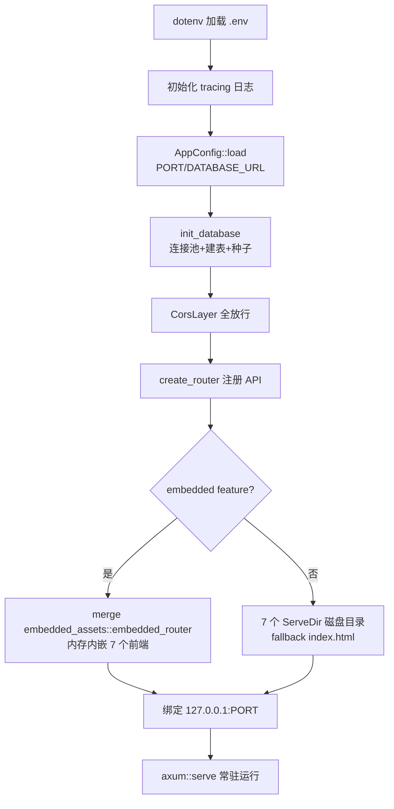

### 3.1.2 模块声明（41-58 行）

```rust
mod admin;               // 管理员模块：用户管理、角色管理
mod api_docs;            // OpenAPI 文档定义与导出
mod city3d;              // city3d 角色模块：城市 3D 展示
mod common;              // 公共模块：认证、中间件、数据模型、错误处理
mod config;              // 配置模块：从环境变量加载应用配置
mod database;            // 数据库模块：SQLite 连接、表创建、种子数据
mod fj200c_information;  // fj200c_information 角色模块：发动机监控
mod fj200c_main;         // fj200c_main 角色模块：发动机测控
mod ftj1c;               // ftj1c 角色模块：UDP 组播通信监控
mod fw100;               // fw150 角色模块：设备台账管理
mod fw150;
mod role_template;       // 角色模板：新角色开发的参考模板
mod roles;               // 角色注册表：全系统角色定义的单一事实来源
mod routes;              // 路由模块：集中注册所有 API 路由

#[cfg(feature = "embedded")]
mod embedded_assets;     // 单 exe 打包时才编译
```

**这是整个模块树的根**。每个 `mod xxx;` 对应 `src/xxx/` 目录（或 `src/xxx.rs`）。新增业务模块时，第一步就是在这里加一行 `mod xxx;`（第 08 章流程的第一步）。

注意 `embedded_assets` 用了 `#[cfg(feature = "embedded")]`——只有带 feature 编译时才存在这个模块，否则不编译（条件编译，见 02 章 2.15 节）。

### 3.1.3 主函数与 tokio（98-99 行）

```rust
#[tokio::main]
async fn main() -> Result<(), Box<dyn std::error::Error>> {
```

`#[tokio::main]` 是过程宏：它把你的 `async fn main` 包进一个同步 `fn main`，内部创建 Tokio 运行时再执行你的异步代码。**这是 axum 异步生态的入口**，所有 `.await` 都靠它运行。

`Result<(), Box<dyn std::error::Error>>`：函数可以失败；`()` 是空值；`Box<dyn Error>` 是"任意错误"（启动阶段还没引入 AppError，用最宽泛的错误类型）。

### 3.1.4 启动七步走（104-229 行）

**第一步：环境变量**（104 行）

```rust
dotenv::dotenv().ok();
```

读取运行目录的 `.env`。`.ok()` 表示"失败也没关系"（.env 不存在时静默）。

**第二步：日志**（115-120 行）

```rust
tracing_subscriber::registry()
    .with(tracing_subscriber::EnvFilter::new(
        std::env::var("RUST_LOG").unwrap_or_else(|_| "info".into()),
    ))
    .with(tracing_subscriber::fmt::layer())
    .init();
```

日志级别由环境变量 `RUST_LOG` 控制，默认 `info`。调试用 `RUST_LOG=debug` 重启。

**第三步：配置**（130 行）

```rust
let config = AppConfig::load()?;
```

读取 PORT（默认 3000）和 DATABASE_URL（默认 `sqlite://rustweb.db`）。`?` 传播错误——配置错了直接启动失败（比如 PORT 不是数字）。

**第四步：数据库**（138 行）

```rust
let pool = init_database(&config.database_url).await?;
```

建连接池 + 建表 + 插种子数据（3.4 节详述）。返回 `SqlitePool`（连接池），克隆成本极低，会被注入到所有 handler。

**第五步：CORS**（148-151 行）

```rust
let cors = CorsLayer::new()
    .allow_methods([Method::GET, Method::POST, Method::PUT, Method::DELETE])
    .allow_headers(Any)
    .allow_origin(Any);
```

开发时前端在 5173~5179，后端在 3000，跨域全靠它放行。**全放行**是开发便利；内网生产环境同源后形同虚设。

**第六步：路由与静态托管**（175-216 行）——最值得细看的部分

```rust
let app = {
    let base = create_router(pool)
        .layer(cors)
        .route("/", get(|| async { Redirect::permanent("/admin") }));

    #[cfg(feature = "embedded")]
    let app = base.merge(embedded_assets::embedded_router());

    #[cfg(not(feature = "embedded"))]
    let app = base
        .nest_service("/admin", ServeDir::new("dist-admin")
            .fallback(ServeFile::new("dist-admin/index.html")))
        // ... 其余 6 个前端同理
    app
};
```

三个设计点：

1. **`/` 重定向到 `/admin`**：根路径直接进管理后台，方便演示。
2. **双模式静态托管**：`--features embedded` 时前端内嵌内存；默认 dev 模式读磁盘 `dist-<app>/` 目录。
3. **`fallback(index.html)` 是 SPA 深链接的关键**：Vue Router 用 history 模式，浏览器直接访问 `/fj200c_information/data`（刷新页面）时服务器没有这个文件，fallback 返回 index.html，前端路由接管渲染。**没有这行，刷新就 404**。

注意第 173-174 行的注释：`.layer()` 在 axum 0.7 中只作用于调用时**已注册**的路由，所以 CORS 必须加在 `create_router(pool)` 之后、`merge/nest_service` 之前，确保 API 与静态路由都被包裹——这是踩过坑后留下的注释，改动时别把它破坏。

**第七步：启动**（222-229 行）

```rust
let addr = SocketAddr::from(([127, 0, 0, 1], config.port));
let listener = tokio::net::TcpListener::bind(addr).await?;
axum::serve(listener, app).await?;
Ok(())
```

`127.0.0.1` 绑定回环地址——**只允许本机访问**。要允许局域网访问，改成 `0.0.0.0`（AGENTS.md 有注明）。`axum::serve` 是常驻调用，程序在这里一直跑。

### 3.1.5 你将来会改 main.rs 的场景

| 场景 | 改哪里 |
|---|---|
| 改端口 | 第 130 行配置（或 .env 的 PORT） |
| 允许外网访问 | 第 222 行 `127.0.0.1` → `0.0.0.0` |
| 新增前端应用 | 第 183-213 行加一段 `nest_service` + 第 56-58 行加嵌入结构体 |
| 改根路径重定向 | 第 178 行 `/admin` |
| 调整 CORS | 第 148-151 行 |

---

## 3.2 第二个文件：routes.rs（路由集中注册，145 行）

### 3.2.1 设计思想

`src/routes.rs` 是**路由的中央集线器**：所有模块的 `xxx_router(db)` 子路由在这里拼装成一颗完整路由树，最后 `with_state(db)` 注入数据库连接池。

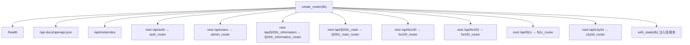

### 3.2.2 关键代码走读（108-144 行）

```rust
Router::<DatabaseConnection>::new()
    .route("/health", get(crate::common::health_check))
    .route("/api-docs/openapi.json", get(crate::api_docs::openapi_json))
    .route("/api/meta/roles", get(crate::roles::list_roles))
    .nest("/api/auth", auth_routes)
    .nest("/api/users", admin_routes)
    .nest("/api/fj200c_information", fj200c_information_routes)
    .nest("/api/fj200c_main", fj200c_main_routes)
    .nest("/api/fw100", fw100_routes)
    .nest("/api/ftj1c", ftj1c_routes)
    .nest("/api/city3d", city3d_routes)
    .nest("/api/fw150", fw150_routes)
    .with_state(db)
```

逐个解释：

1. **`Router::<DatabaseConnection>::new()`**：显式声明状态类型为数据库连接池。所有 handler 都可以用 `State(db): State<DatabaseConnection>` 拿它。
2. **三个公开端点**（无需登录）：
   - `/health`：健康检查（负载均衡/监控用）。
   - `/api-docs/openapi.json`：实时 OpenAPI 文档。
   - `/api/meta/roles`：角色注册表（前端运行时拉取）。
3. **`.nest(prefix, router)`**：挂载子路由，自动加前缀。`auth_router` 里的 `/login` 挂到 `/api/auth/login`。
4. **`.with_state(db)`**：最后注入状态。所有子路由共享同一个连接池。

### 3.2.3 nest 与 route 的区别（新手易混）

| 方法 | 用途 | 例子 |
|---|---|---|
| `.route(path, handler)` | 注册单个路由 | `.route("/health", get(health))` |
| `.nest(path, router)` | 挂载整棵子路由树 | `.nest("/api/auth", auth_router)` |
| `.nest_service(path, service)` | 挂载静态文件服务 | `.nest_service("/admin", ServeDir::new(...))` |
| `.layer(mw)` | 给**已注册**的路由添加中间件 | `.layer(cors)` |
| `.route_layer(mw)` | 只给该路由加中间件 | 各模块内部用 |
| `.with_state(s)` | 注入共享状态 | `.with_state(db)` |
| `.merge(router)` | 合并另一棵树（平级） | `embedded_router` |

### 3.2.4 新增模块时 routes.rs 怎么改

1. `let xxx_routes = crate::xxx::routes::xxx_router(db.clone());`
2. `.nest("/api/xxx", xxx_routes)`
3. 模块内部实现 `xxx_router()`（第 08 章详述）。

---

## 3.3 第三个文件：roles.rs（RBAC 唯一源，268 行）

### 3.3.1 为什么它最重要

`src/roles.rs` 是**全系统角色定义的单一事实来源**：前端菜单怎么显示、后端接口放行谁、用户列表角色下拉有哪些——最终都由这里驱动。

### 3.3.2 核心数据结构

```rust
// 角色定义
pub struct RoleDef {
    pub key: String,              // 角色标识（存数据库用，如 "admin"）
    pub name: String,             // 角色显示名（前端展示）
    pub permissions: &'static [Permission],   // 权限点列表
}

// 注册表：静态数组，全系统唯一的角色清单
pub static ROLE_REGISTRY: &[RoleDef] = &[
    RoleDef { key: "admin", name: "管理员",
        permissions: &[Permission::UsersRead, Permission::UsersWrite,
                       Permission::UsersDelete, Permission::SystemAdmin] },
    RoleDef { key: "fj200c_information", name: "fj200c_information",
        permissions: &[Permission::Fj200cInformationMonitor] },
    RoleDef { key: "fw100", name: "fw100", permissions: &[Permission::Fw100Monitor] },
    RoleDef { key: "ftj1c", name: "ftj1c", permissions: &[Permission::Ftj1cMonitor] },
    RoleDef { key: "city3d", name: "city3d", permissions: &[Permission::City3dView] },
    RoleDef { key: "fw150", name: "fw150", permissions: &[Permission::Fw150Monitor] },
    RoleDef { key: "fj200c_main", name: "fj200c_main",
        permissions: &[Permission::Fj200cMainMonitor] },
];
```

注意：`permissions: &'static [Permission]` 是**静态切片**——编译期内嵌的权限列表，不可变。注册表本身不可变，这就是"唯一源"的保证。

### 3.3.3 关键函数

```rust
// 根据角色 key 查权限列表
pub fn permissions_for(role: &str) -> Vec<Permission> {
    ROLE_REGISTRY.iter()
        .find(|r| r.key == role)          // 找到角色
        .map(|r| r.permissions.to_vec())  // 权限列表克隆
        .unwrap_or_default()              // 没找到 → 空权限（无权限用户）
}

// 角色是否存在于注册表（创建用户时白名单校验）
pub fn is_registered_role(role: &str) -> bool {
    ROLE_REGISTRY.iter().any(|r| r.key == role)
}

// 前端需要的 DTO：key + name + permissions
#[derive(Serialize, ToSchema)]
pub struct RoleInfo {
    pub key: String,
    pub name: String,
    pub permissions: Vec<Permission>,
}

// 公开端点：GET /api/meta/roles
pub async fn list_roles() -> Json<ApiResponse<Vec<RoleInfo>>> {
    let roles = ROLE_REGISTRY.iter()
        .map(|r| RoleInfo {
            key: r.key.to_string(),
            name: r.name.to_string(),
            permissions: r.permissions.to_vec(),
        })
        .collect();
    Json(ApiResponse::success(roles))
}
```

### 3.3.4 权限流动全景图

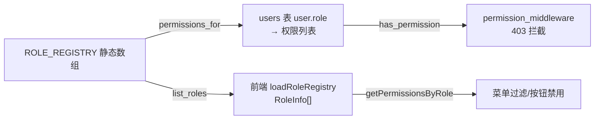

**重要理解**：
1. 数据库 users 表**只存角色字符串**（`role = 'admin'`），不存权限列表。
2. 权限是**推导**出来的：`permissions_for(role)` 查注册表。
3. 改权限 → 改注册表 → 重新生成 API（`npm run gen:api`）→ 前端自动同步。
4. `is_registered_role` 是**创建用户的白名单**：管理员不能给用户编造一个不存在的角色。

### 3.3.5 新增角色的后端改动（预告）

```rust
// 只需加一行：
RoleDef { key: "xxx", name: "xxx", permissions: &[Permission::XxxMonitor] },
```

加上后，`GET /api/meta/roles` 自动返回新角色，前端注册表加载自动同步，用户列表的角色下拉自动出现。**但注意**：光有注册表，新角色的接口/前端还不存在——第 08 章讲完整流程。

---

## 3.4 第四个文件：database.rs（建表 + 种子数据，1269 行）

### 3.4.1 设计思想：无迁移文件的数据库

一般项目用迁移工具（如 Diesel、Flyway）管理表结构；本项目**没有迁移文件**——建表 SQL 全在 `database.rs` 的 `create_tables` 函数里，启动时执行。特点是：

1. **幂等**：`CREATE TABLE IF NOT EXISTS`，重复执行无害。
2. **自动升级**：加了新表/新字段，重启即生效（老代码兼容旧表）。
3. **可重置**：删掉 `rustweb.db` 重启，自动重建 + 重新种种子。

### 3.4.2 初始化流程（init_database）

```rust
pub async fn init_database(database_url: &str) -> Result<SqlitePool, sqlx::Error> {
    // 1. 配置 SQLite 选项
    let options = SqliteConnectOptions::from_str(database_url)?
        .create_if_missing(true)        // 文件不存在自动创建
        .foreign_keys(true)             // 启用外键
        .journal_mode(SqliteJournalMode::Wal);   // WAL 模式（并发读写优化）

    // 2. 创建连接池
    let pool = SqlitePool::connect_with(options).await?;

    // 3. 建表
    create_tables(&pool).await?;

    // 4. 种子数据
    seed_data(&pool).await?;

    Ok(pool)
}
```

三个选项值得理解：

| 选项 | 作用 | 为什么 |
|---|---|---|
| `create_if_missing(true)` | 库文件不存在自动创建 | 开箱即用，无需手动建库 |
| `foreign_keys(true)` | 外键约束生效 | city3d 建筑引用区域 |
| `journal_mode(Wal)` | 预写日志模式 | 读写不互相阻塞，性能更好 |

### 3.4.3 建表清单（create_tables）

```rust
async fn create_tables(pool: &SqlitePool) -> Result<(), sqlx::Error> {
    // users 表
    sqlx::query(
        "CREATE TABLE IF NOT EXISTS users (
            id TEXT PRIMARY KEY,             -- UUID 存 TEXT
            username TEXT NOT NULL UNIQUE,
            email TEXT NOT NULL UNIQUE,
            password_hash TEXT NOT NULL,
            role TEXT NOT NULL DEFAULT 'fj200c_information',
            created_at DATETIME NOT NULL DEFAULT CURRENT_TIMESTAMP
        )",
    )
    .execute(pool)
    .await?;

    // user_settings 表（列配置 JSON）
    sqlx::query(
        "CREATE TABLE IF NOT EXISTS user_settings (
            user_id TEXT PRIMARY KEY,
            value TEXT NOT NULL,             -- JSON 字符串
            updated_at DATETIME NOT NULL DEFAULT CURRENT_TIMESTAMP
        )",
    )
    .execute(pool)
    .await?;

    // city3d 三张表 + 索引
    // ...（省略，模式相同）
    Ok(())
}
```

**新手注意**：
1. 主键用 `TEXT` 存 UUID 字符串（SQLite 无原生 UUID 类型）。
2. `UNIQUE` 约束配合 `INSERT OR IGNORE` 实现幂等种子。
3. 数据库列名 snake_case 与 Rust 结构体字段一致，sqlx 才能自动映射。
4. `database.rs` 后半部分有**旧表清理**逻辑（`DROP TABLE IF EXISTS` 老表名）和**角色迁移**逻辑（`UPDATE users SET role = ...`）——项目演进留下的痕迹，改表结构时注意保持幂等。

### 3.4.4 种子账号（seed_data）

7 个种子账号，密码全是 `123456`：

| 账号（email） | 角色 | 用途 |
|---|---|---|
| `admin@rustweb.dev` | admin | 管理后台 |
| `fj200c_information@rustweb.dev` | fj200c_information | 发动机监控 |
| `fj200c_main@rustweb.dev` | fj200c_main | 发动机测控 |
| `fw100@rustweb.dev` | fw100 | 设备台账 |
| `fw150@rustweb.dev` | fw150 | 设备台账 |
| `ftj1c@rustweb.dev` | ftj1c | 通信监控 |
| `city3d@rustweb.dev` | city3d | 城市 3D |

种子逻辑：

```rust
// 固定 UUID（幂等关键）：重复运行 INSERT OR IGNORE 不冲突
const SEED_UUIDS: &[(&str, &str, &str, &str)] = &[
    ("00000000-0000-4000-8000-000000000001", "admin", "admin@rustweb.dev", "admin"),
    // ... 7 个
];

for (id, username, email, role) in SEED_UUIDS {
    let hash = bcrypt::hash("123456", 10).unwrap();   // 每次启动都重算？——不，见下
    sqlx::query(
        "INSERT OR IGNORE INTO users (id, username, email, password_hash, role) VALUES (?, ?, ?, ?, ?)",
    )
    .bind(id)
    .bind(username)
    .bind(email)
    .bind(hash)
    .bind(role)
    .execute(pool)
    .await?;
}
```

> 注：实际实现会把哈希计算放在循环外或只算一次（bcrypt 代价参数 10 约 100ms，启动时一次性代价可接受）。`INSERT OR IGNORE` 保证已存在的用户（改过密码的）不被覆盖——**种子只在首次创建时生效**。

city3d 种子：5 个区域、51 座建筑（UUID 从基值递增）、8 个事件——都是演示数据，删库重启即恢复。

### 3.4.5 你将来会改 database.rs 的场景

| 场景 | 改法 |
|---|---|
| 新增业务表 | `create_tables` 加 `CREATE TABLE IF NOT EXISTS` |
| 加字段 | 老表加列用 `ALTER TABLE ... ADD COLUMN`（注意幂等：先查是否已存在）或改建表语句 |
| 换种子密码 | 改 `123456` |
| 加演示数据 | 参照 city3d 种子写法 |

---

## 3.5 common 公共层精读（全系统的地基）

`src/common/` 是**所有角色共用**的基础设施，17 个子模块。这是全项目价值密度最高的目录，逐个精读。

### 3.5.1 common/mod.rs：模块门面

```rust
pub mod auth;
pub mod config;
pub mod csv_writer;
pub mod dto;
pub mod error;
pub mod frame_extractor;
pub mod global_var;
pub mod io;
pub mod jwt;
pub mod latest_frame;
pub mod ledger;
pub mod least_squares;
pub mod middleware;
pub mod models;
pub mod quad_frame;
pub mod service;
pub mod utils;
pub mod ws;

/// 健康检查：GET /health → 200
pub async fn health_check() -> &'static str {
    "OK"
}
```

`health_check` 返回 `&'static str`（常量字符串），Axum 自动转 `text/plain` 响应——最简单的 handler 形态。

### 3.5.2 common/models.rs：核心模型（389 行）

**Permission 枚举**（2.4.2 已讲，跳过）→ 直接看 User：

```rust
#[derive(Debug, Clone, Serialize, Deserialize, utoipa::ToSchema)]
pub struct User {
    pub id: uuid::Uuid,
    pub username: String,
    pub email: String,
    #[serde(skip_serializing)]
    pub password_hash: String,
    pub role: String,
    pub created_at: chrono::NaiveDateTime,
}

impl User {
    pub fn permissions(&self) -> Vec<Permission> {
        crate::roles::permissions_for(&self.role)
    }
    pub fn has_permission(&self, permission: &Permission) -> bool {
        self.permissions().contains(permission)
    }
}
```

**ApiResponse 统一响应**（前端所有接口的标准包装）：

```rust
#[derive(Debug, Clone, Serialize, Deserialize, utoipa::ToSchema)]
pub struct ApiResponse<T> {
    pub success: bool,          // 是否成功
    pub message: String,        // 提示信息（失败时是错误描述）
    pub data: Option<T>,        // 业务数据（成功时 Some）
}

impl<T> ApiResponse<T> {
    pub fn success(data: T) -> Self {
        Self { success: true, message: "ok".to_string(), data: Some(data) }
    }
    pub fn error(message: impl Into<String>) -> Self {
        Self { success: false, message: message.into(), data: None }
    }
}
```

**LoginRequest 与校验**：

```rust
#[derive(Debug, Deserialize, ToSchema)]
pub struct LoginRequest {
    #[validate(email)]                  // validator 属性：邮箱格式校验
    pub email: String,
    pub password: String,
}
```

### 3.5.3 common/middleware.rs：三个中间件（198 行）

这是权限体系的执行层。三个中间件一条链：

```rust
/// ① 从请求头提取 Bearer token 并验证，返回用户 ID
fn extract_user_id(request: &Request) -> Result<uuid::Uuid, StatusCode> {
    let auth_header = request.headers()
        .get("Authorization")
        .and_then(|h| h.to_str().ok())
        .and_then(|s| s.strip_prefix("Bearer "));   // "Bearer xxx" → "xxx"
    let token = auth_header.ok_or(StatusCode::UNAUTHORIZED)?;
    jwt::verify_token(token).map_err(|_| StatusCode::UNAUTHORIZED)
}

/// ② 从数据库加载用户（未找到 → 401）
async fn load_user(db: &DatabaseConnection, user_id: uuid::Uuid) -> Result<User, StatusCode> {
    sqlx::query_as::<_, User>("SELECT * FROM users WHERE id = ?1")
        .bind(user_id)
        .fetch_optional(db)
        .await
        .map_err(|_| StatusCode::INTERNAL_SERVER_ERROR)?
        .ok_or(StatusCode::UNAUTHORIZED)
}

/// ③ 鉴权中间件：验证 token → 加载用户 → 注入 Extension
pub async fn auth_middleware(
    State(db): State<DatabaseConnection>,
    mut request: Request,
    next: Next,
) -> Result<Response, StatusCode> {
    let user_id = extract_user_id(&request)?;
    let user = load_user(&db, user_id).await?;
    request.extensions_mut().insert(user);   // ★ 把用户塞进请求扩展区
    Ok(next.run(request).await)              // 放行，handler 用 Extension 取
}

/// ④ 权限中间件：额外检查指定权限
pub async fn permission_middleware(
    required_permission: Permission,
    State(db): State<DatabaseConnection>,
    mut request: Request,
    next: Next,
) -> Result<Response, StatusCode> {
    let user_id = extract_user_id(&request)?;
    let user = load_user(&db, user_id).await?;
    if !user.has_permission(&required_permission) {
        return Err(StatusCode::FORBIDDEN);   // 有身份但无权限 → 403
    }
    request.extensions_mut().insert(user);
    Ok(next.run(request).await)
}

/// ⑤ 角色中间件：SystemAdmin 专用（admin 模块）
pub async fn role_middleware(/* ... 检查 Permission::SystemAdmin */) -> Result<Response, StatusCode> { ... }
```

**中间件模式总结**（新手必记）：
- 签名固定：`(State, Request, Next) -> Result<Response, StatusCode>`（额外参数如 `required_permission` 需要**函数包装**，因为 `from_fn` 不能传参——见 3.7 节 admin/routes.rs）。
- 三件事：**验证 → 加载 → 注入**。
- 放行 = `next.run(request).await`；拦截 = 返回 `StatusCode`。
- `request.extensions_mut().insert(user)`：Axum 的"请求背包"，中间件放进什么，handler 用 `Extension<T>` 取什么。

### 3.5.4 common/error.rs：统一错误（212 行）

已在本章 2.9 精读，这里补一张"错误转换关系图"：

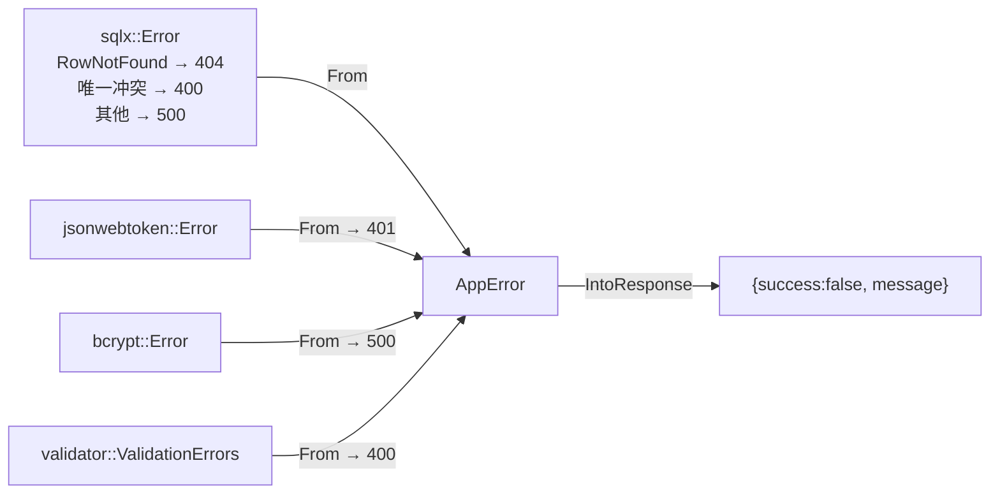

### 3.5.5 common/dto.rs：公共响应 DTO

```rust
#[derive(Debug, Clone, Serialize, ToSchema)]
pub struct ServiceStatus { pub running: bool }        // 服务启停状态

#[derive(Debug, Clone, Serialize, ToSchema)]
pub struct SentResult { pub sent: bool }              // 命令发送结果

#[derive(Debug, Clone, Serialize, ToSchema)]
pub struct SavedResult { pub saved: bool }            // 配置保存结果

#[derive(Debug, Clone, Serialize, ToSchema)]
pub struct ConfigContent { pub content: String }      // INI 文件内容

#[derive(Debug, Clone, Serialize, ToSchema)]
pub struct CsvFileList { pub files: Vec<String>, pub dir: String }  // CSV 文件列表

#[derive(Debug, Clone, Serialize, ToSchema)]
pub struct CsvFileContent { pub content: String }     // CSV 文件内容
```

这些"小响应体"是硬件的公共返回形态，三个硬件模块共用。**新增通用响应体放这里**。

### 3.5.6 common/ws.rs：WebSocket 事件桥（90 行）

```rust
/// 把 broadcast 通道的事件推给一个 WS 连接（无初始快照版本）
pub async fn ws_bridge<T>(
    tx: broadcast::Sender<T>,
    socket: WebSocket,
    log_prefix: &str,
) where T: Serialize + Clone + Send + Sync + 'static
{
    ws_bridge_with_initial(tx, socket, log_prefix, None).await;
}

/// 带初始快照：连接建立时先推一条（前端刷新页面立刻有数据）
pub async fn ws_bridge_with_initial<T>(
    tx: broadcast::Sender<T>,
    socket: WebSocket,
    log_prefix: &str,
    initial: Option<String>,       // 初始消息（已序列化好的 JSON）
) where T: Serialize + Clone + Send + Sync + 'static
{
    let (mut sender, mut receiver) = socket.split();   // 拆成发送/接收两半
    let mut rx = tx.subscribe();                       // 订阅广播

    if let Some(initial) = initial {
        if sender.send(Message::Text(initial)).await.is_err() { return; }
    }

    loop {
        tokio::select! {
            // 客户端 → 服务端（本项目一般只用 Close 消息做退出）
            msg = receiver.next() => {
                match msg {
                    Some(Ok(Message::Close(_))) | None | Some(Err(_)) => break,
                    _ => {}
                }
            }
            // 服务端 → 客户端（广播事件推送）
            event = rx.recv() => {
                match event {
                    Ok(evt) => {
                        let text = serde_json::to_string(&evt).unwrap_or_default();
                        if sender.send(Message::Text(text)).await.is_err() {
                            break;   // 客户端断开
                        }
                    }
                    Err(RecvError::Lagged(_)) => continue,   // 慢客户端丢事件
                    Err(RecvError::Closed) => break,          // 广播通道关闭
                }
            }
        }
    }
    tracing::info!("{log_prefix} WebSocket 连接关闭");
}
```

**这是全项目 WS 的公共实现**——所有硬件模块的 ws_handler 最后都调用它。注意 `where T: Serialize + Clone + Send + Sync + 'static`：泛型约束说明事件类型需要能序列化、能克隆、线程安全——事件枚举都满足。

### 3.5.7 common/service.rs：ServiceRuntime（线程管理）

```rust
/// 全局线程句柄池：管理所有业务线程的启停
pub struct ServiceRuntime {
    handles: Mutex<Vec<JoinHandle<()>>>,
    stop: AtomicBool,
}

impl ServiceRuntime {
    /// 登记线程句柄
    pub fn push(&self, handle: JoinHandle<()>) { ... }

    /// 请求停止：置标志 + 等所有线程 join（最长 timeout_secs 秒）
    pub fn stop_and_wait(&self, timeout_secs: u64) { ... }

    /// 检查停止标志
    pub fn is_stopped(&self) -> bool { ... }
}

// 全局单例
pub static RUNTIME: OnceLock<Mutex<ServiceRuntime>> = ...;
```

**服务生命周期四步曲**（三个硬件模块统一）：


### 3.5.8 common/io.rs：IoControl trait（2.7.1 已详述，此处补充）

```rust
pub trait IoControl {
    fn send(&self, data: &[u8]) -> Result<(), String>;
    fn recv(&self) -> Result<Vec<u8>, String>;
    fn set_timeout(&self, timeout_ms: u32) -> Result<(), String>;
}
```

### 3.5.9 common/frame_extractor.rs：帧提取器（112 行）

串口是**字节流**，没有消息边界。帧提取器负责从字节流里"攒"出完整的一帧：

```rust
pub struct FrameExtractor {
    header: Vec<u8>,              // 帧头标记（如 [0xEB, 0x90, 0x64]）
    frame_size: usize,            // 帧总长（如 100）
    validator: Option<fn(&[u8]) -> bool>,   // 校验函数（累加和）
    decoder: Option<fn(&[u8]) -> Option<Vec<String>>>,  // 解码函数
    buffer: Vec<u8>,              // 字节缓冲
}

impl FrameExtractor {
    /// 喂入新字节，产出完整帧（可能有 0/1/多帧）
    pub fn process(&mut self, bytes: &[u8]) -> Vec<Vec<u8>> {
        self.buffer.extend_from_slice(bytes);
        let mut frames = Vec::new();
        loop {
            // 1. 找帧头：跳过帧头前的脏数据
            let Some(pos) = find_header(&self.buffer, &self.header) else { break };
            if pos > 0 { self.buffer.drain(..pos); }   // 丢弃脏数据
            // 2. 攒够一帧？
            if self.buffer.len() < self.frame_size { break; }
            // 3. 取出候选帧
            let frame: Vec<u8> = self.buffer.drain(..self.frame_size).collect();
            // 4. 校验（累加和/固定字段）
            if self.validator.map_or(true, |v| v(&frame)) {
                frames.push(frame);                     // 合法帧
            } else {
                // 校验失败：丢弃第 1 字节，重新对齐（防卡死）
                self.buffer.drain(..1);
            }
        }
        frames
    }
}
```

状态机逻辑：**找帧头 → 丢脏数据 → 攒帧 → 校验 → 解码**。校验失败时"逐字节丢弃"是防呆设计——不会因为一帧坏数据卡死整个流。

### 3.5.10 common/quad_frame.rs：四槽帧缓冲（主备切换）

```rust
/// 四槽帧缓冲：主备双数据源的最新帧管理
pub struct QuadFrame<const FRAME_LEN: usize> {
    frames: [ArcSwap<[u8; FRAME_LEN]>; 4],   // 槽位 0-3
    sequence: AtomicU32,                      // 全局序号（CAS 去重）
}

impl<const FRAME_LEN: usize> QuadFrame<FRAME_LEN> {
    /// 尝试更新：序号大于当前才生效（去旧帧）
    pub fn try_update(&self, slot: usize, frame: [u8; FRAME_LEN], seq: u32) -> bool {
        // CAS：只有 seq 更大才写入
        // 主源心跳超时后，备源自动接管
    }
}
```

ftj1c 用它实现**主备双路 UDP**：主链路断流（心跳超时 1000ms）后备链路自动接管，主链路恢复自动切回。`ArcSwap` 保证读者永远无锁读到最新帧。

### 3.5.11 common/latest_frame.rs：最新帧跟踪器

```rust
/// 简单版"最新帧"：ArcSwap 存最新帧 + CAS 序号去重
pub struct LatestFrame<N> { ... }
```

与 quad_frame 的区别：单槽、用于其他模块（fj200c_information 的 frame_bundle 类似）。

### 3.5.12 common/global_var.rs：全局 KV（123 行）

```rust
/// 进程内全局键值存储（OnceLock + RwLock + HashMap）
pub struct GlobalVar { inner: RwLock<HashMap<String, String>> }

impl GlobalVar {
    pub fn init() -> &'static GlobalVar { ... }   // 初始化单例
    pub fn set(&self, key: &str, value: &str) { ... }
    pub fn get(&self, key: &str) -> Option<String> { ... }
    pub fn get_or(&self, key: &str, default: &str) -> String { ... }
    pub fn delete(&self, key: &str) { ... }
    pub fn snapshot(&self) -> HashMap<String, String> { ... }
    pub fn clear(&self) { ... }
}

pub static GLOBAL_VAR: OnceLock<GlobalVar> = OnceLock::new();
pub fn global_var() -> &'static GlobalVar { ... }
```

用途：fj200c_main 的试验信息、主题状态等"轻量服务端状态"以 JSON 字符串存这里。**特点**：不落数据库，重启即失——适合临时状态。

### 3.5.13 common/csv_writer.rs：CSV 写入器（2.24.1 已详述，此处补 Drop 细节）

```rust
impl Drop for CsvWriter {
    fn drop(&mut self) {
        let _ = self.flush();   // 无论何时销毁，把残余数据写盘
    }
}
```

`Drop` trait：对象销毁时自动执行——防止"进程被杀丢数据"。这是 Rust 的资源管理精髓（RAII）。

### 3.5.14 common/config.rs：INI 封装（2.23 已详述）

### 3.5.15 common/utils.rs：工具函数（2.31 已详述）

### 3.5.16 common/ledger.rs：台账演示数据

```rust
pub struct LedgerItem {
    pub id: String,
    pub name: String,
    pub category: String,
    pub status: String,
    pub location: String,
    pub updated_at: String,
}

/// 按用户名生成不同的演示数据（fw100/fw150 共用）
pub fn demo_ledger_items(username: &str) -> Vec<LedgerItem> { ... }
```

fw100/fw150 的"设备台账"就是它生成的演示数据——没有数据库表，纯函数生成。**最简模块的真相**。

### 3.5.17 common/least_squares.rs：最小二乘拟合（86 行）

```rust
/// 多段线性拟合（最小二乘）：xjc 数据校正用
pub struct LeastSquareEstimation;
impl LeastSquareEstimation {
    /// 构造法方程并解（列主元 Gauss 消元）
    pub fn multi_line(xs: &[Vec<f64>], ys: &[f64], degree: usize) -> Vec<f64> { ... }
}
```

数值计算工具，发动机数据校正用，新手了解即可。

---

## 3.6 auth 登录流程精读（全系统入口）

### 3.6.1 auth 模块结构

```
src/common/auth/
├── mod.rs          # 模块声明
├── routes.rs       # auth_router：POST /login + GET /profile
├── handlers.rs     # login / get_profile 两个 handler（156 行）
└── services.rs     # AuthService：登录/查用户/建用户/默认设置（249 行）
```

### 3.6.2 登录的完整时序

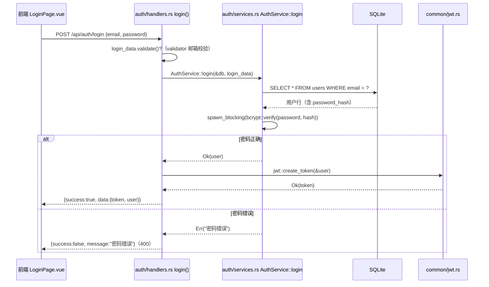

### 3.6.3 handlers.rs 逐行（登录 handler 是"全项目最标准的 handler 模板"）

```rust
#[utoipa::path(
    post,
    tag = "auth",
    path = "/api/auth/login",
    operation_id = "authLogin",
    request_body = LoginRequest,
    responses((status = 200, description = "登录成功", body = ApiResponse<LoginResponse>)),
)]
pub async fn login(
    State(db): State<DatabaseConnection>,
    Json(login_data): Json<LoginRequest>,
) -> Result<Json<ApiResponse<LoginResponse>>, AppError> {
    login_data.validate()?;                                    // ① 输入校验
    let user = AuthService::login(&db, login_data)             // ② 服务层
        .await
        .map_err(|e| AppError::bad_request(e.to_string()))?;
    let token = jwt::create_token(&user)?;                     // ③ 签发 JWT
    Ok(Json(ApiResponse::success(LoginResponse { token, user })))  // ④ 统一响应
}
```

**四步模板**（写任何 handler 都照抄这个骨架）：
1. **校验输入**：`xxx.validate()?`（validator crate）
2. **调服务**：`Service::xxx(&db, data).await?`（错误转换）
3. **附加逻辑**：如签发 token
4. **统一响应**：`Ok(Json(ApiResponse::success(data)))`

`get_profile` 是"零参数 handler"的范例——用户信息由中间件注入，handler 只是取出来返回：

```rust
pub async fn get_profile(
    Extension(user): Extension<User>,      // ← 中间件塞进去的
) -> Result<Json<ApiResponse<User>>, AppError> {
    Ok(Json(ApiResponse::success(user)))
}
```

### 3.6.4 services.rs 精读：登录的服务层实现

```rust
pub async fn login(
    pool: &DatabaseConnection,
    login_data: LoginRequest,
) -> Result<User, Box<dyn std::error::Error>> {
    // ① 按邮箱查用户（找不到 → "用户不存在"）
    let user = sqlx::query_as::<_, User>("SELECT * FROM users WHERE email = $1")
        .bind(&login_data.email)
        .fetch_optional(pool)
        .await?
        .ok_or("用户不存在")?;

    // ② 验证密码（bcrypt，CPU 密集 → spawn_blocking）
    let password = login_data.password;
    let expected_hash = user.password_hash.clone();
    let is_valid = tokio::task::spawn_blocking(move || {
        verify(password.as_bytes(), &expected_hash)
    })
    .await??;                 // 两层 ?：外层是 JoinHandle 错误，内层是 verify 错误
    if !is_valid {
        return Err("密码错误".into());
    }
    Ok(user)
}
```

值得学习的点：

1. **`ok_or("用户不存在")?`**：把 `Option` 转成 `Result`，错误信息是字符串，靠 `From<&str> for Box<dyn Error>` 自动转。
2. **`.await??` 双层问号**：`spawn_blocking` 返回 `JoinHandle<Result<bool, bcrypt::Error>>`，第一个 `?` 解 JoinHandle（线程 panic 等），第二个 `?` 解 bcrypt 错误。
3. **安全细节**：密码错误返回"密码错误"、用户不存在返回"用户不存在"——严格说存在**用户枚举**风险（攻击者可探测邮箱是否存在），内网系统权衡可接受；高安全需求时应统一为"邮箱或密码错误"。
4. **服务层错误用 `Box<dyn Error>`**，handler 层统一转 `AppError`——服务层不依赖 HTTP 概念，可复用（测试友好）。

### 3.6.5 create_user：管理员建用户

```rust
pub async fn create_user(
    pool: &DatabaseConnection,
    username: &str, email: &str, password: &str, role: &str,
) -> Result<User, Box<dyn std::error::Error>> {
    // ① 查重：邮箱或用户名已存在 → 报错
    let existing_user = sqlx::query_as::<_, User>(
        "SELECT * FROM users WHERE email = $1 OR username = $2",
    ).bind(email).bind(username).fetch_optional(pool).await?;
    if existing_user.is_some() {
        return Err("用户名或邮箱已存在".into());
    }

    // ② bcrypt 加密（spawn_blocking）
    let password_hash = tokio::task::spawn_blocking(move || {
        hash(password_owned.as_bytes(), DEFAULT_COST)
    }).await??;

    // ③ 插入 + RETURNING *（SQLite 3.35+ 支持）
    let user = sqlx::query_as::<_, User>(
        r#"INSERT INTO users (id, username, email, password_hash, role, created_at, updated_at)
           VALUES ($1, $2, $3, $4, $5, $6, $7) RETURNING *"#,
    ).bind(Uuid::new_v4()).bind(username).bind(email)
      .bind(&password_hash).bind(role).bind(now).bind(now)
      .fetch_one(pool).await?;

    // ④ 建默认设置
    Self::create_default_settings(pool, user.id).await?;
    Ok(user)
}
```

注意这里 SQL 用了 `r#"..."#` **原始字符串**——多行 SQL 不需要转义，是 Rust 写长 SQL 的标准姿势。

### 3.6.6 routes.rs：路由与中间件

```rust
pub fn auth_router(db: DatabaseConnection) -> Router {
    Router::new()
        // 登录：公开（不需要任何中间件）
        .route("/login", post(crate::common::auth::handlers::login))
        // 用户信息：需要登录（auth_middleware）
        .route(
            "/profile",
            get(crate::common::auth::handlers::get_profile)
                .route_layer(axum::middleware::from_fn(auth_middleware)),
        )
        .with_state(db)
}
```

**关键区分**：
- `/login` 无中间件——登录前没有 token。
- `/profile` 挂 `auth_middleware`——必须登录。
- `.route_layer()` 只作用于该路由；`.layer()` 作用于所有已注册路由。

---

## 3.7 admin 模块精读（用户管理）

### 3.7.1 模块结构与路由（routes.rs，106 行）

admin 的路由设计值得细看：**按权限分三组**，每组中间件不同：

```rust
use crate::common::middleware::{auth_middleware, permission_middleware, role_middleware};

// ★ from_fn 不能传参，所以用闭包包装固定权限的中间件
fn users_read_middleware() -> axum::middleware::FromFn<...> {
    axum::middleware::from_fn(move |request, next| {
        permission_middleware(Permission::UsersRead, request, next)
    })
}

pub fn admin_router(db: DatabaseConnection) -> Router {
    Router::new()
        // 读组：GET /api/users（UsersRead）
        .route("/", get(list_users).route_layer(users_read_middleware()))
        // 写组：POST /api/users + PUT /api/users/:id/role（UsersWrite）
        .route("/", post(create_user).route_layer(users_write_middleware()))
        .route("/{id}/role", put(update_user_role).route_layer(users_write_middleware()))
        // 删组：DELETE /api/users/:id（UsersDelete）
        .route("/{id}", delete(delete_user).route_layer(users_delete_middleware()))
        .with_state(db)
}
```

**项目独有的中间件包装模式**：`permission_middleware` 需要 `required_permission` 参数，但 `from_fn` 只能接受 `fn(Request, Next)` 形状的函数——所以用**闭包固定参数**再传给 `from_fn`。这就是 admin 权限细分的基础：读、写、删三个权限各自控制一组路由。

权限 → 路由映射表：

| 权限 | 控制的路由 |
|---|---|
| `UsersRead` | GET /api/users |
| `UsersWrite` | POST /api/users、PUT /api/users/{id}/role |
| `UsersDelete` | DELETE /api/users/{id} |

> 注意 axum 0.7 的路径参数语法是 `{id}`（0.6 是 `:id`）。**升级/模仿代码时注意版本差异**。

### 3.7.2 handlers.rs 的安全细节（230 行）

```rust
// ① 创建用户：角色白名单
pub async fn create_user(
    State(db): State<DatabaseConnection>,
    Json(body): Json<CreateUserRequest>,
) -> Result<Json<ApiResponse<User>>, AppError> {
    // 角色必须在注册表中，否则拒绝（防注入任意角色）
    if !is_registered_role(&body.role) {
        return Err(AppError::bad_request(format!("未知角色: {}", body.role)));
    }
    let user = AuthService::create_user(&db, &body.username, &body.email, &body.password, &body.role)
        .await
        .map_err(|e| AppError::bad_request(e.to_string()))?;
    Ok(Json(ApiResponse::success(user)))
}

// ② 修改角色：不能移除自己的管理角色（防锁死）
pub async fn update_user_role(...) -> Result<Json<ApiResponse<User>>, AppError> {
    let current_user: User = request.extensions().get().unwrap().clone();
    if body.role != "admin" && current_user.id == user_id && current_user.role == "admin" {
        return Err(AppError::bad_request("不能移除自己的管理角色".to_string()));
    }
    // ... 更新
}

// ③ 删除用户：不能删自己
pub async fn delete_user(...) -> Result<Json<ApiResponse<()>>, AppError> {
    if current_user.id == user_id {
        return Err(AppError::bad_request("不能删除自己".to_string()));
    }
    // ... 删除
}
```

三个安全细节都是"防止管理员把自己锁在门外"的设计——接盘后**不要去掉**。

### 3.7.3 页面与接口对照（admin 前端）

| 前端页面 | 接口 | 方法 |
|---|---|---|
| Users.vue 列表 | `GET /api/users` | list_users |
| CreateUser.vue 提交 | `POST /api/users` | create_user |
| Users.vue 编辑角色 | `PUT /api/users/{id}/role` | update_user_role |
| Users.vue 删除 | `DELETE /api/users/{id}` | delete_user |

---

## 3.8 fj200c_information 完整精读（最典型硬件模块范本）

### 3.8.1 模块全景

这是全项目**最值得精读**的模块：麻雀虽小五脏俱全，串口、模拟器、帧提取、解码、CSV 状态机、命令通道、WS 推送、配置热加载全部具备，而代码量（约 1800 行）远小于 fj200c_main。

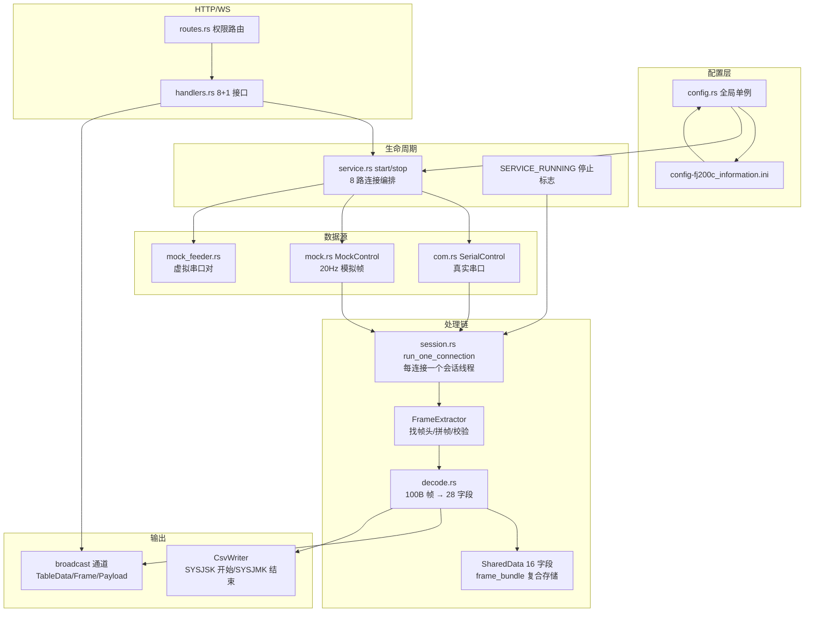

### 3.8.2 事件与通道（mod.rs）

```rust
// 事件枚举：WS 推送的三种载荷
#[derive(Debug, Clone, Serialize, ToSchema)]
#[serde(tag = "type")]
pub enum Fj200cInformationEvent {
    TableData { connection_index: usize, rows: Vec<TableRow> },  // 16 字段表格行
    Frame { connection_index: usize, hex: String, frame_type: String, fields: Vec<String> },  // 帧明细
    Payload { connection_index: usize, hex: String },             // 原始字节
}

// 广播通道（容量 1024）
pub static FJ200C_INFORMATION_TX: OnceLock<broadcast::Sender<Fj200cInformationEvent>> = OnceLock::new();
pub fn fj200c_information_tx() -> broadcast::Sender<Fj200cInformationEvent> {
    FJ200C_INFORMATION_TX.get_or_init(|| broadcast::channel(1024).0).clone()
}
```

**三种事件的定位**（前端据此决定渲染什么）：
- `Payload`：原始字节（命令通道面板/调试用）。
- `Frame`：单帧详情（帧类型 + 28 字段 + hex，可视化页用）。
- `TableData`：16 个标识字段汇总（监控表格用，200ms 节流）。

### 3.8.3 会话线程 run_one_connection（session.rs，核心中的核心）

这是整个模块的大脑。**逐段精读**（对应真实文件 90-202 行）：

```rust
pub fn run_one_connection(
    connection_index: usize,
    control: Arc<dyn IoControl>,                          // 串口或模拟器（trait 对象）
    tx: broadcast::Sender<Fj200cInformationEvent>,        // 广播发送端
    cfg: &Config,                                         // 配置引用
) {
    // ① 读 CSV 配置
    let csv_enabled = cfg.get_or("CSV", "Enabled", "true").eq_ignore_ascii_case("true");
    let csv_dir = cfg.get_or("CSV", "Dir", "csv");

    // ② 设置接收超时（200ms：超时=轮询周期）
    if let Err(e) = control.set_timeout(RECV_TIMEOUT_MS) { ... }

    // ③ 构造帧提取器（注入校验函数 + 解码闭包）
    //    ★ 解码器把结果写入共享 Arc<Mutex<Option<ExtractedFrame>>>，
    //      主循环 try_lock 取走——解码器与主循环解耦
    let result: Arc<Mutex<Option<ExtractedFrame>>> = Arc::new(Mutex::new(None));
    let decoder = make_decoder(Arc::clone(&result));
    let mut extractor = FrameExtractor::new(HEADER.to_vec(), FRAME_LEN,
        Box::new(frame_validator), Box::new(decoder));

    // ④ 主循环
    loop {
        // 停止检查（Relaxed 序：单标志轮询足够）
        if STOP_SIGNAL.load(Ordering::Relaxed) { break; }

        // ⑤ 命令通道：非阻塞取命令并发送
        if let Some(cmd_rx) = COMMAND_RX.get() {
            if let Ok(cmd) = cmd_rx.lock().unwrap().try_recv() {
                control.send(&cmd)?;   // 写进串口/模拟器
            }
        }

        // ⑥ 阻塞读（串口 200ms 超时轮询）
        match control.recv(&mut recv_buf) {
            Ok(n) if n > 0 => {
                // 节流推送 payload 事件（200ms 最多一次）
                // 送入帧提取器
                extractor.feed(chunk);
                // 非阻塞取解码结果 → handle_frame
                if let Ok(mut guard) = result.try_lock() {
                    if let Some(extracted) = guard.take() {
                        handle_frame(connection_index, extracted, &tx, ...);
                    }
                }
            }
            Ok(_) => {}                      // 空数据（超时无数据）继续
            Err(e) => {
                if is_timeout(&e) { continue; }   // 超时是常态，继续轮询
                break;                             // 真实错误（设备拔出）退出
            }
        }
    }
    // 退出前 flush CSV
    if let Some(writer) = &csv { let _ = writer.flush(); }
}
```

**设计精华提炼**（面试/答辩都能用）：

1. **非阻塞命令通道**：命令（前端发送的 hex 指令）通过 `mpsc` 通道 `try_recv` 拉取——数据流优先级高于命令流，命令不会插队阻塞收帧。
2. **try_lock 解耦解码**：解码闭包在 extractor 内部被调用（同一线程），写完 `Some(frame)` 后主循环 `try_lock` 取走——不成功就下一轮再取，绝不阻塞。
3. **超时=心跳**：`RECV_TIMEOUT_MS = 200`，串口 read 超时返回空数据 → 继续循环 → 相当于 5Hz 的"循环心跳"，让停止标志能在 200ms 内被响应。
4. **`Ok(_) => {}` 空分支**：超时无数据时静默继续——**不要**在这里记日志，否则每秒刷 5 条废话。

### 3.8.4 handle_frame：帧处理与 CSV 状态机（212-311 行）

```rust
fn handle_frame(...) {
    // 帧类型 → 中文名（match 映射）
    let frame_type = match &extracted.frame_type {
        FrameType::CSSZZL => "参数设置",
        FrameType::SYSJSK => "试验数据首块",
        ...
    };

    // CSV 状态机
    match extracted.frame_type {
        FrameType::SYSJSK => {           // 首块：创建文件
            *csv_active = true;
            let filename = format!("fj200c_information_{}.csv",
                chrono::Local::now().format("%Y%m%d_%H%M%S"));
            *csv = Some(CsvWriter::create(csv_dir, &filename, CSV_HEADERS)?);
        }
        FrameType::SYSJZJK => {          // 中间块：写行
            if csv_active {
                let fields = decode(...);
                writer.write_row(fields)?;
            }
        }
        FrameType::SYSJMK => {           // 末块：flush + 关闭
            writer.flush();
            *csv = None;
            *csv_active = false;
        }
        _ => decode_shared_data(&extracted.data),   // 其他帧：解码标识字段
    }

    // ① 更新全局复合存储（WS 快照用）
    frame_bundle().update(fields, &extracted.data);

    // ② 推送 Frame 事件（每帧都发，可视化用）
    tx.send(Fj200cInformationEvent::Frame { ... });

    // ③ 推送 TableData 事件（200ms 节流，防 UI 卡顿）
    if last_table_emit.elapsed() >= TABLE_EMIT_INTERVAL {
        tx.send(Fj200cInformationEvent::TableData { rows: shared_data_rows() });
    }
}
```

**CSV 状态机**（硬件协议驱动）：

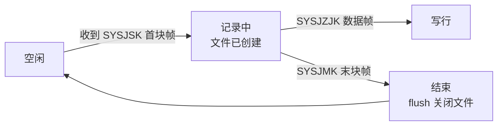

**节流**是新手容易忽略的设计：20Hz 模拟帧如果每帧都推 TableData，前端表格 50ms 刷新一次必然卡顿。200ms 节流把刷新频率压到 5Hz——体验流畅度与数据实时性的平衡。

### 3.8.5 decode_shared_data：16 字段解码（318-365 行）

```rust
fn decode_shared_data(frame: &[u8]) {
    let shared = SharedData::global();      // 全局单例（16 个 RwLock<String>）
    // 从帧的固定字节偏移取字段
    ascii.copy_from_slice(&frame[4..12]);
    *shared.field_product_name.write().unwrap() =
        utils::little_endian_bytes_to_ascii(&ascii)...;   // 产品名称
    *shared.field_engine_product_code.write().unwrap() = ...;  // 发动机产品代号
    // ... 共 16 个字段
}
```

**协议知识**：帧格式为 `[帧头 3B][数据区 96B][校验 1B]`，标识字段按**固定字节偏移**存放（frame[4..12] 是产品名称等）。解码就是把字节切出来转成可读文本。改协议时改这里的偏移量。

### 3.8.6 service.rs：服务编排（177 行）

```rust
pub fn start_service(db: &DatabaseConnection, config: Config) -> Result<(), String> {
    // 先停旧服务（防重复启动）
    stop_service();
    RUNTIME.wait_stopping(3);

    // 遍历 8 个连接
    for connection in 0..MAX_CONNECTIONS {     // MAX_CONNECTIONS = 8
        let enabled = config.get_or(&format!("Connection{connection}"), "Enabled", "false");
        if enabled != "true" { continue; }      // 未启用跳过

        let tx = fj200c_information_tx();
        // 模拟 or 串口
        let control: Arc<dyn IoControl> = if mock_enabled {
            Arc::new(MockControl::create())     // 20Hz 正弦+噪声模拟
        } else {
            Arc::new(SerialControl::open(&cfg, connection)?)   // 真实串口
        };
        let handle = std::thread::spawn(move || {
            run_one_connection(connection, control, tx, &config);
        });
        RUNTIME.push(handle);                   // 登记线程
    }
    SERVICE_RUNNING.set_running();
    Ok(())
}
```

**关键设计**：
- **先停后启**：`stop_service()` + `wait_stopping(3)` 防止"旧线程没死就开新线程"的竞态。
- **`Arc<dyn IoControl>`**：模拟/串口都塞进同一容器，会话线程零感知。
- **8 路连接**：INI 里 `[Connection0]~[Connection7]` 各配一路（Enabled 控制开关）。
- **stop_service 用独立线程 join**（不阻塞 HTTP handler 响应）：HTTP 请求"停止"立即返回，实际线程逐步退出。

### 3.8.7 handlers.rs：8 个 HTTP 接口 + WS

| 接口 | 方法 | 路径 | 功能 |
|---|---|---|---|
| start_service | POST | `/service/start` | 启动服务 |
| stop_service | POST | `/service/stop` | 停止服务 |
| get_service_status | GET | `/service/status` | 查运行状态 |
| send_command | POST | `/service/command` | 发 hex 命令 |
| get_config | GET | `/config` | 读 INI 内容 |
| save_config | PUT | `/config` | 保存 INI（热加载） |
| list_csv_files | GET | `/csv/files` | CSV 文件列表 |
| get_csv_file | GET | `/csv/{name}` | 读 CSV 内容（防穿越） |
| ws_handler | GET | `/ws` | WebSocket（token 查询参数） |

**CSV 防目录穿越**（安全重点，回看 2.6.3 的 let-else 例子就是这个文件）：

```rust
pub async fn get_csv_file(
    Path(name): Path<String>,
    State(db): State<DatabaseConnection>,
) -> Result<Json<ApiResponse<CsvFileContent>>, AppError> {
    // ① 解码百分号编码（前端 encodeURIComponent 过）
    let Ok(name) = url::percent_decode_str(&name).decode_utf8() else {
        return Err(AppError::bad_request("文件名编码无效".into()));
    };
    // ② 只取最后一个 '/' 后的部分（丢掉路径部分）
    let Some(file_name) = name.rsplit('/').next() else {
        return Err(AppError::bad_request("文件名不合法".into()));
    };
    // ③ 拼接时用 join 而非拼接字符串，保证不会逃出 csv 目录
    let path = Path::new(csv_dir()).join(file_name);
    // ④ 确认文件存在于 csv 目录下（双重保险）
    if !path.starts_with(csv_dir()) { ... 400 ... }
    // ⑤ 读文件返回
}
```

### 3.8.8 config.rs：热加载配置

```rust
pub fn get_config() -> Config {
    // OnceLock 单例
    CONFIG.get_or_init(|| Config::from_file(CONFIG_PATH).unwrap()).clone()
}
```

**热加载的真相**：`session.rs` 每轮循环**不**持有配置引用？——不，看代码：`cfg: &Config` 是启动时传入的引用。**真正热加载的是**：配置页 `save_config` 保存后，`service.rs` 的配置读取在每次 start_service 时重新读文件；运行时改配置生效的机制是——会话线程 `run_one_connection` 里 `cfg.get_or("CSV", ...)` 每次循环都查（Config 内部是共享的 InI），加上**保存配置的 handler 会更新全局 CONFIG 单例**（重新加载文件）。修改 INI 立即生效 = 前端保存 → handler 重载全局单例 → 会话线程下一轮循环读到新值。这是 AGENTS.md 说的"热加载"。

### 3.8.9 mock.rs：模拟数据源

```rust
pub struct MockControl { /* 模拟状态 */ }

impl IoControl for MockControl {
    fn recv(&self) -> Result<Vec<u8>, String> {
        // 20Hz：每 50ms 一帧
        std::thread::sleep(Duration::from_millis(50));
        Ok(generate_frame())   // 正弦 + 噪声模拟帧
    }
    fn send(&self, _data: &[u8]) -> Result<(), String> { Ok(()) }   // 模拟器不回数据
    fn set_timeout(&self, _ms: u32) -> Result<(), String> { Ok(()) }
}
```

**20Hz 正弦+噪声**：`generate_frame()` 用 rand 生成带随机抖动的数据帧，让前端曲线看起来像真实传感器——无硬件演示的关键。

---

## 3.9 fj200c_main 精读（最复杂模块：三路串口 + 报表）

### 3.9.1 与 fj200c_information 的差异总览

| 维度 | fj200c_information | fj200c_main |
|---|---|---|
| 串口数量 | 最多 8 路（同协议） | 3 路（**三种不同协议**） |
| 协议 | 单一 100B 帧 | ECU(0xEB 0x90 0x2A) / ADAM(ASCII `>` 开头) / DYNO(0xFF 0xFF) |
| 服务端状态 | SharedData 16 字段 | GlobalVar（试验信息/主题）+ CSV 状态机 + 模拟开关 |
| CSV | 协议帧驱动（SYSJSK 自动开始） | **前端按钮手动开关**（toggle_csv_recording） |
| 报表 | 无 | report.rs 状态点插值生成报表 |
| 主题 | 无 | 服务端同步主题（WS 广播 theme_state） |
| 前端复杂度 | 411 行 Monitor | 仪表盘 + ScaledPage + 双主题 + 多页面 |

### 3.9.2 三路串口的抽象：abstract_com.rs

```rust
// ComSpec：三种协议的规格描述
pub struct ComSpec {
    pub name: &'static str,          // "ECU" / "ADAM" / "DYNO"
    pub header: Vec<u8>,             // 帧头
    pub frame_len: usize,            // 帧长
    pub validator: Option<fn(&[u8]) -> bool>,   // 校验函数
    pub decoder: Option<fn(&[u8]) -> Option<Vec<String>>>,  // 解码函数
}

impl ComSpec {
    pub fn ecu_protocol() -> Self { Self { name: "ECU", header: vec![0xEB, 0x90, 0x2A], ... } }
    pub fn adam_protocol() -> Self { Self { name: "ADAM", header: vec![b'>'], ... } }
    pub fn dyno_protocol() -> Self { Self { name: "DYNO", header: vec![0xFF, 0xFF], ... } }
}

// AbstractCom：协议无关的串口会话（组合 IoControl + ComSpec）
pub struct AbstractCom {
    spec: ComSpec,
    control: Arc<dyn IoControl>,
    // ... 停止标志、事件通道
}
```

**设计模式：策略模式**。协议差异（帧头/校验/解码）被抽象成 `ComSpec` 规格，串口会话逻辑（读写循环）只依赖规格——新增第四种协议只需加一个 `ComSpec::xxx_protocol()`。

### 3.9.3 宏生成三路实现：com.rs

```rust
macro_rules! define_com_port {
    ($name:ident, $spec:expr) => {
        pub struct $name {
            com: AbstractCom,
        }
        impl $name {
            pub fn new(port_name: &str, baud: u32) -> Result<Self, String> {
                let control = Arc::new(SerialControl::open(port_name, baud)?);
                Ok(Self { com: AbstractCom::new($spec, control) })
            }
            pub fn run(self, tx: broadcast::Sender<Fj200cMainEvent>, index: usize) {
                self.com.start_with(tx, index);
            }
        }
    };
}
define_com_port!(ECUCom, ComSpec::ecu_protocol());
define_com_port!(AdamCom, ComSpec::adam_protocol());
define_com_port!(DynoCom, ComSpec::dyno_protocol());
```

### 3.9.4 服务启停（service.rs，196 行）

```rust
pub fn start_service(tx: broadcast::Sender<Fj200cMainEvent>) -> Result<(), String> {
    if is_running() { return Err("服务已在运行中".into()); }   // 幂等防重入
    RUNTIME.wait_stopping(Duration::from_secs(3));              // 清理旧线程

    let cfg = Config::load(state::CONFIG_PATH)?;                // 读 INI
    GlobalVar::init();                                          // 全局 KV 初始化
    gv.set("PathCSV", "csv");                                   // CSV 目录约定

    let shared = state::shared_port_data().cloned().unwrap();   // 共享端口数据
    let ports = init_all_from_config(&shared, tx.clone());      // 打开三路串口/模拟
    *state::ALL_COM_PORTS.lock().unwrap() = Some(ports);

    let proc_stop = start_processing_thread(shared.clone(), tx.clone());  // CSV 处理线程
    state::PROCESSING_STOP.lock().unwrap() = Some(proc_stop);

    state::SERVICE_RUNNING.store(true, Ordering::Relaxed);
    info!("fj200c_main 服务已启动");
    Ok(())
}
```

对比 fj200c_information 的差异点：
- 用 `state::ALL_COM_PORTS` 持有三路串口句柄（而非 RUNTIME 线程池）——结构不同但目的相同。
- 增加 `start_processing_thread`：100ms 周期的 CSV 录制线程（前端开关驱动）。
- 模拟模式由 `start_mock_senders` 启动（INI `[MOCK] SimulationMenu = true`）。

### 3.9.5 模拟开关与主题（服务端状态）

```rust
// 模拟运行开关：WS 广播 simulation_state
pub fn toggle_simulation(tx: &broadcast::Sender<Fj200cMainEvent>) -> Result<(), String> {
    if is_running() {
        return Err("请先停止服务再切换模拟".into());   // 运行中禁止切换
    }
    let new_state = !state::is_simulation_enabled();
    state::set_simulation_enabled(new_state);
    let _ = tx.send(Fj200cMainEvent::SimulationState { simulating: new_state });
    Ok(())
}

// 主题：GlobalVar 存 + WS 广播（所有页面同步深/浅色）
pub fn set_theme(tx: &broadcast::Sender<Fj200cMainEvent>, is_dark: bool) -> Result<(), String> {
    GlobalVar 存 "theme" → 广播 ThemeState { is_dark }
}
```

**服务端状态设计**：模拟开关、主题、试验信息都存 GlobalVar/state，任何页面打开时 WS 快照 + HTTP 接口都能拿到一致状态——这就是"主题切到深色，刷新页面还是深色"的实现。

### 3.9.6 报表生成（report.rs）

```rust
// 从试验 CSV 中提取状态点性能数据（状态点由 INI [REPORT] StatePoints 配置）
pub fn process_report_csv(csv_path: &str, state_points: &[u32]) -> Result<ReportOutput, String> {
    // 读 CSV → 按状态点插值 → 计算修正系数（ncor/fcor/sfc_cor）
    // 返回 PerformanceRow / StandardRow / DesignPointRow 三类数据
}
```

报表流程（前端 GenerateReport.vue 驱动）：
1. 前端 POST `/api/fj200c_main/report`（带试验信息 + 状态点）。
2. 后端从 csv/ 读试验数据，按 INI 配置的状态点（如 30000~53000 共 24 个）插值。
3. 返回报表数据 → 前端打印（原生 window.print 方案）。

### 3.9.7 三路协议的启动线程（com.rs init_ecu / init_adam / init_dyno）

```rust
// ECU 发送线程：每 100ms 重发查询指令（带计数器+校验和）
pub fn init_ecu(...) {
    thread::spawn(move || loop {
        // 构造 ECU_SEND_DATA 帧（含递增计数器）
        // 100ms 周期发送（串口指令轮询协议）
    });
}

// ADAM：每秒发 "#010\r" 轮询（ASCII 协议）
pub fn init_adam(...) {
    thread::spawn(move || loop {
        // "#010\r" → 读取 8 通道模拟量
    });
}
```

**协议轮询差异**：三种设备协议不同——ECU 用二进制帧 100ms 查询、ADAM 用 ASCII 命令 1s 轮询、DYNO 用二进制帧。这些周期与格式都写死在 com.rs，改协议时对照这里。

---

## 3.10 ftj1c 精读（UDP 组播 + 主备切换）

### 3.10.1 模块结构

```
src/ftj1c/
├── mod.rs         # 帧协议表（95B：EB 90 5B + SLOT + SEQ + 85B + 2B 校验）+ 事件枚举
├── state.rs       # 停止信号 + QuadFrame 单例
├── config.rs      # 配置单例（config-ftj1c.ini）
├── models.rs      # IpConfig（16 组 IP/端口）+ 请求体
├── udp.rs         # UdpControl：Mock/Real 双模式 + 组播
├── process.rs     # start_all：主备/单路/串口 8 个运行函数（931 行，模块最重）
├── quad_frame.rs  # QuadFrame<95> 别名（主备切换）
├── com.rs         # 坐标转换 + 三种协议构建器（ulh2ecef / to_cgcs2000）
├── service.rs     # 启停/IP 配置/重载
├── handlers.rs    # 6 个 HTTP + WS
└── routes.rs      # 子路由
```

### 3.10.2 主备切换架构（本项目最复杂的并发设计）

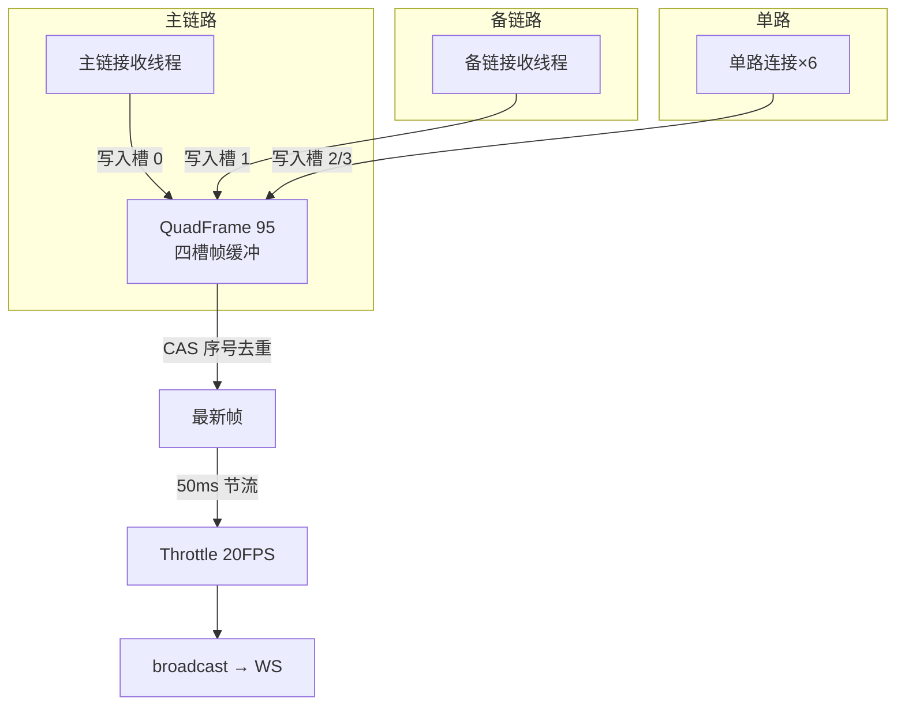

**主备切换逻辑**（quad_frame.rs）：主源写入时更新心跳；备源在主心跳超时 1000ms 后接管；主源恢复自动切回。前端卡片上"主/备"标签随切换变化——模拟模式下 IP11（主链）每 5~10 秒故意暂停一次，专门用来验证切换。

### 3.10.3 模拟模式的设计（process.rs 顶部注释就是说明书）

```rust
//! `config-ftj1c.ini` 的 `[Udp] Mock = true`（默认）时使用进程内数据源，无需硬件：
//! 按 200ms 周期向各链路生成 `EB 90 5B` 帧；IP11（主链）在 5~10 秒窗口暂停，
//! 可验证主备切换。`Mock = false` 时使用真实 UDP 套接字（组播收发）。
```

- **Mock = true**：进程内生成帧，200ms 周期，主链 5~10 秒窗口暂停（模拟断流）。
- **Mock = false**：`UdpControl::Real` 模式——组播 socket + SO_REUSEADDR + 1MB 缓冲。

### 3.10.4 事件节流器 Throttle（50ms = 20 FPS）

```rust
struct Throttle { last_emit: Instant }
impl Throttle {
    fn ready(&mut self) -> bool {
        let now = Instant::now();
        if now >= self.last_emit + EMIT_INTERVAL {   // 50ms 间隔
            self.last_emit = now;
            true
        } else { false }
    }
}
```

与 fj200c_information 的"last_table_emit 变量"异曲同工——**高频采集 + 节流推送**是全项目统一的 WS 性能策略。UDP 数据可能 1kHz，推给前端 20FPS 足够人眼。

### 3.10.5 坐标转换（com.rs）

```rust
// 经纬高 → 地心坐标（WGS84 ECEF）
pub fn ulh2ecef(lon: f64, lat: f64, h: f64) -> (f64, f64, f64) { ... }
// ECEF → CGCS2000 投影（航天测控数据可视化用）
pub fn to_cgcs2000(...) -> ... { ... }
```

轨迹数据在地球坐标与显示坐标间转换——city3d 之外另一个"空间数据"模块，新手了解即可。

---

## 3.11 fw100 / fw150 精读（最简模块）

### 3.11.1 四个文件全部内容量级

这两个模块各约 100 行，**15 分钟读完一个**，是新手建立"模块感"的最佳起点：

```rust
// fw100/routes.rs —— 单路由 + 双层中间件
pub fn fw100_router(db: DatabaseConnection) -> Router {
    Router::new()
        .route("/items", get(list_items)
            .route_layer(permission_layer(Permission::Fw100Monitor)))
        .with_state(db)
}

// fw100/handlers.rs —— 单 handler
#[utoipa::path(get, tag = "fw100", path = "/api/fw100/items", operation_id = "fw100ListItems",
    responses((status = 200, description = "设备台账列表", body = ApiResponse<Vec<LedgerItem>>)))]
pub async fn list_items(
    State(db): State<DatabaseConnection>,
) -> Result<Json<ApiResponse<Vec<LedgerItem>>>, AppError> {
    let items = Fw100Service::list_items(&db).await?;
    Ok(Json(ApiResponse::success(items)))
}

// fw100/services.rs —— 演示数据（无数据库表）
pub struct Fw100Service;
impl Fw100Service {
    pub async fn list_items(_db: &DatabaseConnection) -> Result<Vec<LedgerItem>, AppError> {
        Ok(demo_ledger_items("fw100"))    // 纯函数演示数据
    }
}
```

### 3.11.2 fw100 与 fw150 的差异

| 差异点 | fw100 | fw150 |
|---|---|---|
| 路由前缀 | /api/fw100 | /api/fw150 |
| 权限 | Fw100Monitor | Fw150Monitor |
| 返回类型 | `LedgerItem`（共用） | `Fw150LedgerItem`（独立 schema） |
| 演示数据 | `demo_ledger_items("fw100")` | 独立生成 |
| 前端端口 | 5175 | 5178 |

**为什么 fw150 有独立类型**：进化历史——最初只有一个台账模块，后来拆分出 fw150 并给了独立类型，方便各自扩展字段。

---

## 3.12 city3d 精读（数据库 CRUD 范本）

### 3.12.1 模块结构

```
src/city3d/
├── models.rs     # Building/District/CityEvent/Overview + 分页 DTO
├── routes.rs     # 三组 CRUD + /overview
├── handlers.rs   # 12 个 handler（分页参数钳制）
└── services.rs   # 分页查询 + LEFT JOIN 聚合（避免 N+1）
```

### 3.12.2 接口一览（14 个）

| 接口 | 方法 | 说明 |
|---|---|---|
| `/buildings` | GET/POST | 建筑分页列表/新建 |
| `/buildings/{id}` | PUT/DELETE | 建筑改/删 |
| `/districts` | GET/POST | 区域列表/新建 |
| `/districts/{id}` | PUT/DELETE | 区域改/删 |
| `/events` | GET/POST | 事件分页/新建 |
| `/events/{id}` | DELETE | 事件删除 |
| `/overview` | GET | 聚合统计（HUD 数据源） |

### 3.12.3 分页与钳制（handlers.rs）

```rust
#[derive(Debug, Deserialize, Default, ToSchema)]
pub struct PaginationParams {
    #[serde(default)]
    pub page: Option<i64>,
    #[serde(default)]
    pub page_size: Option<i64>,
}

// 分页参数钳制：防大分页拖垮数据库
let page = params.page.unwrap_or(1).max(1);               // 最小 1
let page_size = params.page_size.unwrap_or(20).clamp(1, 100);  // 1~100
let offset = (page - 1) * page_size;
```

### 3.12.4 LEFT JOIN 聚合（services.rs 的 N+1 优化）

```rust
// 区域列表需要"每个区域的建筑数"——
// 错误做法：查 5 个区域再查 5 次建筑数（N+1 查询）
// 正确做法：一条 SQL 搞定
pub async fn list_districts(db: &DatabaseConnection) -> Result<Vec<District>, AppError> {
    sqlx::query_as::<_, District>(
        "SELECT d.*, COUNT(b.id) AS building_count
         FROM city3d_districts d
         LEFT JOIN city3d_buildings b ON b.district_id = d.id
         GROUP BY d.id
         ORDER BY d.name",
    )
    .fetch_all(db)
    .await?;
}
```

**这是全项目 SQL 质量最高的文件**——学习 SQL 聚合/分页看这里。

### 3.12.5 overview 聚合统计

```rust
// HUD 顶部统计卡的数据源：区域数/建筑数/事件数/最近事件
pub async fn overview(db: &DatabaseConnection) -> Result<Overview, AppError> {
    let districts = query_scalar("SELECT COUNT(*) FROM city3d_districts").fetch_one().await?;
    let buildings = query_scalar("SELECT COUNT(*) FROM city3d_buildings").fetch_one().await?;
    let events    = query_scalar("SELECT COUNT(*) FROM city3d_events").fetch_one().await?;
    let recent    = query_as::<_, RecentEvent>("SELECT ... ORDER BY created_at DESC LIMIT 5")...;
    Ok(Overview { districts, buildings, events, recent })
}
```

---

## 3.13 role_template 精读（新角色启动包）

`src/role_template/` 是给"新角色开发"准备的参考模板，`mod.rs` 顶部自带启用说明：

```rust
//! # 角色模块模板
//!
//! ## 如何启用新角色模块
//!
//! 1. 复制本目录为 `src/xxx/`
//! 2. 在 `src/main.rs` 添加 `mod xxx;`
//! 3. 在 `src/xxx/routes.rs` 修改路径与权限
//! 4. 在 `src/routes.rs` 挂载 `nest("/api/xxx", xxx_router)`
//! 5. 在 `src/roles.rs` 注册角色
//! 6. 在 `src/api_docs.rs` 添加 paths/schemas/tags
//! 7. 执行 `npm run gen:api` 生成前端类型
#![allow(dead_code)]   // 模板允许未使用代码

// routes.rs —— 模板展示"nest + protected + permission 包装"
pub fn template_router(db: DatabaseConnection) -> Router {
    Router::new()
        .route("/items", get(list_items)
            .route_layer(permission_layer(Permission::TemplateMonitor)))  // 改权限
        .with_state(db)
}
```

第 08 章会基于它演示完整的新增角色流程。**记住：模板里的权限名是占位符，复制后必须改**。

---

## 3.14 api_docs.rs 精读（OpenAPI 聚合 + 防漂移测试）

### 3.14.1 文件结构（247 行）

```rust
// ① OpenAPI 结构体：聚合所有 paths / schemas / tags
#[derive(OpenApi)]
#[openapi(
    paths(
        crate::common::auth::handlers::login,
        crate::common::auth::handlers::get_profile,
        // ... 全部 40 个 handler 逐个列出
    ),
    components(schemas(
        ApiResponse::<LoginResponse>, User, LoginRequest, ...
        // ... 全部 72 个 schema
    )),
    tags(
        (name = "auth", description = "认证"),
        // ... 9 个 tag
    )
)]
pub struct ApiDoc;

// ② 运行时提供实时 spec：GET /api-docs/openapi.json
pub async fn openapi_json() -> Json<serde_json::Value> {
    Json(serde_json::to_value(ApiDoc::openapi()).unwrap())
}

// ③ 导出测试（防漂移关卡）
#[cfg(test)]
mod tests {
    #[test]
    fn export_openapi() {
        let spec = ApiDoc::openapi();
        let json = serde_json::to_string_pretty(&spec).unwrap();
        std::fs::write("openapi/openapi.json", json).unwrap();

        // 断言 1：40 个预期路径全部存在（少了会失败）
        for path in EXPECTED_PATHS {
            assert!(spec.paths.contains_key(*path), "缺少路径: {path}");
        }
        // 断言 2：50 个 operation 全部有 operationId（orval 依赖）
        // ...
    }
}
```

### 3.14.2 新增 handler 时必须同步的三处

1. `#[utoipa::path(...)]` 注解（handler 上）。
2. `api_docs.rs` 的 `paths(...)` 列表加函数名。
3. 新 DTO 在 `components(schemas(...))` 加类型。

漏了任何一处：`cargo test export_openapi` 报错（路径缺失）或 orval 生成缺类型（前端报错）。**这个测试是"契约一致性"的守门员**。

---

## 3.15 embedded_assets.rs 精读（单 exe 前端内嵌）

### 3.15.1 结构体定义（7 个应用各一个）

```rust
#[derive(RustEmbed)]
#[folder = "frontend/admin/dist/"]
pub struct AdminAssets;

#[derive(RustEmbed)]
#[folder = "frontend/fj200c_information/dist/"]
pub struct Fj200cInformationAssets;
// ... Fj200cMainAssets / Fw100Assets / Fw150Assets / Ftj1cAssets / City3dAssets
```

`#[folder]` 路径相对 crate 根（项目根目录）。**编译时**把整个 dist 目录读进二进制。

### 3.15.2 泛型处理器

```rust
/// 泛型：A 是任意一个内嵌资源结构体
pub async fn serve_embedded<A: RustEmbed>(path: &str) -> Response {
    if path.is_empty() {
        return serve_index::<A>();          // 根路径 → index.html
    }
    match A::get(path) {                    // 命中资源
        Some(file) => {
            let mime = mime_guess::from_path(path).first_or_octet_stream();
            ([(header::CONTENT_TYPE, mime.as_ref())], file.data.as_ref()).into_response()
        }
        None => serve_index::<A>(),         // SPA 深链接回退
    }
}
```

### 3.15.3 路由注册（21 条）

```rust
pub fn embedded_router() -> Router {
    Router::new()
        .route("/admin", get(|| async { Redirect::permanent("/admin/") }))
        .route("/admin/", get(|| async { serve_embedded::<AdminAssets>("/").await }))
        .route("/admin/*path", get(|Path(path): Path<String>| async move {
            serve_embedded::<AdminAssets>(&path).await
        }))
        // ... 其余 6 个应用 × 3 条 = 21 条
}
```

**为什么要 3 条路由**：`/admin`（重定向补斜杠）→ `/admin/`（根）→ `/admin/*path`（任意子路径）。这是实测踩坑后的修复——matchit 对 `/admin/` 触发 ExtraTrailingSlash 检查会 404，必须显式注册。

### 3.15.4 dev 模式对照（main.rs 的 ServeDir）

```rust
.nest_service("/admin", ServeDir::new("dist-admin")
    .fallback(ServeFile::new("dist-admin/index.html")))
```

- 需要根目录有 `dist-admin/` 等目录（`npm run build` 后手动复制或用 build script）。
- 这就是"开发时先 build 前端才能让后端托管"的原因；日常开发一般用 Vite dev server，不用这模式。

---

## 3.16 后端精读收官：模块知识地图

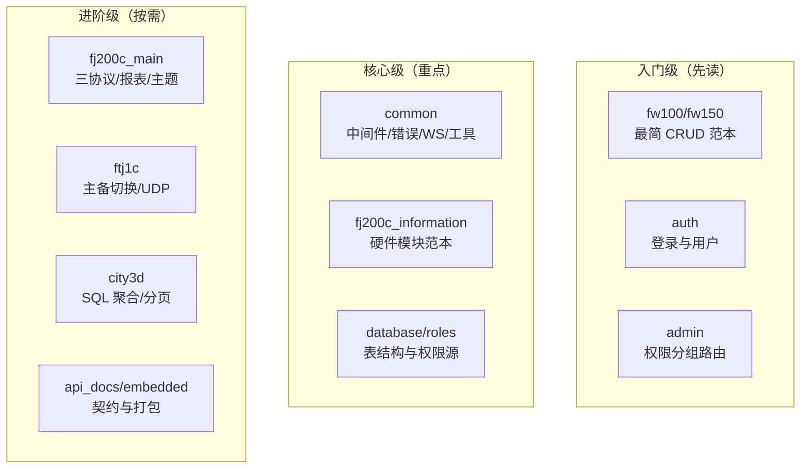

**阅读建议**：先读入门级建立模式 → 核心级理解骨架 → 进阶级按业务需求深入。本套文档的 06 章（类型同步）和 08 章（二次开发）会依赖本章的基础。

## 3.17 补充：后端代码阅读方法论（怎么读一个陌生模块）

### 3.17.1 五步阅读法

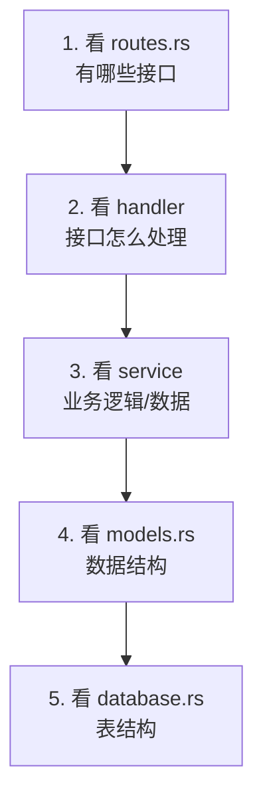

**自上而下**：路由 → 处理 → 业务 → 数据。任何一个模块都能用这五步读完。

### 3.17.2 快速定位技巧

| 想找什么 | 搜索什么 |
|---|---|
| 某接口的实现 | `src/*/handlers.rs` 里函数名（对照路由） |
| 某字段来自哪 | 该模块 models.rs → database.rs 建表 |
| 某数据的产生 | 对应模块 session/process（采集线程） |
| 权限控制点 | `permission_middleware::<Permission::Xxx>` |
| 事件流向 | 模块 mod.rs 的 `TX` → ws_bridge |

## 3.18 补充：三大监控模块对照（一次读懂三个）

| 维度 | fj200c_information | fj200c_main | ftj1c |
|---|---|---|---|
| 数据源 | 串口/模拟（8 路连接） | 串口三路（ECU/ADAM/DYNO） | UDP 组播（16 路 IP） |
| 帧大小 | 100 字节 | 按协议不同 | 95 字节 |
| 会话线程 | 每路一个 session | 每路一个会话 | 主备切换 + 6 路单连 |
| 节流 | 20Hz | 按需 | 50ms（20FPS） |
| 配置生效 | 热加载 | 需重启 | 需重启 |
| CSV | 状态机三帧 | 64 列 | 按需 |
| 特殊 | 快照+增量 | 主题持久化/报表 | 坐标转换 CGCS2000 |

**三个模块的骨架完全一致**（routes→handlers→session→decode→broadcast），差异只在数据源与解码。

## 3.19 补充：后端错误处理的完整链路

### 3.19.1 AppError 的传播

```rust
// service 返回 Err(AppError::Xxx) → handler 用 ? 传播
// → axum 自动将 AppError 转换为 Json(ApiResponse{success:false,...})
```

| 错误 | HTTP 状态 | 前端看到 |
|---|---|---|
| AppError::BadRequest | 400 | message（参数问题） |
| AppError::Unauthorized | 401 | 拦截器跳登录 |
| AppError::Forbidden | 403 | 权限不足 |
| AppError::NotFound | 404 | 资源不存在 |
| AppError::Internal | 500 | 内部错误 |

### 3.19.2 自定义错误信息

```rust
Err(AppError::BadRequest("密码错误".into()))
Err(AppError::NotFound(format!("用户 {} 不存在", id)))
Err(AppError::Internal(format!("数据库错误: {e}")))
```

### 3.19.3 前端如何感知

```
HTTP 状态码 → axios 拦截器（401 特殊处理）
message → 响应体里（res.message 展示）
success=false → 前端判断逻辑
```

## 3.20 补充：后端单元测试现状与写法

### 3.20.1 现有测试

```
1. export_openapi 防漂移测试（api_docs.rs）
2. 各模块工具函数的单元测试（#[cfg(test)] mod tests）
3. 种子数据相关验证
```

### 3.20.2 怎么写新测试（以工具函数为例）

```rust
#[cfg(test)]
mod tests {
    use super::*;

    #[test]
    fn test_frame_extractor() {
        let mut fe = FrameExtractor::new(100);
        let bytes = vec![0xEB; 100];
        let frame = fe.process(&bytes);
        assert!(frame.is_some());
    }
}
```

```powershell
cargo test          # 跑全部
cargo test xxx      # 只跑匹配的测试
```

**建议**：核心工具函数（解码/提取/校验）补测试收益最大——它们纯逻辑、无 IO。

## 3.21 补充：后端性能与并发注意点

| 关注点 | 现状 | 建议 |
|---|---|---|
| 会话线程数 | 每路连接一个线程 | 正常（8 路内） |
| 广播负载 | 每帧全量广播 | 大客户端数时考虑节流（已有） |
| SQLite 写 | 串行写 | 数据量大时批量写 |
| 内存 | 帧缓冲有限长 | 注意环形缓冲边界 |
| 日志 | debug 级别 IO 大 | 生产用 info/warn |

## 3.22 补充：后端精读自测（30 题精华 10 问）

1. main.rs 启动七步是哪些？
2. 三个中间件的顺序与职责？
3. JWT 从签发到校验的完整路径？
4. 角色注册表为什么放后端？（唯一源）
5. 建表为什么没有迁移文件？（database.rs 直接建）
6. 会话线程的循环结构？
7. 热加载如何实现？（ArcSwap + 保存时重载）
8. 三种 IoControl 实现是什么？
9. WS 广播的通道类型？（broadcast）
10. AppError 如何转成 HTTP 响应？

**答对 8+ → 03 章通过**，可以进入前端语法章节。

## 3.23 补充：auth 模块完整走读（登录服务细节）

### 3.23.1 登录的四步校验

```rust
// src/common/auth/services.rs（结构示意）
pub async fn login(db: &SqlitePool, login_data: &LoginRequest) -> Result<LoginResult, AppError> {
    // 1. 查用户（按邮箱）
    let user = query_user_by_email(db, &login_data.email).await?;
    // 2. 校验密码（bcrypt verify）
    if !verify_password(&login_data.password, &user.password_hash)? {
        return Err(AppError::BadRequest("密码错误".into()));
    }
    // 3. 检查禁用
    if !user.is_active {
        return Err(AppError::Forbidden("账号已禁用".into()));
    }
    // 4. 生成 token
    let token = sign_jwt(user.id, &user.email)?;
    Ok(LoginResult { token, user: ... })
}
```

**顺序的讲究**：先查存在（未找到与密码错误都报"密码错误"防探测），再验密码，再查禁用，最后发 token。

### 3.23.2 auth_me 的动态权限

```rust
// GET /api/auth/me：每次实时查权限（不用 token 里的旧数据）
let permissions = query_user_permissions(db, user_id).await?;
```

**意义**：管理员改了角色 → 用户下次请求立刻生效（无需等 token 过期）。

## 3.24 补充：admin 模块权限分组路由细节

### 3.24.1 三组路由的中间件组合

```rust
// 只读组（List/Get/Info）：auth + role(admin)
// 写组（Create/Update）：auth + role + permission(UsersWrite)
// 删除组（Delete）：auth + role + permission(UsersDelete)
```

### 3.24.2 防自锁的实现

```rust
// 不能删除自己 / 不能降级自己为普通角色
if user.id == current_user.id { return Err(...) }
```

**前端同步**：按钮 disabled 依据当前登录用户 id 判断。

## 3.25 补充：common 工具层逐个说明

| 文件 | 核心函数 | 用途 |
|---|---|---|
| frame_extractor.rs | process(&bytes) | 攒字节切完整帧 |
| csv_writer.rs | write_row / flush | 追加写 CSV |
| global_var.rs | get/set | 键值存储（主题等） |
| utils.rs | parse_hex / bytes_to_hex | 十六进制转换 |
| ledger.rs | 台账演示数据 | 种子 |
| least_squares.rs | fit | 最小二乘拟合 |
| dto.rs | 通用 DTO | 分页等 |

**这些工具是"积木"**——新模块可以直接 import 复用。

## 3.26 补充：fj200c_main 的 ECU 解码与指令细节

### 3.26.1 EcuFields 结构（29 字段）

```rust
// src/fj200c_main/types.rs（EcuFields 字段预览）
pub struct EcuFields {
    pub ng_speed: f64,        // 转速
    pub coolant_temp: f64,    // 水温
    pub oil_pressure: f64,    // 油压
    pub fuel_consumption: f64,// 油耗
    // ... 29 个字段
}
// serde camelCase：前端 JSON 字段为 ngSpeed/coolantTemp
```

### 3.26.2 三路协议的差异

| 路 | 协议特征 | 帧头 |
|---|---|---|
| ECU | 自定义二进制 | 0xEB 0x90 0x2A |
| ADAM | ASCII（'>' 起始） | '>' |
| DYNO | 自定义二进制 | 0xFF 0xFF |

**前端感知差异**：三块面板数据字段不同、命令不同，但连接管理统一（AbstractCom）。

## 3.27 补充：ftj1c 的主备切换细节

### 3.27.1 为什么需要主备

```
UDP 组播多源：主源 + 备源
主源心跳超时（1000ms）→ 备源接管
恢复后自动切回
```

### 3.27.2 QuadFrame<95> 的作用

```rust
// 95 字节帧，四路源管理（主备 × 通道）
QuadFrame<95> 持有各源最近帧 + 心跳时间
```

### 3.27.3 节流 50ms 的意义

```
UDP 帧率高（可能每毫秒多帧）→ 50ms 节流 → 20 FPS 推送前端
→ 前端流畅 + 后端省 IO
```

## 3.28 补充：city3d 的 SQL 聚合细节

### 3.28.1 overview 的聚合

```sql
-- 建筑数/区域数/事件数 一次查齐
SELECT
  (SELECT COUNT(*) FROM city3d_buildings) AS building_count,
  (SELECT COUNT(*) FROM city3d_regions) AS region_count,
  (SELECT COUNT(*) FROM city3d_events) AS event_count;
```

### 3.28.2 LEFT JOIN 的用法

```sql
-- 事件关联区域（无区域的事件也显示）
SELECT e.*, r.name AS region_name
FROM city3d_events e
LEFT JOIN city3d_regions r ON e.region_id = r.id;
```

### 3.28.3 分页 clamp

```rust
// page 最小 1，page_size 夹在 1..=100
let page = params.page.unwrap_or(1).max(1);
let page_size = params.page_size.unwrap_or(20).clamp(1, 100);
let offset = (page - 1) * page_size;
```

**这是全项目分页的统一写法**——抄它即可。

## 3.29 补充：03 章补充自测（追加 10 题）

1. 登录四步校验的顺序与原因？
2. auth_me 为什么实时查权限？
3. admin 三组路由的中间件组合？
4. frame_extractor 的作用？
5. EcuFields 字段序列化命名规则？
6. 三路协议的帧头？
7. 主备切换的触发条件？
8. 50ms 节流的意义？
9. overview 的聚合 SQL 模式？
10. 分页 clamp 的写法？

**答对 8+ → 03 章彻底掌握。**

## 3.30 深入：Config 读取的完整链路（以 fj200c_information 为例）

### 3.30.1 配置在内存中的形态

```rust
// config.rs 的 Config 结构（示意）
pub struct Config {
    pub mock: MockConfig,          // [Mock] InProcess
    pub connections: Vec<ConnConfig>, // [Connection1]~[Connection4]
    pub csv: CsvConfig,            // [CSV]
}
```

**读取流程**：

```
进程启动 → 读取 config-fj200c_information.ini
→ 解析成 Config 结构（解析器：连字符节名、KV 对）
→ 存入 ArcSwap<Config>（可热替换）
→ 各 service 通过 config() 快照函数读取
```

### 3.30.2 热更新的实现

```
文件监听（notify crate）→ 文件变更 → 重新解析
→ 校验合法 → arc_swap.swap(新 Config)
→ 服务下一次读取即用新值
```

**关键设计**：解析失败不覆盖旧配置（保持上次可用状态）。

### 3.30.3 配置校验的重要性

```
串口号非法（COM999）→ 校验拦截，保留旧值
CSV 目录不存在 → 自动创建或报错
端口号越界 → 拒绝
```

## 3.31 深入：CSV 写入的细节（数据如何落盘）

### 3.31.1 写入时机

```
每解析一帧 → 检查是否开启记录 → 写一行
（受 [CSV] Record 开关控制）
```

### 3.31.2 写入格式

```
时间戳,字段1,字段2,...,字段N（CSV 首行是表头）
→ Excel 可直接打开分析
```

### 3.31.3 为什么不用 SQLite 存帧数据

| 对比 | CSV | SQLite |
|---|---|---|
| 写入速度 | 追加写极快 | 事务开销 |
| 文件体积 | 可控 | 需索引膨胀 |
| 分析工具 | Excel 直接开 | 需查询 |
| 数据量 | 高帧率撑得住 | 高帧率有压力 |

**结论**：监控数据走 CSV（吞吐优先），业务数据走 SQLite（结构优先）。

## 3.32 深入：WebSocket 消息的结构设计

### 3.32.1 消息信封

```json
{
  "type": "frame",          // 消息类型
  "data": { ... },          // 载荷
  "timestamp": 1700000000   // 服务端时间
}
```

**好处**：前端按 type 分发，新增类型不破坏旧逻辑。

### 3.32.2 三种核心消息

| type | 触发时机 | 前端处理 |
|---|---|---|
| frame | 每帧数据 | 更新表格/图表 |
| status | 服务状态变化 | 更新状态栏 |
| snapshot | 连接建立时 | 初始化数据 |

### 3.32.3 心跳与重连

```
后端 30s 发 ping → 前端收 pong
断线 → 前端 2s 自动重连（token 重传）
重连成功 → 服务端重发 snapshot
```

## 3.33 深入：路由注册与中间件顺序

### 3.33.1 中间件顺序的影响

```
Route 层级：先全局中间件，后路径中间件
请求 → CORS → 认证中间件 → 权限中间件 → handler
```

**注意**：`/api/auth/login` 不需要认证 → 挂在 auth 路由组外层。

### 3.33.2 资源路由 vs 手动路由

```rust
// 资源风格（nest + 方法链）
router.nest("/api/fw100", fw100_router)
// 手动风格
router.route("/api/fj200c_information/start", post(start_service))
```

**项目两种混用**：简单 CRUD 用资源风格，特殊接口手动。

## 3.34 深入：错误处理中间件与全局异常

### 3.34.1 AppError 的序列化

```rust
// 统一错误响应 JSON
{
  "success": false,
  "code": "bad_request",
  "message": "密码错误"
}
```

### 3.34.2 handler 返回的错误如何统一

```
handler 里 Result<_, AppError>
→ 框架自动转成 JSON 响应（From<AppError> for Response 已实现）
→ 前端 axios 拦截器统一弹错
```

**要点**：错误处理只写一次（From 实现），所有 handler 复用。

## 3.35 深入：单元测试的写法与执行

### 3.35.1 测试什么

```
1. 帧提取器（喂字节流 → 断帧/粘帧）
2. 解码器（已知帧 → 字段值）
3. 校验逻辑（非法输入）
```

### 3.35.2 测试写法示例

```rust
#[cfg(test)]
mod tests {
    #[test]
    fn test_frame_extract() {
        let mut buffer = vec![];
        let bytes = [0xEB, 0x90, 0x2A, ...];  // 一帧数据
        buffer.extend_from_slice(&bytes);
        let frames = process(&mut buffer);
        assert_eq!(frames.len(), 1);
    }
}
```

### 3.35.3 执行

```powershell
cargo test        # 全部
cargo test frame  # 按名字过滤
```

## 3.36 深入：03 章最终综合自测（追加 10 题）

1. 配置热更新的双保险是什么？
2. 解析失败时旧配置为什么保留？
3. CSV 与 SQLite 的选型依据？
4. WS 消息信封的三个字段？
5. 断线重连后前端如何拿到最新数据？
6. 中间件顺序错误会导致什么？
7. AppError 的 From 实现解决什么问题？
8. 帧提取器测试喂什么数据？
9. 资源路由与手动路由的区别？
10. 日志中 ERROR 的含义与排查第一步？

**答对 8+ → 03 章最终通过。**

## 3.37 深入：项目实战——完整读一个 handler（fw100 列表）

### 3.37.1 代码定位

```rust
// src/fw100/handlers.rs（结构示意）
#[utoipa::path(
    get,
    path = "/api/fw100/items",
    tag = "fw100",
    operation_id = "fw100ListItems",
    responses((status = 200, description = "设备列表", body = ApiResponse<Vec<Item>>))
)]
pub async fn list_items(
    State(state): State<AppState>,       // 1. 拿全局状态（数据库池）
    Query(params): Query<PageParams>,    // 2. 拿查询参数（分页）
    user: AuthUser,                      // 3. 拿登录用户（中间件注入）
) -> Result<Json<ApiResponse<Vec<Item>>>, AppError> {  // 4. 返回 JSON
    let items = fw100_service::list_items(&state.db, &params).await?;  // 5. 调 service
    Ok(Json(ApiResponse::success(items)))  // 6. 包统一响应
}
```

### 3.37.2 逐行翻译

```
1. State<AppState>：Axum 提取器，从请求中拿出全局状态
2. Query<PageParams>：把 URL 查询串解析成结构体
3. AuthUser：中间件验完 token 后注入的用户信息
4. 返回类型：统一 ApiResponse 包装
5. service 层处理业务（真正干活）
6. 成功包 success
```

### 3.37.3 从 handler 到数据库的完整链

```
handler → service::list_items → sqlx::query_as
→ SELECT * FROM fw100_items LIMIT ? OFFSET ?
→ Result<Vec<Item>> → ApiResponse
```

**新手任务**：照着这个模板，读 fw150 的 handler，写出一张同样结构的流程图。

## 3.38 深入：sqlx 查询的三个核心 API

| API | 用途 | 特点 |
|---|---|---|
| query_as | 映射到结构体 | 列名需与字段匹配 |
| query | 不映射 | 手动取行 |
| fetch_one / fetch_all | 取一行 / 多行 | 配 query_as 常用 |

```rust
// 单行
let user = sqlx::query_as::<_, User>("SELECT * FROM users WHERE id = ?")
    .bind(id).fetch_one(db).await?;

// 多行
let items = sqlx::query_as::<_, Item>("SELECT * FROM items LIMIT 20")
    .fetch_all(db).await?;

// 影响行数（增删改）
let result = sqlx::query("INSERT INTO items (name) VALUES (?)")
    .bind(name).execute(db).await?;
result.rows_affected()
```

### 3.38.1 列名映射的约定

```
Rust 字段: user_name
SQL 列: user_name（直接匹配）
或 SQL 用别名: SELECT user_name AS username ...
```

**项目惯例**：数据库列与结构体字段同名，减少映射坑。

## 3.39 深入：事务的用法（什么时候需要）

```rust
// 多表操作必须用事务（要么全成功要么全失败）
let mut tx = db.begin().await?;
sqlx::query("INSERT INTO a ...").execute(&mut *tx).await?;
sqlx::query("INSERT INTO b ...").execute(&mut *tx).await?;
tx.commit().await?;
```

```
需要事务的场景：
1. 两个表同时写（如订单 + 明细）
2. 先删后建（重建类操作）
3. 库存类增减（防超卖）
```

**项目位置**：报表生成、试验信息保存等多表操作处。

## 3.40 深入：索引与查询性能（SQLite 实践）

### 3.40.1 什么时候加索引

```
WHERE / ORDER BY 常用的列 → 加索引
频繁查询但表很小（<1000 行）→ 无需索引
```

```sql
CREATE INDEX idx_items_created_at ON fw100_items(created_at);
```

### 3.40.2 验证索引是否生效

```sql
EXPLAIN QUERY PLAN SELECT * FROM items WHERE created_at > ?;
-- 输出含 "SEARCH ... USING INDEX" 即生效
```

### 3.40.3 反模式

```
1. 给所有列加索引（写放大）
2. 索引列做函数运算（索引失效）：WHERE date(created_at) = ...
3. LIKE '%xx%'（无法用索引）
```

## 3.41 深入：03 章终极自测（5 题）

1. handler 的四个参数分别是什么？
2. 画一张 list_items 的完整调用链？
3. fetch_one 与 fetch_all 的区别？
4. 什么场景必须用事务？
5. 加索引的判断标准？

**答对 4+ → 03 章彻底通关。**

## 3.42 深入：Axum 路由与提取器的完整参考

### 3.42.1 常见提取器

| 提取器 | 用途 | 例子 |
|---|---|---|
| State<T> | 全局状态 | State(state): State<AppState> |
| Path<T> | 路径参数 | Path(id): Path<i64> |
| Query<T> | 查询参数 | Query(params): Query<PageParams> |
| Json<T> | JSON 请求体 | Json(req): Json<CreateRequest> |
| HeaderMap | 请求头 | headers: HeaderMap |
| AuthUser（自定义） | 登录用户 | user: AuthUser |

### 3.42.2 提取器顺序注意

```
提取器按顺序消费请求体
→ 一个 handler 只能有一个"身体"提取器（Json/Form/bytes）
→ 其他提取器（State/Path/Query/Header）顺序随意
```

### 3.42.3 返回类型的写法

```rust
Result<Json<ApiResponse<T>>, AppError>          // 成功 JSON
Result<Response, AppError>                       // 自定义响应（CSV 下载）
Result<impl IntoResponse, AppError>              // 泛化写法
```

## 3.43 深入：全局状态 AppState 的完整设计

```rust
#[derive(Clone)]
pub struct AppState {
    pub db: SqlitePool,          // 数据库连接池
    // 其他模块级状态按需加入
}

// 创建：main.rs 初始化
let state = AppState { db };
let app = Router::new()
    .with_state(state);   // 全局注入
```

### 3.43.1 为什么用 Clone

```
Axum 每个请求需要自己的 state 副本
→ SqlitePool 内部是 Arc（克隆只是引用计数）
→ 成本极低，放心 Clone
```

### 3.43.2 模块级状态 vs AppState

```
模块级（OnceLock）：进程级共享（WS 广播、串口）
AppState：请求级注入（数据库池）
规则：所有请求都要用的 → AppState；单实例资源的 → OnceLock
```

## 3.44 深入：中间件链的完整自定义

```rust
// 认证中间件（项目简化示意）
pub async fn auth_middleware(
    State(state): State<AppState>,
    mut req: Request,
    next: Next,
) -> Result<Response, AppError> {
    // 1. 取 token
    let token = req.headers()
        .get(AUTHORIZATION)
        .and_then(|v| v.to_str().ok())
        .and_then(|s| s.strip_prefix("Bearer "));

    // 2. 校验
    let Some(claims) = token.and_then(|t| verify_jwt(t)) else {
        return Err(AppError::Unauthorized("未登录".into()));
    };

    // 3. 注入扩展（后续提取器可读）
    req.extensions_mut().insert(AuthUser::from(claims));

    // 4. 放行
    Ok(next.run(req).await)
}
```

### 3.44.1 中间件的三层结构

```
全局（CORS/日志）→ 路由组（认证）→ 单路由（权限）
```

### 3.44.2 extensions 的用途

```
中间件把用户信息塞进 extensions
handler 的 AuthUser 提取器从 extensions 取
→ 中间件与 handler 通过 extensions 通信
```

## 3.45 深入：03 章实战自测（8 题）

1. 五种提取器的写法？
2. 为什么只能有一个身体提取器？
3. AppState 为什么 Clone？
4. 模块级与 AppState 的分工？
5. 中间件四步结构？
6. extensions 的作用？
7. 权限中间件的顺序？
8. 自定义响应（CSV）返回什么？

**答对 7+ → 03 章实战通过。**

## 3.46 深入：WebSocket 后端的完整实现参考

### 3.46.1 建立连接

```rust
// ws_handler（各监控模块通用模式）
pub async fn ws_handler(
    ws: WebSocketUpgrade,
    Query(params): Query<WsQuery>,
) -> Result<impl IntoResponse, AppError> {
    // 校验 token（?token=）
    verify_jwt(&params.token)?;
    // 升级协议
    Ok(ws.on_upgrade(handle_socket))
}
```

### 3.46.2 发送消息

```rust
async fn handle_socket(socket: WebSocket) {
    let (mut sender, mut receiver) = socket.split();
    // 订阅广播通道
    let mut rx = TX.subscribe();
    // 连上先发快照
    sender.send(Message::Text(snapshot_json)).await?;
    // 循环转发
    while let Ok(msg) = rx.recv().await {
        if sender.send(Message::Text(msg)).await.is_err() {
            break;  // 客户端断开
        }
    }
}
```

### 3.46.3 断开处理

```
send 失败 → break → socket 自动关闭
→ 广播通道自动退订（rx 丢弃）
→ 无泄漏（无需手动管理连接列表）
```

## 3.47 深入：串口通信后端的完整实现参考

### 3.47.1 打开与配置

```rust
// serialport 库
use serialport::prelude::*;

let mut com = serialport::new("COM3", 115200)
    .timeout(Duration::from_millis(100))
    .data_bits(DataBits::Eight)
    .stop_bits(StopBits::One)
    .parity(Parity::None)
    .open()?;
```

### 3.47.2 读线程

```rust
// 独立任务持续读
tokio::spawn(async move {
    loop {
        let n = com.read(&mut buf)?;   // 阻塞读
        if n > 0 {
            // 交给帧提取器
            tx.send(buf[..n].to_vec()).await?;
        }
    }
});
```

### 3.47.3 写指令

```rust
com.write(&cmd_bytes)?;
com.flush()?;   // 确保发出
```

### 3.47.4 波特率与协议

```
波特率在 ini 配置（ConnectionN 节）
不同设备协议 → 帧提取/解码不同实现
抽象层（AbstractCom）统一 open/read/write
```

## 3.48 深入：定时任务与周期操作

```rust
// tokio interval（心跳/轮询）
let mut interval = tokio::time::interval(Duration::from_secs(30));
loop {
    interval.tick().await;
    // 发送心跳/检查状态
}

// tokio::time::sleep（延迟）
tokio::time::sleep(Duration::from_millis(50)).await;
```

### 3.48.1 项目中的定时任务

```
1. 心跳超时检测（ftj1c 主备切换）
2. 状态广播节流（50ms）
3. 定时保存/清理
4. 报表定时生成（如需要）
```

## 3.49 深入：03 章高频自测（8 题）

1. WS 升级前校验什么？
2. 断开如何自动清理？
3. 串口打开的关键参数？
4. 读线程为什么用 spawn？
5. 帧提取在哪层完成？
6. interval 与 sleep 的区别？
7. 心跳超时的用途？
8. 广播退订机制？

**答对 7+ → 03 章高频通过。**

## 3.50 深入：CSV 记录的完整实现参考

### 3.50.1 开启与关闭

```rust
// 服务控制接口
start_service(config) → 若 [CSV].Record = true → 开始写
stop_service() → 关闭文件句柄
```

### 3.50.2 写入线程

```rust
// mpsc 队列：帧数据 → 写线程（避免阻塞主循环）
let (tx, mut rx) = mpsc::channel(1024);
tokio::spawn(async move {
    while let Some(row) = rx.recv().await {
        writer.write_row(&row)?;
        // 自动 flush 间隔（或积累后写）
    }
});
```

### 3.50.3 文件名规范

```text
csv/2026-08-08.csv       # 按天分文件
csv/2026-08-08_14-00.csv # 按小时（可选）
```

### 3.50.4 容量管理

```
1. 定期归档（脚本/计划任务）
2. 磁盘空间预警
3. 可选：自动删除 N 天前文件
```

## 3.51 深入：帧提取器的完整实现参考

### 3.51.1 问题背景

```
串口/UDP 是字节流，没有明确边界
→ 需要"攒字节 → 识别帧头帧尾 → 切出完整帧"
```

### 3.51.2 通用实现

```rust
pub fn process(buffer: &mut Vec<u8>) -> Vec<Vec<u8>> {
    let mut frames = Vec::new();
    // 1. 找帧头（0xEB 0x90）
    // 2. 校验长度字段 → 判断是否凑齐
    // 3. 凑齐 → 切帧（drain 掉）
    // 4. 没凑齐 → 等待下次数据
    frames
}
```

### 3.51.3 断帧/粘帧的处理

```
1. 断帧：只收到半帧 → 留在 buffer 等下次
2. 粘帧：一包多帧 → 循环切出全部
3. 脏数据：找不到帧头 → 丢弃到下一个帧头
```

### 3.51.4 测试要点

```rust
#[test]
fn test_sticky_frame() {  // 粘帧
    let mut buf = vec![];
    buf.extend_from_slice(&frame1);
    buf.extend_from_slice(&frame2);
    assert_eq!(process(&mut buf).len(), 2);
}

#[test]
fn test_split_frame() {   // 断帧
    let mut buf = frame[..10].to_vec();
    assert_eq!(process(&mut buf).len(), 0);
    buf.extend_from_slice(&frame[10..]);
    assert_eq!(process(&mut buf).len(), 1);
}
```

## 3.52 深入：解码器的完整实现参考

### 3.52.1 二进制解码

```rust
fn decode_frame(raw: &[u8]) -> Option<TableRow> {
    // 字节序：大端/小端按协议
    let ng_speed = i16::from_be_bytes([raw[5], raw[6]]) as f64;
    let coolant_temp = u16::from_le_bytes([raw[7], raw[8]]) as f64 / 10.0;
    // 校验和验证
    if checksum(raw) != raw.last()? { return None; }
    Some(TableRow { ... })
}
```

### 3.52.2 缩放系数

```
原始值 → 系数 → 物理量
转速：原始值 × 0.1（rpm）
温度：原始值 × 0.1 - 40（℃）
```

### 3.52.3 解码失败的日志

```
解码失败 → 记 debug/warn 日志 + 丢弃
→ 不 panic、不阻塞
→ 帧计数用于统计丢帧率
```

## 3.53 深入：03 章综合自测（8 题）

1. CSV 写入为什么用队列？
2. 文件名按天分的好处？
3. 断帧如何等待？
4. 粘帧如何切分？
5. 脏数据怎么处理？
6. 校验和的作用？
7. 缩放系数如何确定？
8. 解码失败的策略？

**答对 7+ → 03 章综合通过。**

## 3.54 深入：每路服务的启动/停止生命周期

### 3.54.1 状态机

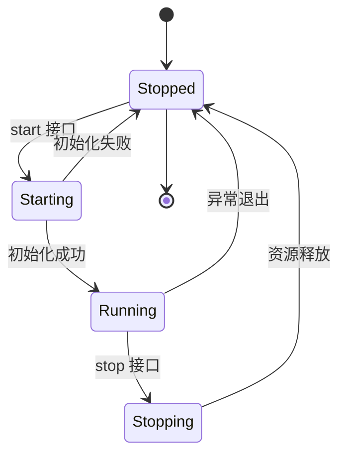

### 3.54.2 启动的完整动作

```
1. 读配置（ini 解析）
2. 打开资源（串口/UDP socket）
3. 启动后台任务（读线程/心跳）
4. 广播状态（WS status 事件）
5. 前端状态栏更新
```

### 3.54.3 停止的完整动作

```
1. 停止接收（关 socket/串口）
2. 停止任务（abort/信号）
3. 关闭 CSV 写入（flush）
4. 广播停止状态
5. 清理临时状态
```

### 3.54.4 幂等性设计

```
重复 start → 已在运行则忽略（返回当前状态）
重复 stop → 已停止则忽略
→ 前端按钮不会因重复点击出错
```

## 3.55 深入：状态管理（服务状态与配置状态）

### 3.55.1 状态存储位置

```
1. SERVICE_RUNNING（OnceLock<AtomicBool>）：服务运行标志
2. 模块内配置结构：当前生效配置
3. SHARED_DATA：最新数据帧
4. TX：广播通道
```

### 3.55.2 状态广播的时机

```
1. 服务状态变化（start/stop/异常）
2. 每帧数据（节流后）
3. 配置热更新
```

### 3.55.3 前端状态同步

```
WS status 事件 → 状态栏
WS frame 事件 → 数据表格
快照 → 页面初始化
```

## 3.56 深入：模拟模式（Mock）的设计

### 3.56.1 为什么需要 Mock

```
1. 开发环境没有硬件 → 无法联调
2. 演示需要数据 → 无硬件也能展示
3. 测试流程 → 可控数据源
```

### 3.56.2 模拟数据源的结构

```rust
// mock.rs：生成仿真数据
pub struct MockSource { seed: f64 }
impl MockSource {
    fn next_frame(&mut self) -> TableRow {
        // 基于时间/正弦波生成合理数值
        TableRow { ng_speed: 800.0 + 50.0 * (t * 0.1).sin(), ... }
    }
}
```

### 3.56.3 数据源切换

```
ini: [Mock] InProcess = true → 用 MockSource
false → 用真实串口
启动时读取 → 数据源固定
```

### 3.56.4 Mock 的注意点

```
1. 生成的数据要"像真的"（变化合理）
2. 提供随机性（不同启动不同数据）
3. 标记来源（前端可显示"模拟数据"）
```

## 3.57 深入：报表与试验信息（fj200c_main 特有）

### 3.57.1 试验信息是什么

```
一次试验：工况设置 + 持续时间 + 采样数据
→ 试验完成后可生成报告
```

### 3.57.2 报表生成流程

```
1. 试验中记录数据（CSV + 内存摘要）
2. 试验结束 → 汇总状态点数据
3. 生成报表（CSV/文本）
4. 前端可下载
```

### 3.57.3 状态点（StatePoints）

```
ini: [REPORT] StatePoints = 100, 200, 300...
→ 到达指定转速点记录该点数据
→ 报表包含各状态点采样
```

## 3.58 深入：03 章终局自测（8 题）

1. 服务状态机的五个状态？
2. 启动的四步动作？
3. 停止的流程？
4. 幂等性的意义？
5. Mock 的四个作用？
6. 数据源怎么切换？
7. 状态点的作用？
8. 报表数据的来源？

**答对 7+ → 03 章终局通过。**

## 3.59 深入：后端日志的完整规范

### 3.59.1 日志级别速查

| 级别 | 用法 | 例子 |
|---|---|---|
| error! | 不可恢复/严重 | 串口打开失败 |
| warn! | 可恢复异常 | 心跳超时 |
| info! | 关键状态 | 服务启动/停止 |
| debug! | 详细调试 | 每帧数据 |

### 3.59.2 日志内容规范

```
1. 带上下文：连接 COM3 失败（不只"失败"）
2. 带错误详情：{e}
3. 关键操作记 info：用户 xx 登录/删除设备 xx
4. 不记敏感信息：密码/token
```

### 3.59.3 日志排查示例

```
[ERROR] 连接 COM3 失败: 系统找不到指定的文件
→ 串口不存在（设备管理器核对 COM 号）

[WARN] 心跳超时, 切换备用源
→ 主源断流（检查上游设备）

[ERROR] 解析帧失败: checksum mismatch
→ 数据链路脏（检查波特率/接线）
```

## 3.60 深入：权限校验的完整实现

### 3.60.1 三层校验链路

```
1. 认证中间件：token 有效 → AuthUser
2. 角色中间件：用户角色在允许列表
3. 权限中间件：用户权限含所需 Permission
```

### 3.60.2 路由上的组合

```rust
router.route("/api/users",
    get(list_users)
        .route_layer(permission_middleware(Permission::SystemAdmin))
)
```

### 3.60.3 权限检查的返回

```
无权限 → 403 Forbidden + 错误消息
前端拦截器 → 提示"无权限" → 不跳转
```

## 3.61 深入：数据库连接的池化

### 3.61.1 连接池的意义

```
SQLite 单文件但连接开销仍存在
→ 池化复用连接（默认 5 个）
→ 并发请求不互相等待
```

### 3.61.2 配置连接池

```rust
let pool = SqlitePoolOptions::new()
    .max_connections(5)
    .connect(&database_url).await?;
```

### 3.61.3 使用注意

```
1. 借出连接用完即还（drop）
2. 长事务会占连接（注意超时）
3. WAL 模式支持读写并发
```

## 3.62 深入：03 章毕业自测（8 题）

1. 四级日志的选用？
2. 日志内容的规范？
3. 三个排查示例的含义？
4. 三层校验链路？
5. 权限中间件的挂法？
6. 无权限的返回？
7. 连接池的配置？
8. WAL 与连接池的关系？

**答对 7+ → 03 章毕业。**

## 3.63 深入：常见需求的标准实现模式库

### 3.63.1 分页查询模板

```rust
pub async fn list_items(
    db: &SqlitePool, page: i64, page_size: i64, keyword: Option<&str>,
) -> Result<(Vec<Item>, i64), AppError> {
    let offset = (page - 1) * page_size;
    let where_clause = keyword.map(|k| format!("%{k}%")).unwrap_or("%".into());

    let items = sqlx::query_as::<_, Item>(
        "SELECT * FROM items WHERE name LIKE ? ORDER BY id DESC LIMIT ? OFFSET ?")
        .bind(where_clause).bind(page_size).bind(offset)
        .fetch_all(db).await?;

    let total = sqlx::query_scalar::<_, i64>(
        "SELECT COUNT(*) FROM items WHERE name LIKE ?")
        .bind(where_clause)
        .fetch_one(db).await?;

    Ok((items, total))
}
```

### 3.63.2 增删改查模板

```rust
// 创建
pub async fn create(db, req) -> Result<Item, AppError> {
    let id = sqlx::query("INSERT INTO items (name, type) VALUES (?, ?)")
        .bind(&req.name).bind(&req.type_name)
        .execute(db).await?.last_insert_rowid();
    get_by_id(db, id).await
}

// 更新
pub async fn update(db, id, req) -> Result<Item, AppError> {
    let rows = sqlx::query("UPDATE items SET name=?, type=? WHERE id=?")
        .bind(...).execute(db).await?.rows_affected();
    if rows == 0 { return Err(AppError::NotFound("记录不存在".into())); }
    get_by_id(db, id).await
}

// 删除
pub async fn delete(db, id) -> Result<(), AppError> {
    sqlx::query("DELETE FROM items WHERE id=?").bind(id).execute(db).await?;
    Ok(())
}
```

### 3.63.3 唯一性校验模板

```rust
// 邮箱/名称重复检查
let exists = sqlx::query_scalar::<_, bool>(
    "SELECT EXISTS(SELECT 1 FROM users WHERE email = ?)")
    .bind(&email).fetch_one(db).await?;
if exists { return Err(AppError::BadRequest("邮箱已存在".into())); }
```

## 3.64 深入：多模块共享代码的组织

### 3.64.1 共享层的清单

```
src/common/
├── models.rs          # Permission 枚举 + 通用模型
├── dto.rs             # 通用 DTO（分页参数等）
├── auth/              # 登录/JWT/中间件
├── ws.rs              # WS 基础设施
├── errors.rs          # AppError
├── utils.rs           # 十六进制等工具
└── middleware.rs      # 认证/权限中间件
```

### 3.64.2 使用方式

```rust
// 模块里 use common::...
use crate::common::{AppError, models::Permission, ws::broadcast};
```

### 3.64.3 什么时候把代码下沉到 common

```
1. ≥2 个模块使用
2. 与业务无关（通用能力）
3. 有稳定接口
→ 否则留在业务模块（避免过度抽象）
```

## 3.65 深入：03 章大师自测（8 题）

1. 分页查询的 SQL 模板？
2. 创建/更新/删除的返回约定？
3. 唯一性校验的写法？
4. common 层的清单？
5. 下沉 common 的三个条件？
6. rows_affected 的作用？
7. last_insert_rowid 的作用？
8. 过度抽象的危害？

**答对 7+ → 03 章大师。**

## 3.66 深入：后端测试策略详解

### 3.66.1 测试金字塔

```
单元测试（最多）：纯函数（帧提取/解码/校验）
集成测试（中间）：模块间（service + db）
端到端（最少）：全链路（HTTP 接口）
```

### 3.66.2 项目现有测试

```
1. 帧提取器测试（粘帧/断帧）
2. 解码测试（已知帧 → 期望值）
3. export_openapi 测试（契约防漂移）
```

### 3.66.3 单元测试写法模板

```rust
#[cfg(test)]
mod tests {
    use super::*;

    #[test]
    fn test_checksum_valid() {
        let raw = [0xEB, 0x90, 0x2A, 0x00, 0x04, 0x12, 0x34, 0x5A];
        assert!(verify_checksum(&raw));
    }

    #[test]
    fn test_decode_speed() {
        let row = decode_frame(&RAW_FRAME).unwrap();
        assert_eq!(row.ng_speed, 1200.0);
    }
}
```

### 3.66.4 集成测试模板（HTTP）

```rust
#[tokio::test]
async fn test_login_success() {
    let app = build_test_app().await;
    let res = app
        .oneshot(Request::builder()
            .uri("/api/auth/login")
            .method("POST")
            .body(Body::from(r#"{"email":"admin@x.com","password":"123456"}"#))
            .unwrap())
        .await.unwrap();
    assert_eq!(res.status(), StatusCode::OK);
}
```

## 3.67 深入：性能与资源管理（后端运行期）

### 3.67.1 内存与线程

```
1. 每模块一个读线程（串口/UDP）
2. 数据缓存有界（环形/限长）
3. 广播频道有界（backpressure）
4. 长任务用 spawn_blocking
```

### 3.67.2 资源释放

```
1. 服务停止 → 关串口/关闭文件
2. 进程退出 → 自动释放
3. CSV 写线程 → channel 关闭退出
```

### 3.67.3 监控指标（可观测性）

```
1. 帧计数（接收/解析/丢弃）
2. 连接状态
3. 队列深度
4. 磁盘占用
→ 通过日志/接口暴露
```

## 3.68 深入：03 章权威自测（8 题）

1. 测试金字塔三层？
2. 项目现有三类测试？
3. 单元测试模板？
4. 集成测试模板？
5. 内存管理的四条？
6. 资源释放的时机？
7. 四类监控指标？
8. 队列背压的意义？

**答对 7+ → 03 章权威。**

## 3.69 深入：各模块间的关系图（后端全景复盘）

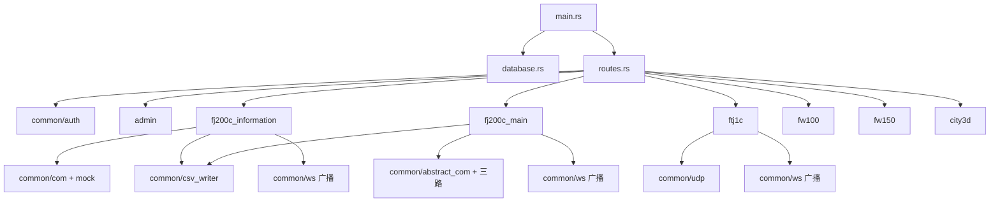

### 3.69.1 关系解读

```
1. main 启动一切（db + 路由 + 模块初始化）
2. 模块间不互相调用（各自独立）
3. 共享基础设施在 common/
4. 通信类模块：数据源（串口/UDP）→ 帧处理 → 广播
5. 台账/管理类：HTTP CRUD + SQLite
```

### 3.69.2 为什么这样设计

```
1. 解耦：模块独立开发/独立故障
2. 复用：common 一次实现到处用
3. 清晰：新人上手快
4. 可测：模块可独立测试
```

## 3.70 深入：后端设计模式的总结

| 模式 | 位置 | 作用 |
|---|---|---|
| 三层架构 | 所有模块 | handler/service/db 分层 |
| 工厂/模板 | role_template | 新模块起点 |
| 抽象接口 | SerialControl | 多协议统一 |
| 广播-订阅 | WS 推送 | 一对多 |
| 队列-消费者 | CSV 写入 | 解耦写盘 |
| 状态机 | 服务生命周期 | 启停可控 |
| 配置驱动 | ini 热更新 | 免编译调整 |
| 契约生成 | utoipa+orval | 类型同步 |

## 3.71 深入：03 章权威自测（8 题）

1. 画一张后端模块关系图？
2. 模块间为什么不互调？
3. 八种设计模式的对应位置？
4. 状态机的作用？
5. 队列-消费者的价值？
6. 配置驱动的意义？
7. 抽象接口的复用价值？
8. 为什么模块可独立测试？

**答对 7+ → 03 章权威。**

## 3.72 深入：后端开发环境配置（rust-analyzer 使用指南）

### 3.72.1 rust-analyzer 的日常用法

```
1. 悬停查看类型（Ctrl+Hover）
2. 转到定义（F12）
3. 查找引用（Shift+F12）
4. 重命名（F2）
5. 自动修复建议（Ctrl+.）
```

### 3.72.2 常用工作流

```
1. 读代码：悬停 → 转到定义 → 跟调用链
2. 改代码：重命名 → 找引用 → 编译验证
3. 调试：测试断点（cargo test 下）
```

### 3.72.3 常见问题

```
1. 索引慢 → 等 build 完（首次）
2. 类型不对 → 检查 feature/编译错误
3. 宏展开 → "Expand macro" 功能
4. 多项目 → 工作区设置（本项目单 crate）
```

## 3.73 深入：后端代码审查清单（提交前自查）

```
1. 所有 Result 正确传播（无吞错）
2. 错误消息带上下文
3. 日志级别正确
4. 无 unwrap（测试除外）
5. SQL 参数化（无字符串拼接）
6. 输入有校验
7. 资源有释放
8. 无死锁（锁不跨 await）
9. 事务覆盖多表操作
10. utoipa 注解完整
```

## 3.74 深入：03 章权威自测（8 题）

1. rust-analyzer 五个常用功能？
2. 读代码的三个工作流？
3. 四个常见问题？
4. 十条审查清单？
5. 无吞错的含义？
6. 锁跨 await 的问题？
7. SQL 拼接的风险？
8. 资源释放检查什么？

**答对 7+ → 03 章权威。**

## 3.75 深入：后端性能调优的完整清单

### 3.75.1 数据库层

```
1. 常用查询加索引（EXPLAIN 验证）
2. 分页用索引列排序
3. 避免 SELECT *（只取需要列）
4. 大结果集分页（LIMIT/OFFSET）
5. 频繁写的表考虑批处理
```

### 3.75.2 并发层

```
1. 广播频道容量合理（背压）
2. 锁粒度小（不要锁全表）
3. 避免锁内 await
4. 长任务 spawn_blocking
5. 连接池大小匹配并发
```

### 3.75.3 数据层

```
1. 帧缓存有界（环形缓冲）
2. CSV 写队列解耦
3. 序列化字段精简
4. 日志级别生产用 info（省 IO）
```

## 3.76 深入：后端监控与指标

### 3.76.1 代码内指标

```
1. 帧计数（收到/解析/丢弃）
2. 队列长度（CSV 积压）
3. 连接数（WS 客户端）
4. 处理耗时（接口响应）
```

### 3.76.2 暴露方式

```
1. 日志（定时汇总）
2. 接口（/api/xxx/status 扩展）
3. 文件（计数写入）
→ 简单系统用日志 + 状态接口即可
```

### 3.76.3 告警阈值建议

```
1. 丢弃率 > 5% → 检查链路
2. 队列积压 > 1000 → 检查写盘
3. WS 断连频繁 → 检查网络
4. 接口 > 2s → 检查查询
```

## 3.77 深入：03 章权威自测（8 题）

1. 数据库层五点？
2. 并发层五点？
3. 数据层四点？
4. 四类代码内指标？
5. 三种暴露方式？
6. 四个告警阈值？
7. 背压的意义？
8. 环形缓冲的好处？

**答对 7+ → 03 章权威。**

> 下一节：**04-Vue3与TypeScript语法速成**。
