# 03 后端逐模块精读

> 适用对象：已完成 02 章语法速成，准备深入后端源码。
> 本章将**逐模块、逐文件、逐行**走读后端全部核心代码，从启动到业务数据流，每个文件标注源码位置与行号，建议全程打开真实文件对照。
> 本章对应代码基线：8 个前端应用 / 8 个角色 / 12 个权限点 / OpenAPI 48 path × 60 操作 × 10 tag。

---

## 3.1 全局总览：先看地图再进山

### 3.1.1 项目规模（2026-08 基线）

| 维度 | 数量 | 说明 |
|---|---|---|
| 前端应用 | 8 | admin、fj200c_information、fj200c_main、fw100、fw150、ftj1c、city3d、protocol_generator |
| 角色 | 8 | 与前端一一对应（`src/roles.rs` ROLE_REGISTRY） |
| 权限点 | 12 | `Permission` 枚举（`src/common/models.rs`） |
| OpenAPI | 48 path / 60 操作 / 10 tag | `api_docs.rs` 断言守护（不含 WS） |
| 生成模型文件 | 115 | `packages/shared/src/api/generated/model/` |

前端端口与生产路径（后端无感知，纯部署概念，但读 handlers 时对照有帮助）：

| 应用 | dev 端口 | prod 路径 | WS 代理 |
|---|---|---|---|
| fj200c_information | 5173 | /fj200c_information | ws:true |
| admin | 5174 | /admin | 无 |
| fw100 | 5175 | /fw100 | ws:true |
| ftj1c | 5176 | /ftj1c | ws:true |
| city3d | 5177 | /city3d | ws:true |
| fw150 | 5178 | /fw150 | ws:true |
| fj200c_main | 5179 | /fj200c_main | ws:true |
| protocol_generator | 5180 | /protocol_generator | 无 |

> 注意：**6 个应用开启了 ws 代理**（fw100/fw150/city3d 也有 WS 能力），不是只有三个硬件模块。所有 `vite.config.ts` 已收敛到共享工厂 `build/vite.base.ts` 的 `defineAppConfig({app, port, ws?}, __dirname)`。

### 3.1.2 后端模块树

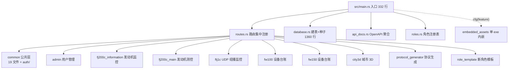

### 3.1.3 两级目录约定（重大结构约定，务必先记）

后端每个角色模块 `src/<role>/` 采用**两级目录**：

1. **一级目录**只保留模板骨架四件套：`mod.rs` / `handlers.rs` / `routes.rs` / `service(s).rs`；
2. **二级目录** `src/<role>/<role>/` 放角色专有子模块（内含自己的 `mod.rs` 声明子模块）；
3. 一级 `mod.rs` 用 `pub mod <role>;` + `pub use <role>::{...};` **再导出**，外部代码路径保持 `crate::<role>::x` 不变；
4. **非 rs 文件留在一级目录**：`config-*.ini` 样本、`help_doc.md`（handlers.rs 用 `include_str!("help_doc.md")` 相对引用，移到二级目录会编译失败）。

各模块实际文件清单（已对照磁盘核实）：

| 模块 | 一级（骨架） | 二级 `<role>/`（角色专有） |
|---|---|---|
| admin | mod.rs / routes.rs / handlers.rs / service.rs | 无（只有模板四件套） |
| fw100 | mod.rs / routes.rs / handlers.rs / services.rs | 无 |
| fw150 | mod.rs / routes.rs / handlers.rs / services.rs | 无 |
| fj200c_information | mod.rs / routes.rs / handlers.rs / service.rs | com.rs、config.rs、csv_sink.rs、decode.rs、frame_bundle.rs、mock.rs、mock_feeder.rs、session.rs、state.rs |
| fj200c_main | mod.rs / routes.rs / handlers.rs / service.rs（+ help_doc.md） | abstract_com.rs、com.rs、config.rs、decode.rs、mock.rs、report.rs、state.rs、types.rs |
| ftj1c | mod.rs / routes.rs / handlers.rs / service.rs（+ help_doc.md） | com.rs、config.rs、models.rs、process.rs、quad_frame.rs、state.rs、udp.rs |
| city3d | mod.rs / routes.rs / handlers.rs / services.rs | models.rs（唯一角色专有文件） |
| protocol_generator | mod.rs / routes.rs / handlers.rs / services.rs | models.rs、generator.rs |
| role_template | 模板四件套 | 无 |

### 3.1.4 公共宏速查（架构优化 commit 61a4b8e 的产物）

| 宏 | 位置 | 生成什么 | 使用方 |
|---|---|---|---|
| `config_singleton!(GLOBAL, global, set_global)` | `src/common/config.rs` | `OnceLock<Config>` 只读单例 | fj200c_information、ftj1c |
| `event_broadcast!(TX, getter)` | `src/common/ws.rs` | `OnceLock<broadcast::Sender<EventPayload>>`（容量 1024，满丢最旧） | 三个监控模块 |
| `embed_assets!` / `embed_app_routes!` | `src/embedded_assets.rs` | 8 个 RustEmbed 结构体 + 全部内嵌路由 | 单 exe 打包 |

注意：fj200c_main **不用** `config_singleton!`——它需要配置热替换，保持 `OnceLock<RwLock<Option<Config>>>` + 自实现 `clear_global()`。

### 3.1.5 WS 性能设计的核心转变

广播载荷是**预序列化的 `Arc<str>`**（`EventPayload = Arc<str>`）：生产端只 `serde_json::to_string` 一次，`ws_bridge` 只转发（克隆指针），**不再每客户端重复序列化**。这是理解三个监控模块事件流的钥匙——`tx.send(Arc<str>)` 不是 `tx.send(Event枚举)`。

---

## 3.2 第一个文件：main.rs（程序入口，332 行）

### 3.2.1 文件总览

`src/main.rs` 是后端的唯一入口。整个启动过程分 8 步，与文件顶部 `//!` 文档注释一一对应：

| 步骤 | 代码行 | 做什么 |
|---|---|---|
| 1. 加载环境变量 | 112 | 读取 `.env` 文件 |
| 2. 初始化日志 | 121-126 | tracing 日志系统 |
| 3. 加载配置 | 139 | PORT / DATABASE_URL |
| 4. **JWT 初始化** | 146 | `jwt::init()`：缓存 JWT_SECRET/JWT_EXPIRATION，生产强制校验 |
| 5. 初始化数据库 | 150 | 建连接池 + 建表 + 种子数据 |
| 6. 配置 CORS | 153-175 | dev 全放行 / 生产 CORS_ORIGINS 白名单 |
| 7. 创建路由 | 200-241 | API 路由 + 静态托管（8 个 dist-*） |
| 8. 启动服务器 | 283-300 | 绑定 127.0.0.1:3000 + 优雅退出 |

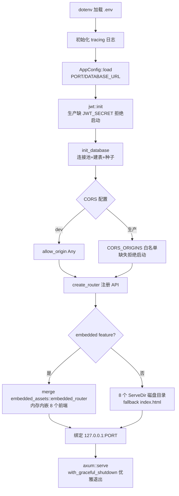

### 3.2.2 模块声明（41-60 行）

```rust
mod admin;               // 管理员模块：用户管理、角色管理
mod api_docs;            // OpenAPI 文档定义与导出
mod city3d;              // city3d 角色模块：城市 3D 展示
mod common;              // 公共模块：认证、中间件、数据模型、错误处理
mod config;              // 配置模块：从环境变量加载应用配置
mod database;            // 数据库模块：SQLite 连接、表创建、种子数据
mod fj200c_information;  // fj200c_information 角色模块：发动机监控
mod fj200c_main;         // fj200c_main 角色模块：发动机测控（ECU/Adam4015/Adam4117/Dyno/Flux 五路串口）
mod ftj1c;               // ftj1c 角色模块：UDP 组播通信监控
mod fw100;               // fw150 角色模块：设备台账管理
mod fw150;
mod protocol_generator;  // protocol_generator 角色模块：通信协议生成器
mod role_template;       // 角色模板：新角色开发的参考模板
mod roles;               // 角色注册表：全系统角色定义的单一事实来源
mod routes;              // 路由模块：集中注册所有 API 路由

#[cfg(feature = "embedded")]
mod embedded_assets;     // 单 exe 打包时才编译
```

**这是整个模块树的根**。每个 `mod xxx;` 对应 `src/xxx/` 目录。新增业务模块时，第一步就是在这里加一行 `mod xxx;`（第 08 章流程的第一步）。

注意 `embedded_assets` 用了 `#[cfg(feature = "embedded")]`——只有带 feature 编译时才存在（条件编译，见 02 章 2.15 节）。

### 3.2.3 主函数与 tokio（104-105 行）

```rust
#[tokio::main]
async fn main() -> Result<(), Box<dyn std::error::Error>> {
```

`#[tokio::main]` 是过程宏：把你的 `async fn main` 包进一个同步 `fn main`，内部创建 Tokio 运行时再执行你的异步代码。**这是 axum 异步生态的入口**，所有 `.await` 都靠它运行。

`Result<(), Box<dyn std::error::Error>>`：函数可以失败；`()` 是空值；`Box<dyn Error>` 是"任意错误"（启动阶段还没引入 AppError，用最宽泛的错误类型）。

### 3.2.4 启动八步走（112-300 行）

**第一步：环境变量**（112 行）

```rust
dotenv::dotenv().ok();
```

读取运行目录的 `.env`。`.ok()` 表示"失败也没关系"（.env 不存在时静默）。

**第二步：日志**（121-126 行）

```rust
tracing_subscriber::registry()
    .with(tracing_subscriber::EnvFilter::new(
        std::env::var("RUST_LOG").unwrap_or_else(|_| "info".into()),
    ))
    .with(tracing_subscriber::fmt::layer())
    .init();
```

日志级别由环境变量 `RUST_LOG` 控制，默认 `info`。调试用 `RUST_LOG=debug` 重启。

**第三步：配置**（139 行）

```rust
let config = AppConfig::load()?;
```

读取 PORT（默认 3000）和 DATABASE_URL（默认 `sqlite://rustweb.db`）。`?` 传播错误——配置错了直接启动失败（比如 PORT 不是数字）。

**第四步：JWT 初始化**（146 行）——生产安全的第一道闸门

```rust
crate::common::jwt::init()?;
```

`jwt::init()` 把 `JWT_SECRET` / `JWT_EXPIRATION` 读进 `OnceLock` 缓存（3.6.5 节详述）。两种模式：

| 模式 | 缺 JWT_SECRET 时 | 后果 |
|---|---|---|
| dev（debug_assertions） | 用固定 "dev-insecure-secret-key" | warn 日志，可启动 |
| 生产（release） | **拒绝启动** | 防误用弱密钥上线 |

**第五步：数据库**（150 行）

```rust
let pool = init_database(&config.database_url).await?;
```

建连接池 + 建表 + 插种子数据（3.5 节详述）。返回 `SqlitePool`（连接池），克隆成本极低，会被注入到所有 handler。

**第六步：CORS**（153-175 行）

```rust
let cors = if cfg!(debug_assertions) {
    CorsLayer::new()
        .allow_methods([Method::GET, Method::POST, Method::PUT, Method::DELETE])
        .allow_headers(Any)
        .allow_origin(Any)                       // dev：全放行
} else {
    let origins = std::env::var("CORS_ORIGINS")
        .map_err(|_| "生产模式必须设置 CORS_ORIGINS 环境变量（逗号分隔的前端来源白名单）")?;
    let origins: Vec<HeaderValue> = origins.split(',').map(|s| s.parse().unwrap()).collect();
    CorsLayer::new()
        .allow_methods(...)
        .allow_headers(Any)
        .allow_origin(origins)                   // 生产：白名单
};
```

开发时前端在 5173~5180，后端在 3000，跨域全靠它放行；**生产模式必须显式配置 `CORS_ORIGINS` 白名单**（逗号分隔），否则拒绝启动——与 JWT 密钥同样的"生产强制配置"哲学。

**第七步：路由与静态托管**（200-241 行）——最值得细看的部分

```rust
let app = {
    let base = create_router(pool)
        .layer(cors)
        .route("/", get(|| async { Redirect::permanent("/admin") }));

    #[cfg(feature = "embedded")]
    let app = base.merge(embedded_assets::embedded_router());

    #[cfg(not(feature = "embedded"))]
    let app = base
        .nest_service("/admin", ServeDir::new("dist-admin")
            .fallback(ServeFile::new("dist-admin/index.html")))
        // ... 其余 7 个前端同理（共 8 个 dist-* 目录）
    app
};
```

三个设计点：

1. **`/` 重定向到 `/admin`**：根路径直接进管理后台，方便演示。
2. **双模式静态托管**：`--features embedded` 时前端内嵌内存（8 个应用，`embedded_assets.rs` 宏生成）；默认 dev 模式读磁盘 `dist-<app>/` 目录。
3. **`fallback(index.html)` 是 SPA 深链接的关键**：Vue Router 用 history 模式，浏览器直接访问 `/fj200c_information/data`（刷新页面）时服务器没有这个文件，fallback 返回 index.html，前端路由接管渲染。**没有这行，刷新就 404**。

注意 `.layer()` 在 axum 0.7 中只作用于调用时**已注册**的路由，所以 CORS 必须加在 `create_router(pool)` 之后、`merge/nest_service` 之前，确保 API 与静态路由都被包裹——这是踩过坑后留下的注释，改动时别把它破坏。

**第八步：启动 + 优雅退出**（283-300 行）

```rust
let addr = SocketAddr::from(([127, 0, 0, 1], config.port));
let listener = tokio::net::TcpListener::bind(addr).await?;
axum::serve(listener, app)
    .with_graceful_shutdown(shutdown_signal())   // Ctrl+C / Windows 关机信号
    .await?;
Ok(())
```

`127.0.0.1` 绑定回环地址——**只允许本机访问**。要允许局域网访问，改成 `0.0.0.0`。`shutdown_signal()` 监听 `ctrl_c()` 与 Windows 的 `ctrl_shutdown()`，收到信号后停止接收新连接、等存量请求处理完再退出——**这是生产系统"进程被杀数据不丢"的基础**（CSV 的 Drop flush 是另一层保险）。

启动前还有一个值得注意的中间件栈（271-277 行附近）：

```rust
let app = app
    .layer(middleware::from_fn(static_cache_headers))   // 静态资源缓存头
    .layer(TraceLayer::new_for_http());                 // 每请求访问日志
```

`static_cache_headers`（256 行附近）：`assets/` 路径返回 `immutable` 永久缓存（前端打包指纹文件名），`.html` 返回 `no-cache`——SPA 更新后不缓存旧 index.html。

### 3.2.5 你将来会改 main.rs 的场景

| 场景 | 改哪里 |
|---|---|
| 改端口 | 第 139 行配置（或 .env 的 PORT） |
| 允许外网访问 | 第 283 行 `127.0.0.1` → `0.0.0.0` |
| 新增前端应用 | dev 模式加一段 `nest_service` + `embedded_assets.rs` 宏列表加一项 |
| 改根路径重定向 | 第 202 行 `/admin` |
| 调整 CORS | 第 153-175 行（生产白名单在 .env 的 CORS_ORIGINS） |

### 3.2.6 自测题

1. main.rs 启动八步中，第 4 步（jwt::init）在生产模式缺 JWT_SECRET 会怎样？
2. CORS 在生产模式靠什么环境变量？为什么 dev/prod 两套逻辑？
3. 静态缓存头对 .html 和 assets/ 分别怎么处理？为什么？
4. 优雅退出解决了什么问题？
5. 8 个前端在 dev 模式如何被托管？embedded 模式呢？

---

## 3.3 第二个文件：routes.rs（路由集中注册）

### 3.3.1 设计思想

`src/routes.rs` 是**路由的中央集线器**：所有模块的 `xxx_router(db)` 子路由在这里拼装成一颗完整路由树，最后 `with_state(db)` 注入数据库连接池。

```mermaid
flowchart TD
    RT["create_router(db)"] --> H["/health"]
    RT --> OD["/api-docs/openapi.json"]
    RT --> MR["/api/meta/roles"]
    RT --> PW["/admin/pwd 种子密码查询（公开/可停用）"]
    RT --> A["nest /api/auth → auth_router"]
    RT --> U["nest /api/users → admin_router"]
    RT --> FI["nest /api/fj200c_information → fj200c_information_router"]
    RT --> FM["nest /api/fj200c_main → fj200c_main_router"]
    RT --> F1["nest /api/fw100 → fw100_router"]
    RT --> F2["nest /api/fw150 → fw150_router"]
    RT --> T["nest /api/ftj1c → ftj1c_router"]
    RT --> C["nest /api/city3d → city3d_router"]
    RT --> PG["nest /api/protocol_generator → protocol_generator_router"]
    RT --> S["with_state(db) 注入连接池"]
```

### 3.3.2 关键代码走读

```rust
Router::<DatabaseConnection>::new()
    .route("/health", get(crate::common::health_check))
    .route("/api-docs/openapi.json", get(crate::api_docs::openapi_json))
    .route("/api/meta/roles", get(crate::roles::list_roles))
    .route("/admin/pwd", get(admin_pwd))          // 种子账号初始密码（受停用开关控制）
    .nest("/api/auth", auth_routes)
    .nest("/api/users", admin_routes)
    .nest("/api/fj200c_information", fj200c_information_routes)
    .nest("/api/fj200c_main", fj200c_main_routes)
    .nest("/api/fw100", fw100_routes)
    .nest("/api/ftj1c", ftj1c_routes)
    .nest("/api/city3d", city3d_routes)
    .nest("/api/fw150", fw150_routes)
    .nest("/api/protocol_generator", protocol_generator_routes)
    .with_state(db)
```

逐个解释：

1. **`Router::<DatabaseConnection>::new()`**：显式声明状态类型为数据库连接池。所有 handler 都可以用 `State(db): State<DatabaseConnection>` 拿它。
2. **公开端点**（无需登录）：
   - `/health`：健康检查（负载均衡/监控用）。
   - `/api-docs/openapi.json`：实时 OpenAPI 文档。
   - `/api/meta/roles`：角色注册表（前端运行时拉取）。
   - `/admin/pwd`：种子账号初始密码列表（3.5.5 节详述；admin 前端可停用此端点，停用时返回 403）。
3. **`.nest(prefix, router)`**：挂载子路由，自动加前缀。`auth_router` 里的 `/login` 挂到 `/api/auth/login`。
4. **`.with_state(db)`**：最后注入状态。所有子路由共享同一个连接池。

### 3.3.3 nest 与 route 的区别（新手易混）

| 方法 | 用途 | 例子 |
|---|---|---|
| `.route(path, handler)` | 注册单个路由 | `.route("/health", get(health))` |
| `.nest(path, router)` | 挂载整棵子路由树 | `.nest("/api/auth", auth_router)` |
| `.nest_service(path, service)` | 挂载静态文件服务 | `.nest_service("/admin", ServeDir::new(...))` |
| `.layer(mw)` | 给**已注册**的路由添加中间件 | `.layer(cors)` |
| `.route_layer(mw)` | 只给该路由加中间件 | 各模块内部用 |
| `.with_state(s)` | 注入共享状态 | `.with_state(db)` |
| `.merge(router)` | 合并另一棵树（平级） | `embedded_router` |

### 3.3.4 新增模块时 routes.rs 怎么改

1. `let xxx_routes = crate::xxx::routes::xxx_router(db.clone());`
2. `.nest("/api/xxx", xxx_routes)`
3. 模块内部实现 `xxx_router()`（第 08 章详述）。

### 3.3.5 自测题

1. 公开端点有几个？分别是什么？
2. `/admin/pwd` 为什么挂在 routes.rs 而不是 admin 模块里？（提示：它在 users 前缀之外，且可被停用）
3. `.layer` 与 `.route_layer` 的作用范围区别？

---

## 3.4 第三个文件：roles.rs（RBAC 唯一源）

### 3.4.1 为什么它最重要

`src/roles.rs` 是**全系统角色定义的单一事实来源**：前端菜单怎么显示、后端接口放行谁、用户列表角色下拉有哪些——最终都由这里驱动。前端运行时通过 `GET /api/meta/roles` 拉取 key/name/permissions 缓存（`loadRoleRegistry()`），**前端没有手写副本**。

### 3.4.2 核心数据结构

```rust
// 角色定义
pub struct RoleDef {
    pub key: &'static str,              // 角色标识（存数据库用，如 "admin"）
    pub name: String,                   // 角色显示名（前端展示）
    pub permissions: &'static [Permission],   // 权限点列表
}

// 注册表：静态数组，全系统唯一的角色清单（8 个）
pub static ROLE_REGISTRY: &[RoleDef] = &[
    RoleDef { key: "admin", name: "管理员",
        permissions: &[Permission::UsersRead, Permission::UsersWrite,
                       Permission::UsersDelete, Permission::SystemAdmin] },
    RoleDef { key: "fj200c_information", name: "涡桨FJ200C信息化",
        permissions: &[Permission::Fj200cInformationMonitor] },
    RoleDef { key: "fw100", name: "涡喷FW100", permissions: &[Permission::Fw100Monitor] },
    RoleDef { key: "ftj1c", name: "协议转发FTJ1C", permissions: &[Permission::Ftj1cMonitor] },
    RoleDef { key: "city3d", name: "城市3D", permissions: &[Permission::City3dView] },
    RoleDef { key: "fw150", name: "涡喷FW150", permissions: &[Permission::Fw150Monitor] },
    RoleDef { key: "fj200c_main", name: "涡桨FJ200C测控",
        permissions: &[Permission::Fj200cMainMonitor] },
    RoleDef { key: "protocol_generator", name: "协议生成器",
        permissions: &[Permission::ProtocolGeneratorMonitor] },
];
```

注意：`permissions: &'static [Permission]` 是**静态切片**——编译期内嵌的权限列表，不可变。注册表本身不可变，这就是"唯一源"的保证。

### 3.4.3 Permission 枚举全景（12 变体，`src/common/models.rs`）

| 变体 | 归属角色 | 控制的 API |
|---|---|---|
| `Fj200cInformationMonitor` | fj200c_information | `/api/fj200c_information/*` |
| `Fw100Monitor` | fw100 | `/api/fw100/*` |
| `Ftj1cMonitor` | ftj1c | `/api/ftj1c/*`（除 /help） |
| `Ftj1cHelp` | ftj1c | `GET /api/ftj1c/help`（独立权限，与监控权限分离） |
| `City3dView` | city3d | `/api/city3d/*` |
| `Fw150Monitor` | fw150 | `/api/fw150/*` |
| `Fj200cMainMonitor` | fj200c_main | `/api/fj200c_main/*` |
| `ProtocolGeneratorMonitor` | protocol_generator | `/api/protocol_generator/*` |
| `UsersRead` | admin | GET /api/users、settings 读取 |
| `UsersWrite` | admin | POST /api/users、角色修改 |
| `UsersDelete` | admin | DELETE /api/users |
| `SystemAdmin` | admin | admin 路由总门槛 |

**为什么 ftj1c 有两个权限**：帮助文档端点（帮助内容含调试信息）与监控端点分离——将来可以单独收回某个用户的帮助权限，而不影响监控。

### 3.4.4 关键函数

```rust
// 根据角色 key 查权限列表
pub fn permissions_for(role: &str) -> Vec<Permission> {
    ROLE_REGISTRY.iter()
        .find(|r| r.key == role)          // 找到角色
        .map(|r| r.permissions.to_vec())  // 权限列表克隆
        .unwrap_or_default()              // 没找到 → 空权限（无权限用户）
}

// 角色是否存在于注册表（创建用户时白名单校验）
pub fn is_registered_role(role: &str) -> bool {
    ROLE_REGISTRY.iter().any(|r| r.key == role)
}

// 前端需要的 DTO：key + name + permissions
#[derive(Serialize, ToSchema)]
pub struct RoleInfo {
    pub key: String,
    pub name: String,
    pub permissions: Vec<Permission>,
}

// 公开端点：GET /api/meta/roles
pub async fn list_roles() -> Json<ApiResponse<Vec<RoleInfo>>> {
    let roles = ROLE_REGISTRY.iter()
        .map(|r| RoleInfo { key: r.key.to_string(), name: r.name.clone(),
                            permissions: r.permissions.to_vec() })
        .collect();
    Json(ApiResponse::success(roles))
}
```

### 3.4.5 权限流动全景图

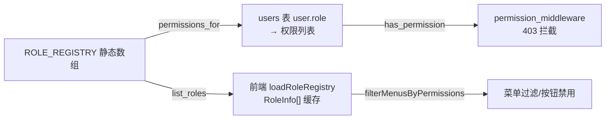

**重要理解**：
1. 数据库 users 表**只存角色字符串**（`role = 'admin'`），不存权限列表。
2. 权限是**推导**出来的：`permissions_for(role)` 查注册表。
3. 改权限 → 改注册表 → 重新生成 API（`npm run gen:api`）→ 前端自动同步。
4. `is_registered_role` 是**创建用户的白名单**：管理员不能给用户编造一个不存在的角色。
5. 前端 **MENU_CONFIG / ROLE_APP_URLS 是纯 UI 概念**，仍手写（roles.ts），但 key/name/permissions 运行时拉取。

### 3.4.6 自测题

1. 8 个角色各有哪些权限？admin 为什么有 4 个？
2. 前端如何拿到角色注册表？注册表加载失败会怎样？（提示：失败缓存空数组，不阻塞登录）
3. 新增角色的后端最小改动是什么？

---

## 3.5 第四个文件：database.rs（建表 + 种子数据，1360 行）

### 3.5.1 设计思想：无迁移文件的数据库

一般项目用迁移工具（如 Diesel、Flyway）管理表结构；本项目**没有迁移文件**——建表 SQL 全在 `database.rs` 里，启动时执行。特点是：

1. **幂等**：`CREATE TABLE IF NOT EXISTS`，重复执行无害。
2. **自动升级**：加了新表/新字段，重启即生效（老代码兼容旧表）。
3. **可重置**：删掉 `rustweb.db` 重启，自动重建 + 重新种种子。
4. **单事务**：全部建表 + 种子包在一个事务里，启动毫秒级完成（1360 行代码的执行代价远小于一次 bcrypt）。

### 3.5.2 初始化流程（init_database）

```rust
pub async fn init_database(database_url: &str) -> Result<SqlitePool, sqlx::Error> {
    // 1. 配置 SQLite 选项
    let options = SqliteConnectOptions::from_str(database_url)?
        .create_if_missing(true)        // 文件不存在自动创建
        .foreign_keys(true)             // 启用外键
        .journal_mode(SqliteJournalMode::Wal);   // WAL 模式（并发读写优化）

    // 2. 创建连接池
    let pool = SqlitePool::connect_with(options).await?;

    // 3. 建表 + 种子（单事务，幂等）
    let mut tx = pool.begin().await?;
    create_tables(&mut tx).await?;
    seed_data(&mut tx).await?;
    tx.commit().await?;

    Ok(pool)
}
```

三个选项值得理解：

| 选项 | 作用 | 为什么 |
|---|---|---|
| `create_if_missing(true)` | 库文件不存在自动创建 | 开箱即用，无需手动建库 |
| `foreign_keys(true)` | 外键约束生效 | city3d 建筑引用区域 |
| `journal_mode(Wal)` | 预写日志模式 | 读写不互相阻塞，性能更好 |

### 3.5.3 表清单（7 张）

| 表 | 用途 | 备注 |
|---|---|---|
| users | 用户（id/username/email/password_hash/role/created_at/updated_at） | UUID 存 TEXT |
| seed_passwords | 种子账号初始密码（明文展示用） | 与 users 分离，见 3.5.4 |
| user_settings | 用户列配置 JSON | user_id 主键 |
| system_settings | 系统键值对 | 如 `pwd_route_disabled` |
| city3d_districts | 城市区域 | 5 条种子 |
| city3d_buildings | 建筑 | 51 条种子，引用区域 |
| city3d_events | 事件 | 8 条种子 |

**新手注意**：
1. 主键用 `TEXT` 存 UUID 字符串（SQLite 无原生 UUID 类型）。
2. `UNIQUE` 约束配合 `INSERT OR IGNORE` 实现幂等种子。
3. 数据库列名 snake_case 与 Rust 结构体字段一致，sqlx 才能自动映射。
4. 建表后有一段**幂等清理**逻辑：`DROP TABLE IF EXISTS` 清理历史遗留表（user_roles/roles/posts/menu_items/user_devices/data_export_requests）与冗余索引；还有**历史角色迁移**（`UPDATE users SET role = ...`）：moderator→user 降级、user→fj200c_information、fj200c→fj200c_information——项目演进留下的痕迹，改表结构时注意保持幂等。

### 3.5.4 种子账号与密码机制（重要更新）

**8 个种子账号**，邮箱域名 `@7304.com`（不是旧的 @rustweb.dev），固定 UUID：

| 账号（email） | 角色 | 用途 |
|---|---|---|
| admin@7304.com | admin | 管理后台 |
| fj200c_information@7304.com | fj200c_information | 发动机监控 |
| fj200c_main@7304.com | fj200c_main | 发动机测控 |
| fw100@7304.com | fw100 | 设备台账 |
| fw150@7304.com | fw150 | 设备台账 |
| ftj1c@7304.com | ftj1c | 通信监控 |
| city3d@7304.com | city3d | 城市 3D |
| protocol_generator@7304.com | protocol_generator | 协议生成器 |

**密码机制的真相**（新手容易误解，务必记牢）：

```rust
// random_password(12) 的返回值设计
let (password, password_fake) = random_password(12);
//  password = "123456"        ← 固定开发默认密码
//  password_fake = 随机12位   ← 只写进 seed_passwords 表（展示用）

// 实际入库：
//  users 表        password_hash = bcrypt("123456")   ← 固定 123456
//  seed_passwords 表 password    = 随机串              ← 前端 /admin/pwd 展示
```

- **有意保留固定开发默认密码 "123456"**（所有种子账号都能用 123456 登录），bcrypt 哈希走 `spawn_blocking`；
- `seed_passwords` 表存的是**随机串**，通过 `GET /admin/pwd` 查询——让"展示的初始密码"看起来随机，但实际登录密码统一 123456；
- 历史库账号缺 seed_passwords 记录时，启动时一次性迁移补齐；
- **明文不打印日志**，只能经 /admin/pwd 查询。

> 注：这是本项目"演示友好 + 表面安全"的权衡设计。接盘后如要真正随机化，改 `random_password` 的返回值即可（种子只在首次创建时生效，`INSERT OR IGNORE` 不覆盖已存在用户）。

### 3.5.5 /admin/pwd 端点与停用开关

```rust
// routes.rs 顶层：GET /admin/pwd（无认证，但受 system_settings 开关控制）
async fn admin_pwd(State(db): State<DatabaseConnection>) -> Result<..., AppError> {
    // 查 system_settings 表 pwd_route_disabled 键
    // 停用 → 403；启用 → 返回 seed_passwords 全部（username + password）
}

// admin 模块：GET/PUT /api/users/settings/pwd-route（SystemAdmin 权限）
// admin 前端 Users.vue 有「停用初始密码查询」勾选框
```

数据流：前端勾选停用 → `PUT /api/users/settings/pwd-route` 写 `system_settings['pwd_route_disabled']='true'` → 之后任何人访问 `GET /admin/pwd` 得 403。**默认启用**（可查询）。

### 3.5.6 city3d 种子数据

5 个区域 + 51 座建筑（UUID 从基值递增）+ 8 个事件——都是演示数据，删库重启即恢复。建筑外键引用区域（`district_id`），配合外键约束。

### 3.5.7 你将来会改 database.rs 的场景

| 场景 | 改法 |
|---|---|
| 新增业务表 | `create_tables` 加 `CREATE TABLE IF NOT EXISTS` |
| 加字段 | 老表加列用 `ALTER TABLE ... ADD COLUMN`（注意幂等：先查是否已存在） |
| 换种子密码 | 改 `random_password` 返回的第一个值 |
| 加演示数据 | 参照 city3d 种子写法 |

### 3.5.8 自测题

1. 为什么建表 + 种子包在一个事务里？重复启动为什么无害？
2. 8 个种子账号的邮箱域名是什么？密码实际是什么？
3. `seed_passwords` 表与 users 表密码为什么不一致？
4. /admin/pwd 停用后访问返回什么？
5. 历史表清理和角色迁移为什么必须是幂等的？

---

## 3.6 common 公共层精读（全系统的地基）

`src/common/` 是**所有角色共用**的基础设施：19 个 rs 文件 + `auth/` 子目录（4 个文件）。这是全项目价值密度最高的目录，逐个精读。

### 3.6.1 文件清单总表

```
src/common/
├── mod.rs            # 模块门面 + health_check
├── config.rs         # config_singleton! 宏（OnceLock 只读单例）
├── ws.rs             # event_broadcast! 宏 + EventPayload(Arc<str>) + verify_query_token + ws_bridge
├── service.rs        # ServiceRuntime 线程池 + stop_in_background
├── jwt.rs            # JWT 签发/校验 + init()（167 行）
├── middleware.rs     # auth / permission / role 三个中间件（198 行）
├── error.rs          # AppError 统一错误（212 行）
├── models.rs         # Permission(12 变体) + User + ApiResponse（389 行）
├── rate_limit.rs     # 登录滑动窗口限流（60s / 5 次）
├── csv_writer.rs     # 公共 CSV 写入器（三个模块共用）
├── quad_frame.rs     # 四槽帧缓冲（主备切换）
├── frame_extractor.rs# 字节流帧提取器（112 行）
├── least_squares.rs  # 最小二乘拟合（86 行）
├── global_var.rs     # 进程内 KV 单例（123 行）
├── io.rs             # IoControl trait（串口/模拟统一抽象）
├── utils.rs          # hex / ASCII 转换工具
├── dto.rs            # 公共响应 DTO（ServiceStatus 等）
├── latest_frame.rs   # 最新帧跟踪器
├── ledger.rs         # 台账演示数据（fw100/fw150 共用）
└── auth/             # 登录/用户（routes / handlers / services / mod）
```

### 3.6.2 common/mod.rs：模块门面

```rust
pub mod auth;
pub mod config;
pub mod csv_writer;
pub mod dto;
pub mod error;
pub mod frame_extractor;
pub mod global_var;
pub mod io;
pub mod jwt;
pub mod latest_frame;
pub mod ledger;
pub mod least_squares;
pub mod middleware;
pub mod models;
pub mod quad_frame;
pub mod rate_limit;
pub mod service;
pub mod utils;
pub mod ws;

/// 健康检查：GET /health → 200
pub async fn health_check() -> &'static str {
    "OK"
}
```

`health_check` 返回 `&'static str`（常量字符串），Axum 自动转 `text/plain` 响应——最简单的 handler 形态。

### 3.6.3 common/config.rs：config_singleton! 宏

```rust
/// 生成"进程级只读配置单例"：
///   static GLOBAL: OnceLock<Config>
///   pub fn global() -> &'static Config        // 惰性初始化，只读
///   pub fn set_global(cfg: Config)            // 启动时注入
macro_rules! config_singleton {
    ($global:ident, $getter:ident, $setter:ident) => {
        static $global: std::sync::OnceLock<crate::common::config::Config> = std::sync::OnceLock::new();
        pub fn $getter() -> &'static crate::common::config::Config {
            $global.get_or_init(|| crate::common::config::Config::default())
        }
        pub fn $setter(cfg: crate::common::config::Config) {
            let _ = $global.set(cfg);          // 只能 set 一次
        }
    };
}
```

使用方：`fj200c_information`（`config::global()`）与 `ftj1c`。**fj200c_main 不用它**——因为配置需要**热替换**（服务运行中重启后重新加载），它保持 `OnceLock<RwLock<Option<Config>>>` + 自实现 `clear_global()`（RwLock 可写，先 clear 再 set）。

### 3.6.4 common/ws.rs：WebSocket 事件桥（全项目 WS 的心脏）

#### EventPayload：预序列化的 Arc<str>

```rust
/// 广播载荷：预序列化 JSON 字符串。生产端只序列化一次，ws_bridge 只转发指针。
pub type EventPayload = Arc<str>;

/// 各角色事件类型不同，但通道形态一致：容量 1024，满则丢弃最旧。
pub fn serialize<E: Serialize>(event: &E) -> Result<EventPayload, serde_json::Error> {
    Ok(serde_json::to_string(event)?.into())
}
```

**性能设计**：旧实现是 `broadcast::Sender<Fj200cInformationEvent>`，每个 WS 客户端收到事件都要自己 `to_string` 一次——10 个客户端就序列化 10 次。现在生产端序列化一次存成 `Arc<str>`，广播通道里传的是字符串，WS 桥直接转发（克隆 Arc 指针零拷贝）。

#### event_broadcast! 宏

```rust
/// 生成角色自己的广播通道：
///   static XXX_TX: OnceLock<broadcast::Sender<EventPayload>>
///   pub fn xxx_tx() -> broadcast::Sender<EventPayload>   // 惰性初始化，容量 1024
macro_rules! event_broadcast {
    ($tx:ident, $getter:ident) => {
        static $tx: std::sync::OnceLock<tokio::sync::broadcast::Sender<crate::common::ws::EventPayload>>
            = std::sync::OnceLock::new();
        pub fn $getter() -> tokio::sync::broadcast::Sender<crate::common::ws::EventPayload> {
            $tx.get_or_init(|| tokio::sync::broadcast::channel(1024).0).clone()
        }
    };
}
```

三个监控模块（fj200c_information / fj200c_main / ftj1c）各自 `event_broadcast!(FJ200C_INFORMATION_TX, fj200c_information_tx);`——通道形态统一，事件类型各自序列化。容量 1024：慢客户端会收到 `Lagged` 错误（丢最旧事件），不至于阻塞生产者。

#### verify_query_token：WS 的 token 校验

```rust
/// WS 不走 JWT header（浏览器 WS 不支持自定义头），token 通过 ?token= 查询参数。
/// 校验失败返回 401 状态码。
pub fn verify_query_token(
    token: &str,
    db: &DatabaseConnection,
) -> Result<Uuid, StatusCode> {
    let user_id = jwt::verify_token(token).map_err(|_| StatusCode::UNAUTHORIZED)?;
    // 再查一次数据库，确认用户仍然存在（防已删除用户的 token 继续用）
    let user = sqlx::query_as::<_, User>("SELECT * FROM users WHERE id = ?1")
        .bind(user_id).fetch_optional(db).await
        .map_err(|_| StatusCode::INTERNAL_SERVER_ERROR)?
        .ok_or(StatusCode::UNAUTHORIZED)?;
    Ok(user.id)
}
```

#### ws_bridge：广播 → WS 转发

```rust
/// 把广播通道的事件推给一个 WS 连接
pub async fn ws_bridge(
    tx: broadcast::Sender<EventPayload>,
    socket: WebSocket,
    log_prefix: &str,
) {
    let (mut sender, mut receiver) = socket.split();   // 拆成发送/接收两半
    let mut rx = tx.subscribe();                       // 订阅广播

    loop {
        tokio::select! {
            // 客户端 → 服务端（本项目一般只用 Close 消息做退出）
            msg = receiver.next() => {
                match msg {
                    Some(Ok(Message::Close(_))) | None | Some(Err(_)) => break,
                    _ => {}
                }
            }
            // 服务端 → 客户端（广播事件推送）
            event = rx.recv() => {
                match event {
                    Ok(evt) => {
                        if sender.send(Message::Text(evt.to_string())).await.is_err() {
                            break;   // 客户端断开
                        }
                    }
                    Err(RecvError::Lagged(_)) => continue,   // 慢客户端丢事件
                    Err(RecvError::Closed) => break,          // 广播通道关闭
                }
            }
        }
    }
    tracing::info!("{log_prefix} WebSocket 连接关闭");
}
```

**这是全项目 WS 的公共实现**——所有硬件模块的 ws_handler 最后都调用它。注意载荷是 `EventPayload = Arc<str>`，`evt.to_string()` 只是把 Arc 解出来，**零序列化**。

### 3.6.5 common/service.rs：ServiceRuntime（线程管理）

```rust
/// 全局线程句柄池：管理所有业务线程的启停
pub struct ServiceRuntime {
    handles: Mutex<Vec<JoinHandle<()>>>,
    stopping: AtomicBool,
}

impl ServiceRuntime {
    /// 登记线程句柄
    pub fn push(&self, handle: JoinHandle<()>) { ... }
    /// 请求停止：置标志 + 等所有线程 join（最长 timeout_secs 秒）
    pub fn wait_stopping(&self, timeout: Duration) { ... }
    /// 置"停止进行中"标志（防重启竞态）
    pub fn set_stopping(&self, v: bool) { ... }
}

/// 公共"后台停止"：置停止信号后在独立线程 join，避免阻塞 HTTP handler 响应。
/// HTTP 请求"停止"立即返回，实际线程逐步退出。
pub fn stop_in_background(
    runtime: &ServiceRuntime,
    running_flag: &AtomicBool,
    set_stop_signal: impl FnOnce(),
    log_message: &str,
) {
    running_flag.store(false, Ordering::Relaxed);
    set_stop_signal();
    std::thread::spawn(move || {
        runtime.wait_stopping(Duration::from_secs(3));
        tracing::info!("{}", log_message);
    });
}
```

**服务生命周期四步曲**（三个硬件模块统一）：


关键点：`stop_in_background` 是**非阻塞停止**——HTTP handler 立即返回"已停止"，真正的 join 在独立线程里做。先 `wait_stopping(3)` 再启动是防"旧线程没死就开新线程"的竞态。

### 3.6.6 common/jwt.rs：JWT 签发与校验（167 行）

```rust
/// 全局缓存：进程启动时读一次环境变量
static JWT_SECRET: OnceLock<String> = OnceLock::new();
static JWT_EXPIRATION: OnceLock<i64> = OnceLock::new();

/// 必须在 main.rs 启动时调用：缓存 JWT_SECRET 与 JWT_EXPIRATION。
/// dev 模式缺 JWT_SECRET 用固定开发密钥（warn）；
/// 生产模式（!debug_assertions）缺 JWT_SECRET 直接返回错误，拒绝启动。
pub fn init() -> Result<(), String> {
    let secret = std::env::var("JWT_SECRET").unwrap_or_else(|_| {
        if cfg!(debug_assertions) {
            tracing::warn!("未设置 JWT_SECRET，使用不安全的开发密钥");
            "dev-insecure-secret-key".to_string()
        } else {
            panic!("生产环境必须设置 JWT_SECRET");   // 或返回 Err
        }
    });
    let expiration = std::env::var("JWT_EXPIRATION")
        .ok().and_then(|s| s.parse().ok()).unwrap_or(86400);
    let _ = JWT_SECRET.set(secret);
    let _ = JWT_EXPIRATION.set(expiration);
    Ok(())
}

/// 签发：把用户 id + role 放进 Claims，HS256 签名
pub fn create_token(user: &User) -> Result<String, AppError> { ... }

/// 校验：验签名 + 验过期，返回用户 id
pub fn verify_token(token: &str) -> Result<Uuid, AppError> { ... }
```

jsonwebtoken >= 10.3.0。**`init()` 的"生产强制"是本项目安全基线**：开发用固定密钥无所谓，生产缺密钥直接启动失败，防止弱密钥上线。

### 3.6.7 common/middleware.rs：三个中间件（198 行）

这是权限体系的执行层。三个中间件一条链：

```rust
/// ① 从请求头提取 Bearer token 并验证，返回用户 ID
fn extract_user_id(request: &Request) -> Result<uuid::Uuid, StatusCode> {
    let auth_header = request.headers()
        .get("Authorization")
        .and_then(|h| h.to_str().ok())
        .and_then(|s| s.strip_prefix("Bearer "));   // "Bearer xxx" → "xxx"
    let token = auth_header.ok_or(StatusCode::UNAUTHORIZED)?;
    jwt::verify_token(token).map_err(|_| StatusCode::UNAUTHORIZED)
}

/// ② 从数据库加载用户（未找到 → 401）
async fn load_user(db: &DatabaseConnection, user_id: uuid::Uuid) -> Result<User, StatusCode> {
    sqlx::query_as::<_, User>("SELECT * FROM users WHERE id = ?1")
        .bind(user_id)
        .fetch_optional(db)
        .await
        .map_err(|_| StatusCode::INTERNAL_SERVER_ERROR)?
        .ok_or(StatusCode::UNAUTHORIZED)
}

/// ③ 鉴权中间件：验证 token → 加载用户 → 注入 Extension
pub async fn auth_middleware(
    State(db): State<DatabaseConnection>,
    mut request: Request,
    next: Next,
) -> Result<Response, StatusCode> {
    let user_id = extract_user_id(&request)?;
    let user = load_user(&db, user_id).await?;
    request.extensions_mut().insert(user);   // ★ 把用户塞进请求扩展区
    Ok(next.run(request).await)              // 放行，handler 用 Extension 取
}

/// ④ 权限中间件：额外检查指定权限
pub async fn permission_middleware(
    required_permission: Permission,
    State(db): State<DatabaseConnection>,
    mut request: Request,
    next: Next,
) -> Result<Response, StatusCode> {
    let user_id = extract_user_id(&request)?;
    let user = load_user(&db, user_id).await?;
    if !user.has_permission(&required_permission) {
        return Err(StatusCode::FORBIDDEN);   // 有身份但无权限 → 403
    }
    request.extensions_mut().insert(user);
    Ok(next.run(request).await)
}

/// ⑤ 角色中间件：SystemAdmin 专用（admin 模块总门槛）
pub async fn role_middleware(/* ... 检查 Permission::SystemAdmin ... */) -> Result<Response, StatusCode> { ... }
```

**中间件模式总结**（新手必记）：
- 签名固定：`(State, Request, Next) -> Result<Response, StatusCode>`（额外参数如 `required_permission` 需要**函数包装**，因为 `from_fn` 不能传参——见 3.8 节 admin/routes.rs 的 `users_read_middleware()`）。
- 三件事：**验证 → 加载 → 注入**。
- 放行 = `next.run(request).await`；拦截 = 返回 `StatusCode`。
- `request.extensions_mut().insert(user)`：Axum 的"请求背包"，中间件放进什么，handler 用 `Extension<T>` 取什么。

### 3.6.8 common/models.rs：核心模型（389 行）

**Permission 枚举**（12 变体，3.4.3 节已列表，此处看代码形态）：

```rust
#[derive(Debug, Clone, Copy, PartialEq, Eq, Serialize, Deserialize, utoipa::ToSchema)]
pub enum Permission {
    Fj200cInformationMonitor,
    Fw100Monitor,
    Ftj1cMonitor,
    Ftj1cHelp,
    City3dView,
    Fw150Monitor,
    Fj200cMainMonitor,
    ProtocolGeneratorMonitor,
    UsersRead,
    UsersWrite,
    UsersDelete,
    SystemAdmin,
}
```

**User**：

```rust
#[derive(Debug, Clone, Serialize, Deserialize, utoipa::ToSchema)]
pub struct User {
    pub id: uuid::Uuid,
    pub username: String,
    pub email: String,
    #[serde(skip_serializing)]     // ★ 永不随 JSON 返回
    #[sqlx(default)]               // ★ 查询映射时允许缺列
    pub password_hash: String,
    pub role: String,
    pub created_at: chrono::NaiveDateTime,
    pub updated_at: chrono::NaiveDateTime,
}

impl User {
    pub fn permissions(&self) -> Vec<Permission> {
        crate::roles::permissions_for(&self.role)
    }
    pub fn has_permission(&self, permission: &Permission) -> bool {
        self.permissions().contains(permission)
    }
}
```

**ApiResponse 统一响应**（前端所有接口的标准包装）：

```rust
#[derive(Debug, Clone, Serialize, Deserialize, utoipa::ToSchema)]
pub struct ApiResponse<T> {
    pub success: bool,          // 是否成功
    pub message: String,        // 提示信息（失败时是错误描述）
    pub data: Option<T>,        // 业务数据（成功时 Some）
}

impl<T> ApiResponse<T> {
    pub fn success(data: T) -> Self {
        Self { success: true, message: "ok".to_string(), data: Some(data) }
    }
    pub fn error(message: impl Into<String>) -> Self {
        Self { success: false, message: message.into(), data: None }
    }
}
```

**LoginRequest 与校验**：

```rust
#[derive(Debug, Deserialize, ToSchema)]
pub struct LoginRequest {
    #[validate(email)]                  // validator 属性：邮箱格式校验
    pub email: String,
    pub password: String,
}
```

### 3.6.9 common/rate_limit.rs：登录滑动窗口限流

```rust
/// 进程内滑动窗口限流：按 `IP:email` 键计数，60 秒窗口内最多 5 次。
const WINDOW: Duration = Duration::from_secs(60);   // 滑动窗口时长
const MAX_ATTEMPTS: usize = 5;                      // 窗口内最大尝试次数
const CLEANUP_THRESHOLD: usize = 10_000;            // 条目数超阈值触发清理

/// 记录一次尝试；超过窗口内次数上限返回剩余等待秒数
pub fn check_and_record(key: &str) -> Result<(), u64> { ... }

/// 登录成功后清除该键的计数（防"正常用户被误锁"）
pub fn clear(key: &str) { ... }
```

实现要点：`RwLock<HashMap<String, VecDeque<Instant>>>`，key = `{ip}:{email}`——同一 IP 换邮箱、同一邮箱换 IP 都无法绕过。登录 handler 用 `ConnectInfo<SocketAddr>` 提取真实 IP（不经代理时）。`CLEANUP_THRESHOLD`：条目超 1 万时清一次过期条目，防内存无限增长。

### 3.6.10 common/csv_writer.rs：公共 CSV 写入器

csv_writer 已收敛到 common（旧版本 fj200c_information 有本地重复实现，已删除；`csv_sink.rs` 直接 `use crate::common::csv_writer::CsvWriter`）。

```rust
pub struct CsvWriter { ... }   // Mutex<CsvWriterInner>，内部线程安全

impl CsvWriter {
    pub fn create(dir: &str, filename: &str, headers: &[&str]) -> Result<Self, String> { ... }
    pub fn write_row(&self, fields: &[String]) -> Result<(), String> { ... }
    pub fn flush(&self) -> Result<(), String> { ... }
}

impl Drop for CsvWriter {
    fn drop(&mut self) {
        let _ = self.flush();   // 无论何时销毁，把残余数据写盘
    }
}
```

`Drop` trait：对象销毁时自动执行——防止"进程被杀丢数据"。这是 Rust 的资源管理精髓（RAII）。

### 3.6.11 common/quad_frame.rs：四槽帧缓冲（主备切换）

```rust
/// 四槽帧缓冲：主备双数据源的最新帧管理
pub struct QuadFrame<const FRAME_LEN: usize> {
    frames: [ArcSwap<[u8; FRAME_LEN]>; 4],   // 槽位 0-3
    sequence: AtomicU32,                      // 全局序号（CAS 去重）
}

impl<const FRAME_LEN: usize> QuadFrame<FRAME_LEN> {
    /// 尝试更新：序号大于当前才生效（去旧帧）
    pub fn try_update(&self, slot: usize, frame: [u8; FRAME_LEN], seq: u32) -> bool {
        // CAS：只有 seq 更大才写入
        // 主源心跳超时后，备源自动接管
    }
}
```

ftj1c 用它实现**主备双路 UDP**：主链路断流（心跳超时 1000ms）后备链路自动接管，主链路恢复自动切回。`ArcSwap` 保证读者永远无锁读到最新帧。

### 3.6.12 common/frame_extractor.rs：帧提取器（112 行）

串口是**字节流**，没有消息边界。帧提取器负责从字节流里"攒"出完整的一帧：

```rust
pub struct FrameExtractor {
    header: Vec<u8>,              // 帧头标记（如 [0xEB, 0x90, 0x3C]）
    frame_size: usize,            // 帧总长（如 60）
    validator: Option<fn(&[u8]) -> bool>,   // 校验函数（累加和）
    decoder: Option<fn(&[u8]) -> Option<Vec<String>>>,  // 解码函数
    buffer: Vec<u8>,              // 字节缓冲
}

impl FrameExtractor {
    /// 喂入新字节，产出完整帧（可能有 0/1/多帧）
    pub fn process(&mut self, bytes: &[u8]) -> Vec<Vec<u8>> {
        self.buffer.extend_from_slice(bytes);
        let mut frames = Vec::new();
        loop {
            // 1. 找帧头：跳过帧头前的脏数据
            let Some(pos) = find_header(&self.buffer, &self.header) else { break };
            if pos > 0 { self.buffer.drain(..pos); }   // 丢弃脏数据
            // 2. 攒够一帧？
            if self.buffer.len() < self.frame_size { break; }
            // 3. 取出候选帧
            let frame: Vec<u8> = self.buffer.drain(..self.frame_size).collect();
            // 4. 校验（累加和/固定字段）
            if self.validator.map_or(true, |v| v(&frame)) {
                frames.push(frame);                     // 合法帧
            } else {
                // 校验失败：丢弃第 1 字节，重新对齐（防卡死）
                self.buffer.drain(..1);
            }
        }
        frames
    }
}
```

状态机逻辑：**找帧头 → 丢脏数据 → 攒帧 → 校验 → 解码**。校验失败时"逐字节丢弃"是防呆设计——不会因为一帧坏数据卡死整个流。

### 3.6.13 common/least_squares.rs：最小二乘拟合（86 行）

```rust
/// 多段线性拟合（最小二乘）：xjc 数据校正用
pub struct LeastSquareEstimation;
impl LeastSquareEstimation {
    /// 构造法方程并解（列主元 Gauss 消元）
    pub fn multi_line(xs: &[Vec<f64>], ys: &[f64], degree: usize) -> Vec<f64> { ... }
}
```

数值计算工具，发动机数据校正用，新手了解即可。

### 3.6.14 common/global_var.rs：全局 KV（123 行）

```rust
/// 进程内全局键值存储（OnceLock + RwLock + HashMap）
pub struct GlobalVar { inner: RwLock<HashMap<String, String>> }

impl GlobalVar {
    pub fn init() -> &'static GlobalVar { ... }   // 初始化单例
    pub fn set(&self, key: &str, value: &str) { ... }
    pub fn get(&self, key: &str) -> Option<String> { ... }
    pub fn get_or(&self, key: &str, default: &str) -> String { ... }
    pub fn delete(&self, key: &str) { ... }
    pub fn snapshot(&self) -> HashMap<String, String> { ... }
    pub fn clear(&self) { ... }
}

pub static GLOBAL_VAR: OnceLock<GlobalVar> = OnceLock::new();
pub fn global_var() -> &'static GlobalVar { ... }
```

用途：fj200c_main 的试验信息、主题状态等"轻量服务端状态"以 JSON 字符串存这里。**特点**：不落数据库，重启即失——适合临时状态。

### 3.6.15 common/io.rs：IoControl trait

```rust
/// 串口与模拟器的统一抽象：会话线程只依赖这个 trait，不关心数据来源。
pub trait IoControl {
    fn send(&self, data: &[u8]) -> Result<(), String>;
    fn recv(&self) -> Result<Vec<u8>, String>;
    fn set_timeout(&self, timeout_ms: u32) -> Result<(), String>;
}
```

### 3.6.16 common/utils.rs：工具函数

```rust
pub fn parse_hex(s: &str) -> Option<Vec<u8>>            // "EB 90 3C" → 字节
pub fn bytes_to_hex(bytes: &[u8]) -> String             // 字节 → 大写十六进制串
pub fn little_endian_bytes_to_ascii(bytes: &[u8]) -> String   // 小端字节 → ASCII 文本
// ... 其他转换工具
```

### 3.6.17 common/dto.rs：公共响应 DTO

```rust
#[derive(Debug, Clone, Serialize, ToSchema)]
pub struct ServiceStatus { pub running: bool }        // 服务启停状态

#[derive(Debug, Clone, Serialize, ToSchema)]
pub struct SentResult { pub sent: bool }              // 命令发送结果

#[derive(Debug, Clone, Serialize, ToSchema)]
pub struct SavedResult { pub saved: bool }            // 配置保存结果

#[derive(Debug, Clone, Serialize, ToSchema)]
pub struct ConfigContent { pub content: String }      // INI 文件内容

#[derive(Debug, Clone, Serialize, ToSchema)]
pub struct CsvFileList { pub files: Vec<String>, pub dir: String }  // CSV 文件列表

#[derive(Debug, Clone, Serialize, ToSchema)]
pub struct CsvFileContent { pub content: String }     // CSV 文件内容
```

这些"小响应体"是硬件的公共返回形态，三个硬件模块共用。**新增通用响应体放这里**。

### 3.6.18 common/latest_frame.rs：最新帧跟踪器

```rust
/// 简单版"最新帧"：ArcSwap 存最新帧 + CAS 序号去重
pub struct LatestFrame<N> { ... }
```

与 quad_frame 的区别：单槽；fj200c_main 用它存 5 路串口各自的最近一帧。

### 3.6.19 common/error.rs：统一错误（212 行）

已在本章 2.9 精读，这里补一张"错误转换关系图"：

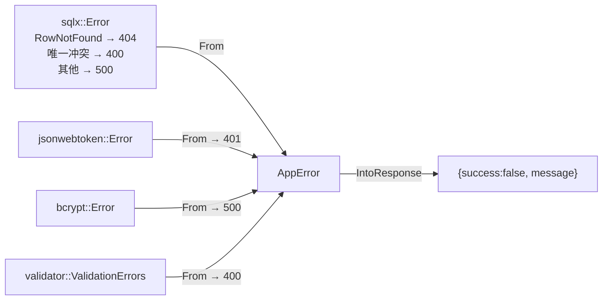

### 3.6.20 common/ledger.rs：台账演示数据

```rust
pub struct LedgerItem {
    pub id: String,
    pub name: String,
    pub category: String,
    pub status: String,
    pub location: String,
    pub updated_at: String,
}

/// 按用户名生成不同的演示数据（fw100/fw150 共用）
pub fn demo_ledger_items(username: &str) -> Vec<LedgerItem> { ... }
```

fw100/fw150 的"设备台账"就是它生成的演示数据——没有数据库表，纯函数生成。**最简模块的真相**。

### 3.6.21 自测题

1. `EventPayload = Arc<str>` 解决了什么性能问题？
2. `event_broadcast!` 生成的通道容量是多少？慢客户端会怎样？
3. `verify_query_token` 为什么校验后还要查一次数据库？
4. `config_singleton!` 与 fj200c_main 的配置实现有何不同？为什么？
5. `stop_in_background` 的意义是什么？
6. JWT 生产模式缺 JWT_SECRET 会怎样？
7. 限流 key 为什么用 `{ip}:{email}`？登录成功后为什么要 clear？
8. 帧提取器校验失败时为什么逐字节丢弃？
9. `User.password_hash` 的两个属性分别解决什么问题？
10. 台账数据存在哪？为什么？

---

## 3.7 auth 登录流程精读（全系统入口）

### 3.7.1 auth 模块结构

```
src/common/auth/
├── mod.rs          # 模块声明
├── routes.rs       # auth_router：POST /login + GET /profile
├── handlers.rs     # login / get_profile 两个 handler
└── services.rs     # AuthService：登录/查用户/建用户/默认设置
```

### 3.7.2 登录的完整时序（含限流与 spawn_blocking）

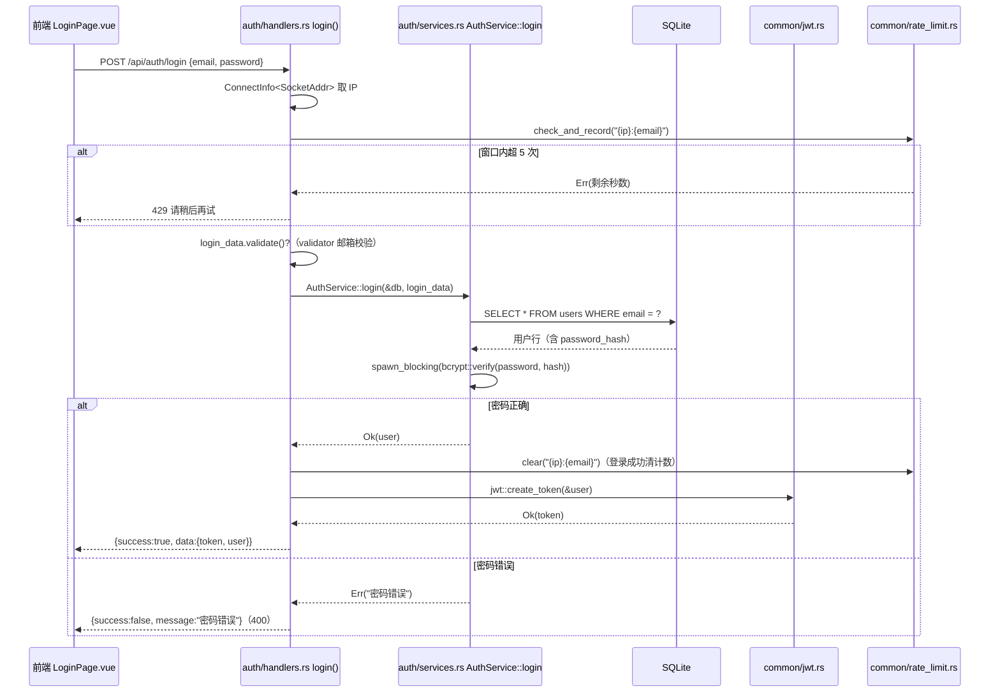

### 3.7.3 handlers.rs 逐行（登录 handler 是"全项目最标准的 handler 模板"）

```rust
#[utoipa::path(
    post,
    tag = "auth",
    path = "/api/auth/login",
    operation_id = "authLogin",
    request_body = LoginRequest,
    responses((status = 200, description = "登录成功", body = ApiResponse<LoginResponse>)),
)]
pub async fn login(
    ConnectInfo(addr): ConnectInfo<SocketAddr>,      // ① 取客户端 IP（限流 key）
    State(db): State<DatabaseConnection>,
    Json(login_data): Json<LoginRequest>,
) -> Result<Json<ApiResponse<LoginResponse>>, AppError> {
    let key = format!("{}:{}", addr.ip(), login_data.email);
    if let Err(wait) = rate_limit::check_and_record(&key) {   // ② 限流检查
        return Err(AppError::too_many_requests(format!("尝试次数过多，请 {} 秒后再试", wait)));
    }
    login_data.validate()?;                                    // ③ 输入校验
    let user = AuthService::login(&db, login_data)             // ④ 服务层
        .await
        .map_err(|e| AppError::bad_request(e.to_string()))?;
    rate_limit::clear(&key);                                   // ⑤ 成功清计数
    let token = jwt::create_token(&user)?;                     // ⑥ 签发 JWT
    Ok(Json(ApiResponse::success(LoginResponse { token, user })))  // ⑦ 统一响应
}
```

**五步模板**（写任何 handler 都照抄这个骨架）：
1. **限流**：登录等敏感端点先查滑动窗口。
2. **校验输入**：`xxx.validate()?`（validator crate）。
3. **调服务**：`Service::xxx(&db, data).await?`（错误转换）。
4. **附加逻辑**：如签发 token / 清限流计数。
5. **统一响应**：`Ok(Json(ApiResponse::success(data)))`。

`get_profile` 是"零参数 handler"的范例——用户信息由中间件注入，handler 只是取出来返回：

```rust
pub async fn get_profile(
    Extension(user): Extension<User>,      // ← 中间件塞进去的
) -> Result<Json<ApiResponse<User>>, AppError> {
    Ok(Json(ApiResponse::success(user)))
}
```

### 3.7.4 services.rs 精读：登录的服务层实现

```rust
pub async fn login(
    pool: &DatabaseConnection,
    login_data: LoginRequest,
) -> Result<User, Box<dyn std::error::Error>> {
    // ① 按邮箱查用户（找不到 → "用户不存在"）
    let user = sqlx::query_as::<_, User>("SELECT * FROM users WHERE email = $1")
        .bind(&login_data.email)
        .fetch_optional(pool)
        .await?
        .ok_or("用户不存在")?;

    // ② 验证密码（bcrypt，CPU 密集 → spawn_blocking）
    let password = login_data.password;
    let expected_hash = user.password_hash.clone();
    let is_valid = tokio::task::spawn_blocking(move || {
        verify(password.as_bytes(), &expected_hash)
    })
    .await??;                 // 两层 ?：外层是 JoinHandle 错误，内层是 verify 错误
    if !is_valid {
        return Err("密码错误".into());
    }
    Ok(user)
}
```

值得学习的点：

1. **`ok_or("用户不存在")?`**：把 `Option` 转成 `Result`，错误信息是字符串，靠 `From<&str> for Box<dyn Error>` 自动转。
2. **`.await??` 双层问号**：`spawn_blocking` 返回 `JoinHandle<Result<bool, bcrypt::Error>>`，第一个 `?` 解 JoinHandle（线程 panic 等），第二个 `?` 解 bcrypt 错误。
3. **bcrypt 为什么必须 spawn_blocking**：bcrypt 故意设计得慢（约 100ms 一次），放 tokio 线程会占住异步 worker，spawn_blocking 把它丢到独立阻塞池，异步线程不被卡。
4. **服务层错误用 `Box<dyn Error>`**，handler 层统一转 `AppError`——服务层不依赖 HTTP 概念，可复用（测试友好）。

### 3.7.5 create_user：管理员建用户

```rust
pub async fn create_user(
    pool: &DatabaseConnection,
    username: &str, email: &str, password: &str, role: &str,
) -> Result<User, Box<dyn std::error::Error>> {
    // ① 查重：邮箱或用户名已存在 → 报错
    let existing_user = sqlx::query_as::<_, User>(
        "SELECT * FROM users WHERE email = $1 OR username = $2",
    ).bind(email).bind(username).fetch_optional(pool).await?;
    if existing_user.is_some() {
        return Err("用户名或邮箱已存在".into());
    }

    // ② bcrypt 加密（spawn_blocking）
    let password_hash = tokio::task::spawn_blocking(move || {
        hash(password_owned.as_bytes(), DEFAULT_COST)
    }).await??;

    // ③ 插入 + RETURNING *（SQLite 3.35+ 支持）
    let user = sqlx::query_as::<_, User>(
        r#"INSERT INTO users (id, username, email, password_hash, role, created_at, updated_at)
           VALUES ($1, $2, $3, $4, $5, $6, $7) RETURNING *"#,
    ).bind(Uuid::new_v4()).bind(username).bind(email)
      .bind(&password_hash).bind(role).bind(now).bind(now)
      .fetch_one(pool).await?;

    // ④ 建默认设置
    Self::create_default_settings(pool, user.id).await?;
    Ok(user)
}
```

注意这里 SQL 用了 `r#"..."#` **原始字符串**——多行 SQL 不需要转义，是 Rust 写长 SQL 的标准姿势。

### 3.7.6 routes.rs：路由与中间件

```rust
pub fn auth_router(db: DatabaseConnection) -> Router {
    Router::new()
        // 登录：公开（不需要任何中间件）
        .route("/login", post(crate::common::auth::handlers::login))
        // 用户信息：需要登录（auth_middleware）
        .route(
            "/profile",
            get(crate::common::auth::handlers::get_profile)
                .route_layer(axum::middleware::from_fn(auth_middleware)),
        )
        .with_state(db)
}
```

**关键区分**：
- `/login` 无中间件——登录前没有 token。
- `/profile` 挂 `auth_middleware`——必须登录。
- `.route_layer()` 只作用于该路由；`.layer()` 作用于所有已注册路由。

### 3.7.7 自测题

1. 登录限流的 key 是什么？为什么登录成功要 clear？
2. bcrypt 为什么要 spawn_blocking？
3. `.await??` 两层问号分别解什么？
4. 用户枚举风险是什么？本项目如何取舍？

---

## 3.8 admin 模块精读（用户管理）

### 3.8.1 模块结构与双层权限中间件

admin 只有模板四件套（无二级目录），路由设计值得细看：**外层 SystemAdmin 总门槛 + 内层读写删权限分组**：

```rust
use crate::common::middleware::{auth_middleware, permission_middleware, role_middleware};

// ★ from_fn 不能传参，所以用闭包包装固定权限的中间件
fn users_read_middleware() -> axum::middleware::FromFn<...> {
    axum::middleware::from_fn(move |request, next| {
        permission_middleware(Permission::UsersRead, request, next)
    })
}

pub fn admin_router(db: DatabaseConnection) -> Router {
    // 外层：role_middleware（SystemAdmin）罩住整棵树
    let protected = Router::new()
        // 读组：GET /api/users（UsersRead）
        .route("/", get(list_users).route_layer(users_read_middleware()))
        // 写组：POST /api/users + PUT /api/users/:id/role（UsersWrite）
        .route("/", post(create_user).route_layer(users_write_middleware()))
        .route("/{id}/role", put(update_user_role).route_layer(users_write_middleware()))
        // 删组：DELETE /api/users/:id（UsersDelete）
        .route("/{id}", delete(delete_user).route_layer(users_delete_middleware()))
        // 系统设置：GET/PUT /settings/pwd-route（SystemAdmin）
        .route("/settings/pwd-route",
            get(get_pwd_route_status).put(set_pwd_route_status)
                .route_layer(role_middleware()))   // SystemAdmin 门槛
        .with_state(db);
    Router::new().nest("/api/users", protected.route_layer(role_middleware()))
}
```

**双层结构**：请求先过外层 `role_middleware`（SystemAdmin），再按路由组过 `users_read/write/delete_middleware`（permission_middleware 包装）。意义：**只有 admin 角色能进这个前缀，admin 内部再按操作细分权限**——将来给非 admin 角色授予 UsersRead 时，外层的 SystemAdmin 仍然拦得住。

**项目独有的中间件包装模式**：`permission_middleware` 需要 `required_permission` 参数，但 `from_fn` 只能接受 `fn(Request, Next)` 形状的函数——所以用**闭包固定参数**再传给 `from_fn`。

权限 → 路由映射表：

| 权限 | 控制的路由 |
|---|---|
| `UsersRead` | GET /api/users |
| `UsersWrite` | POST /api/users、PUT /api/users/{id}/role |
| `UsersDelete` | DELETE /api/users/{id} |
| `SystemAdmin` | 全部 + settings/pwd-route |

> 注意 axum 0.7 的路径参数语法是 `{id}`（0.6 是 `:id`）。**升级/模仿代码时注意版本差异**。

### 3.8.2 handlers.rs 的安全细节

```rust
// ① 创建用户：角色白名单
pub async fn create_user(
    State(db): State<DatabaseConnection>,
    Json(body): Json<CreateUserRequest>,
) -> Result<Json<ApiResponse<User>>, AppError> {
    // 角色必须在注册表中，否则拒绝（防注入任意角色）
    if !is_registered_role(&body.role) {
        return Err(AppError::bad_request(format!("未知角色: {}", body.role)));
    }
    let user = AuthService::create_user(&db, &body.username, &body.email, &body.password, &body.role)
        .await
        .map_err(|e| AppError::bad_request(e.to_string()))?;
    Ok(Json(ApiResponse::success(user)))
}

// ② 修改角色：不能移除自己的管理角色（防锁死）
pub async fn update_user_role(...) -> Result<Json<ApiResponse<User>>, AppError> {
    let current_user: User = request.extensions().get().unwrap().clone();
    if body.role != "admin" && current_user.id == user_id && current_user.role == "admin" {
        return Err(AppError::bad_request("不能移除自己的管理角色".to_string()));
    }
    // ... 更新
}

// ③ 删除用户：不能删自己
pub async fn delete_user(...) -> Result<Json<ApiResponse<()>>, AppError> {
    if current_user.id == user_id {
        return Err(AppError::bad_request("不能删除自己".to_string()));
    }
    // ... 删除
}
```

三个安全细节都是"防止管理员把自己锁在门外"的设计——接盘后**不要去掉**。

### 3.8.3 pwd-route 停用开关

| 前端控件 | 接口 | 后端实现 |
|---|---|---|
| Users.vue「停用初始密码查询」勾选框 | GET/PUT `/api/users/settings/pwd-route` | 读写 `system_settings['pwd_route_disabled']` |
| 影响目标 | GET `/admin/pwd` | 停用 → 403 |

admin 前端 Users.vue（570 行）同时展示用户列表、角色编辑、停用勾选。CreateUser.vue（259 行）负责建用户。

### 3.8.4 页面与接口对照（admin 前端）

| 前端页面 | 接口 | 方法 |
|---|---|---|
| Users.vue 列表 | `GET /api/users` | list_users |
| CreateUser.vue 提交 | `POST /api/users` | create_user |
| Users.vue 编辑角色 | `PUT /api/users/{id}/role` | update_user_role |
| Users.vue 删除 | `DELETE /api/users/{id}` | delete_user |
| Users.vue 停用勾选 | `GET/PUT /api/users/settings/pwd-route` | get/set_pwd_route_status |

### 3.8.5 自测题

1. admin 路由的双层中间件是什么？为什么需要两层？
2. `from_fn` 不能传参，如何给 permission_middleware 固定权限？
3. 三个"防自锁"安全细节是什么？
4. 停用初始密码查询后，GET /admin/pwd 返回什么？

---

## 3.9 fj200c_information 完整精读（最典型硬件模块范本）

### 3.9.1 模块全景与两级目录

```
src/fj200c_information/            # 一级骨架
├── mod.rs         # 模块门面 + pub use 再导出 + event_broadcast!
├── routes.rs      # 子路由（/ws 免中间件）
├── handlers.rs    # 8 个 HTTP 接口 + WS
└── service.rs     # 服务编排（MAX_CONNECTIONS=8）
src/fj200c_information/fj200c_information/   # 二级专有子模块
├── config.rs      # config_singleton! 全局单例（热加载）
├── state.rs       # SERVICE_RUNNING + SharedData（7 字段 + 2 指纹码）
├── decode.rs      # 帧协议：60B 帧、FrameType 8 值、28 字段解码（343 行）
├── session.rs     # run_one_connection 会话线程 + CSV 状态机（461 行）
├── csv_sink.rs    # CsvCommand 通道 + 独立写入线程
├── com.rs         # ComControl 真实串口
├── mock.rs        # MockControl 20Hz 模拟 + STOP_SIGNAL + parse_command_hex
├── frame_bundle.rs# 复合存储（WS 快照用）
└── mock_feeder.rs # 虚拟串口对 feeder 模式
```

这是全项目**最值得精读**的模块：麻雀虽小五脏俱全，串口、模拟器、帧提取、解码、CSV 状态机、命令通道、WS 推送、配置热加载全部具备。

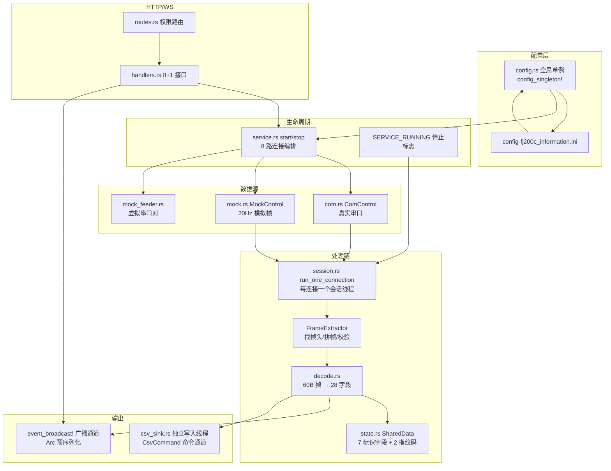

### 3.9.2 帧协议精读（decode.rs，343 行）——注意：60 字节，不是 100！

```rust
// ★ 代码常量是唯一真相：帧长 60 字节（0x3C），帧头 [0xEB, 0x90, 0x3C]
// （文件内注释可能残留"100 字节 / 0xEB 0x90 0x64"的旧协议说明，以常量为准）
pub const FRAME_LEN: usize = 0x3C;                  // 60 字节
pub const HEADER: [u8; 3] = [0xEB, 0x90, 0x3C];

/// 校验函数：前 59 字节累加和 % 256 == 第 60 字节
pub fn frame_validator(frame: &[u8]) -> bool {
    if frame.len() < FRAME_LEN { return false; }
    if frame[0] != HEADER[0] || frame[1] != HEADER[1] || frame[2] != HEADER[2] {
        return false;
    }
    let sum: u16 = frame[..FRAME_LEN - 1].iter().map(|&b| b as u16).sum();
    (sum as u8) == frame[FRAME_LEN - 1]
}
```

**FrameType 8 值**（帧的第 3 字节决定类型，中文拼音缩写是发动机试验领域黑话）：

| 值 | 常量 | 含义 | 动作 |
|---|---|---|---|
| 0xEF | CSSZZL | 参数设置指令 | 解码标识字段 |
| 0xED | CSDQZL | 参数读取指令 | 解码标识字段 |
| 0xDE | SYSJXZZL | 试验进程指令 | 解码标识字段 |
| 0xDC | SYSJSK | 试验数据**首块** | **创建 CSV 文件** |
| 0xBD | SYSJZJK | 试验数据**中间块** | **写一行 CSV** |
| 0xDB | SYSJMK | 试验数据**末块** | **flush + 关闭文件** |
| 0xBF | JBCSQCZL | 基本参数清除指令 | 解码标识字段 |
| 0xBE | SYSJQCZL | 试验数据清除指令 | 解码标识字段 |

**decode 返回 28 字段**，对应 `CSV_HEADERS` 的 28 个中文列头（decode.rs:314）：

```rust
pub const CSV_HEADERS: [&str; 28] = [
    "时间戳", "产品名称", "发动机产品代号", "发动机出厂编号", "发动机检验试车日期",
    "电控器产品代号", "电控器编号", "燃气发生器编号", ... // 共 28 列
];
```

> **改协议时注意**：帧长、帧头、类型值、字段偏移都在 decode.rs——这是硬件对接的第一修改点。

### 3.9.3 事件与通道（mod.rs）

```rust
// event_broadcast! 宏生成：FJ200C_INFORMATION_TX + fj200c_information_tx()
event_broadcast!(FJ200C_INFORMATION_TX, fj200c_information_tx);

// 事件类型：序列化一次进广播通道（Arc<str> 转发）
#[derive(Debug, Clone, Serialize)]
#[serde(tag = "type")]
pub enum Fj200cInformationEvent {
    TableData { connection_index: usize, rows: Vec<TableRow> },  // 28 字段表格行（200ms 节流）
    Frame { connection_index: usize, hex: String, frame_type: String, fields: Vec<String> },  // 帧明细（每帧）
    Payload { connection_index: usize, hex: String },             // 原始字节（节流）
}
```

**三种事件的定位**（前端据此决定渲染什么）：
- `Payload`：原始字节（命令通道面板/调试用）。
- `Frame`：单帧详情（帧类型 + 28 字段 + hex，可视化页用）。
- `TableData`：28 个字段汇总（监控表格用，200ms 节流）。

发送端统一 `ws::serialize(&event)` 转 `EventPayload` 再 `tx.send()`——**预序列化**。

### 3.9.4 会话线程 run_one_connection（session.rs，核心中的核心）

这是整个模块的大脑。**逐段精读**（对应真实文件）：

```rust
const RECV_TIMEOUT_MS: u64 = 200;   // 接收超时 = 轮询周期（200ms 节流）

pub fn run_one_connection(
    connection_index: usize,
    control: Arc<dyn IoControl>,                          // 串口或模拟器（trait 对象）
    tx: broadcast::Sender<EventPayload>,                  // 广播发送端（Arc<str>）
    cfg: &Config,                                         // 配置引用（热加载）
) {
    // ① 读 CSV 配置
    let csv_enabled = cfg.get_or("CSV", "Enabled", "true").eq_ignore_ascii_case("true");
    let csv_dir = cfg.get_or("CSV", "Dir", "csv");

    // ② 设置接收超时（200ms：超时=轮询周期）
    if let Err(e) = control.set_timeout(RECV_TIMEOUT_MS) { ... }

    // ③ 构造帧提取器（注入校验函数 + 解码闭包）
    //    ★ 解码器把结果写入共享 Arc<Mutex<Option<ExtractedFrame>>>，
    //      主循环 try_lock 取走——解码器与主循环解耦
    let result: Arc<Mutex<Option<ExtractedFrame>>> = Arc::new(Mutex::new(None));
    let decoder = make_decoder(Arc::clone(&result));
    let mut extractor = FrameExtractor::new(HEADER.to_vec(), FRAME_LEN,
        Box::new(frame_validator), Box::new(decoder));

    // ④ 主循环
    loop {
        // 停止检查（Relaxed 序：单标志轮询足够）
        if STOP_SIGNAL.load(Ordering::Relaxed) { break; }

        // ⑤ 命令通道：非阻塞取命令并发送
        if let Ok(cmd) = COMMAND_TX.get().and_then(|tx| tx.lock().unwrap().as_ref())
            .and_then(|sender| sender.try_recv().ok()) {
            control.send(&cmd)?;   // 写进串口/模拟器
        }

        // ⑥ 阻塞读（串口 200ms 超时轮询）
        match control.recv() {
            Ok(chunk) if !chunk.is_empty() => {
                // 节流推送 payload 事件（200ms 最多一次）
                // 送入帧提取器
                extractor.feed(&chunk);
                // 非阻塞取解码结果 → handle_frame
                if let Ok(mut guard) = result.try_lock() {
                    if let Some(extracted) = guard.take() {
                        handle_frame(connection_index, extracted, &tx, ...);
                    }
                }
            }
            Ok(_) => {}                      // 空数据（超时无数据）继续
            Err(e) => {
                if is_timeout(&e) { continue; }   // 超时是常态，继续轮询
                break;                             // 真实错误（设备拔出）退出
            }
        }
    }
    // 退出前 flush CSV
    if let Some(sink) = &csv { let _ = sink.flush(); }
}
```

**设计精华提炼**（面试/答辩都能用）：

1. **非阻塞命令通道**：命令（前端发送的 hex 指令）通过 `mpsc` 通道 `try_recv` 拉取——数据流优先级高于命令流，命令不会插队阻塞收帧。
2. **try_lock 解耦解码**：解码闭包在 extractor 内部被调用（同一线程），写完 `Some(frame)` 后主循环 `try_lock` 取走——不成功就下一轮再取，绝不阻塞。
3. **超时=心跳**：`RECV_TIMEOUT_MS = 200`，串口 read 超时返回空数据 → 继续循环 → 相当于 5Hz 的"循环心跳"，让停止标志能在 200ms 内被响应。
4. **`Ok(_) => {}` 空分支**：超时无数据时静默继续——**不要**在这里记日志，否则每秒刷 5 条废话。
5. **200ms 节流**：payload / TableData 事件都节流，20Hz 数据源压到 5Hz 推送。

### 3.9.5 handle_frame：帧处理与 CSV 状态机

```rust
fn handle_frame(...) {
    // 帧类型 → 中文名（match 映射）
    let frame_type = match &extracted.frame_type {
        FrameType::CSSZZL => "参数设置",
        FrameType::SYSJSK => "试验数据首块",
        ...
    };

    // CSV 状态机（经 csv_sink 通道驱动）
    match extracted.frame_type {
        FrameType::SYSJSK => {           // 首块：创建文件
            let filename = format!("fj200c_information_{}.csv",
                chrono::Local::now().format("%Y%m%d_%H%M%S"));
            csv_sink.begin(&filename, &CSV_HEADERS)?;
        }
        FrameType::SYSJZJK => {          // 中间块：写行
            let fields = decode(...);    // 28 字段
            csv_sink.write_row(&fields)?;
        }
        FrameType::SYSJMK => {           // 末块：flush + 关闭
            csv_sink.end();
        }
        _ => decode_shared_data(&extracted.data),   // 其他帧：解码标识字段
    }

    // ① 更新全局复合存储（WS 快照用）
    frame_bundle().update(fields, &extracted.data);

    // ② 推送 Frame 事件（每帧都发，可视化用）
    tx.send(ws::serialize(&Fj200cInformationEvent::Frame { ... }));

    // ③ 推送 TableData 事件（200ms 节流，防 UI 卡顿）
    if last_table_emit.elapsed() >= TABLE_EMIT_INTERVAL {
        tx.send(ws::serialize(&Fj200cInformationEvent::TableData { rows: shared_data_rows() }));
    }
}
```

**CSV 状态机**（硬件协议驱动）：

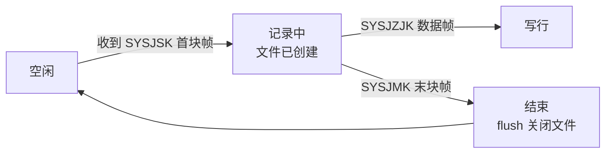

**节流**是新手容易忽略的设计：20Hz 模拟帧如果每帧都推 TableData，前端表格 50ms 刷新一次必然卡顿。200ms 节流把刷新频率压到 5Hz——体验流畅度与数据实时性的平衡。

### 3.9.6 csv_sink.rs：CSV 写入线程（公共 CsvWriter 的队列化）

```rust
// 命令枚举：会话线程只发命令，写盘在独立线程完成（避免阻塞采集循环）
enum CsvCommand {
    Begin { filename: String, headers: Vec<String> },
    Row(Vec<String>),          // 28 字段一行
    End,                       // flush + 关闭当前文件
    Shutdown,                  // 线程退出
}

pub struct CsvSink { tx: Sender<CsvCommand> }

impl CsvSink {
    pub fn new(connection_index: usize, dir: &str) -> Self {
        // 每连接一个写入线程：csv-writer-{i}
        let (tx, rx) = mpsc::channel(256);
        std::thread::spawn(move || writer_loop(connection_index, dir, rx));
        Self { tx }
    }
    pub fn begin(&self, filename: &str, headers: &[&str]) { self.tx.send(CsvCommand::Begin {...}) }
    pub fn write_row(&self, fields: &[String]) { self.tx.send(CsvCommand::Row(fields)) }
    pub fn end(&self) { self.tx.send(CsvCommand::End) }
    pub fn shutdown(self) { self.tx.send(CsvCommand::Shutdown) }
}

fn writer_loop(connection_index: usize, dir: &str, rx: Receiver<CsvCommand>) {
    let mut csv: Option<CsvWriter> = None;   // crate::common::csv_writer::CsvWriter
    while let Ok(cmd) = rx.recv() {
        match cmd {
            CsvCommand::Begin { filename, headers } => {
                csv = CsvWriter::create(dir, &filename, &headers).ok();
            }
            CsvCommand::Row(fields) => { if let Some(w) = &csv { let _ = w.write_row(&fields); } }
            CsvCommand::End => { csv = None; }        // drop 触发 flush（Drop 实现）
            CsvCommand::Shutdown => break,
        }
    }
}
```

**队列化写盘的收益**：采集循环不碰文件 IO——写盘慢不会拖慢收帧；`End` 置 `None` 触发 `Drop` 自动 flush（RAII 兜底）。

### 3.9.7 state.rs：SharedData（7 启用字段 + 2 指纹码）

```rust
// 16 个候选字段中只有 9 个实际启用：
// 7 个标识字段 + 2 个指纹码，其余注释掉（协议只填这些）
pub struct SharedData {
    field_product_name: RwLock<String>,              // 产品名称
    field_engine_product_code: RwLock<String>,       // 发动机产品代号
    field_engine_factory_number: RwLock<String>,     // 发动机出厂编号
    field_engine_test_date: RwLock<String>,          // 发动机检验试车日期
    field_ecu_product_code: RwLock<String>,          // 电控器产品代号
    field_ecu_number: RwLock<String>,                // 电控器编号
    field_gas_generator_number: RwLock<String>,      // 燃气发生器编号
    // + 2 个指纹码字段
    // 其余 RwLock<String> 字段注释掉
}
```

`decode_shared_data` 从帧的**固定字节偏移**切字段（`frame[4..12]` 起），`utils::little_endian_bytes_to_ascii` 转文本。**改协议时改这里的偏移量**。

### 3.9.8 service.rs：服务编排（171 行）

```rust
/// 最大支持的连接数（Connection0 ~ Connection7）
const MAX_CONNECTIONS: usize = 8;

/// 启动服务：加载配置，为每个启用的连接启动会话线程
pub fn start_service(tx: broadcast::Sender<EventPayload>) -> Result<(), String> {
    if SERVICE_RUNNING.load(Ordering::Relaxed) {
        return Err("服务已在运行中".to_string());        // 幂等防重入
    }
    let cfg = Config::load(state::CONFIG_PATH)
        .map_err(|e| format!("加载配置文件失败: {}", e))?;
    let _ = config::set_global(cfg.clone());              // 更新全局单例（热加载关键）

    // 确保上一次停止流程已完成，避免与重启竞态
    RUNTIME.wait_stopping(Duration::from_secs(3));

    init_command_channel();
    STOP_SIGNAL.store(false, Ordering::Relaxed);
    RUNTIME.set_stopping(false);

    let mock_enabled = cfg.get_or("Mock", "InProcess", "true")
        .eq_ignore_ascii_case("true");
    let mut started = 0usize;

    for i in 0..MAX_CONNECTIONS {
        let section = format!("Connection{}", i);
        let enabled = cfg.get_or(&section, "Enabled", "false")
            .eq_ignore_ascii_case("true");
        if !enabled { continue; }                          // 未启用跳过

        let tx_clone = tx.clone();
        // 读串口参数：ComPort / BaudRate / DataBits / StopBits / Parity / FlowControl
        let handle = thread::spawn(move || {
            if mock_enabled {
                // 进程内模拟数据源
                let control: Arc<dyn IoControl> = Arc::new(MockControl::new());
                run_one_connection(i, control, tx_clone, &cfg_clone);
            } else {
                match ComControl::new(&port_name, baud_rate, ..., &section) {
                    Ok(com) => {
                        // 真实串口；FeederMode 开启时再挂虚拟串口对
                        if feeder_enabled { start_mock_feeder(Arc::clone(&control)); }
                        run_one_connection(i, control, tx_clone, &cfg_clone);
                    }
                    Err(e) => { error!("连接 {}: 打开串口 {} 失败: {}", i, port_name, e); }
                }
            }
        });
        RUNTIME.push(handle);
        started += 1;
    }

    if started == 0 {
        STOP_SIGNAL.store(true, Ordering::Relaxed);
        return Err("没有启用的连接（请检查 config-fj200c_information.ini 的 ConnectionN.Enabled）".to_string());
    }
    SERVICE_RUNNING.store(true, Ordering::Relaxed);
    Ok(())
}

/// 停止服务：stop_in_background（置标志 + 独立线程 join，不阻塞 HTTP）
pub fn stop_service() {
    if !SERVICE_RUNNING.load(Ordering::Relaxed) { return; }
    crate::common::service::stop_in_background(
        &RUNTIME, &SERVICE_RUNNING,
        || STOP_SIGNAL.store(true, Ordering::Relaxed),
        "发动机监控服务已停止",
    );
}
```

**关键设计**：
- **先停后启**：`wait_stopping(3)` 防止"旧线程没死就开新线程"的竞态。
- **`Arc<dyn IoControl>`**：模拟/串口都塞进同一容器，会话线程零感知。
- **8 路连接**：INI 里 `[Connection0]~[Connection7]` 各配一路（Enabled 控制开关）。
- **`send_command` 校验**：`parse_command_hex` 解析失败报"无效的十六进制命令"，空命令拒绝；命令走 `COMMAND_TX` 通道（mpsc），会话线程 try_recv。

### 3.9.9 config.rs：热加载配置

```rust
// config_singleton!(GLOBAL, global, set_global) 生成的只读单例
pub fn global() -> &'static Config { ... }
pub fn set_global(cfg: Config) { ... }
```

**热加载的真相**：`start_service` 启动时 `Config::load(...)` 读文件 → `set_global` 更新全局单例 → 会话线程持有的 `&Config` 引用每次 `get_or(...)` 都查最新值。所以：**前端保存配置（PUT /config）→ handler 调 `save_config`（写文件）→ 服务下次 start 或线程下一轮循环读到新值**。这是 AGENTS.md 说的"修改立即生效"——与 fj200c_main/ftj1c 的"需重启"形成对比。

### 3.9.10 mock.rs：模拟数据源

```rust
pub struct MockControl { /* 模拟状态 */ }

impl IoControl for MockControl {
    fn recv(&self) -> Result<Vec<u8>, String> {
        // 20Hz：每 50ms 一帧
        std::thread::sleep(Duration::from_millis(50));
        Ok(generate_frame())   // 正弦 + 噪声模拟帧
    }
    fn send(&self, _data: &[u8]) -> Result<(), String> { Ok(()) }   // 模拟器不回数据
    fn set_timeout(&self, _ms: u32) -> Result<(), String> { Ok(()) }
}

// MOCK_FRAME_TYPES：8 个帧类型轮流生成（含 SYSJSK/SYSJZJK/SYSJMK 三帧驱动 CSV 状态机）
pub const MOCK_FRAME_TYPES: [u8; 8] = [0xEF, 0xED, 0xDE, 0xDC, 0xBD, 0xDB, 0xBF, 0xBE];

/// hex 命令解析："EB 90 3C ..." / "EB903C..." 都接受
pub fn parse_command_hex(hex: &str) -> Option<Vec<u8>> { ... }
```

**20Hz 正弦+噪声**：`generate_frame()` 用 rand 生成带随机抖动的数据帧，让前端曲线看起来像真实传感器——无硬件演示的关键。`[Mock] InProcess = true` 开箱即用（默认）。

### 3.9.11 routes.rs 与 handlers.rs

```rust
// routes.rs：/ws 免中间件（handler 内部 ?token= 鉴权），其余全部挂 Fj200cInformationMonitor
pub fn fj200c_information_router(db: DatabaseConnection) -> Router {
    let protected = Router::new()
        .route("/service/start", post(handlers::start_service))
        .route("/service/stop", post(handlers::stop_service))
        .route("/service/status", get(handlers::get_service_status))
        .route("/service/command", post(handlers::send_command))
        .route("/config", get(handlers::get_config).put(handlers::save_config))
        .route("/csv/files", get(handlers::list_csv_files))
        .route("/csv/{name}", get(handlers::get_csv_file))
        .route_layer(permission_middleware(Permission::Fj200cInformationMonitor));
    Router::new()
        .merge(protected)
        .route("/ws", get(handlers::ws_handler))     // 免中间件
        .with_state(db)
}
```

| 接口 | 方法 | 路径 | 功能 |
|---|---|---|---|
| start_service | POST | `/service/start` | 启动服务 |
| stop_service | POST | `/service/stop` | 停止服务 |
| get_service_status | GET | `/service/status` | 查运行状态 |
| send_command | POST | `/service/command` | 发 hex 命令（格式校验） |
| get_config | GET | `/config` | 读 INI 内容 |
| save_config | PUT | `/config` | 保存 INI（热加载） |
| list_csv_files | GET | `/csv/files` | CSV 文件列表 |
| get_csv_file | GET | `/csv/{name}` | 读 CSV 内容（防穿越） |
| ws_handler | GET | `/ws` | WebSocket（?token= 鉴权） |

**CSV 防目录穿越**（安全重点）：

```rust
pub async fn get_csv_file(
    Path(name): Path<String>,
    State(db): State<DatabaseConnection>,
) -> Result<Json<ApiResponse<CsvFileContent>>, AppError> {
    // ① 解码百分号编码（前端 encodeURIComponent 过）
    let Ok(name) = url::percent_decode_str(&name).decode_utf8() else {
        return Err(AppError::bad_request("文件名编码无效".into()));
    };
    // ② 只取最后一个 '/' 后的部分（丢掉路径部分）
    let Some(file_name) = name.rsplit('/').next() else {
        return Err(AppError::bad_request("文件名不合法".into()));
    };
    // ③ 拼接时用 join 而非拼接字符串，保证不会逃出 csv 目录
    let path = Path::new(csv_dir()).join(file_name);
    // ④ 确认文件存在于 csv 目录下（双重保险）
    if !path.starts_with(csv_dir()) { ... 400 ... }
    // ⑤ 读文件返回
}
```

### 3.9.12 自测题

1. 帧长、帧头、校验和的准确值？（60B / EB 90 3C / 前 59 字节累加 % 256）
2. FrameType 8 值的三个 CSV 关键帧是哪三个？各自做什么？
3. decode 返回多少字段？CSV_HEADERS 多少列？
4. 200ms 节流解决什么问题？
5. csv_sink 为什么用命令通道而不是直接写文件？
6. 热加载如何实现？与 fj200c_main 的"需重启"区别在哪？
7. /ws 为什么免中间件？
8. 防目录穿越的四步是什么？

---

## 3.10 fj200c_main 精读（最复杂模块：五路串口 + 报表）

### 3.10.1 模块全景与两级目录

```
src/fj200c_main/                     # 一级骨架
├── mod.rs / routes.rs / handlers.rs / service.rs
└── help_doc.md                      # 非 rs 文件留一级（include_str! 相对引用）
src/fj200c_main/fj200c_main/         # 二级专有子模块
├── abstract_com.rs  # ComSpec 协议规格表 + AbstractCom 统一会话
├── com.rs           # SharedPortData + init_all_from_config + 处理线程（592 行）
├── config.rs        # Config（OnceLock<RwLock<Option<Config>>>，可热替换）
├── decode.rs        # 各协议解码 + 64 列 CSV
├── mock.rs          # MockProfile 枚举（按 INI 节启发式映射设备类型）
├── report.rs        # 报表生成（表头映射 + 3 张报表 + 文件改名）
├── state.rs         # THEME_IS_DARK / SIMULATION_MODE / CSV_RECORDING / ECU_SEND_DATA
└── types.rs         # EcuFields / Adam4015Fields / Adam4117Fields / DynoFields / FluxFields
                     # ChannelData 5 变体 + ExperimentInfo + ReportOutput + 64 列表头
```

**注意**：`config.rs` 与 `state.rs` 都在二级目录（一级只有骨架四件套 + help_doc.md）；help_doc.md 的 `include_str!` 相对引用决定了它不能移动。

### 3.10.2 五路串口总览（重要更新：3 路 → 5 路）

`config-fj200c_main.ini` 的 `[COM] Count = 5`：

| index | Section | 设备 | 帧格式 |
|---|---|---|---|
| 0 | COM0 | ECU 电控器 | 42 字节二进制，帧头 `EB 90 2A` |
| 1 | COM1 | Adam4015 环境采集 | ASCII：`>` 起始 + 8 通道数值 |
| 2 | COM2 | Adam4117 环境采集 | ASCII：`>` 起始 + 8 通道数值 |
| 3 | COM3 | Dyno 测功机 | Dyno 二进制帧（`FF FF` 头） |
| 4 | COM4 | Flux 燃油流量 | `FF FF` 头 + u16 流量 |

| 维度 | fj200c_information | fj200c_main |
|---|---|---|
| 串口数量 | 最多 8 路（同协议） | 5 路（**五种不同设备**） |
| 协议 | 单一 60B 帧 | ECU / ADAM(×2) / DYNO / FLUX 四种协议 |
| 配置生效 | 热加载（立即生效） | **修改后需重启服务** |
| CSV | 协议帧驱动（SYSJSK 自动开始） | **前端按钮手动开关**（recording/toggle） |
| 报表 | 无 | report.rs 状态点插值生成报表 |
| 主题 | 无 | 服务端同步主题（深色/浅色，WS 广播） |
| CSV 列数 | 28 | **64 列**（all_csv_entries） |

### 3.10.3 abstract_com.rs：ComSpec 协议规格表（策略模式）

```rust
// ComSpec：协议规格描述——帧头/帧长/校验/解码全部抽象成数据
pub struct ComSpec {
    pub name: &'static str,          // "ECU" / "Adam4015" / "Adam4117" / "Dyno" / "Flux"
    pub header: Vec<u8>,             // 帧头
    pub frame_len: usize,            // 帧长（不含/含头按协议）
    pub offset: usize,               // 数据偏移
    pub validator: Option<fn(&[u8]) -> bool>,   // 校验函数
    pub decoder: Option<fn(&[u8]) -> Option<Vec<String>>>,  // 解码函数
}

impl ComSpec {
    pub fn ecu() -> Self {
        Self { name: "ECU", header: vec![0xEB, 0x90, 0x2A], frame_len: 38,
               offset: 1, ... }      // 偏移 1：头后即数据
    }
    pub fn adam4015() -> Self { Self { name: "Adam4015", header: vec![b'>'], frame_len: 57, ... } }
    pub fn adam4117() -> Self { Self { name: "Adam4117", header: vec![b'>'], frame_len: 57, ... } }
    pub fn dyno() -> Self { Self { name: "Dyno", header: vec![0xFF, 0xFF], frame_len: 14, offset: 2, ... } }
    pub fn flux() -> Self { Self { name: "Flux", header: vec![0xFF, 0xFF], frame_len: 14, offset: 2, ... } }
}

// AbstractCom：协议无关的串口会话（组合 IoControl + ComSpec）
pub struct AbstractCom {
    spec: ComSpec,
    control: Arc<dyn IoControl>,
    // ... 停止标志、事件通道
}
```

**设计模式：策略模式**。协议差异（帧头/校验/解码）被抽象成 `ComSpec` 规格，串口会话逻辑（读写循环）只依赖规格——新增第六种设备只需加一个 `ComSpec::xxx()`。注意 Adam4015 与 Adam4117 都是 `>` 开头 ASCII（57 字节帧），Dyno 与 Flux 帧头相同（`FF FF`）但**解码不同**（Flux 是 u16 流量）——靠名字区分。

### 3.10.4 types.rs：数据模型

```rust
// ECU 字段：含 27 个布尔位故障码标志
pub struct EcuFields {
    pub ng_speed: f64,                 // 转速
    pub exhaust_temp: f64,             // 排气温度
    pub fault_code_flags: FaultCodeFlags,   // 27 个布尔位（第 i 位 = 第 i 号故障）
    // ...
}

pub struct FaultCodeFlags {
    pub bit_0: bool,  // 故障 0
    // ... 共 27 位
}

// Adam 系列：8 通道模拟量
pub struct Adam4015Fields { pub channels: [f64; 8] }
pub struct Adam4117Fields { pub channels: [f64; 8] }

// Dyno 测功机：扭矩转速 / 扭矩 / 扭矩功率
pub struct DynoFields { pub njzs: f64, pub nj: f64, pub njgl: f64 }

// Flux 燃油流量
pub struct FluxFields { pub ll: f64 }

// 统一通道数据：5 变体枚举（WS 事件与前端分发的核心）
pub enum ChannelData {
    Ecu(EcuFields),
    Adam4015(Adam4015Fields),
    Adam4117(Adam4117Fields),
    Dyno(DynoFields),
    Flux(FluxFields),
}

pub struct ExperimentInfo { ... }     // 试验信息（前台输入）
pub struct ReportOutput { ... }       // 报表输出

// 64 列 CSV 表头：ECU + Adam4015 + Adam4117 + Dyno + Flux 全部字段拼接
pub fn all_csv_entries() -> Vec<String> { ... }
```

### 3.10.5 com.rs：SharedPortData 与初始化（592 行）

```rust
// 共享端口数据：5 路各自的最近一帧 + 5 路各自的字段快照
pub struct SharedPortData {
    pub latest_frames: Vec<LatestFrame<...>>,   // 5 × LatestFrame
    pub fields: Vec<ArcSwap<ChannelData>>,      // 5 × ArcSwap<Fields>（无锁读）
}

// 按配置打开 5 路串口/模拟（Count=5）
pub fn init_all_from_config(shared: Arc<SharedPortData>, tx: broadcast::Sender<EventPayload>) -> Vec<...> {
    let count: usize = cfg.get_or("COM", "Count", "0").parse().unwrap_or(0);
    for i in 0..count { ... }
}

// CSV 处理线程（前端录制开关驱动，100ms 周期）
pub fn start_processing_thread(shared: Arc<SharedPortData>, tx: broadcast::Sender<EventPayload>) -> ... { ... }
```

**ECU 发送线程**（重要修复点）：仅当串口打开成功时才启动；每 100ms 重发 `ECU_SEND_DATA` 帧（含递增计数器 + 校验和），帧形如 `EB 90 10` + frame[3] 序号 + frame[15] 校验和。

### 3.10.6 mock.rs：MockProfile 启发式映射

```rust
// 模拟配置节名 → 设备类型的启发式映射
pub enum MockProfile { Ecu, Adam4015, Adam4117, Dyno, Flux }

impl MockProfile {
    pub fn from_section(section: &str) -> Self {
        // MOCK_COM0 → Ecu
        // MOCK_COM1 → Adam4015
        // MOCK_COM2 → Adam4117   ← 按节名启发式
        // MOCK_COM3 → Dyno
        // MOCK_COM4 → Flux
        match section {
            "MOCK_COM0" => Self::Ecu,
            "MOCK_COM1" => Self::Adam4015,
            "MOCK_COM2" => Self::Adam4117,
            "MOCK_COM3" => Self::Dyno,
            "MOCK_COM4" => Self::Flux,
            _ => Self::Ecu,         // 缺省回落
        }
    }
}
```

`[MOCK] SimulationMenu = true` 模拟运行，模拟 senders 与真实串口共用同一套 `AbstractCom` 会话。

### 3.10.7 state.rs：服务端状态

```rust
pub static CSV_RECORDING: AtomicU8 = AtomicU8::new(0);       // 录制开关（0/1）
pub static THEME_IS_DARK: AtomicU8 = AtomicU8::new(1);       // ★ 默认深色主题
pub static SIMULATION_MODE: AtomicBool = AtomicBool::new(false);  // 模拟运行标志
pub static ECU_SEND_COUNTER: AtomicU8 = AtomicU8::new(0);   // ECU 发送序号
// ★ ECU 查询指令：OnceLock<ArcSwap<String>>，可热替换（前端可改），默认查询帧
pub static ECU_SEND_DATA: OnceLock<ArcSwap<String>> = OnceLock::new();
// 默认值："EB901000000000000000000000000000"（EB 90 10 + 30 个 0）
pub fn ecu_send_data() -> &'static ArcSwap<String> {
    ECU_SEND_DATA.get_or_init(|| ArcSwap::from_pointee("EB901000000000000000000000000000".into()))
}
```

**主题为什么放服务端**：任何页面打开时 WS 快照 + HTTP 接口都能拿到一致状态——"主题切到深色，刷新页面还是深色"（`theme/set` 接口 + WS `ThemeState` 广播）。前端用 `useTheme`（localStorage.theme + theme-changed 事件）联动。

### 3.10.8 report.rs：报表生成（表头映射 + 3 张报表）

```rust
// 表头映射：CSV 列名 → 报表语义（推力/燃油流量等）
//   "扭矩" → 推力        （Dyno 扭矩列在报表里当推力用）
//   "燃油流量" → 燃油流量 （Flux 列直接映射）
// 其余列按原名透传

// 三张报表表（不再全为 0）：
//   基本信息表（试验信息）+ 性能数据表 + 标准数据表 + 设计点数据表
//   → 实际是 4 张（基本信息/性能/标准/设计点），前端 GenerateReport.vue 展示

// 从试验 CSV 中提取状态点性能数据（状态点由 INI [REPORT] StatePoints 配置）
pub fn process_report_csv(csv_path: &str, state_points: &[u32]) -> Result<ReportOutput, String> { ... }

// 文件改名：PathCSV 缺省回落 csv 目录，不 panic
pub fn rename_file_name(...) -> String { ... }
```

`[REPORT] StatePoints`：24 个状态点，30000→53000 步进 1000（`30000,31000,...,53000`）。报表流程（前端 GenerateReport.vue 622 行驱动）：选择 CSV + 状态点（逗号分隔 RPM）→ POST `/api/fj200c_main/report` → 后端插值生成 4 张表 → 前端水印 ©7304厂 + `window.print()`（打印时隐藏导航栏）。

### 3.10.9 已知修复清单（接手前先读，避免踩重复坑）

| 修复 | 说明 |
|---|---|
| 停止服务复位模拟并广播 | stop 时把 SIMULATION_MODE 复位 false 并广播 `SimulationState`，前端按钮状态不残留 |
| 录制前校验服务运行状态 | `recording/toggle` 在服务未运行时拒绝（返回错误） |
| send_command hex 格式与长度校验 | 非法 hex / 长度不匹配拒绝，不再静默吞掉 |
| decode 每帧 error! 降级 | 解码失败的日志从 error! 降为 trace!/debug!（高频数据不刷屏） |
| ECU 发送线程仅串口打开时启动 | 串口打开失败不再泄漏空跑线程 |

### 3.10.10 接口一览（13 个 path）

| 接口 | 方法 | 路径 | 功能 |
|---|---|---|---|
| start/stop/status | POST/POST/GET | /service/* | 服务启停与状态 |
| send_command | POST | /service/command | ECU 指令发送 |
| config | GET/PUT | /config | 读/存 INI（需重启生效） |
| csv | GET | /csv/files、/csv/{name} | CSV 列表与内容 |
| recording/toggle | POST | /recording/toggle | 录制开关 |
| simulation/toggle | POST | /simulation/toggle | 模拟开关（停止状态切换） |
| theme/set | POST | /theme/set | 深色/浅色主题 |
| experiment | GET/PUT | /experiment | 试验信息 |
| report | POST | /report | 报表生成 |
| help | GET | /help | 帮助文档 |
| ws | GET | /ws | WebSocket（?token=） |

全部挂 `Fj200cMainMonitor` 权限（/ws 免中间件）。

### 3.10.11 前端环境参数映射（读 types 时对照）

envParams 8 项映射（commit f4f950a，前端 dashboard.ts）：大气温度℃=Adam4117 ch0、大气湿度%=Adam4117 ch1、大气压力KPa=Adam4117 ch2、进口温度℃=Adam4015 ch3、燃油流量L/h=Flux ll、扭矩转速r/min=Dyno njzs、扭矩N·m=Dyno nj、扭矩功率kW=Dyno njgl。

### 3.10.12 自测题

1. 五路串口各是什么设备？帧头分别是什么？
2. 为什么 Adam4015 与 Adam4117 协议相同却分两路？（采集点不同）
3. ComSpec 策略模式好在哪？
4. 64 列 CSV 表头从哪来？
5. THEME_IS_DARK 默认值是多少？为什么主题要放服务端？
6. 三个"已知修复"你能复述哪几个？
7. 报表的"推力"列实际来自哪个 CSV 列？（表头映射）
8. 修改 config-fj200c_main.ini 后要做什么才能生效？

---

## 3.11 ftj1c 精读（UDP 组播 + 主备切换）

### 3.11.1 模块结构（两级）

```
src/ftj1c/                     # 一级骨架
├── mod.rs / routes.rs / handlers.rs / service.rs
└── help_doc.md                # include_str! 相对引用（帮助文档正文）
src/ftj1c/ftj1c/               # 二级专有子模块
├── config.rs     # 配置单例（config-ftj1c.ini，需重启生效）
├── models.rs     # IpConfig（32 个可选键：16 路 × 收发）
├── state.rs      # 停止信号 + QuadFrame 单例
├── udp.rs        # UdpControl：Mock/Real 双模式 + 组播
├── process.rs    # start_all：各链路运行函数（936 行，模块最重）
├── quad_frame.rs # QuadFrame<95> 别名（主备切换）
└── com.rs        # 坐标转换 + 协议构建器（735 行）
```

### 3.11.2 95 字节帧协议

```
| EB 90 5B | SLOT 01~04 | SEQ LE u32 | 85B 载荷 | CHECKSUM LE u16 |
|  3 字节头  |  槽位字节   |  小端序号   |  载荷    |  小端校验和    |
```

- 帧头 `EB 90 5B`（与 fj200c_information 的 `EB 90 3C`、fj200c_main ECU 的 `EB 90 2A` 一脉相承——同一家族协议，类型字节不同）；
- SLOT 01~04：槽位号（主备 × 通道）；
- SEQ：小端 u32 序号（CAS 去重的依据）；
- CHECKSUM：小端 u16（后 2 字节）。

config-ftj1c.ini 的帧定义节：`[ComFTJ1CTrajectory]`（33 字节）、`[ComFTJ1CTelemetering]`（65 字节）、`[ComFTJ1CEquipment]`（91 字节），以及 `[YCZ]/[ZJZ]/[LJZ]/[YDZ]/[Load]/[Telemetering]` 各帧定义节。

### 3.11.3 帮助模块（新增端点）

```rust
// handlers.rs:226-233
#[utoipa::path(
    get,
    path = "/api/ftj1c/help",
    operation_id = "ftj1cGetHelp",
    tag = "ftj1c",
    responses((status = 200, description = "帮助文档", body = ApiResponse<ConfigContent>)),
)]
pub async fn get_help_handler() -> Json<ApiResponse<ConfigContent>> {
    const HELP_TEXT: &str = include_str!("help_doc.md");   // 一级目录文件，相对引用
    Json(ApiResponse::success(ConfigContent { content: HELP_TEXT.to_string() }))
}
```

- `GET /api/ftj1c/help` 是**唯一需要 `Ftj1cHelp` 权限**的端点（其余全是 `Ftj1cMonitor`）；
- help_doc.md 必须留在一级目录——`include_str!` 相对 handlers.rs 所在目录解析；
- 前端 views/Help.vue（183 行）用 MarkdownIt 渲染。

### 3.11.4 主备切换架构（本项目最复杂的并发设计）

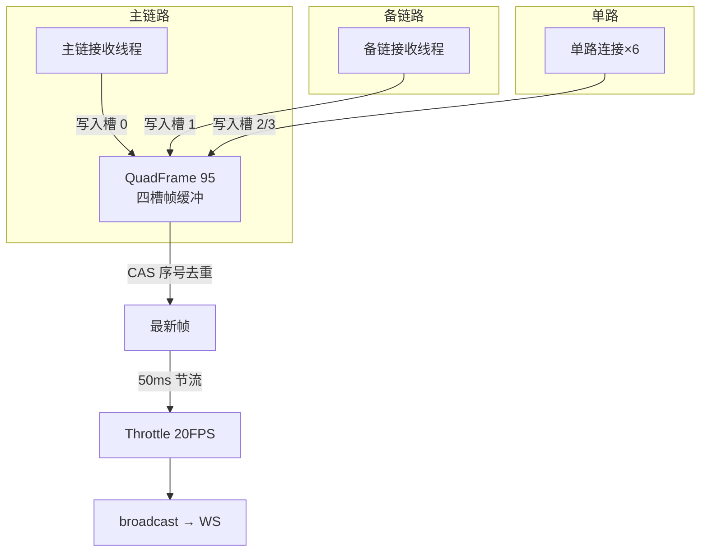

**主备切换逻辑**（quad_frame.rs）：主源写入时更新心跳；备源在主心跳超时 1000ms 后接管；主源恢复自动切回。前端卡片上"主/备"标签随切换变化——模拟模式下 IP11（主链）每 5~10 秒故意暂停一次，专门用来验证切换。

**线程结构**（process.rs，936 行）：2 个接收线程（主/备组播）+ 6 个单发线程 + 3 个串行线程，各自按 `[IP]` 配置的 16 路地址工作。IP0 主 / IP1 备 / IP2..IP15 扩展（239.0.0.1..239.0.0.16），Port=5000，TimeoutMs=100。

### 3.11.5 模拟模式的设计（process.rs 顶部注释就是说明书）

```rust
//! `config-ftj1c.ini` 的 `[Udp] Mock = true`（默认）时使用进程内数据源，无需硬件：
//! 按 200ms 周期向各链路生成 `EB 90 5B` 帧；IP11（主链）在 5~10 秒窗口暂停，
//! 可验证主备切换。`Mock = false` 时使用真实 UDP 套接字（组播收发）。
```

- **Mock = true**：进程内生成帧，200ms 周期，主链 5~10 秒窗口暂停（模拟断流）。
- **Mock = false**：`UdpControl::Real` 模式——组播 socket + **SO_REUSEADDR**（多实例可共绑同一端口）+ **1MB 接收缓冲** + 断线重连。

### 3.11.6 models.rs：IpConfig（32 个可选键）

```rust
// 16 路 × 收发 = 32 个可选键（Option 字段，未配置的路自动跳过）
#[derive(Debug, Clone, Default, Serialize, Deserialize, ToSchema)]
pub struct IpConfig {
    pub ip0_send: Option<String>,  pub ip0_recv: Option<String>,
    pub ip1_send: Option<String>,  pub ip1_recv: Option<String>,
    // ... 共 32 个
}
```

前端 Monitor.vue（559 行，4×4 卡片网格 8 连接 × raw/extracted）的 IP 配置对话框读写它。

### 3.11.7 事件节流器 Throttle（50ms = 20 FPS）

```rust
struct Throttle { last_emit: Instant }
impl Throttle {
    fn ready(&mut self) -> bool {
        let now = Instant::now();
        if now >= self.last_emit + EMIT_INTERVAL {   // 50ms 间隔
            self.last_emit = now;
            true
        } else { false }
    }
}
```

与 fj200c_information 的 200ms 节流异曲同工——**高频采集 + 节流推送**是全项目统一的 WS 性能策略。UDP 数据可能 1kHz，推给前端 20FPS 足够人眼。

### 3.11.8 坐标转换（com.rs，735 行）

```rust
// 经纬高 → 地心坐标（WGS84 ECEF）
pub fn ulh2ecef(lon: f64, lat: f64, h: f64) -> (f64, f64, f64) { ... }
// ECEF → CGCS2000 投影（航天测控数据可视化用）
pub fn to_cgcs2000(...) -> ... { ... }
```

轨迹数据在地球坐标与显示坐标间转换——city3d 之外另一个"空间数据"模块，新手了解即可。

### 3.11.9 自测题

1. 95 字节帧的完整布局？（头/槽位/序号/载荷/校验）
2. /api/ftj1c/help 用什么权限？为什么 help_doc.md 不能移进二级目录？
3. 主备切换的触发条件？模拟模式如何演示？
4. SO_REUSEADDR 与 1MB 缓冲各解决什么问题？
5. 50ms 节流的意义？

---

## 3.12 fw100 / fw150 精读（最简模块）

### 3.12.1 台账服务

这两个模块各只有模板四件套，**15 分钟读完一个**，是新手建立"模块感"的最佳起点：

```rust
// fw100/routes.rs —— 单路由 + 权限中间件
pub fn fw100_router(db: DatabaseConnection) -> Router {
    Router::new()
        .route("/items", get(list_items)
            .route_layer(permission_middleware(Permission::Fw100Monitor)))
        .with_state(db)
}

// fw100/handlers.rs —— 单 handler
#[utoipa::path(get, tag = "fw100", path = "/api/fw100/items", operation_id = "fw100ListItems",
    responses((status = 200, description = "设备台账列表", body = ApiResponse<Vec<LedgerItem>>)))]
pub async fn list_items(
    State(db): State<DatabaseConnection>,
) -> Result<Json<ApiResponse<Vec<LedgerItem>>>, AppError> {
    let items = Fw100Service::list_items(&db).await?;
    Ok(Json(ApiResponse::success(items)))
}

// fw100/services.rs —— 演示数据（无数据库表）
pub struct Fw100Service;
impl Fw100Service {
    pub async fn list_items(_db: &DatabaseConnection) -> Result<Vec<LedgerItem>, AppError> {
        Ok(demo_ledger_items("fw100"))    // 纯函数演示数据
    }
}
```

`demo_ledger_items` 来自 `common/ledger.rs`——按用户名生成不同的演示数据（无数据库表，纯函数生成）。

### 3.12.2 fw100 与 fw150 的差异

| 差异点 | fw100 | fw150 |
|---|---|---|
| 路由前缀 | /api/fw100 | /api/fw150 |
| 权限 | Fw100Monitor | Fw150Monitor |
| 返回类型 | `LedgerItem`（common 共用） | `Fw150LedgerItem`（独立 schema） |
| 演示数据 | `demo_ledger_items("fw100")` | 独立生成 |
| 前端端口 | 5175 | 5178 |

**为什么 fw150 有独立类型**：进化历史——最初只有一个台账模块，后来拆分出 fw150 并给了独立类型，方便各自扩展字段。

### 3.12.3 前端共享：LedgerPanel

fw100/fw150 前端 `Panel.vue` 只有 12 行，包装共享的 `template/LedgerPanel.vue`（151 行，el-table 编号/名称/类别/状态，在线=green tag）：

```vue
<template>
  <LedgerPanel role-key="fw100" permission-key="fw100:monitor" :api="fw100Api" />
</template>
```

props：`roleKey` / `permissionKey` / `api`（鸭子类型 LedgerRow）。这是 61a4b8e 架构优化的样板——**两个应用共用一份面板代码**。

### 3.12.4 自测题

1. fw100 有数据库表吗？数据从哪来？
2. fw150 为什么有独立类型？
3. LedgerPanel 的三个 props 是什么？

---

## 3.13 city3d 精读（数据库 CRUD 范本）

### 3.13.1 模块结构

```
src/city3d/
├── mod.rs / routes.rs / handlers.rs / services.rs     # 一级骨架
└── city3d/
    └── models.rs     # 全部数据模型（唯一角色专有文件）
```

### 3.13.2 数据模型（city3d/models.rs）

| 类型 | 字段要点 | 说明 |
|---|---|---|
| Building | id/name/district_id/… | 建筑（外键引用区域） |
| BuildingPage | total + items | 分页包装 |
| District | id/name/… + **building_count** | 区域（LEFT JOIN 聚合出建筑数） |
| CityEvent | event_type **rename="type"** | 事件（序列化后字段名是 `type`） |
| EventPage | total + items | 事件分页 |
| CreateResult | id | 新建后返回 id |
| Overview | districts/buildings/events + recent | HUD 聚合统计 |
| RecentEvent | 最近事件摘要 | Overview 内嵌 |

> **`event_type` rename 成 `type`**：前端事件流用 `type` 字段，后端模型字段名保持语义化——`#[serde(rename = "type")]` 是 serde 的常见技巧。

### 3.13.3 接口一览

| 接口 | 方法 | 说明 |
|---|---|---|
| `/buildings` | GET/POST | 建筑分页列表/新建 |
| `/buildings/{id}` | PUT/DELETE | 建筑改/删 |
| `/districts` | GET/POST | 区域列表/新建 |
| `/districts/{id}` | PUT/DELETE | 区域改/删 |
| `/events` | GET/POST | 事件分页/新建 |
| `/events/{id}` | DELETE | 事件删除 |
| `/overview` | GET | 聚合统计（HUD 数据源） |

全部挂 `City3dView` 权限。前端 CityScene.vue（942 行）5 秒轮询 useCityData 刷新数据。

### 3.13.4 分页与钳制（handlers.rs）

```rust
#[derive(Debug, Deserialize, Default, ToSchema)]
pub struct PaginationParams {
    #[serde(default)]
    pub page: Option<i64>,
    #[serde(default)]
    pub page_size: Option<i64>,
}

// 分页参数钳制：防大分页拖垮数据库
let page = params.page.unwrap_or(1).max(1);               // 最小 1
let page_size = params.page_size.unwrap_or(20).clamp(1, 100);  // 1~100
let offset = (page - 1) * page_size;
```

### 3.13.5 LEFT JOIN 聚合（services.rs 的 N+1 优化）

```rust
// 区域列表需要"每个区域的建筑数"——
// 错误做法：查 5 个区域再查 5 次建筑数（N+1 查询）
// 正确做法：一条 SQL 搞定
pub async fn list_districts(db: &DatabaseConnection) -> Result<Vec<District>, AppError> {
    sqlx::query_as::<_, District>(
        "SELECT d.*, COUNT(b.id) AS building_count
         FROM city3d_districts d
         LEFT JOIN city3d_buildings b ON b.district_id = d.id
         GROUP BY d.id
         ORDER BY d.name",
    )
    .fetch_all(db)
    .await?;
}
```

**这是全项目 SQL 质量最高的文件**——学习 SQL 聚合/分页看这里。

### 3.13.6 overview 聚合统计

```rust
// HUD 顶部统计卡的数据源：区域数/建筑数/事件数/最近事件
pub async fn overview(db: &DatabaseConnection) -> Result<Overview, AppError> {
    let districts = query_scalar("SELECT COUNT(*) FROM city3d_districts").fetch_one().await?;
    let buildings = query_scalar("SELECT COUNT(*) FROM city3d_buildings").fetch_one().await?;
    let events    = query_scalar("SELECT COUNT(*) FROM city3d_events").fetch_one().await?;
    let recent    = query_as::<_, RecentEvent>("SELECT ... ORDER BY created_at DESC LIMIT 5")...;
    Ok(Overview { districts, buildings, events, recent })
}
```

### 3.13.7 自测题

1. building_count 是怎么来的？（一条 SQL 还是 N+1？）
2. event_type 为什么 rename 成 type？
3. 分页钳制的范围是什么？

---

## 3.14 protocol_generator 精读（全新第 8 模块：通信协议生成）

### 3.14.1 模块结构（一级 + 二级）

```
src/protocol_generator/            # 一级骨架
├── mod.rs / routes.rs / handlers.rs / services.rs
src/protocol_generator/protocol_generator/   # 二级专有子模块
├── models.rs    # ProtocolField / ParameterDef / ProtocolExportRequest / CsvParseRequest / TextContent
└── generator.rs # CSV 读写/解析 + Markdown/Excel 导出
```

用途：把通信协议的参数表（CSV）变成可交付物——**C# 代码、Excel、Markdown**。前端 ProtocolEditor.vue（363 行）负责协议表编辑、参数目录自动填充、C# 代码生成、Excel 导出、JSON 上传下载、hiprint 打印、Markdown 预览。

### 3.14.2 routes.rs 与 handlers.rs（5 个 path，6 个操作）

```rust
// routes.rs：全部挂 ProtocolGeneratorMonitor
Router::new()
    .route("/default-csv", get(handlers::get_default_csv).put(handlers::save_default_csv))
    .route("/markdown", post(handlers::export_markdown))
    .route("/excel", post(handlers::export_excel))
    .route("/csv/parse", post(handlers::parse_csv))
    .route("/csv/serialize", post(handlers::serialize_csv))
    .with_state(db)
```

handlers.rs（135 行）的 utoipa 注解规范（operationId 统一 `protocolGeneratorXxx`）：

```rust
#[utoipa::path(
    get,
    path = "/api/protocol_generator/default-csv",
    operation_id = "protocolGeneratorGetDefaultCsv",
    tag = "protocol-generator",
    responses((status = 200, description = "默认参数表", body = ApiResponse<TextContent>)),
)]
pub async fn get_default_csv() -> Result<Json<ApiResponse<TextContent>>, AppError> { ... }
```

services.rs 是薄转发层（handler → services → generator）。

### 3.14.3 generator.rs：核心实现

```rust
// CSV 表头（5 列）
pub const CSV_HEADERS: [&str; 5] = ["参数名称", "别名", "单位", "数据类型", "备注"];

// 默认参数表种子：7 行（表头 + 6 行示例），UTF-8 BOM 开头
pub const DEFAULT_CSV_CONTENT: &str = "\u{feff}参数名称,别名,单位,数据类型,备注\n...";

// 导出 Markdown：参数表转 Markdown 表格
pub fn export_markdown(title: &str, fields: &[ProtocolField]) -> String { ... }

// 导出 Excel：rust_xlsxwriter 在内存中生成 .xlsx（Blob 返回，不落盘）
pub fn export_excel(title: &str, fields: &[ProtocolField]) -> Result<Vec<u8>, String> { ... }

// 解析 CSV → 字段列表（兼容 UTF-8 BOM：首行开头 \u{feff} 先剥掉）
pub fn parse_csv(content: &str) -> Result<Vec<ProtocolField>, String> { ... }

// 序列化：字段列表 → CSV 文本（同样带 BOM）
pub fn serialize_csv(fields: &[ProtocolField]) -> String { ... }
```

关键点：
- **UTF-8 BOM 兼容**：Excel 打开 CSV 需要 BOM 才能正确识别中文，parse 时先剥 BOM、serialize 时带 BOM——双端都兼容；
- **rust_xlsxwriter 内存 Blob**：Excel 导出不落盘，`Vec<u8>` 直接经 handler 返回，前端 `blob` 下载（api/protocol-generator.ts 的 exportExcel）；
- 新依赖：`rust_xlsxwriter`（Excel 导出）、`notify`（文件监听）。

### 3.14.4 models.rs：数据结构

```rust
pub struct ProtocolField {
    pub index: usize,            // 序号（按类型大小重排）
    pub byte_range: String,      // 字节范围（如 "0-3"）
    pub data_type: String,       // 数据类型（C# 类型名）
    pub length: Option<usize>,   // 长度（变长类型才有）
    pub unit: String,            // 单位
    pub remark: String,          // 备注
}

pub struct ParameterDef { ... }        // 参数目录（自动填充用）
pub struct ProtocolExportRequest { title: String, data: Vec<ProtocolField> }  // markdown/excel 请求体
pub struct CsvParseRequest { content: String }    // CSV 解析请求体
pub struct TextContent { content: String }        // 文本响应体
```

### 3.14.5 前端要点（读接口时对照）

| 前端文件 | 行数 | 职责 |
|---|---|---|
| views/Editor.vue / Csv.vue | 9 | 薄包装 ProtocolEditor / CsvEditor |
| components/ProtocolEditor.vue | 363 | 协议表编辑、C# 代码生成、Excel 导出、JSON、hiprint 打印、Markdown |
| components/CsvEditor.vue | 207 | 默认参数表读写、CSV 文件导入、导出 |
| api/protocol-generator.ts | 100 | 请求函数（exportExcel 走 blob 下载） |
| types/protocol.ts | - | ProtocolField、CSharpTypes 15 个 C# 类型带大小、getTypeSize |
| utils/protocol.ts | - | recalcFields 按类型大小重排序号与字节范围 |

**C# 代码生成**：`CSharpTypes` 15 个 C# 类型（byte/ushort/uint/…）各带大小，`recalcFields` 按大小重排 `index` 与 `byte_range`——协议字段顺序由内存布局决定，这是协议生成的灵魂逻辑。

**历史 bug（路由守卫陷阱）**：`homePath` 必须存在于路由表，否则 404 兜底 + 守卫死循环（commit a4a7f7c 修复）。新增前端页面时务必给路由表的 homePath 配真实页面。

### 3.14.6 自测题

1. protocol_generator 的 5 个 path 是什么？operationId 前缀是什么？
2. CSV 为什么要带 BOM？parse 时怎么处理？
3. Excel 导出为什么不落盘？
4. C# 代码生成里"序号与字节范围重排"的依据是什么？
5. 路由守卫陷阱是什么？如何避免？

---

## 3.15 api_docs.rs 精读（OpenAPI 聚合 + 防漂移测试）

### 3.15.1 文件结构

```rust
// ① OpenAPI 结构体：聚合所有 paths / schemas / tags
#[derive(OpenApi)]
#[openapi(
    paths(
        crate::common::auth::handlers::login,
        crate::common::auth::handlers::get_profile,
        // ... 全部 60 个 handler 逐个列出（8 个角色模块 + admin + auth + meta）
    ),
    components(schemas(
        ApiResponse::<LoginResponse>, User, LoginRequest, ...
        // ... 全部 115 个 schema
    )),
    tags(
        (name = "auth", description = "认证"),
        // ... 10 个 tag：admin、auth、city3d、fj200c-information、fj200c-main、
        //     ftj1c、fw100、fw150、meta、protocol-generator
    )
)]
pub struct ApiDoc;

// ② 运行时提供实时 spec：GET /api-docs/openapi.json
pub async fn openapi_json() -> Json<serde_json::Value> {
    Json(serde_json::to_value(ApiDoc::openapi()).unwrap())
}

// ③ 导出测试（防漂移关卡）
#[cfg(test)]
mod tests {
    #[test]
    fn export_openapi() {
        let spec = ApiDoc::openapi();
        let json = serde_json::to_string_pretty(&spec).unwrap();
        std::fs::write("openapi/openapi.json", json).unwrap();

        // 断言 1：预期路径全部存在（少了会失败）
        for path in EXPECTED_PATHS {
            assert!(paths.contains_key(path), "缺少路径: {path}");
        }
        // 断言 2：路径总数 = 48、HTTP 操作总数 = 60
        assert_eq!(paths.len(), 48, "路径数量与预期不符");
        assert_eq!(operations, 60, "操作数量与预期不符");
        // （断言列表含 /admin/pwd、/api/users/settings/pwd-route、
        //   /api/ftj1c/help、protocol_generator 5 个 path 等）
    }
}
```

> **注意源码注释过时**：api_docs.rs 里注释写的"唯一路径数 = 47"、"59 个 HTTP 操作"是旧数字（protocol_generator 加入前），**断言数值 48/60 才是对的**——注释与断言不一致，读代码时以断言为准。

### 3.15.2 新增 handler 时必须同步的三处

1. `#[utoipa::path(...)]` 注解（handler 上，含 path/tags/operation_id/request_body/responses）。
2. `api_docs.rs` 的 `paths(...)` 列表加函数名。
3. 新 DTO 在 `components(schemas(...))` 加类型。

漏了任何一处：`cargo test export_openapi` 报错（路径缺失）或 orval 生成缺类型（前端报错）。**这个测试是"契约一致性"的守门员**。

### 3.15.3 utoipa 注解规范（照抄模板）

```rust
#[utoipa::path(
    post,                                    // 方法
    tag = "fj200c-main",                     // 所属 tag（决定生成文件）
    path = "/api/fj200c_main/recording/toggle",
    operation_id = "fj200cMainToggleRecording",   // 决定前端函数名
    request_body = RecordingToggleRequest,
    responses((status = 200, description = "切换录制状态", body = ApiResponse<RecordingStatus>)),
)]
```

前端 `npm run gen:api` = `cargo test export_openapi && orval` → `packages/shared/src/api/generated/api/<tag>.ts`（请求函数）+ `model/*.ts`（类型，115 个）。**生成文件不手改**。

### 3.15.4 自测题

1. 断言里的路径数与操作数是多少？源码注释为什么写 47/59？
2. 新增 handler 的三处同步是什么？
3. operationId 与前端函数名的关系？

---

## 3.16 embedded_assets.rs 精读（单 exe 前端内嵌）

### 3.16.1 宏生成 8 个应用（消灭手写 24 条路由）

```rust
// 宏：生成 RustEmbed 结构体（编译期内嵌 dist 目录）
macro_rules! embed_assets {
    ($($name:ident => $folder:expr),* $(,)?) => {
        $(
            #[derive(RustEmbed)]
            #[folder = $folder]
            pub struct $name;
        )*
    };
}
embed_assets!(
    AdminAssets => "frontend/admin/dist/",
    Fj200cInformationAssets => "frontend/fj200c_information/dist/",
    Fj200cMainAssets => "frontend/fj200c_main/dist/",
    Fw100Assets => "frontend/fw100/dist/",
    Fw150Assets => "frontend/fw150/dist/",
    Ftj1cAssets => "frontend/ftj1c/dist/",
    City3dAssets => "frontend/city3d/dist/",
    ProtocolGeneratorAssets => "frontend/protocol_generator/dist/",
);

// 宏：生成每应用的 3 条路由（重定向补斜杠 / 根 / 任意子路径）
macro_rules! embed_app_routes {
    ($($prefix:literal => $assets:ident),* $(,)?) => {
        Router::new()
            $( .route(concat!($prefix), get(|| async { Redirect::permanent(concat!($prefix, "/")) }))
               .route(concat!($prefix, "/"), get(|| async { serve_embedded::<$assets>("/").await }))
               .route(concat!($prefix, "/*path"), get(|Path(path): Path<String>| async move {
                   serve_embedded::<$assets>(&path).await
               })) )*
    };
}
```

`#[folder]` 路径相对 crate 根（项目根目录）。**编译时**把整个 dist 目录读进二进制（rust-embed，`--features embedded` 才编译）。

### 3.16.2 泛型处理器（SPA 深链接回退）

```rust
/// 泛型：A 是任意一个内嵌资源结构体
pub async fn serve_embedded<A: RustEmbed>(path: &str) -> Response {
    if path.is_empty() {
        return serve_index::<A>();          // 根路径 → index.html
    }
    match A::get(path) {                    // 命中资源
        Some(file) => {
            let mime = mime_guess::from_path(path).first_or_octet_stream();
            ([(header::CONTENT_TYPE, mime.as_ref())], file.data.as_ref()).into_response()
        }
        None => serve_index::<A>(),         // ★ SPA 深链接回退：刷新子路由返回 index.html
    }
}
```

**为什么要 3 条路由**：`/admin`（重定向补斜杠）→ `/admin/`（根）→ `/admin/*path`（任意子路径）。这是实测踩坑后的修复——matchit 对 `/admin/` 触发 ExtraTrailingSlash 检查会 404，必须显式注册。

### 3.16.3 dev 模式对照（main.rs 的 ServeDir）

```rust
.nest_service("/admin", ServeDir::new("dist-admin")
    .fallback(ServeFile::new("dist-admin/index.html")))
```

- dev 模式读磁盘 `dist-<app>/` 目录（8 个），embedded 模式内存服务——**前端 dist 必须在编译期内嵌，所以 deploy.bat 先 build 前端再 cargo build（顺序不可颠倒）**。
- 日常开发一般用 Vite dev server，不走这模式。

### 3.16.4 自测题

1. embed_assets! 与 embed_app_routes! 各生成什么？
2. 每应用为什么需要 3 条路由？
3. SPA 深链接回退是什么？为什么必须？
4. deploy.bat 为什么必须先构建前端？

---

## 3.17 后端精读收官：模块知识地图

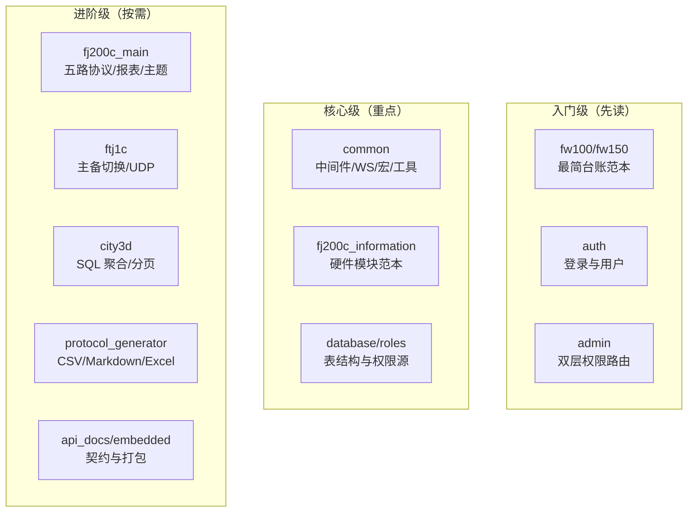

**阅读建议**：先读入门级建立模式 → 核心级理解骨架 → 进阶级按业务需求深入。本套文档的 06 章（类型同步）和 08 章（二次开发）会依赖本章的基础。

## 3.18 补充：三大监控模块对照（一次读懂三个）

| 维度 | fj200c_information | fj200c_main | ftj1c |
|---|---|---|---|
| 数据源 | 串口/模拟（8 路连接，同协议） | 串口五路（ECU/Adam4015/Adam4117/Dyno/Flux） | UDP 组播（16 路 IP，主备） |
| 帧格式 | 60 字节 `EB 90 3C` | 按设备：42B `EB 90 2A` / `>` ASCII / `FF FF` | 95 字节 `EB 90 5B` |
| 广播载荷 | Arc<str> 预序列化 | Arc<str> 预序列化 | Arc<str> 预序列化 |
| 通道 | event_broadcast! 1024 | event_broadcast! 1024 | event_broadcast! 1024 |
| 节流 | 200ms（5Hz） | 按需 | 50ms（20FPS） |
| 配置生效 | 热加载 | 需重启 | 需重启 |
| CSV | 协议帧驱动（SYSJSK/SYSJZJK/SYSJMK），28 列 | 前端按钮开关，64 列 | 无 |
| 特殊 | config_singleton! / mock_feeder | 主题持久化/报表/模拟开关 | 主备切换/坐标转换/帮助权限 |

**三个模块的骨架完全一致**（routes→handlers→session/process→decode→broadcast），差异只在数据源与解码。

## 3.19 补充：后端精读自测（30 题精华 10 问）

1. main.rs 启动八步是哪些？JWT 初始化在第几步？
2. 两级目录约定是什么？help_doc.md 为什么不能移进二级目录？
3. 12 个权限变体你能列出几个？ftj1c 为什么有 Ftj1cHelp？
4. 种子账号的密码机制真相？（bcrypt 存什么、seed_passwords 存什么）
5. 广播载荷为什么是 Arc<str>？
6. fj200c_information 的帧长/帧头/校验和是多少？
7. fj200c_main 五路串口各是什么设备？
8. 登录限流的 key 与窗口参数？
9. 生产模式两个"强制配置"是什么？
10. protocol_generator 生成哪三类交付物？

## 3.20 补充：后端代码阅读方法论（怎么读一个陌生模块）

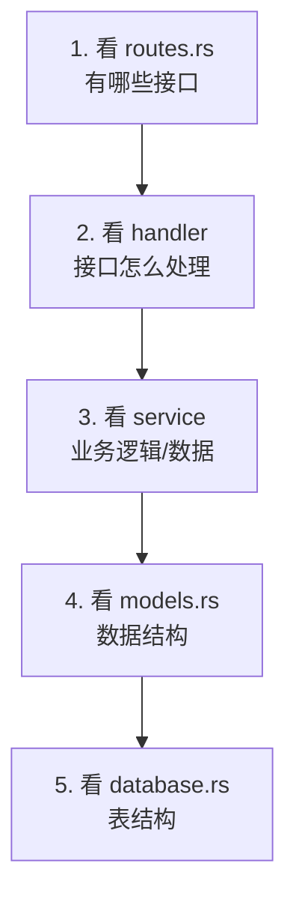

**自上而下**：路由 → 处理 → 业务 → 数据。任何一个模块都能用这五步读完。配合一级骨架 + 二级专有文件的目录约定，先在一级目录建立接口全貌，再进二级目录看实现。

## 3.21 补充：关键实现约定速查

| 主题 | 约定 |
|---|---|
| WS 认证 | `?token=` 查询参数 + `verify_query_token`（401） |
| 广播容量 | 全部 1024，满丢最旧 |
| 统一响应 | `ApiResponse<T>{success, data, message}` |
| 错误响应 | `AppError` → `{success:false, message}` |
| 密码哈希 | bcrypt，spawn_blocking |
| 限流 | 60s / 5 次，key = `{ip}:{email}` |
| 静态缓存 | assets/ immutable、.html no-cache |
| 路径参数 | axum 0.7 语法 `{id}` |
| 角色白名单 | `is_registered_role`（创建用户） |
| 防自锁 | 不能删自己 / 不能移除自己的 admin |

## 3.22 综合自测（验收 20 题）

1. 8 个前端应用与 8 个角色的对应关系？
2. `config_singleton!` 与 fj200c_main 配置实现的区别？
3. `/admin/pwd` 在哪个文件注册？被什么开关停用？
4. SYSJSK / SYSJZJK / SYSJMK 三帧各自驱动什么？
5. csv_sink 的 CsvCommand 有哪 4 个变体？
6. ComSpec 表中 Adam4015 与 Adam4117 的帧长？
7. Dyno 与 Flux 帧头相同，靠什么区分？
8. ECU_SEND_DATA 的默认值是什么？
9. 报表的 3 张（4 张）表分别是什么？"推力"列来自哪个表头？
10. ftj1c 帮助端点的权限与 include_str! 路径？
11. IpConfig 为什么有 32 个可选键？
12. city3d 的模型文件在哪个目录？building_count 怎么算的？
13. protocol_generator 的 CSV 表头 5 列是什么？
14. DEFAULT_CSV_CONTENT 为什么带 BOM？
15. api_docs 断言为什么是 48/60？
16. embedded 模式 8 个应用怎么注册路由？
17. 登录成功后为什么要 clear 限流计数？
18. stop_in_background 与直接 join 的区别？
19. 帧提取器校验失败时为什么逐字节丢弃？
20. 修改 config-fj200c_main.ini 与 config-fj200c_information.ini 的生效差异？

> 下一节：**04-Vue3与TypeScript语法速成**。