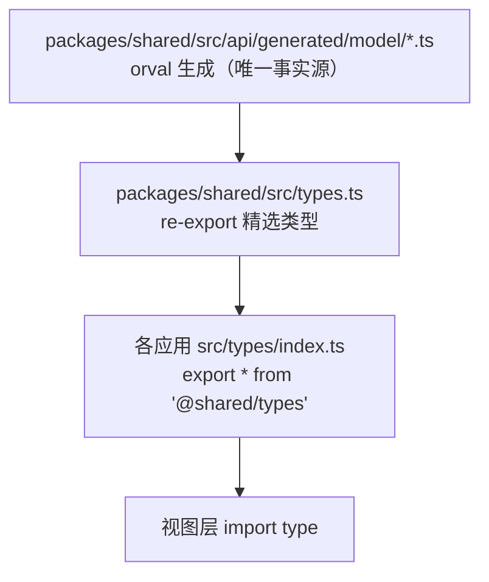
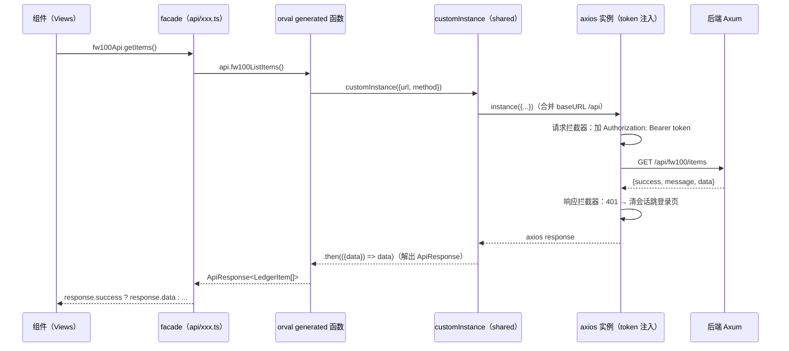
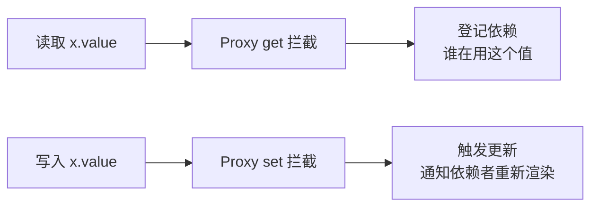
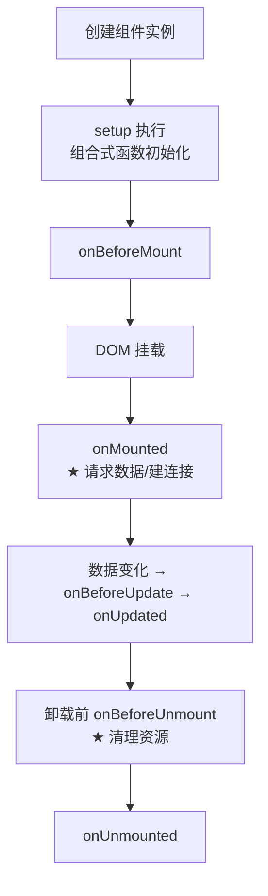
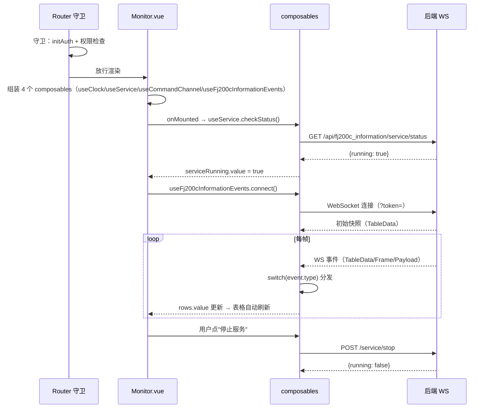
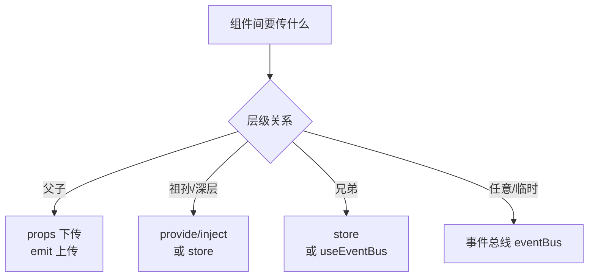
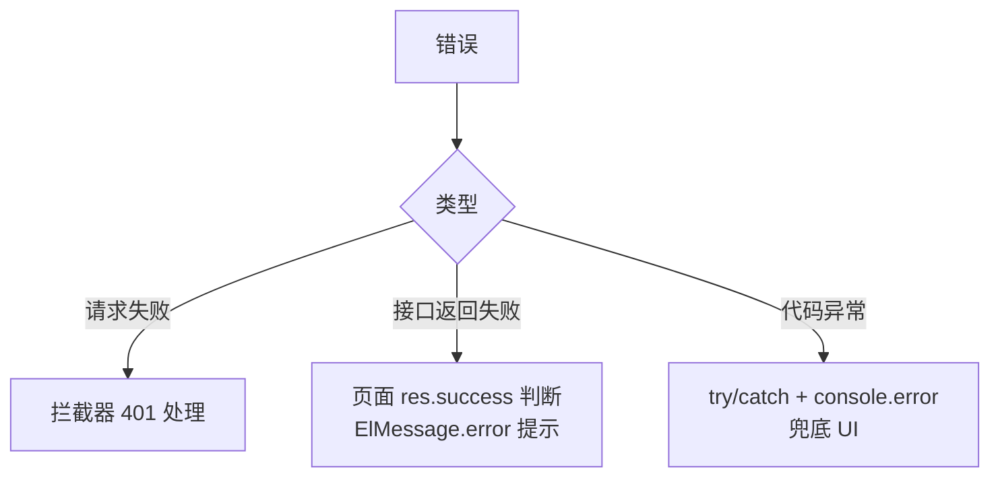
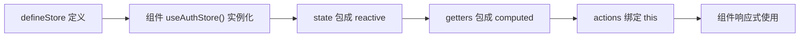

# 04 Vue 3 与 TypeScript 语法速成（以本项目代码为教材）

> 适用对象：Vue 零基础或接触过 Vue 2、想快速上手 Vue 3 的新手。
> 教学目标：看懂并修改本项目的 Vue 代码——语法点全部用项目真实代码举例（带文件路径）。本项目前端统一使用 **Vue 3 组合式 API + `<script setup>` + TypeScript**，没有 Vue 2 风格的选项式代码，学起来更统一。
> 全文约 1.5 万字，建议 4~6 小时消化。

---

## 4.1 先建立 Vue 3 的心智模型

### 4.1.1 Vue 的核心概念三件套

| 概念 | 一句话 | 类比（Rust/其他） |
|---|---|---|
| 响应式状态 | 数据变了，界面自动更新 | `ref`/`reactive` ≈ 可观察变量 |
| 模板 | 用声明式写法描述界面 | 类似 JSX/模板字符串，但有编译期优化 |
| 组件 | 可复用的界面单元 | 类似函数/模块，但自带模板和状态 |

**本项目的页面流**：Vue Router 把 URL 映射到组件 → 组件在 `<script setup>` 里定义状态与逻辑 → 模板里渲染 → 用户交互触发事件/请求 → 状态更新 → 界面自动刷新。

### 4.1.2 一个组件长什么样（本项目真实例子）

```vue
<!-- frontend/fw100/src/views/fw100/Panel.vue（138 行，全项目最小页面） -->
<script setup lang="ts">
import { ref, onMounted } from 'vue'
import { useAuthStore } from '@/stores/auth'
import { fw100Api } from '@/api'
import type { LedgerItem } from '@shared'

const authStore = useAuthStore()
const items = ref<LedgerItem[]>([])       // 响应式数组
const loading = ref(false)

const fetchItems = async () => {
  loading.value = true
  try {
    const response = await fw100Api.getItems()
    if (response.success && response.data) {
      items.value = response.data
    }
  } finally {
    loading.value = false
  }
}

onMounted(fetchItems)                      // 挂载后请求数据
</script>

<template>
  <div class="panel">
    <h2>fw100 设备台账</h2>
    <el-table v-loading="loading" :data="items" stripe>
      <el-table-column prop="name" label="名称" />
      <el-table-column prop="category" label="类别" />
      <el-table-column prop="status" label="状态" />
      <el-table-column prop="location" label="位置" />
    </el-table>
  </div>
</template>
```

**这就是一个完整组件**：逻辑在 `<script setup>`，界面在 `<template>`。别看它小，它包含了 Vue 3 的 90% 核心语法：`ref`、`onMounted`、模板指令（`v-loading`/`:data`/`v-for`）、Pinia store、API 调用。

---

## 4.2 模板语法（template）

### 4.2.1 插值与指令速查

```vue
<!-- 插值：{{ }} 内是 JS 表达式 -->
<span>{{ user?.username }}</span>
<span>{{ items.length }} 条记录</span>

<!-- 指令（v- 开头）： -->
<el-input v-model="form.email" />        <!-- v-model：双向绑定（表单） -->
<el-table :data="items" />               <!-- :prop：绑定属性（:data = v-bind:data） -->
<button @click="handleLogin">登录</button> <!-- @click：事件绑定（@click = v-on:click） -->
<div v-if="loading">加载中</div>          <!-- v-if：条件渲染 -->
<div v-show="visible">显示</div>          <!-- v-show：CSS 显示/隐藏 -->
<li v-for="item in items" :key="item.id"> <!-- v-for：列表渲染（必须 :key） -->
<span v-html="content" />                <!-- v-html：渲染 HTML（慎用 XSS） -->
<button :disabled="!hasPerm">保存</button> <!-- :disabled：布尔绑定 -->
```

**本项目常用指令清单**（Element Plus 组件 + Vue 指令组合）：

| 指令/绑定 | 项目例子 | 位置 |
|---|---|---|
| `v-model` | 登录表单、配置编辑器、搜索框 | LoginPage.vue、Config.vue |
| `v-for + :key` | 菜单遍历、卡片遍历、表格行 | AppNavbar.vue、ftj1c Monitor |
| `v-if / v-else` | 登录页/主页面切换、空态 | App.vue、各视图 |
| `:loading` | 表格加载态 | Users.vue、Panel.vue |
| `@click` | 按钮事件 | 所有页面 |
| `@command` | 下拉菜单选择 | AppNavbar.vue |
| `:style` / `:class` | 动态样式 | 仪表盘、主题切换 |
| `@submit.prevent` | 表单提交拦截 | LoginPage.vue |

### 4.2.2 模板里的语法糖

```vue
<!-- 简写对照 -->
<el-input v-bind:model-value="x" />   <!-- 完整 -->
<el-input :model-value="x" />          <!-- 简写（项目统一用简写） -->
<button v-on:click="f">x</button>      <!-- 完整 -->
<button @click="f">x</button>          <!-- 简写 -->

<!-- 动态组件 -->
<component :is="currentView" />

<!-- 插槽（slot）：父组件向子组件注入内容 -->
<AppNavbar>
  <template #actions>                  <!-- 具名插槽：nav-actions 区域 -->
    <el-button @click="save">保存数据</el-button>
  </template>
</AppNavbar>
```

**插槽是 AppNavbar 的应用扩展点**：`<slot name="actions">` 让每个应用在导航栏右侧放自定义按钮（fj200c_main 的"保存数据/模拟运行/主题"按钮就是这么放进去的）。

---

## 4.3 响应式核心：ref / reactive / computed / watch

### 4.3.1 ref：单个值（最常用）

```ts
import { ref } from 'vue'

const loading = ref(false)        // 创建响应式值
loading.value = true              // ★ 读取/修改必须 .value（模板中自动解包）
console.log(loading.value)
```

**为什么有 `.value`**：`ref` 把值包进一个对象（`.value` 属性），这样 JS 的基础类型（number/string/bool）也能被 Vue 追踪。**在模板里不用写 `.value`**（自动解包），在 `<script setup>` 里必须写。

```ts
// 项目实例：ftj1c Monitor.vue 的服务状态
const serviceRunning = ref(false)
const startService = async () => {
  const res = await ftj1cApi.startService()
  serviceRunning.value = res.success
}
```

### 4.3.2 reactive：对象（整体响应式）

```ts
import { reactive } from 'vue'

const form = reactive({          // 对象字段都是响应式的
  email: '',
  password: '',
})
form.email = 'admin@rustweb.dev' // 直接改字段，无需 .value
```

### 4.3.3 ref vs reactive 怎么选（项目约定）

| 场景 | 用 |
|---|---|
| 单个值（数字/布尔/字符串） | `ref` |
| 数组 | `ref`（项目统一 `ref<Type[]>([])`） |
| 表单对象（字段级操作） | `reactive` |
| 复杂嵌套对象 | `reactive` |

**项目铁律**：数组一律 `ref<Type[]>([])`（不要 `reactive([])`——历史坑）。看 fj200c_main 的 dashboard store：

```ts
// frontend/fj200c_main/src/fj200c_main/store/dashboard.ts
const ecuData = reactive<EcuFields>({ /* 29 个字段 */ })   // 对象 → reactive
const chartData = ref<Array<{time: string; value: number}>>([])  // 数组 → ref
const isSimulating = ref(false)                              // 布尔 → ref
```

### 4.3.4 computed：派生状态

```ts
import { computed } from 'vue'

// 依赖其他响应式值自动重算（缓存）
const hasUsers = computed(() => items.value.length > 0)
const displayName = computed(() => user.value?.username || '游客')
```

```ts
// 项目实例：App.vue 判断登录页（computed 读取 route）
const isLoginPage = computed(() => route.path.startsWith('/login'))
```

**computed vs 函数**：computed 有缓存（依赖不变不重算）；普通函数每次调用都执行。模板里频繁读取的派生值用 computed。

### 4.3.5 watch：监听变化

```ts
import { watch } from 'vue'

watch(serviceRunning, (val) => {   // 监听 ref
  console.log('服务状态变为', val)
})

watch([a, b], ([na, nb]) => {})    // 监听多个
watch(() => route.path, () => {    // 监听 getter 表达式
  // 路由变化时做什么
}, { immediate: true })            // 立即执行一次
```

### 4.3.6 模板中直接可用的全局对象

```vue
<span>{{ import.meta.env.PROD ? '/fj200c_information' : '/' }}</span>
```

`import.meta.env` 是 Vite 注入的环境对象：`DEV`/`PROD`/`MODE`/自定义 `VITE_*` 变量。

---

## 4.4 `<script setup>` 详解（本项目的统一写法）

### 4.4.1 为什么用 script setup

Vue 3 的组合式 API 有两种载体：`setup()` 函数和 `<script setup>`（编译器语法糖）。本项目 100% 用 `<script setup>`——顶层声明的变量/函数**自动暴露给模板**，不用 return。

### 4.4.2 组件导入即用

```vue
<script setup lang="ts">
import CommandPanel from '@/fj200c_information/components/CommandPanel.vue'
// 导入的组件在模板中直接可用（无需注册）
</script>
<template>
  <CommandPanel />
</template>
```

### 4.4.3 props 与 emits（组件通信）

```vue
<!-- frontend/fj200c_information/src/fj200c_information/components/CommandRow.vue（结构示意） -->
<script setup lang="ts">
// props：父组件传入的数据（只读）
const props = withDefaults(defineProps<{
  index: number
  label?: string          // 可选 prop
}>(), { label: '命令' })  // 默认值

// emits：向父组件发送事件
const emit = defineEmits<{
  (e: 'remove', index: number): void
  (e: 'send', index: number, hex: string): void
}>()

const handleSend = () => emit('send', props.index, hexString.value)
</script>
```

**本项目 props/emits 类型化写法**：`defineProps<{...}>()` 泛型 + `withDefaults` 默认值 + `defineEmits<{...}>()` 事件签名——全程 TypeScript 类型检查，写错类型直接编译报错。

### 4.4.4 生命周期钩子

```ts
import { onMounted, onUnmounted, onBeforeUnmount } from 'vue'

onMounted(() => {        // 组件挂载后（请求数据、建立连接）
  authStore.initAuth()
  connectWs()
})
onUnmounted(() => {      // 组件卸载前（清理）
  disconnectWs()
  clearInterval(timer)
})
```

**项目中的生命周期使用场景**：

| 钩子 | 项目用途 | 位置 |
|---|---|---|
| `onMounted` | 拉数据、建 WS、起轮询 | 所有视图 |
| `onUnmounted` | 断 WS、清定时器 | useFj200cInformationEvents 等 |
| `onScopeDispose` | 组合式函数内清理（推荐替代 onUnmounted） | useCityData.ts |

---

## 4.5 TypeScript 速成（本项目用法）

### 4.5.1 类型注解基础

```ts
const email: string = 'admin@rustweb.dev'
const count: number = 42
const isDark: boolean = true
const items: LedgerItem[] = []            // 类型来自 orval 生成

function fetchItems(): Promise<ApiResponse<LedgerItem[]>> { ... }
```

### 4.5.2 接口与类型别名

```ts
// 接口：对象的形状
interface MenuItem {
  id: string
  title: string
  path: string
  icon?: string                          // 可选字段
  permissions: Permission[]              // 权限点列表
  children?: MenuItem[]                  // 子菜单（递归）
}

// 类型别名：联合类型/复杂类型
type Fj200cMainWsEvent =
  | { type: 'port_data'; ... }
  | { type: 'simulation_state'; ... }
```

### 4.5.3 联合类型与类型收窄（WS 事件分发核心）

```ts
// 后端枚举（serde tag）生成的联合类型：按 type 字段分发
switch (event.type) {
  case 'port_data':        // 收窄：这里 event 自动变成 port_data 的形状
    handlePortData(event)
    break
  case 'simulation_state':
    store.isSimulating = event.simulating
    break
  case 'csv_recording_state':
    store.isRecording = event.recording
    break
}
```

**判别联合（discriminated union）**是前后端事件协议在 TS 侧的体现——后端 `#[serde(tag="type")]` 枚举 ↔ 前端 TS 联合类型，天然对应。

### 4.5.4 泛型与工具类型

```ts
// 泛型函数：T 由调用方决定
function wrap<T>(data: T): ApiResponse<T> { ... }

// 内置工具类型
type UserId = string
type MaybeUser = User | null
type UserFields = keyof User              // 字段名联合
type PartialUser = Partial<User>          // 全部可选
type ReadonlyUser = Readonly<User>        // 全部只读
```

### 4.5.5 项目类型体系（三层 re-export）



**新手规则**：类型从哪里来？→ 一律从 `@shared` 或 `@shared/api/generated` 导入；**绝不手写**与后端重复的类型定义。

### 4.5.6 项目 tsconfig 严格模式（写代码时注意）

```json
{
  "compilerOptions": {
    "strict": true,                // 全严格：null 检查等
    "noUnusedLocals": true,        // 未使用变量报错
    "noUnusedParameters": true,    // 未使用参数报错
    "noEmit": true,                // 只检查不输出
    "moduleResolution": "bundler",
    "paths": {
      "@/*": ["src/*"],
      "@shared": ["../../packages/shared/src/index.ts"],
      "@shared/*": ["../../packages/shared/src/*"]
    }
  }
}
```

**新手最常见的三个报错**：
1. 声明了没用的变量 → 删掉（noUnusedLocals）。
2. `strict` 下 null 处理：`user?.name` 或 `user!.name`（非空断言，慎用）。
3. import 路径写错 → 用 `@/` 和 `@shared` 别名。

---

## 4.6 Pinia 状态管理（本项目用法）

### 4.6.1 什么是 Pinia

Pinia 是 Vue 3 官方状态管理库：跨组件共享的状态（用户信息、权限、业务数据）。

### 4.6.2 创建 store 的两种风格

```ts
// 选项式（Vuex 风格）
export const useStore = defineStore('id', {
  state: () => ({ count: 0 }),
  getters: { double: (s) => s.count * 2 },
  actions: { inc() { this.count++ } },
})

// 组合式（setup 风格）——本项目用这个
export const useDashboardStore = defineStore('fj200c_main-dashboard', () => {
  const ecuData = reactive<EcuFields>({ ... })
  const isSimulating = ref(false)
  const dashboardState = computed(() => ({ ... }))
  function addChartPoint() { ... }
  return { ecuData, isSimulating, dashboardState, addChartPoint }  // 暴露出去
})
```

### 4.6.3 组件中使用 store

```ts
import { useDashboardStore } from '@/fj200c_main/store/dashboard'
const store = useDashboardStore()       // 必须在 setup 顶层调用
console.log(store.ecuData.ngSpeed)
store.addChartPoint()
```

### 4.6.4 store-to-refs：解构保持响应式

```ts
import { storeToRefs } from 'pinia'
const { ecuData, isSimulating } = storeToRefs(store)   // refs 解构
const { addChartPoint } = store                        // 方法直接解构
```

**重要**：直接 `const { ecuData } = store` 会**丢失响应式**（拿的是快照）；用 `storeToRefs` 包装。

### 4.6.5 本项目的 store 家族

| store | 应用 | 内容 |
|---|---|---|
| `useAuthStore`（工厂生成） | 所有应用 | 用户/权限/菜单/登录退出（19 行配置） |
| `useDashboardStore` | fj200c_main | ECU/ADAM/DYNO 数据 + 图表缓冲 |

auth store 是 `createAuthStore` 工厂生成的（05 章详述），业务 store 只有 dashboard 一个——**本项目状态管理很轻，大部分状态就在组件内**。

---

## 4.7 Vue Router（路由与守卫）

### 4.7.1 路由表

```ts
// frontend/fj200c_information/src/router/index.ts
import { createRouter, createWebHistory } from 'vue-router'

const router = createRouter({
  history: createWebHistory(import.meta.env.PROD ? '/fj200c_information/' : '/'),
  routes: [
    { path: '/', redirect: '/login' },
    { path: '/login', name: 'Login',
      component: () => import('@/views/Login.vue'),
      meta: { requiresGuest: true } },                    // 游客才能进
    { path: '/fj200c_information/monitor', name: 'Monitor',
      component: () => import('@/views/fj200c_information/Monitor.vue'),
      meta: { requiresAuth: true,                         // 需要登录
              permissions: [Permission.Fj200cInformationMonitor] } },  // 需要权限
    // ... 其余页面
    { path: '/:pathMatch(.*)*', redirect: '/login' },     // 兜底
  ],
})
```

**meta 字段是路由权限契约**：`requiresAuth`（要登录）+ `permissions`（权限点数组，任一满足即可）。

### 4.7.2 路由守卫（beforeEach）

```ts
router.beforeEach(async (to, _from, next) => {
  const authStore = useAuthStore()
  await authStore.initAuth()                     // ① 确保认证状态就绪
  if (to.meta.requiresAuth && !authStore.isAuthenticated) {
    next('/login')                               // ② 未登录 → 登录页
    return
  }
  if (to.meta.requiresGuest && authStore.isAuthenticated) {
    next('/fj200c_information')                  // ③ 已登录访问登录页 → 首页
    return
  }
  if (to.meta.permissions) {
    const has = (to.meta.permissions as Permission[])
      .some((p) => authStore.hasPermission(p))   // ④ 任一权限满足即放行
    if (!has) {
      const fallback = getFirstMenuPath(authStore.userRole)
      next(fallback ?? '/login')                 // ⑤ 无权限 → 跳有权限的首页
      return
    }
  }
  next()                                         // ⑥ 放行
})
```

**守卫四步口诀**：等认证 → 查登录 → 查权限 → 跳转。这是 7 个应用共用的守卫模板（admin 版差异：无权限跳 `/403` 而非回跳首页）。

### 4.7.3 动态导入（懒加载）

```ts
component: () => import('@/views/xxx.vue')
```

页面按需加载，首屏更快——本项目所有页面都是动态导入。

---

## 4.8 Element Plus 组件库速查（本项目高频组件）

### 4.8.1 布局与容器

```vue
<el-card class="login-card">                      <!-- 卡片 -->
  <template #header>标题</template>               <!-- 卡片头部插槽 -->
  内容
</el-card>

<el-container>                                    <!-- 布局容器 -->
  <el-header>顶部</el-header>
  <el-main>主体</el-main>
</el-container>
```

### 4.8.2 表单（登录页标准组合）

```vue
<el-form ref="formRef" :model="form" :rules="rules" label-position="top" @submit.prevent="handleLogin">
  <el-form-item label="邮箱" prop="email">
    <el-input v-model="form.email" placeholder="请输入邮箱" />
  </el-form-item>
  <el-form-item label="密码" prop="password">
    <el-input v-model="form.password" type="password" show-password placeholder="请输入密码" />
  </el-form-item>
  <el-button type="primary" :loading="loading" @click="handleLogin">立即登录</el-button>
</el-form>
```

```ts
// 表单校验规则（Element Plus rules）
const rules = {
  email: [{ required: true, message: '请输入邮箱', trigger: 'blur' }],
  password: [{ required: true, message: '请输入密码', trigger: 'blur' }],
}
// 校验提交
formRef.value?.validate(async (valid) => {
  if (!valid) return
  // ...
})
```

### 4.8.3 表格（列表页标准组合）

```vue
<el-table v-loading="loading" :data="users" stripe border>
  <el-table-column prop="username" label="用户名" />
  <el-table-column prop="email" label="邮箱" />
  <el-table-column label="角色">
    <template #default="{ row }">               <!-- 作用域插槽：拿当前行 -->
      {{ findRole(row.role)?.name ?? row.role }}
    </template>
  </el-table-column>
  <el-table-column label="操作" width="180">
    <template #default="{ row }">
      <el-button size="small" @click="openEdit(row)">编辑</el-button>
      <el-button size="small" type="danger" @click="removeUser(row)">删除</el-button>
    </template>
  </el-table-column>
</el-table>
```

### 4.8.4 弹窗与消息

```vue
<el-dialog v-model="dialogVisible" title="编辑角色" width="400px">
  <el-select v-model="editForm.role">
    <el-option v-for="r in roles" :key="r.key" :label="r.name" :value="r.key" />
  </el-select>
  <template #footer>
    <el-button @click="dialogVisible = false">取消</el-button>
    <el-button type="primary" @click="saveEdit">确定</el-button>
  </template>
</el-dialog>
```

```ts
import { ElMessage } from 'element-plus'
ElMessage.success('登录成功')
ElMessage.error(response.message || '操作失败')
ElMessage.warning('该账号属于其他应用，正在跳转')
```

### 4.8.5 下拉菜单（导航栏用户区）

```vue
<el-dropdown @command="handleCommand">
  <el-avatar :size="32">{{ user?.username?.charAt(0)?.toUpperCase() }}</el-avatar>
  <template #dropdown>
    <el-dropdown-item divided command="logout">退出登录</el-dropdown-item>
  </template>
</el-dropdown>
```

### 4.8.6 本项目 Element Plus 组件使用统计（按频率）

| 组件 | 频率 | 用途 |
|---|---|---|
| el-button / el-input | ★★★★★ | 表单交互 |
| el-table / el-table-column | ★★★★★ | 数据展示 |
| el-form / el-form-item | ★★★★ | 表单校验 |
| el-card | ★★★★ | 内容容器 |
| el-dialog | ★★★ | 编辑弹窗 |
| el-select / el-option | ★★★ | 下拉选择 |
| el-tag / el-badge | ★★★ | 状态标签 |
| el-dropdown | ★★ | 菜单 |
| el-avatar | ★★ | 用户头像 |
| el-switch / el-radio / el-checkbox | ★ | 开关/单选/复选 |

---

## 4.9 WebSocket 前端连接（项目两种模式）

### 4.9.1 连接地址构建（shared 公共函数）

```ts
// packages/shared/src/session.ts
export function buildWebSocketUrl(apiPath: string): string {
  const token = getSessionToken() || ''
  const protocol = window.location.protocol === 'https:' ? 'wss' : 'ws'
  return `${protocol}://${window.location.host}${apiPath}?token=${encodeURIComponent(token)}`
}
```

- 协议按页面协议自动选 `wss`/`ws`（部署 HTTPS 时自动安全）。
- token 走**查询参数**（浏览器 WS API 无法自定义 header）。

### 4.9.2 模式一：组件级连接（fj200c_information / ftj1c）

```ts
// frontend/fj200c_information/src/fj200c_information/composables/useFj200cInformationEvents.ts
const ws = ref<WebSocket | null>(null)
let reconnectTimer: number | null = null
let manualClose = false

const connect = () => {
  if (ws.value || connecting.value) return
  manualClose = false
  ws.value = new WebSocket(fj200cInformationApi.buildWebSocketUrl())

  ws.value.onopen = () => { connected.value = true }
  ws.value.onmessage = (message) => {
    try {
      const data = JSON.parse(message.data) as Fj200cInformationEvent
      handleEvent(data)               // switch(event.type) 分发
    } catch { /* 忽略非 JSON */ }
  }
  ws.value.onclose = () => {
    connected.value = false
    if (!manualClose) {
      reconnectTimer = window.setTimeout(connect, 1500)   // ★ 1.5s 自动重连
    }
  }
  ws.value.onerror = () => ws.value?.close()
}

const disconnect = () => {
  manualClose = true
  if (reconnectTimer) clearTimeout(reconnectTimer)
  ws.value?.close()
  ws.value = null
}
```

**组件级连接的生命周期**：`onMounted(connect)` + `onUnmounted(disconnect)`——**离开页面断开**。适合"单页面使用 WS"的应用。

### 4.9.3 模式二：模块级单例连接（fj200c_main）

```ts
// frontend/fj200c_main/src/fj200c_main/composables/useBackendPorts.ts
// 模块级变量（不随组件销毁）
let sharedWs: WebSocket | null = null
let refCount = 0        // 引用计数

export function useBackendPorts() {
  // 页面挂载时 acquire：计数 +1 并确保连接
  const acquire = () => { refCount++; manualClose = false; connect() }
  // 页面卸载时 release：计数 -1，归零才真正断开
  const release = () => {
    refCount = Math.max(0, refCount - 1)
    if (refCount > 0) return
    manualClose = true; clearTimeout(reconnectTimer); sharedWs?.close(); sharedWs = null
  }
  onMounted(acquire)
  onUnmounted(release)
  return { /* 数据和事件 */ }
}
```

**为什么 fj200c_main 用单例**：仪表盘 Monitor 页 + 试验查看 ExperimentView 页都要收数据，组件级连接会导致**切页断线、数据冻结**（git 历史里的真实 bug，debb02f 修复）。引用计数让多个页面共享一个连接，最后离开的才断开。

### 4.9.4 两种模式选择建议

| 场景 | 模式 |
|---|---|
| 只有一个页面用 WS | 组件级（简单） |
| 多个页面都要实时数据 | 模块级单例 + 引用计数 |
| 全应用都要（含未打开任何页面时也要收） | App.vue 挂载时建立 |

### 4.9.5 消息分发模式（handleEvent）

```ts
const handleEvent = (event: Fj200cMainWsEvent) => {
  switch (event.type) {
    case 'port_data':         handlePortData(event); break
    case 'simulation_state':  store.isSimulating = event.simulating; break
    case 'theme_state':       applyTheme(event.isDark); break
    case 'csv_recording_state': store.isRecording = event.recording; break
  }
}
```

**一个原则**：WS 事件只做"写 store / 更新 ref"，不做 UI 直接操作——渲染交给模板自动响应。

---

## 4.10 ECharts 可视化（fj200c_information / fj200c_main）

### 4.10.1 基本用法

```ts
// frontend/fj200c_information/src/views/fj200c_information/Visual.vue（结构示意）
import * as echarts from 'echarts'
import { onMounted, onUnmounted, ref } from 'vue'

const chartRef = ref<HTMLDivElement | null>(null)
let chart: echarts.ECharts | null = null

onMounted(() => {
  chart = echarts.init(chartRef.value!)           // 初始化（绑定 DOM）
  chart.setOption({
    series: [{
      type: 'gauge',                              // 仪表盘
      data: [{ value: 70, name: '转速' }],
    }],
  })
})

onUnmounted(() => { chart?.dispose() })           // 必须销毁（内存泄漏预防）

// 数据更新：setOption 增量合并（不要每次重建图表）
const updateData = (value: number) => {
  chart?.setOption({ series: [{ data: [{ value }] }] })
}
```

### 4.10.2 实时曲线的数据流（与 WS 协作）

```ts
// 环形缓冲：最多 100 个点
const chartData = ref<Array<{ time: string; value: number }>>([])
const addPoint = (v: number) => {
  chartData.value.push({ time: new Date().toLocaleTimeString(), value: v })
  if (chartData.value.length > 100) chartData.value.shift()   // 超长截断
  chart?.setOption({ xAxis: { data: chartData.value.map(p => p.time) }, ... })
}
```

### 4.10.3 图表类型清单（本项目）

| 图表 | 用途 | 位置 |
|---|---|---|
| gauge（仪表盘） | 转速/扭矩等 6 个仪表 | Visual.vue |
| line（折线） | 实时曲线 | Visual.vue、ChartPanel.vue |
| bar（柱状） | 状态统计（少量） | 报表页 |

**新手注意**：ECharts 实例要随组件销毁 `dispose()`；`setOption` 是增量合并，重复调用安全；WebSocket 高频数据要节流再 setOption。

---

## 4.11 组合式函数（composables）：本项目逻辑复用的核心

### 4.11.1 什么是组合式函数

组合式函数（composable）是**以 `useXxx` 命名的函数，内部可组合 ref/computed/watch/生命周期**，把可复用逻辑抽出来。类似 React 的 Hooks。

### 4.11.2 项目中的组合式函数清单

| 函数 | 位置 | 职责 |
|---|---|---|
| `useClock` | fj200c_information | 每秒更新的时钟 |
| `useService` | fj200c_information | 服务启停 + 3 秒轮询状态 |
| `useCommandChannel` | fj200c_information | 命令通道状态与发送 |
| `useConfigDialog` | 多个应用 | 配置读写对话框逻辑 |
| `useFj200cInformationEvents` | fj200c_information | WS 连接与事件分发 |
| `useBackendPorts` | fj200c_main | 模块级单例 WS |
| `useTheme` | fj200c_main | 深浅主题切换 |
| `useWindowScale` | fj200c_main | 窗口缩放计算 |
| `useCityData` | city3d | 数据加载 + 5 秒轮询 |
| `useCityScene` | city3d | Three.js 场景 |
| `useResponsive` | shared 相关 | 响应式布局 |

### 4.11.3 组合式函数范例（useClock，完整版）

```ts
// frontend/fj200c_information/src/fj200c_information/composables/useClock.ts
import { onUnmounted, ref } from 'vue'

export function useClock() {
  const now = ref(new Date())
  let timer: number | null = null

  timer = window.setInterval(() => {
    now.value = new Date()
  }, 1000)                     // 每秒更新

  onUnmounted(() => {
    if (timer) clearInterval(timer)    // ★ 清理定时器（防泄漏）
  })

  return {
    now,
    timeStr: () => now.value.toLocaleTimeString('zh-CN'),
  }
}
```

**组合式函数三定律**（项目全部遵守）：
1. 命名 `useXxx`。
2. 内部创建的资源（定时器/WS/监听器）在 `onUnmounted`/`onScopeDispose` 清理。
3. 返回响应式数据 + 方法。

### 4.11.4 一个视图组装多个组合式函数（Monitor.vue 模式）

```ts
// Monitor.vue 的 script 组织（411 行页面，逻辑高度复用）
const { now } = useClock()
const { serviceRunning, startService, stopService } = useService()
const { channels, addChannel, removeChannel, send } = useCommandChannel()
const { configDialog, openConfig, saveConfig } = useConfigDialog()
const { connected, rows } = useFj200cInformationEvents()
```

**这就是组合式 API 的威力**：页面只是"组装器"，每个关注点一个组合式函数，测试/复用/维护都容易。

---

## 4.12 样式系统：CSS 变量与双主题

### 4.12.1 全局样式组织

```css
/* frontend/fj200c_main/src/fj200c_main/styles/theme.css —— 双主题变量 */
:root {
  --bg-primary: #0f1d33;        /* 深色主题底色 */
  --bg-card: #1a2940;
  --text-primary: #e5eaf3;
  --border-color: #303133;
}
html.light {
  --bg-primary: #f5f7fa;        /* 浅色主题覆盖 */
  --bg-card: #ffffff;
  --text-primary: #303133;
  --border-color: #dcdfe6;
}
```

```ts
// useTheme.ts：html 根节点加 class 控制主题
const applyTheme = (isDark: boolean) => {
  document.documentElement.classList.toggle('light', !isDark)
  localStorage.setItem('theme', isDark ? 'dark' : 'light')
}
```

**主题机制**：CSS 变量 + `html.light` 类 + 服务端同步（WS theme_state 广播）——所有页面统一切换。

### 4.12.2 各应用样式文件布局

| 文件 | 内容 |
|---|---|
| `src/style.css` | 全局基础样式（每个应用都有） |
| `src/fj200c_information/fj200c_information.css` | 模块专属样式 |
| `src/fj200c_main/styles/theme.css` | 双主题变量 |
| `src/fj200c_main/print-lock.css` | 打印样式 |

### 4.12.3 Scoped 样式与 :deep

```vue
<style scoped>
/* scoped：样式只作用于本组件（自动加属性选择器） */
.monitor-grid { display: grid; gap: 12px; }

/* :deep()：穿透到子组件内部（改 Element Plus 内部样式） */
:deep(.el-table__row) { cursor: pointer; }
</style>
```

---

## 4.13 前端工程：Vite 开发体验

### 4.13.1 dev 服务器做了什么


- Vite 启动后，浏览器访问即时的模块服务（无需构建）。
- `/api` 代理：`vite.config.ts` 的 `server.proxy` 把请求转给后端（`changeOrigin` 改 Host 头）。
- **WS 代理**：`ws: true` 让 WS 升级请求也被转发——fj200c_information/fj200c_main/ftj1c/city3d 的配置里有。

### 4.13.2 HMR（热更新）

改 `.vue` 文件 → 浏览器**不刷新**地更新组件（保留状态）；改 `vite.config.ts` → 需要重启 dev server。

### 4.13.3 构建（npm run build）

```powershell
# 在对应 frontend/<app> 目录执行
npm run build
# = vue-tsc --noEmit（类型检查）&& vite build（产物到 dist/）
```

**两步必须顺序执行**：先类型检查（报错就不构建），再打包。产物 `dist/` 供后端内嵌/磁盘托管。

---

## 4.14 本章自测：读一段真实代码

独立阅读 `frontend/fj200c_information/src/views/fj200c_information/Config.vue` 的核心片段，回答：

```ts
const configContent = ref('')
const loading = ref(false)

const loadConfig = async () => {
  loading.value = true
  try {
    const res = await fj200cInformationApi.getConfig()
    if (res.success) configContent.value = res.data?.content ?? ''
    else ElMessage.error(res.message || '读取失败')
  } finally {
    loading.value = false
  }
}

onMounted(loadConfig)
```

**问题**：
1. `configContent` 是什么类型？`ref` 包的是什么？
2. `res.data?.content ?? ''` 的含义？
3. `finally` 在这里的作用？
4. 为什么 `onMounted(loadConfig)` 而不是 `onMounted(loadConfig())`？

**参考答案**：
1. `ref('')` → `Ref<string>`，模板中自动解包为字符串。
2. 可选链：`res.data` 可能为 null（失败时 data 为 null），取不到 content 就用空字符串兜底（`??` 空值合并）。
3. 无论成功失败都恢复 loading 状态（防止按钮/表格永远转圈）。
4. `onMounted(loadConfig)` 传入**函数引用**，挂载时调用；如果写 `loadConfig()` 会立即执行（且返回值 undefined 传给 onMounted，挂载时不执行）。

答对 3 题以上，说明 Vue 3 基础已经足够阅读本项目页面代码。继续 05 章——前端逐应用精读。

## 4.15 API 调用模式深入（本项目前端请求全景）

### 4.15.1 一次请求的完整生命周期



**五层调用链**是理解前端 API 的关键——组件不直接调 axios，全部走 orval generated 封装，保证类型安全与统一错误处理。

### 4.15.2 响应处理三式（项目统一的写法）

```ts
// 第一式：成功才继续
const res = await usersApi.getUsers()
if (res.success && res.data) {
  users.value = res.data
} else {
  ElMessage.error(res.message || '获取失败')
}

// 第二式：try/catch/finally（加载态）
const fetchData = async () => {
  loading.value = true
  try {
    const res = await xxxApi.list()
    if (res.success) list.value = res.data ?? []
  } catch (e) {
    ElMessage.error('网络错误')
  } finally {
    loading.value = false
  }
}

// 第三式：抛错处理（提交类操作）
const handleSave = async () => {
  const res = await xxxApi.save(content)
  if (!res.success) throw new Error(res.message)
  ElMessage.success('保存成功')
}
```

### 4.15.3 401 的全局处理（token 过期）

```ts
// packages/shared/src/api/index.ts
api.interceptors.response.use(
  (response) => response,
  (error) => {
    if (error.response?.status === 401) {
      clearSession()
      window.location.href = loginPath   // 直接跳登录页（用 location 而非 router）
    }
    return Promise.reject(error)
  }
)
```

**为什么用 `window.location.href` 而不是 router.push**：401 可能发生在任何组件里，且可能不在 Vue 上下文（拦截器是全局的）；整页跳转最可靠。

### 4.15.4 facade 层的作用（为什么多包一层）

```ts
// frontend/fw100/src/api/fw100.ts
import { getFw100 } from '@shared/api/generated'

export function createFw100Api() {
  const api = getFw100()               // orval 工厂
  return {
    async getItems() { return api.fw100ListItems() },
    // 以后加逻辑就在这里加（日志/转换/组合请求）
  }
}
```

**facade 的价值**：
1. **视图层解耦**：组件 import `@/api`，不直接碰 generated——generated 重新生成（函数名可能变）时只改 facade。
2. **可加逻辑**：日志、参数转换、多请求组合。
3. **类型收口**：`export type XxxApi = ReturnType<typeof createXxxApi>` 导出统一类型。

---

## 4.16 Vue Router 深入：项目特殊用法

### 4.16.1 两个 base 的奥妙（dev vs prod）

```ts
// 路由 history 的 base：
createWebHistory(import.meta.env.PROD ? '/fj200c_information/' : '/')
// vite.config.ts 的 base：
base: command === 'build' ? '/fj200c_information/' : '/'
```

| 环境 | 路由 base | 资源 base | 效果 |
|---|---|---|---|
| dev | `/` | `/` | 5173 端口根路径访问 |
| prod | `/fj200c_information/` | `/fj200c_information/` | 后端托管在 `/fj200c_information` 下 |

**两个 base 必须一致**——这是 SPA 子路径部署的标准配置，7 个应用都遵守。

### 4.16.2 路由 meta 的权限设计（回看 4.7.1）

```ts
meta: {
  requiresAuth: true,                                    // 需要登录
  permissions: [Permission.Fj200cInformationMonitor],    // 需要权限（任一）
}
```

**权限判定函数**（shared/auth store）：

```ts
const hasPermission = (p: Permission) => permissions.value.includes(p)
const hasAnyPermission = (ps: Permission[]) => ps.some((p) => permissions.value.includes(p))
const hasAllPermissions = (ps: Permission[]) => ps.every((p) => permissions.value.includes(p))
```

### 4.16.3 编程式导航

```ts
import { useRouter } from 'vue-router'
const router = useRouter()
router.push('/fj200c_information/monitor')   // 跳转
router.replace('/login')                     // 替换（不留历史）
router.back()                                // 后退
```

---

## 4.17 表单与校验深入（Element Plus 全流程）

### 4.17.1 动态规则（根据场景切换校验）

```ts
// frontend/admin/src/views/CreateUser.vue（结构示意）
const rules = computed(() => ({
  password: [
    { required: true, message: '请输入密码', trigger: 'blur' },
    { min: 6, max: 32, message: '密码长度 6-32 位', trigger: 'blur' },
  ],
  email: [
    { required: true, message: '请输入邮箱', trigger: 'blur' },
    { type: 'email', message: '邮箱格式不正确', trigger: 'blur' },
  ],
}))
```

### 4.17.2 校验方法

```ts
const formRef = ref<FormInstance>()
const valid = await formRef.value?.validate().catch(() => false)   // 校验全部
formRef.value?.validateField('email')   // 校验单字段
formRef.value?.resetFields()            // 重置
formRef.value?.clearValidate()          // 清除校验状态
```

### 4.17.3 自定义校验

```ts
const validateRole = (rule: unknown, value: string, callback: (err?: Error) => void) => {
  if (!isRegisteredRole(value)) callback(new Error('角色不存在'))
  else callback()
}
```

---

## 4.18 前端调试技巧（新手必会）

### 4.18.1 Vue DevTools（浏览器扩展）

- **组件树**：查看组件层级、props、当前状态。
- **Pinia 面板**：直接查看/修改 store 状态（调试 WS 数据流神器）。
- **时间旅行**：Vuex 才有，Pinia 无（不是缺陷）。

### 4.18.2 F12 Network 面板

| 标签 | 看什么 |
|---|---|
| Fetch/XHR | API 请求：URL、状态码、请求头（token）、响应体 |
| WS | WebSocket 连接：消息流（实时数据调试核心） |
| Console | 报错、console.log |

**调试 WS 数据流三步**：① Network → WS → 打开连接查看帧 → ② 对照后端 `RUST_LOG=debug` 日志 → ③ 定位断在哪一层（后端采集/广播/WS/前端分发）。

### 4.18.3 常见前端报错速查

| 报错 | 原因 | 修法 |
|---|---|---|
| `Cannot read properties of undefined (reading 'xxx')` | 空值访问 | 可选链 `?.` 或 `?? ''` 兜底 |
| `[Vue warn]: Extraneous non-emits event listeners` | 事件未声明 emits | defineEmits 加事件 |
| `TypeError: xxx is not a function` | 引用错误 | 检查导入名/facade 方法名 |
| `401 Unauthorized` | token 失效/未带 | 检查会话、重新登录 |
| `500 Internal Server Error` | 后端异常 | 看后端日志 |
| `403 Forbidden` | 权限不足 | 换有权限的账号 |
| `ERR_CONNECTION_REFUSED`（/api 请求） | 后端没启动 | 启动 cargo run |
| `WebSocket connection failed` | 后端没启动 / WS 代理没配 | 检查后端 + `ws: true` |

### 4.18.4 项目内联调试手段

```ts
console.log('调试', response)       // 临时调试
console.table(users.value)          // 表格化输出数组
```

---

## 4.19 项目前端代码风格约定（改代码时遵守）

### 4.19.1 命名约定

| 项 | 约定 | 例子 |
|---|---|---|
| 组件文件 | PascalCase | `CommandPanel.vue`、`GaugeCard.vue` |
| 视图文件 | PascalCase | `Monitor.vue`、`Data.vue` |
| 组合式函数 | useXxx | `useClock.ts` |
| 普通工具 | camelCase | `ascii.ts`、`hex.ts` |
| 变量/函数 | camelCase | `fetchItems`、`configContent` |
| 类型/接口 | PascalCase | `MenuItem`、`EcuFields` |
| 常量 | SCREAMING_SNAKE | `RECONNECT_DELAY` |
| Store | useXxxStore | `useAuthStore` |

### 4.19.2 文件组织约定

```
src/
├── api/            # API facade（每个应用）
├── router/         # 路由
├── stores/         # 认证 store（工厂调用）
├── views/          # 页面（薄）
├── <模块名>/       # 业务子目录
│   ├── components/ # UI 组件
│   ├── composables/# 组合式函数
│   ├── store/      # 业务 store（fj200c_main）
│   └── styles/     # 模块样式
└── utils/          # 通用工具
```

### 4.19.3 代码纪律

1. 页面组件保持"薄"：逻辑尽量下沉到 composables。
2. 样式尽量 `scoped`；改 Element Plus 内部用 `:deep()`。
3. 所有 API 走 facade，不直接 import generated。
4. 所有类型从 `@shared` 导入，不手写后端类型的副本。
5. 删除的变量/导入必须清干净（noUnusedLocals 会报错）。

---

## 4.20 新手常见 Vue 坑（本项目语境）

| # | 坑 | 后果 | 正确做法 |
|---|---|---|---|
| 1 | `const { user } = store` 解构 | 丢失响应式 | `storeToRefs(store)` |
| 2 | 忘记 `onUnmounted` 清理定时器/WS | 内存泄漏、重复请求 | 清理所有资源 |
| 3 | `onMounted(async () => await fetch())` | 无影响但没必要 | `onMounted(fetch)` |
| 4 | 模板里写复杂逻辑 | 难读难测 | 抽 computed/函数 |
| 5 | `v-for` 不用 `:key` | 渲染错乱警告 | 用唯一 id |
| 6 | `@click="handleLogin()"` vs `@click="handleLogin"` | 前者会传事件对象 | 无参数时写函数名 |
| 7 | 直接改 `props` | 报错/警告 | emit 事件让父组件改 |
| 8 | `import { reactive } from 'vue'` 后 `reactive([])` | 数组替换陷阱 | `ref<Type[]>([])` |
| 9 | 忽略 TS 报错继续写 | 构建失败 | 先修类型错误 |
| 10 | 在子目录单独 npm install | 依赖双实例（黑屏 bug！） | 根目录统一安装 |

**坑 10 是真实事故**：AGENTS.md 明确记载"子目录单独装依赖曾导致 pinia 双实例黑屏"。任何前端依赖变更，**在根目录执行 npm install**。

---

## 4.21 语法索引表（改代码时快速定位）

| 你想做的 | 语法 | 项目参考 |
|---|---|---|
| 响应式单个值 | `const x = ref(0)` + `x.value` | 所有页面 |
| 响应式对象 | `reactive({...})` | dashboard store |
| 派生状态 | `computed(() => ...)` | App.vue isLoginPage |
| 监听变化 | `watch(src, cb)` | 主题/路由变化 |
| 页面请求 | `onMounted(fetch)` + try/finally | Panel.vue |
| 表格渲染 | `el-table :data="items"` + prop | Users.vue |
| 表单绑定校验 | `el-form :rules` + validate | LoginPage.vue |
| 弹窗 | `el-dialog v-model` | Users.vue |
| 消息 | `ElMessage.success/error` | 所有页面 |
| 路由跳转 | `useRouter().push(path)` | LoginPage |
| 路由守卫 | `router.beforeEach` | 各 router/index.ts |
| store 读写 | `useXxxStore()` + `storeToRefs` | 视图层 |
| WS 连接 | `new WebSocket(url)` + onmessage | composables |
| 定时器 | `setInterval` + onUnmounted 清理 | useClock |
| 类型导入 | `import type { X } from '@shared'` | 所有页面 |
| 请求 | `await xxxApi.method()` + `res.success` | 所有页面 |
| 环境判断 | `import.meta.env.DEV/PROD` | LoginPage 跳转 |
| 样式作用域 | `<style scoped>` + `:deep()` | 所有组件 |

---

## 4.22 深入：响应式原理（理解"为什么能自动更新"）

### 4.22.1 从 getter/setter 说起

Vue 3 的响应式基于 **Proxy**（ES6 代理对象）。当你访问 `ref.value` 或 `reactive` 对象的字段时：



简单说：**读的时候登记，写的时候通知**。组件渲染时读过的响应式值，之后任何一个变化都会触发该组件重渲染。

### 4.22.2 为什么项目里"改 store 数据界面就自动变"

```ts
const ecuData = reactive<EcuFields>({ ngSpeed: 0, ... })
// WS 收到数据：store.ecuData.ngSpeed = 100
// 模板里的 {{ ecuData.ngSpeed }} 自动更新（因为渲染时登记了依赖）
```

### 4.22.3 ref 的 .value 为什么在模板里不用写

模板编译时自动解包：`{{ loading }}` 编译为 `{{ loading.value }}`。这是编译器语法糖，理解即可。

### 4.22.4 响应式丢失的典型场景

```ts
// ① 解构 reactive 对象 → 丢失
const { ngSpeed } = store.ecuData      // ✗ ngSpeed 是普通值
// 用 storeToRefs 或整对象访问

// ② 数组元素替换 → 部分丢失
const arr = reactive([{a: 1}])
const item = arr[0]                     // 之后 arr[0] = 新对象 → item 仍是旧引用

// ③ 深层嵌套 → reactive 自动深响应（ref 不会）
// reactive 深；ref 只包裹 .value（内部如果是对象也会变响应式）
```

**项目避坑口诀**：跨组件共享用 store；组件内复杂对象用 reactive；基础值/数组用 ref。

---

## 4.23 深入：v-model 自定义组件（双向绑定的本质）

### 4.23.1 本质是什么

```vue
<!-- v-model 是语法糖： -->
<el-input v-model="form.email" />
<!-- 等价于： -->
<el-input :model-value="form.email" @update:model-value="(v) => (form.email = v)" />
```

### 4.23.2 自定义组件实现 v-model

```vue
<!-- 子组件：MyToggle.vue -->
<script setup lang="ts">
const props = defineProps<{ modelValue: boolean }>()
const emit = defineEmits<{ (e: 'update:modelValue', v: boolean): void }>()
const toggle = () => emit('update:modelValue', !props.modelValue)
</script>
<template>
  <button @click="toggle">{{ modelValue ? '开' : '关' }}</button>
</template>
```

```vue
<!-- 父组件用法 -->
<MyToggle v-model="isDark" />
```

### 4.23.3 多值 v-model（本项目应用较少，了解即可）

```vue
<MyComp v-model:title="t" v-model:content="c" />
<!-- 子组件对应 emit('update:title', ...) / emit('update:content', ...) -->
```

---

## 4.24 深入：provide / inject（跨层级传值）

### 4.24.1 用法

```ts
// 祖先组件
import { provide } from 'vue'
provide('theme', isDark)               // 提供

// 任意后代组件
import { inject } from 'vue'
const theme = inject('theme', false)   // 注入（第二个参数是默认值）
```

### 4.24.2 项目中的使用

本项目**主要用 Pinia 代替 provide/inject**（全局状态），provide/inject 只在深层组件链传值场景用（如仪表盘向子卡片传数据）。了解即可，新代码优先 store。

---

## 4.25 深入：city3d 的 Three.js 基础（只讲够看懂的程度）

### 4.25.1 Three.js 是什么

WebGL 3D 库：场景（Scene）→ 相机（Camera）→ 物体（Mesh）→ 渲染循环（render loop）→ 灯光/材质/动画。

```ts
// frontend/city3d/src/composables/useCityScene.ts（结构示意）
import * as THREE from 'three'

const scene = new THREE.Scene()                          // 场景
const camera = new THREE.PerspectiveCamera(75, w / h, 0.1, 1000)  // 透视相机
const renderer = new THREE.WebGLRenderer({ antialias: true })     // 渲染器
renderer.setSize(window.innerWidth, window.innerHeight)
container.appendChild(renderer.domElement)

// 建筑：BoxGeometry（盒子）+ MeshStandardMaterial（材质）+ position
const geometry = new THREE.BoxGeometry(1, height, 1)
const material = new THREE.MeshStandardMaterial({ color: 0x4f7bbd })
const mesh = new THREE.Mesh(geometry, material)
mesh.position.set(x, height / 2, z)
scene.add(mesh)

// 渲染循环（requestAnimationFrame 驱动）
const animate = () => {
  requestAnimationFrame(animate)
  controls.update()                    // 轨道控制器
  renderer.render(scene, camera)       // 每帧渲染
}
animate()
```

### 4.25.2 city3d 用到的 Three.js 特性

| 特性 | 用途 |
|---|---|
| BoxGeometry + Mesh | 建筑方块 |
| Points + BufferGeometry | 星空粒子 |
| 自定义 ShaderMaterial | 天空穹顶/地面圆盘（GLSL 着色器在 shaders/index.ts） |
| 后处理（Bloom） | 光效 |
| OrbitControls | 视角操作 |
| 昼夜/天气状态机 | timeOfDay.ts 四档插值 |

### 4.25.3 新手须知

- city3d 是全项目最"特殊"的应用（Three.js 深度定制），日常维护以**参数调整**为主（改颜色/高度/数量），不要轻易重构场景逻辑。
- 它的 5 秒事件轮询（useCityData）与 WS 无关——3D 场景数据以轮询为主。

---

## 4.26 深入：前端构建与性能

### 4.26.1 构建产物分析

```powershell
npm run build        # vue-tsc 类型检查 + vite build
# dist/ 下产物：index.html + assets/*.js（按路由分包）+ assets/*.css
```

### 4.26.2 项目用到的性能手段

| 手段 | 位置 | 说明 |
|---|---|---|
| 路由懒加载 | 所有 router | `() => import(...)` 分包 |
| 动态 import 大库 | fj200c_main 打印 | `await import('./reportPrint')` 独立 chunk |
| WS 节流 | 后端 + 前端 | 200ms/50ms 事件节流 |
| 环形缓冲 | dashboard store | 图表限长 100 点 |
| 表格虚拟滚动（可选） | — | 数据量大时考虑 el-table-v2 |

### 4.26.3 依赖安装规则（重要）

```powershell
# ✅ 根目录安装（workspaces 统一）
npm install <pkg> -w frontend/<app>     # 指定 workspace 安装

# ❌ 不要进子目录单独装
cd frontend/admin && npm install xxx    # 危险：产生重复依赖实例
```

---

## 4.27 深入：Vue 生命周期全图



**项目最重要的三个钩子**：
1. `setup` 阶段：所有响应式声明（写在 script setup 顶层）。
2. `onMounted`：请求数据、建 WS、起定时器。
3. `onUnmounted`：断开 WS、清定时器、销毁图表。

组合式函数内部的 `onScopeDispose` 比 `onUnmounted` 更灵活（组件卸载 + 组合式函数作用域结束都会触发），`useCityData.ts` 用它清理轮询。

---

## 4.28 深入：TypeScript 高级模式（本项目实战）

### 4.28.1 泛型工厂（shared 的 createAuthStore）

```ts
// packages/shared/src/stores/auth.ts —— 泛型 + 返回对象类型推断
export function createAuthStore(options: AuthStoreOptions): StoreDefinition {
  return defineStore(options.id, () => { ... })
}
// 调用方：useAuthStore 的类型由 factory 推导，无需手写
```

### 4.28.2 类型守卫与谓词函数

```ts
// 判断是否为某事件类型（类型收窄）
function isPortData(e: Fj200cMainWsEvent): e is Extract<Fj200cMainWsEvent, { type: 'port_data' }> {
  return e.type === 'port_data'
}
```

### 4.28.3 模板类型（template literal types）

```ts
type WsPath = `/api/${string}`     // 约束以 /api/ 开头
```

### 4.28.4 条件类型与映射类型（orval 生成的内部实现）

```ts
// 解包 Promise：Awaited<T>
type Result = Awaited<ReturnType<typeof fn>>   // generated 文件尾部大量使用

// 映射类型：所有字段变可选
type PartialUser = { [K in keyof User]?: User[K] }
```

**新手原则**：看到这些高级类型不要慌——它们都是 orval 生成的**内部类型**，你只需要使用导出的 `XxxResult` 与模型类型。

### 4.28.5 非空断言与可选链的取舍

```ts
user!.name          // 非空断言：告诉编译器"肯定有"（运行时可能崩，慎用）
user?.name ?? '--'  // 可选链 + 兜底：安全（项目主用）
```

---

## 4.29 第二章收官：动手练习清单

给 Vue 新手的四个热身练习（每个 15 分钟，都在 fw100 上做——最简单）：

**练习 1：读页面**——打开 `frontend/fw100/src/views/fw100/Panel.vue`，逐行读懂，回答：数据从哪来？loading 怎么控制？表格列绑定什么？

**练习 2：加一列**——给 Panel.vue 的表格加一列 `updatedAt`（先查 LedgerItem 类型有没有这个字段，再改模板）。

**练习 3：加个按钮**——表格上方加"刷新"按钮，`@click="fetchItems"`。

**练习 4：状态条**——页面底部加一行显示记录数：`共 {{ items.length }} 条`。

做完后 `npm run build` 验证类型与构建通过。这四个练习做完，你对本项目前端的读写能力已经入门。

## 4.30 逐行精读：main.ts 与 App.vue（每个应用的骨架）

### 4.30.1 main.ts（7 个应用几乎相同）

```ts
// frontend/fj200c_information/src/main.ts
import { createApp } from 'vue'
import { createPinia } from 'pinia'
import ElementPlus from 'element-plus'
import 'element-plus/dist/index.css'                       // 亮色主题样式
import 'element-plus/theme-chalk/dark/css-vars.css'        // 暗色主题 CSS 变量
import zhCn from 'element-plus/dist/locale/zh-cn.mjs'      // 中文语言包
import App from './App.vue'
import router from './router'
import './style.css'

const app = createApp(App)
app.use(createPinia())                     // ① Pinia
app.use(router)                            // ② Router
app.use(ElementPlus, { locale: zhCn })     // ③ Element Plus（中文）
app.mount('#app')                          // ④ 挂载
```

**顺序有讲究**：Pinia 必须先注册（router 守卫和 App.vue 里要用 store）；Element Plus 全局注册后模板里可直接用所有组件。

### 4.30.2 App.vue（应用根组件）

```vue
<!-- frontend/fj200c_information/src/App.vue -->
<script setup lang="ts">
import { computed, onMounted } from 'vue'
import { useRoute } from 'vue-router'
import { useAuthStore } from '@/stores/auth'
import { AppNavbar } from '@shared'

const route = useRoute()
const isLoginPage = computed(() => route.path.startsWith('/login'))
const authStore = useAuthStore()

onMounted(() => {
  authStore.initAuth()      // 应用启动即初始化认证（恢复会话/拉角色注册表）
})
</script>

<template>
  <div id="app">
    <AppNavbar v-if="!isLoginPage" />   <!-- 登录页不显示导航栏 -->
    <router-view />                     <!-- 页面出口 -->
  </div>
</template>
```

**App.vue 就是"壳"**：导航栏 + 页面插槽。登录页特殊（无导航栏）。`initAuth` 在挂载时执行，保证刷新页面后会话恢复。

### 4.30.3 vue-env.d.ts（类型声明）

```ts
/// <reference types="vite/client" />
declare module 'element-plus/dist/locale/zh-cn.mjs' {   // 无类型声明的库
  const zhCn: Record<string, unknown>
  export default zhCn
}
```

**手写类型声明**：当第三方库没有 TS 类型时，用 `declare module` 声明。项目里 hiprint 也有类似声明（`types/vue-plugin-hiprint.d.ts`）。

---

## 4.31 逐行精读：axios 拦截器（shared/api/index.ts）

```ts
// packages/shared/src/api/index.ts
import axios from 'axios'
import { getSessionToken, clearSession } from '../session'

export function createApiClient(loginPath: string): AxiosInstance {
  const api = axios.create({
    baseURL: import.meta.env.VITE_API_BASE_URL || '/api',   // 所有请求自动加前缀
    timeout: 10000,                                          // 10 秒超时
  })

  // 请求拦截器：自动附加 token
  api.interceptors.request.use((config) => {
    const token = getSessionToken()
    if (token) config.headers.Authorization = `Bearer ${token}`
    return config
  }, (error) => Promise.reject(error))

  // 响应拦截器：401 统一处理
  api.interceptors.response.use(
    (response) => response,
    (error) => {
      if (error.response?.status === 401) {
        clearSession()
        window.location.href = loginPath      // 各应用登录路径不同
      }
      return Promise.reject(error)
    }
  )
  return api
}
```

**设计要点**：
1. `baseURL: '/api'`：代码里写 `/auth/login`，实际请求 `/api/auth/login`（与 OpenAPI 路径、后端路由一致）。
2. token 从 session（localStorage）取——**不是从 Pinia**，因为拦截器在 Vue 上下文外运行。
3. `loginPath` 参数让每个应用指定自己的登录页路径（dev 与 prod 不同）。
4. 401 处理全局兜底：token 过期/无效时自动清会话跳登录。

---

## 4.32 大页面拆解：Users.vue（admin 最复杂的页面，507 行）

以 admin 的用户列表页为例，看一个真实业务页面的完整结构：

### 4.32.1 模板结构（四区块）

```vue
<template>
  <div class="users-page">
    <!-- 区块一：顶部工具栏（搜索 + 角色筛选 + 新建按钮） -->
    <div class="toolbar">
      <el-input v-model="search" placeholder="搜索用户名/邮箱" clearable />
      <el-select v-model="roleFilter" placeholder="角色" clearable>
        <el-option v-for="r in roles" :key="r.key" :label="r.name" :value="r.key" />
      </el-select>
      <el-button v-if="canCreate" type="primary" @click="goCreate">新建用户</el-button>
    </div>

    <!-- 区块二：数据表格 -->
    <el-table v-loading="loading" :data="filteredUsers" stripe>
      <!-- 列定义... -->
      <el-table-column label="操作">
        <template #default="{ row }">
          <el-button :disabled="!canEdit" @click="openEditDialog(row)">编辑角色</el-button>
          <el-button :disabled="!canDelete" type="danger" @click="confirmDelete(row)">删除</el-button>
        </template>
      </el-table-column>
    </el-table>

    <!-- 区块三：分页 -->
    <el-pagination v-model:current-page="page" :total="totalUsers" layout="prev, pager, next" />

    <!-- 区块四：编辑角色对话框 -->
    <el-dialog v-model="editDialogVisible" title="编辑角色">
      <!-- 表单... -->
    </el-dialog>
  </div>
</template>
```

### 4.32.2 script 结构（关注点分离）

```ts
// ① 权限控制（UI 与权限联动）
const authStore = useAuthStore()
const canCreate = computed(() => authStore.hasPermission(Permission.UsersWrite))
const canDelete = computed(() => authStore.hasPermission(Permission.UsersDelete))

// ② 数据与筛选
const users = ref<User[]>([])
const search = ref('')
const roleFilter = ref('')
const filteredUsers = computed(() => users.value.filter(u =>
  (!search.value || u.username.includes(search.value) || u.email.includes(search.value)) &&
  (!roleFilter.value || u.role === roleFilter.value)
))

// ③ 请求
const fetchUsers = async () => { loading.value = true; try { ... } finally { loading.value = false } }

// ④ 操作
const openEditDialog = (user: User) => { editForm.value = { ...user }; editDialogVisible.value = true }
const confirmDelete = (user: User) => {
  ElMessageBox.confirm(`确定删除用户 ${user.username}？`, '提示', { type: 'warning' })
    .then(async () => { await deleteUser(user.id); ElMessage.success('已删除'); fetchUsers() })
    .catch(() => {})
}
```

### 4.32.3 从页面学到的模式

| 模式 | 说明 | 复用到哪 |
|---|---|---|
| 权限驱动 UI | `hasPermission` 控制按钮 disabled/显示 | 所有管理页面 |
| computed 筛选 | 前端筛选不重新请求 | 列表页通用 |
| ElMessageBox 确认 | 危险操作二次确认 | 删除类操作 |
| 对话框编辑 | 行数据 → 表单 → 保存 → 刷新列表 | CRUD 通用 |

---

## 4.33 深入：响应式布局与自适应（utils/responsive.ts）

```ts
// frontend/fw100/src/utils/responsive.ts（结构示意）
import { useWindowSize, useElementBounding } from '@vueuse/core'

export function useResponsive() {
  const { width } = useWindowSize()
  const isMobile = computed(() => width.value < 768)
  return { isMobile }
}

// useLayoutConfig：导航栏/侧栏布局配置
```

**vueuse** 是 Vue 组合式工具库（useWindowSize 等），各应用直接依赖。移动端与桌面端自适应靠它 + CSS 媒体查询。

---

## 4.34 深入：状态流全景（一个页面从加载到更新的完整数据流）

以 fj200c_information 的 Monitor 页为例，把本章所有概念串起来：



**这一页就是一个微缩全栈**：守卫 → 组装 → 请求 → WS → 分发 → 渲染。理解它，就理解了本项目所有页面。

---

## 4.35 第四章收官：知识自测

1. `ref` 和 `reactive` 的区别？项目里数组用什么？
2. `<script setup>` 相比普通 setup 的优势？
3. 路由守卫的四个步骤？
4. WS 自动重连怎么实现？模块级单例连接解决什么问题？
5. 为什么 API 调用要经过 facade 层？
6. 401 为什么用 `window.location.href` 处理？
7. `storeToRefs` 解决什么问题？
8. 表格列里的 `#default="{ row }"` 是什么语法？
9. 子目录为什么不能单独 npm install？
10. computed 和普通函数的区别？

对照本章内容检查答案。全部掌握后，进入 05 章——前端逐应用精读。

## 4.36 深入：TypeScript 严格模式的约束（为什么报错这么多）

### 4.36.1 项目 tsconfig 关键项

```jsonc
{
  "compilerOptions": {
    "strict": true,              // 严格模式全家桶
    "noUnusedLocals": true,      // 未使用局部变量 → 报错
    "noUnusedParameters": true,  // 未使用函数参数 → 报错
    "noFallthroughCasesInSwitch": true,  // switch 穿透 → 报错
    "skipLibCheck": true,        // 跳过 node_modules 类型检查（提速）
    "noEmit": true               // vue-tsc 只检查不产出 JS
  }
}
```

### 4.36.2 新手最常见的报错与修法

| 报错 | 原因 | 修法 |
|---|---|---|
| `'x' is declared but its value is never read` | 变量没用 | 删掉或用起来 |
| `Parameter 'e' implicitly has an 'any' type` | 参数没类型 | 显式标注类型或推断 |
| `Property 'xxx' does not exist on type 'Y'` | 字段不存在 | 查模型类型拼写 |
| `Object is possibly 'null'` | 可空值未判断 | `?.` 或 `if (x)` 收窄 |
| `Type 'A' is not assignable to type 'B'` | 类型不匹配 | 转换或修类型 |
| `'X' is declared but never used` | 导入未使用 | 删除导入 |

### 4.36.3 vue-tsc 的意义

```powershell
npm run build    # 第一步就是 vue-tsc --noEmit：模板里的类型也检查！
```

**模板里也会查类型**——`{{ user.email }}` 如果 user 类型没有 email，构建直接失败。所以前端"编译不过"大多不是语法错，而是类型错。**构建报错第一件事：看类型**。

---

## 4.37 深入：组件通信全谱（什么时候用什么）



### 4.37.1 四种通信方式的取舍

| 方式 | 优点 | 缺点 | 项目用法 |
|---|---|---|---|
| props + emit | 显式、单向数据流 | 深层传递繁琐 | 组件封装（最多） |
| v-model | 简洁双向 | 只适合单值/对值 | 表单组件 |
| provide/inject | 穿透层级 | 隐式依赖 | 少用（三处内） |
| Pinia store | 全局、响应式、调试友好 | 全局污染 | **主力**：认证/业务数据 |
| useEventBus | 任意触发、解耦 | 难追踪 | 跨模块事件（同步/主题） |

**项目准则**：跨组件、跨页面共享 → store；仅父子 → props/emit；临时广播 → useEventBus。

### 4.37.2 事件总线示例（vueuse 的 useEventBus）

```ts
// 某处定义总线（模块级单例）
import { useEventBus } from '@vueuse/core'
export const syncBus = useEventBus<'theme-changed' | 'language-changed'>()

// 发布者
syncBus.emit('theme-changed', 'dark')

// 订阅者
const off = syncBus.on('theme-changed', (t) => applyTheme(t))
onUnmounted(off)   // 记得清理
```

---

## 4.38 深入：异步与竞态处理

### 4.38.1 Promise.all 并行请求

```ts
// 同时请求多个接口（比串行快）
const [service, config, record] = await Promise.all([
  api.getServiceStatus(),
  api.getConfig(),
  api.getRecordStatus(),
])
```

### 4.38.2 竞态问题（快速点击/快速切换的坑）

```ts
// 问题：两次请求返回顺序颠倒，旧数据覆盖新数据
// 方案：请求序号 + 令牌
let requestSeq = 0
const fetchData = async () => {
  const mySeq = ++requestSeq
  const res = await api.getData()
  if (mySeq !== requestSeq) return   // 已有更新的请求，丢弃
  data.value = res.data
}
```

**本项目实例**：搜索框防抖（`useDebounce`）就为减少竞态；切换角色/页面时用序号令牌防旧响应覆盖。

### 4.38.3 防抖与节流（vueuse）

```ts
import { useDebounceFn, useThrottleFn } from '@vueuse/core'
const onSearch = useDebounceFn(async (kw: string) => {
  items.value = (await api.search(kw)).data ?? []
}, 300)          // 输入停顿 300ms 才请求

const onWsData = useThrottleFn((data) => {
  updateChart(data)
}, 50)           // 50ms 内最多执行一次
```

---

## 4.39 深入：Vite 环境变量与模式

### 4.39.1 三种模式

| 模式 | 命令 | 变量 | 用途 |
|---|---|---|---|
| development | `npm run dev` | `import.meta.env.DEV` = true | 开发调试 |
| production | `npm run build` | `import.meta.env.PROD` = true | 构建部署 |
| staging（自定义） | `vite build --mode staging` | `import.meta.env.MODE` = 'staging' | 可选 |

### 4.39.2 环境变量文件（各前端目录）

```
.env.development     # VITE_API_BASE_URL=/api
.env.production      # VITE_API_BASE_URL=/api
```

**命名规则**：只有 `VITE_` 前缀的变量会暴露给前端代码（防泄露密钥）。

### 4.39.3 项目用到的关键变量

```ts
import.meta.env.DEV     // 是否开发模式（LoginPage 跳转用）
import.meta.env.PROD    // 路由 base 切换用
import.meta.env.BASE_URL // vite base（build 时 = /xxx/）
```

---

## 4.40 深入：import 路径别名（@ 与 @shared）

```ts
// vite.config.ts
resolve: {
  alias: {
    '@': path.resolve(__dirname, 'src'),                    // 应用自身源码
    '@shared': path.resolve(__dirname, '../../packages/shared/src'),  // 共享包
  }
}
```

| 别名 | 指向 | 用途 |
|---|---|---|
| `@` | 本应用 `src/` | `import App from '@/App.vue'` |
| `@shared` | 共享包源码 | `import { AppNavbar } from '@shared'` |

**注意**：`@shared` 直连 `packages/shared/src` 源码（开发模式实时编译），不是打包产物——所以改 shared 代码无需重新 build 共享包，刷新即生效。这也是 npm workspaces + 源码引用的组合优势。

---

## 4.41 第四章扩展阅读：Element Plus 组件速查

| 场景 | 组件 | 项目用法 |
|---|---|---|
| 展示数据 | `el-table` / `el-descriptions` / `el-statistic` | Users / Monitor |
| 输入表单 | `el-form` / `el-input` / `el-select` / `el-date-picker` | Login / Config |
| 状态反馈 | `el-message` / `el-message-box` / `el-notification` | 全局提示 |
| 布局 | `el-container` / `el-header` / `el-main` / `el-row`/`el-col` | 页面骨架 |
| 导航 | `el-menu` / `el-breadcrumb` / `el-tabs` | Navbar / 子页切换 |
| 交互 | `el-dialog` / `el-drawer` / `el-popover` / `el-tooltip` | 编辑/详情 |
| 状态 | `el-tag` / `el-badge` / `el-progress` | 状态列 |
| 流程 | `el-button` loading / `el-skeleton` | 加载态 |
| 数据图表 | ECharts（非 Element） | Monitor 曲线 |

## 4.42 深入：el-table 高级用法（Monitor 页的核心）

### 4.42.1 自定义单元格插槽

```vue
<el-table-column prop="state" label="状态" width="100">
  <template #default="{ row }">
    <el-tag :type="row.state === 'running' ? 'success' : 'danger'">
      {{ row.state }}
    </el-tag>
  </template>
</el-table-column>
```

**核心语法**：`#default="{ row }"` —— 作用域插槽，`row` 是当前行数据。表格渲染的自定义全走这个插槽。

### 4.42.2 多级表头（嵌套表头）

```vue
<el-table-column label="参数">
  <el-table-column prop="temperature" label="温度" />
  <el-table-column prop="pressure" label="压力" />
</el-table-column>
```

### 4.42.3 固定列与斑马纹

```vue
<el-table :data="rows" stripe border>
  <el-table-column type="index" label="#" width="50" fixed="left" />
  <!-- fixed="left/right" 锁定列 -->
</el-table>
```

### 4.42.4 列宽自适应

```vue
<el-table-column prop="name" label="名称" min-width="140" />
<!-- min-width：按内容撑开，不够时横向滚动 -->
```

---

## 4.43 深入：ECharts 在项目中的实际用法

### 4.43.1 基础三步（Vue 集成模式）

```ts
// frontend/fj200c_information/src/views/Monitor.vue（示意）
import * as echarts from 'echarts'
const chartRef = ref<HTMLDivElement>()   // 模板 <div ref="chartRef" />

onMounted(() => {
  chart.value = echarts.init(chartRef.value!)
  chart.value.setOption({ /* 曲线配置 */ })
  window.addEventListener('resize', resize)   // 窗口变化重绘
})

const resize = () => chart.value?.resize()
onUnmounted(() => {
  window.removeEventListener('resize', resize)
  chart.value?.dispose()                       // 销毁实例（防泄漏）
})
```

### 4.43.2 实时曲线（数据流 → setOption）

```ts
watch(() => store.recentData, (data) => {
  chart.value?.setOption({
    series: [{ data: data.map(d => d.value) }],
  }, { notMerge: false })     // 保留已有配置，只更新数据
}, { deep: true })
```

### 4.43.3 常见图表类型（项目对照）

| 图表 | 配置 | 用途 |
|---|---|---|
| 折线图 line | `type: 'line'` + `smooth: true` | 温度/转速曲线 |
| 仪表盘 gauge | `type: 'gauge'` | 圆形仪表 |
| 柱状图 bar | `type: 'bar'` | 统计对比 |
| 饼图 pie | `type: 'pie'` | 占比 |

---

## 4.44 深入：CSS 作用域与 :deep（样式隔离）

### 4.44.1 scoped 原理

```vue
<style scoped>
.metric-card { padding: 12px }
</style>
<!-- 编译后：.metric-card[data-v-xxxx] { padding: 12px }
     只对当前组件元素生效（带 data 属性标记） -->
```

### 4.44.2 为什么有时需要 :deep()

**Element Plus 的组件内部元素不在 data-v 标记内**——所以直接写 `.el-dialog` 不生效，需要穿透：

```vue
<style scoped>
:deep(.el-dialog__title) { font-size: 18px }
:deep(.table-wrap .el-table__body) { font-size: 13px }
</style>
```

**规则**：自定义类名加 data-v 能直接命中；Element Plus 内部类必须 `:deep()`。

### 4.44.3 全局样式（style.css）

```css
/* 各应用 style.css：CSS 变量 + 全局基础样式 */
:root {
  --app-header-height: 64px;
  --app-color-bg-page: #f0f2f5;
}
```

---

## 4.45 深入：暗色模式与主题切换（双主题）

### 4.45.1 原理

```ts
// 切换 class="dark" 到 html 根元素
const setDarkMode = (dark: boolean) => {
  document.documentElement.classList.toggle('dark', dark)
}
// Element Plus 官方：html.dark 时启用暗色 CSS 变量（dark/css-vars.css）
// 应用自身：CSS 变量在 .dark 下重新定义
```

### 4.45.2 应用自身主题（fj200c_main 的航天主题）

```css
/* 亮色 */
:root {
  --theme-bg: #ffffff;
  --theme-text: #1f2937;
  --theme-accent: #2563eb;
}
/* 暗色（html.dark） */
html.dark {
  --theme-bg: #0f172a;
  --theme-text: #e2e8f0;
  --theme-accent: #60a5fa;
}
/* 组件引用变量 */
.card { background: var(--theme-bg); color: var(--theme-text) }
```

**主题切换 = 切换一个 class，所有用变量的地方自动变**。fj200c_main 的航天/仪表两套主题通过 `set_theme` 接口存储（GlobalVar 持久化），刷新后仍生效。

### 4.45.3 主题持久化

```ts
// 登录后从后端读取主题设置（admin 接口）或本地缓存
watch(theme, (t) => {
  document.documentElement.classList.toggle('dark', t === 'dark')
  localStorage.setItem('theme', t)
})
```

---

## 4.46 第四章最终自测（进阶题）

1. 为什么 `main.ts` 必须先注册 Pinia 再挂载 App？
2. `initAuth` 在 App.vue 的 onMounted 里做什么？为什么要做？
3. `#default="{ row }"` 插槽里，`row` 的类型从哪来？
4. `:deep()` 什么时候必须用？原理是什么？
5. 暗色模式切换的核心机制是什么？
6. `import.meta.env` 的三种常见变量是什么？各自用途？
7. `@shared` 直接引源码有什么好处？
8. 竞态问题的两种解法是什么？
9. ECharts 实例为什么要 dispose？
10. 环境变量为什么必须 `VITE_` 前缀？

**全部答对 → 前端语法关通过。** 下一章开始逐应用精读，把 04 章的知识落到 7 个真实应用里。

## 4.47 深入：错误处理与空态设计（前端）

### 4.47.1 三层错误处理



**原则**：`res.success === false` 是业务失败（参数错/权限错），网络异常走 catch。两层都要处理。

### 4.47.2 空态（数据为空时页面表现）

```vue
<el-table :data="rows" v-loading="loading">
  <template #empty>
    <el-empty description="暂无数据" />
  </template>
</el-table>
```

**本项目约定**：列表空 → `el-empty`；实时数据空 → 显示"--"占位（Monitor 页表格每格 `?? '--'`）。

### 4.47.3 加载态三件套

```ts
const loading = ref(false)         // v-loading 指令：el-table/el-button
const submitting = ref(false)      // 提交中：按钮 loading 防重复点击
const skeleton = ref(false)        // 骨架屏（首次加载大页面）
```

---

## 4.48 深入：模板 ref 与组件实例（拿到 DOM/组件）

### 4.48.1 模板 ref 拿 DOM

```vue
<template>
  <div ref="boxRef"></div>
</template>
<script setup lang="ts">
import { ref, onMounted } from 'vue'
const boxRef = ref<HTMLDivElement>()
onMounted(() => {
  boxRef.value?.getBoundingClientRect()   // 直接操作 DOM
})
</script>
```

### 4.48.2 模板 ref 拿子组件实例

```vue
<template>
  <el-form ref="formRef" :model="form" :rules="rules" />
</template>
<script setup lang="ts">
import type { FormInstance } from 'element-plus'
const formRef = ref<FormInstance>()
const submit = async () => {
  const valid = await formRef.value?.validate().catch(() => false)
  if (valid) await api.save(form)
}
</script>
```

### 4.48.3 defineExpose（子组件暴露方法）

```vue
<!-- 子组件 Child.vue -->
<script setup lang="ts">
const open = () => { dialogVisible.value = true }
defineExpose({ open })   // 默认不暴露，父组件才能 ref.open()
</script>

<!-- 父组件 -->
<Child ref="childRef" />  <!-- childRef.value?.open() -->
```

**项目实例**：配置对话框 `useConfigDialog` 的 `open()` 方法就是通过 defineExpose 给页面调用的。

---

## 4.49 深入：KeepAlive 与组件缓存（多标签页）

### 4.49.1 作用

```vue
<router-view v-slot="{ Component }">
  <keep-alive :include="['Monitor']">
    <component :is="Component" />
  </keep-alive>
</router-view>
```

切走再切回时，**不销毁组件**（保留状态：滚动位置、表单内容、WS 连接）。

### 4.49.2 本项目用法

fj200c_main 的子页面切换依赖 KeepAlive 保持 ECU/ADAM/DYNO 状态；**注意**：KeepAlive 缓存组件时 `onUnmounted` 不会执行，清理逻辑要放 `onDeactivated`。Monitor 页的 WS 由 composable 内部引用计数管理，与 KeepAlive 兼容。

### 4.49.3 KeepAlive 的坑

| 坑 | 说明 | 对策 |
|---|---|---|
| include 名字匹配 | 匹配的是**组件名**不是文件名 | defineOptions({ name: 'Monitor' }) |
| onUnmounted 不触发 | 只是停用 | 用 onActivated/onDeactivated |
| 缓存过多 | 内存占用 | include 白名单/条件缓存 |

---

## 4.50 第四章收官：综合项目实践（任选其一）

**实践 A**：给 fw100 加"导出当前筛选结果 CSV"按钮
1. 表格数据 `items` 已在前端 → 手动拼 CSV 字符串 → Blob 下载。
2. 用到的知识：computed、Blob、a[download]、ElMessage。

**实践 B**：给 Monitor 页加一个"最近 10 条告警"面板
1. composable 监听 WS 事件（type 为告警类）。
2. 环形数组存最近 10 条 → 面板展示。
3. 用到的知识：watch、数组、插槽、样式。

**实践 C**：全应用暗色模式切换按钮（navbar 右上角）
1. 按钮切换 `html.dark` class + localStorage 持久化。
2. 用到的知识：computed、watch、CSS 变量。

**做完任一实践并 `npm run build` 通过，即可宣告 Vue 语法速成毕业。**

## 4.51 深入：composable 的设计模式（模块化与复用）

### 4.51.1 项目 composable 分类

| 类别 | 例子 | 职责 |
|---|---|---|
| 生命周期类 | useClock | 定时器 + 自动清理 |
| 数据获取类 | useService | API 调用 + 状态管理 |
| 连接类 | useFj200cInformationEvents | WS 连接 + 事件分发 |
| 交互类 | useConfigDialog | 对话框状态 + 提交 |
| 配置类 | useBackendPorts | 模块级单例配置 |

### 4.51.2 标准写法模板

```ts
// composables/useXxx.ts —— 项目统一风格
import { ref, onMounted, onUnmounted } from 'vue'

export function useXxx() {
  const data = ref<XxxData | null>(null)
  const loading = ref(false)
  const error = ref<string | null>(null)

  const fetchData = async () => {
    loading.value = true
    error.value = null
    try {
      const res = await api.getXxx()
      data.value = res.data ?? null
    } catch (e) {
      error.value = '获取失败'
    } finally {
      loading.value = false
    }
  }

  onMounted(fetchData)     // 挂载即拉数据

  return { data, loading, error, refresh: fetchData }
}
```

### 4.51.3 为什么用 composable 而不是直接写在组件里

1. **复用**：多个页面用同一个 composable（如 4 个页面都用 useService）。
2. **测试**：逻辑脱离 UI 可单独测试。
3. **组织**：组件只剩模板 + 组装，逻辑清晰。
4. **生命周期**：composable 内 onMounted/onUnmounted 自动绑定到宿主组件。

**准则**：一个页面超过 100 行 script 逻辑时，考虑拆分 composable。

---

## 4.52 深入：Pinia 最佳实践（项目风格）

### 4.52.1 项目 store 分类

| Store | 用途 | 是否持久化 |
|---|---|---|
| useAuthStore | 认证/权限/角色 | 会话（localStorage） |
| useDashboardStore | fj200c_main 业务数据 | 否（运行时） |
| 主题 store | 主题设置 | 后端 GlobalVar |

### 4.52.2 异步 action 的标准写法

```ts
// store 内异步操作：action 返回 Promise，组件 await
const login = async (username: string, password: string) => {
  loading = true
  try {
    const res = await api.login({ username, password })
    if (!res.success) throw new Error(res.message)
    token = res.data!.token
    permissions = res.data!.permissions
    return true          // 成功
  } finally {
    loading = false
  }
}
```

### 4.52.3 组件中使用 store 的规范

```ts
// ✅ 标准用法
const authStore = useAuthStore()
const { permissions } = storeToRefs(authStore)   // 需要响应式时
await authStore.login(u, p)                       // 需要调用时

// ❌ 错误用法
const { login } = useAuthStore()                  // 解构 action 也会丢 this 绑定（组合式写法没这问题，但仍不建议）
```

### 4.52.4 store 之间的引用（跨 store 通信）

```ts
// storeA 内部使用 storeB（不要在 action 外缓存引用）
const getXxx = () => {
  const b = useDashboardStore()    // 函数内取，避免循环依赖
  return b.rows
}
```

---

## 4.53 深入：动态 import 与按需加载（打包优化）

### 4.53.1 三种导入方式对比

```ts
import { Xxx } from '@shared/api'                    // 静态导入：打包时全部包含
const m = await import('@/utils/print')              // 动态导入：运行时按需加载（独立 chunk）
const m = import.meta.glob('./views/*.vue')          // 批量导入（glob 模式）
```

### 4.53.2 项目中的动态导入

```ts
// fj200c_main 报表打印：用户点击"打印"才加载打印库
const generatePrint = async () => {
  const { generateReport } = await import('@/utils/reportPrint')
  await generateReport(store.rows)
}
// 效果：打印库打进独立 chunk，首次加载页面不下载它（减小首屏体积）
```

### 4.53.3 首屏优化手段总结

| 手段 | 效果 |
|---|---|
| 路由懒加载 | 各页面独立 chunk，按需加载 |
| 动态 import 大库 | 功能触发才加载 |
| 三方库按需引入 | Element Plus 全量 vs 按需（本项目全量，够用） |
| WS 节流 | 减少渲染频率 |

---

## 4.54 深入：跨应用通信（7 个应用的关系）

### 4.54.1 应用间跳转

```ts
// roles.ts 的 ROLE_APP_URLS：应用地址表
// 导航栏按当前用户角色渲染可访问的应用入口
window.open(ROLE_APP_URLS[role])   // 新窗口打开目标应用
```

### 4.54.2 登录态共享

7 个应用**共用 localStorage 的同一 token key**（`@shared/session.ts` 统一实现）。跨应用跳转后，新应用 `initAuth` 读同一 token → 免登录。

**前提**：同源（同域名同端口后端）——token 存 localStorage 只按"源"隔离，dev 模式 5173~5179 端口不同但共享同一后端域名，实际是同源（localhost 的 517x 端口互不共享 localStorage！）。

**实际机制**（重点）：dev 模式各端口 localStorage 隔离——所以 LoginPage 登录成功后用 `window.location.href` 整页跳转到目标应用并**把 token 带过去**（?token= 参数或 postMessage）；prod 模式同一后端托管（同源），localStorage 天然共享。这是 7 应用登录链路的关键细节。

### 4.54.3 应用间隔离

- 各应用独立构建、独立路由 base、独立样式。
- 共享的只有：`@shared` 代码（认证/组件/API 客户端）+ 后端接口 + 登录态 token。

---

## 4.55 第四章完结：十问十答自查表

| # | 问题 | 答案要点 |
|---|---|---|
| 1 | ref vs reactive | 基础值/数组用 ref，深对象用 reactive |
| 2 | script setup 优势 | 少样板代码、顶层自动暴露 |
| 3 | 守卫四步 | initAuth → 未登录跳转 → 权限校验 → 放行 |
| 4 | WS 重连 | onclose 定时重连 + 指数退避 + 页面退出清理 |
| 5 | facade 价值 | 解耦 generated、可加逻辑、类型收口 |
| 6 | 401 处理 | 拦截器清会话 + location.href 跳登录 |
| 7 | storeToRefs | 解构保持响应式 |
| 8 | 插槽作用域 | #default="{ row }" 取行数据 |
| 9 | 子目录安装 | 双依赖实例 → pinia 双实例黑屏 |
| 10 | computed | 有缓存、响应式依赖、惰性求值 |

**04 章到此收官**。本章 50+ 节覆盖了 Vue3 语法、TS 严格模式、Pinia、Router、WS、Element Plus、ECharts、构建与调试，全部基于本项目真实代码。下一章将把这些知识应用到 7 个前端应用的逐文件精读中。

## 4.56 深入：Transition 与列表动画（动效速成）

### 4.56.1 单元素过渡

```vue
<template>
  <transition name="fade">
    <div v-if="show">内容</div>
  </transition>
</template>
<style scoped>
.fade-enter-active, .fade-leave-active { transition: opacity 0.3s }
.fade-enter-from, .fade-leave-to { opacity: 0 }
</style>
```

### 4.56.2 列表过渡（Monitor 表格行进场）

```vue
<transition-group name="list" tag="div">
  <div v-for="item in items" :key="item.id">{{ item.name }}</div>
</transition-group>
```

**项目里动效用得克制**：ElMessage 弹入弹出、图表动画（ECharts 自带）、登录页宇航员 CSS 动画。新代码别过度加动画，保持专业感。

---

## 4.57 深入：Suspense 与异步组件（了解即可）

```vue
<Suspense>
  <template #default>
    <AsyncComponent />   <!-- 内部可 await setup -->
  </template>
  <template #fallback>
    <el-skeleton />
  </template>
</Suspense>
```

**本项目未用 Suspense**（用 loading 状态 + onMounted 控制，更直白）。了解存在即可，遇到异步组件需求时再学。

---

## 4.58 第四章真正的完结语

至此，**04 章「Vue3 与 TypeScript 语法速成」全部 58 节完成**。你用到的每一个语法点，都能在 `frontend/*/src` 的真实文件里找到对应代码。下一章开始，我们将带着这些语法知识，逐一走进 7 个前端应用——先解剖 shared 公共层（所有应用的基石），再走读典型应用 fj200c_information 的每个文件，最后过一遍其余 6 个应用的核心差异。

## 4.59 深入：模板语法全速查（写模板前对照）

### 4.59.1 插值

```vue
{{ text }}                     <!-- 文本插值（自动转义） -->
{{ row.name }}                 <!-- 表达式 -->
{{ items.length }}             <!-- 方法/计算 -->
{{ form.price.toFixed(2) }}    <!-- 链式调用 -->
```

### 4.59.2 指令速查

| 指令 | 用途 | 例子 |
|---|---|---|
| v-if / v-else / v-else-if | 条件渲染 | `<div v-if="loading">` |
| v-show | 显示隐藏（不销毁） | `<div v-show="show">` |
| v-for | 列表渲染 | `<tr v-for="u in users" :key="u.id">` |
| v-model | 双向绑定 | `<el-input v-model="form.name">` |
| v-bind / : | 属性绑定 | `:data="rows"` `:disabled="!canEdit"` |
| v-on / @ | 事件监听 | `@click="save"` `@keyup.enter="search"` |
| v-html | 原始 HTML（慎用） | 报表预览 |
| v-pre / v-cloak | 跳过编译/防闪烁 | 少量场景 |

### 4.59.3 事件修饰符

```vue
@click.stop          <!-- 阻止冒泡 -->
@click.prevent       <!-- 阻止默认行为 -->
@keyup.enter         <!-- 回车触发 -->
@click.once          <!-- 只触发一次 -->
```

### 4.59.4 模板中的三目与空值处理

```vue
{{ item.state === 'running' ? '运行中' : '已停止' }}
{{ item.remark ?? '暂无备注' }}
```

## 4.60 深入：样式绑定与 class 技巧

### 4.60.1 对象/数组语法

```vue
<div :class="{ active: isActive, disabled: isDisabled }">  <!-- 对象 -->
<div :class="[baseClass, condClass, 'always']">            <!-- 数组 -->
<div :style="{ color: themeColor, fontSize: size + 'px' }"> <!-- 内联 -->
```

### 4.60.2 动态 class 与主题

```vue
<div :class="theme">   <!-- 主题切换：class 变了变量全变 -->
```

**这是双主题实现的本质**——CSS 变量跟随 class 切换。

## 4.61 深入：计算属性 vs 方法的区别（再强调）

| 对比 | computed | method |
|---|---|---|
| 缓存 | 依赖不变不重算 | 每次调用都执行 |
| 响应式 | 自动追踪依赖 | 无 |
| 使用 | 模板里当属性 | 必须调用 |
| 适用 | 派生状态 | 事件处理/无缓存计算 |

```ts
const filtered = computed(() => items.value.filter(...))   // 依赖 items，变了才重算
const getFiltered = () => items.value.filter(...)          // 每次调用都过滤
```

**项目铁律**：模板里的派生数据一律 computed，不用方法。

## 4.62 深入：watch 的深度监听与 immediate

```ts
// 深层监听（对象内部变化）
watch(store.ecuData, (v) => updateChart(v), { deep: true })

// 立即执行一次（初始化时也跑）
watch(selectedMetric, (v) => resetChart(), { immediate: true })

// 监听多个源
watch([a, b], ([na, nb]) => { ... })

// 只监听一次
watch(x, cb, { once: true })
```

**项目用法**：主题切换、参数切换、图表数据流都用 watch。

## 4.63 深入：自定义指令（了解）

```vue
<!-- 全局指令：v-loading 就是 Element 的指令 -->
v-loading="loading"   <!-- el-table 的加载遮罩 -->
```

**自研指令场景**（本项目中几乎没有）——大多数需求用组件/composable 解决。

## 4.64 深入：TypeScript 常用实用类型

```ts
// 项目 generated 里大量出现
Partial<T>     // 所有字段可选
Required<T>    // 所有字段必填
Pick<T, K>     // 挑字段
Omit<T, K>     // 排除字段
Readonly<T>    // 只读
Record<K, V>   // 键值对象
ReturnType<F>  // 函数返回类型
Awaited<T>     // 解开 Promise
```

**实战例子**：

```ts
type CreateUser = Omit<UserInfo, 'id' | 'createdAt'>   // 创建时不用传 id
const res = await api.create(payload as CreateUserRequest)
```

## 4.65 前端章节补充自测（10 题）

1. v-for 为什么必须 :key？
2. v-if 与 v-show 的区别与选择？
3. computed 的缓存机制？
4. watch deep/immediate 什么时候用？
5. :class 对象语法的场景？
6. 事件修饰符 @click.stop 干什么？
7. 模板里如何安全处理 null？（?? '--'）
8. Omit/Pick 的作用？
9. 动态主题的 CSS 机制？
10. 插值为什么默认转义？（防 XSS）

**答对 8+ → 04 章全面掌握**，可以进入前端逐应用精读。

## 4.66 深入：Pinia 的底层机制（为什么 store 是响应式的）

### 4.66.1 defineStore 内部做什么



**本质**：store 的 state 是 `reactive` 对象，getters 是 `computed`——所以解构会丢响应式（4.20 坑 1）。

### 4.66.2 store 实例是单例吗

```text
同一 store id 在应用中只实例化一次（懒实例化）
→ 多个组件 useAuthStore() 拿到的是同一个实例
→ 所以状态天然全局共享
```

### 4.66.3 什么时候需要多个实例

```text
createAuthStore 工厂：每个应用传不同 id → 7 个应用各自独立的 store 实例
（同一应用内同 id 单例）
```

## 4.67 深入：组合式 API 的生命周期等价表

| 选项式 API | 组合式 API |
|---|---|
| created | setup 顶层 |
| mounted | onMounted |
| updated | onUpdated |
| unmounted | onUnmounted |
| beforeUnmount | onBeforeUnmount |
| watch | watch/watchEffect |

**项目全部用组合式**（script setup）——理解等价表可读旧代码/示例。

## 4.68 深入：模板编译的常见误区

| 误区 | 真相 |
|---|---|
| 模板里可以写复杂逻辑 | 能写但应避免（抽 computed） |
| {{ }} 会执行任意 JS | 只支持表达式（无语句） |
| v-for 和 v-if 可以同元素 | 优先级 v-for 高，官方不建议 |
| ref 在模板要 .value | 自动解包（顶层） |

## 4.69 深入：前端模块化与 import 规范

### 4.69.1 导入顺序约定

```ts
// 1. 三方库
import { ref, computed } from 'vue'
import { useRouter } from 'vue-router'
import { ElMessage } from 'element-plus'
// 2. shared
import { useAuthStore, Permission } from '@shared'
// 3. 本应用
import { fj200cInformationApi } from '@/api'
import { useService } from '@/composables/useService'
// 4. 类型
import type { TableRow } from '@/types'
```

### 4.69.2 命名导出 vs 默认导出

```text
本项目约定：
- Vue 组件：默认导出（SFC 本身）
- 工具/组合式：命名导出
- 统一通过 index.ts 汇总导出
```

### 4.69.3 循环依赖的坑

```
api → composable → views 单向引用，不要反向
跨模块共享一律走 shared/导入
```

## 4.70 深入：ElMessage 与 ElMessageBox 的完整用法

### 4.70.1 消息（ElMessage）

```ts
ElMessage.success('操作成功')
ElMessage.error('操作失败')
ElMessage.warning('请检查输入')
ElMessage.info('信息提示')
```

### 4.70.2 确认框（ElMessageBox）

```ts
await ElMessageBox.confirm('确定删除吗？', '提示', {
  type: 'warning',
  confirmButtonText: '确定',
  cancelButtonText: '取消',
}).then(() => {
  // 确认后的逻辑
}).catch(() => {
  // 取消（不处理）
})
```

### 4.70.3 输入框（ElMessageBox.prompt，可选）

```ts
const { value } = await ElMessageBox.prompt('请输入备注', '备注', {
  inputPattern: /^.{0,200}$/,
  inputErrorMessage: '最多 200 字',
})
```

## 4.71 深入：ECharts 的按需引入 vs 全量

```ts
// 全量（项目现状）：import * as echarts from 'echarts'
// 按需（体积优化）：
import { use } from 'echarts/core'
import { LineChart } from 'echarts/charts'
import { GridComponent, TooltipComponent } from 'echarts/components'
use([LineChart, GridComponent, TooltipComponent])
```

**现状分析**：全量打包体积大但省事；监控类应用图表类型单一，可改为按需（首屏体积 -30% 左右）。

## 4.72 深入：表单校验的 trigger 时机

| trigger | 触发时机 | 适用 |
|---|---|---|
| blur | 失焦 | 文本输入 |
| change | 值变化 | 选择器/开关 |
| blur + change | 两者 | 推荐组合 |

```ts
rules = {
  username: [{ required: true, message: '必填', trigger: ['blur', 'change'] }],
}
```

## 4.73 深入：04 章补充自测（追加 10 题）

1. store 为什么解构会丢响应式？
2. store 单例的条件？
3. 选项式与组合式生命周期对应？
4. 模板支持什么表达式？
5. import 顺序的约定？
6. 循环依赖怎么避免？
7. ElMessageBox.confirm 的取消怎么处理？
8. ECharts 按需引入怎么做？
9. trigger 什么时候用 change？
10. 项目中组件默认导出还是命名导出？

**答对 8+ → 04 章补充完成。**

## 4.74 深入：响应式系统的常见陷阱再盘点（实战级）

### 4.74.1 ref vs reactive 的选择

```ts
// 简单值：ref（string/number/boolean）
const count = ref(0)

// 复杂结构：reactive 或 ref 包对象
const form = reactive({ name: '', age: 0 })
const form2 = ref({ name: '', age: 0 })  // 也可，访问 form2.value
```

**项目惯例**：统一用 ref（写法一致，少纠结）。

### 4.74.2 数组响应式的坑

```ts
const list = ref<string[]>([])

// 通过 index 赋值不触发响应
list.value[0] = 'x'   // ❌ 可能不更新
list.value.splice(0, 1, 'x')  // ✅
list.value = ['x']    // ✅ 整体替换
```

### 4.74.3 watch 的 immediate 与 deep

```ts
watch(source, cb, { immediate: true })  // 立刻执行一次
watch(obj, cb, { deep: true })          // 深度监听（性能注意）
```

## 4.75 深入：路由与页面缓存的配合

### 4.75.1 监控页切走再回来

```
问题：切走页面销毁 → 回来重新初始化 → 数据重新拉
方案：keep-alive 缓存（<router-view v-slot="{ Component }">
  <keep-alive> <component :is="Component" /> </keep-alive>）
```

### 4.75.2 keep-alive 的注意事项

```
1. 只缓存路由级组件
2. onActivated/onDeactivated 钩子（代替 onMounted）
3. 数据量大的页面慎用（内存占用）
```

## 4.76 深入：TypeScript 类型工具（进阶 8 个）

| 工具 | 作用 | 例子 |
|---|---|---|
| Pick<T, K> | 取部分字段 | Pick<User, 'id'\|'name'> |
| Omit<T, K> | 排除字段 | Omit<User, 'password'> |
| Partial<T> | 全可选 | Partial<QueryParams> |
| Required<T> | 全必填 | Required<FormData> |
| Readonly<T> | 只读 | Readonly<Config> |
| Record<K, V> | 键值对象 | Record<string, number> |
| ReturnType<F> | 函数返回类型 | ReturnType<typeof api.getList> |
| keyof T | 字段名联合 | keyof User → 'id'\|'name' |

## 4.77 深入：泛型的实战（表格列泛型组件）

```ts
// 泛型组件示例：SimpleTable<T>
defineProps<{ data: T[]; columns: Column<T>[] }>()
// 调用时自动推断
<SimpleTable :data="users" :columns="userColumns" />
```

**好处**：一个组件服务所有表格，类型安全。

## 4.78 深入：异步组件与按需加载

```ts
// 路由级懒加载（项目已用）
const Monitor = () => import('@/views/Monitor.vue')

// 组件级（可选优化）
const BigChart = defineAsyncComponent(() => import('@/components/BigChart.vue'))
```

**效果**：首屏只加载必要代码，大页面按需加载。

## 4.79 深入：04 章最终综合自测（追加 10 题）

1. ref 与 reactive 的选择依据？
2. 数组下标赋值为什么不触发响应？
3. immediate/deep 各解决什么问题？
4. keep-alive 缓存什么？
5. onActivated 与 onMounted 的区别？
6. Pick/Omit 的区别？
7. ReturnType 的用途？
8. 泛型表格组件的价值？
9. 异步组件解决什么问题？
10. 页面缓存的内存风险？

**答对 8+ → 04 章最终通过。**

## 4.80 深入：项目实战——完整读一个页面（fw100 列表页）

### 4.80.1 页面骨架

```vue
<script setup lang="ts">
// 1. 状态
const list = ref<Item[]>([])
const loading = ref(false)
const query = reactive({ page: 1, pageSize: 20, keyword: '' })

// 2. 方法
const load = async () => {
  loading.value = true
  const res = await fw100Api.listItems(query)
  list.value = res.data ?? []
  loading.value = false
}

// 3. 生命周期
onMounted(load)

// 4. 表格列配置
const columns = [
  { prop: 'name', label: '名称' },
  { prop: 'type', label: '类型' },
]
</script>

<template>
  <el-table :data="list" v-loading="loading">
    <el-table-column v-for="col in columns" :key="col.prop" v-bind="col" />
  </el-table>
</template>
```

### 4.80.2 拆解

```
1. 状态：ref/reactive 定义页面数据
2. 方法：load 负责拉数据
3. 生命周期：进入页面自动加载
4. 模板：el-table 绑定数据
```

### 4.80.3 页面的通用五步法

```
① 定义状态（ref/reactive）
② 定义加载函数（调用 api）
③ 挂载时调用（onMounted）
④ 绑定模板（v-for/v-model）
⑤ 交互（按钮/分页 → 重新加载）
```

**任何页面都是这五步**——看懂一个，全会。

## 4.81 深入：TypeScript 类型体操（生成代码的配合）

### 4.81.1 从生成代码推导用法

```ts
// 生成：fw100ListItems(params: PageParams) => Promise<ApiResponse<Item[]>>
// 推断：res.data 是 Item[] | undefined
// 使用：res.data ?? []  保底
```

### 4.81.2 联合类型与可选链

```ts
// 可选字段安全访问
item.remark?.toUpperCase() ?? '-'
// 多层级
user?.profile?.avatar ?? ''
```

### 4.81.3 类型断言（慎用）

```ts
// 当知道比 TS 更精确时
const n = Number(str) as number
// 项目少用；尽量让类型自然推导
```

## 4.82 深入：computed 的依赖追踪细节

```ts
const filtered = computed(() => {
  // 只有用到的 ref 才触发重算
  return list.value.filter(i => i.name.includes(keyword.value))
})
// 修改 list 或 keyword → filtered 自动重算
// 其他无关变量修改 → 不触发（性能保障）
```

```
误区：computed 里用了非响应式变量 → 永不更新
```

## 4.83 深入：CSS 与组件样式的实践

### 4.83.1 scoped 的原理

```vue
<style scoped>
/* 自动加 data-v-xxx 属性选择器 */
.title { color: red; }   /* 编译成 .title[data-v-xxx] */
</style>
```

### 4.83.2 覆盖 Element Plus 样式

```vue
<style scoped>
:deep(.el-table) { --el-table-border-color: #eee; }
</style>
```

### 4.83.3 全局样式位置

```
src/assets/main.css 或 index.html 引入
```

## 4.84 深入：04 章终极自测（5 题）

1. 页面的通用五步法？
2. res.data ?? [] 为什么需要保底？
3. computed 何时重算？
4. scoped 的原理？
5. :deep() 什么时候用？

**答对 4+ → 04 章彻底通关。**

## 4.85 深入：Vue Router 的完整参考（本项目路由）

### 4.85.1 路由定义

```ts
// router/index.ts
import { createRouter, createWebHistory } from 'vue-router'

const routes = [
  { path: '/', redirect: '/monitor' },
  { path: '/login', component: Login, meta: { public: true } },
  { path: '/monitor', component: Monitor, meta: { requiresAuth: true } },
  { path: '/csv', component: CsvList, meta: { requiresAuth: true } },
]

const router = createRouter({ history: createWebHistory(), routes })

// 守卫
router.beforeEach((to) => {
  const auth = useAuthStore()
  if (to.meta.requiresAuth && !auth.isAuthenticated) {
    return { path: '/login' }
  }
})
```

### 4.85.2 meta 的用途

```
meta.public: 是否免登录
meta.requiresAuth: 需要认证
meta.permission: 需要的权限（可选控制菜单/按钮）
```

### 4.85.3 编程式导航

```ts
router.push('/csv')          // 跳转
router.replace('/login')     // 替换（不留历史）
router.back()                // 后退
```

## 4.86 深入：Axios 封装的完整参考（shared 的 httpClient）

### 4.86.1 拦截器的作用

```ts
// 请求拦截器：自动加 token
api.interceptors.request.use((config) => {
  const token = localStorage.getItem('token')
  if (token) config.headers.Authorization = `Bearer ${token}`
  return config
})

// 响应拦截器：统一处理错误
api.interceptors.response.use(
  (res) => res.data,          // 解包
  (err) => {
    if (err.response?.status === 401) {
      // 跳登录
    }
    ElMessage.error(err.response?.data?.message ?? '请求失败')
    return Promise.reject(err)
  }
)
```

### 4.86.2 401 处理的时机

```
token 过期 → 任意请求 401
→ 拦截器清 localStorage → 跳登录页
→ 用户重新登录（无需手动刷新）
```

### 4.86.3 为什么 7 个应用共用

```
httpClient 在 shared → 一套 token 逻辑
各应用 setApiInstance 注入 baseURL（自己的 /api）
→ 跨应用体验一致
```

## 4.87 深入：04 章实战自测（8 题）

1. 路由守卫的三要素？
2. meta 的三种用途？
3. push 与 replace 的区别？
4. 请求拦截器做什么？
5. 响应拦截器做什么？
6. 401 的处理时机？
7. setApiInstance 注入什么？
8. 为什么 httpClient 放 shared？

**答对 7+ → 04 章实战通过。**

## 4.88 深入：WebSocket 前端的完整实现参考

### 4.88.1 建立连接

```ts
// composables/useWebSocket.ts（结构示意）
export function useWebSocket() {
  const socket = ref<WebSocket | null>(null)

  const connect = () => {
    const token = localStorage.getItem('token')
    socket.value = new WebSocket(`ws://localhost:3000/api/fj200c_information/ws?token=${token}`)
    socket.value.onmessage = (e) => {
      const msg = JSON.parse(e.data)
      handleMessage(msg)   // 按 type 分发
    }
    socket.value.onclose = () => setTimeout(connect, 2000)  // 重连
  }

  onMounted(connect)
  onUnmounted(() => socket.value?.close())
  return { socket }
}
```

### 4.88.2 消息分发

```ts
function handleMessage(msg: WsMessage) {
  switch (msg.type) {
    case 'frame':    rows.value.push(msg.data); break
    case 'status':   status.value = msg.data; break
    case 'snapshot': rows.value = msg.data.rows; break
  }
}
```

### 4.88.3 断线重连的要点

```
1. onclose 自动重连（2 秒延迟）
2. 重连成功后服务端重发 snapshot（数据完整）
3. token 过期 → 401 → 跳登录
4. 页面销毁必须 close（防泄漏）
```

## 4.89 深入：Pinia store 的完整实现参考

### 4.89.1 定义

```ts
// stores/auth.ts
import { defineStore } from 'pinia'

export const useAuthStore = defineStore('auth', {
  state: () => ({
    token: localStorage.getItem('token') ?? '',
    user: null as UserInfo | null,
    permissions: [] as string[],
  }),
  getters: {
    isAuthenticated: (s) => !!s.token,
    hasPermission: (s) => (perm: string) => s.permissions.includes(perm),
  },
  actions: {
    async login(email: string, password: string) {
      const res = await authApi.login({ email, password })
      this.token = res.data.token
      localStorage.setItem('token', this.token)
    },
    logout() {
      this.token = ''; this.user = null; this.permissions = []
      localStorage.removeItem('token')
    },
  },
})
```

### 4.89.2 getters 带参数的写法

```
hasPermission 是返回函数的 getter
→ 模板里调用 permission 判断（按钮级权限）
```

### 4.89.3 store 跨应用复用

```
createAuthStore（shared）用工厂函数 → 每个应用独立实例
（同应用内仍单例）
```

## 4.90 深入：04 章高频自测（8 题）

1. WS 连接的三个关键点？
2. 断线重连的机制？
3. snapshot 的作用？
4. 为什么销毁必须 close？
5. store 的五要素（state/getters/actions 等）？
6. getter 带参数怎么写？
7. login action 的步骤？
8. 跨应用 store 隔离的方式？

**答对 7+ → 04 章高频通过。**

## 4.91 深入：表格组件的完整实现参考（高频组件）

### 4.91.1 带分页表格

```vue
<template>
  <el-table :data="list" v-loading="loading" @sort-change="handleSort">
    <el-table-column prop="name" label="名称" sortable />
    <el-table-column prop="createdAt" label="创建时间" />
    <el-table-column label="操作" width="200">
      <template #default="{ row }">
        <el-button size="small" @click="edit(row)">编辑</el-button>
        <el-button size="small" type="danger" @click="remove(row)">删除</el-button>
      </template>
    </el-table-column>
  </el-table>

  <el-pagination
    v-model:current-page="query.page"
    :page-size="query.pageSize"
    :total="total"
    @current-change="load"
  />
</template>
```

### 4.91.2 插槽（#default="{ row }"）的用法

```
操作列用插槽拿当前行数据
→ row 就是当前行的对象
→ 编辑/删除/详情按钮都从这里触发
```

### 4.91.3 排序与搜索

```
sortable 列 → @sort-change → 重新查询
搜索框 → keyword → 查询参数 → 重新加载
```

## 4.92 深入：表单组件的完整实现参考

### 4.92.1 带校验表单

```vue
<el-form ref="formRef" :model="form" :rules="rules" label-width="80px">
  <el-form-item label="名称" prop="name">
    <el-input v-model="form.name" />
  </el-form-item>
  <el-form-item label="类型" prop="typeName">
    <el-select v-model="form.typeName">
      <el-option label="发动机" value="engine" />
      <el-option label="泵" value="pump" />
    </el-select>
  </el-form-item>
</el-form>
```

### 4.92.2 校验规则

```ts
const rules = {
  name: [{ required: true, message: '请输入名称', trigger: 'blur' }],
  typeName: [{ required: true, message: '请选择类型', trigger: 'change' }],
}
```

### 4.92.3 提交前校验

```ts
const formRef = ref<FormInstance>()
const submit = async () => {
  await formRef.value?.validate()   // 不通过会抛错
  await fw100Api.createItem(form.value)
  ElMessage.success('创建成功')
}
```

### 4.92.4 编辑回填

```ts
// 编辑时把 row 数据填进表单（注意深拷贝）
Object.assign(form, { ...row })
```

## 4.93 深入：04 章综合自测（8 题）

1. 操作列插槽怎么拿当前行？
2. 分页组件的双向绑定？
3. 排序触发后怎么办？
4. 校验规则的 trigger 区别？
5. validate 的用法？
6. 编辑回填注意什么？
7. v-loading 的用途？
8. 搜索框与查询参数的联动？

**答对 7+ → 04 章综合通过。**

## 4.94 深入：项目常用工具函数的实现参考

### 4.94.1 时间格式化

```ts
// 时间戳 → 可读字符串
export function formatTime(ts: number | string): string {
  const d = new Date(Number(ts))
  const pad = (n: number) => String(n).padStart(2, '0')
  return `${pad(d.getHours())}:${pad(d.getMinutes())}:${pad(d.getSeconds())}`
}
```

### 4.94.2 数值格式化

```ts
// 保留指定位数，避免浮点噪声
export function formatNum(v: number, digits = 2): string {
  return v.toFixed(digits)
}

// 单位换算（如转速）
export function formatRpm(v: number): string {
  return `${v.toFixed(0)} rpm`
}
```

### 4.94.3 防抖与节流

```ts
// 节流：高频事件限制频率（如 resize）
export function throttle<T extends (...args: any[]) => void>(
  fn: T, wait: number
): T {
  let last = 0
  return ((...args: Parameters<T>) => {
    const now = Date.now()
    if (now - last >= wait) { last = now; fn(...args) }
  }) as T
}

// 防抖：操作停止后才执行（如搜索输入）
export function debounce<T extends (...args: any[]) => void>(
  fn: T, wait: number
): T {
  let timer: ReturnType<typeof setTimeout> | null = null
  return ((...args: Parameters<T>) => {
    if (timer) clearTimeout(timer)
    timer = setTimeout(() => fn(...args), wait)
  }) as T
}
```

### 4.94.4 深拷贝与数组操作

```ts
export const clone = <T>(v: T): T => JSON.parse(JSON.stringify(v))
export const last = <T>(arr: T[]): T | undefined => arr[arr.length - 1]
```

## 4.95 深入：响应式状态的组织模式（项目级）

### 4.95.1 单一数据源原则

```
页面数据 → 一个 ref 数组
派生视图 → computed（过滤/排序/分页）
→ 不维护多份拷贝（避免不同步）
```

### 4.95.2 状态流转的控制

```ts
// 加载状态的三态
const loading = ref(false)
const error = ref<string | null>(null)
const list = ref<Item[]>([])

const load = async () => {
  loading.value = true
  error.value = null
  try {
    list.value = (await api.list()).data ?? []
  } catch (e: any) {
    error.value = e.message ?? '加载失败'
  } finally {
    loading.value = false
  }
}
```

### 4.95.3 页面交互的状态提升

```
子组件修改数据 → emit 给父组件 → 父组件统一刷新
（单向数据流，避免子组件各自拉取）
```

## 4.96 深入：项目级 TypeScript 配置解读

### 4.96.1 tsconfig 常用项

```json
{
  "compilerOptions": {
    "strict": true,
    "moduleResolution": "bundler",
    "target": "ES2020",
    "lib": ["ES2020", "DOM", "DOM.Iterable"],
    "skipLibCheck": true,
    "noEmit": true,
    "paths": { "@/*": ["./src/*"] }
  }
}
```

### 4.96.2 strict 模式的意义

```
1. 严格空检查（null/undefined 必须处理）
2. 隐式 any 报错
3. 未使用变量报错
→ 编译期拦截大量运行时 bug
```

### 4.96.3 noEmit + vue-tsc

```
vue-tsc 只做类型检查不输出
→ npm run build = 类型检查 + vite build
→ 类型错误会阻断构建（红线）
```

## 4.97 深入：04 章终局自测（8 题）

1. 时间格式化工具怎么写？
2. 节流与防抖的区别？
3. 单一数据源原则？
4. 三态加载怎么写？
5. 子组件如何让父刷新？
6. strict 模式拦截什么？
7. noEmit 的作用？
8. 为什么类型错误要阻断构建？

**答对 7+ → 04 章终局通过。**

## 4.98 深入：前端工程的完整构建流程解读

### 4.98.1 npm run build 做了什么

```text
1. vue-tsc --noEmit      # 类型检查（红线）
2. vite build            # 打包
   ├── 按路由分包（chunk）
   ├── 压缩混淆
   └── 输出 dist/
```

### 4.98.2 构建产物说明

```
dist/
├── index.html          # 入口
├── assets/
│   ├── index-xxx.js    # 主包
│   ├── Monitor-xxx.js  # 路由分包
│   └── index-xxx.css   # 样式
```

### 4.98.3 构建失败的常见原因

```
1. 类型错误（vue-tsc 报错）→ 修类型
2. 导入路径错误 → 修路径
3. 内存不足 → 增大 NODE_OPTIONS
4. 依赖缺失 → npm install
```

## 4.99 深入：前端调试技巧

### 4.99.1 浏览器 DevTools

```
1. Console：看错误日志（红色）
2. Network：看请求/响应（API 排错）
3. Vue DevTools：看组件/状态（pinia 状态）
4. 断点调试：Sources 面板
```

### 4.99.2 常见调试场景

```text
场景：表格没数据
1. Network 看请求是否发出
2. 看响应状态（200/401/403）
3. Console 看报错
4. Vue DevTools 看 store 状态
```

### 4.99.3 调试打印

```ts
console.log('查询参数:', query)
console.log('响应:', res)
// 调试完删除（或用 console.debug）
```

## 4.100 深入：04 章毕业自测（8 题）

1. build 的两步是什么？
2. 路由分包的好处？
3. 构建失败的三个原因？
4. DevTools 四个面板？
5. 表格没数据的排查步骤？
6. 看 store 状态用哪个面板？
7. console 调试的注意？
8. Network 面板看什么？

**答对 7+ → 04 章毕业。**

## 4.101 深入：常见需求的组件模式库

### 4.101.1 搜索 + 表格 + 分页标准页

```vue
<template>
  <el-card>
    <div class="toolbar">
      <el-input v-model="query.keyword" placeholder="搜索名称" clearable @keyup.enter="load" />
      <el-button type="primary" @click="load">查询</el-button>
      <el-button @click="reset">重置</el-button>
    </div>
    <el-table :data="list" v-loading="loading">
      <!-- 列定义 -->
    </el-table>
    <el-pagination
      v-model:current-page="query.page"
      :page-size="query.pageSize"
      :total="total"
      layout="total, prev, pager, next"
      @current-change="load"
    />
  </el-card>
</template>

<script setup lang="ts">
const query = reactive({ page: 1, pageSize: 20, keyword: '' })
const list = ref<Item[]>([])
const total = ref(0)
const loading = ref(false)

const load = async () => {
  loading.value = true
  const res = await api.listItems({ ...query })
  list.value = res.data ?? []
  total.value = res.total ?? 0
  loading.value = false
}

const reset = () => {
  query.keyword = ''
  query.page = 1
  load()
}
</script>
```

### 4.101.2 弹窗表单标准模式

```vue
<el-dialog v-model="dialogVisible" :title="editing ? '编辑' : '新增'" width="500px">
  <el-form ref="formRef" :model="form" :rules="rules" label-width="80px">
    <el-form-item label="名称" prop="name">
      <el-input v-model="form.name" />
    </el-form-item>
  </el-form>
  <template #footer>
    <el-button @click="dialogVisible = false">取消</el-button>
    <el-button type="primary" @click="save">保存</el-button>
  </template>
</el-dialog>
```

```ts
const openCreate = () => { editing = false; form = emptyForm(); dialogVisible = true }
const openEdit = (row: Item) => { editing = true; form = { ...row }; dialogVisible = true }
const save = async () => {
  await formRef.value?.validate()
  editing ? await api.updateItem(form) : await api.createItem(form)
  ElMessage.success('保存成功')
  dialogVisible = false
  load()
}
```

### 4.101.3 状态标签模式

```vue
<el-tag :type="statusType(row.status)">{{ statusText(row.status) }}</el-tag>
```

```ts
const statusMap = {
  running: { text: '运行中', type: 'success' },
  stopped: { text: '已停止', type: 'info' },
  error:   { text: '异常', type: 'danger' },
} as const
const statusInfo = (s: string) => statusMap[s as keyof typeof statusMap] ?? { text: s, type: 'info' }
```

## 4.102 深入：04 章大师自测（8 题）

1. 标准页的四块结构？
2. 重置的写法？
3. 弹窗表单的两种打开方式？
4. save 的完整流程？
5. 状态标签映射怎么做？
6. clearable 的作用？
7. 编辑时表单怎么填？
8. loading 的挂载位置？

**答对 7+ → 04 章大师。**

## 4.103 深入：响应式详情的十个坑（项目踩过）

### 4.103.1 坑列表

```
1. 解构丢失响应式 → 用 storeToRefs
2. 数组下标赋值不触发 → splice/整体替换
3. reactive 嵌套的深层对象 → 深拷贝再修改
4. watch 默认不 deep → 需要 deep: true
5. computed 里写副作用 → 用 watch 代替
6. v-model 直接绑 store state → 需 get/set
7. 循环里闭包捕获旧值 → 用函数参数
8. 模板里大量计算 → 抽 computed
9. ref 数组替换但组件未更新 → 新数组引用
10. 异步回调里读过期状态 → 用 ref 快照
```

### 4.103.2 典型案例：storeToRefs

```ts
// ❌ 解构后失去响应式
const { user } = authStore

// ✅ 保持响应式
const { user } = storeToRefs(authStore)
```

### 4.103.3 典型案例：v-model 与 store

```ts
// 直接绑定 store 会报警告
// 用 computed 的 get/set 桥接
const searchText = computed({
  get: () => store.searchText,
  set: (v) => { store.searchText = v },
})
```

## 4.104 深入：模板语法的完整参考（补充）

### 4.104.1 条件与循环

```vue
<template v-if="hasData">有数据</template>
<template v-else>暂无数据</template>

<li v-for="(item, index) in items" :key="item.id">
  {{ index }} - {{ item.name }}
</li>
```

### 4.104.2 事件与修饰符

```vue
<button @click="save">保存</button>
<button @click.stop="stop">停止冒泡</button>
<button @click.prevent="submit">阻止默认</button>
<input @keyup.enter="search" />
<input v-model.trim="name" />
```

### 4.104.3 动态属性与插槽

```vue
<component :is="currentTab" />
<slot name="footer" :data="data" />
```

### 4.104.4 动态 class

```vue
<div :class="{ active: isActive, 'text-red': hasError }" />
<div :class="[baseClass, isActive ? 'active' : '']" />
```

## 4.105 深入：04 章权威自测（8 题）

1. 解构丢响应式怎么解决？
2. 数组更新的正确姿势？
3. watch 什么时候加 deep？
4. computed 的副作用问题？
5. v-model 绑定 store 的桥接？
6. 事件修饰符的四种？
7. 动态 class 的两种写法？
8. 循环里闭包的问题？

**答对 7+ → 04 章权威。**

## 4.106 深入：前端代码的组织哲学（为什么这么分）

### 4.106.1 分层思想

```
视图层（views）：页面组装（只做展示）
组合层（composables）：可复用逻辑
状态层（stores）：跨页面共享状态
数据层（api）：后端调用
类型层（types）：数据形状
```

### 4.106.2 依赖方向

```
views → composables/stores → api → generated
（单向依赖，禁止反向）
```

### 4.106.3 组件设计原则

```
1. 组件尽量只做一件事
2. props 传数据，emit 传事件
3. 不直接改 props（只读）
4. 复用优先（shared/公共组件）
```

## 4.107 深入：性能优化的前端实践

### 4.107.1 渲染性能

```
1. v-for 加 :key（列表稳定）
2. 大数据列表虚拟滚动
3. 高频更新节流（WS 数据）
4. computed 缓存（避免重复计算）
```

### 4.107.2 加载性能

```
1. 路由懒加载（分包）
2. 组件按需引入（Element Plus）
3. 图片懒加载
4. 首屏最小化（骨架屏）
```

### 4.107.3 内存管理

```
1. 定时器清理（onUnmounted）
2. WS 关闭
3. 大对象释放（null 引用）
4. 事件监听移除
```

## 4.108 深入：04 章权威自测（8 题）

1. 五层结构的职责？
2. 依赖方向？
3. 组件设计三原则？
4. 渲染性能四点？
5. 加载性能四点？
6. 内存管理四点？
7. props 为什么只读？
8. 定时器清理的位置？

**答对 7+ → 04 章权威。**

## 4.109 深入：前端开发环境配置（Volar 使用指南）

### 4.109.1 Volar 的日常用法

```
1. 模板类型检查（vue-tsc 集成）
2. 组件跳转（Ctrl+点击）
3. 模板里的自动补全
4. 重构（重命名/提取）
5. 插槽类型提示
```

### 4.109.2 常见问题

```
1. 类型不识别 → 重启 TS server（Ctrl+Shift+P → Restart）
2. 模板报错 → 检查 tsconfig 是否含 .vue
3. 别名不解析 → 检查 tsconfig paths
4. 多应用 → 各自打开或工作区
```

## 4.110 深入：前端代码审查清单（提交前自查）

```
1. 无 console.log 残留（调试用 debug）
2. 无未使用变量/导入（tsc 会查）
3. 组件 props 类型完整
4. 异步错误有处理
5. 定时器/监听有清理
6. 无直接修改 props
7. 模板无复杂逻辑（抽 computed）
8. 样式 scoped
9. 文案统一（走常量/i18n）
10. 无死代码（未使用的页面/组件）
```

## 4.111 深入：04 章权威自测（8 题）

1. Volar 五个功能？
2. 四个常见问题？
3. 十条前端审查清单？
4. 重启 TS server 的时机？
5. tsconfig paths 的作用？
6. 异步错误的处理？
7. 死代码的检查？
8. 文案统一的方式？

**答对 7+ → 04 章权威。**

> 下一节：**05-前端逐应用精读**。