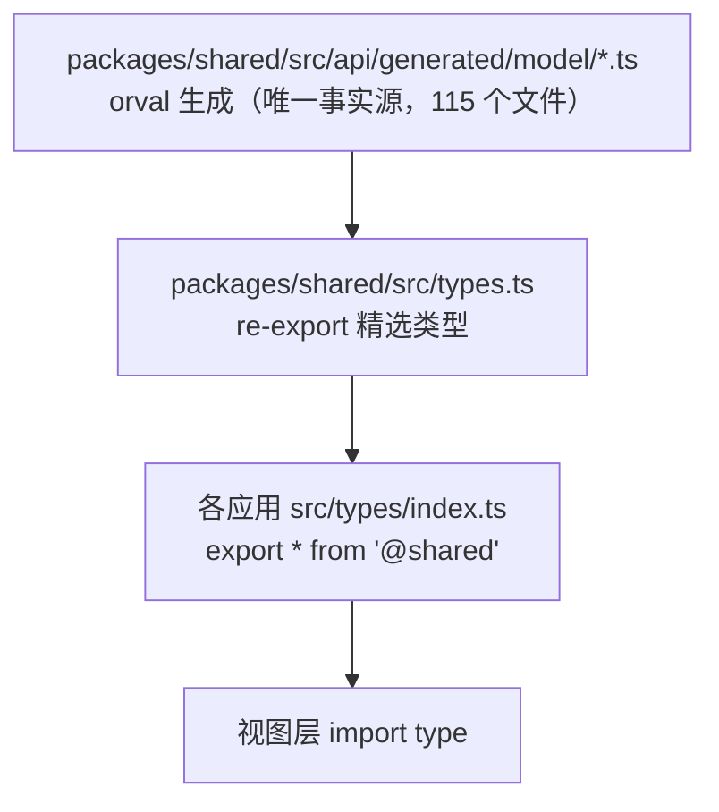
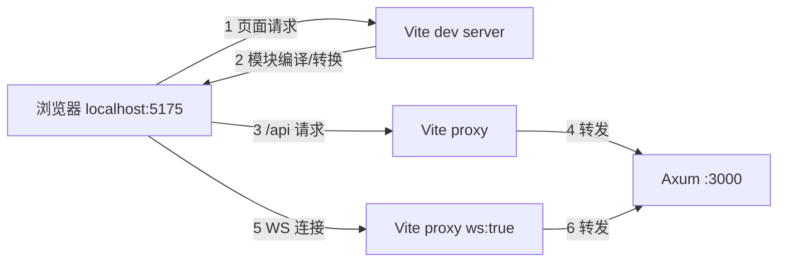
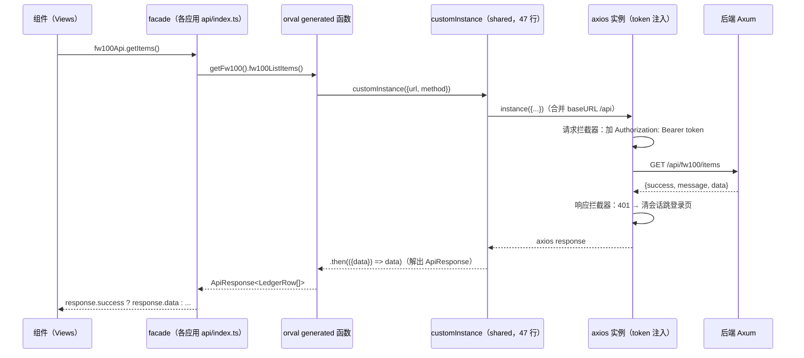
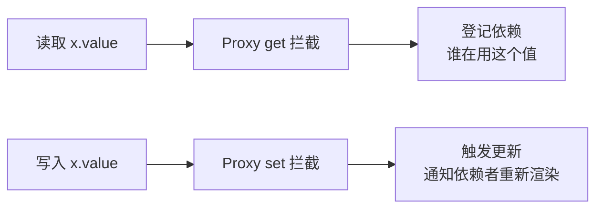
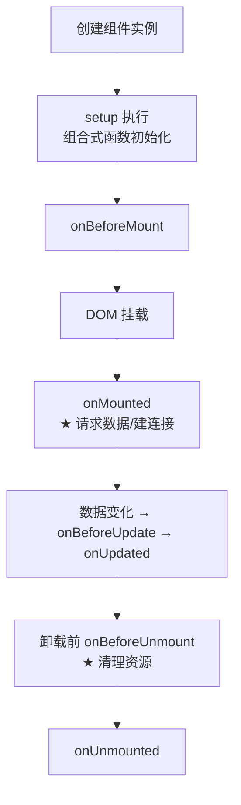
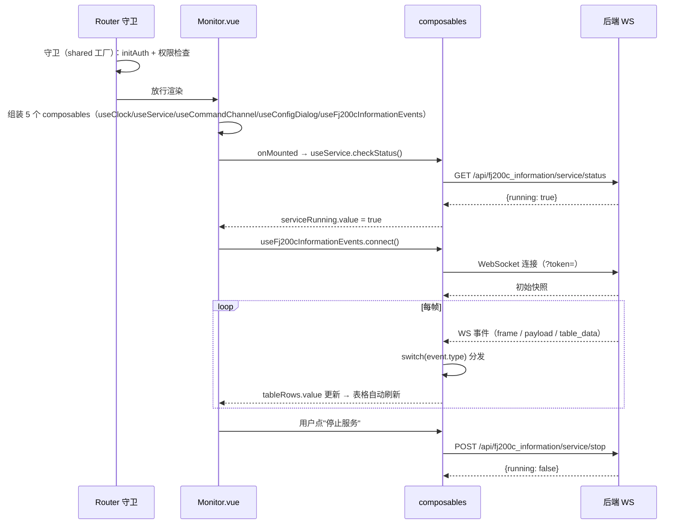

# 04 Vue 3 与 TypeScript 语法速成（以本项目代码为教材）

> 适用对象：Vue 零基础或接触过 Vue 2、想快速上手 Vue 3 的新手。
> 教学目标：看懂并修改本项目的 Vue 代码——语法点全部用项目真实代码举例（带文件路径）。本项目前端统一使用 **Vue 3 组合式 API + `<script setup>` + TypeScript**，没有 Vue 2 风格的选项式代码，学起来更统一。
> 项目现状：**8 个前端应用**（admin / fj200c_information / fj200c_main / fw100 / fw150 / ftj1c / city3d / protocol_generator），共享包 `packages/shared/`（简称 `@shared`）承载全部公共代码。
> 全文约 1.6 万字，建议 4~6 小时消化。

---

## 4.1 先建立 Vue 3 的心智模型

### 4.1.1 Vue 的核心概念三件套

| 概念 | 一句话 | 类比（Rust/其他） |
|---|---|---|
| 响应式状态 | 数据变了，界面自动更新 | `ref`/`reactive` ≈ 可观察变量 |
| 模板 | 用声明式写法描述界面 | 类似 JSX/模板字符串，但有编译期优化 |
| 组件 | 可复用的界面单元 | 类似函数/模块，但自带模板和状态 |

**本项目的页面流**：Vue Router 把 URL 映射到组件 → 组件在 `<script setup>` 里定义状态与逻辑 → 模板里渲染 → 用户交互触发事件/请求 → 状态更新 → 界面自动刷新。

### 4.1.2 一个组件长什么样（本项目真实例子）

```vue
<!-- frontend/fw100/src/fw100/views/Panel.vue（14 行，全项目最小页面） -->
<template>
  <LedgerPanel role-key="fw100" permission-key="fw100:monitor" :api="fw100Api" />
</template>

<script lang="ts" setup>
import { LedgerPanel } from "@shared";
import { fw100Api } from "@/api";
</script>
```

**这就是一个完整组件**：逻辑在 `<script setup>`，界面在 `<template>`。别看它小，它同时展示了 Vue 3 的几个核心概念：组件复用（`LedgerPanel` 从 `@shared` 导入即用）、props 传参（`role-key` / `permission-key` / `:api`）、模块导入（`fw100Api` facade）。

真正的"业务"全在共享组件里：

```vue
<!-- packages/shared/src/template/LedgerPanel.vue（151 行，fw100 / fw150 共用） -->
<el-table v-loading="loading" :data="items" border size="small" stripe>
  <el-table-column label="编号" prop="id" width="120"/>
  <el-table-column label="名称" prop="name"/>
  <el-table-column label="类别" prop="category" width="140"/>
  <el-table-column label="状态" prop="status" width="120">
    <template #default="{ row }">
      <el-tag :type="row.status === '在线' ? 'success' : 'info'" size="small">
        {{ row.status }}
      </el-tag>
    </template>
  </el-table-column>
</el-table>
```

```ts
const props = defineProps<{
  roleKey: string;        // "fw100" / "fw150"
  permissionKey: string;  // "fw100:monitor"
  api: LedgerPanelApi;    // 鸭子类型：只要带 getItems() 就行
}>();

const items = ref<LedgerRow[]>([]);
const loading = ref(false);

onMounted(async () => {
  loading.value = true;
  try {
    const response = await props.api.getItems();
    items.value = response.data ?? [];
  } catch (error: any) {
    errorMessage.value = error?.response?.data?.message || "台账加载失败";
  } finally {
    loading.value = false;
  }
});
```

它包含了 Vue 3 的 90% 核心语法：`ref`、`onMounted`、模板指令（`v-loading`/`:data`/`v-for`/`#default="{ row }"`）、props 类型化、可选链 `?.` 与空值合并 `??`。

---

## 4.2 模板语法（template）

### 4.2.1 插值与指令速查

```vue
<!-- 插值：{{ }} 内是 JS 表达式 -->
<span>{{ user?.username }}</span>
<span>{{ items.length }} 条记录</span>

<!-- 指令（v- 开头）： -->
<el-input v-model="form.email" />        <!-- v-model：双向绑定（表单） -->
<el-table :data="items" />               <!-- :prop：绑定属性（:data = v-bind:data） -->
<button @click="handleLogin">登录</button> <!-- @click：事件绑定（@click = v-on:click） -->
<div v-if="loading">加载中</div>          <!-- v-if：条件渲染 -->
<div v-show="visible">显示</div>          <!-- v-show：CSS 显示/隐藏 -->
<li v-for="item in items" :key="item.id"> <!-- v-for：列表渲染（必须 :key） -->
<span v-html="content" />                <!-- v-html：渲染 HTML（慎用 XSS） -->
<button :disabled="!hasPerm">保存</button> <!-- :disabled：布尔绑定 -->
```

**本项目常用指令清单**（Element Plus 组件 + Vue 指令组合）：

| 指令/绑定 | 项目例子 | 位置 |
|---|---|---|
| `v-model` | 登录表单、配置编辑器、搜索框 | LoginPage.vue（shared）、Config.vue |
| `v-for + :key` | 菜单遍历、卡片遍历、表格行 | AppNavbar.vue（shared）、ftj1c Monitor |
| `v-if / v-else` | 登录页/主页面切换、空态 | AppShell.vue、各视图 |
| `:loading` | 表格加载态 | Users.vue、LedgerPanel.vue |
| `@click` | 按钮事件 | 所有页面 |
| `@command` | 下拉菜单选择 | AppNavbar.vue |
| `:style` / `:class` | 动态样式 | 仪表盘、主题切换 |
| `@submit.prevent` | 表单提交拦截 | LoginPage.vue |

### 4.2.2 模板里的语法糖

```vue
<!-- 简写对照 -->
<el-input v-bind:model-value="x" />   <!-- 完整 -->
<el-input :model-value="x" />          <!-- 简写（项目统一用简写） -->
<button v-on:click="f">x</button>      <!-- 完整 -->
<button @click="f">x</button>          <!-- 简写 -->

<!-- 动态组件 -->
<component :is="currentView" />

<!-- 插槽（slot）：父组件向子组件注入内容 -->
<AppNavbar>
  <template #actions>                  <!-- 具名插槽：nav-actions 区域 -->
    <el-button @click="save">保存数据</el-button>
  </template>
</AppNavbar>
```

**插槽是 AppNavbar 的应用扩展点**：`<slot name="actions">` 让每个应用在导航栏右侧放自定义按钮。全项目只有 fj200c_main 用到——它的自定义 App.vue（128 行）通过 `#actions` 把"保存数据/停止保存、模拟运行/停止模拟、深色/浅色主题"三个按钮塞进共享导航栏：

```vue
<!-- frontend/fj200c_main/src/App.vue（节选） -->
<AppNavbar v-if="!isLoginPage">
  <template #actions>
    <el-button
        :type="dashboardStore.isRecording ? 'danger' : 'primary'"
        size="small" @click="onToggleRecording">
      {{ dashboardStore.isRecording ? '停止保存' : '保存数据' }}
    </el-button>
    <el-button :type="dashboardStore.isSimulating ? 'warning' : 'success'"
        size="small" @click="onToggleSimulation">
      {{ dashboardStore.isSimulating ? '停止模拟' : '模拟运行' }}
    </el-button>
    <el-button size="small" @click="toggleTheme">
      {{ isDark ? '浅色主题' : '深色主题' }}
    </el-button>
  </template>
</AppNavbar>
```

---

## 4.3 响应式核心：ref / reactive / computed / watch

### 4.3.1 ref：单个值（最常用）

```ts
import { ref } from 'vue'

const loading = ref(false)        // 创建响应式值
loading.value = true              // ★ 读取/修改必须 .value（模板中自动解包）
console.log(loading.value)
```

**为什么有 `.value`**：`ref` 把值包进一个对象（`.value` 属性），这样 JS 的基础类型（number/string/bool）也能被 Vue 追踪。**在模板里不用写 `.value`**（自动解包），在 `<script setup>` 里必须写。

```ts
// 项目实例：ftj1c Monitor.vue 的服务状态
const serviceRunning = ref(false)
const startService = async () => {
  const res = await ftj1cApi.startService()
  serviceRunning.value = res.success
}
```

### 4.3.2 reactive：对象（整体响应式）

```ts
import { reactive } from 'vue'

const form = reactive({          // 对象字段都是响应式的
  email: '',
  password: '',
})
form.email = 'admin@7304.com'    // 直接改字段，无需 .value
```

### 4.3.3 ref vs reactive 怎么选（项目约定）

| 场景 | 用 |
|---|---|
| 单个值（数字/布尔/字符串） | `ref` |
| 数组 | `ref`（项目统一 `ref<Type[]>([])`） |
| 表单对象（字段级操作） | `reactive` |
| 复杂嵌套对象 | `reactive` |

**项目铁律**：数组一律 `ref<Type[]>([])`（不要 `reactive([])`——历史坑）。看 fj200c_main 的 dashboard store：

```ts
// frontend/fj200c_main/src/fj200c_main/store/dashboard.ts
const ecuData = reactive<EcuFields>({ /* 28+ 个字段，含 faultCodes 27 个布尔位 */ })  // 对象 → reactive
const chartData = ref<Array<{time: string; value: number}>>([])  // 数组 → ref
const isSimulating = ref(false)                              // 布尔 → ref
```

**唯一的例外**：`envParams` 环境参数表用 `reactive<EnvParameter[]>`（8 项初始化后只改 `item.value`，从不整体替换数组）——理解例外比背规则更重要。

### 4.3.4 computed：派生状态

```ts
import { computed } from 'vue'

// 依赖其他响应式值自动重算（缓存）
const hasUsers = computed(() => items.value.length > 0)
const displayName = computed(() => user.value?.username || '游客')
```

```ts
// 项目实例：AppShell.vue 判断登录页（computed 读取 route）
const isLoginPage = computed(() => route.path.startsWith('/login'))
```

**computed vs 函数**：computed 有缓存（依赖不变不重算）；普通函数每次调用都执行。模板里频繁读取的派生值用 computed。

### 4.3.5 watch：监听变化

```ts
import { watch } from 'vue'

watch(serviceRunning, (val) => {   // 监听 ref
  console.log('服务状态变为', val)
})

watch([a, b], ([na, nb]) => {})    // 监听多个
watch(() => route.path, () => {    // 监听 getter 表达式
  // 路由变化时做什么
}, { immediate: true })            // 立即执行一次
```

### 4.3.6 模板中直接可用的全局对象

```vue
<span>{{ import.meta.env.PROD ? '/fj200c_information' : '/' }}</span>
```

`import.meta.env` 是 Vite 注入的环境对象：`DEV`/`PROD`/`MODE`/自定义 `VITE_*` 变量。

---

## 4.4 `<script setup>` 详解（本项目的统一写法）

### 4.4.1 为什么用 script setup

Vue 3 的组合式 API 有两种载体：`setup()` 函数和 `<script setup>`（编译器语法糖）。本项目 100% 用 `<script setup>`——顶层声明的变量/函数**自动暴露给模板**，不用 return。

### 4.4.2 组件导入即用

```vue
<script setup lang="ts">
import CommandPanel from '@/fj200c_information/components/CommandPanel.vue'
import { LedgerPanel } from '@shared'   // 共享组件同样导入即用
// 导入的组件在模板中直接可用（无需注册）
</script>
<template>
  <CommandPanel />
  <LedgerPanel role-key="fw100" permission-key="fw100:monitor" :api="fw100Api" />
</template>
```

### 4.4.3 props 与 emits（组件通信）

```vue
<!-- frontend/fj200c_information/src/fj200c_information/components/CommandRow.vue（70 行，真实代码） -->
<script lang="ts" setup>
import type { Ref } from "vue";

// props：父组件传入的数据（只读），类型化声明
defineProps<{
  channel: {
    cmdType: Ref<string>;       // 注意：传的是 Ref，模板中自动解包
    cmdData: Ref<string>;
    cmdOptions: string[];
    sendCommand: () => Promise<void>;
  };
  disabledType: boolean;
  disabledData: boolean;
  label: string;
}>();
</script>
<template>
  <div class="cmd-row">
    <el-select v-model="channel.cmdType.value" :disabled="disabledType" size="small" style="width: 130px">
      <el-option v-for="opt in channel.cmdOptions" :key="opt" :label="opt" :value="opt" />
    </el-select>
    <el-input v-model="channel.cmdData.value" :disabled="disabledData" size="small" style="width: 180px" />
    <el-button size="small" type="primary" @click="channel.sendCommand()">{{ label }}</el-button>
  </div>
</template>
```

**本项目 props/emits 类型化写法**：`defineProps<{...}>()` 泛型 + `withDefaults` 默认值 + `defineEmits<{...}>()` 事件签名——全程 TypeScript 类型检查，写错类型直接编译报错。看共享登录页：

```ts
// packages/shared/src/template/LoginPage.vue（688 行中的 props 部分）
const props = withDefaults(
    defineProps<{
      title?: string;
      subtitle?: string;
      footerText?: string;
      appKind?: "user" | "admin";
    }>(),
    {
      title: "用户登录",
      subtitle: "欢迎回来",
      footerText: "账号由管理员创建并分配角色",
      appKind: "user",
    },
);
```

### 4.4.4 生命周期钩子

```ts
import { onMounted, onUnmounted, onBeforeUnmount } from 'vue'

onMounted(() => {        // 组件挂载后（请求数据、建立连接）
  authStore.initAuth()
  connectWs()
})
onUnmounted(() => {      // 组件卸载前（清理）
  disconnectWs()
  clearInterval(timer)
})
```

**项目中的生命周期使用场景**：

| 钩子 | 项目用途 | 位置 |
|---|---|---|
| `onMounted` | 拉数据、建 WS、起轮询 | 所有视图 |
| `onUnmounted` | 断 WS、清定时器 | useFj200cInformationEvents 等 |
| `onScopeDispose` | 组合式函数内清理（推荐替代 onUnmounted） | useCityData.ts |

---

## 4.5 TypeScript 速成（本项目用法）

### 4.5.1 类型注解基础

```ts
const email: string = 'admin@7304.com'
const count: number = 42
const isDark: boolean = true
const items: LedgerRow[] = []            // 类型来自共享包

function fetchItems(): Promise<{ success: boolean; data?: LedgerRow[] }> { ... }
```

### 4.5.2 接口与类型别名

```ts
// 接口：对象的形状（本项目 MenuItem 手写于 shared/types.ts，纯前端导航概念）
interface MenuItem {
  id: string
  title: string
  path: string
  icon: string                           // 必填（Element Plus 图标名）
  permissions: Permission[]              // 权限点列表
  children?: MenuItem[]                  // 子菜单（递归）
}

// 类型别名：联合类型/复杂类型（WS 事件协议，手写于各应用 api 目录）
type Fj200cInformationEvent =
  | { type: 'frame'; connection_index: number; hex: string; frame_type: string; fields: string[] }
  | { type: 'payload'; connection_index: number; hex: string }
  | { type: 'table_data'; connection_index: number; rows: TableRow[] }
```

### 4.5.3 联合类型与类型收窄（WS 事件分发核心）

```ts
// 后端枚举（serde tag）生成的联合类型：按 type 字段分发
const handleEvent = (event: Fj200cInformationEvent) => {
  switch (event.type) {
    case 'frame':         // 收窄：这里 event 自动变成 frame 的形状
      lastFrameHex.value = event.hex
      lastFrameType.value = event.frame_type
      break
    case 'payload':
      payloadLog.value.unshift({ time: padTime(new Date()), hex: event.hex })
      break
    case 'table_data':
      tableRows.value = event.rows
      break
  }
}
```

**判别联合（discriminated union）**是前后端事件协议在 TS 侧的体现——后端 `#[serde(tag="type")]` 枚举 ↔ 前端 TS 联合类型，天然对应。

### 4.5.4 泛型与工具类型

```ts
// 泛型函数：T 由调用方决定
function wrap<T>(data: T): ApiResponse<T> { ... }

// 内置工具类型
type UserId = string
type MaybeUser = User | null
type UserFields = keyof User              // 字段名联合
type PartialUser = Partial<User>          // 全部可选
type ReadonlyUser = Readonly<User>        // 全部只读
```

### 4.5.5 项目类型体系（三层 re-export）



**新手规则**：类型从哪里来？→ 一律从 `@shared` 或 `@shared/api/generated` 导入；**绝不手写**与后端重复的类型定义（例如 `User`、`LoginRequest`、`Permission` 全部 re-export 自 generated，后端 DTO 变更后跑 `npm run gen:api` 自动同步）。

### 4.5.6 项目 tsconfig 严格模式（写代码时注意）

```json
{
  "compilerOptions": {
    "strict": true,                // 全严格：null 检查等
    "noUnusedLocals": true,        // 未使用变量报错
    "noUnusedParameters": true,    // 未使用参数报错
    "noEmit": true,                // 只检查不输出
    "moduleResolution": "bundler",
    "paths": {
      "@/*": ["src/*"],
      "@shared": ["../../packages/shared/src/index.ts"],
      "@shared/*": ["../../packages/shared/src/*"]
    }
  }
}
```

**新手最常见的三个报错**：
1. 声明了没用的变量 → 删掉（noUnusedLocals）。
2. `strict` 下 null 处理：`user?.name` 或 `user!.name`（非空断言，慎用）。
3. import 路径写错 → 用 `@/` 和 `@shared` 别名。

---

## 4.6 Pinia 状态管理（本项目用法）

### 4.6.1 什么是 Pinia

Pinia 是 Vue 3 官方状态管理库：跨组件共享的状态（用户信息、权限、业务数据）。

### 4.6.2 创建 store 的两种风格

```ts
// 选项式（Vuex 风格）
export const useStore = defineStore('id', {
  state: () => ({ count: 0 }),
  getters: { double: (s) => s.count * 2 },
  actions: { inc() { this.count++ } },
})

// 组合式（setup 风格）——本项目用这个
export const useDashboardStore = defineStore('fj200c_main-dashboard', () => {
  const ecuData = reactive<EcuFields>({ ... })
  const isSimulating = ref(false)
  const dashboardState = computed(() => ({ ... }))
  function addChartPoint() { ... }
  return { ecuData, isSimulating, dashboardState, addChartPoint }  // 暴露出去
})
```

### 4.6.3 组件中使用 store

```ts
import { useDashboardStore } from '@/fj200c_main/store/dashboard'
const store = useDashboardStore()       // 必须在 setup 顶层调用
console.log(store.ecuData.ngSpeed)
store.addChartPoint()
```

### 4.6.4 store-to-refs：解构保持响应式

```ts
import { storeToRefs } from 'pinia'
const { ecuData, isSimulating } = storeToRefs(store)   // refs 解构
const { addChartPoint } = store                        // 方法直接解构
```

**重要**：直接 `const { ecuData } = store` 会**丢失响应式**（拿的是快照）；用 `storeToRefs` 包装。

### 4.6.5 本项目的 store 家族

| store | 应用 | 内容 |
|---|---|---|
| `useAuthStore`（createAuthStore 工厂生成） | 所有应用 | 用户/权限/菜单/登录退出（每个应用仅 17 行配置） |
| `useDashboardStore` | fj200c_main | ECU/ADAM4015/ADAM4117/Dyno/Flux 五路数据 + 环境参数 8 项 + 图表缓冲 |

**auth store 工厂**（`packages/shared/src/stores/auth.ts`，228 行）是本章重点：

```ts
// 各应用 stores/auth.ts（以 fw100 为例，仅 17 行）
export const useAuthStore = createAuthStore({
  id: "auth-fw100",          // ★ store id 各应用必须不同
  appKind: "user",           // "user"=用户端 / "admin"=管理端（决定菜单来源）
  allowedRoles: ["fw100"],   // 只放行本应用角色
  authApi,                   // 认证 API（由应用注入）
});
registerAuthStoreGetter(() => useAuthStore());  // 登记到 shared 注册表
```

```ts
// shared 工厂内部：isAuthenticated = token + user + allowedRoles 三重校验
const isAuthenticated = computed(
  () => !!token.value && !!user.value && allowedRoles.includes(user.value.role)
);
```

**公共组件怎么拿到当前应用的 store**：`AppNavbar`/`LoginPage`/`AppShell` 通过 `getAppAuthStore()` 取注册表里的实例，完全解耦：

```ts
// AppShell.vue（shared/template/）里的用法
const authStore = getAppAuthStore<AppAuthStore>()
onMounted(() => { authStore?.initAuth() })
```

**项目状态管理很轻**：业务 store 只有 dashboard 一个，大部分状态就在组件内；auth 由工厂统一管理，靠参数（id/appKind/allowedRoles）差异化 8 个应用。

---

## 4.7 Vue Router（路由与守卫）

### 4.7.1 路由表（本项目用 createAppRouter 工厂）

每个应用的路由文件**不再手写守卫**，只保留自己的 routes 数组，交给共享工厂：

```ts
// frontend/fw100/src/router/index.ts（46 行，全项目最简单）
import { useAuthStore } from "@/stores/auth";
import { Permission, createAppRouter } from "@shared";

const router = createAppRouter({
  app: "fw100",              // 应用名：决定生产 base 前缀 /fw100/
  useAuthStore,              // 传入本应用 auth store
  routes: [
    { path: "/", redirect: "/login" },
    { path: "/login", name: "Login",
      component: () => import("@/views/Login.vue"),
      meta: { requiresGuest: true } },                    // 游客才能进
    { path: "/fw100", name: "Fw100Panel",
      component: () => import("@/fw100/views/Panel.vue"),
      meta: { requiresAuth: true,                         // 需要登录
              permissions: [Permission.Fw100Monitor] } }, // 需要权限
    { path: "/:pathMatch(.*)*", redirect: "/login" },     // 兜底
  ],
});
```

**meta 字段是路由权限契约**：`requiresAuth`（要登录）+ `permissions`（权限点数组，任一满足即可）。

### 4.7.2 路由守卫（在 shared/router.ts 里，一次实现 8 应用共用）

```ts
// packages/shared/src/router.ts（102 行）中的守卫核心
router.beforeEach(async (to, _from, next) => {
  const authStore = useAuthStore();

  await authStore.initAuth();                      // ① 确保认证状态就绪

  if (to.meta.requiresAuth && !authStore.isAuthenticated) {
    next("/login"); return;                        // ② 未登录 → 登录页
  }

  if (to.meta.requiresGuest && authStore.isAuthenticated) {
    next(homePath); return;                        // ③ 已登录访问登录页 → 首页
  }

  if (to.meta.permissions) {
    const requiredPermissions = to.meta.permissions as Permission[];
    const hasPermission = requiredPermissions.some((p) =>
      authStore.hasPermission(p)
    );                                             // ④ 任一权限满足即放行
    if (!hasPermission) {
      if (options.noPermission === "403") {
        next("/403"); return;                      // admin：跳无权限页
      }
      const menus = getMenusByRole(authStore.userRole, "user");
      const fallback = menus[0]?.children?.[0]?.path ?? menus[0]?.path;
      next(fallback ?? "/login");                  // 用户端：回跳首个菜单
      return;
    }
  }
  next();                                          // ⑥ 放行
});
```

**工厂参数**：

| 参数 | 默认 | 说明 |
|---|---|---|
| `app` | 必填 | 应用名，生产 base = `/${app}/`，homePath 默认 `/${app}` |
| `routes` | 必填 | 应用专属路由表 |
| `useAuthStore` | 必填 | 本应用 auth store（守卫用） |
| `homePath` | `/${app}` | 已登录访问 /login 时跳的首页；admin 传 `/users` |
| `noPermission` | `"menu"` | 无权限策略：`"menu"` 回跳首个菜单 / `"403"` 跳 /403（admin） |

**守卫四步口诀**：等认证 → 查登录 → 查权限 → 跳转。

> **历史 bug 教训（必须记住）**：`homePath` 指向的路径**必须存在于路由表**，否则守卫与 404 兜底互相踢皮球形成**死循环**。protocol_generator 角色上线时就踩过（git 提交 a4a7f7c 修复）——改 homePath 前先确认路由表里有这条路。

### 4.7.3 动态导入（懒加载）

```ts
component: () => import('@/xxx/views/xxx.vue')
```

页面按需加载，首屏更快——本项目所有页面都是动态导入（包括从 `@shared` 导入的共享组件：`() => import("@shared/template/TemplatePanel.vue")`）。

---

## 4.8 Element Plus 组件库速查（本项目高频组件）

### 4.8.1 布局与容器

```vue
<el-card class="login-card">                      <!-- 卡片 -->
  <template #header>标题</template>               <!-- 卡片头部插槽 -->
  内容
</el-card>

<el-container>                                    <!-- 布局容器 -->
  <el-header>顶部</el-header>
  <el-main>主体</el-main>
</el-container>
```

### 4.8.2 表单（登录页标准组合）

```vue
<el-form ref="formRef" :model="form" :rules="rules" label-position="top" @submit.prevent="handleLogin">
  <el-form-item label="邮箱" prop="email">
    <el-input v-model="form.email" placeholder="请输入邮箱" />
  </el-form-item>
  <el-form-item label="密码" prop="password">
    <el-input v-model="form.password" type="password" show-password placeholder="请输入密码" />
  </el-form-item>
  <el-button type="primary" :loading="loading" @click="handleLogin">立即登录</el-button>
</el-form>
```

```ts
// 表单校验规则（Element Plus rules，LoginPage.vue 真实代码）
const rules: FormRules = {
  email: [
    { required: true, message: "请输入邮箱", trigger: "blur" },
    { type: "email", message: "请输入正确的邮箱格式", trigger: "blur" },
  ],
  password: [
    { required: true, message: "请输入密码", trigger: "blur" },
    { min: 6, message: "密码长度不能少于6位", trigger: "blur" },
  ],
};
// 校验提交（回调风格）
await formRef.value.validate(async (valid) => {
  if (!valid) return;
  // ...
});
```

### 4.8.3 表格（列表页标准组合）

```vue
<el-table v-loading="loading" :data="users" stripe border>
  <el-table-column prop="username" label="用户名" />
  <el-table-column prop="email" label="邮箱" />
  <el-table-column label="角色">
    <template #default="{ row }">               <!-- 作用域插槽：拿当前行 -->
      {{ findRole(row.role)?.name ?? row.role }}
    </template>
  </el-table-column>
  <el-table-column label="操作" width="180">
    <template #default="{ row }">
      <el-button size="small" @click="openEdit(row)">编辑</el-button>
      <el-button size="small" type="danger" @click="removeUser(row)">删除</el-button>
    </template>
  </el-table-column>
</el-table>
```

### 4.8.4 弹窗与消息

```vue
<el-dialog v-model="dialogVisible" title="编辑角色" width="400px">
  <el-select v-model="editForm.role">
    <el-option v-for="r in roles" :key="r.key" :label="r.name" :value="r.key" />
  </el-select>
  <template #footer>
    <el-button @click="dialogVisible = false">取消</el-button>
    <el-button type="primary" @click="saveEdit">确定</el-button>
  </template>
</el-dialog>
```

```ts
import { ElMessage } from 'element-plus'
ElMessage.success('登录成功')
ElMessage.error(response.message || '操作失败')
ElMessage.warning('该账号属于其他应用，正在跳转')
```

### 4.8.5 下拉菜单（导航栏用户区）

```vue
<el-dropdown @command="handleCommand">
  <el-avatar :size="32">{{ user?.username?.charAt(0)?.toUpperCase() }}</el-avatar>
  <template #dropdown>
    <el-dropdown-item divided command="logout">退出登录</el-dropdown-item>
  </template>
</el-dropdown>
```

### 4.8.6 本项目 Element Plus 组件使用统计（按频率）

| 组件 | 频率 | 用途 |
|---|---|---|
| el-button / el-input | ★★★★★ | 表单交互 |
| el-table / el-table-column | ★★★★★ | 数据展示 |
| el-form / el-form-item | ★★★★ | 表单校验 |
| el-card | ★★★★ | 内容容器 |
| el-dialog | ★★★ | 编辑弹窗 |
| el-select / el-option | ★★★ | 下拉选择 |
| el-tag / el-badge | ★★★ | 状态标签 |
| el-dropdown | ★★ | 菜单 |
| el-avatar | ★★ | 用户头像 |
| el-switch / el-radio / el-checkbox | ★ | 开关/单选/复选 |

---

## 4.9 WebSocket 前端连接（项目两种模式）

### 4.9.1 连接地址构建（shared 公共函数）

```ts
// packages/shared/src/session.ts（253 行）
export function buildWebSocketUrl(apiPath: string): string {
  const token = getSessionToken() || "";
  const protocol = window.location.protocol === "https:" ? "wss" : "ws";
  return `${protocol}://${window.location.host}${apiPath}?token=${encodeURIComponent(token)}`;
}
```

- 协议按页面协议自动选 `wss`/`ws`（部署 HTTPS 时自动安全）。
- token 走**查询参数**（浏览器 WS API 无法自定义 header，后端 handler 内校验 `?token=`）。

各应用在自己 api facade 里包装一条带路径的版本：

```ts
// frontend/fj200c_information/src/fj200c_information/api/fj200c_information.ts
buildWebSocketUrl(): string {
  return sharedBuildWebSocketUrl("/api/fj200c_information/ws");
}
```

### 4.9.2 模式一：组件级连接（fj200c_information / ftj1c）

```ts
// frontend/fj200c_information/src/fj200c_information/composables/useFj200cInformationEvents.ts
const connected = ref(false)
let ws: WebSocket | null = null
let reconnectTimer: number | null = null
let manualClose = false

const connect = () => {
  if (ws || connecting.value) return   // 避免重复连接
  manualClose = false
  connecting.value = true
  ws = new WebSocket(fj200c_informationApi.buildWebSocketUrl())

  ws.onopen = () => { connected.value = true; connecting.value = false }
  ws.onmessage = (message) => {
    try {
      const data = JSON.parse(message.data) as Fj200cInformationEvent
      handleEvent(data)               // switch(event.type) 分发
    } catch { /* 忽略非 JSON */ }
  }
  ws.onclose = () => {
    connected.value = false
    connecting.value = false
    ws = null
    if (!manualClose) {
      reconnectTimer = window.setTimeout(connect, 1500)   // ★ 1.5s 自动重连
    }
  }
  ws.onerror = () => ws?.close()
}

const disconnect = () => {
  manualClose = true
  if (reconnectTimer) { clearTimeout(reconnectTimer); reconnectTimer = null }
  ws?.close()
  ws = null
  connected.value = false
}

onUnmounted(disconnect)   // 组件卸载自动断开
```

**组件级连接的生命周期**：`onMounted(connect)` + `onUnmounted(disconnect)`——**离开页面断开**。适合"单页面使用 WS"的应用。

### 4.9.3 模式二：模块级单例连接（fj200c_main，5 路串口）

```ts
// frontend/fj200c_main/src/fj200c_main/composables/useBackendPorts.ts（194 行）
// 模块级变量（不随组件销毁）——★ 这是"单例"的本质
let sharedWs: WebSocket | null = null
let reconnectTimer: number | null = null
let manualClose = false
let refCount = 0        // 引用计数

export function useBackendPorts() {
  // 页面挂载时 acquire：计数 +1 并确保连接
  const acquire = () => { refCount++; manualClose = false; connect() }
  // 页面卸载时 release：计数 -1，归零才真正断开
  const release = () => {
    refCount = Math.max(0, refCount - 1)
    if (refCount > 0) return
    manualClose = true
    if (reconnectTimer) { clearTimeout(reconnectTimer); reconnectTimer = null }
    sharedWs?.close()
    sharedWs = null
  }
  onMounted(acquire)
  onUnmounted(release)
}
```

**为什么 fj200c_main 用单例**：仪表盘 Monitor 页 + 试验查看 ExperimentView 页都要收数据，组件级连接会导致**切页断线、数据冻结**（git 历史里的真实 bug）。引用计数让多个页面共享一个连接，最后离开的才断开。更进一步：**App.vue 挂载时也调一次 `useBackendPorts()`**（应用级常驻连接，App 不卸载故永不断连），保证任何页面都能实时收数据。

**连接后首帧是快照数组**（5 个 PortData），之后是单个事件对象：

```ts
function handleMessage(data: unknown) {
  if (Array.isArray(data)) {
    for (const item of data) handleEvent(item as Fj200cMainWsEvent)  // 快照数组
  } else {
    handleEvent(data as Fj200cMainWsEvent)
  }
}
```

### 4.9.4 两种模式选择建议

| 场景 | 模式 |
|---|---|
| 只有一个页面用 WS | 组件级（简单） |
| 多个页面都要实时数据 | 模块级单例 + 引用计数 |
| 全应用都要（含未打开任何页面时也要收） | App.vue 挂载时建立（fj200c_main） |

### 4.9.5 消息分发模式（handleEvent + 5 路 switch）

```ts
// fj200c_main：connection_index 0~4 对应五路串口
function handlePortData(event: PortDataEvent) {
  const { connection_index, fields, hex } = event
  switch (connection_index) {
    case 0: if ('Ecu' in fields) handleEcu(store, fields.Ecu, hex); break
    case 1: if ('Adam4015' in fields) handleAdam4015(store, fields.Adam4015, hex); break
    case 2: if ('Adam4117' in fields) handleAdam4117(store, fields.Adam4117, hex); break
    case 3: if ('Dyno' in fields) handleDyno(store, fields.Dyno, hex); break
    case 4: if ('Flux' in fields) handleFlux(store, fields.Flux, hex); break
  }
}

function handleEvent(event: Fj200cMainWsEvent) {
  switch (event.type) {
    case 'port_data':         handlePortData(event); break
    case 'simulation_state':  store.isSimulating = event.simulating; break
    case 'theme_state':       applyTheme(event.isDark); break
    case 'csv_recording_state': store.isRecording = event.recording; break
  }
}
```

**一个原则**：WS 事件只做"写 store / 更新 ref"，不做 UI 直接操作——渲染交给模板自动响应。

---

## 4.10 ECharts 可视化（fj200c_information / fj200c_main）

### 4.10.1 基本用法

```ts
// frontend/fj200c_information/src/fj200c_information/views/Visual.vue（284 行，6 仪表+曲线）
import * as echarts from 'echarts'
import { onMounted, onUnmounted, ref } from 'vue'

const chartRef = ref<HTMLDivElement | null>(null)
let chart: echarts.ECharts | null = null

onMounted(() => {
  chart = echarts.init(chartRef.value!)           // 初始化（绑定 DOM）
  chart.setOption({
    series: [{
      type: 'gauge',                              // 仪表盘
      data: [{ value: 70, name: '转速' }],
    }],
  })
})

onUnmounted(() => { chart?.dispose() })           // 必须销毁（内存泄漏预防）

// 数据更新：setOption 增量合并（不要每次重建图表）
const updateData = (value: number) => {
  chart?.setOption({ series: [{ data: [{ value }] }] })
}
```

### 4.10.2 实时曲线的数据流（与 WS 协作）

```ts
// 环形缓冲：最多 100 个点
const chartData = ref<Array<{ time: string; value: number }>>([])
const addPoint = (v: number) => {
  chartData.value.push({ time: new Date().toLocaleTimeString(), value: v })
  if (chartData.value.length > 100) chartData.value.shift()   // 超长截断
  chart?.setOption({ xAxis: { data: chartData.value.map(p => p.time) }, ... })
}
```

### 4.10.3 图表类型清单（本项目）

| 图表 | 用途 | 位置 |
|---|---|---|
| gauge（仪表盘） | 转速/温度/功率等 6 个仪表 | Visual.vue、GaugeCard.vue |
| line（折线） | 实时曲线 | Visual.vue、ChartPanel.vue |
| bar（柱状） | 状态统计（少量） | 报表页 |

**进阶：GaugeCard 的颜色段走 CSS 变量**——`getComputedStyle(document.documentElement)` 读 `--gauge-color-1..4`，主题切换时变量变了，表盘颜色自动重绘（`ResizeObserver` 自适应 + 监听 `screen-resize`/`theme-changed` 全局事件）。

**新手注意**：ECharts 实例要随组件销毁 `dispose()`；`setOption` 是增量合并，重复调用安全；WebSocket 高频数据要节流再 setOption。

---

## 4.11 组合式函数（composables）：本项目逻辑复用的核心

### 4.11.1 什么是组合式函数

组合式函数（composable）是**以 `useXxx` 命名的函数，内部可组合 ref/computed/watch/生命周期**，把可复用逻辑抽出来。类似 React 的 Hooks。

### 4.11.2 项目中的组合式函数清单

| 函数 | 位置 | 职责 |
|---|---|---|
| `useResponsive` / `useLayoutConfig` | **shared/responsive.ts**（147 行） | 断点检测 + 布局配置 |
| `useClock` | fj200c_information | 每秒更新的时钟 |
| `useService` | fj200c_information | 服务启停 + 3 秒轮询状态 |
| `useCommandChannel` | fj200c_information | 命令通道状态与发送 |
| `useConfigDialog` | 多个应用 | 配置读写对话框逻辑 |
| `useFj200cInformationEvents` | fj200c_information | WS 连接与事件分发 |
| `useBackendPorts` | fj200c_main | 模块级单例 WS（5 路） |
| `useTheme` | fj200c_main | 深浅主题切换（theme-changed 事件） |
| `useWindowScale` | fj200c_main / ftj1c | 1920×1080 设计稿窗口缩放 |
| `useCityData` | city3d | 数据加载 + 5 秒轮询 |
| `useCityScene` | city3d | Three.js 场景（1200 行） |

### 4.11.3 组合式函数范例（useClock，完整版）

```ts
// frontend/fj200c_information/src/fj200c_information/composables/useClock.ts（45 行）
import { onUnmounted, ref } from "vue";

export function useClock() {
  /** 当前时间（每秒更新触发响应式） */
  const now = ref(new Date());

  /** 每秒更新一次时间 */
  const timer = setInterval(() => {
    now.value = new Date();
  }, 1000);

  /** 组件卸载时清除定时器 */
  onUnmounted(() => clearInterval(timer));

  /** 格式化时间为 "YYYY-MM-DD HH:mm:ss" 格式 */
  const formatted = () => {
    const d = now.value;
    const pad = (n: number) => String(n).padStart(2, "0");
    return `${d.getFullYear()}-${pad(d.getMonth() + 1)}-${pad(d.getDate())} ${pad(d.getHours())}:${pad(d.getMinutes())}:${pad(d.getSeconds())}`;
  };

  return { now, formatted };
}
```

**组合式函数三定律**（项目全部遵守）：
1. 命名 `useXxx`。
2. 内部创建的资源（定时器/WS/监听器）在 `onUnmounted`/`onScopeDispose` 清理。
3. 返回响应式数据 + 方法。

### 4.11.4 一个视图组装多个组合式函数（Monitor.vue 模式）

```ts
// frontend/fj200c_information/src/fj200c_information/views/Monitor.vue（412 行，逻辑高度复用）
const { now, formatted } = useClock()
const { serviceRunning, startService, stopService } = useService()
const { channels, addChannel, removeChannel, send } = useCommandChannel()
const { configDialog, openConfig, saveConfig } = useConfigDialog()
const { connected, tableRows, payloadLog, lastFrameHex } = useFj200cInformationEvents()
```

**这就是组合式 API 的威力**：页面只是"组装器"，每个关注点一个组合式函数，测试/复用/维护都容易。

---

## 4.12 样式系统：CSS 变量与双主题

### 4.12.1 全局样式组织（已收敛到 shared）

`packages/shared/src/style.css`（326 行）承载 6 个应用的全局基础样式（CSS 变量 + 全局基础样式），各应用 main.ts 一行引入：

```ts
// frontend/fw100/src/main.ts（24 行）
import "@shared/style.css";
```

**例外**（保留本地样式）：
- **city3d**：暗黑变体 `src/style.css`（182 行，body #0a0e1a），因为 3D 场景是纯黑底。
- **fj200c_main**：本地 `src/style.css`（48 行）+ `src/fj200c_main/styles/theme.css`（205 行，暗/亮 CSS 变量），因为仪表盘需要两套主题变量。

### 4.12.2 双主题变量（fj200c_main 的 theme.css）

```css
/* frontend/fj200c_main/src/fj200c_main/styles/theme.css —— 暗/亮两套 CSS 变量 */
html.theme-dark {
  --bg-primary: #0f1d33;        /* 深色主题底色 */
  --bg-card: #1a2940;
  --text-primary: #e5eaf3;
  --border-color: #303133;
  --gauge-color-1: #3d8bfd;     /* 表盘颜色段（ECharts 读取） */
}
html.theme-light {
  --bg-primary: #f5f7fa;        /* 浅色主题覆盖 */
  --bg-card: #ffffff;
  --text-primary: #303133;
  --border-color: #dcdfe6;
}
```

```ts
// useTheme.ts（40 行）：html 根节点加 class 控制主题 + 本地持久化 + 广播事件
export function applyTheme(dark: boolean) {
  isDark.value = dark
  document.documentElement.classList.toggle('theme-dark', dark)
  document.documentElement.classList.toggle('theme-light', !dark)
  document.documentElement.classList.toggle('dark', dark)  // 联动 Element Plus 暗色主题
  localStorage.setItem('theme', dark ? 'dark' : 'light')   // 刷新后仍生效
  const store = useDashboardStore()
  store.isDark = dark
  window.dispatchEvent(new CustomEvent('theme-changed', { detail: { isDark: dark } }))
}
```

**主题机制四件套**：
1. CSS 变量（theme-dark/theme-light 两套）。
2. `localStorage.theme` 本地持久化（刷新恢复）。
3. `theme-changed` 自定义事件广播（GaugeCard 等组件监听后重绘）。
4. 服务端同步（WS `theme_state` 事件 + `setTheme()` 接口，后端 GlobalVar 持久化）——所有页面统一切换。

### 4.12.3 各应用样式文件布局

| 文件 | 内容 |
|---|---|
| `packages/shared/src/style.css` | 全局基础样式（6 应用共享） |
| `src/fj200c_information/fj200c_information.css`（243 行） | 模块专属样式 |
| `src/fj200c_main/styles/theme.css`（205 行） | 双主题变量 |
| `src/city3d/style.css`（182 行） | 暗黑变体 |
| `src/ftj1c/ftj1c.css`（198 行） | 模块专属样式 |

### 4.12.4 Scoped 样式与 :deep

```vue
<style scoped>
/* scoped：样式只作用于本组件（自动加属性选择器） */
.monitor-grid { display: grid; gap: 12px; }

/* :deep()：穿透到子组件内部（改 Element Plus 内部样式） */
:deep(.el-table__row) { cursor: pointer; }
</style>
```

---

## 4.13 前端工程：Vite 开发体验

### 4.13.1 共享 Vite 配置工厂（8 个应用一个工厂）

所有应用的 `vite.config.ts` 都只剩 3 行，配置全部收敛到 `build/vite.base.ts`（71 行）：

```ts
// build/vite.base.ts —— defineAppConfig 工厂
export interface AppConfig {
  app: string;    // 应用名
  port: number;   // dev 端口
  ws?: boolean;   // /api 代理是否转发 WebSocket
}

export function defineAppConfig(opts: AppConfig, appDir: string): UserConfig {
  const isBuild = process.env.NODE_ENV === "production" || process.argv.includes("build");
  return {
    resolve: {
      alias: {
        "@": path.join(appDir, "src"),
        "@shared": path.join(appDir, "../../packages/shared/src"),
      },
      dedupe: ["vue", "pinia", "element-plus"],
    },
    server: {
      port: opts.port,
      strictPort: true,
      proxy: {
        "/api": {
          target: "http://localhost:3000",
          changeOrigin: true,
          ws: opts.ws ?? false,      // 6 个应用 ws:true（admin/protocol_generator 无）
        },
      },
    },
    base: isBuild ? `/${opts.app}/` : "/",   // ★ base 自动切换
    build: {
      rollupOptions: {
        output: {
          manualChunks(id: string) {
            if (!id.includes("node_modules")) return undefined;
            if (id.includes("element-plus") || id.includes("@element-plus")) return "element-plus";
            if (id.includes("echarts")) return "echarts";
            if (id.includes("/vue/") || id.includes("vue-router") || id.includes("pinia")
                || id.includes("@vue/") || id.includes("@vueuse")) return "vue-vendor";
            return "vendor";
          },
        },
      },
    },
  };
}
```

各应用调用（以 fw100 为例）：

```ts
// frontend/fw100/vite.config.ts
import { defineConfig } from "vite";
import { defineAppConfig } from "../../build/vite.base";

export default defineConfig(defineAppConfig({ app: "fw100", port: 5175, ws: true }, __dirname));
```

**8 个应用参数表**：

| 应用 | port | prod 路径 | ws |
|---|---|---|---|
| fj200c_information | 5173 | /fj200c_information | true |
| admin | 5174 | /admin | 无 |
| fw100 | 5175 | /fw100 | true |
| ftj1c | 5176 | /ftj1c | true |
| city3d | 5177 | /city3d | true |
| fw150 | 5178 | /fw150 | true |
| fj200c_main | 5179 | /fj200c_main | true |
| protocol_generator | 5180 | /protocol_generator | 无 |

> **注意**：早期文档说只有 3 个应用开 ws，**实际现在是 6 个**（fw100/fw150/city3d 也开了）。**devDependencies 已提升到根 package.json**（@vitejs/plugin-vue、typescript、vite、vue-tsc、@types/node、orval 等），子包不再各自声明——这就是为什么改依赖要在根目录装。

### 4.13.2 dev 服务器做了什么



- Vite 启动后，浏览器访问即时的模块服务（无需构建）。
- `/api` 代理：`server.proxy` 把请求转给后端（`changeOrigin` 改 Host 头）。
- **WS 代理**：`ws: true` 让 WS 升级请求也被转发——6 个有 WS 的应用配置里有。

### 4.13.3 HMR（热更新）

改 `.vue` 文件 → 浏览器**不刷新**地更新组件（保留状态）；改 `vite.config.ts` → 需要重启 dev server。

### 4.13.4 构建（npm run build）

```powershell
# 在对应 frontend/<app> 目录执行
npm run build
# = vue-tsc --noEmit（类型检查）&& vite build（产物到 dist/）
```

**两步必须顺序执行**：先类型检查（报错就不构建），再打包。产物 `dist/` 供后端内嵌/磁盘托管。

---

## 4.14 本章自测：读一段真实代码

独立阅读 `frontend/fj200c_information/src/fj200c_information/views/Config.vue` 的核心片段，回答：

```ts
const configContent = ref('')
const loading = ref(false)

const loadConfig = async () => {
  loading.value = true
  try {
    const res = await fj200c_informationApi.getConfig()
    if (res.success) configContent.value = res.data?.content ?? ''
    else ElMessage.error(res.message || '读取失败')
  } finally {
    loading.value = false
  }
}

onMounted(loadConfig)
```

**问题**：
1. `configContent` 是什么类型？`ref` 包的是什么？
2. `res.data?.content ?? ''` 的含义？
3. `finally` 在这里的作用？
4. 为什么 `onMounted(loadConfig)` 而不是 `onMounted(loadConfig())`？

**参考答案**：
1. `ref('')` → `Ref<string>`，模板中自动解包为字符串。
2. 可选链：`res.data` 可能为 null（失败时 data 为 null），取不到 content 就用空字符串兜底（`??` 空值合并）。
3. 无论成功失败都恢复 loading 状态（防止按钮/表格永远转圈）。
4. `onMounted(loadConfig)` 传入**函数引用**，挂载时调用；如果写 `loadConfig()` 会立即执行（且返回值 undefined 传给 onMounted，挂载时不执行）。

答对 3 题以上，说明 Vue 3 基础已经足够阅读本项目页面代码。继续 05 章——前端逐应用精读。

---

## 4.15 API 调用模式深入（本项目前端请求全景）

### 4.15.1 一次请求的完整生命周期



**五层调用链**是理解前端 API 的关键——组件不直接调 axios，全部走 orval generated 封装，保证类型安全与统一错误处理。

### 4.15.2 各层代码长什么样

**① 应用初始化（facade 组装处）**：

```ts
// frontend/fw100/src/api/index.ts（20 行）
import { createApiClient, createAuthApi, setApiInstance } from "@shared";
import { createFw100Api } from "@/fw100/api/fw100";

/** Axios 实例（dev 跳 /login，prod 跳 /fw100/login） */
export const api = createApiClient(import.meta.env.PROD ? "/fw100/login" : "/login");

/** 注入 orval 生成的客户端使用的 Axios 实例 */
setApiInstance(api);

/** 认证 API */
export const authApi = createAuthApi();

/** 业务 API */
export const fw100Api = createFw100Api();
```

**② 业务 facade（视图层唯一入口）**：

```ts
// frontend/fw100/src/fw100/api/fw100.ts（23 行）
import { getFw100 } from "@shared/api/generated";

export function createFw100Api() {
  return {
    async getItems() {
      return getFw100().fw100ListItems();   // orval 工厂函数
    },
  };
}
export type Fw100Api = ReturnType<typeof createFw100Api>;
```

**③ orval mutator（所有生成请求的必经之路）**：

```ts
// packages/shared/src/api/custom-instance.ts（47 行）
export const customInstance = <T>(
  config: AxiosRequestConfig,
  options?: AxiosRequestConfig
): Promise<T> => {
  const instance = getApiInstance();
  const baseURL = instance.defaults.baseURL || "";
  let url = config.url ?? "";

  // OpenAPI spec 中的 url 是完整路径（如 /api/fw100/items），
  // 而实例已配置 baseURL=/api，剥离前缀避免重复。
  if (baseURL && url.startsWith(baseURL)) {
    url = url.slice(baseURL.length);
  }
  return instance({ ...config, url, ...options }).then(({ data }) => data);
};
```

**orval 生成代码位置**：`packages/shared/src/api/generated/api/<tag>.ts`（如 `fw100.ts`、`fj200c-main.ts`、`protocol-generator.ts`）+ `generated/model/*.ts`（115 个类型文件）。`tags-split` 模式，每个 tag 一个文件，以 `getXxx()` 工厂函数返回请求对象。

### 4.15.3 响应处理三式（项目统一的写法）

```ts
// 第一式：成功才继续
const res = await usersApi.getUsers()
if (res.success && res.data) {
  users.value = res.data
} else {
  ElMessage.error(res.message || '获取失败')
}

// 第二式：try/catch/finally（加载态）
const fetchData = async () => {
  loading.value = true
  try {
    const res = await xxxApi.list()
    if (res.success) list.value = res.data ?? []
  } catch (e) {
    ElMessage.error('网络错误')
  } finally {
    loading.value = false
  }
}

// 第三式：抛错处理（提交类操作）
const handleSave = async () => {
  const res = await xxxApi.save(content)
  if (!res.success) throw new Error(res.message)
  ElMessage.success('保存成功')
}
```

### 4.15.4 401 的全局处理（token 过期）

```ts
// packages/shared/src/api/index.ts（createApiClient，120 行）
api.interceptors.response.use(
  (response) => response,
  (error) => {
    if (error.response?.status === 401) {
      clearSession()
      window.location.href = loginPath   // 直接跳登录页（用 location 而非 router）
    }
    return Promise.reject(error)
  }
)
```

**为什么用 `window.location.href` 而不是 router.push**：401 可能发生在任何组件里，且可能不在 Vue 上下文（拦截器是全局的）；整页跳转最可靠。

### 4.15.5 facade 层的作用（为什么多包一层）

**facade 的价值**：
1. **视图层解耦**：组件 import `@/api`，不直接碰 generated——generated 重新生成（函数名可能变）时只改 facade。
2. **可加逻辑**：日志、参数转换、多请求组合（如 fj200c_information facade 里给 `getCsvFile` 加 `encodeURIComponent`）。
3. **类型收口**：`export type XxxApi = ReturnType<typeof createXxxApi>` 导出统一类型。
4. **WS 地址集中**：facade 里放 `buildWebSocketUrl()` 手写包装（WS 不进 OpenAPI）。

---

## 4.16 Vue Router 深入：项目特殊用法

### 4.16.1 两个 base 的奥妙（dev vs prod）

```ts
// 路由 history 的 base（shared/router.ts 工厂内部）：
createWebHistory(import.meta.env.PROD ? `/${app}/` : "/")
// vite.config.ts 的 base（build/vite.base.ts 工厂内部）：
base: isBuild ? `/${opts.app}/` : "/"
```

| 环境 | 路由 base | 资源 base | 效果 |
|---|---|---|---|
| dev | `/` | `/` | 各端口根路径访问 |
| prod | `/fw100/` | `/fw100/` | 后端托管在 `/fw100` 下 |

**两个 base 必须一致**——这是 SPA 子路径部署的标准配置，8 个应用都遵守（由工厂统一保证，改一处全生效）。

### 4.16.2 路由 meta 的权限设计（回看 4.7）

```ts
meta: {
  requiresAuth: true,                                    // 需要登录
  permissions: [Permission.Fj200cInformationMonitor],    // 需要权限（任一）
}
```

**权限判定函数**（shared/stores/auth.ts）：

```ts
const hasPermission = (permission: Permission): boolean => permissions.value.includes(permission)
const hasAnyPermission = (requiredPermissions: Permission[]): boolean =>
  requiredPermissions.some((permission) => hasPermission(permission))
const hasAllPermissions = (requiredPermissions: Permission[]): boolean =>
  requiredPermissions.every((permission) => hasPermission(permission))
```

### 4.16.3 编程式导航

```ts
import { useRouter } from 'vue-router'
const router = useRouter()
router.push('/fj200c_information/monitor')   // 跳转
router.replace('/login')                     // 替换（不留历史）
router.back()                                // 后退
```

### 4.16.4 homePath 与路由表的"契约"（历史 bug 重灾区）

| 应用 | homePath | 备注 |
|---|---|---|
| admin | `/users` | noPermission: "403" |
| 其余 7 个 | 默认 `/${app}` | 用户端默认回跳首个菜单 |

> **再次强调**：`homePath` 指向的路径必须存在于路由表。admin 的 homePath 是 `/users`，但根路径 `/` 也 redirect 到 `/users`——如果有一天 `/users` 路由被删，守卫会把已登录用户反复踢到 `/users` → 404 兜底 redirect `/login` → 守卫又踢回 `/users` → **死循环白屏**。protocol_generator 上线时就真实发生过（a4a7f7c）。

---

## 4.17 表单与校验深入（Element Plus 全流程）

### 4.17.1 动态规则（根据场景切换校验）

```ts
// frontend/admin/src/admin/views/CreateUser.vue（259 行，结构示意）
const rules = computed(() => ({
  password: [
    { required: true, message: '请输入密码', trigger: 'blur' },
    { min: 6, max: 32, message: '密码长度 6-32 位', trigger: 'blur' },
  ],
  email: [
    { required: true, message: '请输入邮箱', trigger: 'blur' },
    { type: 'email', message: '邮箱格式不正确', trigger: 'blur' },
  ],
}))
```

### 4.17.2 校验方法

```ts
const formRef = ref<FormInstance>()
const valid = await formRef.value?.validate().catch(() => false)   // 校验全部
formRef.value?.validateField('email')   // 校验单字段
formRef.value?.resetFields()            // 重置
formRef.value?.clearValidate()          // 清除校验状态
```

### 4.17.3 自定义校验

```ts
const validateRole = (rule: unknown, value: string, callback: (err?: Error) => void) => {
  if (!isRegisteredRole(value)) callback(new Error('角色不存在'))
  else callback()
}
```

---

## 4.18 前端调试技巧（新手必会）

### 4.18.1 Vue DevTools（浏览器扩展）

- **组件树**：查看组件层级、props、当前状态（能看到 AppShell → AppNavbar → 页面组件的嵌套）。
- **Pinia 面板**：直接查看/修改 store 状态（调试 WS 数据流神器；`fj200c_main-dashboard` 的 envParams 8 项一目了然）。
- **时间旅行**：Vuex 才有，Pinia 无（不是缺陷）。

### 4.18.2 F12 Network 面板

| 标签 | 看什么 |
|---|---|
| Fetch/XHR | API 请求：URL、状态码、请求头（token）、响应体 |
| WS | WebSocket 连接：消息流（实时数据调试核心） |
| Console | 报错、console.log |

**调试 WS 数据流三步**：① Network → WS → 打开连接查看帧 → ② 对照后端 `RUST_LOG=debug` 日志 → ③ 定位断在哪一层（后端采集/广播/WS/前端分发）。

### 4.18.3 常见前端报错速查

| 报错 | 原因 | 修法 |
|---|---|---|
| `Cannot read properties of undefined (reading 'xxx')` | 空值访问 | 可选链 `?.` 或 `?? ''` 兜底 |
| `[Vue warn]: Extraneous non-emits event listeners` | 事件未声明 emits | defineEmits 加事件 |
| `TypeError: xxx is not a function` | 引用错误 | 检查导入名/facade 方法名 |
| `401 Unauthorized` | token 失效/未带 | 检查会话、重新登录 |
| `500 Internal Server Error` | 后端异常 | 看后端日志 |
| `403 Forbidden` | 权限不足 | 换有权限的账号 |
| `ERR_CONNECTION_REFUSED`（/api 请求） | 后端没启动 | 启动 cargo run |
| `WebSocket connection failed` | 后端没启动 / WS 代理没配 | 检查后端 + `ws: true` |
| 页面白屏 + 无限跳转 | homePath 不在路由表（守卫死循环） | 补路由或改 homePath |

### 4.18.4 项目内联调试手段

```ts
console.log('调试', response)       // 临时调试
console.table(users.value)          // 表格化输出数组
```

---

## 4.19 项目前端代码风格约定（改代码时遵守）

### 4.19.1 命名约定

| 项 | 约定 | 例子 |
|---|---|---|
| 组件文件 | PascalCase | `CommandPanel.vue`、`GaugeCard.vue` |
| 视图文件 | PascalCase | `Monitor.vue`、`Data.vue` |
| 组合式函数 | useXxx | `useClock.ts`、`useBackendPorts.ts` |
| 普通工具 | camelCase | `ascii.ts`、`hex.ts` |
| 变量/函数 | camelCase | `fetchItems`、`configContent` |
| 类型/接口 | PascalCase | `MenuItem`、`EcuFields` |
| 常量 | SCREAMING_SNAKE | `SESSION_KEY`、`LEGACY_KEYS` |
| Store | useXxxStore | `useAuthStore`、`useDashboardStore` |

### 4.19.2 文件组织约定（两级目录）

```
frontend/<app>/src/                  # 一级：模板骨架（各应用一致）
├── App.vue                          # 6 应用是 10 行 <AppShell/> 薄封装
├── main.ts                          # 入口（Pinia + Router + @shared/style.css）
├── router/index.ts                  # 调 createAppRouter 工厂
├── stores/auth.ts                   # 调 createAuthStore 工厂（17 行）
├── api/index.ts                     # facade 组装（createApiClient + setApiInstance + xxxApi）
├── types/index.ts                   # re-export @shared
├── utils/responsive.ts              # re-export @shared/responsive
├── views/Login.vue                  # 薄封装共享 LoginPage
└── <角色名>/                        # 二级：角色专有文件
    ├── views/                       # 页面（Monitor.vue / Panel.vue ...）
    ├── api/                         # 业务 facade（fj200c_information.ts ...）
    ├── components/                  # UI 组件
    ├── composables/                 # 组合式函数
    ├── store/                       # 业务 store（仅 fj200c_main）
    ├── styles/                      # 模块样式（仅 fj200c_main）
    ├── utils/ / types/ / shaders/ / data/   # 按需
```

### 4.19.3 代码纪律

1. 页面组件保持"薄"：逻辑尽量下沉到 composables；能复用 `@shared` 组件的就不要自己写。
2. 样式尽量 `scoped`；改 Element Plus 内部用 `:deep()`。
3. 所有 API 走 facade，不直接 import generated（视图层）。
4. 所有类型从 `@shared` 导入，不手写后端类型的副本。
5. 删除的变量/导入必须清干净（noUnusedLocals 会报错）。

---

## 4.20 新手常见 Vue 坑（本项目语境）

| # | 坑 | 后果 | 正确做法 |
|---|---|---|---|
| 1 | `const { user } = store` 解构 | 丢失响应式 | `storeToRefs(store)` |
| 2 | 忘记 `onUnmounted` 清理定时器/WS | 内存泄漏、重复请求 | 清理所有资源 |
| 3 | `onMounted(async () => await fetch())` | 无影响但没必要 | `onMounted(fetch)` |
| 4 | 模板里写复杂逻辑 | 难读难测 | 抽 computed/函数 |
| 5 | `v-for` 不用 `:key` | 渲染错乱警告 | 用唯一 id |
| 6 | `@click="handleLogin()"` vs `@click="handleLogin"` | 前者会传事件对象 | 无参数时写函数名 |
| 7 | 直接改 `props` | 报错/警告 | emit 事件让父组件改 |
| 8 | `import { reactive } from 'vue'` 后 `reactive([])` | 数组替换陷阱 | `ref<Type[]>([])` |
| 9 | 忽略 TS 报错继续写 | 构建失败 | 先修类型错误 |
| 10 | 在子目录单独 npm install | 依赖双实例（黑屏 bug！） | 根目录统一安装 |
| 11 | homePath 指向不存在的路由 | 守卫死循环白屏 | 确认路由表存在该路径 |
| 12 | dev 各端口 localStorage 隔离 | 以为登录态共享 | 走 getRoleAppUrl 整页跳转 |

**坑 10 是真实事故**：AGENTS.md 明确记载"子目录单独装依赖曾导致 pinia 双实例黑屏"。任何前端依赖变更，**在根目录执行 npm install**（devDeps 已提升到根 package.json）。

**坑 11 是真实事故**：protocol_generator 角色上线时 homePath 路由缺失 → 守卫死循环（a4a7f7c 修复）。

**坑 12 是架构真相**：dev 模式 8 个应用端口不同，localStorage 按"源"（协议+域名+端口）隔离——**5173 和 5179 不共享 localStorage**！所以登录跳转必须用整页跳转（详见 4.54）。

---

## 4.21 语法索引表（改代码时快速定位）

| 你想做的 | 语法 | 项目参考 |
|---|---|---|
| 响应式单个值 | `const x = ref(0)` + `x.value` | 所有页面 |
| 响应式对象 | `reactive({...})` | dashboard store |
| 派生状态 | `computed(() => ...)` | AppShell isLoginPage |
| 监听变化 | `watch(src, cb)` | 主题/路由变化 |
| 页面请求 | `onMounted(fetch)` + try/finally | LedgerPanel |
| 表格渲染 | `el-table :data="items"` + prop | LedgerPanel、Users.vue |
| 表单绑定校验 | `el-form :rules` + validate | LoginPage.vue |
| 弹窗 | `el-dialog v-model` | Users.vue |
| 消息 | `ElMessage.success/error` | 所有页面 |
| 路由跳转 | `useRouter().push(path)` | LoginPage |
| 路由守卫 | `createAppRouter` 工厂 | shared/router.ts |
| store 读写 | `useXxxStore()` + `storeToRefs` | 视图层 |
| WS 连接 | `new WebSocket(url)` + onmessage | composables |
| 定时器 | `setInterval` + onUnmounted 清理 | useClock |
| 类型导入 | `import type { X } from '@shared'` | 所有页面 |
| 请求 | `await xxxApi.method()` + `res.success` | 所有页面 |
| 环境判断 | `import.meta.env.DEV/PROD` | LoginPage 跳转 |
| 样式作用域 | `<style scoped>` + `:deep()` | 所有组件 |

---

## 4.22 深入：响应式原理（理解"为什么能自动更新"）

### 4.22.1 从 getter/setter 说起

Vue 3 的响应式基于 **Proxy**（ES6 代理对象）。当你访问 `ref.value` 或 `reactive` 对象的字段时：



简单说：**读的时候登记，写的时候通知**。组件渲染时读过的响应式值，之后任何一个变化都会触发该组件重渲染。

### 4.22.2 为什么项目里"改 store 数据界面就自动变"

```ts
const ecuData = reactive<EcuFields>({ ngSpeed: 0, ... })
// WS 收到数据：store.$patch(state => { Object.assign(state.ecuData, f) })
// 模板里的 {{ ecuData.ngSpeed }} 自动更新（因为渲染时登记了依赖）
```

### 4.22.3 ref 的 .value 为什么在模板里不用写

模板编译时自动解包：`{{ loading }}` 编译为 `{{ loading.value }}`。这是编译器语法糖，理解即可。

### 4.22.4 响应式丢失的典型场景

```ts
// ① 解构 reactive 对象 → 丢失
const { ngSpeed } = store.ecuData      // ✗ ngSpeed 是普通值
// 用 storeToRefs 或整对象访问

// ② 数组元素替换 → 部分丢失
const arr = reactive([{a: 1}])
const item = arr[0]                     // 之后 arr[0] = 新对象 → item 仍是旧引用

// ③ 深层嵌套 → reactive 自动深响应（ref 不会）
// reactive 深；ref 只包裹 .value（内部如果是对象也会变响应式）
```

**项目避坑口诀**：跨组件共享用 store；组件内复杂对象用 reactive；基础值/数组用 ref。

---

## 4.23 深入：v-model 自定义组件（双向绑定的本质）

### 4.23.1 本质是什么

```vue
<!-- v-model 是语法糖： -->
<el-input v-model="form.email" />
<!-- 等价于： -->
<el-input :model-value="form.email" @update:model-value="(v) => (form.email = v)" />
```

### 4.23.2 自定义组件实现 v-model

```vue
<!-- 子组件：MyToggle.vue -->
<script setup lang="ts">
const props = defineProps<{ modelValue: boolean }>()
const emit = defineEmits<{ (e: 'update:modelValue', v: boolean): void }>()
const toggle = () => emit('update:modelValue', !props.modelValue)
</script>
<template>
  <button @click="toggle">{{ modelValue ? '开' : '关' }}</button>
</template>
```

```vue
<!-- 父组件用法 -->
<MyToggle v-model="isDark" />
```

### 4.23.3 多值 v-model（本项目应用较少，了解即可）

```vue
<MyComp v-model:title="t" v-model:content="c" />
<!-- 子组件对应 emit('update:title', ...) / emit('update:content', ...) -->
```

---

## 4.24 深入：provide / inject（跨层级传值）

### 4.24.1 用法

```ts
// 祖先组件
import { provide } from 'vue'
provide('theme', isDark)               // 提供

// 任意后代组件
import { inject } from 'vue'
const theme = inject('theme', false)   // 注入（第二个参数是默认值）
```

### 4.24.2 项目中的使用

本项目**主要用 Pinia 代替 provide/inject**（全局状态）；跨组件传值另有共享 store 注册表（`getAppAuthStore`）与全局事件（`theme-changed` CustomEvent）两条路。provide/inject 只在深层组件链传值场景用。了解即可，新代码优先 store。

---

## 4.25 深入：city3d 的 Three.js 基础（只讲够看懂的程度）

### 4.25.1 Three.js 是什么

WebGL 3D 库：场景（Scene）→ 相机（Camera）→ 物体（Mesh）→ 渲染循环（render loop）→ 灯光/材质/动画。

```ts
// frontend/city3d/src/city3d/composables/useCityScene.ts（1200 行，结构示意）
import * as THREE from 'three'

const scene = new THREE.Scene()                          // 场景
const camera = new THREE.PerspectiveCamera(75, w / h, 0.1, 1000)  // 透视相机
const renderer = new THREE.WebGLRenderer({ antialias: true })     // 渲染器
renderer.setSize(window.innerWidth, window.innerHeight)
container.appendChild(renderer.domElement)

// 建筑：BoxGeometry（盒子）+ MeshStandardMaterial（材质）+ position
const geometry = new THREE.BoxGeometry(1, height, 1)
const material = new THREE.MeshStandardMaterial({ color: 0x4f7bbd })
const mesh = new THREE.Mesh(geometry, material)
mesh.position.set(x, height / 2, z)
scene.add(mesh)

// 渲染循环（requestAnimationFrame 驱动）
const animate = () => {
  requestAnimationFrame(animate)
  controls.update()                    // 轨道控制器
  renderer.render(scene, camera)       // 每帧渲染
}
animate()
```

### 4.25.2 city3d 用到的 Three.js 特性

| 特性 | 用途 |
|---|---|
| BoxGeometry + Mesh | 程序化城市建筑 |
| CanvasTexture | 发光窗户纹理 |
| Points + CatmullRom | 960 点交通粒子流 |
| ShaderMaterial | 自定义 GLSL 着色器（shaders/ 2 组） |
| 后处理（Bloom） | 光效 |
| OrbitControls | 视角操作 |
| Raycaster | 悬停拾取建筑 |
| 昼夜/天气状态机 | timeOfDay.ts 四档插值 |

### 4.25.3 新手须知

- city3d 是全项目最"特殊"的应用（Three.js 深度定制 1200 行场景引擎），日常维护以**参数调整**为主（改颜色/高度/数量），不要轻易重构场景逻辑。
- 它的 5 秒事件轮询（useCityData）与 WS 无关——3D 场景数据以轮询为主。
- `Panorama.vue`（257 行）已废弃未挂路由，保留参考，别在新代码里引用。

---

## 4.26 深入：前端构建与性能

### 4.26.1 构建产物分析

```powershell
npm run build        # vue-tsc 类型检查 + vite build
# dist/ 下产物：index.html + assets/*.js（manualChunks 分包）+ assets/*.css
```

### 4.26.2 项目用到的性能手段

| 手段 | 位置 | 说明 |
|---|---|---|
| 路由懒加载 | 所有 router | `() => import(...)` 分包 |
| manualChunks | build/vite.base.ts | element-plus / echarts / vue-vendor / vendor 四大 chunk |
| WS 节流 | 后端 + 前端 | 200ms/50ms 事件节流 |
| 环形缓冲 | dashboard store / useFj200cInformationEvents | 图表限长 100 点、日志限长 200 条 |
| 预序列化 Arc\<str\> 广播 | 后端 ws_bridge | 生产端只序列化一次，前端省解析 |
| 表格虚拟滚动（可选） | — | 数据量大时考虑 el-table-v2 |

### 4.26.3 依赖安装规则（重要）

```powershell
# ✅ 根目录安装（workspaces 统一，devDeps 已提升到根 package.json）
npm install <pkg> -w frontend/<app>     # 指定 workspace 安装

# ❌ 不要进子目录单独装
cd frontend/admin && npm install xxx    # 危险：产生重复依赖实例
```

---

## 4.27 深入：Vue 生命周期全图



**项目最重要的三个钩子**：
1. `setup` 阶段：所有响应式声明（写在 script setup 顶层）。
2. `onMounted`：请求数据、建 WS、起定时器。
3. `onUnmounted`：断开 WS、清定时器、销毁图表。

组合式函数内部的 `onScopeDispose` 比 `onUnmounted` 更灵活（组件卸载 + 组合式函数作用域结束都会触发），`useCityData.ts` 用它清理轮询。

---

## 4.28 深入：TypeScript 高级模式（本项目实战）

### 4.28.1 泛型工厂（shared 的 createAuthStore）

```ts
// packages/shared/src/stores/auth.ts —— 泛型 + 返回对象类型推断
export function createAuthStore(options: AuthStoreOptions): StoreDefinition {
  return defineStore(options.id, () => { ... })
}
// 调用方：useAuthStore 的类型由 factory 推导，无需手写
// 公共组件（AppNavbar 等）用最小接口形状解耦：
// interface AuthStoreShape { login; isAuthenticated; userRole; logout }
```

### 4.28.2 类型守卫与谓词函数

```ts
// 判断是否为某事件类型（类型收窄）
function isPortData(e: Fj200cMainWsEvent): e is Extract<Fj200cMainWsEvent, { type: 'port_data' }> {
  return e.type === 'port_data'
}
```

### 4.28.3 模板类型（template literal types）

```ts
type WsPath = `/api/${string}`     // 约束以 /api/ 开头
```

### 4.28.4 条件类型与映射类型（orval 生成的内部实现）

```ts
// 解包 Promise：Awaited<T>
type Result = Awaited<ReturnType<typeof fn>>   // generated 文件尾部大量使用

// 映射类型：所有字段变可选
type PartialUser = { [K in keyof User]?: User[K] }
```

**新手原则**：看到这些高级类型不要慌——它们都是 orval 生成的**内部类型**，你只需要使用导出的 `XxxResult` 与模型类型。

### 4.28.5 非空断言与可选链的取舍

```ts
user!.name          // 非空断言：告诉编译器"肯定有"（运行时可能崩，慎用）
user?.name ?? '--'  // 可选链 + 兜底：安全（项目主用）
```

---

## 4.29 第二章收官：动手练习清单

给 Vue 新手的四个热身练习（每个 15 分钟，都在 fw100 上做——最简单的应用）：

**练习 1：读页面**——打开 `frontend/fw100/src/fw100/views/Panel.vue`（14 行）和共享的 `packages/shared/src/template/LedgerPanel.vue`（151 行），逐行读懂，回答：数据从哪来？loading 怎么控制？表格列绑定什么？props 三个参数各干什么？

**练习 2：加一列**——给 LedgerPanel.vue 的表格加一列 `remark`（先看 `LedgerRow` 鸭子类型有没有这个字段，注意 fw100/fw150 两个应用共用，改这一处两边都生效）。

**练习 3：加个按钮**——工具栏加"刷新"按钮，`@click="fetchItems"`（需要把 onMounted 里的逻辑抽成函数）。

**练习 4：状态条**——页面底部加一行显示记录数：`共 {{ items.length }} 条`。

做完后 `npm run build` 验证类型与构建通过。这四个练习做完，你对本项目前端的读写能力已经入门。

---

## 4.30 逐行精读：main.ts 与 App.vue（每个应用的骨架）

### 4.30.1 main.ts（8 个应用几乎相同）

```ts
// frontend/fw100/src/main.ts（24 行）
import { createApp } from "vue";
import { createPinia } from "pinia";
import "element-plus/theme-chalk/dark/css-vars.css";       // 暗色主题 CSS 变量
import "element-plus/es/components/message/style/css";      // ElMessage 按需样式

import App from "./App.vue";
import router from "./router";

import "@shared/style.css";                                // ★ 共享全局样式

const app = createApp(App);

app.use(createPinia());                                     // ① Pinia
app.use(router);                                            // ② Router

app.mount("#app");                                          // ③ 挂载
```

**顺序有讲究**：Pinia 必须先注册（router 守卫和 App 里要用 store）；Element Plus 通过 unplugin-vue-components 按需自动引入（`vite.base.ts` 里的 `ElementPlusResolver`），所以 main.ts 不需要 `app.use(ElementPlus)`。

### 4.30.2 App.vue（应用根组件 = 薄封装）

```vue
<!-- frontend/fw100/src/App.vue（11 行） -->
<script setup lang="ts">
import { AppShell } from "@shared"
</script>

<template>
  <AppShell />
</template>
```

**共享外壳 AppShell.vue（46 行）内部做了什么**：

```vue
<!-- packages/shared/src/template/AppShell.vue -->
<script setup lang="ts">
import { computed, onMounted } from 'vue'
import { useRoute } from 'vue-router'
import { AppNavbar, getAppAuthStore } from '@shared'
import zhCn from 'element-plus/dist/locale/zh-cn.mjs'

const route = useRoute()
const isLoginPage = computed(() => route.path.startsWith('/login'))  // 登录页无导航栏

interface AppAuthStore { initAuth: () => Promise<void>; }
const authStore = getAppAuthStore<AppAuthStore>()                   // 取本应用 auth store

onMounted(() => {
  authStore?.initAuth()      // 应用启动即初始化认证（恢复会话/拉角色注册表）
})
</script>

<template>
  <el-config-provider :locale="zhCn">
    <div id="app">
      <AppNavbar v-if="!isLoginPage" />   <!-- 全局导航条 -->
      <router-view />                     <!-- 页面出口 -->
    </div>
  </el-config-provider>
</template>
```

**App.vue 就是"壳"**：导航栏 + 页面插槽。登录页特殊（无导航栏）。`initAuth` 在挂载时执行，保证刷新页面后会话恢复。

**例外**：fj200c_main（需要 `#actions` 插槽放三按钮 + 应用级 WS 常驻）和 city3d（暗黑主题变体）用自定义 App.vue。

### 4.30.3 登录页（薄封装 + 共享 LoginPage）

```vue
<!-- frontend/fw100/src/views/Login.vue（11 行） -->
<template>
  <LoginPage subtitle="欢迎回来" title="用户登录"/>
</template>

<script lang="ts" setup>
import {LoginPage} from "@shared";
</script>
```

**共享 LoginPage.vue（688 行）**：宇航员 SVG 动态背景 + 登录卡片 + 校验 + 登录成功后的智能跳转：

```ts
const handleLogin = async () => {
  await formRef.value.validate(async (valid) => {
    if (!valid) return;
    loading.value = true;
    try {
      const result = (await authStore.login(form.email, form.password)) ?? { success: false };
      if (result.success) {
        // 角色不属于本应用：跳转到该角色自己的应用（跨应用跳转）
        if (!authStore.isAuthenticated) {
          const url = getRoleAppUrl(authStore.userRole, import.meta.env.DEV);
          if (url) {
            ElMessage.warning("该账号属于其他应用，正在跳转");
            window.location.href = url;      // ★ 整页跳转（token 在 localStorage，dev 端口不同需 ?token 或重登录）
            return;
          }
          authStore.logout();
          ElMessage.error("该账号无法登录本应用");
          return;
        }
        ElMessage.success("登录成功");
        // 跳到当前角色菜单的第一个面板（注册表驱动）
        const menus = getMenusByRole(authStore.userRole, props.appKind);
        router.push(menus[0]?.children?.[0]?.path ?? menus[0]?.path ?? "/login");
      } else {
        ElMessage.error(result.message || "登录失败");
      }
    } finally {
      loading.value = false;
    }
  });
};
```

**admin 的差异**：admin 的登录页 `appKind="admin"`，登录后跳 `getMenusByRole(role, "admin")` 的第一个菜单（即 /users）。

---

## 4.31 逐行精读：axios 拦截器（shared/api/index.ts）

```ts
// packages/shared/src/api/index.ts（120 行）
export function createApiClient(loginPath: string): AxiosInstance {
  const api = axios.create({
    baseURL: import.meta.env.VITE_API_BASE_URL || '/api',   // 所有请求自动加前缀
    timeout: 10000,                                          // 10 秒超时
  });

  // 请求拦截器：自动附加 token
  api.interceptors.request.use((config) => {
    const token = getSessionToken();
    if (token) config.headers.Authorization = `Bearer ${token}`;
    return config;
  }, (error) => Promise.reject(error));

  // 响应拦截器：401 统一处理
  api.interceptors.response.use(
    (response) => response,
    (error) => {
      if (error.response?.status === 401) {
        clearSession();
        window.location.href = loginPath      // 各应用登录路径不同
      }
      return Promise.reject(error);
    }
  );
  return api;
}
```

**设计要点**：
1. `baseURL: '/api'`：代码里写 `/auth/login`，实际请求 `/api/auth/login`（与 OpenAPI 路径、后端路由一致）。
2. token 从 session（localStorage `session` 键）取——**不是从 Pinia**，因为拦截器在 Vue 上下文外运行。
3. `loginPath` 参数让每个应用指定自己的登录页路径（dev 与 prod 不同）。
4. 401 处理全局兜底：token 过期/无效时自动清会话跳登录。

---

## 4.32 大页面拆解：Users.vue（admin 最复杂的页面，570 行）

以 admin 的用户列表页为例，看一个真实业务页面的完整结构：

### 4.32.1 模板结构（四区块）

```vue
<template>
  <div class="users-page">
    <!-- 区块一：顶部工具栏（搜索 + 角色筛选 + 新建按钮 + 停用初始密码查询勾选） -->
    <div class="toolbar">
      <el-input v-model="search" placeholder="搜索用户名/邮箱" clearable />
      <el-select v-model="roleFilter" placeholder="角色" clearable>
        <el-option v-for="r in roles" :key="r.key" :label="r.name" :value="r.key" />
      </el-select>
      <el-button v-if="canCreate" type="primary" @click="goCreate">新建用户</el-button>
      <el-checkbox v-model="pwdRouteDisabled" @change="savePwdRouteSetting">
        停用初始密码查询
      </el-checkbox>
    </div>

    <!-- 区块二：数据表格 -->
    <el-table v-loading="loading" :data="filteredUsers" stripe>
      <!-- 列定义... -->
      <el-table-column label="操作">
        <template #default="{ row }">
          <el-button :disabled="!canEdit" @click="openEditDialog(row)">编辑角色</el-button>
          <el-button :disabled="!canDelete" type="danger" @click="confirmDelete(row)">删除</el-button>
        </template>
      </el-table-column>
    </el-table>

    <!-- 区块三：分页 -->
    <el-pagination v-model:current-page="page" :total="totalUsers" layout="prev, pager, next" />

    <!-- 区块四：编辑角色对话框 -->
    <el-dialog v-model="editDialogVisible" title="编辑角色">
      <!-- 表单... -->
    </el-dialog>
  </div>
</template>
```

> 「停用初始密码查询」勾选对应后端 `GET/PUT /api/users/settings/pwd-route`（system_settings 表 `pwd_route_disabled` 键，停用时 `/admin/pwd` 返回 403）。

### 4.32.2 script 结构（关注点分离）

```ts
// ① 权限控制（UI 与权限联动）
const authStore = useAuthStore()
const canCreate = computed(() => authStore.hasPermission(Permission.UsersWrite))
const canDelete = computed(() => authStore.hasPermission(Permission.UsersDelete))

// ② 数据与筛选
const users = ref<User[]>([])
const search = ref('')
const roleFilter = ref('')
const filteredUsers = computed(() => users.value.filter(u =>
  (!search.value || u.username.includes(search.value) || u.email.includes(search.value)) &&
  (!roleFilter.value || u.role === roleFilter.value)
))

// ③ 请求
const fetchUsers = async () => { loading.value = true; try { ... } finally { loading.value = false } }

// ④ 操作
const openEditDialog = (user: User) => { editForm.value = { ...user }; editDialogVisible.value = true }
const confirmDelete = (user: User) => {
  ElMessageBox.confirm(`确定删除用户 ${user.username}？`, '提示', { type: 'warning' })
    .then(async () => { await deleteUser(user.id); ElMessage.success('已删除'); fetchUsers() })
    .catch(() => {})
}
```

### 4.32.3 从页面学到的模式

| 模式 | 说明 | 复用到哪 |
|---|---|---|
| 权限驱动 UI | `hasPermission` 控制按钮 disabled/显示 | 所有管理页面 |
| computed 筛选 | 前端筛选不重新请求 | 列表页通用 |
| ElMessageBox 确认 | 危险操作二次确认 | 删除类操作 |
| 对话框编辑 | 行数据 → 表单 → 保存 → 刷新列表 | CRUD 通用 |

---

## 4.33 深入：响应式布局与自适应（shared/responsive.ts）

```ts
// packages/shared/src/responsive.ts（147 行，7+ 应用共享）
import { useWindowSize, useBreakpoints, breakpointsTailwind } from "@vueuse/core";

/** 自定义断点阈值（像素），与 Tailwind 默认值一致 */
export const breakpoints = {
  xs: 480, sm: 640, md: 768, lg: 1024, xl: 1280, "2xl": 1536,
};

export const useResponsive = () => {
  const { width } = useWindowSize();
  const isMobile = computed(() => width.value < breakpoints.md);
  const isDesktop = computed(() => width.value >= breakpoints.lg);
  const currentBreakpoint = computed(() => { /* xs ~ 2xl 判定 */ });
  return { width, currentBreakpoint, isMobile, isTablet, isDesktop, ... };
};

// useLayoutConfig：导航栏/侧栏/卡片/表单/表格的响应式配置（computed 自动更新）
export const useLayoutConfig = () => {
  const { isMobile, isTablet, isDesktop } = useResponsive();
  const layoutConfig = computed(() => ({
    sidebar: { width: isMobile.value ? "100%" : isTablet.value ? "280px" : "320px", ... },
    header:  { height: isMobile.value ? "56px" : "64px", ... },
    // ...
  }));
  return { layoutConfig };
};
```

**vueuse** 是 Vue 组合式工具库（`useWindowSize`/`useBreakpoints`/`useDebounceFn` 等），各应用共享依赖。

**另外两处"大屏适配"**（与响应式断点不同）：
- **AppNavbar 的 1920 宽度适配**（commit a93a5f8）：导航栏菜单在大屏不压缩。
- **useWindowScale**（fj200c_main/ftj1c）：`ResizeObserver` 监听容器，把 1920×1080 设计稿按比例 `transform: scale(x, y)` 缩放到任意窗口，超过 `maxScale` 时用 `noScale` 标记不再放大。

---

## 4.34 深入：状态流全景（一个页面从加载到更新的完整数据流）

以 fj200c_information 的 Monitor 页为例，把本章所有概念串起来：



**这一页就是一个微缩全栈**：守卫 → 组装 → 请求 → WS → 分发 → 渲染。理解它，就理解了本项目所有页面。

---

## 4.35 第四章收官：知识自测

1. `ref` 和 `reactive` 的区别？项目里数组用什么？
2. `<script setup>` 相比普通 setup 的优势？
3. 路由守卫的四个步骤？`createAppRouter` 的参数各干什么？
4. WS 自动重连怎么实现？模块级单例连接解决什么问题？
5. 为什么 API 调用要经过 facade 层？`setApiInstance` 注入什么？
6. 401 为什么用 `window.location.href` 处理？
7. `storeToRefs` 解决什么问题？`getAppAuthStore` 解决什么问题？
8. 表格列里的 `#default="{ row }"` 是什么语法？
9. 子目录为什么不能单独 npm install？
10. computed 和普通函数的区别？homePath 必须满足什么条件？

对照本章内容检查答案。全部掌握后，进入 05 章——前端逐应用精读。
