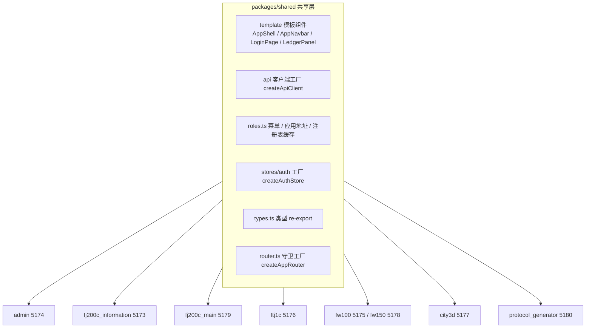
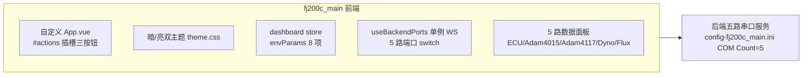

# 05 前端逐应用精读

> 阅读前提：已读完 04 章（Vue3 + TS 语法速成）。本章用真实文件走读 **8 个前端应用**（比旧版多一个 protocol_generator），重点讲「每个文件是干什么的、为什么这么写、改哪里能满足你的需求」。



## 5.1 共享层 packages/shared（8 个应用的公共基石）

### 5.1.1 shared 目录全景

```
packages/shared/src/
├── index.ts              # 统一导出入口（85 行）
├── roles.ts              # 菜单配置 + 应用地址表 + 注册表缓存（562 行）
├── types.ts              # 类型 re-export（自 generated 导入转发，84 行）
├── session.ts            # 共享会话：token 读写、WS URL 构建（253 行）
├── router.ts             # createAppRouter 守卫工厂（102 行）
├── responsive.ts         # 响应式工具（147 行）
├── style.css             # 6 份相同 style.css 收敛成的共享样式（326 行）
├── api/
│   ├── index.ts          # createApiClient 工厂（axios 实例，120 行）
│   ├── auth.ts           # createAuthApi（登录/用户信息，24 行）
│   ├── custom-instance.ts# orval 请求壳（setApiInstance/getApiInstance，47 行）
│   └── generated/        # orval 生成（10 个 tag 文件 + 115 个 model，不手改）
├── stores/
│   └── auth.ts           # createAuthStore 工厂 + registerAuthStoreGetter（228 行）
└── template/             # 模板组件（各应用复用）
    ├── AppShell.vue      # 通用应用外壳（46 行：导航条 + 路由出口 + initAuth）
    ├── AppNavbar.vue     # 导航栏（764 行，含 #actions 插槽）
    ├── LoginPage.vue     # 登录页（688 行）
    ├── LedgerPanel.vue   # 设备台账面板（151 行，fw100/fw150 共享）
    └── TemplatePanel.vue # 新角色参考模板面板（336 行）
```

### 5.1.2 index.ts 导出清单

```ts
// packages/shared/src/index.ts（导出什么，各应用就 import 什么）
export * from './roles'
export * from './types'
export * from './session'
export * from './responsive'
export * from './router'          // createAppRouter
export { createApiClient, createAuthApi, setApiInstance } from './api'
export { createAuthStore, registerAuthStoreGetter, getAppAuthStore } from './stores/auth'
export * from './template'        // AppShell/AppNavbar/LoginPage/LedgerPanel/TemplatePanel
```

**设计意义**：8 个应用 import 的 `@shared` 就来自这个文件。加新共享内容 → 这里加一行导出。

### 5.1.3 roles.ts（菜单 / 地址 / 注册表缓存）

```ts
// packages/shared/src/roles.ts（关键概念）
// 角色 key/name/permissions 的唯一源在【后端】src/roles.rs（ROLE_REGISTRY），
// 前端运行时通过 loadRoleRegistry() 从 GET /api/meta/roles 拉取并缓存。
// 本文件只手写纯前端 UI 概念：

// ① 菜单配置（导航栏用，key 是角色 key，含 userMenus/adminMenus 两套）
const MENU_CONFIG: Record<string, { userMenus: MenuItem[]; adminMenus: MenuItem[] }> = {
  admin: {
    adminMenus: [{ id: 'admin-users', title: '用户管理', path: '/users', icon: 'User', permissions: [Permission.UsersRead] }],
    userMenus: [],
  },
  fj200c_information: { userMenus: [ /* monitor/visual/data/config/help */ ], adminMenus: [] },
  // ... fj200c_main / fw100 / fw150 / ftj1c / city3d
  protocol_generator: {
    userMenus: [
      { id: 'protocol_generator-editor', title: '协议编辑', path: '/protocol_generator/editor', icon: 'EditPen', permissions: [Permission.ProtocolGeneratorMonitor] },
      { id: 'protocol_generator-csv', title: 'CSV 参数表', path: '/protocol_generator/csv', icon: 'Files', permissions: [Permission.ProtocolGeneratorMonitor] },
    ],
    adminMenus: [],
  },
}

// ② 应用地址表（跨应用跳转用，dev/prod 各一份）
export const ROLE_APP_URLS: Record<string, { dev: string; prod: string }> = {
  admin: { dev: 'http://localhost:5174', prod: '/admin' },
  fj200c_information: { dev: 'http://localhost:5173', prod: '/fj200c_information' },
  // ...
  protocol_generator: { dev: 'http://localhost:5180', prod: '/protocol_generator' },
}
export function getRoleAppUrl(roleKey: string, isDev: boolean): string | null { ... }

// ③ 注册表缓存（模块级单例：null=未拉取，RoleInfo[]=已拉取）
let registryCache: RoleInfo[] | null = null
export async function loadRoleRegistry(): Promise<RoleInfo[]> {
  if (registryCache) return registryCache
  try {
    const response = await getMeta().metaListRoles()
    registryCache = response.data ?? []
  } catch {
    registryCache = []            // 失败缓存空数组，不阻塞登录流程
  }
  return registryCache
}
export function getPermissionsByRole(roleKey: string): Permission[] { ... }
export function getMenusByRole(roleKey: string, appKind: 'user' | 'admin'): MenuItem[] { ... }
```

**维护指南**：新增角色时，这里只加菜单项 + 应用地址（角色数据由 `/api/meta/roles` 自动同步，无手写副本）。

### 5.1.4 session.ts（共享登录态 + WS URL）

```ts
// packages/shared/src/session.ts
export const SESSION_KEY = 'session'    // 8 个应用共用同一个 localStorage key
export const LEGACY_KEYS = ['token', 'user', 'admin_token', 'admin_user']  // 旧 key 兼容迁移

export function loadSession(): { token: string; user: User } | null { ... }
export function saveSession(token: string, user: User) { ... }
export function clearSession() { ... }
export function getSessionToken(): string | null { ... }

// WebSocket URL 构建（WS 不走 JWT header，token 走 ?token= 参数）
export function buildWebSocketUrl(path: string): string {
  const token = getSessionToken()
  const protocol = window.location.protocol === 'https:' ? 'wss://' : 'ws://'
  const base = window.location.hostname + (import.meta.env.DEV ? ':3000' : '')
  return `${protocol}${base}${path}?token=${token ?? ''}`
}
```

**要点**：
1. 会话 key 全局统一为 `"session"`（旧版散落的 token/user 等 key 通过 LEGACY_KEYS 兼容迁移）→ 生产环境同源托管时天然共享登录态。
2. dev 模式后端在 3000 端口，生产同端口托管 → 端口按环境拼。
3. 所有 WS 连接（6 个监控类应用的页面）都走这个函数，token 失效即连接失败。

### 5.1.5 api/custom-instance.ts（orval 的请求壳）

```ts
// packages/shared/src/api/custom-instance.ts
// orval 生成的请求函数需要自定义实例：在这里接上统一 axios 实例
import { createApiClient } from './index'

// 全局单例：各应用启动时通过 setApiInstance 注入自己的实例（token 注入 + 401 跳转）
let apiInstance = createApiClient('/login')
export function setApiInstance(instance: AxiosInstance) { apiInstance = instance }
export function getApiInstance() { return apiInstance }

export const customInstance = <T>(config): Promise<T> => {
  return apiInstance(config).then(({ data }) => data as T)
}
```

**关键**：orval 生成的 `generated/api/*.ts` 内部全部调用 `customInstance({...})`。每个应用的 `api/index.ts` 都会先 `setApiInstance(api)` 注入自己带登录跳转路径的实例——改一个文件 = 改所有 API 的请求行为。

### 5.1.6 stores/auth.ts（认证 store 工厂 + 应用注册表）

```ts
// packages/shared/src/stores/auth.ts
// 工厂模式：8 个应用各自调用 createAuthStore 生成自己的 store

// ① 应用注册表：公共组件（AppNavbar/AppShell）无需传参即可拿到当前应用的 store
let appAuthStoreGetter: (() => any) | null = null
export function registerAuthStoreGetter(getter: () => any) { appAuthStoreGetter = getter }
export function getAppAuthStore<T>(): T | undefined { return appAuthStoreGetter?.() }

export interface AuthStoreOptions {
  id: string                // 唯一 id（如 "auth-admin"、"auth-fj200c_information"）
  appKind: "user" | "admin" // 决定菜单来源（userMenus 还是 adminMenus）
  allowedRoles: string[]    // 本应用放行的角色（admin 应用 = [admin]，用户端 = 各自角色）
  authApi: AuthApi          // 认证 API（应用侧注入）
}

export function createAuthStore(options: AuthStoreOptions): StoreDefinition {
  return defineStore(options.id, () => {
    const user = ref<User | null>(null)
    const token = ref<string | null>(null)
    const permissions = ref<Permission[]>([])
    const menuItems = ref<MenuItem[]>([])

    // 角色不匹配即视为未登录（管理员会话进用户端 = 未登录，反之亦然）
    const isAuthenticated = computed(
      () => !!token.value && !!user.value && allowedRoles.includes(user.value.role)
    )
    const hasPermission = (p: Permission) => permissions.value.includes(p)

    const refreshAuthState = () => {
      permissions.value = getPermissionsByRole(user.value?.role ?? '')
      menuItems.value = getMenusByRole(user.value?.role ?? '', appKind)
    }

    async function initAuth() {
      // 幂等：首次调用后不再重复请求
      await loadRoleRegistry()          // ① 先拉注册表（失败不阻塞）
      const session = loadSession()     // ② 恢复本地会话
      // ③ 服务端校验 /api/auth/me，角色不对/用户被删则本应用登出
      //（401 由 API 拦截器统一清理并跳登录页）
    }
    async function login(email, password) { ... }   // 登录 + 保存会话 + 刷新权限
    function logout() { ... }                       // 清 store 态 + clearSession()
    // storage 事件监听：其他标签页切换用户时实时同步（跨标签页）
    return { user, token, permissions, menuItems, isAuthenticated, hasPermission,
             hasAnyPermission, hasAllPermissions, initAuth, login, logout, fetchProfile }
  })
}
```

**工厂的好处**：同一份逻辑生成 8 个独立 store（状态互不干扰），但代码只写一份。改认证逻辑只改 shared 一处。

### 5.1.7 router.ts（createAppRouter 守卫工厂）

```ts
// packages/shared/src/router.ts
// 7 个应用的路由守卫完全一致，收敛到本工厂；应用只保留 routes 数组 + 差异参数。
export interface AppRouterOptions {
  app: string                    // 应用名（生产 base 前缀）
  routes: RouteRecordRaw[]       // 应用专属路由表
  useAuthStore: () => any        // 本应用 auth store 获取器
  homePath?: string              // 已登录访问 /login 时跳首页（默认 /${app}）
  noPermission?: 'menu' | '403'  // 无权限策略：用户端默认 'menu'（回跳首个菜单），admin 用 '403'
}

export function createAppRouter(options: AppRouterOptions): Router {
  const router = createRouter({
    history: createWebHistory(import.meta.env.PROD ? `/${app}/` : '/'),
    routes,
  })

  router.beforeEach(async (to, _from, next) => {
    await authStore.initAuth()                            // ① 初始化认证
    if (to.meta.requiresAuth && !authStore.isAuthenticated) { next('/login'); return }  // ② 未登录
    if (to.meta.requiresGuest && authStore.isAuthenticated) { next(homePath); return }  // ③ 已登录访问登录页
    if (to.meta.permissions) {                            // ④ 权限检查（任一满足即通过）
      const ok = (to.meta.permissions as Permission[]).some(p => authStore.hasPermission(p))
      if (!ok) {
        if (options.noPermission === '403') { next('/403'); return }
        const menus = getMenusByRole(authStore.userRole, 'user')
        next(menus[0]?.children?.[0]?.path ?? menus[0]?.path ?? '/login')  // 回跳首个菜单
        return
      }
    }
    next()                                                // ⑤ 放行
  })
  return router
}
```

**注意**：`homePath` 必须真实存在于路由表，否则守卫与 404 兜底形成死循环（protocol_generator 踩过的历史 bug，见 5.9.8）。

### 5.1.8 template/AppShell.vue（通用应用外壳）

```vue
<!-- packages/shared/src/template/AppShell.vue（46 行，6 个应用复用） -->
<script setup lang="ts">
const route = useRoute()
const isLoginPage = computed(() => route.path.startsWith('/login'))
const authStore = getAppAuthStore<{ initAuth: () => Promise<void> }>()
onMounted(() => { authStore?.initAuth() })
</script>

<template>
  <el-config-provider :locale="zhCn">
    <div id="app">
      <AppNavbar v-if="!isLoginPage" />
      <router-view />
    </div>
  </el-config-provider>
</template>
```

**职责**：全局导航条（登录页除外）+ 路由出口 + 挂载时初始化认证。**不使用它的应用只有 2 个**：fj200c_main（需要 AppNavbar 的 #actions 插槽放操作按钮）、city3d（暗黑主题变体，body/#app 样式不同）。

### 5.1.9 template/AppNavbar.vue（764 行导航栏拆解）

```vue
<!-- 结构：双层 —— 顶部角色区 + 菜单区 -->
<template>
  <div class="navbar">
    <div class="top-row">
      <div class="brand">{{ brandText }}</div>   <!-- 中文角色名（硬编码 switch） -->
      <div class="actions">
        <slot name="actions" />                  <!-- fj200c_main 的保存/模拟/主题按钮插这里 -->
        <el-dropdown> 用户菜单：切换应用 / 退出登录 </el-dropdown>
      </div>
    </div>
    <nav class="navbar-menu">  <!-- 水平菜单：getMenusByRole 过滤后渲染，自动隐藏 checkbox（64px→0 收起） --> </nav>
  </div>
</template>
```

**要点**：
- `brandText` 是中文角色名硬编码 switch（commit 38954cf）：admin→管理员、fj200c_information→涡桨FJ200C信息化、fj200c_main→涡桨FJ200C测控、fw100→涡喷FW100、fw150→涡喷FW150、ftj1c→协议转发FTJ1C、city3d→城市3D、protocol_generator→协议生成器。
- 菜单数据 = `authStore.menuItems`（由 createAuthStore 的 `refreshAuthState` 按角色算好），无需 AppNavbar 自己过滤权限。
- 用户下拉的 `getUserRoleText` 用运行时注册表（后端改名自动同步），与 brandText 的硬编码分工明确。

### 5.1.10 template/LoginPage.vue（688 行登录页）

```vue
<!-- 结构：左侧品牌区（纯 CSS 宇航员动画）+ 右侧登录表单 + 底部版权 -->
<el-form :model="form" :rules="rules" ref="formRef" @keyup.enter="handleLogin"> ... </el-form>
```

**登录流程**：校验表单 → `authStore.login` → 成功后用 `getRoleAppUrl(userRole, import.meta.env.DEV)` 拿到本角色对应的应用地址 → **整页跳转**（角色不匹配的用户自动跳到自己的应用）。整页跳转保证路由 base 与 token 正确加载。

### 5.1.11 template/LedgerPanel.vue（台账面板，fw100/fw150 共享）

```vue
<!-- packages/shared/src/template/LedgerPanel.vue（151 行） -->
<!-- 从 fw100/fw150 各自逐字重复的 Panel.vue 收敛而来：角色差异只靠 3 个 props -->
<template>
  <div class="ledger-root">
    <div class="ledger-toolbar">
      <span class="ledger-title">设备台账</span>
      <el-tag size="small" type="success">{{ roleKey }} 角色面板</el-tag>
      <span class="ledger-clock">权限点：{{ permissionKey }}</span>
    </div>
    <el-table v-loading="loading" :data="items" border size="small" stripe>
      <el-table-column label="编号" prop="id" width="120" />
      <el-table-column label="名称" prop="name" />
      <el-table-column label="类别" prop="category" width="140" />
      <el-table-column label="状态" prop="status" width="120">
        <template #default="{ row }">
          <el-tag :type="row.status === '在线' ? 'success' : 'info'" size="small">{{ row.status }}</el-tag>
        </template>
      </el-table-column>
    </el-table>
  </div>
</template>

<script setup lang="ts">
// 类型用结构性鸭子类型：不依赖 fw100 的 LedgerItem 或 fw150 的 Fw150LedgerItem 的具体类型
export interface LedgerRow { id: string; name: string; category: string; status: string }
export interface LedgerPanelApi { getItems: () => Promise<{ data?: LedgerRow[] }> }
const props = defineProps<{ roleKey: string; permissionKey: string; api: LedgerPanelApi }>()
// onMounted → props.api.getItems() → items.value = response.data ?? []
</script>
```

### 5.1.12 style.css / responsive.ts

- **style.css**（326 行）：原 6 个应用逐字重复的 style.css 收敛为一份，应用 `main.ts` 里 `import "@shared/style.css"`。例外：city3d 保留本地暗黑变体（182 行）、fj200c_main 保留本地精简版（48 行）。
- **responsive.ts**（147 行）：`breakpoints` / `useResponsive` / `useLayoutConfig`，移动端断点 <768px。各应用一级目录的 `utils/responsive.ts` 就是 `export { ... } from '@shared'` 的转发。

### 5.1.13 各应用如何消费 shared（6 行 auth store 注册）

```ts
// 每个应用的 stores/auth.ts（约 17 行，以 protocol_generator 为例）
import { createAuthStore, registerAuthStoreGetter } from "@shared";
import { authApi } from "@/api";

export const useAuthStore = createAuthStore({
  id: "auth-protocol-generator",
  appKind: "user",
  allowedRoles: ["protocol_generator"],
  authApi,
});

registerAuthStoreGetter(() => useAuthStore());
```

**8 个应用 = 8 次 createAuthStore + registerAuthStoreGetter 调用**。AppShell/AppNavbar 通过 `getAppAuthStore()` 拿当前应用的 store——公共组件永远不知道自己在哪个应用里。

---

## 5.2 build/vite.base.ts（共享 Vite 配置工厂）

```ts
// build/vite.base.ts（71 行，根目录 build/ 下）
export interface AppConfig { app: string; port: number; ws?: boolean }

export function defineAppConfig(opts: AppConfig, appDir: string): UserConfig {
  const isBuild = process.env.NODE_ENV === "production" || process.argv.includes("build");
  return {
    plugins: [
      vue(),
      Components({
        dts: path.join(appDir, "components.d.ts"),
        resolvers: [ElementPlusResolver({ importStyle: "css" })],   // Element Plus 按需自动引入
      }),
    ],
    resolve: {
      alias: { "@": path.join(appDir, "src"), "@shared": path.join(appDir, "../../packages/shared/src") },
      dedupe: ["vue", "pinia", "element-plus"],   // 防止依赖双实例（曾导致 pinia 双实例黑屏）
    },
    server: {
      port: opts.port,
      strictPort: true,            // 端口被占直接报错（8 应用互不冲突）
      proxy: { "/api": { target: "http://localhost:3000", changeOrigin: true, ws: opts.ws ?? false } },
    },
    base: isBuild ? `/${opts.app}/` : "/",
    build: {
      chunkSizeWarningLimit: 1500,
      rollupOptions: { output: { manualChunks: /* element-plus / echarts / vue-vendor / vendor 四组 */ } },
    },
  };
}
```

**注意**：工厂内 `__dirname` 实测指向 build/ 而非应用目录，所以 `appDir` 必须由各应用显式传入。各应用 vite.config.ts 只剩 4 行：

```ts
// frontend/fj200c_information/vite.config.ts（每个应用都长这样，参数不同）
import { defineConfig } from "vite";
import { defineAppConfig } from "../../build/vite.base";

export default defineConfig(
  defineAppConfig({ app: "fj200c_information", port: 5173, ws: true }, __dirname),
);
```

**8 应用参数表**：

| 应用 | port | base (build) | proxy ws |
|---|---|---|---|
| fj200c_information | 5173 | /fj200c_information/ | 是 |
| admin | 5174 | /admin/ | 否 |
| fw100 | 5175 | /fw100/ | 是 |
| ftj1c | 5176 | /ftj1c/ | 是 |
| city3d | 5177 | /city3d/ | 是 |
| fw150 | 5178 | /fw150/ | 是 |
| fj200c_main | 5179 | /fj200c_main/ | 是 |
| protocol_generator | 5180 | /protocol_generator/ | 否 |

**ws 开关的真相**：6 个应用开 `ws: true`（fw100/fw150/city3d 也开了，与旧文档"只有 3 个"不同）。WS 代理是必需的——浏览器 WS 直连 517x 端口没有后端，必须经代理转发 `/api/*/ws` 到 3000。不开的只有 admin（纯 CRUD）与 protocol_generator（纯文件工具）。

---

## 5.3 admin 应用走读（管理后台）

### 5.3.1 admin 文件结构（两级目录）

```
frontend/admin/
├── index.html
├── vite.config.ts           # defineAppConfig({ app:"admin", port:5174 })
├── src/
│   ├── main.ts              # 28 行：createApp + Pinia + Router + @shared/style.css
│   ├── App.vue              # 11 行薄封装：<AppShell />
│   ├── vite-env.d.ts
│   ├── api/index.ts         # api + setApiInstance + authApi + usersApi + settingsApi
│   ├── router/index.ts      # 75 行：createAppRouter（homePath=/users、noPermission=403）
│   ├── stores/auth.ts       # id:"auth-admin" appKind:"admin" allowedRoles:["admin"]
│   ├── types/index.ts
│   ├── utils/responsive.ts  # @shared 转发
│   ├── views/Login.vue      # 复用 shared LoginPage
│   └── admin/               # ← 二级目录：角色专有文件全部收编在这里
│       ├── api/
│       │   ├── users.ts     # createUsersApi（38 行）
│       │   └── settings.ts  # createSettingsApi（28 行，pwd-route）
│       └── views/
│           ├── Users.vue        # 用户列表（570 行）
│           ├── CreateUser.vue   # 新建用户（259 行）
│           └── NoPermission.vue # 403 无权限页（68 行）
```

**模板骨架 vs 角色文件的分界线**：一级目录是「任何新应用复制模板时都有的」；二级目录 `src/admin/` 是「这个角色才有的」。admin 只有模板四件套 + 用户管理，没有 components/composables。

### 5.3.2 main.ts + App.vue（薄封装）

```ts
// main.ts（28 行）：与 fj200c_main/city3d 不同，admin 不注册任何本地插件
import { createApp } from "vue";
import { createPinia } from "pinia";
import "element-plus/theme-chalk/dark/css-vars.css";
import "element-plus/es/components/message/style/css";
import "element-plus/es/components/message-box/style/css";
import App from "./App.vue";
import router from "./router";
import "@shared/style.css";

const app = createApp(App);
app.use(createPinia());
app.use(router);
app.mount("#app");
```

```vue
<!-- App.vue（11 行）：一切交给共享外壳 -->
<script setup lang="ts">
import { AppShell } from "@shared"
</script>
<template>
  <AppShell />
</template>
```

### 5.3.3 router/index.ts（75 行）

```ts
const router = createAppRouter({
  app: "admin",
  homePath: "/users",          // 已登录用户访问 /login 时跳用户管理
  noPermission: "403",         // 权限不足跳 /403（用户端默认回跳首个菜单）
  useAuthStore,
  routes: [
    { path: "/", redirect: "/users" },
    { path: "/login", component: () => import("@/views/Login.vue"), meta: { requiresGuest: true } },
    { path: "/users", component: () => import("@/admin/views/Users.vue"),
      meta: { requiresAuth: true, permissions: [Permission.UsersRead] } },
    { path: "/users/create", component: () => import("@/admin/views/CreateUser.vue"),
      meta: { requiresAuth: true, permissions: [Permission.UsersWrite] } },
    { path: "/403", component: () => import("@/admin/views/NoPermission.vue"),
      meta: { requiresAuth: true } },
    { path: "/:pathMatch(.*)*", redirect: "/login" },   // 兜底
  ],
});
```

**admin 与用户端的守卫差异**：admin 的 homePath 是 `/users`（不是默认的 `/admin`）；无权限策略是 "403"（跳专用页面，避免重定向到受限页面死循环）；用户端默认回跳角色第一个有权限的菜单。

### 5.3.4 stores/auth.ts

```ts
export const useAuthStore = createAuthStore({
  id: "auth-admin",
  appKind: "admin",                // 菜单取 adminMenus
  allowedRoles: ["admin"],         // 只有 admin 角色能进管理后台
  authApi,
});
registerAuthStoreGetter(() => useAuthStore());
```

### 5.3.5 二级目录 api/（users.ts + settings.ts）

```ts
// src/admin/api/users.ts（38 行）
export function createUsersApi() {
  const api = getAdmin();
  return {
    async getUsers()      { return api.adminListUsers(); },
    async createUser(data: CreateUserRequest) { return api.adminCreateUser(data); },
    async updateUserRole(id: string, role: string) { return api.adminUpdateUserRole(id, { role }); },
    async deleteUser(id: string) { return api.adminDeleteUser(id); },
  };
}

// src/admin/api/settings.ts（28 行）：初始密码查询开关
export function createSettingsApi() {
  const api = getAdmin();
  return {
    async getPwdRouteStatus()      { return api.adminGetPwdRouteStatus(); },    // GET  /api/users/settings/pwd-route
    async setPwdRouteStatus(disabled: boolean) { return api.adminSetPwdRouteStatus({ disabled }); },  // PUT
  };
}
```

**后端对应**：admin 路由双层中间件——`role_middleware(SystemAdmin)` 在外层，users_read/write/delete 三个权限中间件在内层。

### 5.3.6 views/Users.vue（570 行，含「停用初始密码查询」勾选）

页面核心组成（对照真实源码）：

```vue
<!-- 工具栏最右侧：初始密码查询开关（这是本应用近期的功能新增点） -->
<div class="toolbar">
  <el-input v-model="search" placeholder="搜索用户名/邮箱" clearable />
  <el-button type="primary" @click="openCreate">新建用户</el-button>
  <el-checkbox v-model="pwdRouteDisabled" @change="togglePwdRoute">
    停用初始密码查询（GET /admin/pwd）
  </el-checkbox>
</div>

<script setup lang="ts">
// 用户表格
const users = ref<User[]>([])
const loading = ref(false)

// 密码机制背景：种子账号实际 bcrypt 入库的是固定 "123456"（开发默认密码），
// seed_passwords 表存的是随机 12 位串（展示用）；GET /admin/pwd 无认证公开返回该列表。
// 生产部署时管理员可勾选此项停用，停用后 /admin/pwd 返回 403。

// 初始化时读取开关状态
const pwdRouteDisabled = ref(false)
const loadPwdRouteStatus = async () => {
  const res = await settingsApi.getPwdRouteStatus()
  if (res.success && res.data) pwdRouteDisabled.value = res.data.disabled
}
// 切换（失败回滚勾选状态）
const togglePwdRoute = async (value: boolean) => {
  try {
    const res = await settingsApi.setPwdRouteStatus(value)
    if (!res.success) throw new Error(res.message)
    ElMessage.success(value ? '已停用初始密码查询' : '已启用初始密码查询')
  } catch (e) {
    pwdRouteDisabled.value = !value
    ElMessage.error((e as Error).message)
  }
}
</script>
```

**防自锁**：不能删除/降级自己的 admin 角色（后端校验 + 前端按钮禁用）——管理员把自己删了就没人能管理了。

### 5.3.7 views/CreateUser.vue（259 行）与 NoPermission.vue（68 行）

```vue
<!-- CreateUser.vue：标准表单三件套 :model :rules validate -->
<el-form ref="formRef" :model="form" :rules="rules" label-width="100px">
  <el-form-item label="用户名" prop="username"><el-input v-model="form.username" /></el-form-item>
  <el-form-item label="邮箱" prop="email"><el-input v-model="form.email" /></el-form-item>
  <el-form-item label="密码" prop="password"><el-input v-model="form.password" type="password" show-password /></el-form-item>
  <el-form-item label="角色" prop="role">
    <el-select v-model="form.role">
      <!-- 角色下拉数据来自运行时注册表（authStore.roles 缓存自 /api/meta/roles），不是硬编码 -->
      <el-option v-for="r in authStore.roles" :key="r.key" :label="r.name" :value="r.key" />
    </el-select>
  </el-form-item>
  <el-button type="primary" :loading="submitting" @click="submit">创建</el-button>
</el-form>
```

**完整表单模式**（本项目所有表单统一）：`el-form :model :rules` + `validate()` → 成功才提交 → `submitting` 防重复点击 → 成功跳转/刷新 → 失败 ElMessage。NoPermission.vue 是 403 静态提示页（68 行），配合守卫的 `noPermission: "403"`。

---

## 5.4 fj200c_information 应用走读（核心示例：composable 组装）

### 5.4.1 文件结构（两级目录）

```
frontend/fj200c_information/
├── vite.config.ts           # defineAppConfig({ app:"fj200c_information", port:5173, ws:true })
├── src/
│   ├── main.ts / App.vue（10 行 <AppShell/>）/ vite-env.d.ts
│   ├── api/index.ts         # api + setApiInstance + authApi + fj200cInformationApi
│   ├── router/index.ts      # 102 行（含 /template 演示路由）
│   ├── stores/auth.ts       # id:"auth-fj200c_information" allowedRoles:["fj200c_information"]
│   ├── types/index.ts / utils/responsive.ts / views/Login.vue
│   └── fj200c_information/  # ← 二级目录
│       ├── api/fj200c_information.ts      # facade + WS 事件类型手写（123 行）
│       ├── fj200c_information.css         # 角色专属样式（243 行）
│       ├── composables/
│       │   ├── useClock.ts                    # 45 行
│       │   ├── useService.ts                  # 136 行
│       │   ├── useCommandChannel.ts           # 69 行
│       │   ├── useConfigDialog.ts             # 78 行
│       │   └── useFj200cInformationEvents.ts  # 180 行（WS 连接 + 分发）
│       ├── components/
│       │   ├── CommandPanel.vue       # 123 行
│       │   ├── CommandRow.vue         # 70 行
│       │   ├── DataPanel.vue          # 60 行
│       │   ├── ServiceNavButton.vue   # 69 行
│       │   └── StatusBar.vue          # 89 行
│       ├── utils/
│       │   ├── hex.ts     # 62 行
│       │   ├── check.ts   # 46 行
│       │   └── ascii.ts   # 46 行
│       └── views/
│           ├── Monitor.vue   # 412 行（监控主界面）
│           ├── Visual.vue    # 284 行（ECharts 6 仪表 + 曲线）
│           ├── Data.vue      # 264 行
│           ├── Config.vue    # 77 行
│           └── Help.vue      # 49 行
```

### 5.4.2 router/index.ts（102 行，含 /template 演示路由）

```ts
const router = createAppRouter({
  app: "fj200c_information",
  useAuthStore,
  routes: [
    { path: "/", redirect: "/login" },
    { path: "/login", component: () => import("@/views/Login.vue"), meta: { requiresGuest: true } },
    { path: "/template", component: () => import("@shared/template/TemplatePanel.vue"),
      meta: { requiresAuth: true, permissions: [Permission.Fj200cInformationMonitor] } },  // 共享模板演示页
    { path: "/fj200c_information", redirect: "/fj200c_information/monitor" },               // 兼容旧入口
    { path: "/fj200c_information/monitor", component: () => import("@/fj200c_information/views/Monitor.vue"),
      meta: { requiresAuth: true, permissions: [Permission.Fj200cInformationMonitor] } },
    // /visual /data /config /help 同理（同一个权限点）
    { path: "/:pathMatch(.*)*", redirect: "/login" },
  ],
});
```

**注意 `homePath` 技巧**：`/fj200c_information` 这个兼容旧入口的 redirect 路由必须存在——已登录用户访问 `/login` 时守卫会跳 `homePath`（默认 `/${app}` = `/fj200c_information`），如果这个路径 404 就会在守卫和兜底之间死循环。

### 5.4.3 api/fj200c_information.ts（facade + WS 事件类型手写）

```ts
// 二级目录 src/fj200c_information/api/fj200c_information.ts
import { getFj200cInformation } from "@shared/api/generated";
import { buildWebSocketUrl as sharedBuildWebSocketUrl } from "@shared";

export type {
  ServiceStatus, SentResult, SavedResult, ConfigContent, CsvFileList, CsvFileContent,
} from "@shared/api/generated";                    // 类型 re-export（视图 import 路径兼容）

// ---- WS 事件类型手写（WebSocket 不进 OpenAPI，orval 不生成）----
export interface TableRow { field: string; value: string }
export interface Fj200cInformationFrameEvent {
  type: "frame"; connection_index: number; hex: string; frame_type: string; fields: string[]
}
export interface Fj200cInformationPayloadEvent { type: "payload"; connection_index: number; hex: string }
export interface Fj200cInformationTableDataEvent { type: "table_data"; connection_index: number; rows: TableRow[] }
export type Fj200cInformationEvent =
  | Fj200cInformationFrameEvent | Fj200cInformationPayloadEvent | Fj200cInformationTableDataEvent;

// ---- HTTP facade（8 个接口）----
export function createFj200cInformationApi() {
  const api = getFj200cInformation();
  return {
    async startService()     { return api.fj200cInformationStartService(); },
    async stopService()      { return api.fj200cInformationStopService(); },
    async getServiceStatus() { return api.fj200cInformationGetServiceStatus(); },
    async sendCommand(hex: string) { return api.fj200cInformationSendCommand({ hex }); },
    async getConfig()        { return api.fj200cInformationGetConfig(); },
    async saveConfig(content: string) { return api.fj200cInformationSaveConfig({ content }); },
    async listCsvFiles()     { return api.fj200cInformationListCsvFiles(); },
    async getCsvFile(name: string) { return api.fj200cInformationGetCsvFile(encodeURIComponent(name)); },
    buildWebSocketUrl(): string { return sharedBuildWebSocketUrl("/api/fj200c_information/ws") },
  };
}
```

**判别联合实战**：`type` 字段区分 frame/payload/table_data 三种事件，前端 `switch(event.type)` 分发——04 章学的判别联合在此落地。

### 5.4.4 composables/useFj200cInformationEvents.ts（180 行：WS 连接 + 分发）

```ts
// 核心逻辑（简化）：连接、3 秒重连、事件分发、清理
const RECONNECT_DELAY = 3000

export function useFj200cInformationEvents() {
  const connected = ref(false)
  const tableRows = ref<TableRow[]>([])
  const listeners: Array<(e: Fj200cInformationEvent) => void> = []

  let socket: WebSocket | null = null
  let reconnectTimer: number | null = null

  const connect = () => {
    if (socket) return
    socket = new WebSocket(fj200cInformationApi.buildWebSocketUrl())
    socket.onopen = () => { connected.value = true }
    socket.onmessage = (ev) => {
      const event = JSON.parse(ev.data) as Fj200cInformationEvent
      listeners.forEach((fn) => fn(event))        // 广播给所有订阅者
      if (event.type === 'table_data') tableRows.value = event.rows   // 自身维护快照
    }
    socket.onclose = () => {
      connected.value = false
      socket = null
      reconnectTimer = window.setTimeout(connect, RECONNECT_DELAY)    // 断线自愈
    }
  }
  const close = () => { if (reconnectTimer) clearTimeout(reconnectTimer); socket?.close(); socket = null }
  onUnmounted(close)                                // 页面退出不留残留
  return { connected, tableRows, connect, close, on: (fn) => listeners.push(fn) }
}
```

### 5.4.5 其余 composables（useService / useCommandChannel / useClock / useConfigDialog）

```ts
// useService.ts（136 行）：服务启停 + 状态轮询
export function useService() {
  const running = ref(false)
  const checking = ref(false)
  const checkStatus = async () => {
    const res = await fj200cInformationApi.getServiceStatus()
    if (res.success) running.value = res.data?.running ?? false
  }
  const start = async () => {
    const res = await fj200cInformationApi.startService()
    ElMessage.success(res.message || '服务已启动')
    await checkStatus()
  }
  const stop = async () => {
    await ElMessageBox.confirm('确定停止服务吗？', '提示')   // 危险操作二次确认
    const res = await fj200cInformationApi.stopService()
    ElMessage.success(res.message || '服务已停止')
    await checkStatus()
  }
  return { running, checking, checkStatus, start, stop }
}

// useCommandChannel.ts（69 行）：向串口发送命令帧
const send = async (hex: string) => {
  sending.value = true
  try {
    const res = await fj200cInformationApi.sendCommand(hex)
    if (!res.success) throw new Error(res.message)
    ElMessage.success('命令已发送')
  } catch (e) { ElMessage.error((e as Error).message) }
  finally { sending.value = false }
}

// useClock.ts（45 行）：每秒刷新系统时间
const now = ref(new Date())
const start = () => { timer = window.setInterval(() => { now.value = new Date() }, 1000) }

// useConfigDialog.ts（78 行）：打开 → 拉取配置 → 编辑 → 保存（后端热加载，立即生效）
const save = async () => {
  const res = await fj200cInformationApi.saveConfig(content.value)
  ElMessage.success('已保存（立即生效）')   // 与 fj200c_main「需重启」的提示不同
}
```

### 5.4.6 views/Monitor.vue（412 行主界面 = composable 组装器）

```vue
<script setup lang="ts">
// 五个 composable 组装一个页面，组件自身逻辑极少——这是本项目推荐的页面写法
const { now, start: startClock } = useClock()
const service = useService()
const command = useCommandChannel()
const configDialog = useConfigDialog()
const events = useFj200cInformationEvents()

onMounted(() => { startClock(); service.checkStatus(); events.connect() })
const rows = computed(() => events.tableRows.value)
</script>

<template>
  <div class="monitor-page">
    <!-- 顶部工具条：时钟 + 服务状态 + 启停按钮 + 配置按钮（ServiceNavButton/StatusBar 组件） -->
    <!-- 中部：实时数据表格（WS 驱动）+ 命令面板（CommandPanel/CommandRow） -->
    <DataPanel :rows="rows" />
  </div>
</template>
```

**组件清单**：StatusBar（89 行，状态栏：服务状态/时间/WS 连接）、ServiceNavButton（69 行，启停按钮）、CommandPanel（123 行）+ CommandRow（70 行，命令按钮网格）、DataPanel（60 行，实时表格）。

### 5.4.7 Visual / Data / Config / Help 子页

| 子页 | 行数 | 职责 | 技术 |
|---|---|---|---|
| Visual.vue | 284 | 可视化：6 个 ECharts 仪表（gauge）+ 实时曲线 | ECharts，数据来自 WS 事件（events.on） |
| Data.vue | 264 | CSV 记录列表 + 内容查看/下载 | el-table + Blob 下载（getCsvFile） |
| Config.vue | 77 | config-fj200c_information.ini 编辑 | 文本域 + useConfigDialog（保存即热加载） |
| Help.vue | 49 | 使用帮助 | 静态文档 |

### 5.4.8 utils（hex / check / ascii）

```ts
// utils/hex.ts（62 行）：帧 hex 转换
export const bytesToHex = (bytes: number[]) =>
  bytes.map((b) => b.toString(16).padStart(2, "0").toUpperCase()).join(" ")
// utils/check.ts（46 行）：校验和计算（前 N 字节累加 % 256）
// utils/ascii.ts（46 行）：ASCII ↔ 字符串（用于 ADAM 设备的 `>` 前缀 ASCII 行）
```

---

## 5.5 fj200c_main 应用走读（最复杂业务前端：3 路 → 5 路串口）

### 5.5.1 应用特点



**与 fj200c_information 的三大差异**：
1. **五路串口**（不再是三路）：0=ECU 电控器（42 字节 `EB 90 2A` 头）、1=Adam4015 环境采集（`>` + 8 通道 ASCII）、2=Adam4117 环境采集（`>` + 8 通道 ASCII）、3=Dyno 测功机（Dyno 帧）、4=Flux 燃油流量（`FF FF` 头 + u16 流量）。
2. 1920×1080 固定设计稿 → `ScaledPage` 组件按窗口比例缩放（适配大屏）。
3. 暗/亮双主题 → CSS 变量 + 后端 `theme/set` 持久化（`THEME_IS_DARK: AtomicU8` 默认深色）。

### 5.5.2 文件结构（两级目录）

```
frontend/fj200c_main/
├── vite.config.ts           # defineAppConfig({ app:"fj200c_main", port:5179, ws:true })
├── src/
│   ├── main.ts              # 本地 style.css（48 行精简版）+ theme.css + Element Plus
│   ├── App.vue              # 自定义 128 行（不用 AppShell！）
│   ├── api/index.ts         # api + setApiInstance + authApi + fj200cMainApi
│   ├── router/index.ts      # 111 行 7 路由
│   ├── stores/auth.ts       # id:"auth-fj200c_main" allowedRoles:["fj200c_main"]
│   ├── types/index.ts / utils/responsive.ts / views/Login.vue
│   └── fj200c_main/         # ← 二级目录
│       ├── api/fj200c_main.ts
│       ├── styles/theme.css         # 205 行：暗/亮 CSS 变量
│       ├── types/vue-plugin-hiprint.d.ts
│       ├── composables/
│       │   ├── useBackendPorts.ts   # 194 行：5 端口 switch 单例 WS
│       │   ├── useWindowScale.ts    # 69 行
│       │   ├── useTheme.ts          # 40 行（localStorage.theme + theme-changed 事件）
│       │   └── useConfigDialog.ts   # 61 行
│       ├── store/dashboard.ts       # 182 行：业务数据中枢
│       ├── components/
│       │   ├── ScaledPage.vue       # 51 行
│       │   ├── GaugeCard.vue        # 160 行
│       │   ├── DashboardStats.vue   # 148 行
│       │   ├── ECUStatus.vue        # 161 行
│       │   ├── FaultDisplay.vue     # 159 行
│       │   ├── ChartPanel.vue       # 184 行
│       │   ├── ControlPanel.vue     # 294 行
│       │   └── StatusBar.vue        # 138 行
│       └── views/
│           ├── Monitor.vue          # 152 行（主仪表盘）
│           ├── ExperimentInput.vue  # 153 行
│           ├── ExperimentView.vue   # 307 行
│           ├── GenerateReport.vue   # 622 行（报表打印）
│           ├── Data.vue             # 304 行
│           ├── Config.vue           # 103 行
│           └── Help.vue             # 183 行
```

### 5.5.3 自定义 App.vue（128 行：AppNavbar #actions 插槽）

```vue
<script lang="ts" setup>
import { AppNavbar } from '@shared'
import { useDashboardStore } from '@/fj200c_main/store/dashboard'
import { useBackendPorts } from '@/fj200c_main/composables/useBackendPorts'
import { useTheme } from '@/fj200c_main/composables/useTheme'

const dashboardStore = useDashboardStore()
const { isDark, toggle: toggleTheme } = useTheme()

// 应用级 WebSocket 常驻连接（引用计数共享，App 不卸载故永不断连）：
// 保证试验数据查看等非 Monitor 页面也能实时收到 port_data 事件
useBackendPorts()

// 切换 CSV 录制（后端 recording/toggle）
const onToggleRecording = async () => {
  const response = await fj200cMainApi.toggleRecording()
  if (response.success && response.data) dashboardStore.isRecording = response.data.recording
}
// 切换模拟运行（ElMessageBox 二次确认）
const onToggleSimulation = async () => {
  await ElMessageBox.confirm(`确定要${dashboardStore.isSimulating ? '停止' : '启动'}模拟运行吗？`, '提示', {
    type: 'warning',
  })   // 用户取消 → catch → return
  const response = await fj200cMainApi.toggleSimulation()
  if (response.success && response.data) dashboardStore.isSimulating = response.data.simulating
}
</script>

<template>
  <el-config-provider :locale="zhCn">
    <div id="app">
      <AppNavbar v-if="!isLoginPage">
        <template #actions>
          <el-button :type="dashboardStore.isRecording ? 'danger' : 'primary'" size="small" @click="onToggleRecording">
            {{ dashboardStore.isRecording ? '停止保存' : '保存数据' }}
          </el-button>
          <el-button :type="dashboardStore.isSimulating ? 'warning' : 'success'" size="small" @click="onToggleSimulation">
            {{ dashboardStore.isSimulating ? '停止模拟' : '模拟运行' }}
          </el-button>
          <el-button size="small" @click="toggleTheme">{{ isDark ? '浅色主题' : '深色主题' }}</el-button>
        </template>
      </AppNavbar>
      <router-view />
    </div>
  </el-config-provider>
</template>
```

**为什么 fj200c_main 不用 AppShell**：三个操作按钮（保存数据/模拟运行/主题切换）要出现在导航条上，AppShell 没有这个插槽位。这是共享组件 `#actions` 插槽的用途示范——其余 6 个应用（含 admin）用薄 AppShell 就够了。

### 5.5.4 main.ts 与 theme.css（暗/亮变量）

```ts
// main.ts：导入本地 style.css（48 行精简版）+ 主题变量文件
import "./style.css";                        // 不用 @shared/style.css（本应用布局差异大）
import "./fj200c_main/styles/theme.css";     // 205 行：暗/亮 CSS 变量两组
```

```css
/* theme.css（205 行，示意）：根元素 data-theme 属性切换 */
:root[data-theme="dark"] {
  --panel-bg: linear-gradient(180deg, #0b1026, #141b3d);
  --panel-border: rgba(100, 180, 255, 0.35);
  --panel-text: #7fd4ff;
}
:root[data-theme="light"] {
  --panel-bg: linear-gradient(180deg, #f0f4fa, #ffffff);
  --panel-border: rgba(60, 100, 160, 0.3);
  --panel-text: #1f3a5f;
}
/* 组件引用变量：改主题 = 改 data-theme 属性 */
.panel { background: var(--panel-bg); border: 1px solid var(--panel-border); color: var(--panel-text) }
```

**主题持久化**：`useTheme`（40 行）读写 `localStorage.theme` + 广播 `theme-changed` 事件，与后端 `theme/set` 接口（`THEME_IS_DARK` 全局原子变量）双保险——刷新后仍生效。

### 5.5.5 useBackendPorts.ts（194 行：模块级单例 WS + 5 端口 switch）

```ts
// 模块级共享连接状态（引用计数）：切页不断连、防重复连接
let sharedWs: WebSocket | null = null
let reconnectTimer: number | null = null
let manualClose = false
let refCount = 0

export function useBackendPorts() {
  const store = useDashboardStore()

  // 5 路串口按 connection_index 分发到 store（新增第 4 路 Flux 是 3→5 改造的落点）
  function handlePortData(event: PortDataEvent) {
    const { connection_index, fields, hex } = event
    switch (connection_index) {
      case 0: if ('Ecu' in fields)        handleEcu(store, fields.Ecu, hex);        break
      case 1: if ('Adam4015' in fields)   handleAdam4015(store, fields.Adam4015, hex); break
      case 2: if ('Adam4117' in fields)   handleAdam4117(store, fields.Adam4117, hex); break
      case 3: if ('Dyno' in fields)       handleDyno(store, fields.Dyno, hex);      break
      case 4: if ('Flux' in fields)       handleFlux(store, fields.Flux, hex);      break
    }
  }

  function handleEvent(event: Fj200cMainWsEvent) {
    switch (event.type) {
      case 'port_data':          handlePortData(event); break
      case 'simulation_state':   store.isSimulating = event.simulating; break
      case 'theme_state':        applyTheme(event.isDark); break
      case 'csv_recording_state':store.isRecording = event.recording; break
    }
  }

  function handleMessage(data: unknown) {
    // 连接建立时先收到一个 JSON 数组（5 个 PortData 快照），之后为单个事件对象
    if (Array.isArray(data)) { for (const item of data) handleEvent(item as Fj200cMainWsEvent) }
    else handleEvent(data as Fj200cMainWsEvent)
  }

  function connect() {
    if (sharedWs || manualClose) return
    if (!getSessionToken()) { scheduleReconnect(); return }   // 未登录不发起连接
    ws.onmessage = (m) => { try { handleMessage(JSON.parse(m.data)) } catch {} }
    ws.onclose = () => { if (sharedWs === ws) sharedWs = null; if (!manualClose) scheduleReconnect() }
  }
  const scheduleReconnect = () => { /* 1.5 秒间隔，manualClose 时不重连 */ }

  function acquire() { refCount++; manualClose = false; connect() }    // 第一个组件才建连
  function release() {                                                 // 最后一个组件才断开
    refCount = Math.max(0, refCount - 1)
    if (refCount > 0) return
    manualClose = true; clearTimeout(reconnectTimer); sharedWs?.close(); sharedWs = null
  }
  onMounted(acquire)
  onUnmounted(release)
}
```

**每路数据的落地**（handleEcu/handleAdam4015/handleAdam4117/handleDyno/handleFlux）：

```ts
// ECU：整包 Object.assign 进 store，同时累计接收字节/帧数（状态栏用）
function handleEcu(store, f: EcuFields, hex: string) {
  store.$patch((state) => { Object.assign(state.ecuData, f) })
  store.footerStats.ecuRxBytes += Math.floor(hex.length / 2)
  store.footerStats.ecuRxFrames++
}
// Adam4117：ch0/1/2 → envParams[0/1/2]（大气温度/湿度/压力）
// Adam4015：ch3 → envParams[3]（进口温度）
// Dyno：njzs/nj/njgl → envParams[5/6/7] + dynoData
// Flux：ll → envParams[4]（燃油流量）+ fluxData
```

**这个模式解决了真实 bug**：旧版每个页面自己建连，切页时旧连接销毁、新页面又建连，中间状态丢失/重复。引用计数让连接生命周期跟随**整个应用**而非单个页面。App.vue 调一次 `useBackendPorts()`（常驻）+ Monitor.vue 再调一次（页面引用）→ refCount=2，App 不卸载所以永不真正断开。

### 5.5.6 store/dashboard.ts（182 行：envParams 8 项映射）

```ts
export const useDashboardStore = defineStore('fj200c_main-dashboard', () => {
  // ECU 数据：EcuFields（含 FaultCodeFlags 27 个布尔故障位 + engineStatus/工作电压/油压油温...）
  const ecuData = reactive<EcuFields>({ ...初始化全 0, faultCodes: { fc1SelfCheckExhaust: false, ... 27 项 } })

  // 环境参数 8 项 —— 多路数据的统一出口（映射关系是 f4f950a 提交确定的）
  const envParams = reactive<EnvParameter[]>([
    { label: '大气温度', value: 0, unit: '℃'   },   // ← Adam4117 ch0
    { label: '大气湿度', value: 0, unit: '%'    },   // ← Adam4117 ch1
    { label: '大气压力', value: 0, unit: 'KPa'  },   // ← Adam4117 ch2
    { label: '进口温度', value: 0, unit: '℃'   },   // ← Adam4015 ch3
    { label: '燃油流量', value: 0, unit: 'L/h'  },   // ← Flux ll
    { label: '扭矩转速', value: 0, unit: 'r/min'},   // ← Dyno njzs
    { label: '扭矩',     value: 0, unit: 'N·m'  },   // ← Dyno nj
    { label: '扭矩功率', value: 0, unit: 'kW'   },   // ← Dyno njgl
  ])

  const dynoData = reactive<DynoFields>({ njzs: 0, nj: 0, njgl: 0 })
  const fluxData = reactive<FluxFields>({ ll: 0 })

  // 仪表盘 5 个核心量（GaugeCard 数据源）
  const dashboardState = computed(() => ({
    ngSpeed: ecuData.ngSpeed ?? 0,         // Ng 转速
    exhaustTemp: ecuData.exhaustTemp ?? 0, // 排气温度
    npSpeed: ecuData.npSpeed ?? 0,         // Np 转速
    fuelFlow: fluxData.ll ?? 0,            // 燃油流量
    dynamometerPower: dynoData.njgl ?? 0,  // 测功机功率
  }))

  // 图表环形缓冲（限长 100 点）
  const chartData = ref<Array<{ngSpeed; exhaustTemp; dynamometerPower; fuelFlow; npSpeed}>>([])
  const chartTime = ref<string[]>([])
  function addChartPoint() {
    const ds = dashboardState.value
    chartData.value.push({ ngSpeed: ds.ngSpeed, ... })
    chartTime.value.push(new Date().toLocaleTimeString())
    if (chartData.value.length > 100) { chartData.value.shift(); chartTime.value.shift() }
  }

  const isSimulating = ref(false)   // 模拟运行
  const isRecording = ref(false)    // CSV 录制
  const isDark = ref(true)          // 深色主题（后端 THEME_IS_DARK 默认 1）
  return { ecuData, envParams, dynoData, fluxData, dashboardState, faultCodes,
           controlPanel, footerStats, chartData, chartTime, addChartPoint,
           isSimulating, isRecording, isDark }
})
```

**要点**：5 路数据放 store（多组件共享），图表数据限长 100（防内存膨胀），三态（模拟/录制/主题）由 WS 事件驱动更新——前端永远以服务端状态为准。

### 5.5.7 components 拆解

| 组件 | 行数 | 职责 |
|---|---|---|
| ScaledPage.vue | 51 | 1920×1080 设计稿等比缩放（transform: scale） |
| GaugeCard.vue | 160 | ECharts gauge 仪表盘卡片（props: title/value/unit/min/max） |
| DashboardStats.vue | 148 | 仪表盘 5 个 GaugeCard（Ng转速15000/排气温度1200/测功机功率50kW/燃油流量6000/Np转速15000）+ 环境参数 8 行表格 |
| ECUStatus.vue | 161 | ECU 状态区（转速/温度/电压/油压等） |
| FaultDisplay.vue | 159 | 27 位故障灯展示（自检故障/超温/超转/通讯断开...） |
| ChartPanel.vue | 184 | ECharts 实时曲线（限长 100 点，addChartPoint 驱动） |
| ControlPanel.vue | 294 | 控制面板：4 个参数设置（马赫数/海拔/油门占空比/轮载）+ 9 个命令按钮 |
| StatusBar.vue | 138 | 底部状态栏：各路接收字节/帧数、最近发送帧（lastSentHex/Name） |

```vue
<!-- ScaledPage.vue（51 行）：固定设计稿 + transform scale -->
<script setup lang="ts">
const DESIGN_WIDTH = 1920, DESIGN_HEIGHT = 1080
const scale = ref(1)
const update = () => {
  const { innerWidth: w, innerHeight: h } = window
  scale.value = Math.min(w / DESIGN_WIDTH, h / DESIGN_HEIGHT)   // 等比缩放
}
window.addEventListener('resize', update)
update()
</script>
<template>
  <div class="scaled-page" :style="{ transform: `scale(${scale})`, width: '1920px', height: '1080px' }">
    <slot />
  </div>
</template>
```

**ControlPanel 命令帧构造**（294 行，帧协议的核心示例）：

```ts
const CMD_BYTE: Record<string, number> = {
  '空中起动': 0x91, '起动': 0xA1, '燃气发生器冷运转': 0xB1, '停止燃气发生器冷运转': 0xC1,
  '恒定油门设定': 0xD1, '停车': 0xE1, '油路排气': 0xF1, '空白': 0x00, '电控器自检': 0x10,
}
let frameSeq = 0
function buildBaseFrame(cmd: number): number[] {
  const MachNumber = Math.min(100, Math.max(0, Math.round(store.controlPanel.machNumber * 100)))
  const Altitude = Math.min(8000, Math.max(0, Math.round(store.controlPanel.altitude)))
  const ThrottleDuty = cmd === 0xD1 ? Math.round(store.controlPanel.throttleDuty * 100) : 0
  const WheelLoad = store.controlPanel.wheelLoad === '1' ? 1 : 0
  return [ 0xEB, 0x90, 0x10, 0, MachNumber, WheelLoad, Altitude & 0xFF, (Altitude >> 8) & 0xFF,
           0, cmd, ThrottleDuty & 0xFF, (ThrottleDuty >> 8) & 0xFF, 0, 0, 0, 0 ]
}
async function sendConfig(frame: number[], name = '') {
  let sum = 0
  for (let i = 0; i < 15; i++) sum += frame[i]
  frame[15] = sum & 0xFF        // frame[15] = 前 15 字节累加和
  frame[3] = frameSeq           // frame[3] = 帧序号（每次发送递增）
  frameSeq = (frameSeq + 1) & 0xFF
  const hex = buildHex(frame)
  store.footerStats.lastSentHex = hex; store.footerStats.lastSentName = name
  const response = await fj200cMainApi.sendCommand(hex)
  ...
}
// 联动 CSV 录制：起动自动开始保存数据、停车自动停止（指令发送成功后才联动）
if (label === '起动') await syncRecording(true)
else if (label === '停车') await syncRecording(false)
```

### 5.5.8 views 走读

| 视图 | 行数 | 职责 |
|---|---|---|
| Monitor.vue | 152 | 主仪表盘：ScaledPage 包裹 DashboardStats + ChartPanel + ECUStatus + FaultDisplay + ControlPanel + StatusBar |
| ExperimentInput.vue | 153 | 试验信息录入（编号/名称/状态等，GET/PUT /experiment） |
| ExperimentView.vue | 307 | 试验数据查看（实验数据回放，实时收 port_data） |
| GenerateReport.vue | 622 | 报表生成：选 CSV + 状态点（逗号分隔 RPM）→ 4 张表 + 水印 + window.print() |
| Data.vue | 304 | CSV 记录浏览（64 列文件列表 + 内容查看） |
| Config.vue | 103 | config-fj200c_main.ini 编辑（**修改后需重启服务**，提示文案区分热加载） |
| Help.vue | 183 | 使用帮助（MarkdownIt 渲染） |

### 5.5.9 GenerateReport.vue（622 行：报表打印）

```vue
<!-- 核心流程：后端生成 HTML → 前端 window.print 打印 -->
<div class="report-page" v-html="reportHtml"></div>   <!-- v-html 只渲染后端生成的可信 HTML -->

<style>
/* 打印时隐藏导航栏：报表自身全局 print 块（这是"打印时隐藏导航栏"的实现位置） */
@media print {
  .navbar { display: none !important; }
}
</style>
```

```ts
const generateReport = async () => {
  const res = await fj200cMainApi.generateReport({
    csvFile: selectedCsv.value,
    statePoints: statePoints.value,     // 逗号分隔 RPM（[REPORT] StatePoints 24 个状态点 30000→53000）
  })
  if (!res.success) return ElMessage.error(res.message)
  reportHtml.value = res.data.html      // 4 张表：基本信息/性能数据/标准数据/设计点数据 + 水印 ©7304厂
}
window.print()                          // 打印时通过 @media print 隐藏导航栏
```

**git 记录**：旧方案用 hiprint 插件，后改原生 `window.print`——打印需求用浏览器原生能力更可靠。而 protocol_generator（5.9 节）因为要打印网页 HTML 表格，反过来用了 hiprint。

---

