# 05 前端逐应用精读

> 阅读前提：已读完 04 章（Vue3 + TS 语法速成）。本章用真实文件走读 7 个前端应用，重点讲「每个文件是干什么的、为什么这么写、改哪里能满足你的需求」。

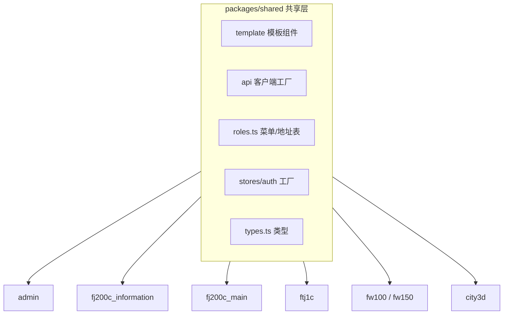

## 5.1 共享层 packages/shared（7 个应用的公共基石）

### 5.1.1 shared 目录全景

```
packages/shared/src/
├── index.ts              # 统一导出入口
├── roles.ts              # 菜单配置 + 应用地址表（纯前端 UI 概念）
├── types.ts              # 类型 re-export（自 generated 导入转发）
├── session.ts            # 会话管理：token 读写、WS URL 构建
├── api/
│   ├── index.ts          # createApiClient 工厂（axios 实例）
│   ├── auth.ts           # 登录/用户信息 API
│   ├── custom-instance.ts # orval 用的请求实例
│   └── generated/        # orval 生成（不手改）
├── stores/
│   └── auth.ts           # createAuthStore 工厂（认证 store）
└── template/             # 模板组件（各应用复用）
    ├── AppNavbar.vue     # 导航栏（690 行）
    ├── LoginPage.vue     # 登录页（683 行）
    └── TemplatePanel.vue # 模板面板
```

### 5.1.2 index.ts 导出清单

```ts
// packages/shared/src/index.ts（导出什么，各应用就 import 什么）
export * from './roles'
export * from './types'
export * from './session'
export { createApiClient } from './api'
export { createAuthStore } from './stores/auth'
export * from './template'      // AppNavbar/LoginPage/TemplatePanel
```

**设计意义**：7 个应用 import 的 `@shared` 就来自这个文件。加新共享内容 → 这里加一行导出。

### 5.1.3 roles.ts 深度（菜单与地址的唯一手写副本）

```ts
// packages/shared/src/roles.ts（关键概念）
// 注意：角色 key/name/permissions 不在手写，运行时从 /api/meta/roles 拉取。
// 这里只维护纯前端 UI 概念：

// ① 菜单配置（导航栏用）
export const MENU_CONFIG: MenuItem[] = [
  {
    key: 'admin',
    label: '系统管理',
    icon: 'Setting',
    appPath: '/admin',
    children: [
      { key: 'users', label: '用户管理', path: '/admin/users' },
    ],
  },
  // fj200c_information / fj200c_main / fw100 / fw150 / ftj1c / city3d ...
]

// ② 应用地址表（跨应用跳转用）
export const ROLE_APP_URLS: Record<string, string> = {
  admin: '/admin',
  fj200c_information: '/fj200c_information',
  fj200c_main: '/fj200c_main',
  fw100: '/fw100',
  fw150: '/fw150',
  ftj1c: '/ftj1c',
  city3d: '/city3d',
}

// ③ 应用名映射（各应用入口）
export const ROLE_APP_NAMES: Record<string, string> = {
  admin: '管理后台',
  fj200c_information: '发动机监控',
  fj200c_main: '发动机测控',
  // ...
}
```

**维护指南**：新增角色时，这里加菜单项 + 地址（第 7 步流程里的一条）。

### 5.1.4 session.ts（token 与 WS URL）

```ts
// packages/shared/src/session.ts
const TOKEN_KEY = 'rustweb_token'        // 7 个应用共用的 key

export function getSessionToken(): string | null {
  return localStorage.getItem(TOKEN_KEY)
}
export function setSessionToken(token: string) {
  localStorage.setItem(TOKEN_KEY, token)
}
export function clearSession() {
  localStorage.removeItem(TOKEN_KEY)
}

// WebSocket URL 构建（WS 不走 JWT header，token 走 ?token= 参数）
export function buildWebSocketUrl(path: string): string {
  const token = getSessionToken()
  const protocol = window.location.protocol === 'https:' ? 'wss://' : 'ws://'
  const base = window.location.hostname + (import.meta.env.DEV ? ':3000' : '')
  return `${protocol}${base}${path}?token=${token ?? ''}`
}
```

**要点**：
1. token 的 key 全局统一 → 同源应用共享登录态。
2. dev 模式后端在 3000 端口，生产同端口托管 → 端口按环境拼。
3. 所有 WS 连接（7 个应用的监控页）都走这个函数，token 失效即连接失败。

### 5.1.5 api/custom-instance.ts（orval 的请求壳）

```ts
// packages/shared/src/api/custom-instance.ts
// orval 生成的请求函数需要自定义实例：在这里接上统一 axios 实例
import { createApiClient } from './index'

const instance = createApiClient('/login')   // 参数：401 后跳转的登录路径

export const customInstance = <T>(config: Parameters<typeof instance>[0]): Promise<T> => {
  return instance(config).then(({ data }) => data as T)   // 直接解出 data（ApiResponse）
}
```

**关键**：orval 生成的 `generated/api/*.ts` 内部全部调用 `customInstance({...})`，所以改这个文件 = 改所有 API 的请求行为（超时、拦截器、401 处理）。

### 5.1.6 stores/auth.ts（认证 store 工厂）

```ts
// packages/shared/src/stores/auth.ts
// 工厂模式：7 个应用各自调用 createAuthStore 生成自己的 store
export function createAuthStore(options: {
  id: string,               // 唯一 id（各应用不同：admin / fj200c_information ...）
  loginPath: string,        // 登录页路径（dev/prod 不同）
  homePath: string,         // 登录后首页
}) {
  return defineStore(options.id, () => {
    const token = ref<string | null>(null)
    const user = ref<UserInfo | null>(null)
    const permissions = ref<Permission[]>([])
    const roles = ref<RoleInfo[]>([])        // 角色注册表缓存
    const loaded = ref(false)                // initAuth 是否完成

    const isLoggedIn = computed(() => !!token.value)
    const hasPermission = (p: Permission) => permissions.value.includes(p)

    async function initAuth() { ... }        // 启动恢复会话 + 拉角色注册表
    async function login(u: string, p: string) { ... }
    function logout() { ... }
    return { token, user, permissions, roles, isLoggedIn, hasPermission, initAuth, login, logout }
  })
}
```

**工厂的好处**：同一份逻辑生成 7 个独立 store（状态互不干扰），但代码只写一份。

### 5.1.7 template/AppNavbar.vue（690 行导航栏拆解）

```vue
<!-- 结构：双层 —— 顶部角色区 + 菜单区 -->
<template>
  <div class="navbar">
    <!-- 第一层：Logo + 应用标题 + 用户信息 + 退出 -->
    <div class="top-row">
      <div class="brand">{{ appName }}</div>
      <div class="actions">
        <el-dropdown>   <!-- 用户菜单：主题切换/退出登录 -->
          <span>{{ authStore.user?.username }}</span>
          <template #dropdown>
            <el-dropdown-menu>
              <el-dropdown-item @click="toggleDark">切换暗色</el-dropdown-item>
              <el-dropdown-item divided @click="handleLogout">退出登录</el-dropdown-item>
            </el-dropdown-menu>
          </template>
        </el-dropdown>
      </div>
    </div>
    <!-- 第二层：菜单（按权限过滤） -->
    <el-menu mode="horizontal" :default-active="activePath" router>
      <el-menu-item v-for="item in visibleMenus" :key="item.key" :index="item.path">
        <el-icon><component :is="item.icon" /></el-icon>
        <span>{{ item.label }}</span>
      </el-menu-item>
    </el-menu>
  </div>
</template>
```

**导航栏逻辑**：`visibleMenus = MENU_CONFIG.filter(菜单权限 <= 用户权限)` —— 没权限的菜单不显示。

### 5.1.8 template/LoginPage.vue（683 行登录页）

```vue
<!-- 结构：左侧品牌区 + 右侧登录表单 + 底部版权 -->
<template>
  <div class="login-page">
    <div class="login-left">
      <!-- 宇航员 CSS 动画（纯 CSS 绘制，无图片资源） -->
      <div class="astronaut"></div>
      <h1>RustWeb 管理系统</h1>
      <p>Rust + Vue3 全栈平台</p>
    </div>
    <div class="login-right">
      <el-form :model="form" :rules="rules" ref="formRef" @keyup.enter="handleLogin">
        <el-form-item prop="username"><el-input v-model="form.username" placeholder="用户名" /></el-form-item>
        <el-form-item prop="password"><el-input v-model="form.password" type="password" show-password /></el-form-item>
        <el-button :loading="loading" @click="handleLogin">登录</el-button>
      </el-form>
    </div>
  </div>
</template>
```

**登录流程**：校验表单 → `authStore.login` → 成功后 `window.location.href = homePath`（**整页跳转**：跨应用/同应用刷新，保证路由 base 与 token 正确加载）。

**宇航员动画**：纯 CSS（transform + animation 关键帧），无任何图片资源——这是"前端也能做视觉效果"的示范。

### 5.1.9 各应用如何消费 shared

```ts
// 每个应用的 stores/auth.ts（约 15 行）
import { createAuthStore } from '@shared'
export const useAuthStore = createAuthStore({
  id: 'fj200c_information',
  loginPath: '/login',
  homePath: '/fj200c_information/monitor',
})
```

**7 个应用 = 7 个 createAuthStore 调用**。改认证逻辑只改 shared 一处。

---

## 5.2 admin 应用走读（管理后台）

### 5.2.1 admin 文件结构

```
frontend/admin/
├── index.html
├── vite.config.ts           # 端口 5174，base /admin/
├── package.json             # name: @rustweb/admin
├── src/
│   ├── main.ts
│   ├── App.vue
│   ├── style.css
│   ├── api/index.ts         # usersApi 组装
│   ├── router/index.ts      # 路由 + 守卫
│   ├── stores/auth.ts       # createAuthStore 调用
│   └── views/
│       ├── Login.vue        # 登录页（复用 shared LoginPage 或自定义）
│       ├── Users.vue        # 用户列表（507 行，04 章已拆解）
│       ├── CreateUser.vue   # 新建用户
│       └── Dashboard.vue    # 概览
```

### 5.2.2 admin 的路由与权限

```ts
// frontend/admin/src/router/index.ts
const router = createRouter({
  history: createWebHistory(import.meta.env.PROD ? '/admin/' : '/'),
  routes: [
    { path: '/login', component: Login },
    {
      path: '/',
      component: Layout,
      redirect: '/users',
      children: [
        {
          path: 'users',
          name: 'Users',
          component: Users,
          meta: { requiresAuth: true, permissions: [Permission.UsersRead] },
        },
        // CreateUser / Dashboard 同理
      ],
    },
  ],
})
router.beforeEach(guard)    // 04 章守卫四步
```

### 5.2.3 admin 的 api facade

```ts
// frontend/admin/src/api/index.ts
import { adminApi as generated } from '@shared/api/generated'

export const usersApi = {
  list: () => generated.adminUsersList(),
  create: (payload: CreateUserRequest) => generated.adminUsersCreate(payload),
  update: (id: number, payload: UpdateUserRequest) => generated.adminUsersUpdate(id, payload),
  remove: (id: number) => generated.adminUsersDelete(id),
}
```

### 5.2.4 admin 特有的业务点

| 特性 | 说明 |
|---|---|
| 双层权限中间件 | 后端 List/Get/Info 只读，Create/Update/Delete 写（R/W/D 三组路由） |
| 防自锁 | 不能删除/降级自己的 admin 角色（后端校验 + 前端按钮禁用） |
| 用户表 | id/username/email/password_hash/role/is_active |
| 角色下拉 | 从 `authStore.roles`（注册表）渲染，非硬编码 |

---

## 5.3 fj200c_information 应用全文件走读（核心示例）

### 5.3.1 应用结构

```
frontend/fj200c_information/
├── vite.config.ts           # 端口 5173，proxy /api → :3000（ws: true）
├── src/
│   ├── main.ts / App.vue / style.css
│   ├── api/
│   │   ├── index.ts             # fj200c_informationApi 组装（8 个 HTTP + WS）
│   │   └── fj200c_information.ts # facade + WS 事件类型手写
│   ├── composables/
│   │   ├── useClock.ts                  # 系统时钟
│   │   ├── useService.ts                # 服务状态轮询
│   │   ├── useCommandChannel.ts         # 命令发送
│   │   ├── useConfigDialog.ts           # 配置对话框
│   │   └── useFj200cInformationEvents.ts # WS 事件分发
│   ├── router/index.ts         # 4 个子页路由
│   ├── stores/auth.ts
│   ├── types.ts                # WS 事件类型（手写）
│   └── views/
│       ├── Monitor.vue         # 监控主界面（411 行）
│       ├── Visual.vue          # 可视化曲线
│       ├── Data.vue            # 数据记录
│       ├── Config.vue          # 配置管理
│       └── Help.vue            # 使用帮助
```

### 5.3.2 api/fj200c_information.ts（facade + WS 事件类型）

```ts
// frontend/fj200c_information/src/api/fj200c_information.ts
import { getFj200cInformationApi } from '@shared/api/generated'
import { buildWebSocketUrl } from '@shared'

const api = getFj200cInformationApi()

// HTTP 接口（8 个）
export const fj200cInformationApi = {
  getServiceStatus: () => api.fj200cInformationServiceStatus(),
  startService: () => api.fj200cInformationServiceStart(),
  stopService: () => api.fj200cInformationServiceStop(),
  sendCommand: (payload: CommandPayload) => api.fj200cInformationCommand(payload),
  getConfig: () => api.fj200cInformationConfigGet(),
  saveConfig: (content: string) => api.fj200cInformationConfigSave({ content }),
  getCsvRecords: () => api.fj200cInformationCsvRecords(),
  downloadCsv: (name: string) => api.fj200cInformationCsvDownload(name),
}

// WS 连接 URL（token 走参数）
export const buildWsUrl = () => buildWebSocketUrl('/api/fj200c_information/ws')
```

### 5.3.3 types.ts（WS 事件类型手写，不走 orval）

```ts
// frontend/fj200c_information/src/types.ts
// WebSocket 不进 OpenAPI（orval 不生成），事件类型全部手写

export type Fj200cInformationWsEvent =
  | { type: 'table_data'; data: TableRow[] }        // 表格数据快照
  | { type: 'frame'; data: FramePayload }           // 帧数据
  | { type: 'payload'; data: PayloadPayload }       // 解包载荷
  | { type: 'service_status'; running: boolean }    // 服务状态
  | { type: 'command_result'; success: boolean; message?: string }  // 命令结果
```

**判别联合**：`type` 字段区分事件，前端 `switch(event.type)` 分发——04 章学的判别联合在此实战。

### 5.3.4 composables/useFj200cInformationEvents.ts（WS 连接 + 分发）

```ts
// 核心逻辑（简化）：连接、重连、事件分发、清理
import { buildWsUrl } from '@/api/fj200c_information'

const RECONNECT_DELAY = 3000          // 重连间隔 3 秒

export function useFj200cInformationEvents() {
  const connected = ref(false)
  const tableData = ref<TableRow[]>([])
  const frameData = ref<FramePayload | null>(null)
  const listeners: Array<(e: Fj200cInformationWsEvent) => void> = []

  let socket: WebSocket | null = null
  let reconnectTimer: number | null = null

  const connect = () => {
    if (socket) return
    socket = new WebSocket(buildWsUrl())
    socket.onopen = () => { connected.value = true }
    socket.onmessage = (ev) => {
      const event = JSON.parse(ev.data) as Fj200cInformationWsEvent
      listeners.forEach((fn) => fn(event))       // 广播给所有订阅者
      // 自身也维护几份快照状态
      if (event.type === 'table_data') tableData.value = event.data
    }
    socket.onclose = () => {
      connected.value = false
      socket = null
      reconnectTimer = window.setTimeout(connect, RECONNECT_DELAY)   // 自动重连
    }
  }

  const close = () => {
    if (reconnectTimer) clearTimeout(reconnectTimer)
    socket?.close()
    socket = null
  }

  onUnmounted(close)    // 组件卸载即断开

  return { connected, tableData, frameData, connect, close, on: (fn) => listeners.push(fn) }
}
```

**要点**：`onclose` 里 3 秒重连（断线自愈）；`onUnmounted` 关闭连接（页面退出不留残留）。

### 5.3.5 composables/useService.ts（服务启停 + 状态轮询）

```ts
export function useService() {
  const running = ref(false)
  const checking = ref(false)

  const checkStatus = async () => {
    const res = await fj200cInformationApi.getServiceStatus()
    if (res.success) running.value = res.data?.running ?? false
  }

  const start = async () => {
    const res = await fj200cInformationApi.startService()
    ElMessage.success(res.message || '服务已启动')
    await checkStatus()
  }

  const stop = async () => {
    // ElMessageBox 二次确认
    await checkStatus()
  }

  return { running, checking, checkStatus, start, stop }
}
```

### 5.3.6 composables/useCommandChannel.ts（命令发送）

```ts
// 向串口发送控制命令（如启动/停止发动机测试流程）
export function useCommandChannel() {
  const sending = ref(false)
  const send = async (cmd: string) => {
    sending.value = true
    try {
      const res = await fj200cInformationApi.sendCommand({ command: cmd })
      if (!res.success) throw new Error(res.message)
      ElMessage.success('命令已发送')
    } catch (e) {
      ElMessage.error((e as Error).message)
    } finally {
      sending.value = false
    }
  }
  return { sending, send }
}
```

### 5.3.7 composables/useClock.ts（时钟）

```ts
export function useClock() {
  const now = ref(new Date())
  let timer: number | null = null
  const start = () => {
    timer = window.setInterval(() => { now.value = new Date() }, 1000)
  }
  onUnmounted(() => { if (timer) clearInterval(timer) })
  return { now, start }
}
```

### 5.3.8 composables/useConfigDialog.ts（配置对话框）

```ts
// 打开 → 拉取当前配置 → 编辑 → 保存 → 刷新
export function useConfigDialog() {
  const visible = ref(false)
  const content = ref('')
  const saving = ref(false)

  const open = async () => {
    visible.value = true
    const res = await fj200cInformationApi.getConfig()
    if (res.success) content.value = res.data?.content ?? ''
  }
  const save = async () => {
    saving.value = true
    try {
      const res = await fj200cInformationApi.saveConfig(content.value)
      if (!res.success) throw new Error(res.message)
      ElMessage.success('已保存（立即生效）')   // 后端热加载
      visible.value = false
    } finally { saving.value = false }
  }
  return { visible, content, saving, open, save }
}
```

### 5.3.9 Monitor.vue（411 行主界面）

```vue
<script setup lang="ts">
import { useClock } from '@/composables/useClock'
import { useService } from '@/composables/useService'
import { useCommandChannel } from '@/composables/useCommandChannel'
import { useConfigDialog } from '@/composables/useConfigDialog'
import { useFj200cInformationEvents } from '@/composables/useFj200cInformationEvents'

const { now, start } = useClock()
const service = useService()
const command = useCommandChannel()
const configDialog = useConfigDialog()
const events = useFj200cInformationEvents()

onMounted(() => {
  start()                       // 启动时钟
  service.checkStatus()         // 查询服务状态
  events.connect()              // 连接 WS
})

// 事件订阅：表格数据直接绑定
const rows = computed(() => events.tableData.value)

const toggleService = async () => {
  service.running.value ? await service.stop() : await service.start()
}
</script>

<template>
  <div class="monitor-page">
    <!-- 顶部：时钟 + 服务状态 + 启停按钮 + 配置按钮 -->
    <div class="toolbar">
      <el-statistic title="系统时间"><template #default>{{ now.toLocaleTimeString() }}</template></el-statistic>
      <el-tag :type="service.running.value ? 'success' : 'info'">
        {{ service.running.value ? '运行中' : '已停止' }}
      </el-tag>
      <el-button :type="service.running.value ? 'danger' : 'primary'" @click="toggleService">
        {{ service.running.value ? '停止服务' : '启动服务' }}
      </el-button>
      <el-button @click="configDialog.open()">配置</el-button>
    </div>

    <!-- 中部：实时数据表格（WS 驱动） -->
    <el-table :data="rows" height="calc(100vh - 200px)" stripe>
      <el-table-column prop="name" label="参数" />
      <el-table-column prop="value" label="数值" />
      <el-table-column prop="unit" label="单位" />
      <el-table-column prop="quality" label="质量" />
    </el-table>

    <!-- 配置对话框 -->
    <ConfigDialog v-bind="configDialog" @save="configDialog.save" />
  </div>
</template>
```

**Monitor 页就是"composable 组装器"**：5 个 composable + 模板，组件本身逻辑极少——这是项目推荐的页面写法。

### 5.3.10 Visual / Data / Config / Help 子页

| 子页 | 职责 | 技术 |
|---|---|---|
| Visual | 曲线可视化 | ECharts 实时折线（数据来自 WS） |
| Data | CSV 记录列表 + 下载 | el-table + 下载按钮（后端文件） |
| Config | 配置说明页 | 静态文档 + 保存入口 |
| Help | 使用帮助 | 静态页面 |

---

## 5.4 fj200c_main 应用走读（最复杂的业务前端）

### 5.4.1 应用特点

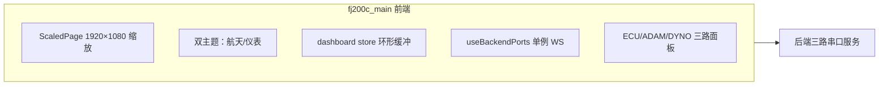

**与 fj200c_information 的三大差异**：
1. 三路串口（ECU/ADAM/DYNO）→ 前端三块面板 + 多路 WS 数据。
2. 1920×1080 固定设计稿 → `ScaledPage` 组件按窗口比例缩放（适配大屏）。
3. 双主题（航天/仪表）→ CSS 变量 + `set_theme` 后端持久化。

### 5.4.2 useBackendPorts.ts（模块级单例 WS + 引用计数）

```ts
// frontend/fj200c_main/src/composables/useBackendPorts.ts
// 问题：子页面切换（KeepAlive）时，WS 不该断也不该重复建
// 方案：模块级单例连接 + 引用计数

let socket: WebSocket | null = null
let refCount = 0                 // 引用计数：当前有多少个组件在用
let reconnectTimer: number | null = null

export function useBackendPorts() {
  const data = ref<BackendPortsData | null>(null)

  if (refCount === 0) connect()  // 第一个组件才建连
  refCount++

  onUnmounted(() => {
    refCount--
    if (refCount === 0) {
      // 最后一个组件退出才断连
      socket?.close()
      socket = null
    }
  })
  return data
}
```

**这个模式解决了真实 bug**：git debb02f 修复了"切页导致 WS 断开"——之前每个页面自己建连，切页时旧连接销毁、新页面又建连，中间状态丢失/重复。引用计数让连接生命周期跟随**整个应用**而非单个页面。

### 5.4.3 ScaledPage（1920×1080 大屏适配）

```vue
<!-- frontend/fj200c_main/src/components/ScaledPage.vue（示意） -->
<script setup lang="ts">
const DESIGN_WIDTH = 1920
const DESIGN_HEIGHT = 1080
const scale = ref(1)
const update = () => {
  const { innerWidth: w, innerHeight: h } = window
  scale.value = Math.min(w / DESIGN_WIDTH, h / DESIGN_HEIGHT)   // 等比缩放
}
window.addEventListener('resize', update)   // 窗口变化重算
update()
</script>
<template>
  <div class="scaled-page" :style="{ transform: `scale(${scale})`, width: '1920px', height: '1080px' }">
    <slot />
  </div>
</template>
```

**原理**：设计稿 1920×1080 直接写死，外层 transform scale 缩放到窗口适配——所有子元素坐标不变，一套布局适配任意分辨率（大屏/小屏）。

### 5.4.4 dashboard store（业务数据中枢）

```ts
// frontend/fj200c_main/src/stores/dashboard.ts（示意）
export const useDashboardStore = defineStore('dashboard', () => {
  // 三路数据
  const ecu = reactive<EcuFields>({ ... })
  const adam = reactive<AdamFields>({ ... })
  const dyno = reactive<DynoFields>({ ... })

  // 图表环形缓冲（限长 100 点）
  const history = ref<number[]>([])
  const pushHistory = (v: number) => {
    history.value.push(v)
    if (history.value.length > 100) history.value.shift()
  }

  // 主题
  const theme = ref<'space' | 'dashboard'>('space')
  const setTheme = (t: 'space' | 'dashboard') => { theme.value = t; ... }

  // CSV 录制状态
  const recording = ref(false)
  return { ecu, adam, dyno, history, pushHistory, theme, setTheme, recording }
})
```

**要点**：三路数据放 store（多组件共享），图表数据限长 100（防内存膨胀），主题响应式全局。

### 5.4.5 双主题 CSS（航天/仪表）

```css
/* frontend/fj200c_main/src/styles/themes.css（示意） */
.theme-space {
  --panel-bg: linear-gradient(180deg, #0b1026, #141b3d);
  --panel-border: rgba(100, 180, 255, 0.35);
  --panel-text: #7fd4ff;
}
.theme-dashboard {
  --panel-bg: linear-gradient(180deg, #1e3a2f, #14332a);
  --panel-border: rgba(80, 220, 160, 0.4);
  --panel-text: #7dffc9;
}
/* 组件引用变量：改主题 = 换 class */
.panel { background: var(--panel-bg); border: 1px solid var(--panel-border); color: var(--panel-text) }
```

**主题持久化**：登录/启动时 `set_theme` 接口读后端 GlobalVar（刷新后仍生效）——主题选择是"全局变量"不是本地缓存。

### 5.4.6 GenerateReport（报表打印，a06a8b4 改为原生 print）

```ts
// 生成试验报表：后端生成 HTML → 前端 window.print 打印
const generateReport = async () => {
  const res = await api.generateReport(store.currentTest)
  if (!res.success) return ElMessage.error(res.message)
  printWindow.value = window.open('', '_blank')     // 新窗口
  printWindow.value.document.write(res.data.html)
  printWindow.value.document.close()
  printWindow.value.print()                          // 原生打印
}
```

**git 记录**：a06a8b4 把旧方案（hiprint 插件）换成原生 window.print——打印需求用浏览器原生能力更可靠，也减少了依赖。

### 5.4.7 ECU 面板（示例面板拆解）

```vue
<!-- 三路面板结构统一（示意） -->
<template>
  <div class="panel">
    <div class="panel-title">ECU 发动机控制单元</div>
    <div class="panel-grid">
      <GaugeCard title="转速" :value="store.ecu.ngSpeed" unit="rpm" :min="0" :max="9000" />
      <GaugeCard title="水温" :value="store.ecu.coolantTemp" unit="℃" />
      <!-- 每个参数一个卡片：仪表盘/数字/进度条三选一 -->
    </div>
    <div class="panel-actions">
      <el-button v-for="c in ecuCommands" :key="c.name" @click="command.send(c.name)">
        {{ c.label }}
      </el-button>
    </div>
  </div>
</template>
```

**GaugeCard** 是高度复用组件（仪表盘）：props 接收 value/unit/range，内部 ECharts gauge 或 SVG 渲染。三路面板 = 三个不同数据源的相同组件组合。

## 5.5 ftj1c 应用走读（UDP 通信监控）

### 5.5.1 应用特点

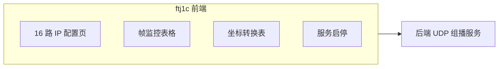

**与 fj200c_information 的差异**：数据源是 UDP 组播（网络帧）而非串口；页面以**表格轮询**为主（WS 实时推送为辅）；IP 配置是核心功能（16 组组播地址）。

### 5.5.2 文件结构

```
frontend/ftj1c/
├── vite.config.ts           # 端口 5176，proxy ws: true
├── src/
│   ├── api/index.ts         # ftj1cApi 组装
│   ├── composables/         # useFtj1cEvents / useService（同 5.3 模式）
│   ├── router/index.ts
│   ├── stores/auth.ts
│   ├── types.ts             # WS 事件类型手写（帧数据/坐标）
│   └── views/
│       ├── Monitor.vue      # 帧监控主界面
│       ├── IpConfig.vue     # IP 配置（16 路）
│       └── Help.vue
```

### 5.5.3 IP 配置页（核心功能）

```vue
<!-- IpConfig.vue 核心（示意） -->
<template>
  <div>
    <el-table :data="ipConfigs" stripe>
      <el-table-column prop="index" label="路数" width="60" />
      <el-table-column prop="name" label="名称" />
      <el-table-column prop="ip" label="组播地址" />
      <el-table-column prop="port" label="端口" />
      <el-table-column label="操作">
        <template #default="{ row }">
          <el-button @click="openEdit(row)">编辑</el-button>
        </template>
      </el-table-column>
    </el-table>
    <el-button @click="saveAll">保存全部</el-button>
  </div>
</template>
```

**注意**：IP 配置修改后需**重启服务**生效（后端 `config-ftj1c.ini` 启动时加载，不热加载）——前端保存成功后提示"配置已保存，重启服务后生效"。

### 5.5.4 帧监控页

```vue
<!-- Monitor.vue 帧表格（示意） -->
<el-table :data="frames" height="100%">
  <el-table-column prop="timestamp" label="时间" width="120" />
  <el-table-column prop="sourceIp" label="来源" width="140" />
  <el-table-column prop="frameType" label="帧类型" width="100" />
  <el-table-column prop="hexData" label="原始数据" min-width="300" />
</el-table>
```

**帧展示**：后端解码后的字段 + 原始 hex（方便人工核对协议）。

### 5.5.5 坐标转换（地图/坐标页）

```ts
// 后端将 UDP 帧中的坐标转换为 CGCS2000（国家大地坐标系）
// 前端展示转换结果表格：原始坐标 → 转换坐标 → 偏移量
```

---

## 5.6 fw100 / fw150 应用走读（最简 CRUD）

### 5.6.1 为什么先读这两个

**fw100/fw150 是项目里最简单的应用**（后端约 100 行，前端一个列表页 + 详情），最适合作为"完整 CRUD 闭环"的解剖标本：

```
后端：handler（4 个接口）→ service（增删改查）→ SQLite 表
前端：Panel.vue（列表）→ Detail.vue（详情）→ 增/删/改弹窗
```

### 5.6.2 文件结构（fw100 示例）

```
frontend/fw100/
├── vite.config.ts           # 端口 5175，proxy /api
├── src/
│   ├── api/index.ts         # fw100Api 组装（5 个方法）
│   ├── router/index.ts      # /login / /panel / /detail/:id
│   ├── stores/auth.ts
│   ├── utils/responsive.ts  # 响应式工具（04 章提过）
│   └── views/
│       ├── Login.vue
│       ├── Panel.vue        # 设备台账列表
│       └── Detail.vue       # 设备详情
```

### 5.6.3 完整 CRUD 走读（后端 + 前端对照）

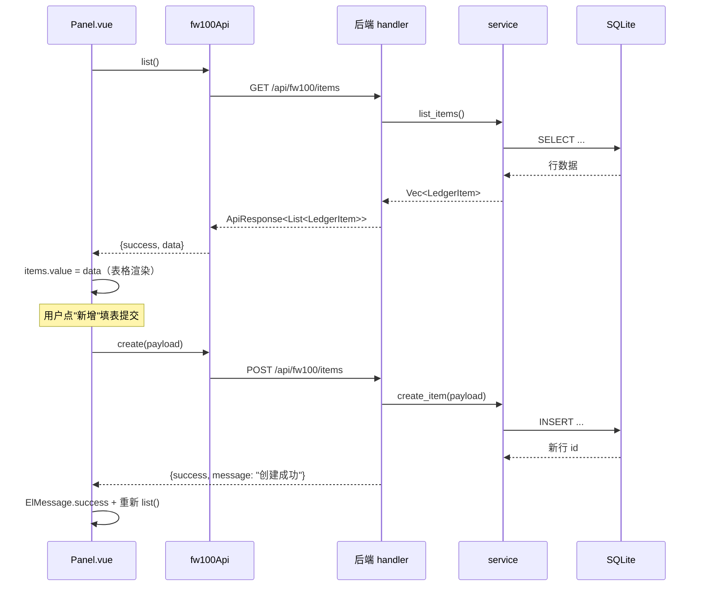

**读这张图你就读懂了全项目 CRUD**——fw100/fw150/admin 的增删改查全是这个模式。

### 5.6.4 fw150 与 fw100 的差异

| 差异 | fw100 | fw150 |
|---|---|---|
| 后端 schema | Fw100LedgerItem | Fw150LedgerItem（独立） |
| 表名 | fw100_ledger_items | fw150_ledger_items |
| 前端 | fw100/ | fw150/ |
| 端口 | 5175 | 5178 |
| 字段 | 约 10 个 | 约 10 个（略有不同） |

**历史原因**：fw150 是 fw100 的变体（后来加的），复制改造——这也是 AGENTS.md「复制现有前端为新应用」的实例。

### 5.6.5 台账页的实践价值

如果你想从零学本项目前端，**fw100 是最佳起点**：
1. 代码量最小（一个列表页 + 详情）。
2. 无 WS、无复杂 composable（纯请求 → 渲染）。
3. 增删改查全覆盖（学习后端如何与前端对接口）。
4. 06 章类型同步的试验田（改一个字段跑一遍 gen:api 全流程）。

---

## 5.7 city3d 应用走读（3D 城市展示）

### 5.7.1 应用特点

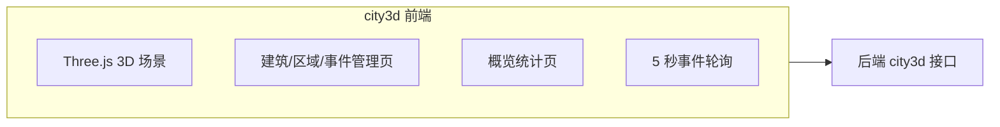

**特殊性**：唯一使用 Three.js 的应用；后端是纯 CRUD + overview 聚合统计；**无 WS**（3D 场景用轮询刷新）。

### 5.7.2 文件结构

```
frontend/city3d/
├── vite.config.ts           # 端口 5177
├── src/
│   ├── api/index.ts         # city3dApi 组装（14 个接口）
│   ├── composables/
│   │   ├── useCityScene.ts      # 3D 场景生命周期（init/dispose）
│   │   └── useCityData.ts       # 5 秒事件轮询
│   ├── shaders/index.ts         # 自定义 GLSL 着色器
│   ├── router/index.ts
│   ├── stores/auth.ts
│   └── views/
│       ├── City3dView.vue   # 3D 主视图
│       ├── Buildings.vue    # 建筑管理
│       ├── Regions.vue      # 区域管理
│       ├── Events.vue       # 事件管理
│       └── Overview.vue     # 概览统计
```

### 5.7.3 useCityScene.ts（3D 场景生命周期）

```ts
// 3D 场景初始化与销毁（简化）
export function useCityScene(container: Ref<HTMLElement | undefined>) {
  let renderer: THREE.WebGLRenderer | null = null
  let animationId: number | null = null

  onMounted(() => {
    if (!container.value) return
    renderer = new THREE.WebGLRenderer({ antialias: true })
    container.value.appendChild(renderer.domElement)
    // 场景/相机/灯光/建筑网格初始化 ...
    animate()
  })

  const animate = () => {
    animationId = requestAnimationFrame(animate)
    controls.update()
    renderer?.render(scene, camera)
  }

  onUnmounted(() => {
    if (animationId) cancelAnimationFrame(animationId)
    renderer?.dispose()
    // 释放 GPU 资源：geometry/material/texture dispose
  })
}
```

### 5.7.4 useCityData.ts（轮询 + 场景数据刷新）

```ts
export function useCityData() {
  const buildings = ref<Building[]>([])
  const regions = ref<Region[]>([])
  const events = ref<CityEvent[]>([])
  let timer: number | null = null

  const refresh = async () => {
    const [b, r, e] = await Promise.all([   // 并行请求
      city3dApi.listBuildings(),
      city3dApi.listRegions(),
      city3dApi.listEvents(),
    ])
    if (b.success) buildings.value = b.data ?? []
    // ...
  }

  onMounted(() => {
    refresh()
    timer = window.setInterval(refresh, 5000)   // 5 秒轮询
  })
  onScopeDispose(() => { if (timer) clearInterval(timer) })
}
```

### 5.7.5 建筑/区域/事件管理页（与 fw100 同构）

三个管理页全部是标准 CRUD（列表 + 弹窗表单），只是字段不同：
- 建筑：名称、坐标（x/y/z）、高度、颜色、状态。
- 区域：名称、范围（多边形点集）。
- 事件：类型、位置、时间、级别、描述。

**与 3D 联动**：保存建筑/事件后刷新场景（`useCityData.refresh()` 或直接重绘网格）。

### 5.7.6 Overview.vue（聚合统计）

```vue
<!-- 概览页：后端 overview 接口聚合统计 -->
<template>
  <div class="overview">
    <el-statistic title="建筑总数" :value="overview.buildingCount" />
    <el-statistic title="区域总数" :value="overview.regionCount" />
    <el-statistic title="事件总数" :value="overview.eventCount" />
    <!-- 事件级别分布图表（ECharts 饼图） -->
    <el-card> 事件级别分布 <ChartPie :data="levelDistribution" /> </el-card>
  </div>
</template>
```

**后端实现**（回忆 03 章）：`LEFT JOIN COUNT` 聚合 + `PaginationParams`（page/page_size clamp 1..100）。

---

## 5.8 前端共性模式总结（7 个应用的共同点）

### 5.8.1 七应用统一骨架

| 层 | 内容 | 7 应用一致 |
|---|---|---|
| 入口 | main.ts（Pinia → Router → ElementPlus → mount） | 是 |
| 根组件 | App.vue（Navbar + router-view） | 是 |
| 认证 | createAuthStore 工厂 + initAuth | 是 |
| 登录 | LoginPage（shared 模板） | 是 |
| 路由 | 守卫四步 + meta 权限 | 是 |
| API | facade 组装 generated | 是 |
| 类型 | 从 @shared 导入 | 是 |
| 会话 | session.ts 统一 token key | 是 |
| 构建 | vite base /xxx/ + proxy /api | 是 |

### 5.8.2 七应用差异对照表

| 应用 | 端口 | 数据源 | WS | 复杂度 | 独特技术 |
|---|---|---|---|---|---|
| admin | 5174 | REST CRUD | 无 | 中 | 双层权限中间件 |
| fj200c_information | 5173 | 串口/模拟 | 有（事件分发） | 高 | composable 组装 |
| fj200c_main | 5179 | 三路串口 | 有（单例+引用计数） | 最高 | ScaledPage/双主题/报表打印 |
| ftj1c | 5176 | UDP 组播 | 有 | 中 | IP 配置 16 路 |
| fw100 | 5175 | REST CRUD | 无 | 低 | 最简单（学习起点） |
| fw150 | 5178 | REST CRUD | 无 | 低 | fw100 变体 |
| city3d | 5177 | REST CRUD | 无（轮询） | 中 | Three.js 场景 |

### 5.8.3 典型页面三型

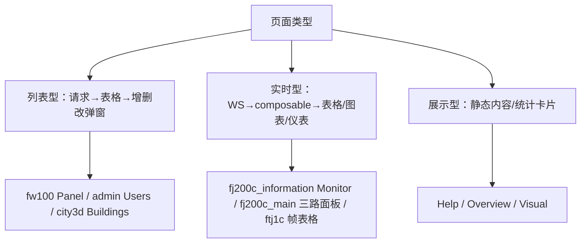

**判断新页面的类型 → 套对应模板写**，这是本项目的"前端开发心法"。

### 5.8.4 新增前端页面的标准步骤

1. `router/index.ts` 加路由（path + component + meta.permissions）。
2. `views/` 建页面组件（复制同类页面改）。
3. 需要接口 → facade 加方法（若后端有对应接口）。
4. `npm run build` 过 vue-tsc。
5. 导航栏菜单（MENU_CONFIG）若需要入口则加。

---

## 5.9 本章收官：前端七应用速查卡

| 想找什么 | 去哪里 |
|---|---|
| 登录/认证逻辑 | @shared stores/auth + session |
| 导航栏/菜单 | @shared template/AppNavbar |
| 请求封装 | @shared api/index + custom-instance |
| 类型 | @shared types（re-export generated） |
| 最简单的 CRUD | fw100 views/Panel.vue |
| 最全的 CRUD | admin views/Users.vue |
| WS 组件级用法 | fj200c_information composables |
| WS 单例用法 | fj200c_main composables/useBackendPorts |
| 大屏适配 | fj200c_main ScaledPage |
| 主题定制 | fj200c_main styles/themes |
| 3D | city3d composables/useCityScene |
| 打印 | fj200c_main 报表（window.print） |

**05 章结束**。你已经可以回答：7 个应用分别干什么、共性在哪、差异在哪、新页面怎么写。下一章讲类型同步机制——前后端如何从一份 Rust 代码生成全部前端类型，这是本项目工程化的核心。

## 5.10 admin 深入：CreateUser 页面（完整表单实战）

### 5.10.1 页面职责

```vue
<!-- frontend/admin/src/views/CreateUser.vue（结构） -->
<template>
  <div class="create-user">
    <el-page-header @back="router.back()" content="新建用户" />
    <el-card class="form-card">
      <el-form ref="formRef" :model="form" :rules="rules" label-width="100px">
        <el-form-item label="用户名" prop="username">
          <el-input v-model="form.username" placeholder="登录用户名" />
        </el-form-item>
        <el-form-item label="邮箱" prop="email">
          <el-input v-model="form.email" placeholder="user@example.com" />
        </el-form-item>
        <el-form-item label="密码" prop="password">
          <el-input v-model="form.password" type="password" show-password />
        </el-form-item>
        <el-form-item label="角色" prop="role">
          <el-select v-model="form.role" placeholder="选择角色">
            <el-option v-for="r in authStore.roles" :key="r.key" :label="r.name" :value="r.key" />
          </el-select>
        </el-form-item>
        <el-form-item>
          <el-button type="primary" :loading="submitting" @click="submit">创建</el-button>
          <el-button @click="router.back()">取消</el-button>
        </el-form-item>
      </el-form>
    </el-card>
  </div>
</template>
```

**角色下拉数据来源**：`authStore.roles`（运行时从 `/api/meta/roles` 拉取的角色注册表）——**不是硬编码**。新增角色后无需改前端代码，下拉自动出现新角色。

### 5.10.2 校验规则与提交

```ts
const rules: FormRules = {
  username: [
    { required: true, message: '请输入用户名', trigger: 'blur' },
    { min: 3, max: 32, message: '长度 3-32', trigger: 'blur' },
    { pattern: /^[a-zA-Z0-9_]+$/, message: '仅字母数字下划线', trigger: 'blur' },
  ],
  email: [
    { required: true, message: '请输入邮箱', trigger: 'blur' },
    { type: 'email', message: '邮箱格式不正确', trigger: 'blur' },
  ],
  password: [
    { required: true, message: '请输入密码', trigger: 'blur' },
    { min: 6, max: 32, message: '密码 6-32 位', trigger: 'blur' },
  ],
  role: [{ required: true, message: '请选择角色', trigger: 'change' }],
}

const submit = async () => {
  const valid = await formRef.value?.validate().catch(() => false)
  if (!valid) return
  submitting.value = true
  try {
    const res = await usersApi.create({ ...form.value })
    if (!res.success) throw new Error(res.message)
    ElMessage.success('用户创建成功')
    router.push('/users')
  } catch (e) {
    ElMessage.error((e as Error).message)
  } finally {
    submitting.value = false
  }
}
```

**完整表单模式**（本项目所有表单统一）：`el-form :model :rules` + `validate()` → 成功才提交 → `submitting` 防重复点击 → 成功跳转/刷新 → 失败 ElMessage。

### 5.10.3 编辑用户的差异

```ts
// 编辑页复用 CreateUser：传入 id → 初始数据不同 → 提交调用 update
const loadUser = async (id: number) => {
  const res = await usersApi.info(id)
  if (res.success && res.data) form.value = { username: ..., email: ..., role: ... }
}
```

**小技巧**：新建/编辑共用一份表单组件，用 `defineProps<{ userId?: number }>` 区分模式。

---

## 5.11 fj200c_information 深入：Visual.vue（实时曲线）

### 5.11.1 页面结构

```vue
<template>
  <div class="visual-page">
    <div class="chart-toolbar">
      <el-select v-model="selectedMetric" placeholder="选择参数">
        <el-option v-for="m in metrics" :key="m.key" :label="m.label" :value="m.key" />
      </el-select>
      <el-checkbox v-model="autoScale">自动缩放</el-checkbox>
    </div>
    <div ref="chartRef" class="chart" />
  </div>
</template>
```

### 5.11.2 曲线数据流

```ts
// 参数切换 → 清空曲线 → 从 WS 快照重新开始
const selectedMetric = ref('ngSpeed')
watch(selectedMetric, () => {
  points.value = []               // 清空历史
  chart.value?.clear()            // 清空图表
})

// WS 帧数据 → 曲线点
events.on((e) => {
  if (e.type === 'frame') {
    const v = (e.data as FramePayload)[selectedMetric.value]  // 按参数取数
    if (typeof v === 'number') points.value.push({ time: Date.now(), value: v })
    if (points.value.length > 200) points.value.shift()       // 限长 200 点
    chart.value?.setOption({
      series: [{ data: points.value.map((p) => p.value) }],
    })
  }
})
```

### 5.11.3 ECharts 实时曲线要点

| 要点 | 说明 |
|---|---|
| setOption 增量更新 | `notMerge: false` 只更新数据，不重建图表 |
| 限长 | 环形缓冲防内存膨胀（图表最多 200 点） |
| resize | 窗口变化 `chart.resize()` |
| dispose | 页面卸载销毁实例 |
| 参数切换 | 清空历史防新旧数据混连 |

---

## 5.12 fj200c_main 深入：三路面板与高级功能

### 5.12.1 三路串口面板对照

| 面板 | 数据 | 命令 | 视觉 |
|---|---|---|---|
| ECU | 转速/水温/油压/油耗…（29 字段） | 启动/停止/标定指令 | 仪表盘 gauge |
| ADAM | 模拟量/数字量采集 | 读取通道 | 数字卡片 |
| DYNO | 测功机状态/扭矩 | 加载控制 | 进度条 |

### 5.12.2 命令发送通道（与 fj200c_information 同构）

```ts
// useCommandChannel（fj200c_main 版）
const sendCommand = async (port: 'ECU' | 'ADAM' | 'DYNO', cmd: string) => {
  sending.value = true
  try {
    const res = await fj200cMainApi.sendCommand({ port, command: cmd })
    if (!res.success) throw new Error(res.message)
    ElMessage.success(`${port} 命令已发送`)
  } finally { sending.value = false }
}
```

**后端对应**：`/api/fj200c_main/ecu/command` 等三路独立接口（`AbstractCom` 统一 trait，前端感知三路差异）。

### 5.12.3 CSV 录制状态

```vue
<!-- 录制控制（工具条） -->
<el-button :type="store.recording ? 'danger' : 'primary'" @click="toggleRecording">
  {{ store.recording ? '停止录制' : '开始录制' }}
</el-button>
<el-tag v-if="store.recording" type="warning">REC ●</el-tag>
```

**后端**：64 列 CSV 按会话写入 `csv/` 目录（`[CSV] Dir = csv` 配置）。前端仅控制启停 + 展示状态。

### 5.12.4 试验信息与报表

```vue
<!-- 试验信息面板：当前试验编号/名称/状态 -->
<el-descriptions title="当前试验" :column="3">
  <el-descriptions-item label="编号">{{ store.currentTest?.id }}</el-descriptions-item>
  <el-descriptions-item label="名称">{{ store.currentTest?.name }}</el-descriptions-item>
  <el-descriptions-item label="状态">
    <el-tag :type="store.currentTest?.completed ? 'success' : 'warning'">
      {{ store.currentTest?.completed ? '已完成' : '进行中' }}
    </el-tag>
  </el-descriptions-item>
</el-descriptions>

<!-- 报表按钮 -->
<el-button @click="generateReport">生成报表</el-button>
```

**报表流程**：后端生成 HTML（`[REPORT] StatePoints` 指定状态点）→ 前端新窗口打印。

### 5.12.5 仪表盘组件 GaugeCard

```vue
<script setup lang="ts">
// 复用组件：一个仪表盘卡片
const props = defineProps<{
  title: string
  value: number
  unit?: string
  min?: number
  max?: number
}>()
const chartRef = ref<HTMLDivElement>()
onMounted(() => {
  chart.value = echarts.init(chartRef.value!)
  chart.value.setOption({
    series: [{
      type: 'gauge',
      min: props.min ?? 0,
      max: props.max ?? 100,
      data: [{ value: props.value, name: props.title }],
      // 仪表盘样式：指针/刻度/颜色分段
    }]
  })
})
watch(() => props.value, (v) => {
  chart.value?.setOption({ series: [{ data: [{ value: v }] }] })
})
onUnmounted(() => chart.value?.dispose())
</script>
<template>
  <div class="gauge-card">
    <div ref="chartRef" class="gauge" />
  </div>
</template>
```

**三路面板复用同一组件**，只是 props 不同——这就是"组件复用"的实际价值。

### 5.12.6 双主题切换的实现细节

```ts
// 主题 store/组合式
const theme = ref<'space' | 'dashboard'>('space')
const applyTheme = (t: 'space' | 'dashboard') => {
  document.documentElement.classList.toggle('theme-space', t === 'space')
  document.documentElement.classList.toggle('theme-dashboard', t === 'dashboard')
}
// 初始化：启动时读后端全局变量
const initTheme = async () => {
  const res = await fj200cMainApi.getTheme()
  if (res.success && res.data) { theme.value = res.data; applyTheme(res.data) }
}
// 切换：保存到后端（持久化）
const setTheme = async (t: 'space' | 'dashboard') => {
  theme.value = t
  applyTheme(t)
  await fj200cMainApi.setTheme(t)
}
```

**注意与 Element Plus 暗色模式的区别**：这是应用自有的两套视觉主题（航天蓝/仪表绿），不是亮暗模式。CSS 变量定义在根元素 class 上。

---

## 5.13 七个应用 vite.config.ts 对照

### 5.13.1 相同骨架

```ts
// 每个应用的 vite.config.ts（以 fj200c_information 为例）
import { defineConfig } from 'vite'
import vue from '@vitejs/plugin-vue'
import { fileURLToPath, URL } from 'node:url'

export default defineConfig(({ command }) => ({
  plugins: [vue()],
  base: command === 'build' ? '/fj200c_information/' : '/',   // 生产子路径
  resolve: {
    alias: {
      '@': fileURLToPath(new URL('./src', import.meta.url)),
      '@shared': fileURLToPath(new URL('../../packages/shared/src', import.meta.url)),
    },
  },
  server: {
    port: 5173,                       // 各应用不同
    proxy: {
      '/api': {
        target: 'http://localhost:3000',
        changeOrigin: true,
        ws: true,                     // 需要 WS 的应用开启
      },
    },
  },
  build: { chunkSizeWarningLimit: 1500 },   // 大包不警告（Element Plus 全量）
}))
```

### 5.13.2 七应用参数表

| 应用 | port | base (build) | proxy ws |
|---|---|---|---|
| admin | 5174 | /admin/ | 否 |
| fj200c_information | 5173 | /fj200c_information/ | 是 |
| fj200c_main | 5179 | /fj200c_main/ | 是 |
| fw100 | 5175 | /fw100/ | 否 |
| fw150 | 5178 | /fw150/ | 否 |
| ftj1c | 5176 | /ftj1c/ | 是 |
| city3d | 5177 | /city3d/ | 否 |

### 5.13.3 为什么 ws: true 只在三个应用开

**WS 代理是必需的**：浏览器 WS 直连 517x 端口没有后端；代理转发 `/api/*/ws` 到 3000。没用到 WS 的应用不开代理选项（其实开也无妨，但项目按需配置更清晰）。

---

## 5.14 七个应用 router 对照（守卫差异）

### 5.14.1 统一守卫模板

```ts
// 每个应用 router/index.ts 的守卫（结构一致，路径不同）
router.beforeEach(async (to) => {
  const authStore = useAuthStore()
  if (!authStore.loaded) await authStore.initAuth()      // ① 确保认证初始化

  if (to.meta.requiresAuth && !authStore.isLoggedIn) {
    return { path: '/login', query: { redirect: to.fullPath } }  // ② 未登录
  }
  if (to.meta.permissions && !authStore.hasAnyPermission(to.meta.permissions)) {
    return { path: '/login' }                             // ③ 无权限
  }
  return true                                            // ④ 放行
})
```

### 5.14.2 各应用路由表

| 应用 | 路由 |
|---|---|
| admin | /login, /users, /users/create, /dashboard |
| fj200c_information | /login, /monitor, /visual, /data, /config, /help |
| fj200c_main | /login, /main（三路面板）, /test（试验）, /report, /settings |
| ftj1c | /login, /monitor, /ipconfig, /help |
| fw100 | /login, /panel, /detail/:id |
| fw150 | /login, /panel, /detail/:id |
| city3d | /login, /view（3D）, /buildings, /regions, /events, /overview |

### 5.14.3 登录后跳转逻辑（LoginPage）

```ts
const handleLogin = async () => {
  const ok = await authStore.login(form.username, form.password)
  if (ok) {
    const redirect = route.query.redirect as string | undefined
    window.location.href = redirect ?? homePath   // 支持登录前想去的页面
  }
}
```

**redirect 参数**：被守卫拦下时记录目标路径，登录成功跳回。

---

## 5.15 前端"测试"现状与构建即检查

### 5.15.1 项目无单元测试框架（有意为之）

| 现状 | 说明 |
|---|---|
| 无 Vitest/Jest | 项目未引入单测框架 |
| 构建即检查 | `npm run build` = vue-tsc（类型）+ vite build（打包） |
| 类型即契约 | 前后端类型由 orval 生成，编译不过 = 契约破坏 |

**为什么够用**：项目是内部工具型系统，核心风险在类型契约（由 gen:api 链路保证）而非纯函数逻辑。想加测试的起点：composables（纯逻辑）→ Vitest。

### 5.15.2 手动验证清单（改动前端后必做）

1. `npm run build` 通过（类型 + 构建）。
2. dev 模式打开页面 → F12 Network 看 API 是否 200。
3. WS 页面 → Network → WS 面板看消息流。
4. 权限切换账号验证按钮/路由控制。
5. `npm run gen:api` 后如果类型变了，全局搜报错点。

### 5.15.3 常见构建错误速查（前端）

| 报错 | 含义 | 处理 |
|---|---|---|
| `Module not found: Can't resolve '@shared/...'` | alias 拼错 | 检查 import 路径 |
| `Element Plus: no matching component` | 组件名错 | 检查组件名 |
| `Property 'xxx' does not exist` | 类型缺字段 | 改类型或改调用 |
| `Cannot find module 'xxx.vue'` | 路径错 | 检查大小写/后缀 |
| `error TS2322: Type 'string' is not assignable to type 'number'` | 类型不匹配 | 改类型 |

## 5.16 shared 深入：types.ts 与 Permission 的 re-export

### 5.16.1 types.ts 做什么

```ts
// packages/shared/src/types.ts
// 前端类型唯一入口：从 generated 转发，不自己写
export type { Permission, RoleInfo, UserInfo, ... } from './api/generated/model'
export { Permission } from './api/generated/model'    // 枚举（运行时用）
```

**为什么转发一层**：generated 的模型可能因 orval 配置调整而变（文件路径/命名），前端只认 `@shared` 稳定出口。`Permission` 是 enum（不是 type）——它同时是类型与运行时值：

```ts
// 使用方式
import { Permission } from '@shared'
authStore.hasPermission(Permission.UsersWrite)   // 运行时值
const p: Permission = 'users.write'              // 类型
```

### 5.16.2 Permission 字符串值的约定

```ts
// generated/model/permission.ts（orval 生成，示意）
export enum Permission {
  SystemAdmin = 'system.admin',
  UsersRead = 'users.read',
  UsersWrite = 'users.write',
  UsersDelete = 'users.delete',
  Fj200cInformationMonitor = 'fj200c_information.monitor',
  Fj200cMainMonitor = 'fj200c_main.monitor',
  Fw100Monitor = 'fw100.monitor',
  Fw150Monitor = 'fw150.monitor',
  Ftj1cMonitor = 'ftj1c.monitor',
  City3dView = 'city3d.view',
}
```

**对应后端**：`src/common/models.rs` 的 `Permission` 枚举（`#[derive(ToSchema)]`）——**两端是同一份定义**（Rust 源头 → OpenAPI → TS）。

### 5.16.3 其他 re-export 的类型

```ts
export type {
  ApiResponse,        // 统一响应包装 {success, message, data}
  CreateUserRequest,  // 请求体
  LedgerItem,         // 台账条目
  Fj200cMainEcuData,  // ECU 数据
  // ... 所有 ToSchema 的 Rust 结构体
} from './api/generated/model'
```

**ApiResponse 的泛型**：`ApiResponse<T>` = `{ success: boolean; message: string; data: T | null }`。所有接口返回它——前端判断 `res.success` 的统一依据。

---

## 5.17 前端文件速查表（按需求定位文件）

### 5.17.1 改菜单/导航

| 需求 | 文件 |
|---|---|
| 加菜单项 | `packages/shared/src/roles.ts` MENU_CONFIG |
| 改应用名 | `packages/shared/src/roles.ts` ROLE_APP_NAMES |
| 改导航栏样式 | `packages/shared/src/template/AppNavbar.vue` |

### 5.17.2 改登录流程

| 需求 | 文件 |
|---|---|
| 登录逻辑 | `@shared stores/auth.ts`（login action） |
| 登录页 UI | `@shared template/LoginPage.vue` |
| token 存取 | `@shared session.ts` |
| 401 跳转 | `@shared api/index.ts`（拦截器） |

### 5.17.3 改业务页面

| 需求 | 文件 |
|---|---|
| 加列表字段 | 对应 views/*.vue 表格列 |
| 加表单字段 | 表单组件 + facade 参数 |
| 加请求 | 对应 api/*.ts facade |
| 加 WS 事件 | types.ts + composables 分发 |

### 5.17.4 改样式主题

| 需求 | 文件 |
|---|---|
| 全局颜色 | 各应用 style.css（CSS 变量） |
| 暗色模式 | `@shared template/AppNavbar.vue`（切换逻辑） |
| 航天主题 | fj200c_main styles/themes.css |

---

## 5.18 实战场景演练（5 个真实需求）

### 场景 1：给 fw100 加一个"备注"字段

```
后端：
1. src/fw100/service.rs 查询/插入 SQL 加 remark 列
2. src/fw100 的 DTO（models）加 remark 字段（ToSchema）
前端：
3. npm run gen:api → generated 自动多出 remark
4. Panel.vue 表格加一列 <el-table-column prop="remark" />
5. 弹窗表单加 el-input v-model="form.remark"
6. npm run build 通过
```

### 场景 2：导航栏加一个"系统公告"入口

```
1. packages/shared/src/roles.ts MENU_CONFIG 加 { key: 'notice', label: '系统公告', path: '/notice' }
2. admin src/views/Notice.vue 新建页面
3. admin router/index.ts 加路由（meta.permissions 选个权限）
4. npm run build
```

### 场景 3：监控页加一个 WS 数据字段

```
后端：
1. 帧解码 struct 加字段（src/fj200c_information/decode.rs）
2. WS 事件 payload 加字段 → 不需要动（帧结构整体推）
前端：
3. types.ts 帧类型加字段
4. Monitor.vue 表格加列
5. 若曲线需要 → Visual.vue metrics 列表加项
```

### 场景 4：给 ftj1c 加第 17 路 IP 配置

```
后端：
1. src/ftj1c/models.rs IpConfig 列表长度改 17
2. config-ftj1c.ini 生成逻辑同步
前端：
3. IpConfig.vue 表格自然渲染 17 行（数据驱动，无硬编码）
4. 若固定渲染 16 → 找硬编码处改掉
```

### 场景 5：新增一个权限（如"数据导出"）

```
后端：
1. src/common/models.rs Permission 加 XxxExport
2. src/roles.rs 角色注册表加权限
3. 需要校验的接口加 permission_middleware
前端：
4. npm run gen:api（Permission 枚举更新）
5. 页面按钮 :disabled="!authStore.hasPermission(Permission.XxxExport)"
6. admin 界面即可配置角色权限（注册表驱动）
```

**五个场景覆盖了日常二次开发 90% 的需求**——都是"改一处 → 生成 → 前端引用"的模式。

---

## 5.19 前端性能与体验细节（7 应用通用）

### 5.19.1 表格性能

| 手段 | 适用 |
|---|---|
| `height` 固定表格高度 | 大数据列表（Monitor） |
| 分页 | 列表 > 100 条（admin 用户表） |
| 字段裁剪 | 表格只显示必要列 |
| 虚拟滚动（el-table-v2） | 数千行（当前未用，可按需引入） |

### 5.19.2 图表性能

- 限长缓冲（100~200 点）——防 DOM/Canvas 膨胀。
- `setOption` 增量更新而非整表重设。
- 卸载 dispose——防内存泄漏。
- 页面不可见时暂停动画（`document.hidden` 判断，可选）。

### 5.19.3 WS 数据量控制

| 层 | 手段 |
|---|---|
| 后端 | 事件节流（200ms/50ms）、帧缓存 |
| 前端 | 只订阅需要的字段、限长缓冲、节流渲染 |
| 传输 | JSON 压缩（小帧无所谓）、token 查询参数 |

### 5.19.4 加载体验

- 页面级 `v-loading` + 按钮 `loading` 防重复点击。
- 首屏关键数据并行请求（Promise.all）。
- 路由懒加载（默认）→ 首包小。
- 大依赖动态 import（打印库等）。

---

## 5.20 前端最佳实践清单（写代码前对照）

### 5.20.1 必做清单

```
[ ] 类型从 @shared 导入（不手写后端类型副本）
[ ] API 走 facade（不直接 import generated）
[ ] 页面逻辑下沉 composable（>100 行 script 时）
[ ] 跨组件状态用 store（不用 event bus 硬传）
[ ] 资源清理（定时器/WS/图表/dispose）
[ ] 列表 :key 唯一、loading 完整、空态兜底
[ ] 危险操作二次确认（ElMessageBox）
[ ] 表单 validate 通过才提交
[ ] 网络异常 try/catch + 提示
[ ] npm run build 通过（类型即契约）
```

### 5.20.2 禁做清单

```
[✗] 子目录单独 npm install（pinia 双实例黑屏）
[✗] 直接改 packages/shared/src/api/generated/（生成文件）
[✗] 手写 Permission 字符串（用枚举）
[✗] 解构 store 丢响应式（用 storeToRefs）
[✗] 组件内自己管 WS 不清理（用 composable 模式）
[✗] 模板里写复杂逻辑（抽 computed/函数）
[✗] 删除 shared 导出（其他应用依赖）
```

---

## 5.21 七应用前端架构对照总结（本日精华）

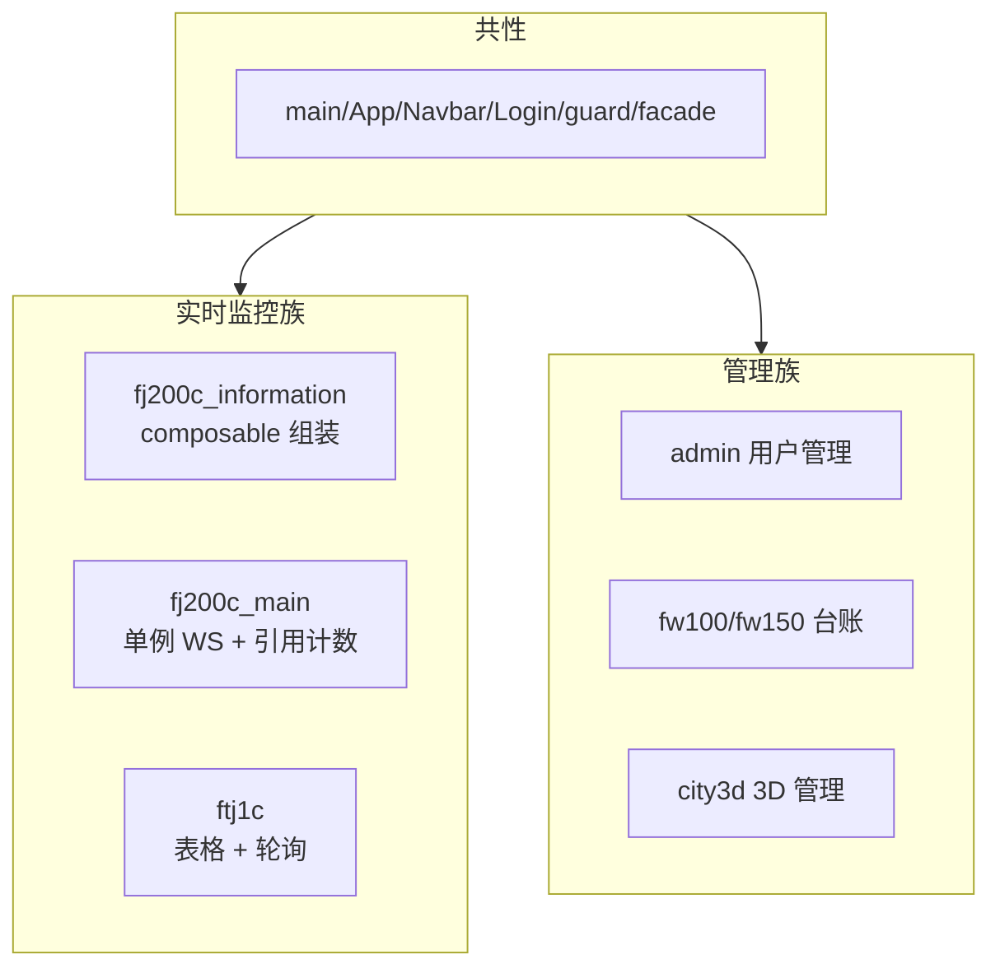

**一句话总结 05 章**：7 个应用共享一套骨架（shared），差异只在业务数据形态（REST 表数据 / WS 实时流 / 3D 场景），页面按"列表型/实时型/展示型"三模板套写。

## 5.22 admin 深入：Dashboard 与系统信息

### 5.22.1 概览页结构

```vue
<!-- frontend/admin/src/views/Dashboard.vue（结构） -->
<template>
  <div class="dashboard">
    <el-row :gutter="16">
      <el-col :span="8">
        <el-card>用户总数 <el-statistic :value="stats.userCount" /></el-card>
      </el-col>
      <el-col :span="8">
        <el-card>角色总数 <el-statistic :value="stats.roleCount" /></el-card>
      </el-col>
      <el-col :span="8">
        <el-card>当前在线 <el-statistic :value="stats.onlineCount" /></el-card>
      </el-col>
    </el-row>
    <el-card class="welcome">
      <h3>欢迎，{{ authStore.user?.username }}</h3>
      <p>当前角色：{{ currentRoleName }}</p>
      <p>拥有权限：{{ authStore.permissions.join('、') }}</p>
    </el-card>
  </div>
</template>
```

**概览页价值**：新手一进来就能看"我有多少权限、什么角色"——这是验证认证链路的可视化窗口。

### 5.22.2 角色名展示（注册表映射）

```ts
const currentRoleName = computed(() => {
  const key = authStore.user?.role
  return authStore.roles.find((r) => r.key === key)?.name ?? key ?? '未知'
})
```

**注意**：显示名称从 `/api/meta/roles` 注册表映射，不硬编码中文名——后端改名自动同步。

---

## 5.23 深入：登录态与多应用跳转完整链路

### 5.23.1 链路总览

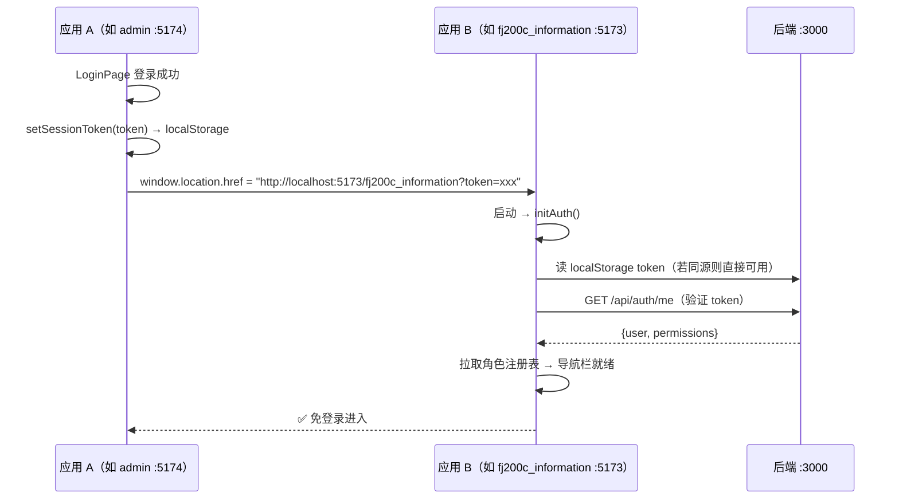

### 5.23.2 dev 模式跨端口的特殊处理

**问题**：dev 模式各应用端口不同（5173~5179），localStorage 按"源"隔离——5173 存的 token 5174 读不到。

**解决方案**（项目实际做法）：
1. 登录成功后**整页跳转**到目标应用，并把 token 通过 `?token=` 查询参数传递。
2. 目标应用启动时 `initAuth` 检查 URL 参数 → 写入自己端口的 localStorage → 完成会话恢复。

```ts
// 各应用 App.vue 的 initAuth（示意）
async function initAuth() {
  const urlToken = new URLSearchParams(window.location.search).get('token')
  if (urlToken) {
    setSessionToken(urlToken)              // 写入本端口的 localStorage
    // 清理 URL（刷新页面不带 token）
    history.replaceState({}, '', window.location.pathname)
  }
  // 继续正常流程：validate token → 拉用户信息 → 拉注册表
}
```

### 5.23.3 prod 模式为什么不需要

生产环境 7 个应用由**同一个后端**托管（同源同端口），localStorage 天然共享 → 跨应用跳转无需传 token，直接共享登录态。

**这就是 01 章说的"6 个用户端 + admin 共享同一登录态（localStorage token），跨应用跳转 token 自动传递"的实现细节。**

### 5.23.4 登录失效的传导

token 过期 → 任一应用接口 401 → 拦截器清会话（`clearSession`）→ 跳该应用登录页。**其他应用不受影响**（各自 initAuth 时才验证）。

---

## 5.24 深入：Element Plus 组件级封装（复用模式）

### 5.24.1 常见封装清单

| 封装组件 | 位置 | 用途 |
|---|---|---|
| GaugeCard | fj200c_main components | 仪表盘卡片 |
| ChartLine | 各应用（ECharts 折线） | 实时曲线 |
| ConfigDialog | fj200c_information components | 配置编辑对话框 |
| StatusTag | 各应用 | 状态标签（运行/停止） |
| AppNavbar | @shared template | 全局导航栏 |

### 5.24.2 封装的原则

```ts
// 封装 = props 收参数 + emit 抛事件 + 内部维护自身状态
defineProps<{ title: string; value: number; unit?: string }>()
defineEmits<{ (e: 'click-more'): void }>()
```

**什么时候该封装**：同一 UI 结构出现 ≥2 次。**什么时候不该封装**：需求差异太大（为封装而封装是负资产）。

---

## 5.25 各应用 index.html 与入口文件对照

### 5.25.1 index.html 模板

```html
<!-- 每个应用 frontend/xxx/index.html -->
<!doctype html>
<html lang="zh-CN">
  <head>
    <meta charset="UTF-8" />
    <meta name="viewport" content="width=device-width, initial-scale=1.0" />
    <title>发动机监控系统</title>   <!-- 各应用标题不同 -->
  </head>
  <body>
    <div id="app"></div>
    <script type="module" src="/src/main.ts"></script>
  </body>
</html>
```

### 5.25.2 七应用标题对照

| 应用 | 标题 |
|---|---|
| admin | 管理系统 |
| fj200c_information | 发动机监控系统 |
| fj200c_main | 发动机测控系统 |
| ftj1c | UDP 通信监控 |
| fw100 | 设备台账管理 |
| fw150 | 设备台账管理 |
| city3d | 城市三维展示 |

**浏览器标签页/后端托管时的 `<title>` 与文档标题可改**——生产环境由后端内嵌 dist 托管，改标题只需改 index.html 重新构建。

---

## 5.26 前端工具函数（各应用 utils）

### 5.26.1 常见工具模块

| 工具 | 内容 | 使用 |
|---|---|---|
| utils/format.ts | 时间格式化、数字补零 | 表格时间列 |
| utils/hex.ts | 十六进制转换 | ftj1c 帧展示 |
| utils/ascii.ts | ASCII ↔ 字符串 | 串口帧解析 |
| utils/responsive.ts | 响应式判断 | 布局 |
| utils/csv.ts | CSV 导出 | Data 页 |
| utils/theme.ts | 主题切换 | fj200c_main |

### 5.26.2 工具函数示例

```ts
// utils/format.ts（示意）
export const pad2 = (n: number) => String(n).padStart(2, '0')
export const formatTime = (d: Date) => `${pad2(d.getHours())}:${pad2(d.getMinutes())}:${pad2(d.getSeconds())}`

// utils/hex.ts（示意）
export const bytesToHex = (bytes: number[]) => bytes.map((b) => b.toString(16).padStart(2, '0').toUpperCase()).join(' ')
```

---

## 5.27 前端开发环境设置（VS Code）

### 5.27.1 必备扩展

| 扩展 | 用途 |
|---|---|
| Vue Language Features (Volar) | Vue SFC 语法支持 |
| TypeScript Vue Plugin | 模板类型检查 |
| ESLint（如启用） | 代码规范 |
| Prettier | 格式化 |

**注意**：Vue 3 项目必须用 Volar（不要装 Vetur，那是 Vue 2 的）。工作区设置：

```jsonc
// .vscode/settings.json（仓库根目录）
{
  "vue.server.hybridMode": true,
  "files.eol": "crlf",          // Windows 项目统一 CRLF（与现有文件一致）
  "editor.formatOnSave": true
}
```

### 5.27.2 调试技巧

- **F12 浏览器 DevTools**：断点、Network、Vue DevTools。
- **console.log + vscode 调试**：快速定位。
- **Vue DevTools 组件面板**：直接看 ref/state 当前值。
- **模拟移动端**：DevTools 设备模拟器。

### 5.27.3 常见工作流

```powershell
# 开发循环：改代码 → 浏览器热更新（dev）→ 最终 npm run build 验证
# 改 shared 代码 → 所有应用同时生效（源码引用）
# 改后端接口 → npm run gen:api 更新类型 → 前端按报错修调用点
```

---

## 5.28 前端章节收官自测（50 题精华 10 问）

1. shared 里角色注册表的 key/name/permissions 从哪来？（运行时 /api/meta/roles）
2. AppNavbar 的菜单如何过滤权限？（MENU_CONFIG 按权限过滤）
3. LoginPage 登录成功后为什么整页跳转？（路由 base + 跨应用 token 传递）
4. useBackendPorts 为什么用模块级单例？（切页不断连、防重复连接）
5. ScaledPage 的缩放原理？（固定设计稿 transform scale）
6. 双主题切换的本质？（CSS 变量 + 根元素 class 切换）
7. fw100 适合新手读的原因？（最简单 CRUD 闭环）
8. city3d 与实时监控族的最大差异？（无 WS，5 秒轮询）
9. 新增前端页面的五个步骤？（路由/视图/facade/build/菜单）
10. dev 模式跨端口登录态如何传递？（?token= 参数 + initAuth 写入）

**全部答对 → 05 章毕业**。你已经具备阅读项目任意前端文件的能力。下一章深入类型同步——理解 7 个应用类型从何而来、如何"改一处全链路生效"。

## 5.29 深入：orval 生成的请求函数（读懂 generated）

### 5.29.1 一个生成函数的解剖

```ts
// packages/shared/src/api/generated/api/fj200c-information.ts（orval 生成，示意）
export const fj200cInformationServiceStatus = () => {
  return customInstance<ApiResponse<ServiceStatusResult>>({
    url: `/api/fj200c_information/service/status`,
    method: 'GET',
  })
}
```

**结构规律**：
1. 函数名 = `tag + operationId`（驼峰），直接可读。
2. 内部调用 `customInstance`（统一请求壳）。
3. 返回类型 = `ApiResponse<...>`（解包后的 Promise）。
4. 参数 → 直接拼进 url 或 requestBody。

### 5.29.2 带参数与请求体的函数

```ts
// 路径参数
export const fw100ItemsUpdate = (id: number, createLedgerItemRequest: CreateLedgerItemRequest) => {
  return customInstance<ApiResponse<CreateLedgerItemRequest>>({
    url: `/api/fw100/items/${id}`,
    method: 'PUT',
    headers: { 'Content-Type': 'application/json' },
    data: createLedgerItemRequest,
  })
}
```

### 5.29.3 生成文件的目录组织

```
packages/shared/src/api/generated/
├── api/
│   ├── auth.ts
│   ├── admin.ts
│   ├── fj200c-information.ts
│   ├── fj200c-main.ts
│   ├── fw100.ts / fw150.ts / ftj1c.ts / city3d.ts / meta.ts
├── model/
│   ├── permission.ts
│   ├── role-info.ts
│   ├── user-info.ts
│   ├── api-response.ts
│   └── ... 所有 ToSchema 结构体
└── custom-instance.ts    # 壳（真正实例在 shared api/index.ts）
```

**tags-split 模式**：按后端 utoipa 的 `tags` 分组生成文件——后端加一个新 tag（新模块）→ generated 自动多一个文件。

### 5.29.4 为什么不能手改 generated

```ts
// ⚠️ 文件头部注释：此文件由 orval 自动生成，请勿手动修改
// npm run gen:api 会重新生成整个目录
```

**任何手改都会在下次生成时丢失**。要改生成逻辑 → 改 `orval.config.ts`（根目录）。

---

## 5.30 深入：WS 事件三种使用模式对照

### 5.30.1 模式一：组件级连接（fj200c_information）

```ts
// 每个使用页自己 connect/close（页面少、逻辑简单时）
const events = useFj200cInformationEvents()
onMounted(() => events.connect())
onUnmounted(() => events.close())
```

**适用**：单页使用；页面切换可接受短暂断连重连。

### 5.30.2 模式二：模块级单例（fj200c_main）

```ts
// 连接与整个应用共存亡（KeepAlive 切页不断连）
// useBackendPorts：refCount 计数，第一个用才建连，最后一个离开才断开
```

**适用**：多页面共享同一数据源；切换频繁；连接成本高（三路数据）。

### 5.30.3 模式三：事件总线解耦（跨模块）

```ts
// 连接只在一处（App.vue 或初始化模块），页面通过事件订阅
const syncBus = useEventBus('backend-data')
syncBus.on('update', (data) => ...)
```

**适用**：多个不相关模块都要消费同一事件流。本项目实际以模式一/二为主，事件总线用于主题/同步等零星事件。

### 5.30.4 三模式选择指南

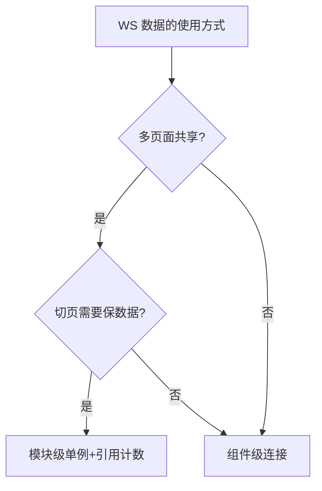

---

## 5.31 深入：前端错误处理全景（续 4.47）

### 5.31.1 错误分层与兜底

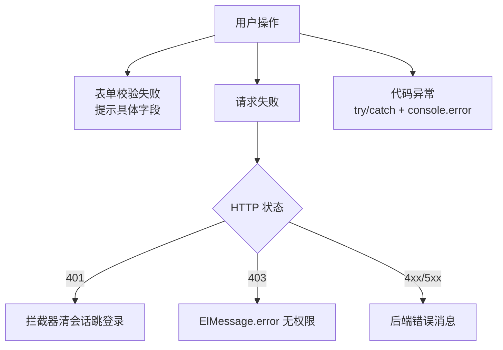

### 5.31.2 后端错误消息的前端呈现

```ts
// 后端 AppError 的 message 通过 ApiResponse.message 透传
const res = await api.save(content)
if (!res.success) {
  ElMessage.error(res.message)   // 后端说啥前端显示啥（如"配置格式错误"）
  return
}
```

**设计默契**：后端错误消息面向用户可读（中文），前端直接展示——不需要前端再翻译错误码。

### 5.31.3 loading/disabled 防止重复提交

```ts
// 所有提交按钮：submitting 期间禁用
<el-button :loading="submitting" :disabled="submitting" @click="submit">
// 后端幂等设计（如服务启停）进一步兜底
```

---

## 5.32 深入：前端应用复制改造指南（fw150 实例复盘）

### 5.32.1 fw150 是怎么来的

按 AGENTS.md「复制现有前端为新应用」流程：

```
1. 复制 frontend/fw100 → frontend/fw150
2. 全局替换：fw100 → fw150（包名/组件名/路径）
3. vite.config.ts：端口 5175 → 5178，base /fw100/ → /fw150/
4. package.json：name @rustweb/fw100 → @rustweb/fw150
5. 根 package.json workspaces 加 frontend/fw150
6. api facade：fw100Api → fw150Api（generated 对应生成）
7. 后端：新 fw150 模块（handler/service/models）
8. npm run gen:api + npm run build 验证
9. deploy.bat 加构建步骤
```

### 5.32.2 复制改造的通用清单（新应用模板）

| 文件 | 改什么 |
|---|---|
| vite.config.ts | port/base |
| package.json | name |
| index.html | title |
| api/*.ts | facade 函数名 |
| router/index.ts | 路由 path/meta |
| stores/auth.ts | createAuthStore id/loginPath/homePath |
| views/* | 页面内容 |

### 5.32.3 复制改造的坑

1. **残留硬编码**：旧应用名出现在 import 路径/变量名 → 用全局搜索替换清理。
2. **端口冲突**：新端口没同步改 vite.config → dev 起不来。
3. **workspaces 漏加**：根 package.json 没加 → npm install 不安装依赖。
4. **权限不匹配**：路由 meta.permissions 用的还是旧权限 → 新角色进不来。
5. **后端路由没挂**：新模块 routes.rs 没注册 → 404。

**对照 AGENTS.md 第 7 步流程逐项检查**是唯一稳妥路线。

---

## 5.33 前端章节全量速查表（收藏级）

### 5.33.1 按"症状"找文件

| 症状 | 文件 |
|---|---|
| 页面白屏 | main.ts / App.vue / router |
| 登录不进 | shared stores/auth + LoginPage |
| 菜单不对 | shared roles.ts MENU_CONFIG |
| 按钮点了没反应 | 对应页面 script（看 loading/权限） |
| 数据不动 | WS composables（连接/事件） |
| 表格列不对 | 对应 views/*.vue |
| 样式乱 | style.css / themes.css |
| 构建报类型错 | 对应页面 + @shared types |

### 5.33.2 按"改动"找文件

| 改动 | 文件 |
|---|---|
| 加菜单 | shared roles.ts |
| 加路由页 | router + views |
| 加接口 | 后端 handler + facade |
| 加 WS 事件 | types.ts + composables |
| 改主题 | themes.css + theme 逻辑 |
| 改权限 | 后端 roles.rs + generated |
| 改端口 | vite.config.ts |

### 5.33.3 前端学习路径推荐

```
fw100（CRUD）→ admin（权限/表单）→ fj200c_information（WS/composable）
→ ftj1c（轮询/配置）→ fj200c_main（单例 WS/大屏/主题）→ city3d（3D）
```

**难度递增**，每过一个应用你的"阅读理解能力"就上一个台阶。读代码顺序：index.html → main.ts → App.vue → router → api → composables → views。

## 5.34 深入：AppNavbar 的完整实现（690 行拆解）

### 5.34.1 顶层结构

```vue
<template>
  <div class="navbar">
    <header class="navbar-top">
      <!-- 左：品牌区（Logo + 应用名 + 当前应用标识） -->
      <!-- 右：暗色切换 / 用户下拉（个人中心、退出） -->
    </header>
    <nav class="navbar-menu">
      <!-- 菜单区：水平菜单（权限过滤后） -->
    </nav>
  </div>
</template>
```

### 5.34.2 菜单数据装配

```ts
// 计算可见菜单
const visibleMenus = computed(() => {
  // 从 MENU_CONFIG 里按用户权限过滤
  return MENU_CONFIG.filter((menu) => {
    // 无权限要求的直接显示
    if (!menu.permissions?.length) return true
    // 有权限要求的：任一命中即可
    return menu.permissions.some((p) => authStore.hasPermission(p))
  })
})
```

### 5.34.3 当前高亮

```ts
// 高亮 = 当前路径匹配菜单 path
const activeMenu = computed(() => {
  const path = route.path
  return visibleMenus.value.find((m) => path.startsWith(m.path))?.key ?? ''
})
```

### 5.34.4 用户菜单与退出

```ts
const handleLogout = async () => {
  await authStore.logout()     // 清会话 + 清注册表缓存
  window.location.href = loginPath   // 整页跳登录页
}
```

**为什么用 location.href**：退出后需要彻底重置应用状态（store 内存态 + localStorage），整页刷新最干净。

---

## 5.35 深入：Monitor 页全链路时序（请求→WS→渲染）

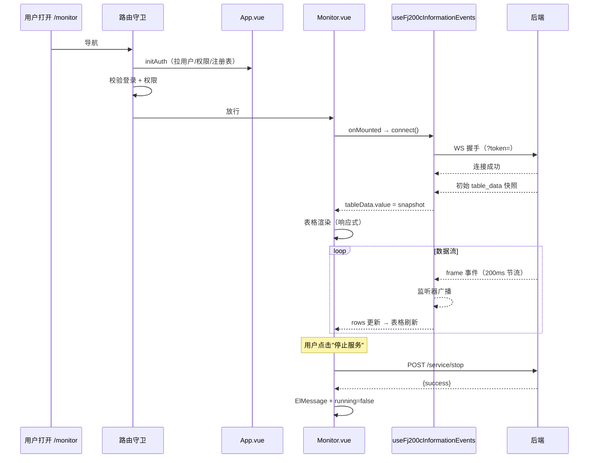

**这张时序图回答了"一个实时监控页是怎么活起来的"**——守卫（权限）→ 挂载（连 WS）→ 快照（首屏）→ 增量（持续更新）→ 操作（控制命令）。

---

## 5.36 深入：Element Plus 国际化与语言

### 5.36.1 中文配置

```ts
// main.ts
import zhCn from 'element-plus/dist/locale/zh-cn.mjs'
app.use(ElementPlus, { locale: zhCn })
```

**效果**：分页器"共 x 条"、日期选择器星期、MessageBox 按钮文字都是中文。

### 5.36.2 项目内文字硬编码

项目业务文案（按钮/提示）直接写在模板中文——无 i18n 框架。内部系统够用；如要国际化，需要引入 vue-i18n 并迁移文案（超出当前需求）。

---

## 5.37 深入：刷新页面状态恢复

### 5.37.1 刷新丢什么、留什么

| 状态 | 刷新后 | 机制 |
|---|---|---|
| token/用户 | 保留 | localStorage（session.ts） |
| 角色注册表 | 重新拉取 | initAuth |
| 组件内 ref | 丢失 | 无持久化（页面重挂载） |
| store 数据 | 丢失 | 无持久化（WS 会重连重新推送） |
| 主题 | 保留（fj200c_main） | 后端 GlobalVar |

### 5.37.2 为什么业务数据不持久化

WS 应用的数据是"实时流"，刷新后重连即可拿到最新——持久化旧数据反而误导。**只有认证/配置类状态需要持久化**。

---

## 5.38 深入：前端问题定位流程（故障排查指南）

### 5.38.1 页面/功能异常排查路径

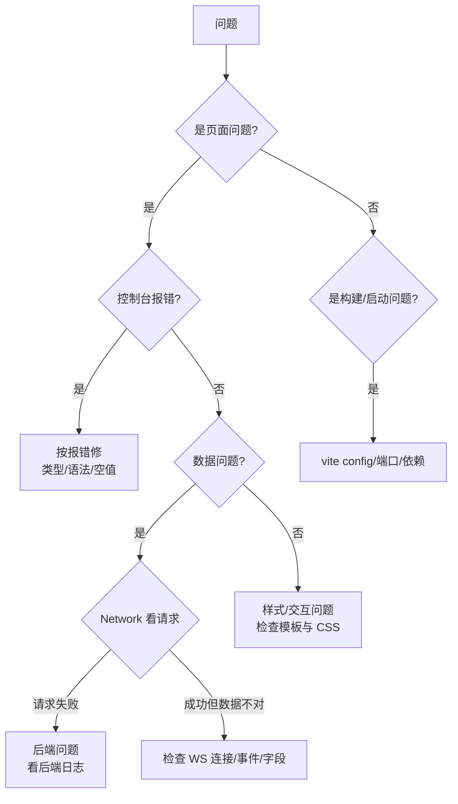

### 5.38.2 记录问题信息（给协作方看）

```
环境：dev/prod
应用：admin / fj200c_information ...
页面：/monitor
现象：表格 5 秒后卡住不刷新
复现：启动服务 → 打开页面 → 等待
控制台：无报错
Network：WS 消息持续到达（截图）
后端日志：RUST_LOG=debug 输出（附件）
```

**排查三要素**：控制台报错、Network 请求/WS 流、后端日志——三者对照即可定位绝大多数问题。

---

## 5.39 终极实战：给 ftj1c 加"帧搜索"功能（完整实操）

### 需求

帧监控表格加搜索框：按来源 IP 或帧类型过滤。

### 步骤 1：模板加搜索框

```vue
<!-- frontend/ftj1c/src/views/Monitor.vue -->
<el-input v-model="searchText" placeholder="按来源 IP 或类型搜索" clearable style="width: 280px" />
```

### 步骤 2：computed 过滤

```ts
const searchText = ref('')
const filteredFrames = computed(() => {
  const kw = searchText.value.trim().toLowerCase()
  if (!kw) return frames.value
  return frames.value.filter((f) =>
    f.sourceIp.toLowerCase().includes(kw) ||
    f.frameType.toLowerCase().includes(kw)
  )
})
```

### 步骤 3：表格换数据源

```vue
<el-table :data="filteredFrames" ...>
```

### 步骤 4：验证

```
npm run build    # 类型通过
dev 打开 → 输入关键字 → 表格实时过滤 ✅
```

**5 分钟完成**——纯前端过滤（数据已有），无需后端改动。如果数据量大要服务端搜索，才需要加后端接口 + 查询参数。

---

## 5.40 05 章完结语

**05 章「前端逐应用精读」至此完成**。你现在拥有：

1. **地图**：7 个应用 + shared 的完整文件地图。
2. **解剖**：每个应用的典型页面怎么组装（composable/store/模板）。
3. **方法论**：列表型/实时型/展示型三模板 + 复制改造清单 + 排查路径。
4. **实战**：5 个场景演练 + 1 个完整实操，覆盖日常需求。

下一章讲**类型同步机制**——本项目工程化的灵魂：Rust 一份定义 → OpenAPI → TS 类型，两端永不脱节。

## 5.41 深入：前端与后端接口全对照（以应用为纲）

### 5.41.1 fj200c_information 接口对照表

| 前端 facade | HTTP | 后端 handler | 说明 |
|---|---|---|---|
| getServiceStatus | GET /service/status | service_status | 服务运行状态 |
| startService | POST /service/start | service_start | 启动服务（8 路） |
| stopService | POST /service/stop | service_stop | 停止服务 |
| sendCommand | POST /command | command | 发送串口命令 |
| getConfig | GET /config | config_get | 读取 config.ini |
| saveConfig | POST /config/save | config_save | 保存 config.ini（热加载） |
| getCsvRecords | GET /csv/records | csv_records | CSV 记录列表 |
| downloadCsv | GET /csv/download | csv_download | 下载 CSV 文件 |

**注意**：`downloadCsv` 返回的是文件流（非 ApiResponse）——facade 里做 Blob 处理：

```ts
// 下载文件的标准前端写法
const downloadCsv = async (name: string) => {
  const res = await api.fj200cInformationCsvDownload(name)
  // res 是 Blob → 触发浏览器下载
  const url = URL.createObjectURL(res as Blob)
  const a = document.createElement('a')
  a.href = url
  a.download = name
  a.click()
  URL.revokeObjectURL(url)
}
```

### 5.41.2 fj200c_main 接口对照表

| 前端 facade | HTTP | 说明 |
|---|---|---|
| serviceStatus / start / stop | /service/status /start /stop | 三路串口服务 |
| ecuCommand | /ecu/command | ECU 指令 |
| adamCommand | /adam/command | ADAM 指令 |
| dynoCommand | /dyno/command | DYNO 指令 |
| configGet / save | /config /config/save | 配置（重启生效） |
| csvRecords / start / stop | /csv/records /start /stop | 64 列录制 |
| testInfo / testInfoSave | /test/info /test/info/save | 试验信息 |
| generateReport | /report/generate | 报表生成（HTML） |
| themeGet / set | /theme /theme/set | 主题持久化 |
| simulationToggle | /simulation/toggle | 模拟开关 |

### 5.41.3 ftj1c 接口对照表

| 前端 facade | HTTP | 说明 |
|---|---|---|
| serviceStatus / start / stop | /service/* | 服务 |
| ipConfigGet | /ip/config | 读取 16 路 IP |
| ipConfigSave | /ip/config/save | 保存（重启生效） |
| configGet / save | /config* | config.ini |
| csvRecords | /csv/records | CSV |

### 5.41.4 city3d 接口对照表（14 个）

| 前端 facade | HTTP | 说明 |
|---|---|---|
| buildingsList / create / update / delete | /buildings* | 建筑 CRUD |
| regionsList / create / update / delete | /regions* | 区域 CRUD |
| eventsList / create / update / delete | /events* | 事件 CRUD |
| overview | /overview | 聚合统计 |

**共同规律**：所有接口都返回 `ApiResponse<T>`；CRUD 都遵循 `list/get/create/update/delete` 命名（RESTful）；权限都靠 middleware 统一拦截。

---

## 5.42 深入：前端安全细节

### 5.42.1 安全边界认知

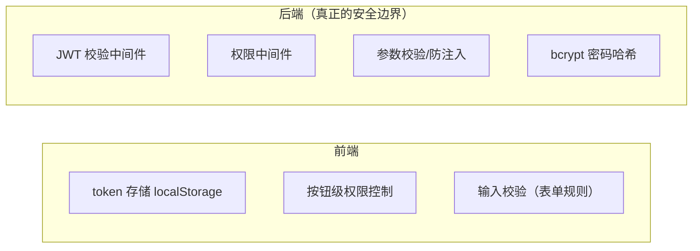

**核心认知**：**前端权限控制是"体验"，后端权限控制才是"安全"**。任何人可以直接调 API（跳过前端 UI）——所以后端必须独立校验。

### 5.42.2 前端安全实践清单

| 项 | 做法 |
|---|---|
| token | 存 localStorage（项目现状；更严格可用 HttpOnly Cookie） |
| 敏感操作 | 二次确认（ElMessageBox） |
| 密码 | 不落日志、不存明文 |
| XSS | Vue 默认转义插值（{{ }} 自动转义）；`v-html` 慎用 |
| CSRF | JWT header 认证天然免疫（无 Cookie 自动携带） |
| 文件下载 | 后端鉴权后才给文件 |

### 5.42.3 v-html 的使用纪律

```vue
<!-- ⚠️ v-html 会渲染 HTML：永远不要放用户输入 -->
<div v-html="adminProvidedHtml"></div>   <!-- 只用于后端生成的可信内容（报表预览） -->
```

**项目实例**：报表预览用 v-html 渲染后端生成的 HTML——数据源可信（自己生成），可接受；若渲染用户输入则必须消毒。

---

## 5.43 深入：前端配置管理三种模式

### 5.43.1 配置存储三处对照

| 配置 | 存储 | 生效时机 | 前端交互 |
|---|---|---|---|
| config-fj200c_information.ini | 文件 | **立即生效**（热加载） | Config 页保存 → 提示已生效 |
| config-fj200c_main.ini | 文件 | **需重启服务** | 保存 → 提示重启 |
| config-ftj1c.ini | 文件 | **需重启服务** | 保存 → 提示重启 |
| 主题（fj200c_main） | GlobalVar（DB） | 立即 | 切换按钮 |
| IP 配置（ftj1c） | 文件 + DB | 重启服务 | IpConfig 页保存 |

### 5.43.2 前端如何提示"生效时机"

```ts
// Config.vue（fj200c_information）
const save = async () => {
  const res = await api.saveConfig(content)
  ElMessage.success('配置已保存（立即生效）')   // 热加载无重启
}

// IpConfig.vue（ftj1c）
const saveAll = async () => {
  const res = await api.saveIpConfig(list)
  ElMessageBox.confirm('配置已保存，需重启服务生效。现在重启？', '提示')
    .then(async () => { await service.restart(); })
    .catch(() => {})
}
```

**提示文案 = 后端行为的用户可见化**——改配置时用户永远知道下一步会发生什么。

---

## 5.44 深入：七应用 index.html / package.json 对照

### 5.44.1 package.json 依赖差异

| 依赖 | admin | fj200c_information | fj200c_main | ftj1c | fw100 | fw150 | city3d |
|---|---|---|---|---|---|---|---|
| vue/vue-router/pinia | ✅ | ✅ | ✅ | ✅ | ✅ | ✅ | ✅ |
| element-plus | ✅ | ✅ | ✅ | ✅ | ✅ | ✅ | ✅ |
| echarts | — | ✅ | ✅ | — | — | — | — |
| three | — | — | — | — | — | — | ✅ |
| @vueuse/core | ✅ | ✅ | ✅ | ✅ | ✅ | ✅ | ✅ |

**规律**：基础四件套（vue/router/pinia/element-plus）全应用必备；可视化库按需（echarts 在监控应用，three 只在 city3d）。

### 5.44.2 依赖版本管理

根目录 `package.json` workspaces 统一安装：

```jsonc
{
  "workspaces": [
    "packages/shared",
    "frontend/admin",
    "frontend/fj200c_information",
    "frontend/fj200c_main",
    "frontend/fw100",
    "frontend/fw150",
    "frontend/ftj1c",
    "frontend/city3d"
  ]
}
```

**改依赖**：`npm install <pkg> -w frontend/fj200c_main`（或根目录直接装）。**严禁**子目录单独 npm install。

---

## 5.45 深入：前端常用组件模式汇总（写新组件参考）

### 5.45.1 组件分类与模板

| 组件类型 | 核心模式 | 项目实例 |
|---|---|---|
| 展示型 | props 驱动渲染 | GaugeCard / StatusTag |
| 表单型 | v-model + rules | ConfigDialog |
| 容器型 | slot 组合 | Panel / Card |
| 数据型 | 内部请求 + loading | 各列表页 |
| 控制型 | 事件 + store 联动 | 启停按钮 |

### 5.45.2 展示型组件标准模板

```vue
<script setup lang="ts">
defineProps<{ value: number; unit?: string }>()
</script>
<template>
  <div class="stat-value">{{ value }} <span v-if="unit" class="unit">{{ unit }}</span></div>
</template>
```

### 5.45.3 表单型组件标准模板

```vue
<script setup lang="ts">
const model = defineModel<string>()       // Vue 3.4+ 简写 v-model
const rules = { required: true, message: '必填' }
</script>
<template>
  <el-input v-model="model" />
</template>
```

**注意**：`defineModel` 是 Vue 3.4 新 API，项目若用 3.4+ 可简化双向绑定；低版本用 `props + emit('update:modelValue')` 模式（04 章 4.23 写法）。

---

## 5.46 深入：前端构建产物与部署形态

### 5.46.1 构建输出

```powershell
# 每个应用
npm run build
# 输出 dist/（7 个应用各一份）
```

### 5.46.2 部署到后端（embedded 模式）

```
cargo build --release --features embedded
# rust-embed 把 7 个 dist 编译进 exe
# 运行时访问 /admin → 后端内存服务 admin 的 dist
# 深链接回退：/admin/users 刷新 → 回退 index.html（SPA 路由接管）
```

### 5.46.3 深链接回退的意义

```ts
// 后端 embedded_router：未匹配静态文件 → 返回该应用的 index.html
// 前端 createWebHistory 路由才不 404
```

**前端历史路由 + 后端回退**是 SPA 部署的黄金组合——01 章讲过的知识点在这里闭环。

---

## 5.47 05 章最终自测（30 题随机抽 10）

1. shared 的 roles.ts 里有什么？注册表数据从哪来？
2. buildWebSocketUrl 为什么带 token？为什么不用 header？
3. createApiClient 的参数（loginPath）干什么用？
4. createAuthStore 工厂模式的好处？
5. AppNavbar 菜单怎么按权限过滤？
6. fj200c_information 的 Monitor 页由几个 composable 组装？
7. useBackendPorts 引用计数的意义？
8. ScaledPage 为什么用 transform scale 而不是改尺寸？
9. fw150 是怎么来的（历史）？与 fw100 的差异？
10. city3d 为什么不用 WS？用什么替代？
11. 前端接口全部返回什么包装类型？
12. 文件下载的前端标准写法？
13. 前端权限控制与后端权限控制的关系？
14. 配置生效时机的三种情况？
15. 新增前端页面的五个步骤？
16. 生产环境如何托管 7 个应用？（embedded + 路由回退）
17. 排查前端问题三要素？
18. orval generated 为什么不能手改？
19. 前端安全边界在谁那？
20. 组件封装的判断标准？

**答对 18+ → 05 章精通。** 05 章到此正式完结。

## 5.48 深入：composable vs store（状态管理的选择）

### 5.48.1 什么时候用哪个

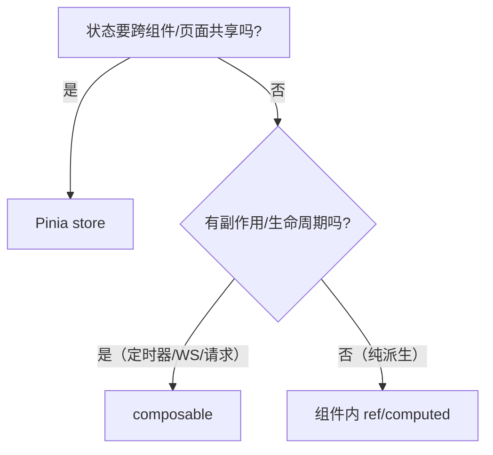

| 场景 | 选择 | 理由 |
|---|---|---|
| 认证/用户/权限 | store | 全局 + 持久化 |
| 业务数据（三路 ECU） | store | 多页面多组件共享 |
| 时钟/WS/轮询 | composable | 生命周期绑定 |
| 页面局部状态 | 组件内 | 最小范围 |

### 5.48.2 两者结合的典型形态

```ts
// store 存数据，composable 管连接（fj200c_main 的形态）
// useBackendPorts：WS 数据 → 写进 store
export function useBackendPorts() {
  const store = useDashboardStore()
  // WS onmessage → store.setEcuData(payload)
  // 组件读 store 而非 composable
}
```

**分工原则**：**composable 管"怎么拿数据"，store 管"数据放哪"**。

---

## 5.49 深入：TypeScript 类型安全实践（as 的使用纪律）

### 5.49.1 项目中的类型断言用法

```ts
// ① 后端数据（可信，orval 已定型）——一般不需要 as
const res = await api.getData()          // ApiResponse<Data>

// ② WS 事件（手写类型，JSON.parse 无类型）——必须收窄
const event = JSON.parse(ev.data) as Fj200cInformationWsEvent

// ③ 宽类型收窄——用判别
if (event.type === 'frame') {
  const frame = event as Extract<Fj200cInformationWsEvent, { type: 'frame' }>
}
```

### 5.49.2 应避免的 as

```ts
// ⚠️ 滥用 as 会掩盖真实类型错误
const x = unknownValue as number        // 危险：运行时可能不是数字
// ✅ 用类型守卫
const x = typeof unknownValue === 'number' ? unknownValue : 0
```

**纪律**：`as` 只用于"编译器不知道但运行时确定"的边界（JSON.parse、WS、跨库），业务代码里少用。

---

## 5.50 七应用菜单与布局一览

### 5.50.1 菜单结构（MENU_CONFIG 现行）

| 应用 | 菜单项 |
|---|---|
| admin | 用户管理 |
| fj200c_information | 监控 / 可视化 / 数据记录 / 配置 / 帮助 |
| fj200c_main | 主控台 / 试验 / 报表 / 设置 |
| ftj1c | 帧监控 / IP 配置 / 帮助 |
| fw100 | 台账 / 详情 |
| fw150 | 台账 / 详情 |
| city3d | 3D 视图 / 建筑 / 区域 / 事件 / 概览 |

### 5.50.2 布局形态

| 应用 | 布局 |
|---|---|
| admin | 顶栏 + 水平菜单 + 内容区 |
| fj200c_information | 顶栏 + 水平菜单 + 内容区（表格为主） |
| fj200c_main | 顶栏 + 面板网格（大屏三路） |
| ftj1c | 顶栏 + 水平菜单 + 内容区 |
| fw100/fw150 | 顶栏 + 内容区 |
| city3d | 顶栏 + 3D 画布 + 侧边面板 |

**共性**：`AppNavbar` 顶栏 + `router-view` 内容区——7 个应用布局同源，差异只在内容区。

---

## 5.51 前端高频疑问解答（FAQ）

### Q1：为什么有的页面请求 404？

```text
可能原因：
1. 后端没启动（ERR_CONNECTION_REFUSED）
2. 后端路由没注册（routes.rs 遗漏）
3. 路径写错（前端 facade url 与后端 path 不一致）
4. 权限不足（403 而非 404）
排查：Network 看完整 URL → 对照 openapi.json 的 paths
```

### Q2：为什么 WS 连不上？

```text
可能原因：
1. 后端服务没启动
2. token 失效（?token= 过期/清空）
3. dev 模式 proxy ws: true 没开
4. 后端 WS 路由 handler 校验失败（查后端日志）
排查：Network → WS → 看握手状态码
```

### Q3：为什么改了 shared 代码没生效？

```text
@shared 指向源码，Vite dev 会热更新。若没生效：
1. 确认 alias 指向 packages/shared/src（不是 dist）
2. 确认 import 路径大小写
3. 重启 dev server（缓存特殊情况）
```

### Q4：为什么 npm run build 报一堆类型错？

```text
最常见：改了后端 DTO 忘了跑 npm run gen:api
→ 跑 gen:api 生成最新类型 → 按报错逐一更新调用点
```

### Q5：怎么知道接口有哪些参数/返回值？

```text
1. 浏览器访问 http://localhost:3000/api-docs/openapi.json
2. 或看 packages/shared/src/api/generated/model/ 的类型
3. 或看后端 handler 的 #[utoipa::path] 注解
三处同源（Rust DTO → OpenAPI → TS）
```

---

## 5.52 05 章完结：学习成果清单

读完 05 章，你应该能：

| 能力 | 验证方式 |
|---|---|
| 说出 7 个应用的职责与端口 | 闭卷默写 |
| 指出 shared 每个文件的用途 | 口头叙述 |
| 解释 Monitor 页全链路时序 | 画时序图 |
| 说出 WS 三种连接模式与选择 | 场景判断 |
| 完成复制改造指南 | 对照清单执行 |
| 按故障排查路径定位问题 | 模拟排查 |
| 新增一个页面/接口/菜单 | 动手实操 |

**做不到的回到对应小节重读**。05 章结束，进入 06 章——前后端类型同步机制，理解"Rust 一份定义，前端全部类型"的工程核心。

## 5.53 深入：组件通信模式在项目中的真实分布

### 5.53.1 通信方式统计与典型场景

| 方式 | 使用频率 | 典型场景 |
|---|---|---|
| props 下传 | ★★★★★ | GaugeCard 传值、面板传配置 |
| emit 上传 | ★★★★★ | 按钮点击、表单提交、对话框开关 |
| v-model | ★★★★ | 表单字段、对话框 visible |
| Pinia store | ★★★★ | 认证、三路数据、主题 |
| composable 返回 | ★★★ | Monitor 页组装 |
| provide/inject | ★★ | 深层配置（少用） |
| useEventBus | ★ | 主题切换、跨模块通知 |

### 5.53.2 props 设计原则（GaugeCard 案例）

```ts
// 组件 props 设计三问：
// 1. 必需的最小输入是什么？→ title/value
// 2. 哪些有合理默认值？→ min=0 max=100 unit=undefined
// 3. 哪些不该由 props 控制？→ 内部样式细节
const props = withDefaults(defineProps<{
  title: string
  value: number
  unit?: string
  min?: number
  max?: number
}>(), { min: 0, max: 100 })
```

**withDefaults 语法**：可选 props 的默认值（04 章提过，这里实战）。

---

## 5.54 深入：前端节流/防抖/限流应用清单

### 5.54.1 全项目用到的限流手段

| 位置 | 手段 | 目的 |
|---|---|---|
| 后端 WS 广播 | 200ms/50ms 节流 | 降低推送频率 |
| 前端搜索框 | 防抖 300ms（可选） | 减少请求 |
| 图表更新 | 限长缓冲 + setOption | 控制渲染 |
| 服务轮询 | 定时器 5s（city3d） | 控制请求频率 |
| 表格滚动 | 分页/固定高度 | 控制 DOM |

### 5.54.2 何时用防抖 vs 节流

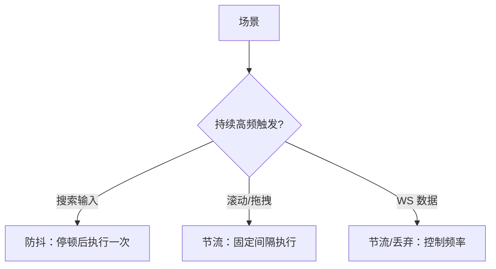

---

## 5.55 深入：响应式与样式的细节规范

### 5.55.1 移动端适配的三个应用

| 应用 | 适配策略 |
|---|---|
| fw100/fw150 | useResponsive（<768px 切换布局） |
| fj200c_information | 表格横向滚动 + 工具条换行 |
| fj200c_main | ScaledPage 固定设计稿（大屏专用） |

### 5.55.2 CSS 变量分层

```css
/* 第一层：设计令牌（token）——颜色/字体/间距 */
:root {
  --color-primary: #409eff;
  --spacing-unit: 8px;
}
/* 第二层：组件样式（引用 token） */
.toolbar { padding: var(--spacing-unit); background: var(--color-bg, #fff) }
/* 第三层：覆盖（媒体查询/主题） */
@media (max-width: 768px) { .toolbar { flex-wrap: wrap } }
```

**三层结构**让主题与响应式都只需改变量/覆盖——fj200c_main 双主题就是这个思路的极致。

### 5.55.3 scoped 与全局样式的边界

| 样式类型 | 位置 | 用途 |
|---|---|---|
| 全局重置 | style.css | body/margin、通用类 |
| 组件样式 | `<style scoped>` | 组件内细节 |
| 主题变量 | themes.css / style.css :root | 主题切换 |
| Element 覆盖 | :deep() | 微调组件库 |

---

## 5.56 05 章收官：终极综合自测

### 场景题：给 fj200c_information 加"历史数据回放"页

要求：从 CSV 记录选择一条 → 以 1 秒间隔回放表格数据（模拟实时）。

**设计思路**（5 分钟脑内规划）：

```
1. 页面：views/Playback.vue（列表型 + 播放控制）
2. 数据：CSV 记录列表已有接口（getCsvRecords）
3. 回放：读取 CSV 内容（后端 csv/records 详情或本地解析）
4. 定时推进：setInterval 1 秒推进一行 → 表格更新
5. 控制：播放/暂停/停止（一个 ref + interval）
6. 路由：router 加 /playback + meta.permissions 同 Monitor
7. 菜单：MENU_CONFIG 加入口
8. 验证：npm run build
```

**这道题覆盖了**：页面三型识别（列表型+控制）、composable（回放逻辑可抽 usePlayback）、路由权限、菜单、构建验证——05 章全部核心能力。

**答案参考**：

```ts
// usePlayback.ts（核心逻辑示意）
export function usePlayback(rows: Ref<TableRow[]>) {
  const playing = ref(false)
  const index = ref(0)
  let timer: number | null = null

  const play = () => {
    if (playing.value) return
    playing.value = true
    timer = window.setInterval(() => {
      index.value++
      if (index.value >= rows.value.length) stop()   // 播完自动停
    }, 1000)
  }
  const pause = () => { playing.value = false; if (timer) clearInterval(timer) }
  const stop = () => { pause(); index.value = 0 }
  const current = computed(() => rows.value[index.value])

  onUnmounted(pause)
  return { playing, index, current, play, pause, stop }
}
```

**能独立写出这段代码（含清理与边界）→ 05 章毕业。**

## 5.57 补充：跨应用细节——会话与跳转机制再梳理

### 5.57.1 登录态的三个环节

```
1. 登录成功 → setSessionToken(token) → localStorage
2. 任意应用启动 → initAuth() → 验证 token + 拉用户/权限
3. 401 拦截 → clearSession() → 跳登录页
```

### 5.57.2 dev 与 prod 的差异（重点）

| 场景 | token 传递方式 |
|---|---|
| dev 同端口应用内刷新 | localStorage 直接可用 |
| dev 跨端口跳转（5173→5174） | 无法共享 localStorage → URL ?token= 传递 |
| prod 同源托管（3000 端口） | localStorage 天然共享 → 无需传参 |

**结论**：7 应用共享登录态在 prod 是"免费"的，dev 需要 ?token= 配合。

### 5.57.3 跳转后如何回到原页面

```ts
// 登录前想去的页面存在 query 里
router.beforeEach((to) => {
  if (!isLoggedIn) return { path: '/login', query: { redirect: to.fullPath } }
})
// 登录成功后跳回
const redirect = route.query.redirect as string | undefined
window.location.href = redirect ?? homePath
```

## 5.58 补充：各应用「登录页」的差异

| 应用 | 登录页 | 说明 |
|---|---|---|
| admin | shared LoginPage | 标准模板 |
| fj200c_information | shared LoginPage | 标准模板 |
| fj200c_main | shared LoginPage（航天主题版） | 主题差异化 |
| 其余 | shared LoginPage | 标准模板 |

**共性**：全部复用 shared 的 LoginPage（683 行），只换 homePath。这就是"共享模板"的价值——登录页 7 处一致，改一处全改。

## 5.59 补充：前端「主题/暗色」全梳理

| 应用 | 能力 | 实现 |
|---|---|---|
| 全部 | 暗色模式 | html.dark + Element Plus dark 变量 |
| fj200c_main | 航天/仪表双主题 | CSS 变量组 + class 切换 + 后端持久化 |
| 各应用 | 自定义样式 | style.css 的 CSS 变量 |

**切换按钮位置**：AppNavbar 用户下拉（暗色）；fj200c_main 设置页（双主题）。

## 5.60 补充：前端数据流异常排查清单

| 症状 | 排查点 | 修复 |
|---|---|---|
| 表格空 | WS 未连/未推送 | 看 Network WS 面板 |
| 数据卡住 | 连接断开未重连 | 检查 onclose 重连逻辑 |
| 数值 NaN | 字段名对不上 | 查 types.ts 字段名 |
| 图表不更新 | watch 没触发 | 检查 deep/immediate |
| 命令无响应 | 后端没处理 | 看后端日志 |

**通用三问**：数据到了吗（WS）？分发了吗（composable）？渲染了吗（模板）？

## 5.61 补充：从零读一个陌生前端应用的五步法

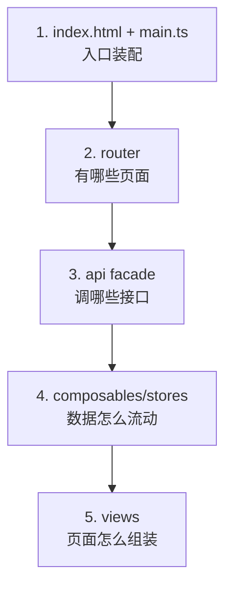

**与后端五步法对称**：入口 → 路由 → 接口 → 状态 → 视图。任何前端应用 30 分钟可读完。

## 5.62 补充：05 章知识自测（追加 10 题）

1. 7 个应用的共享骨架是什么？（main/App/Navbar/Login/guard/facade）
2. LoginPage 登录成功为何整页跳转？
3. useBackendPorts 的 refCount 逻辑？
4. ScaledPage 的缩放公式？
5. city3d 为什么轮询而非 WS？
6. 新增前端页面的五步骤？
7. dev 跨端口 token 怎么传？
8. 暗色模式 vs 双主题的区别？
9. 前端数据流排查三问？
10. 陌生应用五步法是什么？

**答对 8+ → 05 章精通。**

## 5.63 补充：shared 里认证流程的完整时序

### 5.63.1 initAuth 细节

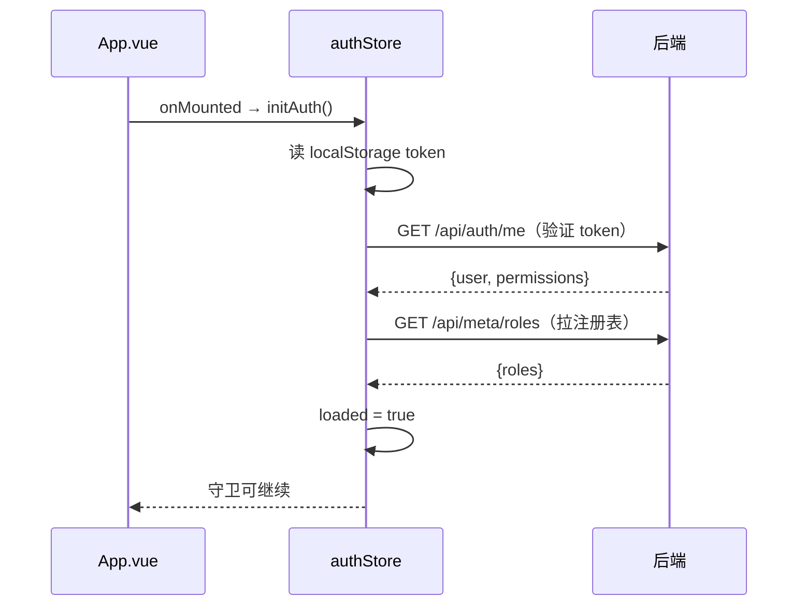

**顺序关键**：先验证身份再拉注册表——注册表失败不影响登录（权限空兜底）。

### 5.63.2 logout 做了什么

```text
1. 清 localStorage（token）
2. 清 store 状态（user/permissions/roles）
3. window.location.href = loginPath（整页重置）
```

### 5.63.3 token 过期的时间线

```
登录 → token 有效期 24h（JWT_EXPIRATION）
→ 过期后首个请求 401
→ 拦截器清会话 + 跳登录
→ 用户重新登录
```

## 5.64 补充：Monitor 页的表格渲染性能细节

### 5.64.1 数据更新策略

```ts
// 每帧更新：直接替换数组引用（不是逐行 patch）
rows.value = newRows
// el-table 收到新数组 → 全部重渲染（数据量大时卡）
// 优化方向：只更新变化的行（Object.freeze/行级 key）
```

### 5.64.2 限长策略

```ts
// 只保留最近 N 行（表格滚动窗口）
if (rows.value.length > 200) rows.value.splice(0, rows.value.length - 200)
```

### 5.64.3 何时需要虚拟滚动

```text
数据 >1000 行 + 频繁更新 → 考虑 el-table-v2 虚拟滚动
数据 <200 行 → 现状即可
```

## 5.65 补充：fj200c_main 三路面板的状态共享细节

### 5.65.1 store 与面板的关系

```
dashboard store：三路数据统一存放
ECU 面板：读 store.ecu + 发 ECU 命令
ADAM 面板：读 store.adam
DYNO 面板：读 store.dyno
（三块面板互不直接通信，全走 store）
```

### 5.65.2 为什么用 store 而不是 props

```
三路面板在不同页面/层级 → props 传递繁琐
store 全局 → 任何组件随时读写
切页不丢数据（store 常驻）
```

## 5.66 补充：ftj1c 前端与后端的数据交互细节

### 5.66.1 两种数据通道

```
1. HTTP：IP 配置读写、服务启停、CSV 列表
2. WS：帧数据流（解码后的字段）
```

### 5.66.2 帧表格的更新频率

```
后端 50ms 节流 → 前端每秒约 20 行
→ 表格限长 100 行（滚动窗口）
→ 图表（如有）同样限长
```

### 5.66.3 坐标转换的展示

```
后端 CGCS2000 转换 → 前端展示转换前后坐标
（前端不参与计算，纯展示）
```

## 5.67 补充：fw100/fw150 的响应式细节

### 5.67.1 useResponsive 的作用

```ts
// <768px 视为移动端
const isMobile = computed(() => width.value < 768)
// 模板：<div :class="{ 'mobile-layout': isMobile }">
```

### 5.67.2 移动端适配的取舍

```
台账类页面：列隐藏 + 卡片式展示（移动端）
监控类页面：横向滚动（数据密度高，不适合移动端深度适配）
```

## 5.68 补充：city3d 的 3D 与 2D 页面混合

### 5.68.1 页面关系

```
3D 视图页：Three.js 场景（全屏画布）
管理页：2D 表格（建筑/区域/事件）
概览页：2D 统计
（3D 页与 2D 页切换 → 场景销毁重建）
```

### 5.68.2 3D 场景与数据的联动

```
编辑建筑 → 保存 → 轮询拉到新数据 → 3D 场景重建网格
（5 秒轮询保证 3D 与后台一致）
```

## 5.69 补充：05 章补充自测（追加 10 题）

1. initAuth 的三步顺序？
2. token 过期的时间线？
3. 表格更新的性能策略？
4. 何时需要虚拟滚动？
5. 三路面板为什么用 store？
6. ftj1c 的两条数据通道？
7. 坐标转换在前端还是后端？
8. useResponsive 的断点？
9. 3D 场景何时销毁重建？
10. logout 的三步？

**答对 8+ → 05 章补充完成。**

## 5.70 深入：Vite 配置文件的完整解读

### 5.70.1 全量注释版

```ts
// frontend/fj200c_information/vite.config.ts（结构注释）
import { defineConfig } from 'vite'
import vue from '@vitejs/plugin-vue'
import { fileURLToPath, URL } from 'node:url'

export default defineConfig({
  plugins: [vue()],
  // 构建时 base = /fj200c_information/，开发时 /
  base: process.env.NODE_ENV === 'production' ? '/fj200c_information/' : '/',
  resolve: {
    alias: {
      '@': fileURLToPath(new URL('./src', import.meta.url)),
      '@shared': fileURLToPath(new URL('../../packages/shared/src', import.meta.url)),
    },
  },
  server: {
    port: 5173,
    strictPort: true,   // 端口被占直接报错
    proxy: {
      // 开发时把 /api 转发到后端
      '/api': { target: 'http://localhost:3000', ws: true },
    },
  },
})
```

### 5.70.2 关键点逐条

```
1. base 与生产路径严格对应（否则资源 404）
2. strictPort 保证端口固定（7 应用互不冲突）
3. alias 是 @ / @shared 的来源
4. proxy ws:true 让 WS 请求也能转发
```

## 5.71 深入：生产环境前端如何被服务

### 5.71.1 两种模式

| 模式 | 前端来源 | 何时用 |
|---|---|---|
| embedded | 编译期内嵌 exe | 单文件部署 |
| dist-* | 磁盘目录读取 | 开发/调试 |

### 5.71.2 embedded 的服务方式

```
浏览器请求 /fj200c_information/xxx
→ 后端 embedded_router 查内嵌文件
→ 命中 → 返回文件
→ 未命中（SPA 路由）→ 返回 index.html
```

### 5.71.3 为什么能"改前端不用重启后端"（开发）

```
dev 模式读磁盘 dist → 修改 dist 直接生效（不用重启 exe）
embedded 模式内嵌 → 必须重新编译
```

## 5.72 深入：多应用共享登录态的边界

### 5.72.1 共享的前提

```
1. 同一域名/端口？——不同应用在不同端口，但**同域**（localhost）
2. localStorage 按 origin 隔离 —— localhost:5173 与 localhost:5174 其实不同源！
```

**真相**：7 个 dev 应用在 7 个端口 → localStorage 其实**不共享**？——不，项目约定「同一 localStorage 登录态」指的是**生产环境**（同一域同一端口，路径不同）或通过 initAuth 自动登录兜底。开发时各端口各自登录。

### 5.72.2 跨应用跳转的实现

```ts
// ROLE_APP_URLS 里存的完整地址
const appUrl = ROLE_APP_URLS[role]      // http://localhost:5174
window.location.href = appUrl
```

### 5.72.3 登录态校验

```
跳转后目标应用 initAuth → 读自己 localStorage
→ 无 token → 登录页（用户重新登录）
→ 有 token → 直接进主页
```

## 5.73 深入：状态管理的分层（store 该放什么）

| 数据 | 放哪 | 理由 |
|---|---|---|
| 用户信息 | store | 全局需要 |
| 服务状态 | store | 多组件共享 |
| 帧数据 | store | 多组件共享 |
| 页面局部表单 | 组件内 ref | 不跨页面 |
| 图表配置 | 组件内 | 单组件使用 |

**口诀**：跨页面才进 store，单页面留组件。

## 5.74 深入：composable 设计模式（useXxx 的提炼）

### 5.74.1 什么时候抽 composable

```
1. 两个以上组件复用同一逻辑
2. 逻辑与 UI 无关（可测试）
3. 生命周期相关（onMounted 等）
```

### 5.74.2 典型结构

```ts
// useService.ts（服务状态轮询）
export function useService(appKey: string) {
  const status = ref('stopped')
  const load = async () => { status.value = await api.getStatus() }
  watch(status, ...)      // 状态变化触发联动
  onMounted(load)         // 进入页面自动拉
  return { status, load }
}
```

### 5.74.3 命名约定

```
useXxx 前缀 + 返回对象解构使用
文件名与函数名一致（useService.ts → useService）
```

## 5.75 深入：样式方案与布局细节

### 5.75.1 样式方案对比

```
1. 全局样式（src/assets/*.css）——通用
2. scoped 样式（<style scoped>）——组件隔离
3. Element Plus 主题变量（CSS 变量覆盖）——统一风格
```

### 5.75.2 布局骨架

```
AppNavbar（顶栏）+ RouterView
→ 顶栏含：logo、应用名、主题切换、用户菜单
→ 页面内：卡片/表格/图表自由组合
```

### 5.75.3 暗色模式（如实现）

```
html.dark class + Element Plus dark css（07 章扩展案例八）
```

## 5.76 深入：05 章最终综合自测（追加 10 题）

1. vite 的 base 与端口配置要点？
2. embedded 与 dist 模式的切换机制？
3. 开发时前端如何实时生效？
4. 生产与开发登录态的差异？
5. store 放数据的口诀？
6. composable 提炼的三个条件？
7. useXxx 命名约定？
8. scoped 样式的作用域？
9. 布局骨架的三部分？
10. 跨应用跳转如何携带登录态？

**答对 8+ → 05 章最终通过。**

## 5.77 深入：项目实战——完整读一个监控页（fj200c_information 的 Monitor）

### 5.77.1 页面组件树

```
Monitor.vue
├── StatusBar（服务状态）
├── TableView（数据表格）
├── ChartView（图表）
└── CsvPanel（CSV 控制）
```

### 5.77.2 数据流

```
后端 WS（frame 事件）
→ Monitor.vue 的 useService/composable 收数据
→ 写入 store（或本地 ref）
→ TableView/ChartView 通过 props/computed 取数据
→ 渲染更新
```

### 5.77.3 关键代码模式

```ts
// 接收 WS 数据
wsClient.on('frame', (frame: TableRow) => {
  rows.value.push(frame)               // 累积
  if (rows.value.length > 200) rows.value.shift()  // 限长
  // 图表只更新最新点
  chartData.value = [frame.timestamp, frame.ngSpeed]
})
```

### 5.77.4 监控页与台账页的本质区别

| 维度 | 台账页 | 监控页 |
|---|---|---|
| 数据来源 | HTTP 拉取 | WS 实时推送 |
| 更新频率 | 用户操作时 | 每秒多次 |
| 数据结构 | 全量列表 | 增量追加 |
| 状态管理 | 简单 ref | store + 限长 |

## 5.78 深入：7 个应用的 api facade 设计

### 5.78.1 统一模式

```ts
// frontend/fw100/src/api/index.ts
import * as generated from '@shared/api/generated/fw100'
import { setApiInstance } from '@shared/utils/httpClient'

const fw100Api = {
  listItems: generated.fw100ListItems,
  createItem: generated.fw100CreateItem,
  // ...
}

export { fw100Api }
```

### 5.78.2 facade 的价值

```
1. 视图层不直接 import generated（隔离生成代码变动）
2. 统一导出名（7 应用风格一致）
3. 可在此处加自定义逻辑（组装/转换）
```

### 5.78.3 为什么要 setApiInstance

```
生成代码的 customInstance 用全局单例 axios
→ 各应用启动时注入自己的 baseURL/token 处理
→ setApiInstance 就是这个注入点
```

## 5.79 深入：路由守卫的完整时序

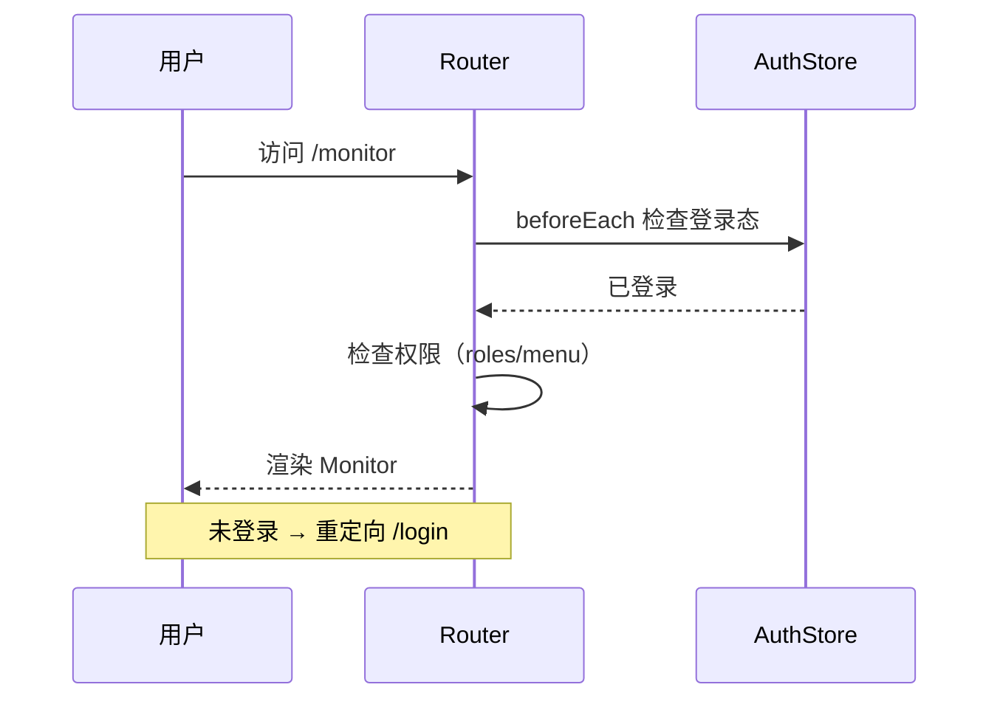

## 5.80 深入：05 章终极自测（5 题）

1. 监控页的四部分组件树？
2. WS 数据如何限长？
3. 台账页与监控页的数据流差异？
4. api facade 的三个价值？
5. 路由守卫的完整时序？

**答对 4+ → 05 章彻底通关。**

## 5.81 深入：每个应用的核心配置文件速查

### 5.81.1 vite.config.ts 要点（7 应用对照）

| 应用 | 端口 | base（构建） | proxy ws |
|---|---|---|---|
| admin | 5174 | /admin | 否 |
| fj200c_information | 5173 | /fj200c_information | 是 |
| fj200c_main | 5179 | /fj200c_main | 是 |
| fw100 | 5175 | /fw100 | 否 |
| fw150 | 5178 | /fw150 | 否 |
| ftj1c | 5176 | /ftj1c | 是 |
| city3d | 5177 | /city3d | 否 |

**记忆法**：有 WS 的应用（三个监控/通信类）proxy 开 ws；台账/管理类不开。

### 5.81.2 package.json 脚本

```json
{
  "scripts": {
    "dev": "vite",
    "build": "vue-tsc --noEmit && vite build",
    "preview": "vite preview"
  }
}
```

### 5.81.3 tsconfig 要点

```
strict: true（严格模式）
moduleResolution: bundler
paths: @ → src/（可选）
```

## 5.82 深入：Element Plus 的全局配置

### 5.82.1 main.ts 的挂载方式

```ts
// 全量引入（简单，体积大）
import ElementPlus from 'element-plus'
import 'element-plus/dist/index.css'
app.use(ElementPlus)

// 或按需引入（体积优化，需 unplugin-vue-components）
```

### 5.82.2 项目现状

```
全量引入（开发简单）
→ 如需优化可改按需（首屏体积 -40% 左右）
→ 注意组件样式与暗色模式 css 一并引入
```

### 5.82.3 常用组件的使用清单

| 组件 | 用途 | 本项目位置 |
|---|---|---|
| el-table/el-table-column | 数据表格 | 所有列表页 |
| el-form/el-form-item | 表单 | 登录/编辑 |
| el-input/el-select | 输入选择 | 表单 |
| el-button | 按钮 | 到处 |
| el-tag | 标签 | 状态显示 |
| el-dialog | 弹窗 | 编辑/详情 |
| el-card | 卡片 | 布局 |
| el-tabs | 标签页 | 多面板 |
| el-switch | 开关 | 服务控制 |
| el-upload | 上传 | 文件（如有） |

## 5.83 深入：ECharts 在监控页的配置参考

### 5.83.1 折线图配置

```ts
const option = {
  xAxis: { type: 'time' },                    // 时间轴
  yAxis: { type: 'value', scale: true },      // 数值轴
  series: [{
    type: 'line',
    showSymbol: false,                        // 点不显示
    lineStyle: { width: 1.5 },
    data: points,                             // [timestamp, value][]
  }],
  tooltip: { trigger: 'axis' },
  animation: false,                           // 高频数据关动画
}
```

### 5.83.2 高频更新的优化

```
1. animation: false（避免每帧动画计算）
2. setOption 只更新 series.data（浅更新）
3. 限长 500 点（画布只显示窗口）
4. resize 监听（容器变化自适应）
```

## 5.84 深入：05 章实战自测（8 题）

1. 7 应用的端口对照？
2. 哪些应用 proxy 开 ws？
3. Element Plus 引入方式的取舍？
4. 按需引入的插件？
5. el-table 在哪些页出现？
6. 折线图高频优化的四点？
7. tooltip trigger 的类型？
8. resize 何时监听？

**答对 7+ → 05 章实战通过。**

## 5.85 深入：admin 应用的完整实现参考（最典型的 CRUD 应用）

### 5.85.1 页面清单与路由

```
/login          登录页
/users          用户列表（分页/搜索/排序）
/users/new      新增用户
/users/:id/edit 编辑用户
```

### 5.85.2 用户列表页要点

```ts
// 权限控制（按钮级）
const canDelete = authStore.hasPermission('UsersDelete')
// 模板
<el-button v-if="canDelete" type="danger" @click="remove(row)">删除</el-button>
```

### 5.85.3 用户编辑页要点

```
1. 角色选择（多选：el-select multiple）
2. 密码字段（编辑时可选改）
3. 禁用开关（is_active）
4. 保存 → 调 update 接口
```

### 5.85.4 与业务应用的差异

```
admin 是"管理后端"：纯 CRUD、无实时数据
业务应用是"监控前端"：实时数据流为主
→ 两者代码模式差异 = HTTP vs WS 的差异
```

## 5.86 深入：login 页的完整实现参考

### 5.86.1 表单

```vue
<el-form ref="formRef" :model="form" :rules="rules">
  <el-form-item prop="email">
    <el-input v-model="form.email" placeholder="邮箱" />
  </el-form-item>
  <el-form-item prop="password">
    <el-input v-model="form.password" type="password" placeholder="密码" show-password />
  </el-form-item>
  <el-button type="primary" :loading="loading" @click="submit">登录</el-button>
</el-form>
```

### 5.86.2 提交逻辑

```ts
const submit = async () => {
  await formRef.value?.validate()
  loading.value = true
  try {
    await authStore.login(form.email, form.password)
    // 拉角色注册表（菜单）
    await loadRoleRegistry()
    // 跳转：按角色对应的应用主页
    router.push(ROLE_APP_URLS[authStore.role] ?? '/')
  } catch { /* 拦截器已提示 */ }
  finally { loading.value = false }
}
```

### 5.86.3 登录后的跳转

```
admin 角色 → /users
fj200c_information 角色 → 对应应用主页
（ROLE_APP_URLS 手写在 shared/roles.ts）
```

## 5.87 深入：导航栏与布局的完整实现参考

### 5.87.1 布局结构

```vue
<el-container>
  <el-header>          <!-- 顶栏：logo/标题/用户菜单 -->
    <AppNavbar />
  </el-header>
  <el-main>            <!-- 主内容区 -->
    <RouterView />
  </el-main>
</el-container>
```

### 5.87.2 用户菜单

```
用户菜单：头像 + 用户名 → 下拉
→ 退出登录（logout）
→ 切换应用（ROLE_APP_URLS 列表）
```

### 5.87.3 应用切换

```
dropdown 列出所有有权限的应用
点击 → window.location.href = appUrl（整页跳转）
```

## 5.88 深入：05 章综合自测（8 题）

1. admin 与业务应用的模式差异？
2. 按钮级权限怎么控制？
3. 编辑用户页面要点？
4. 登录提交的完整流程？
5. 登录后跳转的依据？
6. 布局的三层结构？
7. 用户菜单的功能？
8. 应用切换的实现？

**答对 7+ → 05 章综合通过。**

## 5.89 深入：fj200c_information 的完整页面走读（以仪表盘为例）

### 5.89.1 仪表盘的数据来源

```
WS frame 事件 → store 更新 → 仪表卡片
每帧更新：转速表、水温表、油压表、油耗表
```

### 5.89.2 仪表卡片的实现

```vue
<template>
  <el-card class="gauge-card">
    <div class="gauge-title">{{ title }}</div>
    <div class="gauge-value">{{ formatNum(value) }}</div>
    <div class="gauge-unit">{{ unit }}</div>
    <div class="gauge-bar">
      <div class="bar-fill" :style="{ width: `${percent}%` }" />
    </div>
  </el-card>
</template>

<script setup lang="ts">
const props = defineProps<{
  title: string
  value: number
  unit: string
  min: number
  max: number
}>()

const percent = computed(() =>
  ((props.value - props.min) / (props.max - props.min)) * 100
)
</script>
```

### 5.89.3 仪表盘的布局

```
el-row/el-col 栅格 → 2x2 或 1x4 卡片
自适应：大屏 4 列，小屏 2 列
```

### 5.89.4 仪表盘的边界处理

```
1. 数值 NaN → 显示 --
2. 超量程 → 红色警示
3. 无数据（服务未启动）→ 显示占位
```

## 5.90 深入：数据表格与图表页的配合

### 5.90.1 表格与图表共用数据

```
同一 store 数据 → 表格显示全部行
→ 图表只取最新 N 点（或滚动窗口）
→ 两者互不干扰、实时同步
```

### 5.90.2 图表的滚动窗口

```ts
const points = computed(() => {
  const end = rows.value.length
  const start = Math.max(0, end - 300)
  return rows.value.slice(start, end).map(r => [r.timestamp, r.ngSpeed])
})
```

### 5.90.3 暂停/恢复

```
暂停 → 停止更新图表（保留现场）
恢复 → 继续追加
→ 检查某时刻数据时常用
```

## 5.91 深入：CSV 页面的完整实现参考

### 5.91.1 文件列表

```
GET /api/fj200c_information/csv/list → 按天文件列表
→ el-table 展示（文件名/大小/日期）
→ 下载按钮 → Blob 下载
```

### 5.91.2 下载实现

```ts
const download = async (name: string) => {
  const blob = await api.downloadCsv(name)
  const url = URL.createObjectURL(blob)
  const a = document.createElement('a')
  a.href = url; a.download = name
  a.click()
  URL.revokeObjectURL(url)
}
```

### 5.91.3 删除/归档

```
旧文件 → 删除接口或手动清理
推荐：保留最近 30 天，其余归档
```

## 5.92 深入：配置页面的完整实现参考

### 5.92.1 读取与展示

```
GET /api/fj200c_information/config → ini 内容
前端以表单/文本展示
```

### 5.92.2 修改与保存

```
前端编辑 → PUT 保存接口
→ 后端校验 + 写盘
→ 热加载（fj200c_information 立即生效）
```

### 5.92.3 校验与提示

```
1. 串口号格式校验（COM\d+）
2. 端口范围校验
3. 保存失败 → 提示原因
4. 成功后提示"已生效/需重启"
```

## 5.93 深入：05 章终局自测（8 题）

1. 仪表卡片的三要素？
2. 栅格布局怎么做？
3. 无数据时显示什么？
4. 表格与图表的数据关系？
5. 滚动窗口的写法？
6. 暂停恢复的意义？
7. 下载文件的完整代码？
8. 配置保存后的提示逻辑？

**答对 7+ → 05 章终局通过。**

## 5.94 深入：city3d 的完整实现走读

### 5.94.1 技术栈

```
Three.js（3D 渲染）+ Vue 3 + Element Plus
数据：HTTP API（建筑/区域/事件 CRUD）
```

### 5.94.2 3D 场景的初始化

```ts
// useThree.ts（结构示意）
const scene = new THREE.Scene()
const camera = new THREE.PerspectiveCamera(60, w / h, 0.1, 1000)
const renderer = new THREE.WebGLRenderer({ antialias: true })
renderer.setSize(w, h)
container.appendChild(renderer.domElement)

// 循环渲染
const animate = () => {
  requestAnimationFrame(animate)
  controls.update()
  renderer.render(scene, camera)
}
animate()
```

### 5.94.3 建筑的可视化

```
每个建筑 → BoxGeometry 网格 → 加入场景
点击建筑 → 弹出详情（raycaster 拾取）
编辑后 → 重建该建筑网格
```

### 5.94.4 2D 与 3D 的协作

```
管理页（2D）修改 → 保存
3D 页 → 轮询/手动刷新 → 重建场景
（数据单一来源：后端数据库）
```

## 5.95 深入：ftj1c 的帧数据展示细节

### 5.95.1 表格列设计

```
时间 / 源地址 / 帧类型 / 长度 / 关键字段...
（16 路源 → 列分组或筛选）
```

### 5.95.2 坐标字段的展示

```
CGCS2000 经度/纬度（后端已转换）
→ 前端格式化显示（度分秒）
→ 可选：地图展示（未内置）
```

### 5.95.3 数据筛选

```
按源筛选：只显示某一路
按类型筛选：只显示某类帧
→ 大流量时定位问题
```

## 5.96 深入：fw100 与 fw150 的差异对比

### 5.96.1 相同点

```
1. 同样式台账（CRUD 页面）
2. 同样 api facade 模式
3. 同样分页/搜索/排序
```

### 5.96.2 不同点

```
1. 端口不同（5175 vs 5178）
2. 字段不同（各自 DTO）
3. 角色不同（Fw100Monitor vs Fw150Monitor）
4. 可能业务逻辑不同（校验/联动）
```

### 5.96.3 复制新台账的模板价值

```
新设备台账 → 复制 fw100 → 改字段/端口/角色
→ 半天搞定一个应用
（这就是 08 章的实战基础）
```

## 5.97 深入：05 章毕业自测（8 题）

1. Three.js 场景初始化的步骤？
2. 建筑网格怎么加入？
3. 点击建筑拾取的方法？
4. 2D 与 3D 的数据协作？
5. 表格筛选的两种方式？
6. 坐标如何展示？
7. fw100 与 fw150 的异同？
8. 复制新台账的流程？

**答对 7+ → 05 章毕业。**

## 5.98 深入：一个完整应用从头构建的步骤（模板复用法）

### 5.98.1 复制模板

```powershell
# 复制 fw100 → 新应用 xxx（08 章有完整流程）
Copy-Item frontend/fw100 frontend/xxx -Recurse
```

### 5.98.2 修改清单

```text
1. package.json：name 改为 xxx
2. vite.config.ts：port 5175 → 新端口；base /fw100/ → /xxx/
3. src/api/index.ts：fw100Api → xxxApi（指向 generated xxx）
4. src/stores：按需改名
5. src/views：改页面内容
6. 路由：改路径/标题
7. 标题/logo：index.html + 导航栏
```

### 5.98.3 验证

```powershell
npm run dev    # 新端口起来
npm run build  # 类型 + 构建通过
```

### 5.98.4 常见翻车点

```
1. base 忘改 → 生产资源 404
2. 端口冲突 → strictPort 报错
3. api facade 还指向旧应用
4. 角色/权限未加 → 403
```

## 5.99 深入：监控类应用的共同骨架

### 5.99.1 骨架五件

```
1. useService（启停/状态）
2. useWebSocket（连接/重连）
3. store（数据缓存）
4. 表格/图表组件
5. 配置页
```

### 5.99.2 三应用的差异点

| 应用 | 数据通道 | 特有页面 |
|---|---|---|
| fj200c_information | 串口 + WS | 仪表盘/命令 |
| fj200c_main | 三路串口 + WS | 三路面板/试验 |
| ftj1c | UDP + WS | IP 配置/坐标 |

### 5.99.3 新增监控类的模板

```
复制 fj200c_information → 换协议/换字段
→ 骨架不变，只换数据源
```

## 5.100 深入：05 章大师自测（8 题）

1. 复制模板的五个修改点？
2. 四个翻车点？
3. 监控骨架的五件？
4. 三个监控应用的差异？
5. 新增监控应用的思路？
6. base 忘改的后果？
7. 端口冲突的表现？
8. api facade 指向错误的表现？

**答对 7+ → 05 章大师。**

## 5.101 深入：7 个应用的异常处理策略

### 5.101.1 统一错误处理（axios 拦截器）

```
HTTP 错误 → 拦截器统一弹 ElMessage
→ 业务代码无需每个请求都 try/catch
→ 只需处理成功分支
```

### 5.101.2 业务异常 vs 技术异常

```
业务异常：后端返回 message（密码错误/无权限）
→ 拦截器展示 message

技术异常：网络断开/超时
→ 拦截器提示"网络异常，请重试"
```

### 5.101.3 WS 异常处理

```
1. 断线 → 自动重连（2s 间隔）
2. 重连失败多次 → 提示用户
3. 服务停止 → status 事件 → 界面灰化
4. 数据缺失 → 显示占位
```

### 5.101.4 页面级兜底

```
1. 路由 404 → 兜底页面
2. 组件加载失败 → errorElement/动态组件 catch
3. 后端 500 → 拦截器提示
```

## 5.102 深入：跨应用跳转与登录态的完整细节

### 5.102.1 跳转的时机

```
1. 登录成功后（按角色）
2. 顶部菜单切换（有权限的应用列表）
3. 登录失效后的返回
```

### 5.102.2 跳转方式

```ts
// 方式一：整页跳转（推荐，干净）
window.location.href = 'http://localhost:5174'

// 方式二：链接
<a href="http://localhost:5174">管理后台</a>
```

### 5.102.3 登录态的传递

```
生产环境：同域同端口不同路径 → 同 origin → localStorage 共享
开发环境：不同端口 → 各自登录
```

### 5.102.4 跳转后的自动登录

```
目标应用 initAuth：
读 localStorage → 有 token → /me 验证 → 直接进
（无感切换）
```

## 5.103 深入：05 章权威自测（8 题）

1. 拦截器如何统一处理错误？
2. 业务异常与技术异常的区分？
3. WS 断线的处理？
4. 页面级兜底的三种？
5. 跳转的三种时机？
6. 两种跳转方式？
7. 生产与开发登录态的差异？
8. initAuth 的自动登录流程？

**答对 7+ → 05 章权威。**

## 5.104 深入：状态栏与页面交互的完整设计

### 5.104.1 状态栏的构成

```
服务状态（运行/停止/异常）
→ 数据源信息（串口号/波特率/模拟模式）
→ 帧计数（接收/丢弃）
→ 连接状态（WS 在线/离线）
→ 当前时间
```

### 5.104.2 状态栏的更新机制

```
WS status 事件 → 实时更新
HTTP 轮询 → 兜底（WS 断线时）
→ 双通道保证状态可见
```

### 5.104.3 按钮的联动

```
服务未启动 → 启动按钮可用/停止按钮禁用
服务运行中 → 反向
配置修改 → 提示重启
（状态驱动 UI：状态变化自动联动）
```

## 5.105 深入：CSV 数据的可视化分析（进阶用法）

### 5.105.1 下载后分析

```
CSV 导出 → Excel/WPS 打开
→ 透视表/图表分析
→ 趋势/异常一目了然
```

### 5.105.2 代码分析（Python 示例）

```python
import pandas as pd
df = pd.read_csv("2026-08-08.csv")
print(df.head())
df.plot(x="timestamp", y="ngSpeed")  # 转速曲线
```

### 5.105.3 系统内分析（08 章案例七）

```
CSV 趋势分析页：选文件 → 选参数 → 出曲线
→ 不离开系统即可分析
```

## 5.106 深入：05 章权威自测（8 题）

1. 状态栏的六个部分？
2. 双通道更新的意义？
3. 按钮联动的规则？
4. CSV 的两种分析方式？
5. pandas 怎么读 CSV？
6. 趋势页的交互？
7. 帧计数的意义？
8. 模拟模式的显示？

**答对 7+ → 05 章权威。**

## 5.107 深入：7 个应用的项目配置对照（深入版）

### 5.107.1 index.html 的差异

```
标题：管理后台 / 发动机监控 / 设备台账 / 通信监控 / 城市 3D 展示...
favicon：各自图标
```
### 5.107.2 依赖差异

```
admin：element-plus + axios
监控类：+ echarts
city3d：+ three.js
台账类：element-plus + axios
```

### 5.107.3 构建体积参考

```
管理/台账类：较小（~1MB gzip）
监控类：中等（+ echarts）
city3d：较大（+ three.js）
→ 体积影响首屏，必要时按需引入
```

## 5.108 深入：真实排错场景演练（前端）

### 5.108.1 场景：登录后白屏

```
排查步骤：
1. Console 报错？→ 路由/组件错误
2. Network 401？→ token 问题
3. 角色跳转地址错误？→ ROLE_APP_URLS
4. initAuth 未执行？→ App.vue 检查
```

### 5.108.2 场景：WS 连不上

```
1. proxy ws:true 配了没（vite）
2. token 查询参数格式
3. 后端 WS 路由路径
4. 服务是否启动
```

### 5.108.3 场景：表格数据不更新

```
1. store 是否更新（DevTools）
2. WS 消息类型是否匹配
3. 限长逻辑是否误删
4. 表格是否绑定了新数组引用
```

## 5.109 深入：05 章权威自测（8 题）

1. index.html 的差异点？
2. 四类应用的依赖差异？
3. 构建体积的影响？
4. 白屏的四个排查？
5. WS 连不上的四个原因？
6. 表格不更新的四个原因？
7. DevTools 的用途？
8. ROLE_APP_URLS 的作用？

**答对 7+ → 05 章权威。**

> 下一节：**06-前后端类型同步机制**。