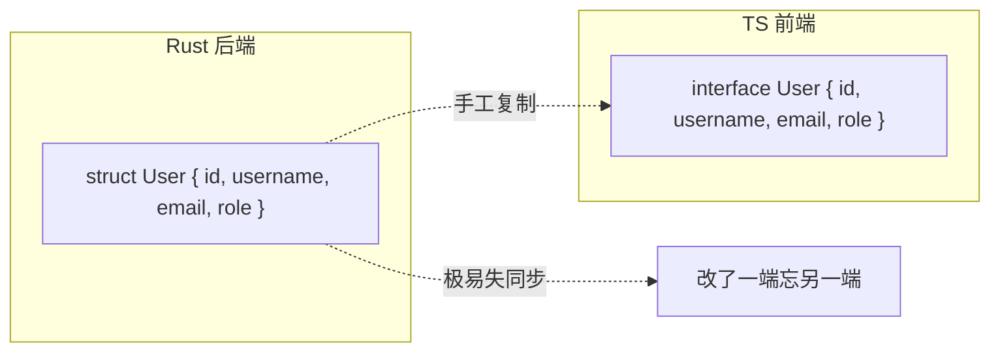
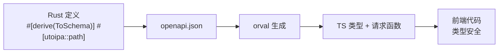
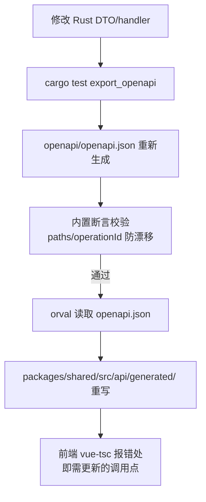
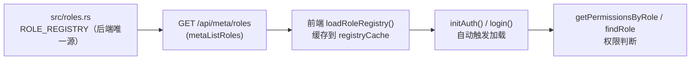

# 06 前后端类型同步机制（utoipa + OpenAPI + orval）

> 这是本项目工程化的**灵魂章节**。理解它，你就理解了为什么"改一个 Rust 结构体，前端类型自动跟着变"。
>
> 本章数据基于项目当前状态（2026-08）：**48 个 path、60 个 HTTP 操作、10 个 tag、115 个 model 类型文件**，覆盖 8 个角色模块。

## 6.1 问题：没有类型同步的世界

### 6.1.1 手写两端的痛苦

在没有这套机制的传统项目里：



**后果**：字段改名/新增/类型变化时，一端改了另一端不知道 → 运行时才发现数据对不上 → 类型错误泛滥。

### 6.1.2 本项目的解法



**原则：Rust 是唯一真相源（single source of truth），前端类型完全由工具生成。**

---

## 6.2 链路总览（一条命令全同步）



**入口命令**（根目录）：

```powershell
npm run gen:api   # = cargo test export_openapi && orval
```

**这条命令做的事**：
1. 运行 `cargo test export_openapi`——一个特殊测试，执行时把当前后端所有 utoipa 注解聚合，**生成/更新 openapi.json**（写入 `openapi/openapi.json`，提交仓库）。
2. 同时断言 openapi.json 的关键路径与 operationId 与预期一致（防止意外漂移）——**断言失败，命令中断，不会进入 orval**。
3. 运行 `orval`——读取 openapi.json，生成 TS 类型 + API 请求函数到 `packages/shared/src/api/generated/`。

### 6.2.1 当前规模盘点

| 指标 | 数值 | 说明 |
|---|---|---|
| path（路径） | **48** | `openapi.json` 的 `paths` 总数（不含 WS） |
| 操作（HTTP 方法） | **60** | get/post/put/delete 合计（断言 `assert_eq!(operations, 60)`） |
| tag（分组） | **10** | orval 按 tag 分文件，见下表 |
| model 类型文件 | **115** | `packages/shared/src/api/generated/model/*.ts`（含 index.ts 汇总） |

**10 个 tag 一览**（即 orval 生成的 `api/<tag>/<tag>.ts` 文件名）：

| tag | 对应后端模块 | 说明 |
|---|---|---|
| `auth` | `src/common/auth/` | 登录、用户信息（所有角色共用） |
| `meta` | `src/roles.rs` | 角色注册表 `GET /api/meta/roles` |
| `admin` | `src/admin/` | 用户管理 + 种子密码查询 + pwd-route 停用开关 |
| `fj200c-information` | `src/fj200c_information/` | 发动机监控 |
| `fj200c-main` | `src/fj200c_main/` | 发动机测控（五路串口） |
| `ftj1c` | `src/ftj1c/` | UDP 通信监控（含 help） |
| `fw100` | `src/fw100/` | 设备台账 |
| `fw150` | `src/fw150/` | 设备台账 |
| `city3d` | `src/city3d/` | 城市 3D 展示 |
| `protocol-generator` | `src/protocol_generator/` | 通信协议生成（第 8 个角色，2026 年新增） |

> 注意 tag 名与 Rust 模块名不同：下划线在 OpenAPI tag 里写成连字符（`fj200c-information`），orval 生成的文件名即 tag 名。

---

## 6.3 utoipa 注解详解（后端侧）

### 6.3.1 结构体注解（DTO）

```rust
// src/common/models.rs
use utoipa::ToSchema;

/// 用户信息
#[derive(ToSchema)]
pub struct UserInfo {
    pub id: i64,
    pub username: String,
    pub email: String,
    #[schema(example = "admin")]
    pub role: String,
}
```

**`#[derive(ToSchema)]`**：把 Rust 结构体注册为 OpenAPI schema。orval 读到后生成同名 TS interface：

```ts
// generated/model/user-info.ts（orval 生成）
export interface UserInfo {
  id: number
  username: string
  email: string
  role: string
}
```

**字段类型映射表**（Rust → TS）：

| Rust | TS |
|---|---|
| i64 / i32 / u32 | number |
| String | string |
| bool | boolean |
| f64 | number |
| Option<T> | T \| undefined 或 T \| null |
| Vec<T> | T[] |
| HashMap<String, T> | Record<string, T> |
| 自定义 struct | interface |
| 自定义 enum（string 型） | enum |

### 6.3.2 handler 注解（API 路径）

```rust
// src/fj200c_information/handlers.rs
use utoipa::{IntoParams, OpenApi};

/// 查询服务状态
#[utoipa::path(
    get,
    path = "/api/fj200c_information/service/status",
    tag = "fj200c-information",
    operation_id = "fj200cInformationServiceStatus",
    responses(
        (status = 200, description = "成功", body = ServiceStatus)
    )
)]
pub async fn service_status(State(state): State<AppState>) -> Result<Json<ApiResponse<ServiceStatus>>, AppError> {
    // ...
}
```

**注解各属性含义**：

| 属性 | 作用 | 示例 |
|---|---|---|
| `get/post/put/delete` | HTTP 方法 | `get` |
| `path` | 完整路径 | `"/api/fj200c_information/service/status"` |
| `tag` | 分组（orval 按 tag 分文件） | `"fj200c-information"` |
| `operation_id` | 唯一操作 ID（orval 函数名来源） | `"fj200cInformationServiceStatus"` |
| `responses` | 响应定义（body 类型） | `body = ServiceStatus` |
| `request_body` | 请求体 | `request_body = SendCommandRequest` |
| `params` | 查询/路径参数 | `params(("id" = i64, Path, ...))` |

**operation_id 的命名约定**：`tag 驼峰化 + 动作`（如 `fw100ListItems`、`protocolGeneratorExportExcel`、`metaListRoles`）——orval 函数名就是它，所以**不能重名**（防漂移测试专门查这个）。

### 6.3.3 带参数的 handler 注解

```rust
/// 更新用户角色
#[utoipa::path(
    put,
    path = "/api/users/{id}/role",
    tag = "admin",
    operation_id = "adminUpdateUserRole",
    params(
        ("id" = i64, Path, description = "用户 ID")
    ),
    request_body = UpdateUserRoleRequest,
    responses(
        (status = 200, description = "成功", body = User)
    )
)]
pub async fn update_user_role(
    Path(id): Path<i64>,
    State(state): State<AppState>,
    Json(payload): Json<UpdateUserRoleRequest>,
) -> Result<Json<ApiResponse<User>>, AppError> {
    // ...
}
```

**路径参数**用 `params(("id" = i64, Path, ...))` 声明——orval 生成时函数签名变为 `(id: number, ...)`。

**查询参数结构体**用 `IntoParams`：

```rust
/// 分页查询参数
#[derive(ToSchema, IntoParams)]
pub struct PaginationParams {
    #[schema(default = 1, minimum = 1)]
    pub page: Option<i64>,
    #[schema(default = 20, minimum = 1, maximum = 100)]
    pub page_size: Option<i64>,
}

// handler 里：params(PaginationParams)
```

**`IntoParams`**：把结构体字段映射为查询参数。`#[schema(...)]` 提供默认值/范围——OpenAPI 里生成描述，Swagger UI 与 orval 都能看到。

### 6.3.4 统一响应包装 ApiResponse<T>

```rust
// src/common/models.rs
#[derive(ToSchema)]
pub struct ApiResponse<T> {
    pub success: bool,
    pub message: String,
    pub data: Option<T>,
}
```

OpenAPI 3.0 没有"泛型类型"概念——utoipa 会为每个具体化类型生成独立 schema（如 `ApiResponseLoginResponse`、`ApiResponseTextContent`、`ApiResponseVecRoleInfo`），orval 生成时识别前缀模式**自动还原为泛型**：

```ts
// generated/model/apiResponseTextContent.ts（orval 还原为泛型）
export interface ApiResponseTextContent<T = unknown> {
  success: boolean
  message: string
  data: T | null
}
```

泛型还原是 orval 的内置能力——**无需手写**。这也是为什么 orval 会生成大量 `apiResponseXxx`、`apiResponseVecXxxDataItem` 这类"具体化"文件名：每个 `ApiResponse<X>` 具体化都对应一个文件。

---

## 6.4 src/api_docs.rs（OpenAPI 聚合中心）

### 6.4.1 文件职责

`src/api_docs.rs` 是后端 OpenAPI 的**唯一聚合点**，三部分内容：

```rust
// src/api_docs.rs
use utoipa::OpenApi;

#[derive(OpenApi)]
#[openapi(
    info(
        title = "RustWeb-Vue API",
        version = "1.0.0",
    ),
    paths(
        // ============ 认证（所有角色共用） ============
        crate::common::auth::handlers::login,
        crate::common::auth::handlers::get_profile,
        // ============ meta（角色注册表等元信息） ============
        crate::roles::list_roles,
        // ============ 管理员（用户管理） ============
        crate::admin::handlers::list_users,
        // ... 其余 40+ 个 handler 路径函数
    ),
    components(
        schemas(
            crate::common::models::User,
            crate::common::models::Permission,
            // ... 全部 ToSchema DTO
        )
    ),
)]
pub struct ApiDoc;
```

1. `paths(...)`：所有 handler 的路径函数列表（**新增接口必须在这里登记**）。
2. `components(schemas(...))`：所有 DTO 结构体（新增 DTO 必须登记；`ApiResponse<T>` 泛型实例由 utoipa 自动收集，无需显式列出）。
3. tags 描述（auth/admin/fj200c-information/... 每个 tag 的说明）。

### 6.4.2 export_openapi 测试（防漂移断言）

```rust
// src/api_docs.rs 末尾
#[cfg(test)]
mod tests {
    #[test]
    fn export_openapi() {
        let spec = export_spec();  // 生成 spec 并写入 openapi/openapi.json
        let doc: serde_json::Value = serde_json::from_str(&spec).unwrap();
        let paths = doc["paths"].as_object().unwrap();

        // 断言关键路径存在（防止删了接口忘记同步）
        for path in [
            "/api/auth/login",
            "/admin/pwd",
            "/api/users/settings/pwd-route",
            "/api/ftj1c/help",
            // ...
        ] {
            assert!(paths.contains_key(path), "缺少路径: {}", path);
        }

        assert_eq!(paths.len(), 48, "路径数量与预期不符");

        // 断言每个操作的 operationId 存在（orval 依赖它生成函数名）
        let mut operations = 0;
        // ... 遍历统计 get/post/put/delete
        assert_eq!(operations, 60, "操作数量与预期不符");
    }
}
```

**为什么是"test"**：`cargo test` 可以无参数跑，且测试失败会中断（`cargo run` 不会）。把"生成 + 断言"放进测试，`npm run gen:api` 里执行 `cargo test export_openapi` 就能：
- 成功 → openapi.json 已更新（与当前代码一致）。
- 失败 → 有接口缺失/断言不匹配，**先修再生成**。

### 6.4.3 断言清单（当前覆盖的关键端点）

export_openapi 测试对以下路径逐一 `assert!(paths.contains_key(...))`：

- 认证/元信息：`/api/auth/login`、`/api/auth/profile`、`/api/meta/roles`
- 管理员：`/admin/pwd`（种子账号初始密码查询，公开）、`/api/users`、`/api/users/{id}/role`、`/api/users/{id}`、`/api/users/settings/pwd-route`（停用开关）
- fj200c_information：`/service/start` `/service/stop` `/service/status` `/service/command` `/config` `/csv/files` `/csv/{name}`（7 个）
- ftj1c：`/service/start` `/service/stop` `/service/status` `/ip-config` `/config` **`/help`**（5 个）
- fw100 / fw150：`/items`（各 1 个）
- city3d：`/buildings` `/buildings/{id}` `/districts` `/districts/{id}` `/events` `/events/{id}` `/overview`（7 个）
- fj200c_main：`/service/*` ×4、`/config`、`/csv/files`、`/csv/{name}`、`/recording/toggle`、`/simulation/toggle`、`/theme/set`、`/experiment`、`/report`、`/help`（13 个）
- protocol_generator：`/default-csv`、`/markdown`、`/excel`、`/csv/parse`、`/csv/serialize`（5 个）

最后两道**总数断言**：`paths.len() == 48`、operations 计数 == 60（get/post/put/delete 才算，WS 不算）——任何 path 或 operation 数量的增减（比如删接口、合并接口）都会让测试失败。

### 6.4.4 运行时文档端点

```text
浏览器访问 http://localhost:3000/api-docs/openapi.json
→ 实时 OpenAPI spec（与构建时生成的 openapi.json 同源，运行时动态生成）
→ 配合 Swagger UI 可交互调试
```

**前端调试 API 的权威参考**：所有接口的路径/参数/响应类型都在这。

---

## 6.5 orval.config.ts 详解（生成侧，37 行）

### 6.5.1 配置文件（当前真实全文）

```ts
// orval.config.ts（根目录，37 行）
import { defineConfig } from "orval";

export default defineConfig({
  rustweb: {
    input: {
      target: "./openapi/openapi.json",            // 输入：后端生成的 spec
    },
    output: {
      workspace: "./packages/shared/src/api/generated", // 所有产物根目录
      target: "./api",                             // 请求函数输出目录（相对 workspace）
      schemas: "./model",                          // 类型输出目录（相对 workspace）
      client: "axios",
      httpClient: "axios",                         // v8 起默认 fetch，显式指定 axios
      mode: "tags-split",                          // 按 tag 分文件
      clean: true,                                 // 生成前清空目录
      prettier: true,                              // 生成后格式化
      override: {
        mutator: {
          path: "../custom-instance.ts",           // 相对 workspace 解析的请求壳
          name: "customInstance",
        },
      },
    },
  },
});
```

### 6.5.2 配置项含义

| 配置 | 作用 |
|---|---|
| `workspace` | 所有生成产物的根目录（`packages/shared/src/api/generated`） |
| `target: "./api"` | 请求函数目录；配合 tags-split 生成 `api/<tag>/<tag>.ts` |
| `schemas: "./model"` | TS 类型目录（`model/*.ts`，当前 115 个文件） |
| `mode: 'tags-split'` | 每个 tag 一个文件（10 个 tag → 10 个文件） |
| `client` + `httpClient: 'axios'` | 基于 axios（orval v8 默认是 fetch，必须显式指定） |
| `clean: true` | 每次全量重写（旧文件自动删除，避免残留） |
| `override.mutator` | 请求函数调用 `customInstance`（我们的 axios 壳） |

### 6.5.3 生成产物结构（当前真实布局）

```
packages/shared/src/api/generated/
├── index.ts                       # 汇总导出（getAdmin() / getAuth() / ... 按 tag 的工厂函数）
├── api/                           # 请求函数（按 tag 分子目录）
│   ├── admin/admin.ts
│   ├── auth/auth.ts
│   ├── city3d/city3d.ts
│   ├── fj200c-information/fj200c-information.ts
│   ├── fj200c-main/fj200c-main.ts
│   ├── ftj1c/ftj1c.ts
│   ├── fw100/fw100.ts
│   ├── fw150/fw150.ts
│   ├── meta/meta.ts
│   └── protocol-generator/protocol-generator.ts
└── model/                         # 类型定义（115 个 .ts，含 index.ts）
    ├── protocolField.ts
    ├── parameterDef.ts
    ├── permission.ts
    ├── roleInfo.ts
    ├── apiResponseTextContent.ts
    └── ...
```

> 注意：tags-split 下请求函数是 `api/<tag>/<tag>.ts`（tag 分子目录），不是 `api/<tag>.ts`。orval 同时生成 `index.ts` 汇总，各 tag 用 `getXxx()` 工厂函数获取（如 `getProtocolGenerator()`）。

### 6.5.4 customInstance（mutator 壳）

```ts
// packages/shared/src/api/custom-instance.ts
export const customInstance = <T>(
  config: AxiosRequestConfig,
  options?: AxiosRequestConfig
): Promise<T> => {
  const instance = getApiInstance();          // setApiInstance 注入的应用实例
  let url = config.url ?? "";
  // OpenAPI 中的 url 是完整路径（/api/xxx），实例 baseURL 已是 /api，剥离前缀
  if (baseURL && url.startsWith(baseURL)) url = url.slice(baseURL.length);
  return instance({ ...config, url, ...options }).then(({ data }) => data);
};
```

要点：
- 每个前端应用启动时 `setApiInstance` 注入自己的 axios 实例（JWT 注入 + 401 跳转路径因应用而异）。
- mutator 返回 `data` 本身——即生成的函数直接 resolve 为 `ApiResponse<T>`，与 facade 的 `res.data` 语义一致。
- 各应用 API 层无需感知生成代码的 URL 处理细节。

---

## 6.6 Permission 枚举与角色注册表的同步机制

### 6.6.1 Permission 枚举：12 个变体（单一真相源在后端）

```rust
// src/common/models.rs
#[derive(Debug, Serialize, Deserialize, Clone, PartialEq, Eq, Hash, utoipa::ToSchema)]
pub enum Permission {
    // ============ 角色专属权限 ============
    Fj200cInformationMonitor,   // 发动机监控
    Fw100Monitor,               // 设备台账
    Ftj1cMonitor,               // UDP 通信监控
    Ftj1cHelp,                  // ftj1c 帮助文档（唯一需要此权限的端点：GET /api/ftj1c/help）
    City3dView,                 // 城市 3D 展示
    Fw150Monitor,               // 设备台账
    Fj200cMainMonitor,          // 发动机测控
    ProtocolGeneratorMonitor,   // 通信协议生成
    // ============ 管理面板权限 ============
    UsersRead,                  // 读取用户
    UsersWrite,                 // 创建/更新用户
    UsersDelete,                // 删除用户
    SystemAdmin,                // 系统管理标志
}
```

orval 从 OpenAPI 生成 `generated/model/permission.ts`，前端 `packages/shared/src/types.ts` re-export：

```ts
// packages/shared/src/types.ts
export type { Permission } from './api/generated/model/permission'
```

> Permission 枚举字符串值由 `serde` 默认生成（变体名原样，如 `"SystemAdmin"`）——前后端都以字符串交换，新增权限只需改后端枚举 + `npm run gen:api`。

### 6.6.2 角色注册表链路：ROLE_REGISTRY → /api/meta/roles → loadRoleRegistry



- **后端**：`src/roles.rs` 的 `ROLE_REGISTRY` 静态注册表定义 8 个角色（admin、fj200c_information、fj200c_main、fw100、fw150、ftj1c、city3d、protocol_generator）的 key/name/permissions，`registry_info()` 转成 `RoleInfo` 列表，经 `GET /api/meta/roles`（公开端点，tag = `meta`，operation_id = `metaListRoles`）暴露。
- **前端**：`packages/shared/src/roles.ts` 的 `loadRoleRegistry()` 首次调用时拉取注册表并缓存（`registryCache`，幂等），key/name/permissions **不再有任何手写副本**。
- **加载时机**：`createAuthStore` 的 `initAuth()`（所有应用路由守卫先 await 它）与 `login()`（登录成功后立即生效）都会调用 `loadRoleRegistry()`。

```ts
// packages/shared/src/roles.ts（核心逻辑）
let registryCache: RoleInfo[] | null = null;

export async function loadRoleRegistry(): Promise<RoleInfo[]> {
  if (registryCache) return registryCache;
  try {
    const response = await getMeta().metaListRoles();
    registryCache = response.data ?? [];
  } catch {
    registryCache = [];      // 失败缓存空数组，不抛出
  }
  return registryCache;
}
```

### 6.6.3 注册表未加载时：权限为空，但**不阻塞登录**

```
失败场景：后端未启动 / 网络异常 → loadRoleRegistry 捕获错误，缓存空数组
结果：getPermissionsByRole 返回 [] → 前端菜单/按钮权限为空
      → 登录流程不受影响（initAuth/login 正常完成）
      → 权限校验始终在后端（permission_middleware），前端权限只是 UI 层
```

**这是刻意的容错设计**：注册表是增强体验（菜单过滤），不是安全边界。

### 6.6.4 仍手写的前端概念

- `MENU_CONFIG`（8 角色菜单树）——纯前端 UI 概念，手写在 `packages/shared/src/roles.ts`。
- `ROLE_APP_URLS`（dev URL + prod 路径）——应用跳转地址，同样手写。
- 导航栏 `brandText` 中文角色名 switch（如 admin→管理员、protocol_generator→协议生成器）——硬编码在 `AppNavbar.vue`。

> 判断口诀：**数据（key/name/permissions）来自注册表接口；布局（菜单/地址/显示名）手写**。

---

## 6.7 实战案例：protocol_generator 类型全链路

以第 8 个角色 protocol_generator 为例，走一遍从 Rust DTO 到前端类型的**完整链路**。

### 6.7.1 后端 DTO（src/protocol_generator/protocol_generator/models.rs）

```rust
/// 协议字段（通信协议表一行）
#[derive(Debug, Clone, Serialize, Deserialize, utoipa::ToSchema)]
pub struct ProtocolField {
    /// 序号（按数据类型大小自动重排）
    pub index: u32,
    /// 字节范围（如 "0-3" / "4~N"）
    #[serde(rename = "byteRange")]
    pub byte_range: String,
    /// 参数名称
    pub name: String,
    /// 单位
    pub unit: String,
    /// 数据类型（C# 内置类型）
    #[serde(rename = "dataType")]
    pub data_type: String,
    /// 长度（仅可变类型 string/byte[] 使用）
    #[serde(rename = "length", default)]
    pub length: Option<u32>,
    /// 备注
    pub remark: String,
}

/// 参数表条目（CSV 参数表一行）
#[derive(Debug, Clone, Serialize, Deserialize, utoipa::ToSchema)]
pub struct ParameterDef { name, alias, unit, data_type, remark }

/// 协议导出请求（Markdown / Excel 共用）
#[derive(Debug, Deserialize, utoipa::ToSchema)]
pub struct ProtocolExportRequest { title: String, data: Vec<ProtocolField> }

/// CSV 文本解析请求（前端上传 CSV 文件内容）
#[derive(Debug, Deserialize, utoipa::ToSchema)]
pub struct CsvParseRequest { content: String }

/// 文本内容响应（Markdown 导出 / CSV 序列化共用）
#[derive(Debug, Serialize, utoipa::ToSchema)]
pub struct TextContent { content: String }
```

注意 `#[serde(rename = "byteRange")]` 等：**OpenAPI 字段名由 serde 决定**，Rust snake_case 字段经 rename 后以前端 camelCase 输出——这与全项目契约约定一致。

### 6.7.2 handler 注解（5 个 path）

```rust
/// 获取默认参数表（首次自动写入种子内容）
#[utoipa::path(
    get,
    path = "/api/protocol_generator/default-csv",
    tag = "protocol-generator",
    operation_id = "protocolGeneratorGetDefaultCsv",
    responses(
        (status = 200, description = "成功", body = ApiResponse<Vec<ParameterDef>>),
    ),
)]
pub async fn get_default_csv(...) -> ... { ... }

// 其余 4 个操作（operation_id 命名规律一致）：
// protocolGeneratorSaveDefaultCsv  PUT  /api/protocol_generator/default-csv
// protocolGeneratorExportMarkdown  POST /api/protocol_generator/markdown
// protocolGeneratorExportExcel     POST /api/protocol_generator/excel
// protocolGeneratorParseCsv        POST /api/protocol_generator/csv/parse
// protocolGeneratorSerializeCsv    POST /api/protocol_generator/csv/serialize
```

### 6.7.3 生成产物（npm run gen:api 后）

```ts
// generated/model/protocolField.ts（orval 自动生成）
export interface ProtocolField {
  index: number
  byteRange: string
  name: string
  unit: string
  dataType: string
  length?: number      // Option<u32> → 可选
  remark: string
}
```

`generated/api/protocol-generator/protocol-generator.ts` 里生成 6 个请求函数（`protocolGeneratorGetDefaultCsv`、`protocolGeneratorSaveDefaultCsv`、`protocolGeneratorExportMarkdown`、`protocolGeneratorExportExcel`、`protocolGeneratorParseCsv`、`protocolGeneratorSerializeCsv`），加上 model 目录里的 `parameterDef.ts`、`protocolExportRequest.ts`、`csvParseRequest.ts`、`textContent.ts`、`apiResponseTextContent.ts` 等——**新增模块时前端类型零手写**。

### 6.7.4 前端业务类型（types/protocol.ts）

```ts
// frontend/protocol_generator/src/protocol_generator/types/protocol.ts
/** 协议字段（通信协议表一行）——与 generated ProtocolField 形状一致 */
export interface ProtocolField {
  index: number
  byteRange: string
  name: string
  unit: string
  dataType: string
  length?: number
  remark: string
}

/** C# 内置类型及其大小（0 = 可变长） */
export const CSharpTypes: CSharpType[] = [ /* 15 个 C# 类型带大小 */ ]

/** 获取类型固定大小（未知类型返回 0 = 需要手动指定长度） */
export function getTypeSize(typeName: string): number { ... }
```

> 说明：编辑器组件从 demo-protocol（Tauri 桌面应用）迁移而来，保留了**手写的 ProtocolField 业务副本**（camelCase 直接书写），字段形状与 generated 版本严格一致；而 `ParameterDef`、`ProtocolExportRequest` 等 API 相关类型直接用生成的类型。**判断口诀**：数据形状对得上生成类型就优先用生成类型；纯前端/历史迁移的业务类型可手写，但形状必须与契约一致。

### 6.7.5 facade 组装与 Excel blob 下载

```ts
// frontend/protocol_generator/src/protocol_generator/api/protocol-generator.ts
import { getProtocolGenerator } from "@shared/api/generated";
import { api } from "@/api";

const generated = getProtocolGenerator();

export function createProtocolGeneratorApi() {
  return {
    async getDefaultCsv() { return generated.protocolGeneratorGetDefaultCsv(); },
    async saveDefaultCsv(data: CsvParameter[]) {
      return generated.protocolGeneratorSaveDefaultCsv(data);
    },
    async exportMarkdown(req: ProtocolExportRequest) {
      return generated.protocolGeneratorExportMarkdown(req);
    },
    /** Excel 二进制走原始 axios 实例（responseType: blob）+ Blob 下载 */
    async exportExcel(req: ProtocolExportRequest, filename: string) {
      const resp = await api.post<Blob>("/protocol_generator/excel", req, {
        responseType: "blob",
      });
      downloadBlob(new Blob([resp.data], { type: "..." }), filename);
    },
    async parseCsv(content: string) {
      return generated.protocolGeneratorParseCsv({ content });
    },
    async serializeCsv(data: CsvParameter[]) {
      return generated.protocolGeneratorSerializeCsv(data);
    },
    // JSON 上传/下载、hiprint 打印等纯浏览器能力不进 facade
  };
}
```

**调用链**：视图组件 → facade（api/protocol-generator.ts）→ generated 函数（`getProtocolGenerator()`）→ customInstance → axios。Excel 这类二进制响应无法走 `ApiResponse<T>` JSON 包装，**单独用原始 axios 实例 + responseType: blob**——这是生成链路的一个已知边界。

---

## 6.8 修改 DTO/接口后的工作流

### 6.8.1 全流程（核心口诀：gen:api → vue-tsc 报错处即需更新的调用点）

**场景：给协议字段加一个"精度"属性。**

**步骤 1：后端改 Rust**

```rust
// src/protocol_generator/protocol_generator/models.rs
pub struct ProtocolField {
    // ...
    pub remark: String,
    pub precision: Option<u32>,   // 新增字段（可选，向后兼容）
}
```

**步骤 2：跑 gen:api**

```powershell
npm run gen:api
# 1) cargo test export_openapi → 重新生成 openapi.json + 断言通过
# 2) orval → 重写 generated/
```

**步骤 3：检查生成的类型**

```ts
// generated/model/protocolField.ts
export interface ProtocolField {
  // ...
  remark: string
  precision?: number   // ✨ 自动多出
}
```

**步骤 4：按 vue-tsc 报错更新调用点**

```text
npm run build（或各前端 vue-tsc）报错处 = 需要处理的地方：
1. 协议编辑表单没填 precision → 表单加输入项
2. 详情展示少字段 → 展示加行
3. 若后端 generator.rs 的 CSV 读写没同步 → 后端也要改
```

**步骤 5：验证**

```powershell
npm run build   # 8 个前端类型检查全部通过
```

**核心体验**：**前端永远不知道"忘了加字段"**——类型系统强迫你补全。

### 6.8.2 生成文件的纪律

```
1. openapi/openapi.json 与 packages/shared/src/api/generated/ 全部提交仓库
   → 任何人 checkout 即可获得一致契约
2. 生成文件不手改（clean: true 会整体重写，手改必被冲掉）
3. 提交前 git diff 生成目录——这就是"类型契约的 changelog"
4. 若 operation_id 变了：全局搜旧函数名（调用点会报错）
```

### 6.8.3 什么情况下**不需要**跑 gen:api

```
[ ] 只改了 handler 内部逻辑（签名不变）
[ ] 只改了 service 层实现
[ ] 改了 WS 事件 payload（走手写 types.ts，见 6.9）
[ ] 改了前端自己的页面/样式
```

---

## 6.9 WebSocket 为什么不进 OpenAPI

### 6.9.1 OpenAPI 的边界

OpenAPI 规范描述 **HTTP 请求/响应**（路径、方法、schema）。WebSocket 是长连接消息流，**不在 OpenAPI 规范范围内**（3.x 没有 WS 的标准描述）。utopipa/orval 均无法描述 WS 的帧协议与事件结构。

### 6.9.2 项目实践

| 内容 | 走 OpenAPI？ | 方式 |
|---|---|---|
| HTTP 接口 | ✅ | utoipa + orval |
| WS 连接 URL | ❌ | 前端手写 `buildWebSocketUrl`（`packages/shared/src/session.ts`，拼 `?token=` + 端口） |
| WS 事件类型 | ❌ | 各前端 `types.ts` 手写判别联合 |
| WS 握手鉴权 | — | `?token=` 查询参数 + 后端 `ws::verify_query_token()` |

```ts
// packages/shared/src/session.ts（buildWebSocketUrl，手写，不进 OpenAPI）
export function buildWebSocketUrl(path: string): string {
  const base = location.host.includes(':517')
    ? `ws://localhost:3000`            // dev：直连后端
    : `${location.protocol === 'https:' ? 'wss' : 'ws'}://${location.host}`;
  const token = localStorage.getItem('token');
  return `${base}${path}?token=${encodeURIComponent(token ?? '')}`;
}
```

```ts
// 各前端 types.ts —— 手写 WS 事件判别联合（以 fj200c_information 为例）
export type WsMessage =
  | { type: 'frame'; data: TableRow; timestamp: number }
  | { type: 'status'; data: ServiceStatus }
  | { type: 'snapshot'; data: SnapshotData }
```

### 6.9.3 唯一的人工同步点

```
后端改了 ws_bridge 广播的事件结构 → 前端对应 types.ts 同步改（无自动工具）
防漂移手段：
1. 前后端遵循同一"事件类型命名规范"（type 字段 + payload）
2. 用判别联合（discriminated union）+ 编译期 switch 穷尽检查
3. 广播载荷是预序列化的 Arc<str>——结构变更时两侧都要意识到
```

**这是项目唯一的"人工同步点"**——写代码时留意后端 `ws_bridge` 的 payload 结构。

---

## 6.10 新增接口/新角色的完整清单

### 6.10.1 新增一个接口

```
[ ] handler 加 #[utoipa::path]（path / tag / operation_id / request_body / responses）
[ ] 新 DTO 加 #[derive(ToSchema)]
[ ] src/api_docs.rs 的 paths(...) 登记 handler、schemas(...) 登记 DTO
[ ] npm run gen:api（断言通过 + 生成产物更新）
[ ] 前端 facade（各应用 src/<role>/api/ 或 api/index.ts）组装新函数
[ ] npm run build 通过
```

### 6.10.2 新增一个角色（类型链路视角，细节见 AGENTS.md）

```
[ ] src/common/models.rs 加 Permission::XxxMonitor（12 变体 → 13）
[ ] src/roles.rs ROLE_REGISTRY 加 RoleDef（key/name/permissions）
[ ] 复制 src/role_template/ 为 src/xxx/，实现 handler/service，一级 mod.rs pub use 再导出
[ ] routes.rs 挂载 /api/xxx/*（permission_middleware）
[ ] api_docs.rs 追加 paths/schemas + 断言列表
[ ] npm run gen:api → 生成 api/xxx/xxx.ts + model 类型（前端 key/name/permissions 无需手写）
[ ] packages/shared/src/roles.ts 的 MENU_CONFIG / ROLE_APP_URLS 加菜单与地址（纯 UI 部分）
[ ] 复制前端应用 frontend/xxx/（端口/base/workspaces）
[ ] deploy.bat / main.rs / embedded_assets.rs 同步
```

---

## 6.11 常见问题与排查

### 6.11.1 报错速查

| 现象 | 原因 | 处理 |
|---|---|---|
| `cargo test export_openapi` 失败 | 断言不匹配 / 编译错误 | 看断言消息，补接口或修 DTO |
| "缺少路径: /api/xxx" | 接口被删/路径改了没同步断言 | api_docs.rs 断言列表同步更新 |
| "路径数量与预期不符"（48） | path 增删 | 确认是有意变更，同步断言 |
| "操作数量与预期不符"（60） | 操作增删 | 同上 |
| orval 生成报错 | openapi.json 无效 | 先跑 cargo test 修 spec |
| 前端类型少了字段 | 没跑 gen:api | 跑 gen:api |
| 生成函数名变了 | operation_id 改了 | 更新 facade |
| 生成文件不见了 | tag 改名 | tags-split 按 tag 分文件，改名即新文件 |

### 6.11.2 日常维护清单

```
[ ] 新增接口：handler 注解 + api_docs.rs 的 paths 登记
[ ] 新增 DTO：ToSchema + api_docs.rs 的 schemas 登记
[ ] 删除接口：api_docs.rs 同步删（防漂移测试会抓）
[ ] 修改 DTO 字段：只改 Rust，其余自动
[ ] WS 变更：手写 types.ts 同步
```

### 6.11.3 为什么 ts-rs 方案被替换

**历史**：项目曾用 ts-rs（从 Rust 直接生成 TS 类型）。替换为 utoipa + orval 的原因：
1. ts-rs 只生成类型，**不生成请求函数**（接口路径还要手写）。
2. orval 从 OpenAPI 一次生成 **类型 + 请求函数**（API 客户端全自动）。
3. utoipa 注解同时服务 Swagger UI 文档（运行时 `/api-docs/openapi.json`）。

**结果**：一套注解，三个产物（openapi.json 文档 + TS 类型 + TS 请求函数）。

### 6.11.4 契约变更的破坏性判断

| 变更 | 破坏性 | 处理 |
|---|---|---|
| 加可选字段（`Option<T>`） | 否 | 直接加，前端可选 |
| 加必填字段 | 是 | 前端同步 + 过渡期 |
| 改字段类型 / 删字段 | 是 | 全面排查调用点 |
| 改路径 / operation_id | 是 | 函数名变化，更新 facade |

---

## 6.12 本章自测

1. `npm run gen:api` 具体执行了什么？断言失败会怎样？
2. 当前 OpenAPI 规模是多少？（path / 操作 / tag / model 文件各多少）
3. 10 个 tag 分别是什么？`fj200c-information` 与 `src/fj200c_information` 什么关系？
4. `#[utoipa::path]` 里 operation_id 的作用？命名约定？
5. `#[derive(ToSchema)]` 后前端会得到什么？`#[serde(rename = "byteRange")]` 起什么作用？
6. export_openapi 为什么是"测试"而不是普通命令？断言了哪些关键端点？
7. 角色注册表链路是什么？注册表未加载时登录会失败吗？为什么？
8. Permission 枚举有 12 个变体——新增一个权限需要改哪些文件？
9. orval 的 tags-split 和 mutator（customInstance）分别什么意思？
10. 新增接口需要动哪些文件？
11. WS 事件类型为什么手写？项目的"唯一人工同步点"是什么？
12. 改一个 DTO 字段，完整流程几步？vue-tsc 报错意味着什么？
13. protocol_generator 的 ProtocolField 从 Rust 到前端要走完哪些环节？
14. Excel 二进制导出为什么不走 generated 函数？

**答对 12+ → 06 章通过。** 下一章：使用与维护手册——日常开发/部署/故障排查的实操指南。

---

> 下一节：**07-使用与维护手册**。
