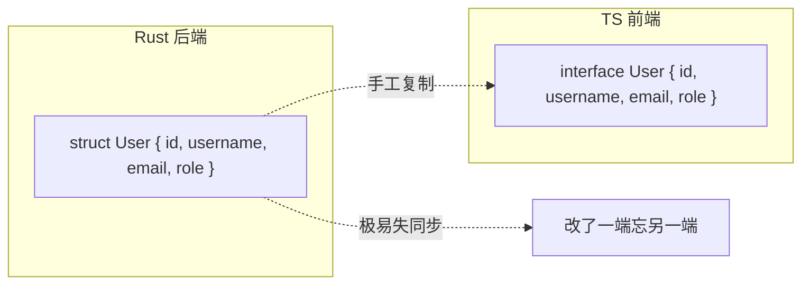
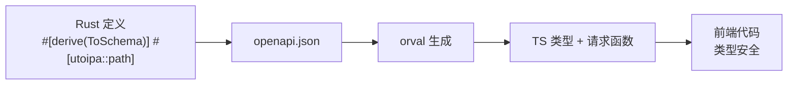
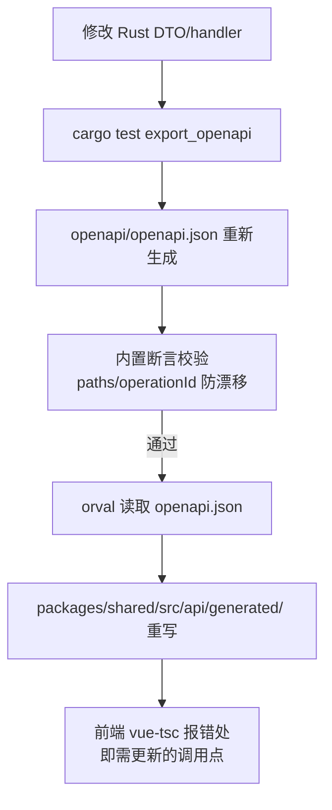
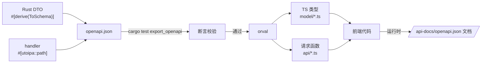
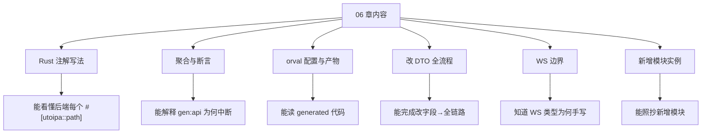
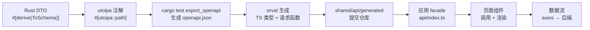

# 06 前后端类型同步机制（utoipa + OpenAPI + orval）

> 这是本项目工程化的**灵魂章节**。理解它，你就理解了为什么"改一个 Rust 结构体，前端类型自动跟着变"。

## 6.1 问题：没有类型同步的世界

### 6.1.1 手写两端的痛苦

在没有这套机制的传统项目里：



**后果**：字段改名/新增/类型变化时，一端改了另一端不知道 → 运行时才发现数据对不上 → 类型错误泛滥。

### 6.1.2 本项目的解法



**原则：Rust 是唯一真相源（single source of truth），前端类型完全由工具生成。**

---

## 6.2 链路总览（一条命令全同步）



**入口命令**（根目录）：

```powershell
npm run gen:api   # = cargo test export_openapi && orval
```

**这条命令做的事**：
1. 运行 `cargo test export_openapi`——一个特殊测试，执行时把当前后端所有 utoipa 注解聚合，**生成/更新 openapi.json**。
2. 同时断言 openapi.json 的关键路径与 operationId 与预期一致（防止意外漂移）。
3. 运行 `orval`——读取 openapi.json，生成 TS 类型 + API 请求函数到 generated/。

---

## 6.3 utoipa 注解详解（后端侧）

### 6.3.1 结构体注解（DTO）

```rust
// src/common/models.rs
use utoipa::ToSchema;

/// 用户信息
#[derive(ToSchema)]
pub struct UserInfo {
    pub id: i64,
    pub username: String,
    pub email: String,
    #[schema(example = "admin")]
    pub role: String,
}
```

**`#[derive(ToSchema)]`**：把 Rust 结构体注册为 OpenAPI schema。orval 读到后生成同名 TS interface：

```ts
// generated/model/user-info.ts（orval 生成）
export interface UserInfo {
  id: number
  username: string
  email: string
  role: string
}
```

**字段类型映射表**（Rust → TS）：

| Rust | TS |
|---|---|
| i64 / i32 / u32 | number |
| String | string |
| bool | boolean |
| f64 | number |
| Option<T> | T \| undefined 或 T \| null |
| Vec<T> | T[] |
| HashMap<String, T> | Record<string, T> |
| 自定义 struct | interface |
| 自定义 enum（string 型） | enum |

### 6.3.2 handler 注解（API 路径）

```rust
// src/fj200c_information/handlers.rs
use utoipa::{IntoParams, OpenApi};

/// 查询服务状态
#[utoipa::path(
    get,
    path = "/api/fj200c_information/service/status",
    tag = "fj200c_information",
    operation_id = "fj200c_informationServiceStatus",
    responses(
        (status = 200, description = "成功", body = ServiceStatusResult)
    )
)]
pub async fn service_status(State(state): State<AppState>) -> Result<Json<ApiResponse<ServiceStatusResult>>, AppError> {
    // ...
}
```

**注解各属性含义**：

| 属性 | 作用 | 示例 |
|---|---|---|
| `get/post/put/delete` | HTTP 方法 | `get` |
| `path` | 完整路径 | `"/api/fj200c_information/service/status"` |
| `tag` | 分组（orval 按 tag 分文件） | `"fj200c_information"` |
| `operation_id` | 唯一操作 ID（orval 函数名来源） | `"fj200c_informationServiceStatus"` |
| `responses` | 响应定义（body 类型） | `body = ServiceStatusResult` |
| `request_body` | 请求体 | `request_body = CreateUserRequest` |
| `params` | 查询/路径参数 | `params(PageParams)` |

**operation_id 的命名约定**：`tag 前缀 + 动作`（如 `fw100ListItems`、`adminUsersCreate`）——orval 函数名就是它，所以**不能重名**（防漂移测试专门查这个）。

### 6.3.3 带参数的 handler 注解

```rust
/// 更新台账条目
#[utoipa::path(
    put,
    path = "/api/fw100/items/{id}",
    tag = "fw100",
    operation_id = "fw100ItemsUpdate",
    params(
        ("id" = i64, Path, description = "条目 ID")
    ),
    request_body = CreateLedgerItemRequest,
    responses(
        (status = 200, description = "成功", body = CreateLedgerItemRequest)
    )
)]
pub async fn update_item(
    Path(id): Path<i64>,
    State(state): State<AppState>,
    Json(payload): Json<CreateLedgerItemRequest>,
) -> Result<Json<ApiResponse<CreateLedgerItemRequest>>, AppError> {
    // ...
}
```

**路径参数**用 `params(("id" = i64, Path, ...))` 声明——orval 生成时函数签名变为 `(id: number, ...)`。

### 6.3.4 统一响应包装的注解方式

```rust
/// 分页查询参数
#[derive(ToSchema, IntoParams)]
pub struct PaginationParams {
    #[schema(default = 1, minimum = 1)]
    pub page: Option<i64>,
    #[schema(default = 20, minimum = 1, maximum = 100)]
    pub page_size: Option<i64>,
}
```

**`IntoParams`**：把结构体字段映射为查询参数。`#[schema(...)]` 提供默认值/范围——OpenAPI 里生成描述，Swagger UI 与 orval 都能看到。

---

## 6.4 src/api_docs.rs（OpenAPI 聚合中心）

### 6.4.1 文件职责

```rust
// src/api_docs.rs
use utoipa::{openapi::OpenApi, Modify, OpenApi as _};

#[derive(OpenApi)]
#[openapi(
    paths(
        // 所有 handler 的路径函数（聚合）：
        auth_login, auth_me,
        admin_users_list, admin_users_get, admin_users_create, admin_users_update, admin_users_delete,
        // ...
        meta_roles,
    ),
    components(schemas(
        ApiResponse, UserInfo, CreateUserRequest, RoleInfo, Permission,
        // ... 所有 ToSchema 结构体
    )),
    tags(
        (name = "auth", description = "认证"),
        (name = "admin", description = "用户管理"),
        (name = "fj200c_information", description = "发动机监控"),
        // ...
    )
)]
pub struct ApiDoc;
```

**聚合内容三部分**：
1. `paths(...)`：所有 handler 的路径函数列表（**新增接口必须在这里登记**）。
2. `components(schemas(...))`：所有 DTO 结构体（新增 DTO 必须登记）。
3. `tags(...)`：分组描述。

### 6.4.2 export_openapi 测试（防漂移断言）

```rust
// src/api_docs.rs 末尾
#[cfg(test)]
mod tests {
    #[test]
    fn export_openapi() {
        // 1. 生成 OpenAPI 文档
        let spec = ApiDoc::openapi();
        // 2. 序列化为 JSON
        let json = serde_json::to_string_pretty(&spec).unwrap();
        // 3. 写入 openapi/openapi.json
        std::fs::write("openapi/openapi.json", json).unwrap();

        // 4. 断言关键路径存在（防止删了接口忘记同步）
        let doc = spec.clone();
        let paths = doc.paths.paths;
        assert!(paths.contains_key("/api/auth/login"), "缺少 /api/auth/login");
        assert!(paths.contains_key("/api/users"), "缺少 /api/users");
        // ... 若干关键路径断言
    }
}
```

**为什么是"test"**：`cargo test` 可以无参数跑，且测试失败会中断（`cargo run` 不会）。把"生成 + 断言"放进测试，`npm run gen:api` 里执行 `cargo test export_openapi` 就能：
- 成功 → openapi.json 已更新（与当前代码一致）。
- 失败 → 有接口缺失/断言不匹配，**先修再生成**。

### 6.4.3 断言的意义（防漂移）

```text
场景：有人删了 /api/fw100 的 update 接口但忘了同步
→ export_openapi 测试断言失败
→ gen:api 中断
→ 强制开发者意识到"接口契约变了"
```

**这就是"防漂移"**：openapi.json 永远与实际代码一致，前端类型永远可信。

---

## 6.5 orval.config.ts 详解（生成侧）

### 6.5.1 配置文件

```ts
// orval.config.ts（根目录）
import { defineConfig } from 'orval'

export default defineConfig({
  rustweb: {
    input: {
      target: './openapi/openapi.json',        // 输入：后端生成的 spec
    },
    output: {
      target: './packages/shared/src/api/generated/api/',  // 输出：请求函数目录
      schemas: './packages/shared/src/api/generated/model/',  // 输出：类型目录
      mode: 'tags-split',                      // 按 tag 分文件
      client: 'custom-instance',               // 用自定义请求实例
      clean: true,                             // 生成前清空目录
      prettier: true,                          // 格式化
    },
    hooks: {
      afterAllFilesWrite: 'prettier --write',  // 生成后统一格式化
    },
  },
})
```

### 6.5.2 配置项含义

| 配置 | 作用 |
|---|---|
| `mode: 'tags-split'` | 每个 tag 一个文件（如 admin.ts、fw100.ts） |
| `client: 'custom-instance'` | 请求函数调用 `customInstance`（我们的 axios 壳） |
| `clean: true` | 每次全量重写（旧文件自动删除） |
| `schemas` | TS 类型输出目录 |
| `afterAllFilesWrite` | 生成后 prettier 统一格式 |

---

## 6.6 npm run gen:api 完整流程演示

### 6.6.1 命令定义

```jsonc
// 根 package.json
{
  "scripts": {
    "gen:api": "cargo test export_openapi && orval"
  }
}
```

### 6.6.2 一次典型执行

```powershell
# 步骤 1：生成 openapi.json（含断言）
cargo test export_openapi
# 输出：running 1 test ... test ok

# 步骤 2：orval 生成前端代码
orval
# 输出：Generated xxx files ...
#      ✔ packages/shared/src/api/generated/api/admin.ts
#      ✔ packages/shared/src/api/generated/model/user-info.ts
#      ...
```

### 6.6.3 执行后的检查清单

```
[ ] openapi.json 已更新（git diff 查看）
[ ] generated/ 已重写（git diff 查看新字段）
[ ] 前端 vue-tsc 报错 = 调用点需要更新
[ ] 手动跑一次 npm run build 确认全链路
```

---

## 6.7 generated 产物解读

### 6.7.1 类型文件示例

```ts
// packages/shared/src/api/generated/model/api-response.ts
export interface ApiResponse<T> {
  success: boolean
  message: string
  data: T | null
}
```

### 6.7.2 请求函数文件示例

```ts
// packages/shared/src/api/generated/api/auth.ts
import { customInstance } from '../custom-instance'
import type { LoginRequest, LoginResult } from '../model'

export const authLogin = (loginRequest: LoginRequest) => {
  return customInstance<ApiResponse<LoginResult>>({
    url: `/api/auth/login`,
    method: 'POST',
    headers: { 'Content-Type': 'application/json' },
    data: loginRequest,
  })
}
```

### 6.7.3 与 facade 的衔接

```ts
// 前端 api/index.ts
export const authApi = {
  login: (payload: LoginRequest) => authLogin(payload),
  me: () => authMe(),
}
```

**调用链**：视图 → facade → generated 函数 → customInstance → axios。

---

## 6.8 修改 DTO 后的全流程演练

### 场景：给台账加"位置"字段

**步骤 1：后端改 Rust**

```rust
// src/fw100/models.rs
#[derive(ToSchema)]
pub struct Fw100LedgerItem {
    pub id: i64,
    pub name: String,
    // ... 现有字段
    pub location: String,   // 新增字段
}
```

**步骤 2：跑 gen:api**

```powershell
npm run gen:api
```

**步骤 3：检查生成的类型**

```ts
// generated/model/fw100-ledger-item.ts
export interface Fw100LedgerItem {
  id: number
  name: string
  location: string   // ✨ 自动多出
  // ...
}
```

**步骤 4：前端更新调用点**

```text
vue-tsc 报错处 = 需要处理的地方：
1. 新建台账表单没填 location → 表单加字段
2. 详情展示少字段 → 展示加行
3. 若后端 SQL 还没同步 location → 后端 service 也要改
```

**步骤 5：验证**

```powershell
npm run build   # 全前端类型检查通过
```

**核心体验**：**前端永远不知道"忘了加字段"**——类型系统强迫你补全。

---

## 6.9 WebSocket 为什么不进 OpenAPI

### 6.9.1 OpenAPI 的边界

OpenAPI 规范描述 **HTTP 请求/响应**（路径、方法、schema）。WebSocket 是长连接消息流，**不在 OpenAPI 规范范围内**（3.x 没有 WS 的标准描述）。

### 6.9.2 项目实践

| 内容 | 走 OpenAPI？ | 方式 |
|---|---|---|
| HTTP 接口 | ✅ | utoipa + orval |
| WS 连接 URL | ❌ | 前端手写 `buildWebSocketUrl` |
| WS 事件类型 | ❌ | 各前端 `types.ts` 手写判别联合 |
| WS 握手鉴权 | — | `?token=` 查询参数 |

### 6.9.3 WS 类型手写的维护注意

```ts
// 前端 types.ts —— 与后端 WS payload 结构保持一致
// 后端改事件结构 → 前端 types.ts 同步改（无自动工具）
// 防漂移手段：前后端都按同一"事件类型命名规范"（type 字段 + payload）
```

**这是项目唯一的"人工同步点"**——写代码时留意后端 `ws_bridge` 的 payload 结构。

---

## 6.10 常见问题与维护指南

### 6.10.1 报错速查

| 现象 | 原因 | 处理 |
|---|---|---|
| `cargo test export_openapi` 失败 | 断言不匹配 / 编译错误 | 看断言消息，补接口或修 DTO |
| orval 生成报错 | openapi.json 无效 | 先跑 cargo test 修 spec |
| 前端类型少了字段 | 没跑 gen:api | 跑 gen:api |
| 生成函数名变了 | operation_id 改了 | 更新 facade |
| 生成文件不见了 | tag 改名 | tags-split 按 tag 分文件，改名即新文件 |

### 6.10.2 日常维护清单

```
[ ] 新增接口：handler 注解 + api_docs.rs 的 paths 登记
[ ] 新增 DTO：ToSchema + api_docs.rs 的 schemas 登记
[ ] 删除接口：api_docs.rs 同步删（防漂移测试会抓）
[ ] 修改 DTO 字段：只改 Rust，其余自动
[ ] WS 变更：手写 types.ts 同步
```

### 6.10.3 为什么 ts-rs 方案被替换

**历史**：项目曾用 ts-rs（从 Rust 直接生成 TS 类型）。替换为 utoipa + orval 的原因：
1. ts-rs 只生成类型，**不生成请求函数**（接口路径还要手写）。
2. orval 从 OpenAPI 一次生成 **类型 + 请求函数**（API 客户端全自动）。
3. utoipa 注解同时服务 Swagger UI 文档（运行时 `/api-docs/openapi.json`）。

**结果**：一套注解，三个产物（openapi.json 文档 + TS 类型 + TS 请求函数）。

### 6.10.4 运行时文档（Swagger UI）

```text
浏览器访问 http://localhost:3000/api-docs/openapi.json
→ 实时 OpenAPI spec（与构建时生成的 openapi.json 同源）
→ 配合 Swagger UI 可交互调试
```

**前端调试 API 的权威参考**：所有接口的路径/参数/响应类型都在这。

---

## 6.11 本章自测

1. `npm run gen:api` 具体执行了什么？
2. `#[utoipa::path]` 里 operation_id 的作用？命名约定？
3. `#[derive(ToSchema)]` 后前端会得到什么？
4. export_openapi 为什么是"测试"而不是普通命令？
5. 防漂移断言抓什么错误？
6. orval 的 tags-split 和 custom-instance 分别什么意思？
7. 新增接口需要动哪些文件？
8. WS 事件类型为什么手写？
9. ApiResponse<T> 是怎么生成的？前端怎么用它？
10. 改一个 DTO 字段，完整流程几步？

**答对 8+ → 06 章通过。** 下一章：使用与维护手册——日常开发/部署/故障排查的实操指南。

## 6.12 utoipa 注解完整参考（抄写即用）

### 6.12.1 #[utoipa::path] 属性全表

| 属性 | 写法 | 用途 |
|---|---|---|
| HTTP 方法 | `get` / `post` / `put` / `delete` | 第一行 |
| `path` | `path = "/api/xxx"` | 完整路径 |
| `tag` | `tag = "xxx"` | 分组 |
| `operation_id` | `operation_id = "xxxXxx"` | 唯一 ID |
| `params` | `params(("id" = i64, Path, description = "..."), XxxParams)` | 路径/查询参数 |
| `request_body` | `request_body = XxxRequest` | 请求体类型 |
| `responses` | `responses((status = 200, description = "成功", body = XxxResult))` | 响应 |
| `context_path` | `context_path = "/api"` | 全局前缀（本项目手写全路径，未用） |

### 6.12.2 完整模板（复制修改）

```rust
/// 功能描述（会进 OpenAPI description）
#[utoipa::path(
    post,
    path = "/api/<module>/<action>",
    tag = "<module>",
    operation_id = "<module><Action>",
    request_body = <XxxRequest>,
    responses(
        (status = 200, description = "成功", body = <XxxResult>),
        (status = 401, description = "未授权"),
        (status = 403, description = "权限不足"),
    )
)]
pub async fn <action>(...) -> Result<Json<ApiResponse<<XxxResult>>>, AppError> {
    // ...
}
```

### 6.12.3 路径参数 + 查询参数混合

```rust
#[utoipa::path(
    get,
    path = "/api/fw100/items/{id}",
    tag = "fw100",
    operation_id = "fw100ItemsGet",
    params(
        ("id" = i64, Path, description = "条目 ID"),
        ("include_deleted" = Option<bool>, Query, description = "是否包含已删除"),
    ),
    responses(
        (status = 200, description = "成功", body = Fw100LedgerItem)
    )
)]
pub async fn get_item(
    Path(id): Path<i64>,
    Query(params): Query<Option<bool>>,
    ...
```

---

## 6.13 深入：ApiResponse 泛型与前端处理

### 6.13.1 Rust 侧定义

```rust
// src/common/models.rs
#[derive(ToSchema)]
pub struct ApiResponse<T> {
    pub success: bool,
    pub message: String,
    pub data: Option<T>,
}
```

### 6.13.2 OpenAPI 如何表示泛型

OpenAPI 3.0 没有"泛型类型"概念——utoipa 会为每个具体化类型生成独立 schema：

```jsonc
// openapi.json 中（示意）
"ApiResponseFw100LedgerItem": {   // 具体化后的名称
  "type": "object",
  "properties": {
    "success": { "type": "boolean" },
    "message": { "type": "string" },
    "data": { "$ref": "#/components/schemas/Fw100LedgerItem" }
  }
}
```

### 6.13.3 orval 生成后

```ts
// generated/model/（orval 会把具体化类型还原为泛型模式）
export interface ApiResponse<T> {
  success: boolean
  message: string
  data: T | null
}

// 请求函数返回类型
export const fw100ItemsList = () =>
  customInstance<ApiResponse<Fw100LedgerItem[]>>({ ... })
```

**注意**：具体化名称里的泛型参数会被 orval 识别还原成 `<T>` 泛型——无需手写。

---

## 6.14 深入：Enum 与 Option 的生成细节

### 6.14.1 Rust enum → TS

```rust
/// 事件级别
#[derive(ToSchema)]
#[serde(rename_all = "snake_case")]     // 或 serde rename 控制字符串值
pub enum EventLevel {
    Info,
    Warning,
    Error,
}
```

```ts
// generated/model/event-level.ts
export enum EventLevel {
  Info = 'info',
  Warning = 'warning',
  Error = 'error',
}
```

**关键**：枚举字符串值由 `serde` 决定（`snake_case` → `info`）。前后端都以**字符串**交换——这就是为什么 Permission 枚举用 `'system.admin'` 这种点分字符串。

### 6.14.2 Option<T> 的两种形态

| Rust | OpenAPI | TS |
|---|---|---|
| `Option<T>`（无 default） | `T \| null` | `T \| null`（nullable） |
| `Option<T>`（#[schema(default)]） | 可选字段 | `T \| undefined` |

```ts
// 前端处理两种形态
if (item.remark) { ... }              // null 或 undefined 都为假
item.remark ?? '--'                   // 兜底显示
```

### 6.14.3 数字精度提示

```ts
// Rust i64 → TS number：大数会丢精度（> 2^53）
// 本项目 id 用 i64 且值较小（自增），无风险
// 若未来有超大数值 → 改成 string 类型（#[schema(value_type = String)])
```

---

## 6.15 深入：复杂嵌套类型

### 6.15.1 Vec / 数组

```rust
pub struct TestResult {
    pub points: Vec<StatePoint>,          // → StatePoint[]
    pub matrix: Vec<Vec<f64>>,            // → number[][]
}
```

### 6.15.2 HashMap

```rust
pub struct ConfigPayload {
    pub sections: HashMap<String, Vec<KeyValue>>,   // → Record<string, KeyValue[]>
}
```

### 6.15.3 嵌套结构体

```rust
pub struct TestInfo {
    pub id: String,
    pub name: String,
    pub parameters: TestParameters,   // 嵌套 struct → 内联 interface
}
```

**规则**：嵌套类型自动递归生成——只要每个叶子 struct 都有 ToSchema，orval 全链生成。

---

## 6.16 深入：分页接口完整实战（city3d 案例）

### 6.16.1 后端

```rust
/// 分页查询参数
#[derive(ToSchema, IntoParams)]
pub struct PaginationParams {
    #[schema(default = 1, minimum = 1)]
    pub page: Option<i64>,
    #[schema(default = 20, minimum = 1, maximum = 100)]
    pub page_size: Option<i64>,
}

#[utoipa::path(
    get,
    path = "/api/city3d/buildings",
    tag = "city3d",
    operation_id = "city3dBuildingsList",
    params(PaginationParams),
    responses(
        (status = 200, description = "成功", body = PaginatedResult<Building>)
    )
)]
pub async fn list_buildings(
    Query(params): Query<PaginationParams>,
    ...
```

### 6.16.2 前端调用

```ts
// generated 生成：
export const city3dBuildingsList = (params?: City3dBuildingsListParams) => {
  return customInstance<ApiResponse<PaginatedResult<Building>>>({
    url: `/api/city3d/buildings`,
    method: 'GET',
    params,                    // axios 自动拼查询串
  })
}

// 前端使用：
const res = await city3dApi.listBuildings({ page: 1, page_size: 20 })
if (res.success && res.data) {
  items.value = res.data.items
  total.value = res.data.total
}
```

**分页模式是前端"列表型页面"的标准配餐**——fw100/admin/city3d 全部如此。

---

## 6.17 orval 高级配置（按需定制）

### 6.17.1 参数命名覆盖

```ts
// orval.config.ts
output: {
  override: {
    query: { useQuery: false },          // 本项目不用 react-query（Vue 无此概念）
    mutator: {
      path: './packages/shared/src/api/custom-instance.ts',  // 指定请求壳
      name: 'customInstance',
    },
  },
}
```

### 6.17.2 类型命名规范

```ts
output: {
  override: {
    schema: { useTypePrefix: false },    // 不用前缀
  },
}
```

### 6.17.3 何时需要动 orval 配置

```
[ ] 生成函数命名不合习惯 → override.operations 配置
[ ] 换请求库（axios → fetch）→ 改 customInstance 实现
[ ] 分 tag 太细/太粗 → 改 mode
[ ] 生成产物结构变化 → output.target/schemas
```

**原则**：能不动 orval 就不动——保持"生成 = 开箱即用"的稳定性。

---

## 6.18 类型同步机制的演进与边界

### 6.18.1 当前链路的能力边界

| 能力 | 状态 |
|---|---|
| DTO → 类型 + 请求函数 | ✅ 全自动 |
| 接口文档（运行时） | ✅ Swagger 同源 |
| WS 事件类型 | ❌ 手写 |
| 前端自定义类型（业务层） | 手写（与后端无关的部分） |
| 错误码枚举 | 通过 message 透传（无结构化） |

### 6.18.2 未来可改进方向（如需要）

```
1. WS 类型同步：手写一个"事件 schema"（类似 utoipa）→ 生成 TS
2. 错误码结构化：AppError 加 code 枚举 → OpenAPI 错误模型
3. 前端单测：generated 函数可 mock（customInstance 可替换）
4. 契约测试：openapi.json 与前端类型 diff（CI 环节）
```

**这些是"如果项目继续长大"的进化方向，当前规模不需要。**

### 6.18.3 本章总结（一张图）



**一句话**：Rust 定义一次 → 工具全链路生成 → 前端类型永不脱节。

---

## 6.19 最终自测（追加题）

11. 新增一个 tag 分组需要改哪些文件？
12. `IntoParams` 与 `ToSchema` 的区别？
13. `#[schema(default = 20, maximum = 100)]` 在前端哪里可见？
14. orval 的 custom-instance 具体指哪个文件？
15. openapi.json 文件提交仓库的意义？
16. 为什么泛型 ApiResponse<T> 能正确生成？
17. 分页接口前端如何传参？（params 对象）
18. 什么情况下要改 orval.config.ts？
19. WS 类型手写怎么最小化漂移风险？
20. 假如 CI 环境跑 gen:api，防漂移测试的价值？

**答对 15+ → 06 章精通。** 下一章是实操手册——从零启动、日常开发、部署发布、故障排查。

## 6.20 完整实例：新增"设备维护记录"模块（类型链路视角）

以 fw100 加"维护记录"子资源为例，走一遍**类型同步**完整路径（业务逻辑省略）：

### 步骤 1：Rust DTO

```rust
// src/fw100/models.rs
use utoipa::ToSchema;

/// 维护记录
#[derive(ToSchema)]
pub struct MaintenanceRecord {
    pub id: i64,
    pub item_id: i64,             // 关联台账条目
    pub action: String,           // 维护动作
    pub operator: String,         // 操作人
    pub occurred_at: String,      // 时间（ISO 字符串）
    pub remark: Option<String>,   // 备注（可空）
}

/// 创建维护记录请求
#[derive(ToSchema)]
pub struct CreateMaintenanceRequest {
    pub item_id: i64,
    pub action: String,
    pub operator: String,
    pub remark: Option<String>,
}
```

### 步骤 2：handler 注解

```rust
// src/fw100/handlers.rs
/// 查询维护记录列表
#[utoipa::path(
    get,
    path = "/api/fw100/items/{id}/maintenance",
    tag = "fw100",
    operation_id = "fw100MaintenanceList",
    params(
        ("id" = i64, Path, description = "条目 ID")
    ),
    responses(
        (status = 200, description = "成功", body = Vec<MaintenanceRecord>)
    )
)]
pub async fn list_maintenance(
    Path(id): Path<i64>,
    State(state): State<AppState>,
) -> Result<Json<ApiResponse<Vec<MaintenanceRecord>>>, AppError> { ... }

/// 新增维护记录
#[utoipa::path(
    post,
    path = "/api/fw100/items/{id}/maintenance",
    tag = "fw100",
    operation_id = "fw100MaintenanceCreate",
    params(("id" = i64, Path, description = "条目 ID")),
    request_body = CreateMaintenanceRequest,
    responses((status = 200, description = "成功", body = MaintenanceRecord))
)]
pub async fn create_maintenance(...) -> ... { ... }
```

### 步骤 3：api_docs.rs 登记

```rust
paths(
    // ...
    fw100_list_maintenance,     // 新增
    fw100_create_maintenance,   // 新增
),
components(schemas(
    // ...
    MaintenanceRecord,          // 新增
    CreateMaintenanceRequest,   // 新增
)),
```

### 步骤 4：跑 gen:api

```powershell
npm run gen:api
```

### 步骤 5：检查生成

```ts
// generated/api/fw100.ts（新增两个函数）
export const fw100MaintenanceList = (id: number) =>
  customInstance<ApiResponse<MaintenanceRecord[]>>({ url: `/api/fw100/items/${id}/maintenance`, method: 'GET' })

export const fw100MaintenanceCreate = (id: number, createMaintenanceRequest: CreateMaintenanceRequest) =>
  customInstance<ApiResponse<MaintenanceRecord>>({
    url: `/api/fw100/items/${id}/maintenance`,
    method: 'POST',
    headers: { 'Content-Type': 'application/json' },
    data: createMaintenanceRequest,
  })
```

### 步骤 6：前端 facade + 页面

```ts
// frontend/fw100/src/api/index.ts
export const fw100Api = {
  // ...原有
  listMaintenance: (id: number) => generated.fw100MaintenanceList(id),
  createMaintenance: (id: number, payload: CreateMaintenanceRequest) =>
    generated.fw100MaintenanceCreate(id, payload),
}
```

### 步骤 7：验证

```powershell
npm run build          # 类型全链路通过
```

**整个新增过程里，前端类型零手写**——这是"类型同步机制"的最大红利。

---

## 6.21 深入：git diff 读生成产物（改了什么一目了然）

### 6.21.1 改 DTO 字段后的 diff

```diff
 // packages/shared/src/api/generated/model/fw100-ledger-item.ts
 export interface Fw100LedgerItem {
   id: number
   name: string
   updated_at: string
+  location: string        // ✨ 新增字段（后端加的）
 }
```

### 6.21.2 改接口签名后的 diff

```diff
 // packages/shared/src/api/generated/api/fw100.ts
-export const fw100ItemsUpdate = (id: number, createLedgerItemRequest: CreateLedgerItemRequest) => {
+export const fw100ItemsUpdate = (id: number, createLedgerItemRequest: UpdateLedgerItemRequest) => {
```

### 6.21.3 diff 检查习惯

```
提交前必看：git diff packages/shared/src/api/generated/ openapi/openapi.json
确认：只出现预期的字段/函数变化（没有意外删除/重命名）
```

**这相当于"类型契约的 changelog"**——比任何文档都准确地告诉你接口发生了什么变化。

---

## 6.22 类型同步方案对比（为什么选这套）

| 方案 | 类型 | 请求函数 | 文档 | 维护成本 |
|---|---|---|---|---|
| ts-rs（旧） | ✅ | ❌ 手写 | ❌ | 中（双维护） |
| utoipa + orval（现） | ✅ | ✅ | ✅（Swagger） | 低（单真相源） |
| OpenAPI 手写 | ✅ | ✅ | ✅ | 高（与代码分离） |
| GraphQL | ✅ | ✅ | ✅ | 重构成本高 |

**核心优势总结**：
1. **单真相源**：Rust 代码 → 全部产物，无手工副本。
2. **防漂移测试**：接口删除/重命名立即失败。
3. **运行时文档**：Swagger UI 调试。
4. **请求函数免费**：前端不用写任何 URL。

---

## 6.23 06 章完结：知识串联



**学完本章，你应该能**：
- 看到任意后端接口，说出它对应的前端函数名（operation_id 转换）。
- 改一个字段后，预估前端哪些地方会报错。
- 新增一个模块时，一次走通"Rust → openapi.json → generated → 前端"。

下一章：使用与维护手册——日常开发、部署、故障排查的实操大全。

## 6.24 深入：openapi.json 结构速览

### 6.24.1 JSON 顶层结构

```jsonc
{
  "openapi": "3.0.3",
  "info": { "title": "RustWeb API", "version": "1.0.0" },
  "paths": {
    "/api/auth/login": {
      "post": {
        "tags": ["auth"],
        "operationId": "authLogin",
        "requestBody": { "content": { "application/json": { "schema": { "$ref": "#/components/schemas/LoginRequest" } } } },
        "responses": {
          "200": { "description": "成功", "content": { "application/json": { "schema": { "$ref": "#/components/schemas/ApiResponseLoginResult" } } } }
        }
      }
    }
  },
  "components": {
    "schemas": {
      "LoginRequest": { "type": "object", "properties": { "username": {"type": "string"}, "password": {"type": "string"} } }
    }
  },
  "tags": [ { "name": "auth", "description": "认证" } ]
}
```

### 6.24.2 怎么看

| 想看什么 | 看哪 |
|---|---|
| 接口存在吗 | `paths` 里找路径 |
| 接口签名 | 对应 method 下的 operationId/parameters |
| 请求体字段 | requestBody.schema 的 $ref → schemas |
| 响应类型 | responses["200"].content schema |
| 字段类型 | components.schemas.<名称>.properties |

**浏览器打开 http://localhost:3000/api-docs/openapi.json 在线查看**——比读代码更快。

---

## 6.25 常见 utoipa 报错与修复

| 报错 | 原因 | 修复 |
|---|---|---|
| `error: expected one of ...` | 注解语法错误 | 对照 6.12 模板检查括号/逗号 |
| `the trait bound X: ToSchema is not satisfied` | 结构体忘了 derive | 加 `#[derive(ToSchema)]` |
| `operation id not unique` | operation_id 重复 | 全局唯一命名 |
| `schemas X is not defined` | 用了但没登记 | api_docs.rs schemas 列表加上 |
| `path X has no responses` | 注解缺 responses | 补 `responses(...)` |
| `macro expansion error` | 属性名写错 | 对照属性全表 |

### 6.25.1 一个实战修复案例

```text
报错：the trait bound `PaginationParams: ToSchema` is not satisfied
分析：city3d 的分页参数用了 IntoParams 但 schema 登记处没加
修复：api_docs.rs components(schemas(...)) 加上 PaginationParams
```

**通用原则**：utoipa 报错 = 注解与登记不完整，按 6.3/6.4 逐项核对。

---

## 6.26 06 章最终自测（全集）

1. gen:api 的两步各做什么？
2. ToSchema / utoipa::path / IntoParams 各自适用对象？
3. operation_id 与 orval 函数名的关系？
4. export_openapi 测试断言什么？
5. tags-split 与 clean 的意义？
6. ApiResponse<T> 泛型如何穿透生成？
7. enum 的字符串值由谁决定？
8. WS 类型为何手写？风险在哪？
9. 新增接口要动哪些文件（后端）？
10. 修改 DTO 字段后前端哪里会报错？
11. openapi.json 的顶层结构？
12. utoipa 报错的一般排查顺序？

**12 题全对 → 06 章毕业。** 下一章：使用与维护手册。

## 6.27 深入：类型同步的日常三问

### 6.27.1 "我改了后端，前端要做什么？"

```text
改了 DTO 字段 / 接口路径 / 接口参数 / 响应类型
→ 一律先 npm run gen:api
→ 看 vue-tsc 报错，逐处修复
→ npm run build 通过即完成
```

**例外**：只改了 handler 内部逻辑（签名不变）→ 无需 gen:api；改了 WS 事件 payload → 手改前端 types.ts。

### 6.27.2 "为什么有时候 gen:api 后生成的函数少了？"

```text
可能原因：
1. tag 改名 → tags-split 按新 tag 生成新文件（旧文件被 clean 删除）
2. api_docs.rs 忘了登记新接口 → openapi.json 里没有
3. operation_id 改了 → 函数名变化（git diff 可见）
排查：git diff generated/ + openapi.json 对照
```

### 6.27.3 "这个类型是手写还是生成的？"

| 类型 | 来源 |
|---|---|
| ApiResponse / 各 DTO / Permission | generated（改 Rust） |
| WS 事件类型 | 各前端 types.ts 手写 |
| 前端自己的业务类型 | 手写（如菜单类型） |
| 工具函数类型 | 手写 |

**判断口诀**：与后端数据结构相关的 → 生成；与传输协议（WS）相关或纯前端概念 → 手写。

---

## 6.28 深入：OpenAPI 生成的历史与演进

### 6.28.1 项目类型方案的演进

```
阶段一：手写 TS 类型（历史初期）
  → 问题：两端漂移、字段漏改

阶段二：ts-rs 生成类型（中间方案）
  → 改进：类型自动生成
  → 局限：请求函数仍手写（路径/方法易错）

阶段三：utoipa + OpenAPI + orval（现行）
  → 改进：类型 + 请求函数 + 文档三位一体
  → 约定：Rust 注解即契约
```

**演进规律**：每次演进都消灭一类"人肉同步"——这正是工程化的方向。

### 6.28.2 为什么 orval 而不是其他生成器

| 生成器 | 生态 | 特点 |
|---|---|---|
| orval | 通用 OpenAPI | 支持 Vue/React、custom-instance 灵活 |
| openapi-generator | Java 生态 | 功能强但配置重 |
| swagger-typescript-api | 轻量 | 模板定制少 |

**本项目选 orval**：轻量、配置直观（orval.config.ts）、tags-split 正好匹配后端 tag 组织。

### 6.28.3 未来可能的演进

```
1. 全自动 CI：提交触发 gen:api + 契约校验（当前手动跑）
2. WS 类型生成：自定义 Rust 宏输出事件 schema
3. 前端单测快照：生成类型作为测试基准
```

**判断标准**：当"手动跑 gen:api"成为常态痛点时再自动化——当前规模手动即可。

---

## 6.29 深入：TypeScript 类型与 Rust 类型的边界

### 6.29.1 不会自动同步的边界

| 边界 | 说明 |
|---|---|
| 运行时校验 | TS 类型只编译期检查，数据合法与否靠后端校验 |
| Option 语义 | `T | null` 丢失"为什么为空"的信息 |
| 数值精度 | i64 > 2^53 丢精度（当前自增 id 无碍） |
| 日期时间 | Rust DateTime ↔ TS string（ISO） |
| 二进制 | Vec<u8> ↔ number[]（帧数据走 WS 手写类型） |

### 6.29.2 常见坑

```ts
// ① 时间字段是 string 不是 Date
item.created_at  // string（ISO 格式），展示需格式化

// ② null 与 undefined
res.data ?? []   // 后端 Option → 前端可能 null

// ③ 数字类型全 number
// 精度敏感场景（坐标）注意浮点误差
```

### 6.29.3 防御性编码习惯

```ts
// 读后端数据时假设"可能为空"
const name = item?.name ?? '未知'
const list = res.data ?? []
// 写数据时校验必填
if (!form.name) return ElMessage.warning('名称必填')
```

---

## 6.30 06 章终极综合题（真实工作场景）

### 场景：把 fw100 的 `updated_at` 从可选改为必填

```text
1. Rust：Option<String> → String（models.rs）
2. gen:api
3. 前端哪里会报错？
   - 创建表单（没填 updated_at？）——业务上改为后端自动填
   - 详情展示（?.updated_at 变 .updated_at）
   - 列表列绑定（同样处理）
4. 数据库：旧数据 updated_at 为 NULL？→ 迁移语句（UPDATE 补值）
5. 验证：build + 手动测试新旧数据展示
```

**这道题覆盖**：DTO 修改 → 生成 → 前端收窄 → 数据迁移 → 验证——类型同步全流程。

---

## 6.31 06 章完结语

**类型同步机制是本项目的"工程化名片"**。本章学完，你应该：
1. 能解释整条链路（Rust → openapi.json → orval → TS）。
2. 能熟练完成"改契约 → 同步 → 修复"的日常循环。
3. 知道边界在哪（WS 手写、运行时校验在后端）。
4. 能独立新增一个带 CRUD 的模块（契约先行）。

下一章（07）与再下一章（08）是"操作手册"与"扩展手册"——把知识变成生产力。

## 6.32 深入：OpenAPI 文件实操（用 json 文件做接口地图）

### 6.32.1 用 PowerShell 快速查接口

```powershell
# 读取 openapi.json，列出所有路径
$doc = Get-Content openapi\openapi.json -Raw | ConvertFrom-Json
$doc.paths.PSObject.Properties.Name

# 查某个接口的详情
$doc.paths.'/api/auth/login'.post.operationId

# 查某个 schema 的字段
$doc.components.schemas.UserInfo.properties | Format-List
```

### 6.32.2 用 jq（如装了）

```powershell
jq '.paths | keys' openapi\openapi.json
jq '.paths["/api/auth/login"].post' openapi\openapi.json
```

**把 openapi.json 当接口地图用**——比翻代码快得多。

---

## 6.33 深入：如何调试"生成后类型不对"

### 6.33.1 常见问题与排查

| 问题 | 排查 |
|---|---|
| 字段类型错（如 String → number） | 查 Rust 字段类型 + serde 注解 |
| 字段名变（camelCase/snake_case） | 查 serde rename_all 配置 |
| 可选性错 | 查 Option<> + #[schema(default)] |
| 枚举值不对 | 查 serde rename 映射 |
| 嵌套类型没生成 | 查子 struct 是否 ToSchema |

### 6.33.2 调试链

```text
Rust 代码 → openapi.json（看 schema 定义）
→ orval 生成（看 TS 定义）
→ 前端使用（看报错）
哪一步异常修哪一步（通常源头是 Rust serde 注解）
```

---

## 6.34 06 章最终检验：动手任务

### 任务 1：接口普查（30 分钟）

```text
1. 打开 openapi.json
2. 列出全部路径（数数有几个）
3. 找 3 个接口：登录、列表、服务状态
4. 说出各自 operationId 与对应前端函数名
5. 用 Swagger 风格（手动 POST）调用登录接口
```

### 任务 2：契约变更演练（30 分钟）

```text
1. 给 fw100 的 DTO 加一个字段（练习用）
2. gen:api
3. 观察 generated 变化（git diff）
4. 还原代码
```

### 任务 3：新增接口全流程（60 分钟）

```text
1. 后端加一个简单接口（如系统时间）
2. 注解 + 登记
3. gen:api + 前端 facade + 页面调用
4. 全链路验证
```

**三个任务完成 → 06 章真正毕业。**

## 6.35 深入：orval 生成代码的维护经验

### 6.35.1 生成文件版本管理

```
generated/ 与 openapi.json 都提交仓库
→ 好处：任何人 checkout 即可获得一致契约
→ 注意：不要手改；gen:api 会整体重写（clean: true）
```

### 6.35.2 生成后必做的三件事

```
1. git diff 看变化是否符合预期
2. 全局搜旧函数名（若 operation_id 变了）
3. 跑一次前端 build 捕获调用点报错
```

### 6.35.3 常用排查命令

```powershell
# 看当前 spec 里有哪些接口
$doc = Get-Content openapi\openapi.json -Raw | ConvertFrom-Json
$doc.paths.PSObject.Properties.Name

# 看某个 schema
$doc.components.schemas.'Fw100LedgerItem'.properties | Format-Table
```

## 6.36 深入：utd 常见场景速查（Rust 注解写错时的指引）

| 场景 | 正确写法 |
|---|---|
| 简单 GET | `#[utoipa::path(get, path="/api/x", tag="x", operation_id="xGet", responses((status=200, body=X)))]` |
| POST 带请求体 | 加 `request_body = XRequest` |
| 路径参数 | `params(("id" = i64, Path, ...))` |
| 查询参数结构体 | `params(XParams)`（需 IntoParams） |
| 返回列表 | `body = Vec<X>` |
| 返回分页 | `body = PaginatedResult<X>` |
| 多个响应 | `responses((status=200,...), (status=401,...))` |

**照抄模板比记忆属性可靠**——找到现有相似接口复制修改。

## 6.37 深入：OpenAPI 版本与 utoipa 版本的注意事项

```
项目用 OpenAPI 3.0.3 + utoipa 5
→ 注意：OpenAPI 3.1 的 nullable 语义不同（用 type + oneOf）
→ 本项目 Option<T> 生成 nullable: true（3.0 风格）
→ 升级 utoipa 大版本时检查 schema 生成差异
```

## 6.38 06 章完结补充自测（5 题）

1. gen:api 后为什么要 git diff generated/？
2. operation_id 改了会导致什么？（函数名变化 → 调用点报错）
3. 如何快速查看 spec 里所有接口？
4. 路径参数在注解里怎么写？
5. 升级 utoipa 版本要注意什么？

**这 5 题 + 前面任务完成 → 06 章彻底通关。**

## 6.39 深入：Swagger UI 的对接方式（可视化调试）

### 6.39.1 项目现状

```
后端提供 /api-docs/openapi.json（实时生成）
前端无 Swagger UI 页面（浏览器直接看 JSON）
```

### 6.39.2 加一个 Swagger UI 页面（可选增强）

```html
<!-- 在任意静态页面嵌入 Swagger UI（CDN 方式） -->
<link rel="stylesheet" href="https://unpkg.com/swagger-ui-dist/swagger-ui.css" />
<script src="https://unpkg.com/swagger-ui-dist/swagger-ui-bundle.js"></script>
<script>
  SwaggerUIBundle({ url: '/api-docs/openapi.json', dom_id: '#swagger-ui' })
</script>
```

**价值**：可视化查看参数/响应，直接"Try it out"调试接口。

## 6.40 深入：orval 与 axios 的交互细节

### 6.40.1 请求参数如何传递

```
GET 查询参数 → params 对象 → axios 拼到 URL
路径参数 → 模板字符串拼进 url
POST 数据 → data 字段
```

### 6.40.2 响应解包

```ts
// customInstance 把 axios response 解成 data
// 所以生成的函数直接返回 ApiResponse<T>
const res = await api.getList()   // res 就是 ApiResponse
res.success / res.data / res.message
```

### 6.40.3 超时与重试

```
超时：createApiClient 设 10 秒
重试：未实现（需要拦截器加）
错误：axios error → 前端 catch
```

## 6.41 深入：契约变更的团队协作流程

### 6.41.1 变更前的沟通

```
1. 谁改契约（后端开发者）
2. 影响哪些前端（应用搜索 API 调用点）
3. 兼容性（新字段可空？接口参数变不变？）
```

### 6.41.2 变更后的同步节奏

```
1. 后端完成 → gen:api → openapi.json + generated 更新
2. 前端修调用点 → build 验证
3. 提交（契约变更与前端修复一起提交）
```

### 6.41.3 破坏性变更的处理

```
1. 参数删了/类型变了 → 前端必须同步改
2. 旧接口保留过渡 → 前端逐步迁移
3. 文档更新（本套文档相关章节）
```

## 6.42 深入：06 章补充自测（追加 5 题）

1. Swagger UI 怎么嵌入？
2. 请求参数如何传？（三种）
3. customInstance 解包到什么层级？
4. 契约变更的协作节奏？
5. 破坏性变更怎么处理？

**答对 4+ → 06 章补充完成。**

## 6.43 深入：从零看一次完整的契约变更（实战演练）

### 6.43.1 场景

给 fw100 的台账列表加一个"备注"字段（nullable）。

### 6.43.2 后端改动

```rust
// src/fw100/models.rs
#[derive(ToSchema, Serialize, Deserialize)]
pub struct Item {
    pub id: i64,
    // ... 原有字段
    pub remark: Option<String>,   // 新增（可空，不破坏旧调用）
}
```

### 6.43.3 执行 gen:api

```powershell
npm run gen:api
# cargo test export_openapi  → openapi.json 更新
# orval                    → generated 更新
```

### 6.43.4 前端验证

```ts
// 类型已含 remark?: string
item.remark  // string | undefined
// 模板里直接展示（undefined 显示空）
{{ item.remark ?? '-' }}
```

### 6.43.5 检查点

```
1. openapi.json 的 schema 里出现 remark
2. generated/model/*.ts 出现 remark
3. vue-tsc 无报错
4. 旧接口调用点无需改动（向后兼容）
```

**要点**：加可选字段是最平滑的变更；删字段/改类型才是破坏性的。

## 6.44 深入：OpenAPI 文档的阅读技巧

### 6.44.1 从 JSON 里快速找接口

```powershell
# 用 PowerShell 看某个 tag 的接口
$spec = (Invoke-RestMethod http://localhost:3000/api-docs/openapi.json)
$spec.paths.'/api/fw100/items'  # 看该路径的所有方法
```

### 6.44.2 常用字段含义

| 字段 | 含义 |
|---|---|
| operationId | 生成函数名 |
| parameters | 路径/查询参数 |
| requestBody | POST/PUT 请求体 |
| responses.200 | 成功响应 schema |
| tags | 分组（决定生成文件名） |

### 6.44.3 验证 schema 与代码一致

```
若怀疑类型过期 → 打开 openapi.json 找对应 schema
→ 与 Rust 结构体对比 → 不同即需 gen:api
```

## 6.45 深入：类型同步失败时的排查清单

| 症状 | 原因 | 修法 |
|---|---|---|
| 生成函数缺失 | 忘了 utoipa 注解 | 补 #[utoipa::path] |
| 类型字段缺失 | 忘了 ToSchema | 补 #[derive(ToSchema)] |
| 类型不一致 | 改完没跑 gen:api | 重跑 |
| 前端 TS 报错 | 调用点没更新 | 按报错改调用 |
| 生成乱码/失败 | orval 配置问题 | 查 orval.config.ts |
| operationId 重复 | 断言失败 | 改 operation_id |

**口诀**：报错顺序 = 排查顺序（先后端后前端）。

## 6.46 深入：06 章最终综合自测（追加 5 题）

1. 加可选字段的完整步骤？
2. 向后兼容的变更是什么样？
3. 从 openapi.json 找接口的方法？
4. operationId 的作用？
5. 类型不一致时的排查顺序？

**答对 4+ → 06 章最终通过。**

## 6.47 深入：DTO 设计的最佳实践（类型同步的前提）

### 6.47.1 请求 DTO vs 响应 DTO

```rust
// 请求（前端 → 后端）：只含必填字段
#[derive(Deserialize)]
pub struct CreateItemRequest {
    pub name: String,
    pub type_name: String,
}

// 响应（后端 → 前端）：含数据库生成字段
#[derive(Serialize, ToSchema)]
pub struct Item {
    pub id: i64,
    pub name: String,
    pub created_at: String,
}
```

**原则**：请求与响应分开定义（不共用），前端才知道哪些字段可传、哪些只读。

### 6.47.2 字段命名规范

```rust
// 后端 snake_case → 前端 camelCase
#[serde(rename_all = "camelCase")]
pub struct TableRow { pub ng_speed: f64, pub coolant_temp: f64 }
// 前端：row.ngSpeed / row.coolantTemp
```

**这是项目契约的核心约定**——所有 DTO 都遵守。

### 6.47.3 时间字段的序列化

```
SQLite TEXT（ISO8601）→ serde 直接输出字符串
前端 new Date(isoString) 解析
注意：别让 serde 输出秒级时间戳（前端容易踩 NaN）
```

## 6.48 深入：WebSocket 事件的手写类型约定

### 6.48.1 为什么手写

```
WS 不进 OpenAPI（生成器只管 HTTP）
→ 事件类型前端手写于 types.ts
→ 与后端 serde 输出严格对应
```

### 6.48.2 手写模板

```ts
// frontend/fj200c_information/src/types.ts
export type WsMessage =
  | { type: 'frame'; data: TableRow; timestamp: number }
  | { type: 'status'; data: ServiceStatus }
  | { type: 'snapshot'; data: SnapshotData }
```

### 6.48.3 保持同步的检查点

```
1. 后端广播类型变更 → 同步改 types.ts
2. 用 discriminate union（type 字段区分）
3. 编译期 switch 穷尽检查（default 分支报未处理）
```

## 6.49 深入：06 章实战自测（5 题）

1. 请求 DTO 与响应 DTO 为何分开？
2. camelCase 转换的注解？
3. 时间字段序列化的坑？
4. WS 类型为什么手写？
5. discriminate union 的好处？

**答对 4+ → 06 章实战通过。**

## 6.50 深入：OpenAPI 生成流程的故障排查演练

### 6.50.1 场景一：gen:api 后前端函数没有出现

```
排查：
1. 后端 handler 有没有 #[utoipa::path]？
2. api_docs.rs 有没有把 handler 加进 paths？
3. cargo test export_openapi 有没有通过（断言失败会报错）？
4. orval.config.ts 的 input 路径对不对？
5. 生成的 api/xxx.ts 文件生成了吗？
```

### 6.50.2 场景二：生成的类型与后端不一致

```
排查：
1. 重新跑一次完整 gen:api（可能有缓存）
2. 检查 DTO 的 ToSchema 派生
3. 检查 utoipa 的 schema 是否引用旧路径
4. 对比 openapi.json 与结构体
```

### 6.50.3 场景三：vue-tsc 大量报错

```
1. 契约变了（改字段/删字段）→ 同步改调用点
2. 生成代码被手改过 → 重跑恢复
3. 类型引用路径错误 → 检查 import 路径
```

## 6.51 深入：类型同步的自动化与检查点

### 6.51.1 项目内的自动化

```
cargo test export_openapi：断言 openapi.json 与代码一致（防漂移）
→ 任何 handler 变更不跑 gen:api，测试就挂
→ 这是"自动化守护"机制
```

### 6.51.2 手动检查点（何时该跑 gen:api）

```
1. 改了任何 DTO（字段/结构）
2. 加了/改了 handler 签名
3. 改了路由路径
4. 删了接口
```

### 6.51.3 生成文件的管理纪律

```
1. 生成文件全部提交（openapi.json + generated/）
2. 不手改生成文件
3. 提交信息标注"gen:api"（可追溯）
```

## 6.52 深入：06 章高频自测（8 题）

1. 函数没生成的四个排查点？
2. 类型不一致的排查？
3. 契约变更报错的处理？
4. 防漂移机制是什么？
5. 何时必须跑 gen:api？
6. 生成文件的提交纪律？
7. 断言失败会怎样？
8. 手改生成文件的后果？

**答对 7+ → 06 章高频通过。**

## 6.53 深入：utopia 注解的完整参考表

### 6.53.1 常用属性一览

```rust
#[utoipa::path(
    get,                                   // 方法
    path = "/api/fw100/items",             // 路径
    tag = "fw100",                         // 分组
    operation_id = "fw100ListItems",       // 唯一 ID（生成函数名）
    params(PageParams),                    // 查询参数（DTO）
    request_body = CreateItemRequest,      // 请求体（POST/PUT）
    responses(                             // 响应
        (status = 200, description = "成功", body = ApiResponse<Vec<Item>>),
        (status = 401, description = "未登录"),
        (status = 403, description = "无权限"),
    )
)]
```

### 6.53.2 operation_id 的命名规范

```
<tag> + <动作>：fw100ListItems / fw100CreateItem
→ 生成函数名（前端直接调用）
→ 全局唯一（重复会断言失败）
```

### 6.53.3 params 的使用

```rust
#[derive(ToSchema)]
pub struct PageParams {
    pub page: Option<i32>,
    pub page_size: Option<i32>,
    pub keyword: Option<String>,
}
// 前端生成：fw100ListItems(params?: PageParams)
```

## 6.54 深入：DTO 的校验与默认值

### 6.54.1 服务端校验

```rust
pub async fn create_item(
    State(state): State<AppState>,
    Json(req): Json<CreateItemRequest>,
) -> Result<..., AppError> {
    // 手动校验
    if req.name.is_empty() {
        return Err(AppError::BadRequest("名称不能为空".into()));
    }
    // 或 validator 宏（自动校验）
    req.validate()?;
}
```

### 6.54.2 前端校验与服务端校验

```
前端校验：体验（即时反馈）
服务端校验：安全（不可绕过）
→ 两层都要有
```

### 6.54.3 默认值的约定

```
可选字段 → Option<T>（前端 undefined）
带默认值的字段 → serde(default) + 服务端填充
```

## 6.55 深入：类型契约的演进记录（项目复盘）

### 6.55.1 从 ts-rs 到 utoipa

```
旧方案：ts-rs（Rust 结构 → TS 类型）
新方案：utoipa（Rust 结构 → OpenAPI → TS 类型 + 请求函数）
```

### 6.55.2 升级的好处

```
1. 不止类型：连请求函数一起生成
2. 有 openapi.json 文档（Swagger 可读）
3. 断言防漂移（测试自动化）
4. 社区标准（生态更好）
```

### 6.55.3 升级的教训

```
1. 迁移时要重新生成所有类型
2. 手写类型（WS）保持手写
3. 生成代码格式由 orval 控制（别手改）
```

## 6.56 深入：06 章终局自测（8 题）

1. utoipa 常用属性有哪些？
2. operation_id 命名规范？
3. params 的作用？
4. 服务端校验的必要性？
5. 可选字段的约定？
6. 从 ts-rs 到 utoipa 的变化？
7. 升级的好处？
8. 迁移的教训？

**答对 7+ → 06 章终局通过。**

## 6.57 深入：orval 生成代码的完整解读

### 6.57.1 生成文件结构

```
packages/shared/src/api/generated/
├── api/
│   ├── fw100.ts        # 请求函数（按 tag 分文件）
│   └── auth.ts
├── model/
│   ├── item.ts         # 类型定义
│   └── pageParams.ts
└── index.ts            # 汇总导出
```

### 6.57.2 生成的请求函数长什么样

```ts
// generated/api/fw100.ts
export const fw100ListItems = (
  params?: PageParams,
  options?: AxiosRequestConfig
) => {
  return customInstance<ApiResponse<Item[]>>({
    url: `/api/fw100/items`,
    method: 'GET',
    params,
    ...options,
  })
}
```

### 6.57.3 生成的模型类型

```ts
// generated/model/item.ts
export interface Item {
  id: number
  name: string
  typeName: string
  remark?: string     // Option<T> → 可选
}
```

### 6.57.4 使用约定

```
1. 只 import，不修改
2. 应用层包一层 facade（api/index.ts）
3. 类型从 generated/model 导入（不手写）
```

## 6.58 深入：契约设计的常见决策

### 6.58.1 接口粒度的选择

```
粗粒度：一次返回全部（列表 + 详情）
细粒度：分开接口（list / detail）
建议：列表返回摘要，详情单独接口
```

### 6.58.2 批量操作的设计

```
批量删除：DELETE /api/xxx/items?ids=1,2,3
或 POST /api/xxx/batch-delete { ids: [] }
→ 前端统一调用（避免循环请求）
```

### 6.58.3 错误响应的设计

```
统一 ApiResponse<T>：
{ success, data?, message?, code? }
→ 前端拦截器统一处理
→ 错误信息直达用户
```

## 6.59 深入：06 章毕业自测（8 题）

1. 生成文件的三层结构？
2. 请求函数的参数怎么传？
3. Option 字段生成什么？
4. 生成文件的四条使用约定？
5. 接口粒度的建议？
6. 批量删除的两种设计？
7. 统一错误响应的结构？
8. 为什么应用层要包 facade？

**答对 7+ → 06 章毕业。**

## 6.60 深入：共享类型设计的最佳实践

### 6.60.1 什么时候放 shared

```
1. 跨应用使用（用户/权限/角色）
2. 通用组件（导航/表格/表单）
3. 通用工具（httpClient/日期）
4. 生成的 API 代码（所有应用用）
```

### 6.60.2 什么时候不放 shared

```
1. 应用特有页面组件
2. 应用特有类型（页面局部）
3. 业务差异大的逻辑
→ 判断标准：≥2 应用用才共享
```

### 6.60.3 shared 的结构

```
packages/shared/src/
├── api/generated/     # orval 生成（只读）
├── roles.ts           # 角色注册表缓存/菜单
├── types.ts           # Permission 等 re-export
├── composables/       # useTheme 等
└── utils/             # httpClient 等
```

## 6.61 深入：类型重构的完整流程（改名/迁移）

### 6.61.1 场景

```
把 Item 改名为 DeviceItem（涉及后端 DTO + 前端类型）
```

### 6.61.2 步骤

```
1. 后端 DTO 改名（models.rs）
2. gen:api → generated 更新
3. 前端全局替换 Item → DeviceItem（IDE 重命名）
4. vue-tsc 检查残余
5. 手动验证关键页面
```

### 6.61.3 重命名的风险

```
1. 生成文件与手写文件混用 → 只认 generated
2. 字符串引用（API 路径）→ 不受类型改名影响
3. 同名冲突（多个 Item）→ 加前缀区分
```

## 6.62 深入：06 章大师自测（8 题）

1. shared 放什么的判断？
2. shared 的四块结构？
3. 类型重命名的五步？
4. 改名的主要风险？
5. 为什么生成文件只读？
6. 字符串引用的特点？
7. 同名冲突怎么解决？
8. 跨应用共享的判断标准？

**答对 7+ → 06 章大师。**

## 6.63 深入：契约变更的完整场景练习

### 6.63.1 场景一：加查询参数

```rust
// 后端：分页加排序参数
pub struct PageParams {
    pub page: Option<i32>,
    pub page_size: Option<i32>,
    pub sort_by: Option<String>,    // 新增
    pub sort_dir: Option<String>,   // 新增
}
```

```
流程：gen:api → 前端类型自动带 sortBy/sortDir
→ 表格排序触发时传参
→ 无破坏（可选参数）
```

### 6.63.2 场景二：拆字段

```rust
// 旧：name（含型号）
// 新：name + model（分开）
```

```
影响：破坏性（字段类型变了）
→ 前端所有用到 name 的地方检查
→ 建议后端保留 name 兼容 + 新字段
```

### 6.63.3 场景三：接口改名

```
路径 /api/xxx/items → /api/xxx/devices
→ operationId 变 → 前端函数名变
→ 全部调用点更新
→ 建议保留旧路径过渡
```

### 6.63.4 变更决策表

| 变更 | 破坏性 | 处理 |
|---|---|---|
| 加可选字段 | 否 | 直接加 |
| 加必填字段 | 是 | 前端同步 + 过渡期 |
| 改字段类型 | 是 | 全面排查 |
| 删字段 | 是 | 双版本过渡 |
| 改路径 | 是 | 旧路径重定向 |

## 6.64 深入：06 章权威自测（8 题）

1. 加查询参数的流程？
2. 拆字段的影响？
3. 接口改名的影响？
4. 五种变更的破坏性？
5. 必填字段的过渡方案？
6. 旧路径重定向的做法？
7. 为什么可选参数无破坏？
8. 双版本过渡的思路？

**答对 7+ → 06 章权威。**

## 6.65 深入：从 OpenAPI 到页面渲染的完整链路（收官复盘）



### 6.65.1 链路的关键点

```
1. 源头是 Rust（唯一真相）
2. 生成是自动的（人工不介入）
3. 中间产物都提交（openapi.json + generated）
4. 调用点在应用层（facade）
5. 改动一个字段 → 整链自动同步
```

### 6.65.2 如果链路断了

```
1. 后端改 DTO → 没跑 gen:api → 前端类型过期
2. 断言测试（export_openapi）拦截这类漂移
3. vue-tsc 在构建时报错兜底
4. 修复：跑 gen:api + 更新调用点
```

## 6.66 深入：06 章权威自测（8 题）

1. 画一条完整链路？
2. 链路的源头在哪？
3. 哪些产物提交仓库？
4. 调用点在哪一层？
5. 链路断了怎么办？
6. 断言测试的作用？
7. vue-tsc 如何兜底？
8. 为什么源头是 Rust？

**答对 7+ → 06 章权威。**

## 6.67 深入：类型系统的边界案例

### 6.67.1 生成代码覆盖不了什么

```
1. WebSocket 事件（手写）
2. 运行时动态结构（JSON 任意）
3. 前端本地类型（页面局部）
4. 跨应用业务类型（放 shared 手写）
```

### 6.67.2 手写与生成的分界

| 类型 | 来源 |
|---|---|
| HTTP 请求/响应 | 生成 |
| WS 事件 | 手写 |
| Permission | 后端枚举 → 生成 → re-export |
| 角色菜单 | 手写（前端 UI 概念） |
| 本地表单 | 手写 |

### 6.67.3 处理边界的原则

```
1. 能生成的绝不手写
2. 手写的与后端保持同步（注释来源）
3. 边界类型集中放 types.ts（便于检查）
```

## 6.68 深入：06 章权威自测（8 题）

1. 生成代码覆盖不了的四类？
2. 手写与生成的分界表？
3. Permission 的来源？
4. WS 类型为什么手写？
5. 边界类型放哪？
6. 保持同步的方法？
7. 角色菜单为什么手写？
8. 能生成的绝不手写的意义？

**答对 7+ → 06 章权威。**

## 6.69 深入：契约的版本管理策略

### 6.69.1 契约文件的版本控制

```
openapi.json + generated/ 都提交 git
→ 每次 gen:api 变更可见（git diff）
→ 评审可发现意外变更
→ 回滚容易（git revert）
```

### 6.69.2 契约变更的提交规范

```
1. 后端 DTO/接口变更 → 与 gen:api 产物同提交
2. 前端调用点同步 → 同一提交（或紧随）
3. 提交信息写清：契约变更内容
4. 大变更拆分提交（每个接口一个）
```

### 6.69.3 契约评审要点

```
1. git diff 只看 openapi.json → 评估影响面
2. 新增字段 → 兼容
3. 删除/改名 → 破坏性，需确认
4. 操作 ID 变更 → 前端函数名变化
```

## 6.70 深入：06 章权威自测（8 题）

1. 契约文件的版本控制？
2. 提交规范的四条？
3. 评审的四个要点？
4. 为什么 diff 可见重要？
5. 大变更怎么拆？
6. 操作 ID 变更的影响？
7. git revert 的作用？
8. 提交信息怎么写？

**答对 7+ → 06 章权威。**

## 6.71 深入：本章收尾——契约思维总结

### 6.71.1 契约思维的核心

```
1. 数据形状先于代码（DTO 先行）
2. 生成而非手写（单一真相源）
3. 变更受控（断言 + 评审）
4. 前后端解耦（并行开发）
```

### 6.71.2 一个判断标准

```
"改一个字段，前端要不要动？"
→ 不用动：契约设计得好（向后兼容）
→ 要动：确认是否破坏性，同步更新
```

### 6.71.3 学习小结

```
本项目的类型契约链路（utoipa → OpenAPI → orval → 前端）
是整套系统最重要的工程机制之一
→ 理解它 = 理解前后端协作的核心
```

## 6.72 深入：06 章最终自测（6 题）

1. 契约思维的四个核心？
2. 向后兼容的判断标准？
3. 破坏性变更的处理？
4. 为什么生成优于手写？
5. 并行开发的前提？
6. 契约链路的五段？

**答对 5+ → 06 章最终完成。**

> 下一节：**07-使用与维护手册**。