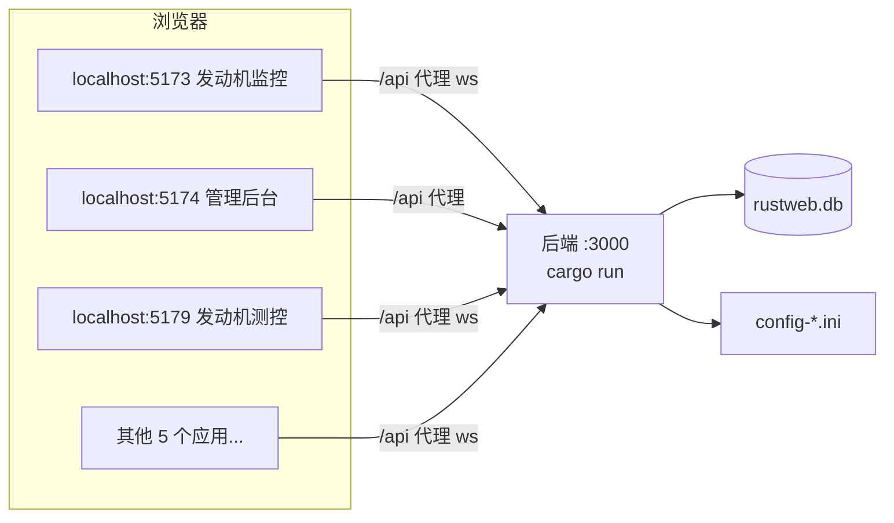
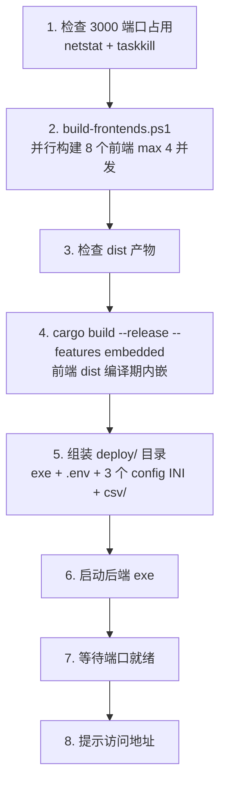

# 07 使用与维护手册

> 实操章节：从环境准备到日常运维，从部署发布到故障排查。照着做就能跑起整个系统。

## 7.1 环境准备（第一次接手项目）

### 7.1.1 所需工具

| 工具 | 版本要求 | 用途 |
|---|---|---|
| Rust 工具链 | stable（1.7x+） | 后端编译 |
| Node.js | 18+（推荐 20） | 前端构建 |
| npm | 9+ | 依赖管理 |
| Git | 任意 | 版本控制 |
| 可选：SQLite 客户端 | 任意 | 查看数据库 |
| 可选：VS Code | 最新 | 开发编辑器 |

### 7.1.2 安装检查

```powershell
# 检查版本
rustc --version       # rustc 1.8x.0
cargo --version
node --version        # v20.x
npm --version

# 检查 Windows 编译工具链（cargo build 需要 MSVC）
# 安装过 Visual Studio Build Tools 且勾选 C++ 工作负载即可
```

### 7.1.3 克隆与依赖安装

```powershell
git clone <仓库地址>
cd RustWeb-Vue

# 后端依赖（自动下载编译，首次较慢）
cargo build

# 前端依赖（根目录一次安装，workspaces 统一）
npm install
```

**注意**：
- npm install 必须在**根目录**执行（8 个前端 + shared 一次装齐），不要在子目录单独装，否则可能产生重复依赖实例。
- cargo build 首次下载 crates 需网络，慢属正常（可配置国内镜像加速）。

### 7.1.4 国内加速（可选）

```powershell
# 环境变量
$env:SPARSE_REGISTRY="sparse+https://mirrors.ustc.edu.cn/crates.io-index/"

# ~/.cargo/config.toml 配置
[source.crates-io]
replace-with = 'ustc'
[source.ustc]
registry = "sparse+https://mirrors.ustc.edu.cn/crates.io-index/"
```

---

## 7.2 启动开发环境

### 7.2.1 启动后端

```powershell
# 项目根目录
cargo run
# 输出：listening on 127.0.0.1:3000
```

**首次启动效果**：
- 自动创建 `rustweb.db`（SQLite 数据库：users / seed_passwords / user_settings / system_settings / city3d_* 等表 + 8 个种子账号，全部包在一个事务里，毫秒级完成）。
- 生成 `config-fj200c_information.ini` / `config-fj200c_main.ini` / `config-ftj1c.ini`。
- 自动生成 `.env`（若不存在）。
- 启动时执行 `jwt::init()` 缓存 JWT 配置：**dev 模式缺失 JWT_SECRET 用内置 dev 密钥（打印 warn，不影响启动）**；生产模式（release/embedded）缺失则**拒绝启动**（见 7.6.5）。
- 若 `dist-*/` 目录存在则托管静态资源（dev 模式通常没有）。

### 7.2.2 启动前端（任一应用）

```powershell
cd frontend/fj200c_information
npm run dev
# 输出：Local: http://localhost:5173/
```

浏览器访问 `http://localhost:5173/`，用种子账号登录。

### 7.2.3 种子账号（8 个，密码固定 123456）

| 账号 | 密码 | 角色 |
|---|---|---|
| admin@7304.com | 123456 | admin |
| fj200c_information@7304.com | 123456 | fj200c_information |
| fj200c_main@7304.com | 123456 | fj200c_main |
| fw100@7304.com | 123456 | fw100 |
| fw150@7304.com | 123456 | fw150 |
| ftj1c@7304.com | 123456 | ftj1c |
| city3d@7304.com | 123456 | city3d |
| protocol_generator@7304.com | 123456 | protocol_generator |

**密码机制说明**（database.rs 实现）：
- 8 个种子账号**实际 bcrypt 入库的密码固定为 "123456"**（有意保留的开发默认密码）。
- 另有 `seed_passwords` 表存**随机 12 位展示串**（仅展示用，不是真实密码）。
- `GET /admin/pwd` 公开端点返回种子账号初始密码列表，方便交付时告知客户；admin 用户页有「**停用初始密码查询**」勾选（`GET/PUT /api/users/settings/pwd-route`，system_settings 表 `pwd_route_disabled` 键），停用后 `/admin/pwd` 返回 403。

### 7.2.4 八个应用一起跑（多终端）

```powershell
# 终端 1
cargo run
# 终端 2~9（各开一个终端）
cd frontend/admin                && npm run dev
cd frontend/fj200c_information   && npm run dev
cd frontend/fj200c_main          && npm run dev
cd frontend/ftj1c                && npm run dev
cd frontend/fw100                && npm run dev
cd frontend/fw150                && npm run dev
cd frontend/city3d               && npm run dev
cd frontend/protocol_generator   && npm run dev
```

**或使用 deploy.bat 的生产模式**（见 7.6）——9 个进程（1 后端 + 8 前端）是系统的常态。

### 7.2.5 应用与端口总览

| 应用 | 用途 | dev 端口 | prod 路径 | WS 代理 |
|---|---|---|---|---|
| fj200c_information | 发动机监控 | 5173 | `/fj200c_information` | ✓ |
| admin | 管理后台 | 5174 | `/admin` | — |
| fw100 | 设备台账 | 5175 | `/fw100` | ✓ |
| ftj1c | UDP 通信监控 | 5176 | `/ftj1c` | ✓ |
| city3d | 城市 3D 展示 | 5177 | `/city3d` | ✓ |
| fw150 | 设备台账 | 5178 | `/fw150` | ✓ |
| fj200c_main | 发动机测控 | 5179 | `/fj200c_main` | ✓ |
| protocol_generator | 通信协议生成 | 5180 | `/protocol_generator` | — |

**说明**：
- 除 admin / protocol_generator 外，6 个应用开启 `ws: true` 代理（fw100 / fw150 / city3d 也开）。
- 所有 `vite.config.ts` 统一走共享工厂 `build/vite.base.ts` 的 `defineAppConfig({ app, port, ws? })`，`base` 为 build 时 `/<app>/`、dev 时 `/`，别名 `@` = `src/`、`@shared` = 共享包。
- 8 个应用共享同一登录态（localStorage `session`），跨应用跳转 token 自动传递；登录成功后若角色不匹配，自动跳到自己角色的应用。

### 7.2.6 开发环境架构



**开发模式关键点**：前端 dev server 是独立进程，`/api` 代理到后端；WS 走 `ws: true` 代理，浏览器 WS 无法带自定义头，token 通过 `?token=` 查询参数传递。

### 7.2.7 登录限流（重要）

- 后端有登录限流（`src/common/rate_limit.rs`）：**滑动窗口 60 秒内最多 5 次失败**，key = `{IP}:{邮箱}`。
- 触发后返回 HTTP 429，提示**需等待 60 秒再试**——频繁失败时先等 60 秒，窗口自动恢复。
- 排障时用固定账号连续试错容易触发，属正常保护，不是 bug。

---

## 7.3 日常开发工作流

### 7.3.1 改后端 → 验证

```powershell
# 1. 改代码
# 2. 编译检查（快）
cargo check
# 3. 跑测试（含 export_openapi 生成 openapi.json，内置路径/operationId 断言防漂移）
cargo test
# 4. 启动验证（cargo run 自动重编译）
cargo run
```

**cargo run 每次改动自动重新编译**——开发期直接用。

### 7.3.2 改前端 → 验证

```powershell
# 1. 改代码（dev server 热更新，浏览器即看效果）
# 2. 类型 + 构建检查（必须在对应 frontend/* 子目录执行）
npm run build
```

**vue-tsc 类型检查是前端"测试"**——构建通过即类型契约通过。

### 7.3.3 改 DTO/接口 → 全链路

```powershell
npm run gen:api        # 根目录：cargo test export_openapi && orval
# 前端报错处逐一修复（vue-tsc 报错处即需更新的调用点）
npm run build          # 验证全前端
```

### 7.3.4 提交规范

```powershell
git add .
git commit -m "feat(protocol_generator): 增加 Excel 导出"   # 按功能写清
```

**参考历史提交风格**（如 `git log --oneline` 所见）：前缀 + 模块 + 内容，中文描述。`Cargo.lock`、`package-lock.json`、`openapi.json`、`generated/` 均需提交；`.env` / `deploy/` / `dist` / `target` 不提交。

### 7.3.5 开发常用命令速查

| 命令 | 位置 | 用途 |
|---|---|---|
| cargo run | 根目录 | 启动后端 |
| cargo check | 根目录 | 后端编译快检 |
| cargo test | 根目录 | 全部测试（含 openapi 生成与断言） |
| npm run dev | frontend/* | 启动前端 |
| npm run build | frontend/* | 前端构建检查 |
| npm run gen:api | 根目录 | 类型同步（openapi → orval → generated） |
| deploy.bat | 根目录 | 一键部署 |

---

## 7.4 配置文件详解

### 7.4.1 .env（后端运行时配置）

```ini
# 后端启动时若 .env 不存在会自动生成（deploy 时也如此）
PORT=3000                          # 服务端口
DATABASE_URL=sqlite://rustweb.db   # 数据库路径
JWT_SECRET=your-super-secret-jwt-key-change-this-in-production   # 生产务必修改！
JWT_EXPIRATION=86400               # token 有效期（秒）= 24 小时
RUST_LOG=info                      # 日志级别：debug/info/warn/error
CORS_ORIGINS=http://127.0.0.1:3000,http://192.168.1.10:3000   # 生产 CORS 白名单（逗号分隔）
```

**dev 与生产的差异（关键）**：

| 变量 | dev 模式（cargo run） | 生产模式（release/embedded exe） |
|---|---|---|
| JWT_SECRET | 缺省用内置 dev 密钥（启动打印 warn） | **必须设置**，缺失拒绝启动 |
| CORS_ORIGINS | 允许任意来源（allow_origin(Any)） | **必须设置**白名单，缺失拒绝启动 |

### 7.4.2 config-fj200c_information.ini（发动机监控）

```ini
[Mock]
InProcess = true          ; 无硬件时模拟运行（开箱即用）

[Connection0]
Port = COM3               ; 串口
BaudRate = 115200
DataBits = 8
StopBits = 1
Parity = 0

[CSV]
Enabled = true
Dir = csv
```

**生效时机**：保存配置**立即生效**（热加载）——服务运行时修改无需重启。模拟模式 20Hz 正弦+噪声生成 8 类帧（CSSZZL/CSDQZL/SYSJXZZL/SYSJSK/SYSJZJK/SYSJMK/JBCSQCZL/SYSJQCZL），解码 28 字段，CSV 按会话命名 `fj200c_information_YYYYMMDD_HHMMSS.csv`（SYSJSK 帧建文件、SYSJZJK 帧写行、SYSJMK 帧 flush 关闭）。

### 7.4.3 config-fj200c_main.ini（发动机测控，五路串口）

```ini
[COM]
Count = 5                 ; 五路串口

[COM0]
Port = COM101             ; ECU 电控器（EB 90 2A 头，42 字节帧）
BaudRate = 115200

[COM1]
Port = COM103             ; Adam4015 环境采集（> + 8 通道 ASCII）

[COM2]
Port = COM105             ; Adam4117 环境采集（> + 8 通道 ASCII）

[COM3]
Port = COM107             ; Dyno 测功机（扭矩转速/扭矩/扭矩功率）

[COM4]
Port = COM109             ; Flux 燃油流量（FF FF 头 + u16）

[MOCK]
SimulationMenu = true     ; 模拟运行（无硬件时）

[REPORT]
StatePoints = 30000~53000 ; 24 个状态点（步进 1000）

[CSV]
Dir = csv                 ; 64 列 CSV 录制
```

**生效时机**：修改后**需重启服务**（与 fj200c_information 热加载不同）。五路映射固定：0=ECU、1=Adam4015、2=Adam4117、3=Dyno、4=Flux。主题（深/浅色，默认深色）与模拟运行也可在前端顶栏按钮一键切换（无需改 ini），见 7.8.3。

### 7.4.4 config-ftj1c.ini（UDP 通信监控）

```ini
[Udp]
Mock = true               ; 模拟数据（200ms EB 90 5B 帧）

[IP]
IP0 = 239.0.0.1           ; 主链路（模拟时 5~10s 暂停演示断线）
IP1 = 239.0.0.2           ; 备链路
IP2 ~ IP15 = 239.0.0.3 ~ 239.0.0.16   ; 扩展链路
Port = 5000
TimeoutMs = 100
```

**生效时机**：修改后**需重启服务**。前端「IP 配置」对话框保存 16 路 × 收发（IpConfig 32 键）；应用内还有**帮助页**（`/ftj1c/help`，MarkdownIt 渲染 help_doc.md，需要 `Ftj1cHelp` 权限）。

### 7.4.5 配置修改流程总结

| 文件 | 生效方式 | 修改入口 |
|---|---|---|
| .env | 重启后端 | 直接编辑 |
| config-fj200c_information.ini | **热加载（立即生效）** | 页面"配置"页保存 |
| config-fj200c_main.ini | **重启服务** | 直接编辑重启，或前端主题/模拟开关 |
| config-ftj1c.ini | **重启服务** | 页面 IP 配置保存 |

---

## 7.5 数据库管理

### 7.5.1 数据库位置

| 模式 | 位置 |
|---|---|
| 开发 | 根目录 `rustweb.db` |
| 部署 | `deploy/rustweb.db` |

### 7.5.2 表清单（database.rs 建表）

| 表 | 说明 |
|---|---|
| users | 用户表（username / email / password_hash / role / is_active，哈希永不下发） |
| seed_passwords | 种子账号初始密码（随机 12 位展示串，配合 GET /admin/pwd） |
| user_settings | 用户级设置 |
| system_settings | 系统设置键值对（如 `pwd_route_disabled`，停用初始密码查询） |
| city3d_districts | 城市区域（种子 5 个） |
| city3d_buildings | 城市建筑（种子 51 个） |
| city3d_events | 城市事件（种子 8 个） |

**数据走向**：台账（fw100/fw150）与发动机采集数据走代码内数据/CSV 文件而非数据库；city3d 与用户体系才落库。详见 03 章 database.rs 精读。

### 7.5.3 种子与历史迁移

- 全部建表 + 种子数据包在**一个事务**里（启动毫秒级、幂等，重复启动不重复插入）。
- **幂等清理历史表**：user_roles / roles / posts / menu_items / user_devices / data_export_requests 及冗余索引（旧版本遗留，新装无感知）。
- **历史角色迁移**：moderator→user 降级、user→fj200c_information、fj200c→fj200c_information。
- 无 sqlx 迁移文件，建表逻辑内建在 database.rs；升级时旧库由幂等逻辑自动补齐。

### 7.5.4 查看与备份

```powershell
# 用 SQLite 客户端打开 rustweb.db 查看
# 命令行方式（需 sqlite3 或替代）
sqlite3 rustweb.db ".tables"
sqlite3 rustweb.db "SELECT * FROM users;"
sqlite3 rustweb.db "SELECT * FROM system_settings;"   # 看 pwd_route_disabled 等键

# 备份：直接复制文件（WAL 模式需同时复制 -wal 文件）
Copy-Item rustweb.db rustweb.db.bak
Copy-Item rustweb.db-wal rustweb.db-wal.bak   # 如有
```

### 7.5.5 重置数据库

```powershell
# 删除后重启后端自动重建（含种子账号与 city3d 种子数据）
Remove-Item rustweb.db
cargo run
```

**注意**：重建后所有账号密码恢复 123456，业务数据清空——仅开发环境使用。

### 7.5.6 WAL 模式说明

```rust
// database.rs：连接时设置 WAL + foreign_keys
PRAGMA journal_mode = WAL;      // 写性能好、读写并发
PRAGMA foreign_keys = ON;       // 外键约束
```

**运维影响**：运行中目录会出现 `rustweb.db-wal`、`rustweb.db-shm` 文件——正常现象，别删（删了可能丢未落盘数据）。备份时先停止服务或同时备份 wal。

---

## 7.6 部署发布（deploy.bat）

### 7.6.1 一键部署

```powershell
# 项目根目录
.\deploy.bat
```

### 7.6.2 deploy.bat 流程



**顺序不可颠倒**：前端 dist 在**编译期**内嵌进 exe（rust-embed，`--features embedded`），必须**先构建前端再编译后端**。8 个前端并行构建（max 4 并发），任一失败即停。

### 7.6.3 部署产物

```
deploy/
├── rust-web-backend.exe          # 单文件后端（内嵌 8 个前端）
├── .env                          # 自动生成：PORT/DATABASE_URL/JWT_SECRET/JWT_EXPIRATION/RUST_LOG/CORS_ORIGINS
├── config-fj200c_information.ini
├── config-fj200c_main.ini
├── config-ftj1c.ini
├── csv/                          # CSV 数据目录
└── rustweb.db                    # 数据库（启动后自动生成）
```

### 7.6.4 部署后访问（8 个应用）

```
http://127.0.0.1:3000/                      # 302 重定向到 /admin
http://127.0.0.1:3000/admin                 # 管理后台
http://127.0.0.1:3000/fj200c_information    # 发动机监控
http://127.0.0.1:3000/fj200c_main           # 发动机测控
http://127.0.0.1:3000/fw100                 # 设备台账
http://127.0.0.1:3000/fw150                 # 设备台账
http://127.0.0.1:3000/ftj1c                 # UDP 通信监控
http://127.0.0.1:3000/city3d                # 城市 3D
http://127.0.0.1:3000/protocol_generator    # 协议生成器
```

### 7.6.5 生产必设环境变量（否则拒绝启动）

生产模式（release / embedded exe）启动时会校验，缺失即退出：

| 变量 | 说明 | 示例 |
|---|---|---|
| JWT_SECRET | 签名密钥，随机长字符串 | 64 位随机串 |
| CORS_ORIGINS | 允许访问的源，逗号分隔白名单 | `http://127.0.0.1:3000,http://192.168.1.10:3000` |

```powershell
# 生成随机 JWT_SECRET（PowerShell）
-join ((48..57)+(65..90)+(97..122) | Get-Random -Count 64 | ForEach-Object {[char]$_})

# 生成后写入 deploy/.env
JWT_SECRET=<上面的输出>
CORS_ORIGINS=http://127.0.0.1:3000,http://192.168.1.10:3000
```

**多设备访问场景**：所有访问设备访问的地址（IP:3000）都要加入 CORS_ORIGINS 白名单，否则浏览器跨域被拦。

### 7.6.6 部署注意事项

| 事项 | 说明 |
|---|---|
| 端口占用 | deploy.bat 自动检测并结束占用进程（慎用：可能误杀其他程序） |
| 修改 JWT_SECRET | 部署后编辑 deploy/.env 并重启 exe |
| 数据保留 | deploy/rustweb.db 不会被覆盖（首次自动生成） |
| 外网访问 | main.rs 绑定 127.0.0.1——需要外网改 0.0.0.0 重新编译 |
| 防火墙 | 外网场景需放行 3000 端口 |
| SPA 深链接 | embedded 模式未匹配路径自动回退 index.html，刷新子页面不 404 |
| 静态缓存 | assets/ 永久缓存（immutable），.html no-cache |
| 优雅退出 | Ctrl+C 走 graceful shutdown，Windows ctrl_shutdown 同样处理 |

---

## 7.7 用户与权限管理实操

### 7.7.1 管理用户

```text
1. 登录 admin@7304.com / 123456
2. 管理后台 → 用户管理
3. 新建用户：用户名/邮箱/密码/角色（密码 bcrypt 哈希走阻塞池）
4. 编辑：改角色（权限随之变化）
5. 删除：不可删自己（防自锁）
```

### 7.7.2 初始密码查询与停用

- `GET /admin/pwd`（公开）返回种子账号初始密码列表，交付客户时方便告知初始账号。
- admin 用户页「**停用初始密码查询**」勾选 → `PUT /api/users/settings/pwd-route` → system_settings 表 `pwd_route_disabled = true`，此后 `/admin/pwd` 返回 403。
- **交付生产前建议停用**（种子密码固定 123456，公开列表会暴露）。

### 7.7.3 权限与应用的对应（8 角色）

| 角色 | 权限 | 对应前端 |
|---|---|---|
| admin | SystemAdmin + UsersRead/UsersWrite/UsersDelete | admin |
| fj200c_information | Fj200cInformationMonitor | fj200c_information |
| fj200c_main | Fj200cMainMonitor | fj200c_main |
| fw100 | Fw100Monitor | fw100 |
| fw150 | Fw150Monitor | fw150 |
| ftj1c | Ftj1cMonitor + Ftj1cHelp | ftj1c |
| city3d | City3dView | city3d |
| protocol_generator | ProtocolGeneratorMonitor | protocol_generator |

**角色注册表唯一源在后端**（`src/roles.rs` ROLE_REGISTRY），经 `GET /api/meta/roles` 公开；前端登录/初始化时自动拉取并缓存，菜单与权限均由注册表驱动。新增角色流程见 08 章。

### 7.7.4 重置密码

```powershell
# 直接改数据库（开发环境，需要先算 bcrypt 哈希）
sqlite3 rustweb.db "UPDATE users SET password_hash = '<bcrypt>' WHERE username = 'xxx';"
# 或删除用户重建（数据简单时）
```

**密码是 bcrypt 哈希**，不能看明文——遗忘只能重置。推荐始终通过 admin 界面操作（后端自动 bcrypt）。

---

## 7.8 各应用使用指南

### 7.8.1 admin 管理后台（5174 / `/admin`）

- **用户管理**（Users.vue）：用户列表、新建（CreateUser.vue）、编辑角色、禁用、删除（不可删自己）。
- **停用初始密码查询**：用户页勾选框 → PUT `/api/users/settings/pwd-route`（见 7.7.2）。
- 无权限访问时显示 403 页（noPermission 路由模式）。

### 7.8.2 fj200c_information 发动机监控（5173 / `/fj200c_information`）

| 页面 | 功能 |
|---|---|
| 监控 Monitor | 服务启停（状态栏+导航按钮）、命令面板（8 类命令帧：CSSZZL/CSDQZL/SYSJXZZL/SYSJSK/SYSJZJK/SYSJMK/JBCSQCZL/SYSJQCZL）、实时数据面板（28 字段） |
| 可视化 Visual | ECharts 6 仪表 + 实时曲线 |
| 数据 Data | CSV 会话文件列表与下载（`fj200c_information_YYYYMMDD_HHMMSS.csv`） |
| 配置 Config | config.ini 在线编辑保存（**热加载立即生效**） |
| 帮助 Help | 使用说明 |

- 模拟模式开箱即用：config `[Mock] InProcess = true`（20Hz 正弦+噪声，8 类帧轮发）。
- 最多 8 个采集连接（MAX_CONNECTIONS）；WS 实时推送（200ms 节流）。

### 7.8.3 fj200c_main 发动机测控（5179 / `/fj200c_main`）

**五路串口**：ECU 电控器 / Adam4015 环境采集 / Adam4117 环境采集 / Dyno 测功机 / Flux 燃油流量（见 7.4.3）。

| 功能 | 说明 |
|---|---|
| 主仪表盘 Monitor | 5 个仪表卡片（Ng 转速 / 排气温度 / 测功机功率 50kW / 燃油流量 / Np 转速）+ 环境参数 8 行（大气温度/湿度/压力、进口温度、燃油流量、扭矩转速、扭矩、扭矩功率） |
| 命令面板 ControlPanel | 空中起动 0x91 / 起动 0xA1 / 燃气发生器冷运转 0xB1 / 停止冷运转 0xC1 / 恒定油门设定 0xD1 / 停车 0xE1 / 油路排气 0xF1 / 电控器自检 0x10（帧 `EB 90 10` + 序号 + 校验和） |
| 模拟运行 | 顶栏「模拟运行」开关（ElMessageBox 确认）或 config `[MOCK] SimulationMenu = true`；停止服务时自动复位 |
| 主题切换 | 顶栏深色/浅色切换（默认深色，localStorage 持久化 + 跨标签页同步） |
| CSV 录制 | 顶栏「保存数据」开关，64 列 CSV 写入 csv/ 目录；录制前校验服务运行状态 |
| 试验信息 | 录入/查看（ExperimentInput / ExperimentView） |
| 报表生成 | 选择 CSV + 状态点（逗号分隔 RPM，24 个状态点 30000~53000）→ 生成 **4 张表**（基本信息/性能数据/标准数据/设计点数据）+ 水印 ©7304厂 → 打印（**打印时自动隐藏导航栏**，报表自带全局 print 块） |

### 7.8.4 fw100 / fw150 设备台账（5175 / 5178）

- 台账面板（LedgerPanel 共享组件）：编号 / 名称 / 类别 / 状态（在线 = 绿色 tag）。
- 数据来自 `GET /api/fw100/items`、`GET /api/fw150/items`。

### 7.8.5 ftj1c UDP 通信监控（5176 / `/ftj1c`）

- **监控页**（Monitor.vue）：4×4 卡片网格——8 个连接 × raw/extracted 帧视图，实时查看 95 字节帧（`EB 90 5B` 头 + 槽位 + 序号 + 载荷 + 校验和）。
- **IP 配置**：对话框编辑 16 路 × 收发组播地址（config-ftj1c.ini `[IP]`），保存后**重启服务生效**。
- **帮助页**（`/ftj1c/help`）：MarkdownIt 渲染 help_doc.md，需要 `Ftj1cHelp` 权限。
- 模拟模式：`[Udp] Mock = true` 时 200ms 生成帧，IP0 主链路每 5~10s 暂停一次演示断线重连。
- 服务启停与状态在状态栏控制。

### 7.8.6 city3d 城市 3D 展示（5177 / `/city3d`）

- **场景页**（`/city3d/main`，CityScene.vue）：程序化城市 + 发光窗户（CanvasTexture）+ 960 点交通粒子（CatmullRom 路径）+ Bloom 辉光 + 悬停高亮；4 时段昼夜切换、天气粒子、热力色模式、自动旋转；HUD 含区域列表/统计卡片/事件流/底部控制栏。
- **数据管理**（`/city3d/data`，DataPanel.vue）：el-tabs 对区域 / 建筑 / 事件 CRUD（对应 city3d_districts / city3d_buildings / city3d_events 表）。
- 数据 5 秒轮询刷新（useCityData）。
- 注意：`Panorama.vue` 为废弃页面（保留参考，未挂路由）。

### 7.8.7 protocol_generator 协议生成器（5180 / `/protocol_generator`）

| 菜单 | 功能 |
|---|---|
| 协议编辑（/protocol_generator/editor） | 协议表编辑（字段 index/字节范围/数据类型/长度/单位/备注）、参数目录自动填充、**C# 代码生成**（15 个 C# 类型带大小，按类型大小自动重排字节范围）、**Excel 导出**（后端 rust_xlsxwriter 内存生成下载）、JSON 上传下载、hiprint 打印、Markdown 预览 |
| CSV 参数表（/protocol_generator/csv） | 默认参数表读写（7 行 BOM 种子：参数名称/别名/单位/数据类型/备注）、CSV 文件导入与导出（UTF-8 BOM 兼容） |

- 后端接口：default-csv GET/PUT、markdown、excel、csv/parse、csv/serialize（均需 ProtocolGeneratorMonitor 权限）。
- 打印基于 hiprint（main.ts 注册 hiPrintPlugin）。

---

## 7.9 故障排查手册（症状 → 原因 → 解决）

### 7.9.1 后端启动失败

| 症状 | 原因 | 解决 |
|---|---|---|
| `address already in use` | 3000 端口被占 | 找出并结束占用进程（`netstat -ano \| findstr :3000`） |
| 生产 exe 启动即退出：JWT_SECRET 缺失 | 生产模式必须设置 | 编辑 deploy/.env 设置 JWT_SECRET 后重启 |
| 生产 exe 启动即退出：CORS_ORIGINS 缺失 | 生产模式必须设置白名单 | 设置逗号分隔白名单后重启 |
| dev 启动打印 `WARN ... dev-insecure-secret-key` | dev 模式缺省密钥 | 正常现象，仅开发用；生产必须显式设置 |
| `database locked` | 多实例抢数据库 | 只跑一个后端实例 |
| 编译失败 | Rust 代码问题 | cargo check 看具体报错 |
| `sqlite: create_if_missing` 失败 | 目录无写权限 | 检查运行目录权限 |

### 7.9.2 前端启动失败

| 症状 | 原因 | 解决 |
|---|---|---|
| 端口被占 | 517x 端口冲突 | strictPort 报错，改端口或关进程 |
| `Cannot find module` | 依赖没装 | 根目录 npm install（勿在子目录单独装） |
| proxy 报错 | 后端没启动 | 先启动 cargo run |
| 构建失败 | 类型错误 | 按 vue-tsc 报错修（或先跑 gen:api） |
| 白屏 | 路由/守卫问题 | 看 Console 报错（见 7.9.6） |

### 7.9.3 登录问题

| 症状 | 原因 | 解决 |
|---|---|---|
| 登录失败提示 | 用户名/密码错 | 确认账号角色（种子密码固定 123456） |
| `429 Too Many Requests` | 60 秒内失败超过 5 次（限流） | **等待 60 秒**再试，窗口自动恢复 |
| 登录成功但跳回登录页 | 角色注册表未加载/权限空 | 检查 /api/meta/roles 返回（失败会缓存空数组但不阻塞登录） |
| 401 循环 | token 过期 | 清 localStorage（session）重新登录 |
| 某应用进不去 | 角色权限不匹配 | 用对应用户登录（登录页自动跳到自己角色应用） |

### 7.9.4 WebSocket 连接问题

| 症状 | 原因 | 解决 |
|---|---|---|
| WS 一直 connecting | 后端没启动 / 代理未开 ws | 启动 cargo run；vite.config 需 `ws: true`（6 个应用已开，admin/protocol_generator 无 WS） |
| 401 断开 | token 过期/无效 | 重新登录；WS 走 `?token=` 查询参数校验（verify_query_token） |
| 数据卡住 | 采集服务未启动 | 先点「启动服务」；检查模拟开关 |
| 连上即断 | 广播通道满 | 广播容量 1024，满丢弃最旧——属设计行为，看后端日志 |

### 7.9.5 数据问题

| 症状 | 原因 | 解决 |
|---|---|---|
| 监控无数据 | 模拟未开/串口未接 | 配置 Mock/硬件（fj200c_information 热加载立即生效） |
| 表格不刷新 | WS 未连接 | Network → WS 面板检查 |
| CSV 没生成 | CSV 开关/目录 | 检查 [CSV] Enabled/Dir；fj200c_main 需先启动服务再录制 |
| 配置不生效 | 需重启 | fj200c_main / ftj1c 改配置后重启服务 |
| 串口打不开 | 被其他程序占用/端口不存在 | 关占用程序、查设备管理器 COM 号 |

### 7.9.6 路由守卫死循环（历史 bug）

新增应用/页面时，`homePath`（默认 `/${app}`）**必须存在于路由表**，否则 404 兜底路由会与路由守卫互相触发，形成无限重定向死循环（曾发生于 protocol_generator，commit a4a7f7c 修复）。症状：白屏 + Console 狂刷 redirect。

### 7.9.7 打印问题

- fj200c_main 报表打印：**打印时自动隐藏导航栏**（报表自带全局 @media print 块），若打印出来带导航栏说明打印样式未生效（检查是否走了 window.print()）。
- protocol_generator 打印：基于 hiprint（main.ts 已注册 hiPrintPlugin），打印区域选择异常时检查插件初始化。

### 7.9.8 日志定位

```powershell
# 后端日志（RUST_LOG 控制：error/warn/info/debug）
$env:RUST_LOG = "debug"
cargo run
# 部署模式重定向到文件
deploy\rust-web-backend.exe *> backend.log 2>&1
```

**排查通用流程**：现象 → 前端 Console/Network → 后端日志 → 数据库/配置文件 → 定位修复。实时数据问题建议 `RUST_LOG=debug`（能看到 WS 连接、帧到达、CSV 写入细节）。

---

## 7.10 性能与容量管理

### 7.10.1 资源占用评估

| 组件 | 资源 |
|---|---|
| 后端 exe | 内存几十 MB 级（内嵌 8 前端 dist） |
| SQLite | 单文件，业务数据小（台账/用户/city3d） |
| CSV | 按帧写入，长时间运行会增长 |
| 前端 | 浏览器内存（实时图表限长缓冲；WS 载荷预序列化 Arc<str>，广播只转发指针） |

### 7.10.2 容量关注点

| 项 | 风险 | 对策 |
|---|---|---|
| csv/ 目录 | 长时间录制文件膨胀 | 定期清理/归档（7.12） |
| rustweb.db | 台账/city3d 数据增长 | 定期备份 |
| 实时图表 | 前端内存 | 限长缓冲（已有）；ECharts 高刷时降低更新频率 |
| city3d 场景 | 低配机 Three.js 压力 | 关闭自动旋转/天气粒子/热力模式 |
| WS 连接数 | 多客户端 | 广播容量 1024，超量丢弃最旧；单机部署限制浏览器数 |

### 7.10.3 性能调优开关

```
[CSV] Enabled = false    # 不录 CSV 省磁盘/IO
[Mock] InProcess = true  # 无硬件模拟省串口
RUST_LOG = warn          # 减少日志 IO
```

---

## 7.11 安全加固清单

### 7.11.1 必须做的

| 项 | 操作 |
|---|---|
| JWT_SECRET | 生产环境改为随机长字符串（见 7.6.5 生成方法） |
| CORS_ORIGINS | 生产环境配置白名单（缺失拒绝启动） |
| 初始密码查询 | 交付前在 admin 停用 `/admin/pwd`（`pwd_route_disabled`） |
| 默认密码 | 种子密码固定 123456——首次登录立即修改 |
| 服务绑定 | 内网用 127.0.0.1，外网慎重（改 0.0.0.0 需重编译） |
| 日志 | RUST_LOG 不输出敏感数据（密码哈希永不下发，serde skip） |

### 7.11.2 可选加固

```
1. 反向代理（Nginx）+ HTTPS
2. 数据库加密（SQLCipher）
3. 用户密码策略（长度/复杂度强制）
4. 定期轮换 JWT_SECRET
5. 登录限流参数调整（rate_limit.rs：60s/5 次）
```

**系统定位**：内网/单机工具型系统，安全基线是"不暴露公网 + 修改默认密钥 + 停用密码查询"。

---

## 7.12 日常维护清单（每周/每月）

### 每周

```
[ ] 检查 csv/ 目录大小，清理过期数据
[ ] 查看后端日志有无异常错误
[ ] 备份 rustweb.db（连同 -wal/-shm）
[ ] 确认服务 24h 稳定运行（任务计划自启动可选）
```

### 每月

```
[ ] 检查磁盘空间
[ ] 归档 CSV（按项目/月份压缩）
[ ] 更新依赖（npm update + cargo update，先测试）
[ ] 审查用户列表（清理离职账号、复核角色）
[ ] 验证备份可恢复（在测试机跑一遍备份）
```

### 版本发布流程

```
1. 功能验证（8 个应用全点一遍）
2. npm run gen:api（契约一致性）
3. 前端 8 个 npm run build（类型检查）
4. cargo test（后端 + openapi 断言）
5. deploy.bat（部署）
6. 生产冒烟测试（登录/监控/台账/协议生成）
```

---

## 7.13 使用维护 FAQ

**Q：可以把服务绑定到 0.0.0.0 供局域网访问吗？**
A：改 `src/main.rs` 的绑定地址后重新编译（embedded 模式）。同时把局域网访问地址（如 `http://192.168.1.10:3000`）加入 CORS_ORIGINS 白名单，否则浏览器跨域被拦。

**Q：登录提示 429 怎么办？**
A：60 秒内失败超过 5 次触发限流（key = IP+邮箱），等待 60 秒自动恢复，无需重启。

**Q：dev 模式没配 JWT_SECRET / CORS_ORIGINS 也能跑，为什么？**
A：dev 模式用内置 dev 密钥（warn 日志）+ 允许任意来源；**生产模式（release/embedded）缺失会拒绝启动**，这是强制安全底线。

**Q：初始密码查询怎么关？**
A：admin 用户页「停用初始密码查询」勾选 → PUT `/api/users/settings/pwd-route`，此后 `GET /admin/pwd` 返回 403。

**Q：config-fj200c_main.ini 改了为什么不生效？**
A：该模块配置**需重启服务**（与 fj200c_information 热加载不同）；主题与模拟开关可不用改 ini，前端顶栏一键切换。

**Q：多个用户同时看监控会怎样？**
A：WS 广播，多人可同时观看；广播通道容量 1024，满丢弃最旧。控制类操作（启停）需自行协调（无互斥锁，设计如此）。

**Q：能改成 MySQL/PostgreSQL 吗？**
A：sqlx 支持多数据库，但建表/种子逻辑与 SQLite 语法耦合，改造成本中等，不建议。

**Q：CSV 文件能按天分目录吗？**
A：`[CSV] Dir` 目前固定目录，文件名带日期（如 `fj200c_information_20260813_101500.csv`）；可按需改后端写文件逻辑。

**Q：新增前端应用/页面后白屏死循环？**
A：检查路由表是否缺少 homePath（默认 `/${app}`）对应的路由——404 兜底 + 守卫互踢是历史 bug（见 7.9.6）。

**Q：WS 怎么鉴权的？**
A：浏览器 WS 不支持自定义头，token 通过 `?token=` 查询参数传递，后端 `verify_query_token` 校验（401）。

---

## 7.14 浏览器与兼容性

| 项 | 说明 |
|---|---|
| 推荐浏览器 | Chromium 系（Chrome / Edge），实时监控类页面建议用固定版本长期使用 |
| city3d | 需要 WebGL 支持（Three.js 场景/粒子/Bloom） |
| 打印 | fj200c_main 报表用 window.print()（打印时隐藏导航栏）；protocol_generator 用 hiprint 插件 |
| 分辨率 | 导航栏宽度适配 1920（自动收起时 64px → 0） |
| 中文字体 | 系统默认字体即可，无需特殊配置 |

---

## 7.15 本章自测

1. 首次克隆后需要执行哪两条安装命令？分别在哪个目录？
2. 种子账号有几个？域名是什么？默认密码？
3. 初始密码在哪里查？怎么停用？（接口与系统设置键）
4. 8 个应用的 dev 端口与 prod 路径分别是什么？哪 6 个应用开 WS 代理？
5. 登录限流的规则？（窗口/次数/key）
6. dev 模式与生产模式对 JWT_SECRET / CORS_ORIGINS 的要求差异？
7. 三个 ini 各是什么生效时机？fj200c_main 是几路串口、各是什么设备？
8. deploy.bat 的构建顺序为什么不可颠倒？前端怎么构建（几个并发）？
9. 部署产物有哪些文件？生产 exe 启动即退出最可能缺什么？
10. rustweb.db 有哪些表？种子与历史迁移是怎么做的（事务/幂等）？
11. 生产深链接刷新 404 怎么解决？
12. WS 连不上的排查顺序？
13. homePath 路由缺失会导致什么现象？
14. fj200c_main 报表生成流程？（选 CSV + 状态点 → 4 张表 → 打印）
15. 打印时导航栏怎么隐藏的？
16. 根路径 `/` 重定向到哪里？
17. 性能调优的三个开关？
18. 安全加固的必做项？
19. 备份清单包含哪些？
20. 版本发布流程六步？

**答对 16+ → 07 章通过。** 下一章：扩展与二次开发——新增角色/模块/应用/接口的完整指南。

> 下一节：**08-扩展与二次开发**。
