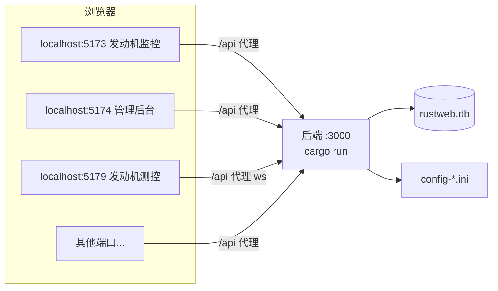
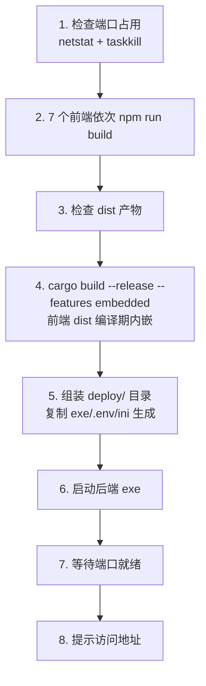
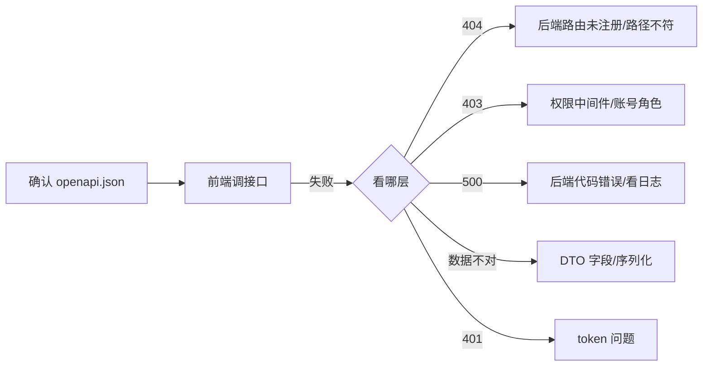
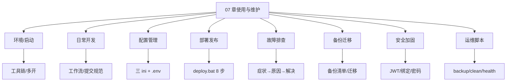

# 07 使用与维护手册

> 实操章节：从环境准备到日常运维，从部署发布到故障排查。照着做就能跑起整个系统。

## 7.1 环境准备（第一次接手项目）

### 7.1.1 所需工具

| 工具 | 版本要求 | 用途 |
|---|---|---|
| Rust 工具链 | stable（1.7x+） | 后端编译 |
| Node.js | 18+（推荐 20） | 前端构建 |
| npm | 9+ | 依赖管理 |
| Git | 任意 | 版本控制 |
| 可选：SQLite 客户端 | 任意 | 查看数据库 |
| 可选：VS Code | 最新 | 开发编辑器 |

### 7.1.2 安装检查

```powershell
# 检查版本
rustc --version       # rustc 1.8x.0
cargo --version
node --version        # v20.x
npm --version

# 检查 Windows 编译工具链（cargo build 需要 MSVC）
# 安装过 Visual Studio Build Tools 且勾选 C++ 工作负载即可
```

### 7.1.3 克隆与依赖安装

```powershell
git clone <仓库地址>
cd RustWeb-Vue

# 后端依赖（自动下载编译，首次较慢）
cargo build

# 前端依赖（根目录一次安装，workspaces 统一）
npm install
```

**注意**：
- npm install 必须在**根目录**执行（7 个前端 + shared 一次装齐）。
- cargo build 首次下载 crates 需网络，慢属正常（可配置国内镜像加速）。

### 7.1.4 国内加速（可选）

```powershell
# 环境变量
$env:SPARSE_REGISTRY="sparse+https://mirrors.ustc.edu.cn/crates.io-index/"

# ~/.cargo/config.toml 配置
[source.crates-io]
replace-with = 'ustc'
[source.ustc]
registry = "sparse+https://mirrors.ustc.edu.cn/crates.io-index/"
```

---

## 7.2 启动开发环境

### 7.2.1 启动后端

```powershell
# 项目根目录
cargo run
# 输出：listening on 127.0.0.1:3000
```

**首次启动效果**：
- 自动创建 `rustweb.db`（SQLite 数据库 + 7 个种子账号）。
- 生成 `config-fj200c_information.ini` / `config-fj200c_main.ini` / `config-ftj1c.ini`。
- 自动生成 `.env`（若不存在）。
- 若 `dist-*/` 目录存在则托管静态资源（dev 模式通常没有）。

### 7.2.2 启动前端（任一应用）

```powershell
cd frontend/fj200c_information
npm run dev
# 输出：Local: http://localhost:5173/
```

浏览器访问 `http://localhost:5173/`，用种子账号登录：

| 账号 | 密码 | 角色 |
|---|---|---|
| admin@rustweb.dev | 123456 | admin |
| fj200c_information@rustweb.dev | 123456 | fj200c_information |
| fj200c_main@rustweb.dev | 123456 | fj200c_main |
| fw100@rustweb.dev | 123456 | fw100 |
| fw150@rustweb.dev | 123456 | fw150 |
| ftj1c@rustweb.dev | 123456 | ftj1c |
| city3d@rustweb.dev | 123456 | city3d |

### 7.2.3 七个应用一起跑（多终端）

```powershell
# 终端 1
cargo run
# 终端 2~8（各开一个终端）
cd frontend/admin        && npm run dev
cd frontend/fj200c_information && npm run dev
cd frontend/fj200c_main && npm run dev
cd frontend/ftj1c       && npm run dev
cd frontend/fw100       && npm run dev
cd frontend/fw150       && npm run dev
cd frontend/city3d      && npm run dev
```

**或使用 deploy.bat 的生产模式**（见 7.6）——8 个服务（1 后端 + 7 前端）是系统的常态。

### 7.2.4 开发环境架构



**开发模式关键点**：前端 dev server 是独立进程，`/api` 代理到后端；WS 走 `ws: true` 代理。

---

## 7.3 日常开发工作流

### 7.3.1 改后端 → 验证

```powershell
# 1. 改代码
# 2. 编译检查（快）
cargo check
# 3. 跑测试（含 export_openapi 生成 openapi.json）
cargo test
# 4. 启动验证（cargo run 自动重编译）
cargo run
```

**cargo run 每次改动自动重新编译**——开发期直接用。

### 7.3.2 改前端 → 验证

```powershell
# 1. 改代码（dev server 热更新，浏览器即看效果）
# 2. 类型 + 构建检查
npm run build
```

**vue-tsc 类型检查是前端"测试"**——构建通过即类型契约通过。

### 7.3.3 改 DTO/接口 → 全链路

```powershell
npm run gen:api        # 类型同步
# 前端报错处逐一修复
npm run build          # 验证全前端
```

### 7.3.4 提交规范

```powershell
git add .
git commit -m "feat(fw100): 增加维护记录模块"   # 按功能写清
```

**参考历史提交风格**（如 `git log --oneline` 所见）：前缀 + 模块 + 内容，中文描述。

### 7.3.5 开发常用命令速查

| 命令 | 位置 | 用途 |
|---|---|---|
| cargo run | 根目录 | 启动后端 |
| cargo check | 根目录 | 后端编译快检 |
| cargo test | 根目录 | 全部测试（含 openapi 生成） |
| npm run dev | frontend/* | 启动前端 |
| npm run build | frontend/* | 前端构建检查 |
| npm run gen:api | 根目录 | 类型同步 |
| deploy.bat | 根目录 | 一键部署 |

---

## 7.4 数据库管理

### 7.4.1 数据库位置

| 模式 | 位置 |
|---|---|
| 开发 | 根目录 `rustweb.db` |
| 部署 | `deploy/rustweb.db` |

### 7.4.2 表结构（database.rs 建表）

```
users              # 用户表
└── id / username / email / password_hash / role / is_active
```

**只有一张业务表**（用户）——台账/建筑等业务数据：fw100/fw150 有自己的台账表；city3d 有建筑/区域/事件表；fj200c 模块的数据走 CSV 文件而非数据库。详见 03 章 database.rs 精读。

### 7.4.3 查看与备份

```powershell
# 用 SQLite 客户端打开 rustweb.db 查看
# 命令行方式（需 sqlite3 或替代）
sqlite3 rustweb.db ".tables"
sqlite3 rustweb.db "SELECT * FROM users;"

# 备份：直接复制文件（SQLite WAL 模式需同时复制 -wal 文件）
Copy-Item rustweb.db rustweb.db.bak
Copy-Item rustweb.db-wal rustweb.db-wal.bak   # 如有
```

### 7.4.4 重置数据库

```powershell
# 删除后重启后端自动重建（含种子账号）
Remove-Item rustweb.db
cargo run
```

**注意**：重建后所有账号密码恢复 123456，业务数据清空——仅开发环境使用。

### 7.4.5 WAL 模式说明

```rust
// database.rs：连接时设置 WAL + foreign_keys
PRAGMA journal_mode = WAL;      // 写性能好、读写并发
PRAGMA foreign_keys = ON;       // 外键约束
```

**运维影响**：运行中目录会出现 `rustweb.db-wal`、`rustweb.db-shm` 文件——正常现象，别删（删了可能丢未落盘数据）。备份时先停止服务或同时备份 wal。

---

## 7.5 配置文件详解

### 7.5.1 .env（后端运行时配置）

```ini
# 后端启动时若 .env 不存在会自动生成（deploy 时也如此）
PORT=3000                          # 服务端口
DATABASE_URL=sqlite://rustweb.db   # 数据库路径
JWT_SECRET=your-super-secret-jwt-key-change-this-in-production   # 务必修改！
JWT_EXPIRATION=86400               # token 有效期（秒）= 24 小时
RUST_LOG=info                      # 日志级别：debug/info/warn/error
```

**安全提醒**：生产环境**必须修改 JWT_SECRET**（默认值公开于仓库）。

### 7.5.2 config-fj200c_information.ini（发动机监控）

```ini
[Mock]
InProcess = true          ; 无硬件时模拟运行（开箱即用）

[Connection0]
Port = COM3               ; 串口
BaudRate = 115200
DataBits = 8
StopBits = 1
Parity = 0

[CSV]
Enabled = true
Dir = csv
```

**生效时机**：保存配置**立即生效**（热加载）——服务运行时修改无需重启。

### 7.5.3 config-fj200c_main.ini（发动机测控）

```ini
[COM]
Count = 3                 ; 三路串口
Port1 = COM101            ; ECU
Port2 = COM103            ; ADAM
Port3 = COM105            ; DYNO

[MOCK]
SimulationMenu = true     ; 模拟运行（无硬件时）

[REPORT]
StatePoints = 30000~53000 ; 报表状态点

[CSV]
Dir = csv
```

**生效时机**：修改后**需重启服务**。

### 7.5.4 config-ftj1c.ini（UDP 通信）

```ini
[Udp]
Mock = true               ; 模拟数据

[IP]
; 16 路组播地址（IP1 ~ IP16）
IP1 = 239.0.0.11
IP2 = 239.0.0.12
...
```

**生效时机**：修改后**需重启服务**。

### 7.5.5 配置修改流程总结

| 文件 | 生效方式 | 修改入口 |
|---|---|---|
| .env | 重启后端 | 直接编辑 |
| config-fj200c_information.ini | 热加载 | 页面"配置"页保存 |
| config-fj200c_main.ini | 重启服务 | 页面"设置"或直接编辑 |
| config-ftj1c.ini | 重启服务 | 页面 IP 配置保存 |

---

## 7.6 部署发布（deploy.bat 详解）

### 7.6.1 一键部署

```powershell
# 项目根目录
.\deploy.bat
```

### 7.6.2 deploy.bat 的 8 步（AGENTS.md 记载）



**顺序不可颠倒**：前端 dist 在**编译期**内嵌进 exe，必须**先构建前端再编译后端**。

### 7.6.3 部署产物

```
deploy/
├── rust-web-backend.exe          # 单文件后端（内嵌 7 个前端）
├── .env                          # 运行时配置（不存在自动生成）
├── config-fj200c_information.ini
├── config-fj200c_main.ini
├── config-ftj1c.ini
├── csv/                          # CSV 数据目录
└── rustweb.db                    # 数据库（启动后自动生成）
```

### 7.6.4 部署后访问

```
http://127.0.0.1:3000/                      # 重定向到 /admin
http://127.0.0.1:3000/admin                 # 管理后台
http://127.0.0.1:3000/fj200c_information    # 发动机监控
http://127.0.0.1:3000/fj200c_main           # 发动机测控
http://127.0.0.1:3000/fw100 /fw150 /ftj1c /city3d
```

### 7.6.5 部署注意事项

| 事项 | 说明 |
|---|---|
| 端口占用 | deploy.bat 自动检测并结束占用进程（慎用：可能误杀其他程序） |
| 修改 JWT_SECRET | 部署后编辑 deploy/.env |
| 数据保留 | deploy/rustweb.db 不会被覆盖（首次自动生成） |
| 外网访问 | main.rs 绑定 127.0.0.1——需要外网改 0.0.0.0 重新编译 |
| 防火墙 | 外网场景需放行 3000 端口 |

---

## 7.7 用户与权限管理实操

### 7.7.1 管理用户

```text
1. 登录 admin@rustweb.dev / 123456
2. 管理后台 → 用户管理
3. 新建用户：用户名/邮箱/密码/角色
4. 编辑：改角色（权限随之变化）
5. 删除：不可删自己（防自锁）
```

### 7.7.2 权限与应用的对应

| 角色 | 能访问 |
|---|---|
| admin | 管理后台（用户管理） |
| fj200c_information | 发动机监控 |
| fj200c_main | 发动机测控 |
| fw100 / fw150 | 对应台账 |
| ftj1c | UDP 监控 |
| city3d | 3D 展示 |

**权限变更流程**（新增角色/权限）：见 08 章「新增角色」完整流程。

### 7.7.3 重置密码

```powershell
# 直接改数据库（开发环境）
sqlite3 rustweb.db "UPDATE users SET password_hash = '<bcrypt>' WHERE username = 'xxx';"
# 或删除用户重建（数据简单时）
# 或联系开发者提供临时重置工具
```

**密码是 bcrypt 哈希**，不能看明文——遗忘只能重置。

---

## 7.8 故障排查手册（症状 → 原因 → 解决）

### 7.8.1 后端启动失败

| 症状 | 原因 | 解决 |
|---|---|---|
| `address already in use` | 3000 端口被占 | 找出并结束占用进程 |
| `database locked` | 多实例抢数据库 | 只跑一个后端实例 |
| `.env` 配置错误 | 端口/数据库路径无效 | 修正 .env |
| 编译失败 | Rust 代码问题 | cargo check 看具体报错 |
| `sqlite: create_if_missing` 失败 | 目录无写权限 | 检查运行目录权限 |

### 7.8.2 前端启动失败

| 症状 | 原因 | 解决 |
|---|---|---|
| 端口被占 | 517x 端口冲突 | strictPort 报错，改端口或关进程 |
| `Cannot find module` | 依赖没装 | 根目录 npm install |
| proxy 报错 | 后端没启动 | 先启动 cargo run |
| 构建失败 | 类型错误 | 按 vue-tsc 报错修 |
| 白屏 | 路由/守卫问题 | 看 Console 报错 |

### 7.8.3 登录问题

| 症状 | 原因 | 解决 |
|---|---|---|
| 登录失败提示 | 用户名/密码错 | 确认账号角色 |
| 登录成功但跳回登录页 | 角色注册表未加载/权限空 | 检查 /api/meta/roles 返回 |
| 401 循环 | token 过期 | 清 localStorage 重新登录 |
| 某应用进不去 | 角色权限不匹配 | 用对应用户登录 |

### 7.8.4 数据问题

| 症状 | 原因 | 解决 |
|---|---|---|
| 监控无数据 | 模拟未开/串口未接 | 配置 Mock/硬件 |
| 表格不刷新 | WS 未连接 | Network → WS 检查 |
| CSV 没生成 | CSV 开关/目录 | 检查 [CSV] 配置 |
| 配置不生效 | 需重启 | 重启服务/后端 |

### 7.8.5 日志定位

```powershell
# 后端日志（RUST_LOG 控制）
$env:RUST_LOG = "debug"
cargo run
# 看：请求、错误、WS 连接、服务状态变化
```

**排查通用流程**：现象 → 前端 Console/Network → 后端日志 → 数据库/配置文件 → 定位修復。

---

## 7.9 性能与容量管理

### 7.9.1 资源占用评估

| 组件 | 资源 |
|---|---|
| 后端 exe | 内存几十 MB 级 |
| SQLite | 单文件，容量受限小（业务数据小） |
| CSV | 按帧写入，长时间运行会增长 |
| 前端 | 浏览器内存（实时图表限长缓冲） |

### 7.9.2 容量关注点

| 项 | 风险 | 对策 |
|---|---|---|
| csv/ 目录 | 长时间录制文件膨胀 | 定期清理/归档 |
| rustweb.db | 台账数据增长 | 定期备份 |
| 实时图表 | 前端内存 | 限长缓冲（已有） |
| WS 连接数 | 多客户端 | 单机部署限制浏览器数 |

### 7.9.3 性能调优开关

```
[CSV] Enabled = false    # 不录 CSV 省磁盘/IO
[Mock] InProcess = true  # 无硬件模拟省串口
RUST_LOG = warn          # 减少日志 IO
```

---

## 7.10 备份与迁移

### 7.10.1 备份清单

```
[ ] deploy/rustweb.db（或 rustweb.db）
[ ] deploy/csv/ 目录（重要数据）
[ ] config-*.ini（配置）
[ ] .env（密钥）
```

### 7.10.2 迁移到新机器

```powershell
# 1. 拷贝整个 deploy/ 目录到新机器
# 2. 双击 rust-web-backend.exe
# 3. 完成（数据库/配置随目录携带）
```

**单 exe + 数据目录**是完整的可迁移单元。

### 7.10.3 版本升级

```powershell
# 1. 备份数据（数据库 + csv + 配置）
# 2. 重新构建 deploy.bat 覆盖 exe
# 3. 保留旧数据目录（deploy.bat 不覆盖）
```

---

## 7.11 安全加固清单

### 7.11.1 必须做的

| 项 | 操作 |
|---|---|
| JWT_SECRET | 生产环境改为随机长字符串 |
| 默认密码 | 首次登录立即改密码 |
| 服务绑定 | 内网用 127.0.0.1，外网慎重 |
| 日志 | RUST_LOG 不输出敏感数据（默认不输出） |

### 7.11.2 可选加固

```
1. 反向代理（Nginx）+ HTTPS
2. 数据库加密（SQLCipher）
3. 登录失败锁定/验证码
4. 用户密码策略（长度/复杂度强制）
5. 定期轮换 JWT_SECRET
```

**系统定位**：内网/单机工具型系统，安全基线是"不暴露公网 + 修改默认密钥"。

---

## 7.12 日常维护清单（每周/每月）

### 每周

```
[ ] 检查 csv/ 目录大小，清理过期数据
[ ] 查看后端日志有无异常错误
[ ] 备份 rustweb.db
[ ] 确认服务 24h 稳定运行（任务计划自启动可选）
```

### 每月

```
[ ] 检查磁盘空间
[ ] 归档 CSV（按项目/月份压缩）
[ ] 更新依赖（npm update + cargo update，先测试）
[ ] 审查用户列表（清理离职账号）
[ ] 验证备份可恢复（在测试机跑一遍备份）
```

### 版本发布流程

```
1. 功能验证（7 个应用全点一遍）
2. npm run gen:api（契约一致性）
3. npm run build ×7（前端类型）
4. cargo test（后端 + openapi）
5. deploy.bat（部署）
6. 生产冒烟测试（登录/监控/台账）
```

---

## 7.13 本章自测

1. 首次克隆后需要执行哪两条安装命令？
2. 种子账号有几个？默认密码？
3. 开发模式前端怎么连后端？（/api 代理）
4. 三个 ini 各是什么生效时机？
5. deploy.bat 为什么必须先构建前端？
6. 生产部署后数据库在哪？
7. 忘记密码怎么处理？
8. WAL 文件能删吗？
9. 迁移系统的步骤？
10. 安全加固的必做三项？

**答对 8+ → 07 章通过。** 下一章：扩展与二次开发——新增角色/模块/应用/接口的完整指南。

## 7.14 深入：deploy.bat 逐段解读

### 7.14.1 整体骨架

```bat
@echo off
setlocal enabledelayedexpansion

REM ========== 1. 检查 3000 端口占用 ==========
netstat -ano | findstr :3000 >nul
if %errorlevel%==0 (
    echo [WARN] 端口 3000 已被占用，尝试自动结束进程...
    for /f "tokens=5" %%a in ('netstat -ano ^| findstr :3000') do taskkill /f /pid %%a
)

REM ========== 2. 依次构建 7 个前端 ==========
set APP_LIST=admin fj200c_information fj200c_main fw100 fw150 ftj1c city3d
for %%a in (%APP_LIST%) do (
    echo ====== Building %%a ======
    pushd frontend\%%a
    call npm run build
    if errorlevel 1 ( echo [ERROR] %%a build failed & exit /b 1 )
    popd
)

REM ========== 3. 编译后端（embedded） ==========
echo ====== Building backend ======
call cargo build --release --features embedded
if errorlevel 1 ( echo [ERROR] backend build failed & exit /b 1 )

REM ========== 4. 组装 deploy 目录 ==========
if not exist deploy mkdir deploy
copy target\release\rust-web-backend.exe deploy\
REM 配置文件不存在时生成（首启自动）
if not exist deploy\.env copy .env.example deploy\.env
...

REM ========== 5. 启动 ==========
start "RustWeb" deploy\rust-web-backend.exe
echo Deployed at http://127.0.0.1:3000/
```

### 7.14.2 关键点解读

| 段 | 要点 |
|---|---|
| 端口检测 | `netstat -ano` + `taskkill /f /pid` 强杀占用进程 |
| 前端顺序 | `APP_LIST` 顺序即构建顺序（无依赖，顺序可换，但 AGENTS.md 建议固定） |
| 失败即停 | `if errorlevel 1 exit /b 1` 任何一步失败终止 |
| 配置生成 | 首次启动后端自动生成 .env/ini（deploy 不覆盖已有） |
| 启动方式 | `start` 后台启动 exe，命令窗口可关 |

### 7.14.3 自定义部署变体

```powershell
# 只重新构建后端（前端没改时）
cargo build --release --features embedded
# 只重新构建某个前端
cd frontend/admin && npm run build
# 部署后手动重启
taskkill /f /im rust-web-backend.exe
start deploy\rust-web-backend.exe
```

---

## 7.15 深入：日志系统

### 7.15.1 日志级别

| 级别 | 内容 | 场景 |
|---|---|---|
| error | 严重错误 | 生产默认 |
| warn | 可恢复异常 | 排障 |
| info | 常规操作 | 日常观察 |
| debug | 详细流程（帧/事件） | 深排障 |

### 7.15.2 设置方式

```powershell
# 一次性
$env:RUST_LOG = "debug"
cargo run

# 或写进 .env
RUST_LOG=debug
```

### 7.15.3 日志输出到文件

```powershell
# PowerShell 重定向
cargo run *> backend.log
# 或部署模式
deploy\rust-web-backend.exe *> backend.log 2>&1
```

**排查实时数据问题时建议 debug**：能看到 WS 连接、帧到达、CSV 写入等细节。

---

## 7.16 深入：服务自启动（无人值守运行）

### 7.16.1 任务计划程序（Windows）

```powershell
# 开机自启 rust-web-backend.exe
schtasks /create /tn "RustWeb" /tr "D:\deploy\rust-web-backend.exe" /sc onstart /ru SYSTEM
# 或登录自启
schtasks /create /tn "RustWeb" /tr "D:\deploy\rust-web-backend.exe" /sc onlogon
```

### 7.16.2 简单方式（启动文件夹）

```powershell
# 把快捷方式放入：
# %APPDATA%\Microsoft\Windows\Start Menu\Programs\Startup
```

### 7.16.3 崩溃自恢复（可选）

```powershell
# 配合任务计划：每 5 分钟检查一次进程，不在则启动
schtasks /create /tn "RustWebWatch" /tr "powershell -Command `"if (!(Get-Process rust-web-backend -ErrorAction SilentlyContinue)) { Start-Process D:\deploy\rust-web-backend.exe }`"" /sc minute /mo 5
```

---

## 7.17 深入：故障排查演练（5 个真实场景）

### 场景 A：部署后页面 404

```text
现象：deploy 后访问 /admin 正常，访问 /admin/users 刷新 404
原因：SPA 深链接回退失效（embedded_router 未匹配到）
排查：
1. 直接访问 /admin 确认静态资源正常
2. 访问 /admin/users 看后端日志
3. 检查 embedded_assets.rs 的回退逻辑（未匹配 → index.html）
解决：回退逻辑修复后重新编译
```

### 场景 B：发动机监控启动服务即失败

```text
现象：点"启动服务"后状态闪回"已停止"，日志报错
原因：串口被占用 / 配置的端口不存在
排查：
1. 检查 config-fj200c_information.ini 的 [ConnectionN]
2. RUST_LOG=debug 看具体错误
3. 确认无其他程序占用串口
解决：改配置（Mock 或正确串口）→ 保存（热加载）→ 重试
```

### 场景 C：CSV 录制没有文件

```text
现象：录制开关打开但 csv/ 目录无文件
原因：目录不存在/权限/配置 Dir 路径
排查：看后端日志的 CSV 写入错误
解决：确认 [CSV] Enabled=true、Dir 目录可写
```

### 场景 D：前端构建报大量类型错误

```text
现象：npm run build 全应用报错
原因：后端 DTO 改动后没跑 gen:api
解决：npm run gen:api → 按报错更新调用点
```

### 场景 E：登录后立即被登出

```text
现象：登录成功 → 跳转 → 又回登录页
原因：角色注册表加载失败 → 权限为空 → 守卫拒绝
排查：Network 看 /api/meta/roles 是否 200
解决：后端 roles.rs 注册表正常 + 重启后端
```

---

## 7.18 深入：数据库详细结构

### 7.18.1 users 表

```sql
CREATE TABLE IF NOT EXISTS users (
    id            INTEGER PRIMARY KEY AUTOINCREMENT,
    username      TEXT NOT NULL UNIQUE,
    email         TEXT NOT NULL UNIQUE,
    password_hash TEXT NOT NULL,          -- bcrypt
    role          TEXT NOT NULL,          -- 角色 key（对应注册表）
    is_active     INTEGER NOT NULL DEFAULT 1,
    created_at    TEXT NOT NULL DEFAULT (datetime('now'))
);
```

### 7.18.2 其他表（按模块）

| 表 | 模块 | 说明 |
|---|---|---|
| fw100_ledger_items | fw100 | 设备台账 |
| fw150_ledger_items | fw150 | 设备台账 |
| city3d_buildings | city3d | 建筑 |
| city3d_regions | city3d | 区域 |
| city3d_events | city3d | 事件 |
| global_vars | 全局 | 键值存储（主题等） |

### 7.18.3 global_vars 表（fj200c_main 主题）

```sql
-- 主题持久化就存这
INSERT INTO global_vars (key, value) VALUES ('theme', 'space');
```

---

## 7.19 深入：监控与告警（可选增强）

### 7.19.1 现有监控手段

| 手段 | 内容 |
|---|---|
| 前端页面 | 各应用实时数据（人看） |
| 后端日志 | RUST_LOG 记录 |
| 状态接口 | GET /api/*/service/status |

### 7.19.2 可扩展的告警（脚本级）

```powershell
# 每 30 秒检查后端是否存活，挂了发通知
while ($true) {
    try { Invoke-RestMethod -Uri "http://127.0.0.1:3000/api/auth/login" -Method Post -Body '{"username":"x","password":"y"}' -TimeoutSec 5 | Out-Null }
    catch { Start-Process deploy\rust-web-backend.exe }
    Start-Sleep 30
}
```

---

## 7.20 使用维护 FAQ

**Q：可以把服务绑定到 0.0.0.0 供局域网访问吗？**
A：改 `src/main.rs` 的绑定地址后重新编译（embedded 模式）。注意：token 走 localStorage，跨设备访问同源即可。

**Q：多个用户同时看监控会怎样？**
A：WS 广播，多人可同时观看；控制类操作（启停）需自行协调（无互斥锁，设计如此）。

**Q：能改成 MySQL/PostgreSQL 吗？**
A：sqlx 支持多数据库，但建表/种子逻辑与 SQLite 语法耦合，改造成本中等，不建议。

**Q：CSV 文件能按天分目录吗？**
A：`[CSV] Dir` 目前固定目录；可按需改后端写文件逻辑（file_name 拼日期）。

**Q：前端有暗色模式吗？**
A：各应用支持暗色切换（Element Plus 官方方案）；fj200c_main 另有航天/仪表双主题。

---

## 7.21 本章自测（追加）

11. deploy.bat 的失败即停机制怎么写？
12. RUST_LOG=debug 什么时候用？
13. 服务自启动的两种方式？
14. 部署后深链接 404 的排查步骤？
15. users 表有哪些字段？
16. 全局变量表做什么用？
17. 如何做存活监控脚本？
18. 局域网访问需要改什么？
19. 备份清单包含哪些？
20. 版本发布流程 6 步是什么？

**答对 15+ → 07 章精通。** 下一章：扩展与二次开发。

## 7.22 深入：开发环境多开与资源管理

### 7.22.1 8 个进程的资源占用

| 进程 | 数量 | 说明 |
|---|---|---|
| cargo run（后端） | 1 | 常驻 |
| Vite dev server | 7 | 每个前端一个 |
| rust-web-backend.exe | 0（dev） | 生产才有 |

**内存合计**：后端 ~50MB + 每个 Vite ~300MB（含 Node）≈ 2.5GB 峰值——开发机建议 16GB 内存。

### 7.22.2 只需部分应用时的策略

```powershell
# 后端 + 只开需要的应用（不是全部 7 个）
cargo run
cd frontend/fw100 && npm run dev    # 只开台账
```

**7 个应用互不依赖**，按需启动即可（shared 由各应用直接引源码，无需额外服务）。

### 7.22.3 关闭与清理

```powershell
# 关闭所有 Vite（终端 Ctrl+C）
# 关闭后端（Ctrl+C）
# 确认无残留
netstat -ano | findstr :5173   # 逐个端口查
taskkill /f /pid <pid>          # 强制结束
```

---

## 7.23 深入：版本管理策略（Git 实践）

### 7.23.1 分支模型（建议）

```
main        # 稳定可发布
├── dev     # 开发集成
└── feature/xxx  # 功能分支（按需）
```

**当前仓库现状**：单分支直接提交（小团队/个人项目常见）。建议至少做到：

```
1. 功能完成 + 验证后才提交
2. 提交信息描述功能（参考历史风格）
3. 发布前打 tag
```

### 7.23.2 发布打 tag

```powershell
git tag v1.2.0 -m "发动机监控 v1.2.0"
git push origin v1.2.0
```

### 7.23.3 回滚（发布后出问题）

```powershell
# 代码回滚（保留上次可用的构建产物）
git stash / git checkout <旧commit>
# 重新构建部署
.\deploy.bat
```

**部署回滚的本质**：旧代码重新编译 + 数据保留（数据库/配置不动）。

---

## 7.24 深入：后端运维操作

### 7.24.1 手动加用户（脚本）

```powershell
# 需要 bcrypt 哈希——最稳妥方式：临时写个小测试/或用页面添加
# 开发环境偷懒法：直接用页面 + 种子账号（admin 登录后新建）
```

**推荐**：始终通过 admin 界面建用户（后端自动 bcrypt）。

### 7.24.2 修改角色

```powershell
sqlite3 rustweb.db "UPDATE users SET role='fw100' WHERE username='xxx';"
# 改完用户下次登录权限即变（token 有效期 24h 内新权限不生效？）
```

**注意**：JWT 里的权限在登录时生成——改角色后**旧 token 仍带旧权限**，等过期或重新登录。本项目 `auth_me` 每次请求都查数据库（动态权限），所以实际立即生效（具体以后端实现为准）。

### 7.24.3 禁用用户

```sql
UPDATE users SET is_active = 0 WHERE username = 'xxx';
-- 登录校验会拒绝 inactive 用户
```

---

## 7.25 深入：CSV 数据处理

### 7.25.1 CSV 文件格式

```
# csv/ 目录，按会话命名（如 fj200c_information_20260808_101500.csv）
# 每行一个采样点，列对应解码字段
时间戳,转速,水温,油压,...
```

### 7.25.2 数据分析

```powershell
# 用 Excel/Python 打开 CSV 分析
python -c "import pandas as pd; df=pd.read_csv('csv/xxx.csv'); print(df.describe())"
```

### 7.25.3 数据归档策略

| 周期 | 操作 |
|---|---|
| 每日 | 确认录制正常 |
| 每周 | 归档到外部存储 |
| 每月 | 清理 3 个月前的旧文件（确认已归档） |

---

## 7.26 深入：配置与环境的组合场景

| 场景 | 配置组合 |
|---|---|
| 无硬件演示 | 三个 ini 全 Mock/Simulation + admin 演示账号 |
| 真机采集 | Mock=false + 串口/UDP 正确配置 |
| 只做台账 | 后端 + fw100/fw150 即可 |
| 只做监控 | 后端 + fj200c_information |
| 部署到客户机 | deploy.bat + 客户机硬件 |

**配置隔离**：开发/演示/生产可用不同目录部署（每份目录独立 .env/ini/数据库）。

---

## 7.27 深入：健康检查与重启流程

### 7.27.1 健康检查

```powershell
# API 层：登录接口即健康探针
Invoke-RestMethod -Uri "http://127.0.0.1:3000/api/auth/login" -Method Post -Body '{"username":"admin@rustweb.dev","password":"123456"}' -ContentType "application/json" | Select success

# 静态层：首页返回
Invoke-WebRequest -Uri "http://127.0.0.1:3000/" | Select StatusCode
```

### 7.27.2 标准重启流程

```powershell
# 1. 通知使用方（若有人用）
# 2. 关闭后端
taskkill /f /im rust-web-backend.exe
# 3. 备份数据（可选）
Copy-Item deploy\rustweb.db deploy\rustweb.db.$(Get-Date -Format yyyyMMdd)
# 4. 启动
Start-Process deploy\rust-web-backend.exe
# 5. 验证
Invoke-WebRequest -Uri "http://127.0.0.1:3000/" | Select StatusCode
```

---

## 7.28 07 章收官：维护者能力清单

读完本章，你应该能独立完成：

| 能力 | 验证 |
|---|---|
| 环境搭建 | 新机器 30 分钟内跑起全部 7 应用 |
| 日常开发 | 改代码 → 验证 → 提交 |
| 配置管理 | 三 ini + .env 的修改与生效时机 |
| 部署发布 | deploy.bat 全流程 + 回滚 |
| 用户管理 | 建/改/禁用用户 |
| 故障排查 | 症状 → 日志 → 定位 → 解决 |
| 备份迁移 | 清单 + 迁移 + 恢复验证 |
| 安全加固 | 默认密钥修改 + 内网策略 |

**07 章结束**。最后一章：扩展与二次开发——把系统长出新的能力。

## 7.29 深入：前后端联调实践

### 7.29.1 联调准备

```
1. 后端跑起来（cargo run，端口 3000）
2. 前端跑起来（npm run dev，对应端口）
3. 双方约定接口契约（openapi.json 为准）
```

### 7.29.2 联调流程



### 7.29.3 联调利器

| 工具 | 用途 |
|---|---|
| Swagger UI（openapi.json） | 快速试接口 |
| F12 Network | 看请求/响应 |
| 后端 RUST_LOG=debug | 看后端处理 |
| curl / Invoke-RestMethod | 命令行测接口 |

```powershell
# PowerShell 快速测接口
$body = @{ username = "admin@rustweb.dev"; password = "123456" } | ConvertTo-Json
Invoke-RestMethod -Uri "http://127.0.0.1:3000/api/auth/login" -Method Post -Body $body -ContentType "application/json"
```

---

## 7.30 深入：多人协作注意事项

### 7.30.1 协作分工建议

```
后端开发：Rust 模块 + openapi 契约
前端开发：shared + 各应用
联调：gen:api 后全链路 build
```

### 7.30.2 冲突避免

| 区域 | 冲突风险 | 对策 |
|---|---|---|
| api_docs.rs | 高（集中登记） | 按模块加注释分隔，逐模块添加 |
| generated/ | 高（重写） | 生成物不手改；提交时确认 |
| roles.rs | 中 | 加角色前沟通 |
| shared/template | 中 | 改动通知所有应用 |
| 各前端 | 低（独立目录） | 互不影响 |

### 7.30.3 提交纪律

```
1. 提交前跑 npm run build + cargo test
2. generated/openapi.json 随代码一起提交
3. 提交信息注明影响范围
4. 不提交 .env / deploy/ / dist / target（.gitignore 已有）
```

---

## 7.31 深入：常见部署环境

### 7.31.1 客户端单机（最常见）

```
场景：客户机房一台 Windows 电脑
方式：deploy.bat 构建 → 拷贝 deploy/ 目录 → 双击 exe
要点：防火墙放行 3000（如局域网访问）、开机自启
```

### 7.31.2 服务器（内网多用户）

```
场景：内网服务器，多用户浏览器访问
方式：同单机部署，绑定 0.0.0.0（改 main.rs 重编译）
要点：账号管理、数据备份、并发数评估
```

### 7.31.3 虚拟机/测试环境

```
场景：隔离测试
方式：任意，注意端口冲突
```

---

## 7.32 深入：性能基准与优化实验

### 7.32.1 基准指标（参考）

| 指标 | 参考值 |
|---|---|
| 登录延迟 | <50ms（本机） |
| 列表接口 | <100ms（千行内） |
| WS 帧延迟 | <200ms（节流间隔内） |
| 前端首屏 | <3s（dev）/ <1s（build） |

### 7.32.2 常见优化实验

```
实验 1：调大 WS 节流间隔（200ms → 500ms）
→ 观察 CPU 与流畅度平衡

实验 2：表格加 height + 分页
→ 千行数据滚动流畅度对比

实验 3：RUST_LOG 从 debug 改 info
→ 日志 IO 与磁盘占用

实验 4：CSV Enabled 开关
→ 磁盘 IO 影响
```

**原则**：先量化（记录前后数据）再调优；本项目规模下"够用"优先。

---

## 7.33 07 章最终自测（全集）

1. 首次克隆的两条安装命令？
2. 种子账号与默认密码？
3. dev 模式前后端连接方式？
4. 三 ini 的生效时机？
5. deploy.bat 步骤顺序与原因？
6. 生产数据库位置？
7. 密码忘记怎么办？
8. WAL 文件可否删除？
9. 系统迁移步骤？
10. 安全加固必做三项？
11. deploy.bat 失败即停怎么写？
12. RUST_LOG 分级与用途？
13. 自启动两种方式？
14. 深链接 404 排查？
15. users 表字段？
16. 全局变量表用途？
17. 存活监控脚本思路？
18. 局域网访问改什么？
19. 备份清单？
20. 版本发布六步？
21. 联调失败的分层排查？
22. 协作冲突热点与对策？
23. 单机部署流程？
24. 性能优化原则？
25. 健康检查命令？

**答对 20+ → 07 章精通。** 下一章（终章）：扩展与二次开发。

## 7.34 深入：构建模式与产物形态全梳理

### 7.34.1 后端两种构建模式

```powershell
# 开发模式（默认）
cargo run
# 静态资源：读磁盘 dist-*/ 目录（若存在）
# 作用：开发迭代快

# 生产模式（embedded feature）
cargo build --release --features embedded
# 静态资源：7 个前端 dist 编译期内嵌进 exe
# 作用：单文件分发，双击即用
```

### 7.34.2 dist-* 目录（dev 静态托管）

```
# dev 模式下后端若发现 dist-*/ 目录会托管：
dist-admin/
dist-fj200c_information/
dist-fj200c_main/
dist-fw100/
dist-fw150/
dist-ftj1c/
dist-city3d/
```

**用途**：不跑 Vite 时也能看生产形态（先把前端 build 到这些目录）。

### 7.34.3 前端产物对照

```powershell
# dev 模式产物：内存中（Vite dev server）
# build 产物：frontend/*/dist/（deploy.bat 用这些内嵌）
# 直接形态：dist-*/（后端 dev 托管）
```

### 7.34.4 三种形态的使用场景

| 形态 | 命令 | 场景 |
|---|---|---|
| Vite dev server | npm run dev | 日常开发 |
| dist-* + cargo run | npm run build 到对应目录 | 不装 Node 环境预览 |
| embedded exe | deploy.bat | 正式交付 |

---

## 7.35 深入：运维脚本合集（收藏）

### 7.35.1 备份脚本 backup.ps1

```powershell
# 一键备份：数据库 + CSV + 配置
$stamp = Get-Date -Format "yyyyMMdd_HHmmss"
$dest = "backups\$stamp"
New-Item -ItemType Directory -Force -Path $dest | Out-Null

Copy-Item deploy\rustweb.db "$dest\" -ErrorAction SilentlyContinue
Copy-Item deploy\*.ini "$dest\" -ErrorAction SilentlyContinue
if (Test-Path deploy\csv) { Copy-Item deploy\csv "$dest\csv" -Recurse }

Compress-Archive -Path "$dest\*" -DestinationPath "$dest.zip"
Remove-Item $dest -Recurse
Write-Host "备份完成: $dest.zip"
```

### 7.35.2 清理脚本 clean-csv.ps1

```powershell
# 清理 30 天前的 CSV（先备份）
$cutoff = (Get-Date).AddDays(-30)
Get-ChildItem deploy\csv\*.csv | Where-Object { $_.LastWriteTime -lt $cutoff } |
    Move-Item -Destination "backups\csv_archive"
Write-Host "已归档 $((Get-ChildItem backups\csv_archive).Count) 个旧 CSV"
```

### 7.35.3 健康检查脚本 health.ps1

```powershell
# 检查后端存活 + 前端入口可访问
$checks = @("admin", "fj200c_information", "fj200c_main", "fw100", "fw150", "ftj1c", "city3d")
foreach ($app in $checks) {
    try {
        $r = Invoke-WebRequest -Uri "http://127.0.0.1:3000/$app/" -TimeoutSec 5
        Write-Host "$app : $($r.StatusCode)"
    } catch {
        Write-Host "$app : 异常 - $($_.Exception.Message)"
    }
}
```

### 7.35.4 开机自启 + 存活守护（组合）

```powershell
# 任务计划：登录自启后端
schtasks /create /tn "RustWeb-Boot" /tr "D:\deploy\rust-web-backend.exe" /sc onlogon /f
# 任务计划：每 5 分钟存活守护
schtasks /create /tn "RustWeb-Watch" /tr "powershell -ExecutionPolicy Bypass -File D:\scripts\watch.ps1" /sc minute /mo 5 /f
```

---

## 7.36 深入：日志分析指南

### 7.36.1 日志长什么样

```
[2026-08-08T10:15:32Z INFO  axum::rejection] request GET /api/fj200c_information/service/status 200
[2026-08-08T10:15:35Z INFO  fj200c_information::service] connection 0 started, port COM3
[2026-08-08T10:15:36Z DEBUG fj200c_information::decode] frame parsed: len=100, valid=true
[2026-08-08T10:15:40Z ERROR axum::response] internal error: serial port busy
```

### 7.36.2 快速过滤技巧

```powershell
# PowerShell 过滤关键信息
Select-String -Path backend.log -Pattern "ERROR|error"      # 只看错误
Select-String -Path backend.log -Pattern "connection.*start" # 连接事件
Select-String -Path backend.log -Pattern "frame parsed" -Context 2,2  # 帧解析上下文
```

### 7.36.3 常见日志模式解读

| 日志模式 | 含义 | 行动 |
|---|---|---|
| `serial port busy` | 串口被占 | 关占用程序/换口 |
| `connection N started` | 连接建立 | 正常 |
| `reconnect` | 断线重连 | 检查硬件/线路 |
| `invalid frame` | 帧校验失败 | 检查协议/波特率 |
| `csv write error` | CSV 写入失败 | 检查目录权限 |
| `jwt invalid` | token 无效 | 重新登录 |

---

## 7.37 07 章收官：运维能力地图



**运维者自评**：以上 9 个能力块都能独立执行 → 07 章毕业。

## 7.38 深入：改造决策参考（动哪一层，影响多大）

### 7.38.1 常见改造请求的影响面

| 改造请求 | 影响层 | 工作量 | 风险 |
|---|---|---|---|
| 改界面文案/颜色 | 前端 views/styles | 小 | 低 |
| 加一个表单字段 | 前端 + 后端 DTO | 中 | 低 |
| 加一个新页面 | 前端 + 后端接口 | 中 | 低 |
| 加监控数据源 | 后端模块 + 前端 | 大 | 中 |
| 改认证方式（OAuth） | 后端 auth + 前端 | 大 | 高 |
| 换数据库 | 后端 database.rs 全链路 | 大 | 高 |
| 加硬件协议 | 后端模块 + 前端 | 大 | 中 |

### 7.38.2 改造前的检查清单

```
[ ] 改动是否影响 openapi 契约？→ 需 gen:api
[ ] 改动是否影响 shared？→ 影响所有应用
[ ] 改动是否影响数据格式？→ 旧数据兼容（CSV/DB）
[ ] 是否影响权限模型？→ roles.rs 改动
[ ] 是否影响部署？→ deploy.bat/embedded
```

### 7.38.3 最小改动原则

```
能只改前端不碰后端 → 只改前端（如过滤/排序/样式）
能加字段不改结构 → 加可选字段（Option）
能加接口不动旧接口 → 加新接口（向后兼容）
```

---

## 7.39 深入：性能数据采集方法

### 7.39.1 采集什么

| 指标 | 采集方法 |
|---|---|
| 接口延迟 | F12 Network 的耗时列 |
| WS 帧频率 | F12 WS 面板消息计数 |
| 后端 CPU | 任务管理器 |
| 前端内存 | F12 Performance 面板 |
| 磁盘增长 | csv/ 目录大小变化 |

### 7.39.2 一次基准测试示例

```powershell
# 测列表接口延迟（5 次取平均）
$times = @()
1..5 | ForEach-Object {
    $sw = [System.Diagnostics.Stopwatch]::StartNew()
    Invoke-RestMethod -Uri "http://127.0.0.1:3000/api/fw100/items" -Headers @{ Authorization = "Bearer $token" }
    $sw.Stop()
    $times += $sw.ElapsedMilliseconds
}
"平均: $([math]::Round(($times | Measure-Object -Average).Average, 1)) ms"
```

### 7.39.3 优化验证方法

```text
改前测一次基准 → 改后测同样基准 → 对比
只有"可量化的提升"才算优化成功
```

---

## 7.40 07 章终极验证：动手任务清单

### 任务 1：全新环境搭建（60 分钟）

```
1. 删除本地克隆，重新 clone
2. 完成环境准备与依赖安装
3. 启动后端 + fw100 前端
4. 登录验证数据链路
5. 记录遇到的所有问题与解决
```

### 任务 2：生产部署演练（60 分钟）

```
1. 修改 .env 的 JWT_SECRET
2. 执行 deploy.bat
3. 验证 7 个应用入口
4. 检查数据库/配置自动生成
5. 执行备份脚本
6. 模拟故障 → 重启恢复
```

### 任务 3：故障排查演练（30 分钟）

```
1. 故意改错 config-fj200c_information.ini（端口写错）
2. 启动服务观察失败
3. 用日志定位
4. 修复并验证
```

**三个任务完成 → 07 章（使用与维护）正式毕业。**

## 7.41 补充：环境变量与 dotenv 机制

### 7.41.1 dotenv 的加载顺序

```text
1. 代码硬编码默认值（config.rs）
2. .env 文件（同目录，自动加载）
3. 系统环境变量（优先于 .env）
```

```rust
// src/config.rs 的模式
let port = std::env::var("PORT").unwrap_or_else(|_| "3000".into());
```

### 7.41.2 新增环境变量的步骤

```text
1. config.rs 加读取逻辑
2. .env 加示例（或自动生成逻辑）
3. 重启后端生效
```

## 7.42 补充：config-*.ini 的完整结构参考

### 7.42.1 config-fj200c_information.ini 全节

```ini
[Mock]          ; 模拟开关
[Connection0..N] ; 串口连接（每路一段）
[CSV]           ; 记录开关与目录
[Data]          ; 其他数据参数（若有）
```

### 7.42.2 config-fj200c_main.ini 全节

```ini
[COM]           ; 串口总数与三路定义
[MOCK]          ; 模拟菜单
[REPORT]        ; 报表状态点
[CSV]           ; 64 列记录
[THEME]         ; 主题（可选）
```

### 7.42.3 config-ftj1c.ini 全节

```ini
[Udp]           ; 模拟开关
[IP]            ; 16 路组播地址
```

**运维视角**：读 ini 就是读设备接线表——哪路串口、哪个波特率、哪路组播一目了然。

## 7.43 补充：常见安装/环境问题（Windows）

| 问题 | 解决 |
|---|---|
| cargo 命令不存在 | 装 rustup + 重启终端 |
| link.exe 找不到 | 装 VS Build Tools（C++ 工作负载） |
| npm 报 EPERM | 以管理员运行终端 |
| 端口被 Hyper-V 保留 | netsh 排除或换端口 |
| 中文乱码（终端） | chcp 65001 或 PowerShell 新版本 |
| cargo 下载慢 | 配国内镜像（2.1 节） |

## 7.44 补充：07 章知识自测（追加 10 题）

1. dotenv 的加载顺序？
2. 新增环境变量的三步骤？
3. 三个 ini 各有哪些节？
4. cargo 找不到怎么办？
5. 终端中文乱码怎么处理？
6. 备份脚本包含哪些内容？
7. 健康检查用什么命令？
8. 端口被占用怎么排查？
9. deploy.bat 中途失败怎么处理？
10. 数据保留策略怎么定？

**答对 8+ → 07 章掌握。**

## 7.45 深入：数据库备份的三种方式对比

| 方式 | 命令 | 适用 |
|---|---|---|
| 文件拷贝 | 复制 rustweb.db | 停服后最稳 |
| SQLite .backup | sqlite3 .backup | 热备（WAL 安全） |
| 导出 SQL | sqlite3 .dump | 跨版本迁移 |

```powershell
# 停服备份（最稳妥）
Stop-Process -Name rust-web-backend -Force
Copy-Item rustweb.db "backup\rustweb-$(Get-Date -Format yyyyMMdd).db"
```

## 7.46 深入：WAL 模式与数据安全

### 7.46.1 WAL 是什么

```
WAL（Write-Ahead Logging）：写入先记日志，再合并进主库
→ 崩溃恢复：日志重放即可，主库损坏概率低
→ 并发读写更好（读写不互斥）
```

### 7.46.2 项目启用方式

```sql
-- database.rs 初始化时
PRAGMA journal_mode=WAL;
```

### 7.46.3 WAL 文件说明

```
rustweb.db-wal   # 待合并的写入日志
rustweb.db-shm   # 共享内存索引
```

**注意**：备份时把三个文件一起复制，或用 .backup 命令。

## 7.47 深入：日志排障的实战案例

### 7.47.1 常见日志片段解读

```text
[ERROR] 连接 COM3 失败: 系统找不到指定的文件
→ 串口不存在/被占用 → 检查设备管理器 COM 号

[ERROR] 解析帧失败: unexpected EOF
→ 数据流中断 → 检查串口线/波特率

[WARN] 心跳超时，切换备用源
→ 主源断流 → 检查上游设备
```

### 7.47.2 如何看日志

```powershell
# 控制台直接看（cargo run）
# 或部署后用 PowerShell 重定向
rust-web-backend.exe 2>&1 | Tee-Object -FilePath run.log
```

## 7.48 深入：性能与资源调优清单

| 项 | 现状 | 优化方向 |
|---|---|---|
| 首屏 | 全量 ECharts | 按需引入 |
| WS 推送 | 50ms 节流 | 按需订阅 |
| 表格 | 限长 200 行 | 虚拟滚动 |
| SQL | 索引缺失 | 常用字段加索引 |
| 并发 | 单进程 | 多实例（需改存储） |

**原则**：先量化（测真实瓶颈）再优化，别盲目预优化。

## 7.49 深入：7 应用日常运维任务清单

### 7.49.1 每日

```text
1. 看一眼服务是否在跑（健康检查）
2. CSV 目录是否在增长（数据在写）
3. 错误日志数量（快速扫描 ERROR）
```

### 7.49.2 每周

```text
1. 备份数据库（脚本化）
2. 归档旧 CSV（按周目录）
3. 磁盘空间检查
```

### 7.49.3 每月

```text
1. 数据库 VACUUM（压缩）
2. 版本更新演练（备份→替换→验证）
3. 权限复核（有没有不该有 admin 的账号）
```

## 7.50 深入：07 章补充自测（追加 10 题）

1. 三种备份方式的适用场景？
2. WAL 的崩溃恢复机制？
3. WAL 备份要注意什么？
4. 日志片段怎么解读？
5. 日志如何重定向保存？
6. 性能优化的原则？
7. 每日运维任务有哪些？
8. 每周运维任务有哪些？
9. VACUUM 的作用？
10. 权限复核多久一次？

**答对 8+ → 07 章补充完成。**

## 7.51 深入：部署前的完整自检清单

| # | 检查项 | 方法 |
|---|---|---|
| 1 | 前端构建通过 | 7 个 npm run build |
| 2 | 后端编译通过 | cargo build --release --features embedded |
| 3 | openapi 断言通过 | cargo test export_openapi |
| 4 | 数据库无脏数据 | 备份 + 快速浏览 |
| 5 | 配置正确 | 三份 ini 核对 |
| 6 | 端口不冲突 | netstat 检查 |
| 7 | .env 存在 | 不存在会自动生成 |
| 8 | csv 目录可写 | 启动后写一行测试 |
| 9 | 防火墙放行 | 3000 端口入站 |
| 10 | 备份可用 | 恢复演练 |

## 7.52 深入：服务自启动的完整配置

### 7.52.1 场景

开机自动启动后端服务（无人值守）。

### 7.52.2 方法一：任务计划程序

```powershell
# 注册任务（每次登录启动）
schtasks /Create /TN "rustweb" /TR "D:\deploy\rust-web-backend.exe" /SC ONLOGON /RL HIGHEST
```

### 7.52.3 方法二：启动文件夹

```powershell
# 把 exe 快捷方式放到
shell:startup   # 当前用户启动文件夹
```

### 7.52.4 方法三：Windows 服务（第三方工具 NSSM）

```powershell
nssm install rustweb "D:\deploy\rust-web-backend.exe"
nssm start rustweb
```

**推荐**：任务计划程序（无需额外工具，支持开机自启）。

## 7.53 深入：日志与监控的长期方案

### 7.53.1 日志滚动

```text
按天重命名：run-20260601.log、run-20260602.log
保留最近 30 天，旧日志自动清理（计划任务）
```

### 7.53.2 简易健康监控

```powershell
# 每 5 分钟检查端口是否响应
if (-not (Test-NetConnection localhost -Port 3000 -InformationLevel Quiet)) {
  Start-Process "D:\deploy\rust-web-backend.exe"   # 挂了就拉起来
}
```

### 7.53.3 升级路径

```
需要真正监控 → Prometheus + Grafana（后端加 /metrics 接口）
```

## 7.54 深入：07 章最终综合自测（追加 8 题）

1. 部署自检的 10 项？
2. 三种自启动方式？
3. 推荐哪种自启动？
4. 日志滚动怎么实现？
5. 简易健康监控脚本原理？
6. 升级监控方案选什么？
7. 备份恢复演练的意义？
8. csv 目录写测试怎么做？

**答对 7+ → 07 章最终通过。**

## 7.55 深入：7 个应用的真实使用场景演练

### 7.55.1 场景一：车间监控值班

```
1. 启动后端 → 7 个应用自动就绪
2. 打开 fj200c_information（发动机监控）
3. 检查服务状态 → 启动采集
4. 观察仪表盘实时数据
5. 下班前停止服务（数据已存 CSV）
```

### 7.55.2 场景二：管理员日常

```
1. 打开 admin → 检查用户列表
2. 新同事入职 → 创建账号 + 分配角色
3. 离职 → 禁用账号（不删）
4. 查看权限是否合理
```

### 7.55.3 场景三：设备运维

```
1. fw100 台账 → 录入新设备
2. 定期巡检 → 更新设备状态
3. 导出台账 → 汇报
```

### 7.55.4 场景四：通信排查

```
1. ftj1c 打开 → 看帧数据是否流动
2. 无数据 → 检查 UDP 配置/Mock
3. 配置修改 → 重启服务生效
```

## 7.56 深入：故障分级与响应

| 级别 | 症状 | 响应 |
|---|---|---|
| P1 严重 | 全部应用无法访问 | 立即重启 + 查日志 |
| P2 重要 | 单模块无数据 | 检查配置/串口 |
| P3 一般 | 页面样式问题 | 记录，下次发版修复 |
| P4 建议 | 体验优化 | 收集需求 |

**原则**：先恢复服务（重启），再定位根因。

## 7.57 深入：07 章实战自测（8 题）

1. 值班场景的操作顺序？
2. 账号管理最佳实践？
3. 通信排查的步骤？
4. 故障分级的响应？
5. 先恢复还是先定位？
6. 台账导出的用途？
7. 禁用账号 vs 删除账号？
8. Mock 模式的用途？

**答对 7+ → 07 章实战通过。**

## 7.58 深入：Windows 环境问题排查手册

### 7.58.1 常见问题速查

| 现象 | 原因 | 解决 |
|---|---|---|
| 双击 exe 闪退 | 缺依赖/端口被占 | 命令行运行看报错 |
| 端口 3000 被占 | 上次进程没退 | taskkill /PID 或重启 |
| 中文乱码 | 控制台编码 | chcp 65001 |
| 串口打不开 | 被其他程序占用 | 关闭占用程序 |
| 防火墙拦截 | 入站规则 | 放行 3000 端口 |
| 文件被锁定 | 日志/数据库占用 | 关闭后再操作 |

### 7.58.2 查看端口占用

```powershell
netstat -ano | findstr 3000
taskkill /PID <进程号> /F
```

### 7.58.3 控制台中文

```powershell
chcp 65001   # 切换 UTF-8
# 或 PowerShell 设置 $OutputEncoding
```

## 7.59 深入：数据安全与权限管理

### 7.59.1 账号安全

```
1. 默认密码 123456 → 首次登录立即改
2. 密码长度建议 ≥ 8 位
3. 定期更换（季度）
4. 离职立即禁用
```

### 7.59.2 数据安全

```
1. 数据库定期备份（脚本化）
2. CSV 目录同步备份
3. 备份异地存放（U 盘/网盘）
4. 恢复演练每季度一次
```

### 7.59.3 权限最小化

```
1. 只给需要的角色
2. 管理员账号仅 admin 使用
3. 定期复核角色分配
```

## 7.60 深入：07 章高频自测（8 题）

1. 双击闪退的排查方法？
2. 端口占用的解决？
3. 中文乱码的解决？
4. 串口被占的处理？
5. 密码管理的四条？
6. 数据安全四件套？
7. 权限最小化原则？
8. 恢复演练的周期？

**答对 7+ → 07 章高频通过。**

## 7.61 深入：三份 ini 的完整配置参考

### 7.61.1 config-fj200c_information.ini

```ini
[Mock]
InProcess = true          ; 模拟模式（无硬件时）

[Connection1]
ComPort = COM3            ; 串口号
BaudRate = 115200         ; 波特率

[CSV]
Record = true             ; 是否记录 CSV
Dir = csv                 ; 记录目录
```

### 7.61.2 config-fj200c_main.ini

```ini
[COM]
Count = 3                 ; 三路串口

[ECU]
ComPort = COM3
BaudRate = 115200

[ADAM]
ComPort = COM4

[DYNO]
ComPort = COM5

[MOCK]
SimulationMenu = true     ; 模拟运行

[REPORT]
StatePoints = 100,200,300 ; 报表状态点

[CSV]
Dir = csv
```

### 7.61.3 config-ftj1c.ini

```ini
[Udp]
Mock = true               ; 模拟数据

[IP]
Address1 = 239.0.0.1:5000
Address2 = 239.0.0.2:5001
; ... 16 路组播地址
```

### 7.61.4 修改生效规则

```
fj200c_information：热加载（立即生效）
fj200c_main / ftj1c：需重启服务
→ 修改后检查界面提示
```

## 7.62 深入：数据库操作的完整指南

### 7.62.1 查看数据

```
SQLite Viewer 插件 / DB Browser for SQLite
打开 rustweb.db → 浏览表
```

### 7.62.2 常用 SQL

```sql
-- 查看用户
SELECT * FROM users;

-- 修改用户状态
UPDATE users SET is_active = 1 WHERE id = 1;

-- 备份
.backup backup.db   -- sqlite3 命令
```

### 7.62.3 危险操作清单

```
1. DELETE FROM 无 WHERE → 全删（先 SELECT 确认）
2. UPDATE 忘记 WHERE → 全改
3. 直接改表结构 → 程序可能崩（无迁移机制）
4. 改密码哈希 → 登录失败（只能改回）
```

**原则**：界面能做的操作尽量走界面，SQL 直改只用于救急。

## 7.63 深入：7 个应用的浏览器测试要点

### 7.63.1 登录测试

```
1. 正确账号 → 进入主页
2. 错误密码 → 提示
3. 空字段 → 前端校验拦截
4. 禁用账号 → 提示
```

### 7.63.2 权限测试

```
admin → 能进 admin，能管理用户
业务角色 → 进对应应用，无管理入口
（用不同账号验证按钮/菜单消失）
```

### 7.63.3 数据流测试

```
1. 启动服务 → 数据开始流动
2. 停止服务 → 数据停止
3. 刷新页面 → 快照恢复
4. 断网重连 → 自动恢复
```

## 7.64 深入：07 章终局自测（8 题）

1. 三份 ini 的节结构？
2. 模拟模式的开关？
3. 热加载与需重启的区别？
4. 查看数据库的工具？
5. 三种危险 SQL？
6. 登录测试的四点？
7. 权限测试怎么验证？
8. 数据流测试的四步？

**答对 7+ → 07 章终局通过。**

## 7.65 深入：日常运维的 PowerShell 脚本合集

### 7.65.1 一键启动脚本

```powershell
# start.ps1：启动后端（带日志）
Start-Process rust-web-backend.exe -RedirectStandardOutput run.log
Write-Host "服务已启动，日志: run.log"
```

### 7.65.2 健康检查脚本

```powershell
# health.ps1：每 5 分钟检查一次
while ($true) {
  $ok = Test-NetConnection localhost -Port 3000 -InformationLevel Quiet
  if (-not $ok) {
    Write-Host "$(Get-Date) 服务挂了，重启中..."
    Start-Process rust-web-backend.exe
  }
  Start-Sleep -Seconds 300
}
```

### 7.65.3 自动备份脚本

```powershell
# backup.ps1：每天备份数据库
$dir = "backup\$(Get-Date -Format yyyyMMdd)"
New-Item -ItemType Directory -Force -Path $dir | Out-Null
Copy-Item rustweb.db "$dir\rustweb.db"
Copy-Item "csv\*" "$dir\csv\" -ErrorAction SilentlyContinue
# 保留最近 7 天，删除更早
Get-ChildItem backup -Directory |
  Where-Object { $_.LastWriteTime -lt (Get-Date).AddDays(-7) } |
  Remove-Item -Recurse -Force
```

### 7.65.4 日志清理脚本

```powershell
# clean-logs.ps1：清理 30 天前日志
Get-ChildItem *.log | Where-Object {
  $_.LastWriteTime -lt (Get-Date).AddDays(-30)
} | Remove-Item -Force
```

## 7.66 深入：性能调优的完整路线

### 7.66.1 前端性能

```
1. 首屏：路由分包（已有）→ 按需引入组件
2. 高频更新：节流（已有 50ms）→ 按需订阅
3. 大表格：虚拟滚动（数据 >1000 行）
4. 图片/资源：压缩
```

### 7.66.2 后端性能

```
1. SQL：索引/EXPLAIN 分析
2. 连接池：大小调整
3. 广播：频道按模块隔离
4. 序列化：减少不必要字段
```

### 7.66.3 性能测试方法

```powershell
# 压测接口（简单）
for ($i = 0; $i -lt 100; $i++) {
  $t = Measure-Command { Invoke-RestMethod http://localhost:3000/api/fw100/items }
  $t.TotalMilliseconds
} | Measure-Object -Average
```

## 7.67 深入：07 章毕业自测（8 题）

1. 一键启动脚本的写法？
2. 健康检查的循环逻辑？
3. 自动备份的保留策略？
4. 日志清理的阈值？
5. 前端性能的四点？
6. 后端性能的三点？
7. 压测的方法？
8. 备份目录的命名规范？

**答对 7+ → 07 章毕业。**

## 7.68 深入：常见故障的完整排查手册（最全版）

### 7.68.1 后端起不来

```powershell
# 1. 看错误输出
rust-web-backend.exe
# 2. 常见原因
#    - 端口被占（netstat 查）
#    - .env 配置错误
#    - 数据库文件损坏
#    - 缺依赖 DLL
```

### 7.68.2 前端白屏

```
1. 看 Console（JS 报错）
2. 看 Network（资源 404 → base 配置）
3. 检查 /api 代理（开发）或路由（生产）
4. 清缓存强刷（Ctrl+F5）
```

### 7.68.3 登录失败

```
1. 邮箱密码是否正确（种子：admin@example.com / 123456）
2. 账号是否禁用（数据库 is_active）
3. 后端日志（密码错误 vs 未找到）
4. token 过期 → 重新登录
```

### 7.68.4 无数据/数据卡住

```
1. 服务是否启动（前端状态栏）
2. 模拟模式是否开启（ini [Mock]）
3. 串口是否可用（设备管理器）
4. WS 是否连接（DevTools 网络）
5. 后端日志（帧错误/节流）
```

### 7.68.5 数据不对

```
1. 字段含义（协议文档）
2. 缩放系数（解码配置）
3. 字节序（大端/小端）
4. 时间戳单位（秒/毫秒）
```

## 7.69 深入：多用户并发使用的注意事项

### 7.69.1 并发读

```
SQLite WAL：读写并发 OK（默认）
→ 多用户同时浏览台账正常
```

### 7.69.2 并发写

```
写操作串行（SQLite 单写锁）
→ 短暂等待可接受（内网规模）
→ 大量写 → 考虑队列/批处理
```

### 7.69.3 监控数据的多人查看

```
WS 广播：N 客户端共享同一份推送
→ 新增客户端不影响性能
→ 客户端断开自动清理
```

## 7.70 深入：07 章权威自测（8 题）

1. 后端起不来的四类原因？
2. 白屏的四个排查？
3. 登录失败的四个原因？
4. 无数据的五个排查？
5. 数据不对的四个原因？
6. 并发写的限制？
7. 广播的并发特性？
8. 时间戳单位在哪查？

**答对 7+ → 07 章权威。**

## 7.71 深入：升级与迁移指南

### 7.71.1 版本升级的完整流程

```
1. 备份（数据库 + 配置 + 旧 exe）
2. 更新代码（git pull）
3. 构建（前端 + 后端）
4. 对比配置差异（ini/.env）
5. 部署替换（保留数据文件）
6. 验证（冒烟）
7. 回滚预案（保留旧版本）
```

### 7.71.2 数据库迁移的注意事项

```
1. 本项目无自动迁移机制（database.rs 内建表）
2. 表结构变化 → 需要手动迁移脚本
3. 老数据兼容 → 先备份再改
4. 建议：小步升级（每次只加字段）
```

### 7.71.3 配置升级

```
1. 新版本新增配置项 → ini 补默认值
2. 旧配置不兼容 → 提供迁移说明
3. 热加载配置 → 重启后生效
```

## 7.72 深入：文档与知识沉淀

### 7.72.1 为什么要有运行文档

```
1. 换人交接
2. 故障复盘
3. 新人上手
4. 需求梳理
```

### 7.72.2 沉淀什么

```
1. 变更记录（改了什么/为什么）
2. 故障记录（现象/根因/修复）
3. 操作手册（日常操作步骤）
4. 架构说明（模块/接口/数据）
```

### 7.72.3 怎么沉淀

```
1. 修改代码时同步改 AGENTS.md/文档
2. 故障解决后记录在案
3. 定期回顾整理
```

## 7.73 深入：07 章权威自测（8 题）

1. 升级流程的七步？
2. 数据库迁移的注意？
3. 配置升级的处理？
4. 运行文档的四个价值？
5. 沉淀的四类内容？
6. 迁移脚本的写法？
7. 小步升级的好处？
8. 故障记录包含什么？

**答对 7+ → 07 章权威。**

## 7.74 深入：跨年/长期运行的数据管理

### 7.74.1 长期运行的问题

```
1. CSV 文件无限增长 → 磁盘满
2. 数据库膨胀 → 查询变慢
3. 日志文件增长 → 磁盘满
4. 配置漂移 → 与文档不一致
```

### 7.74.2 数据保留策略

```
CSV：保留 90 天 → 归档/删除
数据库：保留全部（小规模）→ 定期 VACUUM
日志：保留 30 天 → 滚动清理
备份：保留 7 份（最近一周）→ 周备份留 12 份
```

### 7.74.3 归档与恢复

```
归档：CSV 按月打包（zip）→ 移出运行目录
恢复：解压回 csv/ 即可（格式不变）
```

## 7.75 深入：性能退化的排查（长期运行后）

### 7.75.1 症状与原因

```
1. 页面变慢 → 数据库膨胀/无索引
2. WS 卡顿 → 广播压力/客户端过多
3. 磁盘告警 → CSV/日志未清理
4. 启动变慢 → 表数据大（启动扫描）
```

### 7.75.2 排查顺序

```
1. 先看磁盘（df / dir 大小）
2. 再看数据库（EXPLAIN 慢查询）
3. 后看网络（WS 流量）
4. 最后看配置（是否有人改了）
```

### 7.75.3 常规优化

```
1. 数据库 VACUUM
2. 加索引（查询频繁列）
3. 归档 CSV
4. 重启服务（回收资源）
```

## 7.76 深入：07 章权威自测（8 题）

1. 长期运行的四个问题？
2. 四类数据的保留策略？
3. 归档与恢复的方法？
4. 性能退化的四个症状？
5. 排查顺序？
6. VACUUM 的作用？
7. 备份保留几份？
8. 启动变慢的原因？

**答对 7+ → 07 章权威。**

## 7.77 深入：本章收尾——运维思维总结

### 7.77.1 运维的核心原则

```
1. 备份先行（改任何东西之前）
2. 最小操作（一次只动一处）
3. 可回滚（保留旧版本）
4. 可观察（日志/指标）
5. 文档同步（改了什么记录什么）
```

### 7.77.2 日常运维的闭环

```
观察（状态/日志）→ 判断（是否正常）→ 处理（备份→修改→验证）→ 记录
```

### 7.77.3 学完本章的标准

```
1. 能独立部署 + 配置 + 启动
2. 能备份/恢复/升级/回滚
3. 能定位常见故障
4. 能看懂日志
5. 能写基础运维脚本
```

## 7.78 深入：07 章最终自测（6 题）

1. 运维的五个核心原则？
2. 日常运维的闭环？
3. 学完本章的五个标准？
4. 为什么备份先行？
5. 可回滚的意义？
6. 观察的方法有哪些？

**答对 5+ → 07 章最终完成。**

> 下一节：**08-扩展与二次开发**。