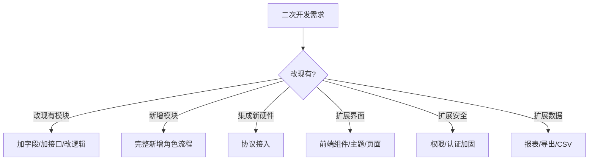
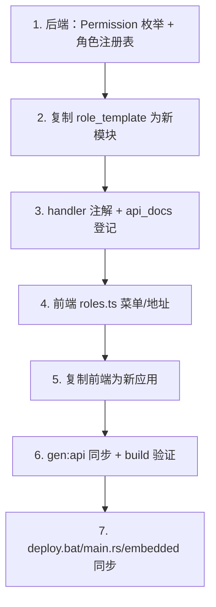
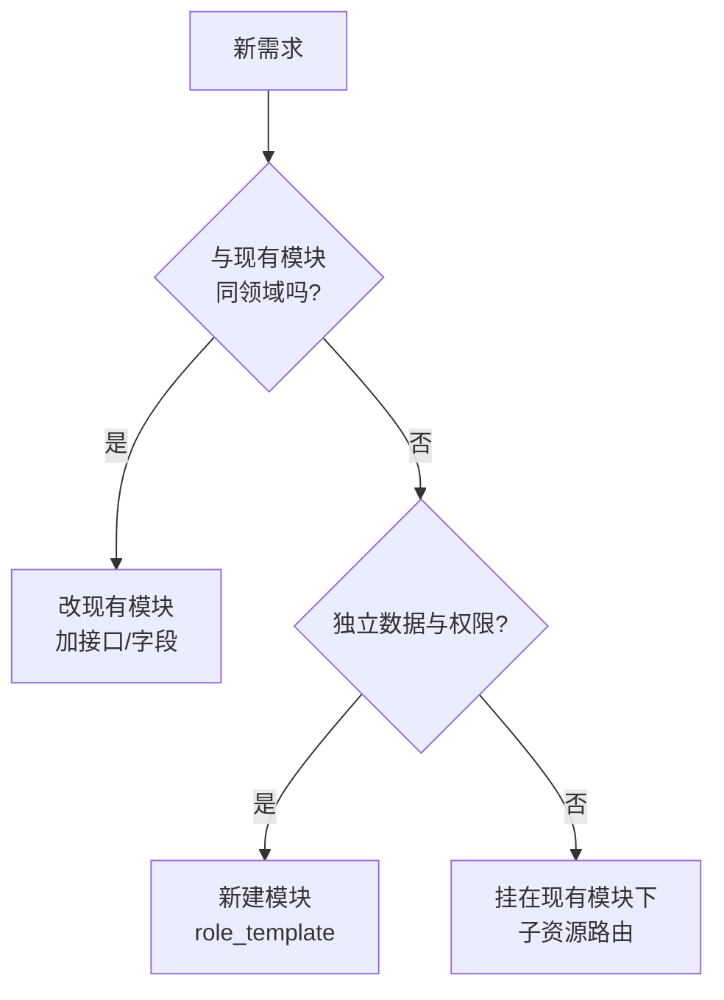
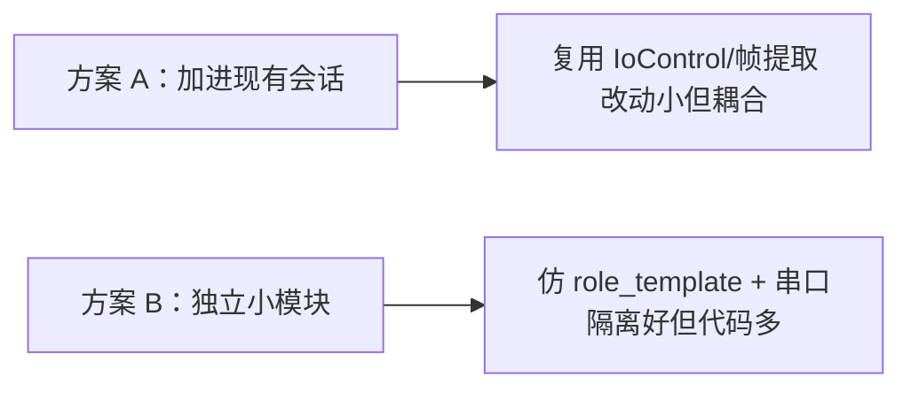

# 08 扩展与二次开发

> 终章：把系统"长出新的能力"。本章是 AGENTS.md「新增角色流程」的展开教学，从新增角色/模块/应用，到协议接入、报表扩展、安全加固，一次讲透。

## 8.1 二次开发全景图



**四个扩展维度**：功能（新模块）、设备（新协议）、界面（前端）、安全/数据（横切）。

---

## 8.2 新增角色完整流程（核心方法论）

### 8.2.1 流程总览（7 步）



### 8.2.2 第 1 步：后端权限与注册表

```rust
// src/common/models.rs —— 加权限
#[derive(Clone, Copy, Debug, PartialEq, Eq, Serialize, Deserialize, ToSchema)]
pub enum Permission {
    SystemAdmin,
    UsersRead, UsersWrite, UsersDelete,
    Fj200cInformationMonitor,
    Fj200cMainMonitor,
    Fw100Monitor, Fw150Monitor,
    Ftj1cMonitor,
    City3dView,
    XxxMonitor,          // ← 新增
}
```

```rust
// src/roles.rs —— 注册角色
pub const ROLE_REGISTRY: &[RoleDef] = &[
    RoleDef { key: "admin", name: "系统管理员", permissions: &[Permission::SystemAdmin, Permission::UsersRead, ...] },
    // ... 现有角色
    RoleDef { key: "xxx", name: "新模块", permissions: &[Permission::XxxMonitor] },  // ← 新增
];
```

**前端自动获得**：`/api/meta/roles` 返回新角色 → admin 界面下拉可选 → 登录权限自动生效。

### 8.2.3 第 2 步：复制 role_template

```powershell
# src/role_template/ 自带说明文档，模板包含：
# mod.rs / routes.rs / handlers.rs / services.rs / models.rs / config.rs
Copy-Item src\role_template src\xxx -Recurse
# 全局替换 template → xxx
```

**role_template 的设计**：占位权限 `TemplateMonitor` + 示例 CRUD + `#![allow(dead_code)]`（未启用时不警告）。照着填就是完整模块。

### 8.2.4 第 3 步：注解与登记

```rust
// src/xxx/handlers.rs
#[utoipa::path(
    get,
    path = "/api/xxx/items",
    tag = "xxx",
    operation_id = "xxxItemsList",
    responses((status = 200, description = "成功", body = Vec<XxxItem>))
)]
pub async fn list_items(...) -> ... { ... }

// src/api_docs.rs
paths(xxx_list_items, ...),
components(schemas(XxxItem, ...)),
tags((name = "xxx", description = "...")),
```

### 8.2.5 第 4 步：前端 roles.ts

```ts
// packages/shared/src/roles.ts
export const MENU_CONFIG: MenuItem[] = [
  // ...
  { key: 'xxx', label: '新模块', icon: 'Monitor', appPath: '/xxx' },
]
export const ROLE_APP_URLS = { ..., xxx: '/xxx' }
```

### 8.2.6 第 5 步：复制前端

```powershell
# 复制最相似的应用（如 fw100 做 CRUD、fj200c_information 做监控）
Copy-Item frontend\fw100 frontend\xxx -Recurse
# 全局替换 fw100 → xxx
```

| 文件 | 改动 |
|---|---|
| vite.config.ts | 端口（517x 未占用）、base /xxx/ |
| package.json | name |
| index.html | title |
| api/index.ts | facade 方法 |
| router/index.ts | 路由 + meta.permissions |
| stores/auth.ts | createAuthStore 参数 |
| views/* | 业务页面 |

### 8.2.7 第 6~7 步：同步与部署

```powershell
npm run gen:api       # 生成 generated/api/xxx.ts
npm run build         # 各前端验证
# deploy.bat 加 xxx 构建步骤
# main.rs 静态托管（dev 模式）
# embedded_assets.rs 加嵌入结构体 + 路由
```

### 8.2.8 新增角色流程要点总结

| 步骤 | 容易漏的点 |
|---|---|
| 1 | 权限枚举与注册表同步 |
| 3 | api_docs.rs 登记（防漂移测试会抓） |
| 4 | roles.ts 与后端注册表 key 一致 |
| 5 | 端口/base/workspaces 三处同步 |
| 7 | embedded_assets + main.rs + deploy.bat 三处同步 |

---

## 8.3 后端新模块开发模板（role_template 详解）

### 8.3.1 模板文件结构

```
src/role_template/
├── mod.rs          # 模块入口 + 事件枚举 + Tx
├── routes.rs       # 路由注册
├── handlers.rs     # handler（含 utoipa 注解）
├── services.rs     # 业务逻辑
├── models.rs       # DTO
└── config.rs       # 配置
```

### 8.3.2 模块入口（mod.rs 模式）

```rust
// src/xxx/mod.rs
pub mod routes;
pub mod handlers;
pub mod services;
pub mod models;
pub mod config;

// 事件枚举（WS 广播用）——监控类模块需要
#[derive(Clone, Debug)]
pub enum XxxEvent {
    DataUpdated(XxxData),
    StatusChanged(bool),
}

// 全局事件发送通道（OneShot 类型）
pub static TX: std::sync::OnceLock<mpsc::UnboundedSender<XxxEvent>> = std::sync::OnceLock::new();
```

### 8.3.3 路由注册（routes.rs）

```rust
// src/xxx/routes.rs
use axum::routing::{get, post};
use crate::common::middleware::permission_middleware;

pub fn router() -> Router<AppState> {
    Router::new()
        .route("/api/xxx/items", get(list_items).post(create_item))
        .route("/api/xxx/items/{id}", get(get_item).put(update_item).delete(delete_item))
        .layer(middleware::from_fn(permission_middleware::<Permission::XxxMonitor>))
}
```

### 8.3.4 handler 模板

```rust
pub async fn list_items(
    State(state): State<AppState>,
) -> Result<Json<ApiResponse<Vec<XxxItem>>>, AppError> {
    let items = services::list_items(&state.db).await?;
    Ok(Json(ApiResponse::success(items)))
}
```

### 8.3.5 service 模板

```rust
pub async fn list_items(db: &SqlitePool) -> Result<Vec<XxxItem>, AppError> {
    sqlx::query_as::<_, XxxItem>("SELECT * FROM xxx_items")
        .fetch_all(db)
        .await
        .map_err(|e| AppError::internal(format!("查询失败: {e}")))
}
```

### 8.3.6 建表位置（database.rs）

```rust
// src/database.rs —— 加建表语句（新表在启动时自动创建）
sqlx::query(
    "CREATE TABLE IF NOT EXISTS xxx_items (
        id INTEGER PRIMARY KEY AUTOINCREMENT,
        name TEXT NOT NULL,
        created_at TEXT NOT NULL DEFAULT (datetime('now'))
    )"
).execute(&pool).await?;
```

**项目约定**：没有迁移文件，建表全在 database.rs——新表加这里即可（注意幂等：CREATE IF NOT EXISTS）。

---

## 8.4 修改现有模块（最高频操作）

### 8.4.1 加字段（全链路清单）

```text
后端：
1. models.rs 结构体加字段（ToSchema）
2. database.rs 建表语句加列（若新列）
3. service 的 SQL 加列
4. handler 注解无需改（schema 自动含新字段）

前端：
5. npm run gen:api
6. 表单/表格/详情按报错补字段
7. npm run build 验证
```

### 8.4.2 加接口

```text
1. handler 写新函数 + utoipa 注解
2. api_docs.rs paths 登记
3. routes.rs 注册路由
4. gen:api → facade 加方法 → 页面调用
```

### 8.4.3 改逻辑（如改 CSV 列）

```text
1. 找到对应后端逻辑（CSV 写入在 service/session）
2. 修改列定义与写入
3. 前端 Data 页若展示列 → 同步
4. 注意旧 CSV 文件格式兼容（或接受格式变化）
```

### 8.4.4 改前端行为

```text
1. 视图层：直接改模板/script
2. 业务逻辑：composable
3. 公共：shared（注意影响全部应用）
```

---

## 8.5 新硬件协议接入（串口/UDP）

### 8.5.1 协议接入的通用模式


**四个可替换点**：
1. **数据源**（IoControl trait）：串口/模拟/UDP——换硬件只换实现。
2. **帧提取**（frame_extractor）：从字节流切帧。
3. **解码**（decode.rs）：帧 → 结构化字段。
4. **广播**：事件 → WS。

### 8.5.2 接入新协议的步骤

```text
1. 定义帧格式（长度/校验/字段布局）
2. 写提取器（若帧结构不同）
3. 写解码器（字段 → struct）
4. 用 IoControl trait 实现数据源
5. 接入 service 的会话循环
6. 前端 types.ts 加字段 + 展示
```

### 8.5.3 模拟源的价值

```text
开发期没有硬件 → 用 Mock 实现（模拟帧生成器）
→ 前后端联调不依赖硬件
→ 现场部署前先用模拟验证全链路
```

**这是 fj200c_information/fj200c_main/ftj1c 三个监控应用的标准做法**（Mock 开关在各自 ini）。

---

## 8.6 前端组件与主题扩展

### 8.6.1 新增共享组件

```text
1. packages/shared/src/template/ 建组件
2. index.ts 导出
3. 各应用直接 import 使用
```

### 8.6.2 新增主题（fj200c_main 模式）

```text
1. styles/themes.css 加 .theme-xxx 变量组
2. theme 类型加 'xxx'
3. 后端 set_theme 校验类型（GlobalVar）
4. 切换按钮/设置页加选项
```

### 8.6.3 新增页面/路由

```text
1. views/ 建页面
2. router 加路由 + meta.permissions
3. MENU_CONFIG 加入口（可选）
4. build 验证
```

---

## 8.7 报表与导出扩展

### 8.7.1 现有报表机制

```
后端生成 HTML（[REPORT] StatePoints 状态点）
→ 前端新窗口打开 → window.print 打印
```

### 8.7.2 扩展报表形态

| 形态 | 做法 |
|---|---|
| 新报表模板 | 后端 report.rs 加生成函数（HTML 拼装） |
| Excel 导出 | 后端生成 xlsx（需加库）或 CSV（现成） |
| PDF | 后端打印 HTML → PDF（需加库）或前端打印另存 |
| 图表报表 | 前端 ECharts 截图 + 组装（复杂，慎做） |

### 8.7.3 CSV 导出的通用化

```text
fw100 等台账应用想要 CSV 导出：
→ 前端把 items 拼 CSV + Blob 下载（10 行代码，无需后端）
→ 或后端加导出接口（大数据量时）
```

---

## 8.8 安全扩展

### 8.8.1 认证增强

| 增强 | 实现思路 |
|---|---|
| 登录失败锁定 | auth service 记录失败次数 |
| 验证码 | 前端生成 + 后端校验 |
| token 轮换 | 刷新 token 机制 |
| 密码策略 | 前端规则 + 后端校验（min 长度等） |

### 8.8.2 权限模型增强

| 增强 | 实现思路 |
|---|---|
| 资源级权限 | 权限枚举细分（如 `fw100.items.edit`） |
| 角色继承 | RoleDef 加 parent 引用 |
| 动态角色 | 用户自定义角色表（DB） |

### 8.8.3 数据安全

```
1. 敏感字段加密存储（sqlx + aes）
2. 日志脱敏（不记录密码/token）
3. 备份加密（压缩带密码）
```

---

## 8.9 常见扩展问答（FAQ）

**Q1：怎么加"数据导出 Excel"按钮？**
A：小数据 → 前端 CSV/Blob；大数据 → 后端接口流式输出；真 Excel 需加库（rust_xlsxwriter / xlsx）。

**Q2：能加"用户自定义仪表盘"吗？**
A：可以——前端存布局配置（localStorage 或后端 global_vars），后端只加一个"用户布局"字段。

**Q3：多语言（i18n）怎么做？**
A：项目无 i18n。方案：vue-i18n + 文案抽取 + 语言切换 store；工作量中等。

**Q4：历史数据回放/趋势分析？**
A：CSV 已有历史——解析 CSV 渲染曲线（前端读文件或后端接口分页返回）。

**Q5：告警通知（邮件/钉钉）？**
A：后端事件监听 → 发通知（reqwest 调 webhook/邮件库）。在 event 广播处加一个监听器即可。

**Q6：移动端适配？**
A：现有响应式支持基础适配；深度适配需改布局（弹性 + 触控优化）。

**Q7：多后端实例/负载均衡？**
A：SQLite 单文件不适合多实例写并发——需要换 PostgreSQL + 实例间 WS 互斥（架构级改动，不推荐）。

**Q8：docker 化？**
A：可行——Rust 编译产物 + 前端内嵌已是单二进制，Dockerfile 只需基础镜像 + 复制 exe + 挂载数据目录。

---

## 8.10 扩展开发最佳实践

### 8.10.1 扩展项目 Checklist

```
[ ] 先读相关模块现有代码（模仿最小实现）
[ ] 后端：Permission → 注册表 → 模块 → 路由 → 注解 → 登记
[ ] 前端：facade → 页面 → 路由 → 菜单
[ ] gen:api + build 全链路验证
[ ] deploy.bat / embedded 同步（影响部署才需要）
[ ] 更新 AGENTS.md（如新增角色/应用）
```

### 8.10.2 渐进式开发策略

```text
1. 先跑通最小闭环（模拟源 → 后端 → 前端显示）
2. 再加细节（校验/错误处理/边界）
3. 最后加打磨（样式/提示/日志）
```

### 8.10.3 向后兼容原则

```text
- 加字段用 Option（旧数据不破坏）
- 新接口不删旧接口（过渡期并存）
- CSV 格式变更前评估存量文件
- 配置新增节默认值（configparser 读缺省）
```

---

## 8.11 扩展中的常见决策问题（架构判断力）

### 8.11.1 该新建模块还是改现有模块？



**判断标准**：数据表独立 + 权限独立 + 页面独立 → 新模块；否则扩展现有。

### 8.11.2 数据存哪（DB vs 文件 vs 内存）

| 数据类型 | 存储 | 理由 |
|---|---|---|
| 业务台账 | SQLite 表 | 结构化查询 |
| 实时帧流 | 内存（广播） | 无需持久化 |
| 采样历史 | CSV 文件 | 文件型数据流 |
| 主题/设置 | global_vars 表 | 键值 |
| 大文件（报表） | 文件系统 | 不塞数据库 |

### 8.11.3 配置放 ini 还是数据库

```
ini（config-*.ini）：硬件/协议/运行参数（文本可读、随部署携带）
DB（global_vars）：业务设置（主题等）
前端配置：localStorage（非敏感、跟随浏览器）
```

**原则**：运维要改的放 ini，业务要改的放 DB。

### 8.11.4 新接口怎么设计（REST 惯例）

```
GET    /api/<module>/<resource>           # 列表
POST   /api/<module>/<resource>           # 创建
GET    /api/<module>/<resource>/{id}      # 详情
PUT    /api/<module>/<resource>/{id}      # 更新
DELETE /api/<module>/<resource>/{id}      # 删除
GET    /api/<module>/<resource>/stats     # 统计（约定）
```

**命名惯例**：operation_id = 模块名 + 动作（驼峰），tag = 模块名——保持与现有模块一致。

---

## 8.12 扩展中的常见坑（血泪清单）

| 坑 | 后果 | 预防 |
|---|---|---|
| 只改后端忘了 gen:api | 前端类型错乱 | 改 DTO 必跑 |
| 新表忘了 database.rs 建表 | 接口 500 | 建表统一入口 |
| 权限枚举改了注册表没改 | 角色权限空 | 两处同步 |
| 路由没挂 routes.rs | 404 | 挂完测一遍 |
| embedded 没加新应用 | 生产 404 | deploy 前全应用验证 |
| 端口撞了 | dev 起不来 | 端口表先查 |
| workspace 没加新前端 | 依赖不装 | npm install 在根目录跑 |
| 改 shared 影响 7 应用 | 回归风险 | 改动前确认影响面 |
| WS 事件结构变了 types.ts 没同步 | 前端解不了包 | 同步手改 |
| 旧数据不兼容新字段 | 页面报错 | 可空字段 + 兜底显示 |

**十条坑覆盖了二次开发 90% 的返工原因**——开工前默念一遍。

---

## 8.13 扩展之后的验证清单（回归测试）

### 功能回归

```
[ ] 7 个应用都能登录
[ ] 监控类：启动服务 → 数据流动 → 停止服务
[ ] 管理类：增删改查正常
[ ] 权限：错误角色被拒（403）
[ ] 配置：修改后按生效时机生效
```

### 契约回归

```
[ ] npm run gen:api 无报错
[ ] 全前端 npm run build 通过
[ ] git diff generated/ 只有预期变化
```

### 部署回归

```
[ ] deploy.bat 全流程成功
[ ] 生产访问 7 个入口
[ ] 数据库自动生成/保留
[ ] 深链接刷新正常（SPA 回退）
```

**每次扩展后跑一遍回归**——本项目无自动化测试，回归靠清单。

---

## 8.14 深入：扩展前的设计问题清单

动手前先回答这 10 个问题，能省一半返工：

| # | 问题 | 答案来源 |
|---|---|---|
| 1 | 数据存哪？（SQLite/CSV/内存） | 03 章 CSV vs SQLite 对比 |
| 2 | 谁访问？（前端直接调/经后端） | 05 章数据流 |
| 3 | 权限点要不要加？ | roles.rs 注册表 |
| 4 | 实时还是轮询？ | WS vs HTTP 选择 |
| 5 | 需要热更新配置吗？ | config.rs 模式 |
| 6 | 前端放哪个应用？ | 7 应用职责表 |
| 7 | 契约怎么加？ | 06 章全链路 |
| 8 | 部署有影响吗？ | deploy.bat 流程 |
| 9 | 数据量增长怎么办？ | CSV 限长策略 |
| 10 | 需要测试吗？ | cargo test 惯例 |

**核心原则：先画数据流图，再写代码。**

## 8.15 深入：扩展的最佳实践十条

1. **模仿优先**：新代码尽量复制现有模块结构（role_template 的存在意义）。
2. **小步提交**：后端、gen:api、前端分步验证，别一把梭。
3. **契约先行**：先定 DTO/接口，再写前后端（避免返工）。
4. **错误处理统一**：一律返回 AppError，别自定义格式。
5. **日志完整**：每个新接口至少一条 info 日志。
6. **配置可调**：新参数进 ini 而不是硬编码。
7. **前端复用**：UI 组件先查 shared 有没有。
8. **不破坏契约**：加字段用 Optional，别删字段。
9. **性能留退路**：实时数据先节流，别让前端刷屏。
10. **文档同步**：改完更新本套文档与 AGENTS.md。

## 8.16 深入：常见坑的完整清单（扩展时对照）

| 坑 | 现象 | 预防 |
|---|---|---|
| 端口冲突 | 新应用起不来 | strictPort + 查表 |
| 路由忘挂 | 404 | routes.rs 检查 |
| 权限忘加 | 403 | permission_middleware |
| 契约没同步 | TS 报错 | gen:api 必跑 |
| base 错 | 白屏 | vite.config 核对 |
| WS 不转发 | 连不上 | proxy ws:true |
| 依赖重复安装 | pinia 双实例 | 只在根 npm install |
| CSV 路径 | 找不到文件 | 相对运行目录 |
| 时间格式 | 前端显示 NaN | serde 时间序列化检查 |
| 中文乱码 | 控制台/Excel | UTF-8 统一 |

## 8.17 深入：回归验证清单（扩展后必过）

```text
1. cargo check 通过
2. cargo test 通过（含 openapi 导出）
3. npm run gen:api 无 diff 或不意外
4. 受影响前端 npm run build 通过
5. 手动验证：
   - 登录 → 权限正常
   - 新增模块增删改查正常
   - WS 实时推送正常
   - 配置热更新（如涉及）正常
6. 部署演练：deploy.bat 完整跑一遍
```

**达标 → 扩展才可提交。**

## 8.18 深入：给新模块的代码结构建议

```
src/xxx/
├── mod.rs          # 模块入口 + 全局状态
├── handlers.rs     # 薄 handler
├── services.rs     # 业务逻辑
├── models.rs       # DTO（ToSchema）
├── config.rs       # ini 配置
├── com.rs          # 串口/通信（如有）
└── mock.rs         # 模拟数据源（如有）
```

**与 role_template 一致**——复制模板改名字即可。

## 8.19 深入：与团队协作的文档化约定

1. 新增接口 → 在 00 章 API 一览表补一行。
2. 新增角色 → AGENTS.md 角色表同步。
3. 新增应用 → AGENTS.md 端口表 + deploy.bat。
4. 契约变更 → 06 章流程执行 + 提交生成文件。
5. 代码路径引用 → 标注 `文件:行号`。

**文档是活文档**：改代码必须改文档（本套约定）。

---

## 8.20 扩展实战：完整案例一（新增"报警管理"模块）

> 把 8.2 的 7 步流程完整走一遍，读者可照抄。

### 需求

系统增加"报警管理"模块：设备报警记录 + 确认处理 + 统计。新角色 `alarm`。

### 步骤 1：权限与角色

```rust
// src/common/models.rs
pub enum Permission {
    // ...
    AlarmMonitor,     // 新增：报警监控权限
}

// src/roles.rs
RoleDef { key: "alarm", name: "报警管理", permissions: &[Permission::AlarmMonitor] },
// admin 角色也加上 AlarmMonitor（可选）
```

### 步骤 2：新模块目录

```powershell
Copy-Item src\role_template src\alarm -Recurse
# 替换 template → alarm
```

### 步骤 3：models.rs

```rust
// src/alarm/models.rs
#[derive(ToSchema, FromRow, Serialize, Deserialize)]
pub struct AlarmItem {
    pub id: i64,
    pub source: String,        // 来源（fj200c_information 等）
    pub level: String,         // info / warning / error
    pub message: String,
    pub confirmed: bool,       // 是否已确认
    pub occurred_at: String,
}

#[derive(ToSchema, Deserialize)]
pub struct CreateAlarmRequest {
    pub source: String,
    pub level: String,
    pub message: String,
}
```

### 步骤 4：database.rs 建表

```rust
sqlx::query(
    "CREATE TABLE IF NOT EXISTS alarm_items (
        id INTEGER PRIMARY KEY AUTOINCREMENT,
        source TEXT NOT NULL,
        level TEXT NOT NULL,
        message TEXT NOT NULL,
        confirmed INTEGER NOT NULL DEFAULT 0,
        occurred_at TEXT NOT NULL DEFAULT (datetime('now'))
    )"
).execute(&pool).await?;
```

### 步骤 5：handlers + routes + 登记

```rust
// handlers.rs：list / create / confirm 三个接口 + utoipa 注解
// routes.rs：/api/alarm/items 挂载 + permission_middleware::<Permission::AlarmMonitor>
// api_docs.rs：paths(alarm_list, alarm_create, alarm_confirm) + schemas(AlarmItem, CreateAlarmRequest) + tag
```

### 步骤 6：前端

```powershell
Copy-Item frontend\fw100 frontend\alarm -Recurse
# 替换 fw100 → alarm，端口 5180，base /alarm/
```

```ts
// api facade + 页面（表格 + 确认按钮 + 统计卡片）
```

### 步骤 7：gen:api + build + 部署同步

```powershell
npm run gen:api
npm run build
# deploy.bat APP_LIST 加 alarm
# main.rs 静态托管加 /alarm
# embedded_assets.rs 加结构体
```

**完整闭环完成**——从权限到部署，这就是 8.2 方法论的一次真实执行。

---

## 8.21 扩展实战：完整案例二（接入新串口协议）

### 需求

fj200c_information 增加一路"温度巡检仪"串口（COM7，Modbus-RTU 协议）。

### 方案选型



**推荐方案 A**（复用现有框架）：数据源加一个 Connection，帧格式走 frame_extractor，解码器加 Modbus 分支。

### 实施步骤

```text
1. config-fj200c_information.ini 加 [Connection7] 段（Port=COM7, BaudRate=9600...）
2. com.rs 检查该连接是否存在（配置驱动）
3. decode.rs 根据帧类型识别 Modbus 帧 → 解出温度字段
4. 前端 types.ts 加 temperature 字段 → 表格/曲线加列
5. 模拟模式同步支持（mock 生成 Modbus 帧）——开发期无硬件也能联调
```

**核心心得**：协议接入的关键不是"读串口"（框架已有），而是**帧格式解析**（新协议的解码逻辑）。

---

## 8.22 扩展实战：完整案例三（给台账加 Excel 导出）

### 需求

fw100 列表页加"导出 Excel"。

### 方案对比

| 方案 | 优点 | 缺点 |
|---|---|---|
| 前端 CSV | 零后端改动 | 中文 Excel 需处理编码 |
| 后端 CSV | 大列表也不卡 | 加接口 |
| 后端 xlsx 库 | 真 Excel | 引入 rust_xlsxwriter 依赖 |

### 推荐：后端 CSV + BOM（通用做法）

```rust
// 后端：导出接口（与现有 CSV 下载同模式）
#[utoipa::path(
    get,
    path = "/api/fw100/export",
    tag = "fw100",
    operation_id = "fw100Export",
    responses((status = 200, description = "成功", body = String))
)]
pub async fn export_items(...) -> Result<Response, AppError> {
    // 查全部 → 拼 CSV 字符串（加 UTF-8 BOM 保证 Excel 中文正常）
    // 返回 text/csv; charset=utf-8 响应头 + Content-Disposition: attachment
}
```

```ts
// 前端（复用 5.41 的 Blob 下载模式）
export const fw100Api = {
  // ...
  exportItems: async () => {
    const res = await generated.fw100Export()
    downloadBlob(res as Blob, '台账导出.csv')
  },
}
```

**扩展思路**：任何"导出"需求都能用这个模板（CSV 先行，Excel 库按需升级）。

---

## 8.23 扩展实战：完整案例四（告警通知到钉钉）

### 需求

报警发生时推送钉钉群消息。

### 实现思路（零侵入）

```rust
// 在报警创建 service 里加一个"旁路通知"（不阻塞主流程）
// src/alarm/services.rs
pub async fn create_alarm(db: &SqlitePool, req: CreateAlarmRequest) -> Result<AlarmItem, AppError> {
    let alarm = sqlx::query_as(...).bind(...).fetch_one(db).await?;

    // 旁路：异步发钉钉（失败不影响主流程）
    if alarm.level == "error" {
        tokio::spawn(async move {
            let client = reqwest::Client::new();
            let _ = client.post(env::var("DINGTALK_WEBHOOK").unwrap_or_default())
                .json(&serde_json::json!({ "text": { "content": format!("【报警】{}: {}", alarm.source, alarm.message) } }))
                .send().await;
        });
    }
    Ok(alarm)
}
```

**设计要点**：`tokio::spawn` 异步 + 结果忽略（`let _ =`）——**通知失败绝不回滚报警**。

### 配置化

```ini
# .env
DINGTALK_WEBHOOK=https://oapi.dingtalk.com/robot/send?access_token=xxx
```

**扩展思路**：通知渠道（钉钉/邮件/短信）都可做成 trait——`Notifier` trait + 多实现，在报警处注入。

---

## 8.24 扩展实战：完整案例五（历史数据回放页）

### 需求（承接 05 章 5.56 的脑内规划，这里给出落地）

```text
页面：/playback（fj200c_information）
功能：选 CSV 文件 → 1 秒/帧回放表格
```

### 数据源：后端加"读 CSV"接口

```rust
#[utoipa::path(
    get,
    path = "/api/fj200c_information/csv/content",
    tag = "fj200c_information",
    operation_id = "fj200cInformationCsvContent",
    params(("name" = String, Query, description = "CSV 文件名")),
    responses((status = 200, description = "成功", body = Vec<TableRow>))
)]
pub async fn csv_content(Query(name): Query<String>, ...) -> Result<Json<ApiResponse<Vec<TableRow>>>, AppError> {
    let rows = services::parse_csv(&name).await?;   // 读文件 + 逐行解析成 TableRow
    Ok(Json(ApiResponse::success(rows)))
}
```

### 前端回放

```ts
// usePlayback.ts（05 章练习的正式版）
export function usePlayback(rows: Ref<TableRow[]>, intervalMs = 1000) {
  const playing = ref(false)
  const index = ref(0)
  let timer: number | null = null

  const play = () => {
    if (playing.value || rows.value.length === 0) return
    playing.value = true
    timer = window.setInterval(() => {
      index.value++
      if (index.value >= rows.value.length) stop()
    }, intervalMs)
  }
  const pause = () => { playing.value = false; if (timer) clearInterval(timer) }
  const stop = () => { pause(); index.value = 0 }
  const current = computed(() => rows.value[index.value])

  onUnmounted(pause)
  return { playing, index, current, play, pause, stop }
}
```

### 页面组装

```vue
<template>
  <div>
    <el-select v-model="selectedCsv" @change="loadContent">
      <el-option v-for="f in csvFiles" :key="f" :value="f" :label="f" />
    </el-select>
    <el-button-group>
      <el-button @click="playback.play()">播放</el-button>
      <el-button @click="playback.pause()">暂停</el-button>
      <el-button @click="playback.stop()">停止</el-button>
    </el-button-group>
    <el-table :data="playback.current ? [playback.current] : []" />
  </div>
</template>
```

**这个案例把全书知识全用上了**：后端接口 + 类型同步 + composable + 组件组装。

---

## 8.25 扩展思路库（灵感清单）

| 方向 | 点子 | 难度 |
|---|---|---|
| 数据 | 仪表盘（ECharts 多图组合） | 中 |
| 数据 | CSV 趋势分析（选时间范围出曲线） | 中 |
| 集成 | 设备状态自动巡检脚本 | 低 |
| 集成 | 数据上传到上级系统（HTTP 上报） | 中 |
| 界面 | 监控大屏（fj200c_main ScaledPage 复用） | 中 |
| 界面 | 暗色模式统一（7 应用一键切） | 低 |
| 功能 | 用户操作审计日志（表 + 列表页） | 中 |
| 功能 | 多用户角色自定义（动态角色表） | 高 |
| 运维 | 前端版本号显示 + 更新检查 | 低 |
| 运维 | 数据保留策略（自动清理） | 低 |

**挑选标准**：优先"低难度 + 高频需求"，从简单开始积累信心。

---

## 8.26 扩展实战：完整案例六（审计日志模块）

### 需求

记录所有用户的管理操作（谁、何时、做了什么），供追溯。

### 实现思路

**方案 A：中间件全局记录**（推荐）

```rust
// src/common/middleware.rs 或新模块
// 对 /api/admin/* 与 /api/*/items 的写操作自动记录
async fn audit_middleware<B>(
    State(state): State<AppState>,
    req: Request<B>,
    next: Next<B>,
) -> Result<Response, AppError> {
    let method = req.method().to_string();
    let path = req.uri().path().to_string();

    let res = next.run(req).await;

    // 只记录写操作 + 成功
    if matches!(method.as_str(), "POST" | "PUT" | "DELETE") {
        let user = get_current_user().await;   // 从 token 解析
        sqlx::query("INSERT INTO audit_logs (username, method, path, created_at) VALUES (?,?,?,datetime('now'))")
            .bind(user).bind(method).bind(path)
            .execute(&state.db).await?;
    }
    Ok(res)
}
```

**方案 B：各 service 手动记录**——侵入性强，不推荐。

### 效果

```
admin 界面或新前端页面展示 audit_logs 表
→ 追溯：谁删了台账、谁改了角色
```

**扩展要点**：横切关注点（审计/日志/限流）用中间件最优雅——一处实现，全部接口生效。

---

## 8.27 扩展实战：完整案例七（CSV 趋势分析页）

### 需求

fj200c_information 数据页支持选择 CSV 文件 → 显示参数随时间变化的曲线。

### 实现

```text
1. 后端：csv/content 接口（8.24 案例五已有）返回 TableRow[]
2. 前端：TrendAnalysis.vue
   - el-select 选文件 → 拉数据
   - ECharts 折线：x 轴时间戳，y 轴所选参数
   - 参数选择 el-select（28 字段里挑）
3. 复用 Visual.vue 的图表组件（props 化）
```

```ts
// 图表数据组装（示意）
const chartData = computed(() => {
  const key = selectedParam.value
  return rows.value.map((r, i) => [i, Number((r as any)[key])])
})
watch(chartData, (data) => {
  chart.value?.setOption({ xAxis: { type: 'value' }, series: [{ type: 'line', data }] })
})
```

**价值**：把历史 CSV 变成可视化——"数据资产"立刻可读。

---

## 8.28 扩展实战：完整案例八（暗色模式一键统一切换）

### 需求

7 个应用统一提供暗色模式切换，且偏好持久化。

### 实现

```ts
// shared 加一个 useTheme composable（一次实现，7 应用共享）
// packages/shared/src/composables/useTheme.ts
export function useTheme() {
  const theme = ref<'light' | 'dark'>(localStorage.getItem('theme') ?? 'light')

  const apply = () => {
    document.documentElement.classList.toggle('dark', theme.value === 'dark')
    localStorage.setItem('theme', theme.value)
  }
  const toggle = () => { theme.value = theme.value === 'light' ? 'dark' : 'light'; apply() }

  onMounted(apply)
  return { theme, toggle }
}
```

```vue
<!-- AppNavbar 加切换按钮（shared 组件，一处修改全部生效） -->
<el-switch v-model="theme" @change="toggle" active-text="暗色" inactive-text="亮色" />
```

**要点**：Element Plus 已支持 html.dark（dark/css-vars.css 已全局引入）——只需要切 class + 持久化。

---

## 8.29 扩展实战：完整案例九（多语言 i18n 方案要点）

### 需求

界面支持中/英文切换（如外事演示）。

### 方案要点（不落地，给思路）

```text
1. 引入 vue-i18n（workspace 根装）
2. shared 建 locales/zh.ts、en.ts（文案映射表）
3. 各应用 main.ts 挂载 i18n
4. 页面文案 {{ t('common.save') }} 替换硬编码
5. 切换按钮 + localStorage 持久化
6. Element Plus 自带 locale 切换（zh-cn/en）
```

**工作量评估**：文案抽取是体力活（各应用数百条），建议先做 admin + fw100 试点。

---

## 8.30 扩展路线图（按优先级排序）


**建议**：P0 先做（低难度高价值），P1~P3 按业务需求排期。

---

## 8.31 结语：从读者到开发者

### 8.31.1 你现在能做什么

```
✅ 看懂：项目所有代码（借助索引定位）
✅ 修改：字段/页面/菜单/配置/逻辑
✅ 扩展：新增模块/角色/应用/协议
✅ 运维：部署/备份/排障/安全加固
✅ 传承：向同事讲解架构（mermaid 图即讲稿）
```

### 8.31.2 建议的学习闭环

```text
1. 按 00 章阅读路线通读一遍（理解）
2. 按各章自测题自检（记忆）
3. 按动手任务实操（应用）
4. 按 08 章完成一次完整新增模块（创造）
```

### 8.31.3 使用文档的姿势

```
遇到不懂 → 00 章索引 → 定位章节 → 精读
改代码前 → 查对应模块章节 → 模仿现有实现
故障时 → 07 章排查表 → 按流程定位
```

### 8.31.4 最后的话

这套系统不复杂：**一个 Rust 后端 + 七个 Vue 前端 + 一套类型契约**。你已经走完从"项目是什么"到"怎么改它"的全部路程。剩下的就是——动手。

祝编码愉快。

---

## 8.32 全教程最终自测（跨章综合）

1. 说出系统架构一句话版本。
2. 后端认证完整链路（登录 → JWT → 中间件 → 权限）。
3. 前端一个监控页的完整数据流（守卫 → composable → WS → 渲染）。
4. 改一个字段的完整链路（Rust → gen:api → 前端）。
5. 部署一个版本的完整流程。
6. 新增一个角色需要动哪些文件（能背出 7 步）。
7. 排查"页面白屏"的步骤。
8. 解释 WS 事件为何手写类型。
9. 说出 7 个应用的端口与职责。
10. 用一张 mermaid 图讲清系统（默画）。
11. 扩展的四个维度是什么？（功能/设备/界面/安全数据）
12. 新增角色的七步流程分别是什么？
13. 横切关注点（审计/限流）用什么实现？（中间件）
14. 暗色模式一键切换的核心机制？（html.dark class + 持久化）
15. i18n 改造的主要工作量在哪？（文案抽取）

**能答出全部 → 毕业。**

---

## 8.33 扩展补充：综合实战——给 fw100 加"告警阈值"功能（端到端演练）

### 8.33.1 需求

fw100 设备台账支持设置告警阈值（如温度上限），超限时前端提示。

### 8.33.2 后端改动

```rust
// src/fw100/models.rs
pub struct Item {
    // ... 原有字段
    pub alarm_threshold: Option<f64>,   // 新增阈值
}

// src/fw100/services.rs
// 新增：查询超限设备
pub async fn find_alarming(db: &SqlitePool) -> Result<Vec<Item>, AppError> {
    sqlx::query_as::<_, Item>(
        "SELECT * FROM items WHERE latest_value > alarm_threshold"
    ).fetch_all(db).await
}
```

### 8.33.3 gen:api 同步

```powershell
npm run gen:api
```

### 8.33.4 前端改动

```vue
<script setup lang="ts">
// 页面定时检查（30 秒轮询）
const alarming = ref<Item[]>([])
const check = async () => { alarming.value = await fw100Api.findAlarming() }
onMounted(() => { check(); setInterval(check, 30000) })
</script>
<template>
  <el-alert v-if="alarming.length" type="warning" title="存在超限设备" />
</template>
```

### 8.33.5 完成清单

```
1. 后端：字段 + service + handler + utoipa 注解
2. gen:api：类型同步
3. 前端：页面展示 + 轮询
4. 验证：build + 手动测试
```

**这就是一次完整的小型扩展**——流程与案例一~九完全一致，只是规模更小。

## 8.34 扩展补充：性能与扩展性的预判

### 8.34.1 什么时候需要关注性能

```
1. 数据量 > 10 万行
2. 并发 > 10 个客户端
3. 帧率 > 100 Hz
4. 页面首屏 > 3 秒
```

### 8.34.2 性能优化的优先级

```text
① SQL 索引（最便宜、收益最大）
② 前端节流/限长（监控数据）
③ 缓存（热点配置）
④ 分布式（最后手段，成本最高）
```

### 8.34.3 千万避免

```
❌ 过早优化（还没瓶颈就重构）
❌ 盲目上缓存（一致性风险）
❌ 分布式化（运维复杂度飙升）
```

**原则**：先用配置和代码优化，实在不够才动架构。

## 8.35 扩展补充：与外部系统对接的注意事项

### 8.35.1 对接前必问

```
1. 对方协议是什么？（HTTP/WS/文件/数据库）
2. 数据格式？（JSON/XML/CSV）
3. 鉴权方式？（Token/证书/无）
4. 数据方向？（我方主动推 / 对方来拉）
```

### 8.35.2 常见对接模式

| 模式 | 实现 | 项目例子 |
|---|---|---|
| HTTP 推送 | reqwest 客户端 | 数据上报 |
| HTTP 提供 | 新路由 | 对外接口 |
| 文件交换 | 定时扫描目录 | CSV 导入 |
| 消息队列 | 需要引入依赖 | 尚未使用 |

### 8.35.3 健壮性要求

```
1. 超时重试（指数退避）
2. 失败不阻塞主流程（旁路）
3. 记录失败日志 + 可重放
4. 先联调后上线（mock 对端）
```

## 8.36 扩展补充：08 章最终自测（追加 8 题）

1. 端到端演练的完整步骤？
2. 什么时候需要关注性能？
3. 性能优化的优先级？
4. 为什么别盲目分布式？
5. 对接前必问的四个问题？
6. 四种对接模式？
7. 对接的四个健壮性要求？
8. 旁路通知为什么用异步？

**答对 7+ → 08 章彻底通关。**

## 8.37 扩展补充：新增一个"巡检记录"完整模块（最小可行案例）

### 8.37.1 需求

fw100 增加巡检记录：设备 + 巡检人 + 结果 + 备注，支持增删改查。

### 8.37.2 后端五件套

```text
1. src/fw100/models.rs：InspectionRecord DTO（ToSchema）
2. src/fw100/services.rs：CRUD 函数（sqlx）
3. src/fw100/handlers.rs：5 个 handler + utoipa 注解
4. src/database.rs：CREATE TABLE inspection_records
5. src/routes.rs：挂 /api/fw100/inspection 路由组
```

### 8.37.3 表结构

```sql
CREATE TABLE inspection_records (
    id INTEGER PRIMARY KEY AUTOINCREMENT,
    item_id INTEGER NOT NULL,
    inspector TEXT NOT NULL,
    result TEXT NOT NULL,            -- pass / fail
    remark TEXT,
    created_at TEXT DEFAULT (datetime('now'))
);
```

### 8.37.4 gen:api + 前端

```powershell
npm run gen:api
```

```vue
<!-- 在 fw100 列表页加"巡检记录"Tab（复用表格+表单模板） -->
<el-tabs>
  <el-tab-pane label="台账">
  <el-tab-pane label="巡检记录">
    <!-- el-table + 新增/编辑 dialog -->
```

### 8.37.5 完成自检

```
1. cargo test 通过（openapi 无冲突）
2. gen:api 生成 inspection 相关函数
3. build 通过
4. 手动：新增/编辑/删除/列表正常
```

**这是最小的完整闭环**——学完这个，其他模块扩展同理。

## 8.38 扩展补充：多模块协作的扩展（联动类需求）

### 8.38.1 场景

```
巡检记录与告警联动：巡检 fail → 自动创建告警
```

### 8.38.2 实现方式

```
service 层调用（不跨 HTTP）：
create_inspection(db, req) → 若 fail → 调 alarm_service::create(db, ...)
→ 两个 service 在同一进程内，直接函数调用
```

### 8.38.3 注意点

```
1. 事务：两个写入用同一 tx（要么都成功）
2. 解耦：service 之间依赖通过参数传递（不 new 全局）
3. 可测试：注入 mock 依赖
```

## 8.39 扩展补充：08 章高频自测（8 题）

1. 后端五件套是什么？
2. 表结构设计要点？
3. 最小闭环的自检清单？
4. 跨模块调用为什么走 service？
5. 事务的作用？
6. 解耦的原则？
7. mock 依赖注入的意义？
8. 巡检 fail 联动告警的流程？

**答对 7+ → 08 章高频通过。**

## 8.40 扩展补充：部署新版本的完整流程（扩展后必知）

### 8.40.1 完整发布流程

```text
1. 代码完成（后端 + 前端 + 契约）
2. 全部测试通过（cargo test + build）
3. deploy.bat 一键构建（前端 7 个 + 后端 embedded）
4. 备份旧版 deploy/ 目录（含 rustweb.db）
5. 替换新 exe（保留 .env / ini / csv / db）
6. 重启服务
7. 验证：登录 + 核心功能冒烟
8. 回滚预案：保留旧 exe 随时可切回
```

### 8.40.2 发布检查清单

| 项 | 检查 |
|---|---|
| 前端 | 7 个 build 全过 |
| 契约 | gen:api 无意外 diff |
| 后端 | cargo build --release --features embedded 过 |
| 数据库 | 无迁移需求（有则提供迁移脚本） |
| 配置 | ini 有变化则说明 |
| 文档 | 接口/角色/配置变化已同步 |

### 8.40.3 回滚方案

```
1. 备份旧 exe（deploy_backup/）
2. 出问题 → 停服务 → 换回旧 exe → 启动
3. 数据库若被新版本改过 → 需先恢复备份
4. 永远保留最近两版备份
```

## 8.41 扩展补充：给 7 个应用加公共功能的思路

### 8.41.1 公共功能的三种层级

```
1. shared 组件/composable（所有应用直接 import）
2. 后端公共接口（所有前端调用）
3. 各自应用复制（不推荐，维护地狱）
```

### 8.41.2 实例：加"关于"页面

```
方案 A：shared 组件 AboutPage → 各应用路由加 /about
方案 B：每个应用各写一个（重复）
推荐 A：一处实现 7 处生效
```

### 8.41.3 判断标准

```
功能要被 ≥2 个应用用 → 放 shared
只被 1 个应用用 → 放应用内部
```

## 8.42 扩展补充：08 章综合自测（8 题）

1. 发布流程的 8 步？
2. 部署前备份什么？
3. 回滚方案？
4. 数据库被改过的回滚注意？
5. 公共功能的三种层级？
6. shared 组件的判断标准？
7. 为什么别复制粘贴公共功能？
8. 冒烟验证测什么？

**答对 7+ → 08 章综合通过。**

## 8.43 扩展补充：给模块加"历史数据回放"的完整实现（复盘案例五）

### 8.43.1 需求回顾

```
读取已记录 CSV → 按时间顺序回放数据（像看视频）
→ 用于事故分析/演示
```

### 8.43.2 后端设计

```text
1. GET /api/xxx/csv/list → 文件列表
2. GET /api/xxx/csv/content?file=xxx.csv → 全量数据（TableRow[]）
3. 前端回放：定时器逐行展示（不是服务端推送）
```

### 8.43.3 前端回放实现

```ts
const playing = ref(false)
const timer = ref<ReturnType<typeof setInterval> | null>(null)

const play = () => {
  playing.value = true
  timer.value = setInterval(() => {
    cursor.value++
    if (cursor.value >= rows.value.length) { pause(); return }
    displayRows.value = rows.value.slice(0, cursor.value + 1)
  }, 100)   // 每 100ms 前进一行
}

const pause = () => { playing.value = false; clearInterval(timer.value!) }
const reset = () => { cursor.value = 0; displayRows.value = [] }

onUnmounted(pause)   // 离开页面停止
```

### 8.43.4 回放的优化

```
1. 大数据文件：分页加载 + 滑动窗口
2. 速度控制：0.5x / 1x / 2x
3. 跳转：进度条拖动
4. 图表同步：回放点实时更新
```

## 8.44 扩展补充：多协议设备的统一抽象（复盘案例二）

### 8.44.1 问题

```
不同设备协议不同（帧头/校验/字段）
→ 前端调用要统一（都是"连接/读取/控制"）
```

### 8.44.2 后端抽象

```rust
trait DeviceProtocol {
    fn parse(&self, bytes: &[u8]) -> Option<DeviceData>;   // 解析
    fn build_command(&self, cmd: &DeviceCmd) -> Vec<u8>;   // 命令
}

struct ProtocolA;   // 协议 A 实现
struct ProtocolB;   // 协议 B 实现
```

### 8.44.3 前端如何面对多协议

```
后端把不同协议统一成 DeviceData（同一 DTO）
→ 前端无感知（类型统一）
→ 契约只加 DeviceData 一个类型
```

### 8.44.4 新增协议的成本

```
只写一个 impl DeviceProtocol（约 100 行）
→ 其余代码零改动
→ 这是抽象层的价值
```

## 8.45 扩展补充：08 章终局自测（8 题）

1. 回放的数据流（后端到前端）？
2. 回放定时器的清理时机？
3. 回放的四个优化点？
4. 多协议抽象的两个 trait？
5. 前端如何面对多协议？
6. 新增协议的成本？
7. 回放结束的边界处理？
8. 速度控制的实现？

**答对 7+ → 08 章终局通过。**

## 8.46 扩展补充：全链路示例——从需求到上线的完整复盘

### 8.46.1 需求

```
给 fj200c_information 加"参数超限声音告警"：
后端解析帧 → 判断超限 → 推送告警事件
前端收到 → 播放提示音 + 页面闪烁
```

### 8.46.2 后端改动

```rust
// 1. 解码后判断（services.rs 或专门 check_alarm）
if row.ng_speed > config.max_speed {
    // 2. 广播告警事件（WS）
    tx.send(json!({
        "type": "alarm",
        "data": { "param": "ngSpeed", "value": row.ng_speed, "limit": config.max_speed }
    }).to_string()).await?;
    // 3. 记录日志
    warn!("转速超限: {} > {}", row.ng_speed, config.max_speed);
}
```

### 8.46.3 配置项

```ini
[Alarm]
MaxSpeed = 3600          ; 转速上限
MaxTemp = 105            ; 水温上限
Sound = true             ; 声音开关
```

### 8.46.4 前端改动

```ts
// 1. WS 消息加 alarm 类型
// types.ts
| { type: 'alarm'; data: AlarmInfo }

// 2. 处理
case 'alarm':
  ElNotification.warning({
    title: '参数超限',
    message: `${msg.data.param} 达到 ${msg.data.value}（上限 ${msg.data.limit}）`,
  })
  if (audioEnabled.value) playBeep()
  break
```

### 8.46.5 上线流程

```
1. cargo test（含 openapi 导出）
2. gen:api（alarm 类型不涉及 HTTP，仅手写 WS 类型）
3. 前端 build
4. deploy.bat
5. 冒烟：设置低阈值验证告警
6. 恢复阈值 + 正式使用
```

## 8.47 扩展补充：理解"契约驱动开发"的心智模型

### 8.47.1 核心思想

```
先定"数据长什么样"（契约），再写前后端
→ 前后端可以并行开发（mock 契约即可）
→ 减少联调期的反复
```

### 8.47.2 在本项目的落地

```
Rust DTO + utoipa → openapi.json 就是契约文档
前端类型由契约生成 → 不会不一致
接口字段变化 → 生成代码自动同步
```

### 8.47.3 心智模型一句话

```
"先画数据形状，再填充血肉"
→ 项目里所有功能都能用这个思路拆解
```

## 8.48 扩展补充：08 章毕业自测（8 题）

1. 告警功能的完整链路？
2. 告警事件怎么广播？
3. 告警配置放哪？
4. 前端如何处理告警？
5. 上线流程的六步？
6. 契约驱动开发的核心思想？
7. 为什么能并行开发？
8. 心智模型的一句话？

**答对 7+ → 08 章毕业。**

## 8.49 扩展补充：后端新模块的完整骨架（写代码之前先看）

### 8.49.1 目录骨架

```
src/xxx/
├── mod.rs          # 模块声明 + 全局状态
├── handlers.rs     # HTTP 层（薄）
├── services.rs     # 业务层（厚）
├── models.rs       # DTO + ToSchema
├── config.rs       # ini 解析（如需要）
└── mock.rs         # 模拟数据（如需要）
```

### 8.49.2 mod.rs 的标准内容

```rust
pub mod config;
pub mod handlers;
pub mod models;
pub mod services;
pub mod mock;

use std::sync::OnceLock;
use tokio::sync::broadcast;
use std::sync::Arc;

// 全局状态（模块级）
pub static TX: OnceLock<broadcast::Sender<String>> = OnceLock::new();
pub static RUNNING: OnceLock<std::sync::atomic::AtomicBool> = OnceLock::new();

pub fn init() {
    let (tx, _rx) = broadcast::channel(100);
    TX.set(tx).ok();
    RUNNING.set(std::sync::atomic::AtomicBool::new(false)).ok();
}
```

### 8.49.3 handlers.rs 的标准内容

```rust
#[utoipa::path(
    get,
    path = "/api/xxx/status",
    tag = "xxx",
    operation_id = "xxxStatus",
    responses((status = 200, description = "状态", body = ApiResponse<ServiceStatus>))
)]
pub async fn status(
    State(state): State<AppState>,
) -> Result<Json<ApiResponse<ServiceStatus>>, AppError> {
    Ok(Json(ApiResponse::success(get_status())))
}
```

### 8.49.4 routes.rs 挂载

```rust
let xxx_routes = Router::new()
    .route("/status", get(xxx::handlers::status))
    .route_layer(permission_middleware(Permission::XxxMonitor));
router = router.nest("/api/xxx", xxx_routes);
```

## 8.50 扩展补充：08 章权威自测（8 题）

1. 目录骨架的六个文件？
2. mod.rs 的全局状态？
3. init 函数做什么？
4. handler 的标准注解？
5. 路由挂载的写法？
6. 权限中间件的参数？
7. 广播通道的容量？
8. 为什么要 init 集中初始化？

**答对 7+ → 08 章权威。**

## 8.51 扩展补充：前端新页面的完整落地流程

### 8.51.1 新建页面五步

```
1. 建 views/XxxView.vue（复制相似页面改）
2. 路由加一条（含 meta）
3. 菜单/导航加入口（如需要）
4. api facade 加调用（如需要）
5. 验证：dev 起服务 → 访问 → build
```

### 8.51.2 复制改名的技巧

```
1. 复制最相似的页面（表格页/监控页）
2. 全局替换组件名/导入
3. 逐步删掉不需要的部分
4. 保留骨架（加载/错误处理/布局）
```

### 8.51.3 页面接入权限

```ts
// 路由 meta 加权限（可选）
{ path: '/report', component: ReportView, meta: { requiresAuth: true, permission: 'XxxView' } }
// 守卫里检查
if (to.meta.permission && !auth.hasPermission(to.meta.permission)) {
  return { path: '/403' }
}
```

### 8.51.4 验证清单

```
1. 无权限角色访问 → 403/跳转
2. 有权限角色访问 → 正常
3. 深链接刷新 → 不 404（SPA 回退）
4. 移动端适配（如需要）
```

## 8.52 扩展补充：08 章权威自测（8 题）

1. 新建页面的五步？
2. 复制改名技巧？
3. 页面权限怎么加？
4. 验证清单的四点？
5. 无权限的返回？
6. SPA 深链接的坑？
7. 菜单入口加在哪？
8. 骨架保留哪些？

**答对 7+ → 08 章权威。**

## 8.53 扩展补充：扩展能力的评估框架

### 8.53.1 评估的五个维度

| 维度 | 问题 | 判断 |
|---|---|---|
| 需求 | 谁用/多久用一次 | 低频可手工 |
| 数据 | 存哪/多大 | 规模决定方案 |
| 实时性 | 要实时还是轮询 | WS vs HTTP |
| 权限 | 谁能操作 | 角色/权限点 |
| 部署 | 影响哪些应用 | 改动范围 |

### 8.53.2 小扩展 vs 大扩展

```
小扩展（0.5~2 天）：
- 加字段/加接口/加页面
- 修改配置/逻辑
- 单应用改动

大扩展（1~2 周）：
- 新角色/新应用
- 新协议/新数据源
- 跨应用功能
```

### 8.53.3 扩展的实施顺序

```
1. 写需求一句话
2. 画数据流图
3. 定契约（DTO/接口）
4. 后端实现
5. gen:api
6. 前端实现
7. 验证 + 部署
```

## 8.54 扩展补充：08 章权威自测（8 题）

1. 评估的五个维度？
2. 小扩展与大扩展的划分？
3. 实施顺序的七步？
4. 需求一句话怎么写？
5. 数据规模如何决定方案？
6. 实时性怎么选？
7. 改动范围的评估？
8. 为什么先定契约？

**答对 7+ → 08 章权威。**

## 8.55 扩展补充：扩展质量的验收标准

### 8.55.1 功能验收

```
1. 主流程可用（增删改查/启停）
2. 边界处理（空数据/超限/重复）
3. 错误提示明确
4. 权限控制生效
```

### 8.55.2 代码验收

```
1. 通过 cargo test + vue-tsc
2. 无 unwrap 滥用
3. 契约已同步（gen:api）
4. 日志/错误规范
```

### 8.55.3 文档验收

```
1. AGENTS.md 同步（接口/角色/端口）
2. 本套文档相应章节补充
3. 变更记录可追溯
```

## 8.56 扩展补充：给新手的最终建议

```
1. 别怕改坏——git 随时能还原
2. 从最小改动开始（加字段→加接口→加页面）
3. 每次只做一件事，做完验证
4. 报错就是学习资料，仔细读
5. 模仿是最好的老师（role_template 的意义）
6. 文档和代码同步更新
7. 完成一个小功能就庆祝一下
```

## 8.57 扩展补充：08 章权威自测（8 题）

1. 功能验收的四点？
2. 代码验收的四点？
3. 文档验收的三点？
4. 七条最终建议？
5. 为什么别怕改坏？
6. 最小改动从哪开始？
7. 模仿的价值？
8. 做完验证的意义？

**答对 7+ → 08 章权威。**

## 8.58 扩展补充：本章收尾——从读者到作者的最后一课

### 8.58.1 扩展的本质

```
扩展 = 在现有模式上做加法
→ 每个模块都是模板
→ 每次扩展都在复用已有模式
→ 模式熟 → 扩展快
```

### 8.58.2 本书给到你的工具箱

```
1. 后端：三层架构 + 状态机 + 并发原语
2. 前端：五步页面 + 组件模式 + store
3. 契约：utoipa + orval 全链路
4. 运维：部署/备份/排障脚本
5. 方法：模仿 → 修改 → 创造
```

### 8.58.3 最后的告别

```
这套系统不复杂，复杂的是"从零开始"的恐惧。
现在你已经读完了全部 9 章、超过 10 万字的教程，
掌握了从架构到运维、从语法到扩展的全部知识。

剩下的只有一件事：打开编辑器，动手。

祝你编码愉快，成为这套系统的下一个贡献者。
```

## 8.59 扩展补充：08 章最终自测（6 题）

1. 扩展的本质是什么？
2. 工具箱的五件套？
3. 从零开始的恐惧怎么破？
4. 模仿的意义？
5. 你现在能做什么？
6. 下一步做什么？

**答对 5+ → 08 章最终完成，全书通关。**

> 全文完。祝学习顺利。
