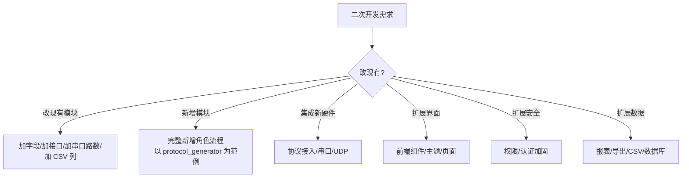
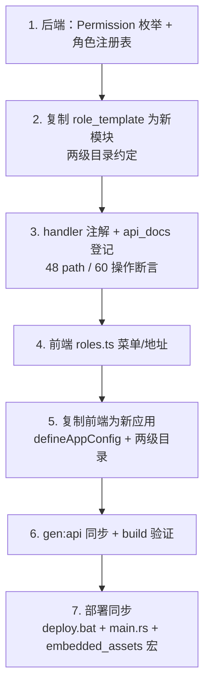
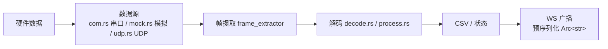

# 08 扩展与二次开发

> 终章：把系统"长出新的能力"。本章是 AGENTS.md「新增角色流程」的展开教学，以**刚完成的 protocol_generator 角色**为真实范例，从新增角色/模块/应用，到公共设施复用、协议接入、报表扩展、安全加固，一次讲透。全文事实以当前源码为准（8 个前端应用、12 个权限点、48 path / 60 操作、两级目录约定）。

## 8.1 二次开发全景图



**四个扩展维度**：功能（新模块）、设备（新协议）、界面（前端）、安全/数据（横切）。

当前系统规模（扩展前必读）：

| 项 | 数量 | 说明 |
|---|---|---|
| 前端应用 | 8 | admin + 7 个用户端，见下端口表 |
| 角色 | 8 | `src/roles.rs` ROLE_REGISTRY |
| 权限点 | 12 | `src/common/models.rs` Permission 枚举 |
| OpenAPI | 48 path / 60 操作 / 10 tag | `src/api_docs.rs` 断言防漂移 |
| 前端生成类型 | 115 个 model | `packages/shared/src/api/generated/model/` |

端口表（新增前端时先查，避免撞端口）：

| 应用 | 端口 | prod 路径 | WS 代理 |
|---|---|---|---|
| fj200c_information | 5173 | /fj200c_information | ws:true |
| admin | 5174 | /admin | 无 |
| fw100 | 5175 | /fw100 | ws:true |
| ftj1c | 5176 | /ftj1c | ws:true |
| city3d | 5177 | /city3d | ws:true |
| fw150 | 5178 | /fw150 | ws:true |
| fj200c_main | 5179 | /fj200c_main | ws:true |
| protocol_generator | 5180 | /protocol_generator | 无 |

注意：目前 **6 个应用开 `ws:true`**（fw100/fw150/city3d 也开了），由共享工厂 `build/vite.base.ts` 的 `defineAppConfig({app, port, ws?})` 统一控制。

---

## 8.2 新增角色完整流程（核心方法论，以 protocol_generator 为真实范例）

> protocol_generator（通信协议生成器）是本项目最近一次完整新增角色的实战记录（commit c417c4f 及其前后）。以下每一步都给出它在真实提交中的形态——照抄即可。

### 8.2.1 流程总览（7 步）



### 8.2.2 第 1 步：后端权限与注册表

```rust
// src/common/models.rs —— 加权限（现 12 个变体，角色专属在前、管理权限在后）
#[derive(Debug, Serialize, Deserialize, Clone, PartialEq, Eq, Hash, utoipa::ToSchema)]
pub enum Permission {
    // ============ 角色专属权限 ============
    Fj200cInformationMonitor,
    Fw100Monitor,
    Ftj1cMonitor,
    Ftj1cHelp,               // ftj1c 的细粒度帮助权限（见 8.7）
    City3dView,
    Fw150Monitor,
    Fj200cMainMonitor,
    ProtocolGeneratorMonitor, // ← protocol_generator 新增
    // ============ 管理面板权限 ============
    UsersRead,
    UsersWrite,
    UsersDelete,
    SystemAdmin,
}
```

```rust
// src/roles.rs —— 注册角色（ROLE_REGISTRY 是角色 key/name/permissions 的唯一源）
RoleDef {
    key: "protocol_generator",
    name: "protocol_generator",
    permissions: &[Permission::ProtocolGeneratorMonitor],
},
```

**前端自动获得**：`GET /api/meta/roles` 公开返回注册表 → 前端 `loadRoleRegistry()` 启动时缓存 → admin 界面角色下拉可选 → 登录权限自动生效。**key/name/permissions 前端零手写副本**，这是与旧版本最大的区别。

### 8.2.3 第 2 步：复制 role_template（两级目录约定）

```powershell
# src/role_template/ 自带模板四件套：mod.rs / handlers.rs / routes.rs / services.rs
Copy-Item src\role_template src\xxx -Recurse
# 全局替换 role_template → xxx、TemplateMonitor → XxxMonitor
```

**两级目录约定（本项目新模块的强制结构）**：

```
src/xxx/                  ← 一级目录：仅模板骨架
├── mod.rs                ← pub mod xxx; + pub use xxx::{...}; 再导出
├── handlers.rs           ← HTTP 层（薄，含 utoipa 注解）
├── routes.rs             ← 子路由 + 权限中间件
├── services.rs           ← 业务编排（薄，转发给二级目录）
│
└── xxx/                  ← 二级目录：角色专有子模块（内含 mod.rs 声明）
    ├── mod.rs
    ├── models.rs         ← DTO（ToSchema，orval 生成前端类型）
    ├── generator.rs      ← 核心逻辑（按需扩展）
    └── ...               ← 其余角色专有 rs 文件
```

关键规则：

1. **一级 `mod.rs` 用 `pub mod xxx;` + `pub use xxx::{...};` 再导出**，外部代码路径保持 `crate::xxx::x` 不变——这是两级目录改造的核心技巧（`src/protocol_generator/mod.rs:43`）。
2. **非 rs 文件必须留在一级目录**：`config-*.ini` 样本、`help_doc.md`（handlers.rs 用 `include_str!("help_doc.md")` 相对引用，移入二级目录会编译失败）。
3. 例外：纯 CRUD 模块（admin / fw100 / fw150 / role_template）只有模板四件套，无需二级目录；city3d 二级目录只有 `city3d/models.rs`。

protocol_generator 二级目录实际内容：`mod.rs`（声明 `pub mod generator; pub mod models;`）、`models.rs`（ProtocolField / ParameterDef / ProtocolExportRequest / CsvParseRequest / TextContent）、`generator.rs`（CSV_HEADERS、DEFAULT_CSV_CONTENT 7 行 BOM 种子、export_markdown、export_excel、parse/serialize CSV）。

### 8.2.4 第 3 步：handler 注解 + api_docs 登记

```rust
// src/xxx/handlers.rs —— 每个端点都要 utoipa 注解
#[utoipa::path(
    tag = "protocol_generator",
    get,
    path = "/api/protocol_generator/default-csv",
    operation_id = "protocolGeneratorGetDefaultCsv",
    responses(
        (status = 200, description = "默认参数表列表", body = ApiResponse<Vec<ParameterDef>>),
    ),
)]
pub async fn get_default_csv() -> Result<Json<ApiResponse<Vec<ParameterDef>>>, AppError> {
    let data = ProtocolGeneratorService::load_default_csv()
        .map_err(|e| AppError::bad_request(e.to_string()))?;
    Ok(Json(ApiResponse::success(data)))
}
```

```rust
// src/api_docs.rs —— 三处登记（paths / components.schemas / tags）
paths(
    // ...
    crate::protocol_generator::handlers::get_default_csv,
    crate::protocol_generator::handlers::save_default_csv,
    crate::protocol_generator::handlers::export_markdown,
    crate::protocol_generator::handlers::export_excel,
    crate::protocol_generator::handlers::parse_csv,
    crate::protocol_generator::handlers::serialize_csv,
),
components(schemas(
    // ...
    crate::protocol_generator::models::ProtocolField,
    crate::protocol_generator::models::ParameterDef,
    crate::protocol_generator::models::ProtocolExportRequest,
    crate::protocol_generator::models::CsvParseRequest,
    crate::protocol_generator::models::TextContent,
)),
tags(
    // ...
    (name = "protocol-generator", description = "..."),
),
```

**断言防漂移（重要）**：`api_docs.rs` 底部有 `export_openapi` 测试，断言 path 数量 = **48**、操作数量 = **60**，并逐个断言关键 path 在列表里。新增接口忘记登记 → `cargo test` 直接失败。这是契约的"守门员"。

### 8.2.5 第 4 步：前端 roles.ts 菜单与地址

```ts
// packages/shared/src/roles.ts —— 菜单与地址仍是纯前端 UI 概念，需手写
const MENU_CONFIG: Record<string, { userMenus: MenuItem[]; adminMenus: MenuItem[] }> = {
  // ...
  protocol_generator: {
    userMenus: [
      { id: "protocol_generator-editor", label: "协议编辑", icon: "Edit", path: "/protocol_generator/editor" },
      { id: "protocol_generator-csv", label: "CSV 参数表", icon: "Document", path: "/protocol_generator/csv" },
    ],
    adminMenus: [],
  },
};

export const ROLE_APP_URLS: Record<string, { dev: string; prod: string }> = {
  // ...
  protocol_generator: { dev: "http://localhost:5180", prod: "/protocol_generator" },
};
```

注册表数据（key/name/permissions）**不需要手写**——运行时从 `GET /api/meta/roles` 拉取缓存（失败缓存空数组不阻塞登录）。另外记得 `AppNavbar.vue` 的 `brandText` switch 加一行中文角色名（如 `case 'protocol_generator': return '协议生成器'`）。

### 8.2.6 第 5 步：复制前端为新应用

```powershell
# 复制最相似的应用（CRUD 类复制 fw100，监控类复制 fj200c_information，工具类参考 protocol_generator）
Copy-Item frontend\fw100 frontend\xxx -Recurse
```

**前端同样两级目录**：一级目录只保留模板骨架，角色专有文件全部放二级 `src/<role>/`：

```
frontend/xxx/
├── vite.config.ts         ← 5 行，共享工厂
├── index.html
├── src/
│   ├── main.ts            ← import "@shared/style.css"（默认策略）
│   ├── App.vue            ← 薄 <AppShell/>（默认策略）
│   ├── api/index.ts       ← facade + setApiInstance
│   ├── router/index.ts    ← createAppRouter
│   ├── stores/auth.ts     ← createAuthStore
│   ├── types/index.ts     ← WS 事件类型（手写）
│   ├── utils/responsive.ts
│   ├── views/Login.vue
│   └── xxx/               ← 二级目录：views/ api/ components/ composables/ store/ 等
```

各文件改动要点：

| 文件 | 改动 |
|---|---|
| vite.config.ts | `defineAppConfig({ app: "xxx", port: 5181, ws: true? }, __dirname)` |
| package.json | name；devDependencies 字段**删除**（已提升到根 package.json） |
| index.html | title |
| api/index.ts | `createApiClient(import.meta.env.PROD ? "/xxx/login" : "/login")` + `setApiInstance(api)` + facade 组装 |
| router/index.ts | `createAppRouter({ app: "xxx", routes, useAuthStore, homePath })` |
| stores/auth.ts | `createAuthStore({ id: "auth-xxx", appKind: "xxx", allowedRoles: ["xxx"], authApi })` |
| src/xxx/* | 业务页面、api facade、composable 等 |

```ts
// vite.config.ts（共享工厂，base / 端口 / 代理 / 别名 / manualChunks 全部收敛）
import { defineConfig } from "vite";
import { defineAppConfig } from "../../build/vite.base";

export default defineConfig(defineAppConfig({ app: "xxx", port: 5181, ws: true }, __dirname));
```

```ts
// api/index.ts（facade 组装 + setApiInstance 注入）
import { createApiClient, createAuthApi, setApiInstance } from "@shared";
import { createXxxApi } from "@/xxx/api/xxx";

export const api = createApiClient(import.meta.env.PROD ? "/xxx/login" : "/login");
setApiInstance(api);                       // orval 生成的请求函数共用此实例
export const authApi = createAuthApi();
export const xxxApi = createXxxApi();      // facade：视图层只认识它
```

```ts
// stores/auth.ts（createAuthStore）
import { createAuthStore } from "@shared";
export const useAuthStore = createAuthStore({
  id: "auth-xxx",
  appKind: "xxx",
  allowedRoles: ["xxx"],
  authApi,
});
```

### 8.2.7 第 6 步：gen:api 同步 + build 验证

```powershell
npm run gen:api    # = cargo test export_openapi && orval
# → 生成 packages/shared/src/api/generated/api/<tag>.ts + model/*.ts

# 各前端子目录执行
npm run build      # vue-tsc && vite build —— 报错处即需更新的调用点
```

`gen:api` 流程：后端 `cargo test export_openapi`（含 48/60 断言）导出 `openapi/openapi.json` → orval（tags-split 模式）生成 `generated/`。生成文件**提交仓库，不手改**。

### 8.2.8 第 7 步：部署同步（四处）

1. **build-frontends.ps1**：8 个前端并行构建列表加 `xxx`（max 4 并发）。
2. **deploy.bat**：逐角色复制 `config-xxx.ini` + csv 目录的步骤加 xxx。
3. **main.rs**（dev 模式静态托管）：加 `("/xxx", ServeDir::new("dist-xxx").fallback(ServeFile::new("dist-xxx/index.html")))`。
4. **embedded_assets.rs**（生产内嵌）：**宏注册，不再手写结构体与路由**——

```rust
// src/embedded_assets.rs —— 两处宏调用各加一项
embed_assets!(
    // ...
    XxxAssets => "frontend/xxx/dist/",
);

pub fn embedded_router() -> Router {
    embed_app_routes!(
        Router::new(),
        // ...
        "xxx" => XxxAssets,
    )
}
```

`embed_assets!` 批量生成 RustEmbed 结构体，`embed_app_routes!` 批量注册 `/x`、`/x/`、`/x/*path` 三条路由（SPA 深链接回退 index.html）——消灭了旧版手写 24 条路由的样板。

### 8.2.9 新增角色流程要点总结

| 步骤 | 容易漏的点 |
|---|---|
| 1 | 权限枚举与注册表同步（key 与前端一致） |
| 2 | 两级目录：一级 mod.rs 再导出；**非 rs 文件留一级**（include_str! 相对引用） |
| 3 | api_docs.rs 登记三处（paths/schemas/tags）+ 断言数量（48/60） |
| 4 | roles.ts MENU_CONFIG + ROLE_APP_URLS + AppNavbar brandText switch |
| 5 | vite.base defineAppConfig（端口/base/代理一次搞定）；facade + setApiInstance |
| 6 | gen:api 必须跑；vue-tsc 报错驱动补类型 |
| 7 | build-frontends.ps1 + deploy.bat + main.rs + embedded_assets 宏四处同步 |

---

## 8.3 范例详解：protocol_generator 模块解剖

### 8.3.1 后端结构（对照真实代码）

```
src/protocol_generator/
├── mod.rs          # 模块文档 + pub mod 声明 + pub use 再导出（models）
├── handlers.rs     # 135 行：6 个端点，operation_id 全部 protocolGeneratorXxx
├── routes.rs       # protocol_generator_router：5 条路由 + 权限中间件包装
├── services.rs     # ProtocolGeneratorService：薄转发，业务在二级 generator
└── protocol_generator/        # 二级目录
    ├── mod.rs     # pub mod generator; pub mod models;
    ├── models.rs  # ProtocolField / ParameterDef / ProtocolExportRequest / CsvParseRequest / TextContent
    └── generator.rs           # CSV 读写 / Markdown / Excel（rust_xlsxwriter）/ 解析序列化
```

routes.rs 的标准形态（各角色一致，注意 `permission_middleware` 需要一层本地包装，因为 `from_fn` 不能直接传参）：

```rust
pub fn protocol_generator_router(db: DatabaseConnection) -> Router<DatabaseConnection> {
    let protected = Router::<DatabaseConnection>::new()
        .route("/default-csv", get(handlers::get_default_csv).put(handlers::save_default_csv))
        .route("/markdown", post(handlers::export_markdown))
        .route("/excel", post(handlers::export_excel))
        .route("/csv/parse", post(handlers::parse_csv))
        .route("/csv/serialize", post(handlers::serialize_csv))
        .route_layer(middleware::from_fn_with_state(db.clone(), xxx_permission_middleware))
        .route_layer(middleware::from_fn_with_state(db, auth_middleware));

    Router::<DatabaseConnection>::new().merge(protected)
}

async fn xxx_permission_middleware(
    State(db): State<DatabaseConnection>,
    request: Request,
    next: Next,
) -> Result<Response, StatusCode> {
    permission_middleware(Permission::XxxMonitor, State(db), request, next).await
}
```

`src/routes.rs` 挂载：`.nest("/api/protocol_generator", protocol_generator_router(db.clone()))`。

### 8.3.2 前端结构（对照真实代码）

```
frontend/protocol_generator/src/
├── main.ts                    # 注册 hiPrintPlugin（打印）
├── App.vue / router / stores / types / utils / api
├── views/Editor.vue           # 9 行包装 ProtocolEditor
├── views/Csv.vue              # 9 行包装 CsvEditor
└── protocol_generator/        # 二级目录（角色专有）
    ├── api/protocol-generator.ts   # 100 行，exportExcel 走 blob 下载
    ├── components/ProtocolEditor.vue   # 363 行：协议表编辑/参数目录自动填充/C# 代码生成/Excel 导出/JSON 上传下载/hiprint 打印/Markdown 预览
    ├── components/CsvEditor.vue        # 207 行：默认参数表读写/CSV 导入导出
    ├── types/protocol.ts        # ProtocolField、CSharpType、CSharpTypes 15 个 C# 类型带大小、getTypeSize
    └── utils/protocol.ts        # recalcFields 按类型大小重排序号与字节范围
```

**亮点**：

- **Excel 导出**：后端 `rust_xlsxwriter` 在内存生成 xlsx 二进制 → 前端 Blob 下载（新依赖进 `Cargo.toml`）。
- **CSV 种子**：`DEFAULT_CSV_CONTENT` 7 行 UTF-8 BOM 种子，首次访问自动落盘 `parameters.csv`——无硬件、无数据库也开箱可用。
- **打印**：前端 hiprint（`vue-plugin-hiprint`）——纯前端能力，不进 OpenAPI。
- **路由守卫教训**：`homePath`（如 `/protocol_generator/editor`）**必须存在于路由表**，否则 404 兜底路由 + 守卫互相跳转形成死循环（commit a4a7f7c 修复）——新增前端时第一件事就是核对 homePath。

---

## 8.4 公共设施扩展指南（common/ 的六件套）

架构优化（commit 61a4b8e）后，公共设施收敛到 `src/common/`，新模块优先复用而非复制：

### 8.4.1 config_singleton!（common/config.rs）

角色配置文件不同，但"全局只读单例"形态一致。宏生成 `static GLOBAL: OnceLock<Config>` + `global()` / `set_global()`：

```rust
// 在角色模块内展开（如 fj200c_information / ftj1c）
crate::config_singleton!(GLOBAL, global, set_global);

// 使用
if let Some(cfg) = global() {
    let mock = cfg.get_or("Mock", "InProcess", "false");
}
```

- `OnceLock` 只读单例：**只能 set 一次**，适合启动时加载一次的场景。
- 例外：fj200c_main 需要运行期热替换配置，保持自实现 `OnceLock<RwLock<Option<Config>>>` + `clear_global()`（其 `config-fj200c_main.ini` 修改后**需重启服务**）；fj200c_information 的 ini 修改立即生效（服务运行时热加载），机制不在本宏内，详见对应模块。

### 8.4.2 event_broadcast!（common/ws.rs，WS 广播的标准形态）

```rust
// 在角色模块内展开
crate::event_broadcast!(XXX_TX, xxx_tx);

// 生产端（采集线程）—— 只序列化一次
let payload = crate::common::ws::serialize(&event)?;   // EventPayload = Arc<str>
let _ = xxx_tx().send(payload);                        // 广播只克隆 Arc 指针

// WebSocket 会话主循环 —— ws_bridge 只转发，不再逐客户端 to_string
crate::common::ws::ws_bridge(xxx_tx(), socket, "[xxx]").await;
```

设计要点：

- **载荷是预序列化的 `Arc<str>`**（`EventPayload`）：N 个订阅者共享同一份 JSON 文本，零深克隆——这是监控类模块的性能基石。
- 通道**容量 1024**，满则丢弃最旧事件（`Lagged` 不阻塞）。
- `ws_bridge` 统一处理"广播→JSON 文本帧"转发与 Close 帧。
- `verify_query_token()`：浏览器 WS 不支持自定义头，token 走 `?token=` 查询参数（见 8.6）。

### 8.4.3 ServiceRuntime::stop_in_background（common/service.rs）

停止服务时在后台异步停（不阻塞请求）：

```rust
runtime.stop_in_background();
```

### 8.4.4 csv_writer（common/csv_writer.rs）

CSV 写入线程收敛为公共版：`CsvCommand{Begin, Row, End, Shutdown}` + 独立线程 `csv-writer-{i}`。fj200c_information 的 csv_sink.rs 引用公共版，**删除本地重复实现**——新模块要写 CSV 直接复用。

### 8.4.5 ledger.rs（common/ledger.rs，设备台账）

fw100 / fw150 共用的台账数据模型（`LedgerItem`）。前端对应共享组件 `template/LedgerPanel.vue`（见 8.5）。新台账类角色只需：后端复用 `LedgerItem`/仿写 + 前端传 `roleKey / permissionKey / api` 三 props。

---

## 8.5 共享包扩展（packages/shared/src/）

### 8.5.1 何时用共享、何时保留本地变体

**判断标准：功能被 ≥2 个应用用 → 放 shared；只被 1 个应用用 → 放应用内部。**

| 共享件 | 用途 | 使用者 |
|---|---|---|
| `template/AppShell.vue`（46 行） | AppNavbar + router-view + initAuth 薄外壳 | **6 个应用**（admin / fj200c_information / ftj1c / fw100 / fw150 / protocol_generator） |
| `template/AppNavbar.vue`（764 行） | 导航条：菜单/用户下拉/brandText/自动隐藏 | 全部应用（AppShell 内嵌） |
| `template/LoginPage.vue`（688 行） | 登录页 + 登录后 `getRoleAppUrl` 跨应用跳转 | 全部应用 |
| `template/LedgerPanel.vue`（151 行） | 台账面板（props: roleKey/permissionKey/api，鸭子类型 LedgerRow） | fw100 / fw150 |
| `template/TemplatePanel.vue`（336 行） | role_template 演示面板（RoleTemplatePanel） | role_template 类新应用 |
| `router.ts`（createAppRouter） | 路由工厂 + 守卫（initAuth→requiresAuth→login→homePath→权限 any-of→兜底） | 全部应用 |
| `stores/auth.ts`（createAuthStore） | 认证 store 工厂 + storage 事件跨标签页同步 | 全部应用 |
| `responsive.ts` | breakpoints / useResponsive / useLayoutConfig | 大部分应用 |
| `style.css`（326 行） | 全局样式（6 份相同副本收敛） | 6 个应用（main.ts `import "@shared/style.css"`） |

**保留本地变体的例外**：

- **city3d**：暗黑主题变体——本地 `style.css`（182 行）+ 自定义 App.vue（body 背景 #0a0e1a），不用 AppShell。
- **fj200c_main**：精简版本地 style.css（48 行）+ 自定义 App.vue（128 行，AppNavbar `#actions` 插槽：保存/停止、模拟开关、主题切换；app 级 useBackendPorts 常驻 WS）。

```vue
<!-- 新应用默认外壳：薄到只有一行 -->
<template>
  <AppShell />
</template>
```

### 8.5.2 createAppRouter

```ts
import { createAppRouter } from "@shared";

export const router = createAppRouter({
  app: "xxx",
  routes,
  useAuthStore,
  homePath: "/xxx/editor",          // 必须存在于路由表，否则守卫死循环！
  noPermission: "403",              // 或 "menu"（兜底第一个菜单路径）
});
```

守卫链：`initAuth → requiresAuth → /login → requiresGuest → homePath → 权限 any-of 检查 → 兜底第一个菜单路径或 /403`。

### 8.5.3 createAuthStore

```ts
export const useAuthStore = createAuthStore({
  id: "auth-xxx",                    // localStorage key 前缀
  appKind: "xxx",                    // roles.ts MENU_CONFIG 的 key
  allowedRoles: ["xxx"],             // 本应用允许的角色
  authApi,
});
```

`isAuthenticated = token + user + allowedRoles`；`refreshAuthState` 由注册表驱动；`syncFromStorage` + **storage 事件**实现跨标签页登录态同步（见 8.9.6）。

### 8.5.4 新增共享组件的步骤

```text
1. packages/shared/src/template/ 建组件（或 composables/ / utils/）
2. packages/shared/src/index.ts 导出
3. 各应用直接 import 使用
4. 注意影响面：shared 改动影响全部应用，先确认回归范围
```

---

## 8.6 WebSocket 扩展

### 8.6.1 后端新增 WS 端点

```rust
// routes.rs —— /ws 路由不挂权限中间件（浏览器 WS 不能带自定义头）
.route("/ws", get(ws_handler))
```

```rust
// handlers.rs —— handler 内部用 verify_query_token 鉴权
pub async fn ws_handler(
    Query(params): Query<HashMap<String, String>>,
    ws: WebSocketUpgrade,
) -> Result<Response, StatusCode> {
    crate::common::ws::verify_query_token(&params)?;      // 缺失/无效 → 401
    Ok(ws.on_upgrade(move |socket| handle_socket(socket)))
}

async fn handle_socket(socket: WebSocket) {
    crate::common::ws::ws_bridge(xxx_tx(), socket, "[xxx]").await;
}
```

### 8.6.2 广播载荷预序列化模式

```rust
// 生产端（采集/解码线程）
let payload = crate::common::ws::serialize(&event)?;   // 序列化一次
let _ = xxx_tx().send(payload);                        // 转发 N 份 = 克隆 N 个指针
```

**性能原则**：事件对象在生产者处构建 → 立即序列化 → 丢弃；广播通道只传 `Arc<str>`；`ws_bridge` 零解析零重编码。

### 8.6.3 前端 WS 接入（不进 OpenAPI）

```ts
// 各前端 types/index.ts —— WS 事件类型手写（WS 不进 OpenAPI，无生成代码）
export type XxxWsEvent =
  | { type: "status"; running: boolean }
  | { type: "data"; fields: XxxFields }
  | { type: "csv"; name: string };

// api/xxx.ts —— buildWebSocketUrl 由 shared 提供（自动补 token 查询参数）
import { buildWebSocketUrl } from "@shared";
export function buildXxxWsUrl(): string {
  return buildWebSocketUrl("/api/xxx/ws");
}
```

`buildWebSocketUrl` 会从 session 里取 token 拼 `?token=`。**约定：WS 事件类型变更 = 手改前端 types.ts，后端无感知。**

---

## 8.7 权限扩展

### 8.7.1 角色权限细粒度（Ftj1cHelp 范例）

一个角色可以拥有多个权限点，端点可以挂不同权限：

```rust
// src/roles.rs —— ftj1c 角色有两个权限点
RoleDef {
    key: "ftj1c",
    name: "ftj1c",
    permissions: &[Permission::Ftj1cMonitor, Permission::Ftj1cHelp],
},
```

```rust
// ftj1c 的 help 端点单独挂 Ftj1cHelp（routes.rs 里独立路由组）
// GET /api/ftj1c/help —— 全系统唯一需要 Ftj1cHelp 权限的端点
// handlers.rs 用 include_str!("help_doc.md") 内嵌帮助文档（233 行处）
```

**扩展思路**：权限粒度 = 枚举变体数。想给某个子功能独立授权 → 加一个 Permission 变体 + 注册表给角色 → 路由组单独挂该权限。前端 `filterMenusByPermissions` 会自动过滤菜单。

### 8.7.2 admin 双层中间件模式

```rust
// src/admin/routes.rs —— 外层 role_middleware（SystemAdmin 门槛）+ 内层具体权限
let read_routes = Router::<DatabaseConnection>::new()
    .route("/", get(handlers::list_users))
    .route_layer(middleware::from_fn_with_state(db.clone(), users_read_middleware))
    .route_layer(middleware::from_fn_with_state(db.clone(), role_middleware));
// 先执行 role_middleware（后添加的先执行），再执行 users_read_middleware

async fn users_read_middleware(
    State(db): State<DatabaseConnection>,
    request: Request,
    next: Next,
) -> Result<Response, StatusCode> {
    permission_middleware(Permission::UsersRead, State(db), request, next).await
}
```

模式 = `role_middleware(SystemAdmin)` 在外（管理角色门槛）+ `permission_middleware(UsersRead/Write/Delete)` 包装在内（细粒度）。系统设置端点（`/api/users/settings/pwd-route`）只挂 `role_middleware`。

### 8.7.3 中间件选择决策

```text
普通角色面板 → permission_middleware(权限点)
管理功能     → role_middleware（注册表授予 SystemAdmin 即生效）
双层组合     → role_middleware 外层 + permission_middleware 内层
WS 端点      → 免中间件 + handler 内 verify_query_token
```

---

## 8.8 数据库扩展（src/database.rs，1360 行）

**项目约定：无迁移文件，建表全在 database.rs，全部包在一个事务里**（启动毫秒级）。新表加在这里即可（幂等：`CREATE TABLE IF NOT EXISTS`）。

### 8.8.1 system_settings 键值对模式（pwd_route_disabled 范例）

业务开关用键值对表，配 `GET/PUT` 端点即可做设置项：

```sql
CREATE TABLE IF NOT EXISTS system_settings (
    key   TEXT PRIMARY KEY,
    value TEXT NOT NULL
);
```

```rust
// 读：get_setting(db, "pwd_route_disabled") -> Option<String>
// 写：set_setting(db, "pwd_route_disabled", "true")

// 效果链路（真实实现）：
// GET/PUT /api/users/settings/pwd-route（SystemAdmin）→ 写 system_settings
// GET /admin/pwd（公开，种子密码查询）→ 读到 pwd_route_disabled=true 时返回 403
// admin 前端 Users.vue「停用初始密码查询」勾选框 → 调 PUT 接口
```

**扩展思路**：任何"管理员可开关的系统行为"都适合这个模式（开关名 = key，状态 = value）。

### 8.8.2 seed_passwords 机制（种子账号密码）

```rust
// database.rs seeds 数组：8 个种子账号，固定 UUID，邮箱 @7304.com
// random_password(12) 返回 (password="123456", password_fake=随机12位)
```

**真实机制（容易误解，重点）**：

- 实际 bcrypt 入库的是**固定 "123456"**——有意保留的开发默认密码（登录用）。
- `seed_passwords` 表存的是**随机串**——只用于 `GET /admin/pwd` 展示（迷惑展示，不是真实密码）。
- 前端登录一律用 `123456`，admin 界面可停用初始密码查询路由。

新增角色时：`seeds` 数组加一项 `("xxx", "xxx@7304.com", "xxx")`。

### 8.8.3 单事务种子模式

```rust
// database.rs 全流程：连接池 → 单事务（所有 CREATE TABLE + 种子 INSERT）→ 提交
let mut tx = pool.begin().await?;
// ... 全部建表 + 种子 ...
tx.commit().await?;
```

### 8.8.4 历史表清理与角色迁移

启动时幂等处理历史遗留数据：

```rust
// 清理历史表（存在才删）：user_roles / roles / posts / menu_items / user_devices / data_export_requests
// 以及冗余索引
// 历史角色迁移（旧角色名 → 新角色 key）：
//   moderator → user（降级）
//   user      → fj200c_information
//   fj200c    → fj200c_information
```

**扩展意义**：老库升级时，迁移逻辑与建表放一起，`CREATE IF NOT EXISTS` + 条件 UPDATE 保证幂等，重跑启动无害。

---

## 8.9 常见二次开发场景（六连发）

### 8.9.1 改 DTO → gen:api → vue-tsc 报错驱动

```text
1. 后端 models.rs/handlers.rs 改 DTO 或接口
2. npm run gen:api（cargo test export_openapi && orval）
3. 全前端 npm run build → vue-tsc 报错处 = 需要更新的调用点
4. 逐个修完 → build 通过
```

**这是全项目最高频操作**：契约变更后不用人工找调用点，编译器替你找。

### 8.9.2 新增 CSV 列

```text
1. 找到对应后端写入点（fj200c_information: CSV_HEADERS 28 列 / session.rs 写行；
   fj200c_main: types.rs all_csv_entries() 64 列）
2. 改表头常量 + 写入行（保持列数一致）
3. 前端 Data 页若展示列 → 同步
4. 注意旧 CSV 文件格式兼容（或接受格式变化）
```

### 8.9.3 新增串口路数（以 fj200c_main 3→5 路迁移为范例，commit 5c43d92）

五路现状：

| index | Section | 设备 | 帧格式 |
|---|---|---|---|
| 0 | COM0 | ECU 电控器 | 42 字节 `EB 90 2A` 头 |
| 1 | COM1 | Adam4015 环境采集 | `>` + 8 通道 ASCII |
| 2 | COM2 | Adam4117 环境采集 | `>` + 8 通道 ASCII |
| 3 | COM3 | Dyno 测功机 | Dyno 帧 |
| 4 | COM4 | Flux 燃油流量 | `FF FF` 头 + u16 流量 |

从 3 路加到 5 路需要同步改的**五个点**：

```text
① config-fj200c_main.ini：[COM] Count = 5（改完需重启服务，与 fj200c_information 热加载不同）
② abstract_com.rs：ComSpec 表加 Dyno/Flux 两条（帧头/长度/偏移）
   ecu [0xEB,0x90,0x2A]/38B/偏移1 · adam4015 b'>'/57 · adam4117 b'>'/57 · dyno [0xFF,0xFF]/14/2 · flux 与 dyno 相同
③ types.rs：加 DynoFields{njzs,nj,njgl}（扭矩转速/扭矩/扭矩功率）、FluxFields{ll}（燃油流量），
   ChannelData 枚举扩到 5 变体；64 列 CSV 表头（all_csv_entries()）同步
④ com.rs：SharedPortData 扩到 5×LatestFrame + 5×ArcSwap<Fields>；init_all_from_config 读 5 路
   mock.rs：MockProfile 启发式映射（MOCK_COM2→Adam4117、MOCK_COM3→Dyno、MOCK_COM4→Flux）
⑤ 前端 useBackendPorts.ts（194 行）：switch 扩到 5 端口（0 Ecu / 1 Adam4015 / 2 Adam4117 / 3 Dyno / 4 Flux），
   模块级单例 sharedWs + refCount，连接后首帧为 5 个 PortData 快照数组
```

**envParams 8 项映射**（环境参数表 → 各端口通道，前端 dashboard store 维护）：

| 环境参数 | 来源 |
|---|---|
| 大气温度 ℃ | Adam4117 ch0 |
| 大气湿度 % | Adam4117 ch1 |
| 大气压力 KPa | Adam4117 ch2 |
| 进口温度 ℃ | Adam4015 ch3 |
| 燃油流量 L/h | Flux |
| 扭矩转速 r/min | Dyno njzs |
| 扭矩 N·m | Dyno nj |
| 扭矩功率 kW | Dyno njgl |

**新增一路的套路**：`config Count + ComSpec + types Fields + com.rs SharedPortData + mock 映射 + useBackendPorts switch + envParams 映射`——六处同改，缺一不可。报表映射同理：report.rs 按表头映射（"扭矩"→推力、"燃油流量"→燃油流量），三张报表表（性能/标准/设计点）才有真实数据。

### 8.9.4 前端主题（fj200c_main dark/light）

```text
1. src/<app>/styles/theme.css：.theme-dark / .theme-light 两组 CSS 变量（205 行）
2. 后端 state.rs：THEME_IS_DARK: AtomicU8（默认 1 深色）+ /theme/set 端点
3. 前端 useTheme.ts：localStorage.theme + theme-changed 事件（跨组件同步）
4. AppNavbar #actions 插槽加切换按钮（深色/浅色）
```

### 8.9.5 报表打印（隐藏导航栏）

fj200c_main 的 GenerateReport.vue（622 行）模式：

```text
1. 选择 CSV + 状态点（逗号分隔 RPM）
2. 后端 report.rs 生成 HTML（三张表：基本信息/性能数据/标准数据/设计点数据 + 水印 ©7304厂）
3. 前端新窗口打开 → window.print()
4. 打印时隐藏导航栏：报表自身的全局 @media print 块 display:none（不用改应用布局）
```

### 8.9.6 多标签页登录态同步（storage 事件）

```ts
// shared session.ts：SESSION_KEY="session" 共享 localStorage（跨应用），
// LEGACY_KEYS=["token","user","admin_token","admin_user"] 旧键兼容
// shared stores/auth.ts：syncFromStorage 监听 storage 事件
window.addEventListener("storage", (e) => {
  if (e.key === SESSION_KEY) syncFromStorage();
});
```

**效果**：一个标签页登录 → 其他标签页（甚至其他前端应用）自动获得登录态；登出同样同步。8 个应用共享同一 session 键，跨应用跳转 token 自动传递。

---

## 8.10 修改现有模块（最高频操作）

### 8.10.1 加字段（全链路清单）

```text
后端：
1. models.rs 结构体加字段（ToSchema）
2. database.rs 建表语句加列（若新列）
3. service 的 SQL 加列
4. handler 注解无需改（schema 自动含新字段）

前端：
5. npm run gen:api
6. 表单/表格/详情按 vue-tsc 报错补字段
7. npm run build 验证
```

### 8.10.2 加接口

```text
1. handler 写新函数 + utoipa 注解（operation_id = 模块名 + 动作驼峰）
2. api_docs.rs paths/schemas 登记（断言数量会变，同步更新 48/60）
3. routes.rs 注册路由
4. gen:api → 前端 api facade 加方法 → 页面调用
```

### 8.10.3 改前端行为

```text
1. 视图层：直接改模板/script（views/ 二级目录）
2. 业务逻辑：composable（二级目录 composables/）
3. 公共：shared（注意影响全部应用，改动前确认回归范围）
```

---

## 8.11 新硬件协议接入（串口/UDP）

### 8.11.1 协议接入的通用模式



**四个可替换点**：

1. **数据源**：串口/模拟/UDP——换硬件只换实现（各角色二级目录 `com.rs` / `mock.rs` / `udp.rs`）。
2. **帧提取**（common/frame_extractor.rs）：从字节流切帧。
3. **解码**（各角色 decode.rs / process.rs）：帧 → 结构化字段。
4. **广播**：事件 → 预序列化 Arc<str> → WS。

### 8.11.2 模拟源的价值

```text
开发期没有硬件 → 用 Mock 实现（模拟帧生成器）
→ 前后端联调不依赖硬件
→ 现场部署前先用模拟验证全链路
```

**这是 fj200c_information / fj200c_main / ftj1c 三个监控应用的标准做法**（Mock 开关在各自 ini：`[Mock] InProcess` / `[MOCK] SimulationMenu` / `[Udp] Mock`）。

### 8.11.3 接入新协议的步骤

```text
1. 定义帧格式（长度/校验/字段布局）
2. 写提取器（若帧结构不同）
3. 写解码器（字段 → struct）
4. 实现数据源（串口/模拟/UDP）
5. 接入 service 的会话循环
6. 广播事件（ws::serialize + event_broadcast! 通道）
7. 前端 types.ts 手写事件类型 + 展示
```

**核心心得**：协议接入的关键不是"读串口"（框架已有），而是**帧格式解析**（新协议的解码逻辑）。

---

## 8.12 安全扩展

### 8.12.1 认证增强

| 增强 | 实现思路 |
|---|---|
| 登录限流（已实现） | common/rate_limit.rs 滑动窗口 60 秒 / 5 次，key = `{ip}:{email}` |
| 生产 JWT 强制（已实现） | main.rs `jwt::init()`；`!debug_assertions` 下缺失 JWT_SECRET 拒绝启动 |
| 生产 CORS 白名单（已实现） | 生产必须设置 CORS_ORIGINS（逗号分隔），否则拒绝启动 |
| 验证码 | 前端生成 + 后端校验 |
| token 轮换 | 刷新 token 机制 |

### 8.12.2 权限模型增强

| 增强 | 实现思路 |
|---|---|
| 资源级权限（已有先例） | 权限枚举细分（如 Ftj1cHelp）——枚举加变体 + 注册表授予 |
| 角色继承 | RoleDef 加 parent 引用 |
| 动态角色 | 用户自定义角色表（DB） |

### 8.12.3 数据安全

```text
1. 敏感字段加密存储（sqlx + aes）
2. 日志脱敏（不记录密码/token——User.password_hash 已 #[serde(skip_serializing)]）
3. 备份加密（压缩带密码）
```

---

## 8.13 陷阱清单（血泪清单，更新版）

| 坑 | 后果 | 预防 |
|---|---|---|
| homePath 不在路由表 | **守卫死循环**（404 兜底 + 守卫互跳，a4a7f7c） | 新增前端第一件事核对 homePath 路由存在 |
| 只在根目录 npm install | 子目录装依赖 → **pinia 双实例黑屏** | 依赖只在根目录装一次（workspaces） |
| 前端 build 在根目录跑 | 失败/产物错位 | build 必须在各 frontend/* 子目录执行 |
| 只改后端忘了 gen:api | 前端类型错乱 | 改 DTO 必跑 `npm run gen:api` |
| 新表忘了 database.rs 建表 | 接口 500 | 建表统一入口（无迁移文件） |
| 权限枚举改了注册表没改 | 角色权限空 | 两处同步 |
| 路由没挂 routes.rs | 404 | 挂完测一遍 |
| api_docs 没登记 | cargo test 断言失败 | paths/schemas/tags 三处 + 数量断言 |
| embedded 没加新应用 | 生产 404 | embed_assets! / embed_app_routes! 各加一项 |
| 端口撞了 | dev 起不来 | strictPort + 端口表先查 |
| workspace 没加新前端 | 依赖不装 | 根 package.json workspaces（现 9 项） |
| 改 shared 影响 8 应用 | 回归风险 | 改动前确认影响面 |
| WS 事件结构变了 types.ts 没同步 | 前端解不了包 | 同步手改（WS 不进 OpenAPI） |
| 非 rs 文件移入二级目录 | include_str! 编译失败 | help_doc.md / config-*.ini 留一级目录 |
| 旧数据不兼容新字段 | 页面报错 | 可空字段 + 兜底显示 |
| 改名/新增前端 | 局部生效 | main.rs + embedded_assets + deploy.bat + workspaces + vite.base 全同步 |

**改名/新增前端的同步点全表**（漏一个就有一处不起作用）：`main.rs` 静态托管（dev 模式 `dist-xxx/`）→ `embedded_assets.rs`（embedded 模式两处宏）→ `deploy.bat` / `build-frontends.ps1`（构建与组装）→ 根 `package.json` workspaces → `build/vite.base.ts`（无，共享工厂自动生效）→ `roles.ts` ROLE_APP_URLS（跨应用跳转）。

**提交纪律**：`Cargo.lock`（锁定后端依赖）与 `package-lock.json` 必须提交。

---

## 8.14 回归验证清单（扩展后必过）

```text
1. cargo check 通过
2. cargo test 通过（export_openapi 断言 48 path / 60 操作）
3. npm run gen:api 无意外 diff（git diff generated/ 只有预期变化）
4. 受影响前端 npm run build 通过（vue-tsc 无错）
5. 手动验证：
   - 登录 → 权限正常（8 个角色各登录一次）
   - 新模块增删改查正常
   - WS 实时推送正常（?token= 鉴权）
   - 配置生效时机正确（fj200c_information 热加载 vs fj200c_main/ftj1c 需重启）
6. 部署演练：build-frontends.ps1 + deploy.bat 完整跑一遍
7. 生产访问 8 个入口 + 深链接刷新正常（SPA 回退）
```

**每次扩展后跑一遍回归**——本项目无自动化测试（除 openapi 断言），回归靠清单。

---

## 8.15 自测题

### 8.15.1 本章自测（16 题）

1. 新增角色的七步流程分别是什么？
2. 后端两级目录约定的核心规则是什么？（一级 mod.rs 再导出 + 非 rs 文件留一级）
3. `embed_assets!` / `embed_app_routes!` 各做了什么？（生成嵌入结构体 / 批量注册路由）
4. `defineAppConfig` 的参数与作用？（app/port/ws → base/代理/别名/manualChunks）
5. `EventPayload` 是什么类型？为什么性能好？（Arc<str> 预序列化，广播只克隆指针）
6. `config_singleton!` 与 fj200c_main 自实现的区别？（只读单例 vs 可热替换）
7. admin 双层中间件模式是什么？（role_middleware 外层 + permission_middleware 内层）
8. `Ftj1cHelp` 权限说明了什么？（权限粒度可按端点细分）
9. `pwd_route_disabled` 是什么模式？（system_settings 键值对开关）
10. 种子密码的真实机制？（bcrypt 入库固定 123456，seed_passwords 表存随机展示串）
11. fj200c_main 从 3 路加到 5 路需要同步改哪六处？
12. envParams 8 项分别来自哪路哪通道？
13. WS 端点为什么不挂权限中间件？（浏览器 WS 无自定义头，handler 内 verify_query_token）
14. homePath 路由缺失会怎样？（404 兜底 + 守卫死循环）
15. 依赖为什么只在根目录装？（workspaces，避免 pinia 双实例）
16. 非 rs 文件（help_doc.md）为什么不能移入二级目录？（include_str! 相对引用）

**答对 14+ → 本章通关。**

### 8.15.2 跨章综合（8 题）

1. 说出系统架构一句话版本。（一个 Rust 后端 + 8 个 Vue 前端 + 一套类型契约）
2. 改一个字段的完整链路？（Rust DTO → gen:api → vue-tsc 报错驱动 → build）
3. 新增一个角色需要动哪些文件？（能背出 7 步）
4. 解释 WS 事件为何手写类型。（WS 不进 OpenAPI，无生成代码）
5. 说出 8 个应用的端口与职责。
6. 扩展的四个维度是什么？（功能/设备/界面/安全数据）
7. 契约驱动开发的心智模型？（先画数据形状，再填充血肉）
8. 用一张 mermaid 图讲清系统（默画）。

---

## 8.16 结语：从读者到开发者

### 8.16.1 你现在能做什么

```
✅ 看懂：项目所有代码（借助索引定位）
✅ 修改：字段/页面/菜单/配置/逻辑/串口路数/CSV 列
✅ 扩展：新增模块/角色/应用/协议（protocol_generator 全流程可照抄）
✅ 复用：公共设施（config_singleton / event_broadcast / csv_writer / ledger / shared 组件）
✅ 运维：部署/备份/排障/安全加固
✅ 传承：向同事讲解架构（mermaid 图即讲稿）
```

### 8.16.2 使用文档的姿势

```
遇到不懂 → 00 章索引 → 定位章节 → 精读
改代码前 → 查对应模块章节 → 模仿现有实现（role_template 的意义）
故障时 → 07 章排查表 → 按流程定位
扩展时 → 本章 7 步流程 + 陷阱清单 → 开工
```

### 8.16.3 最后的话

这套系统不复杂：**一个 Rust 后端 + 八个 Vue 前端 + 一套类型契约**。你已经走完从"项目是什么"到"怎么改它"的全部路程——剩下的就是动手。

祝编码愉快。

> 全文完。祝学习顺利。