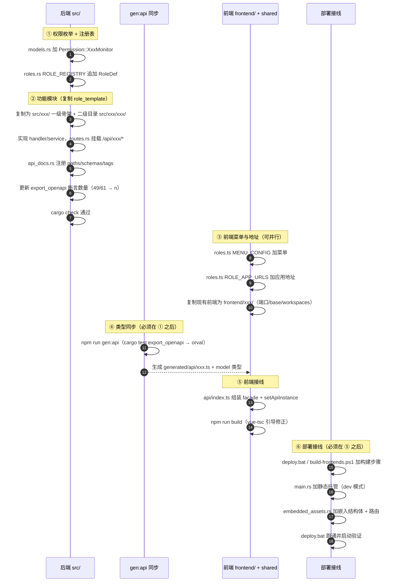
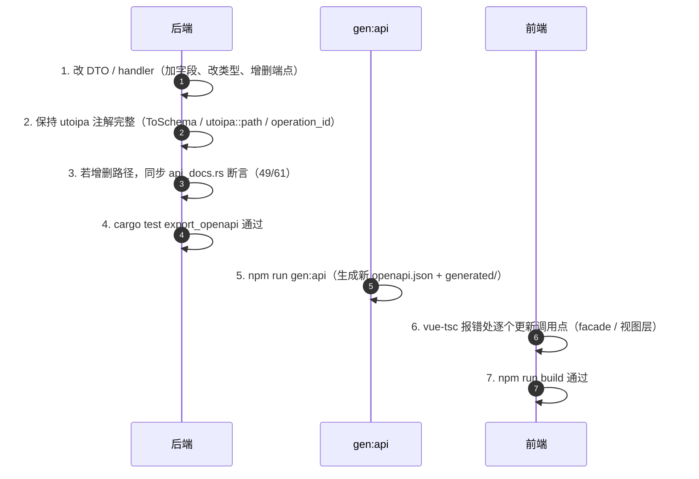
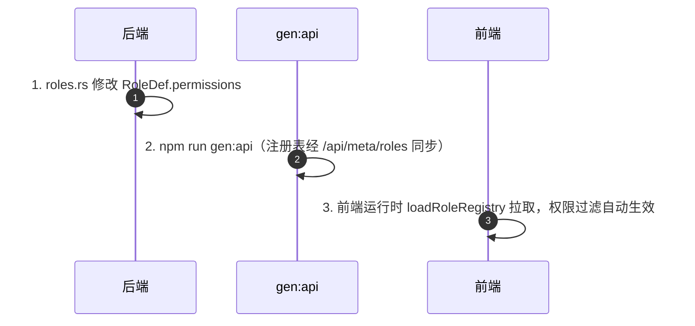
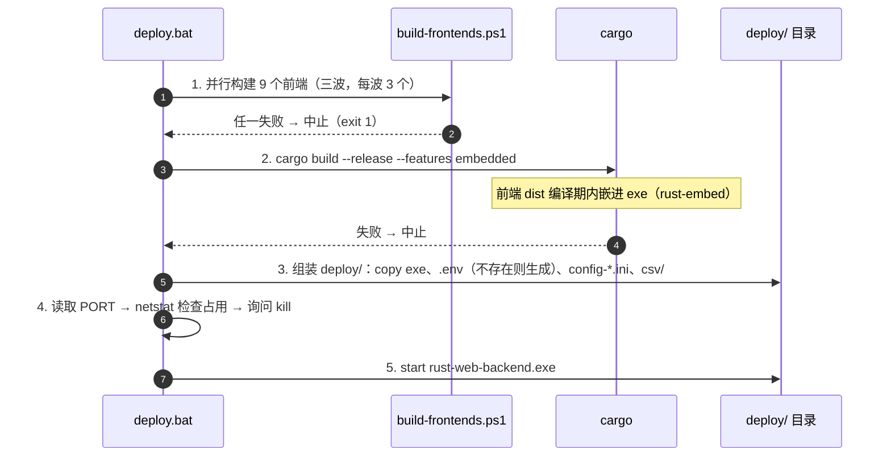
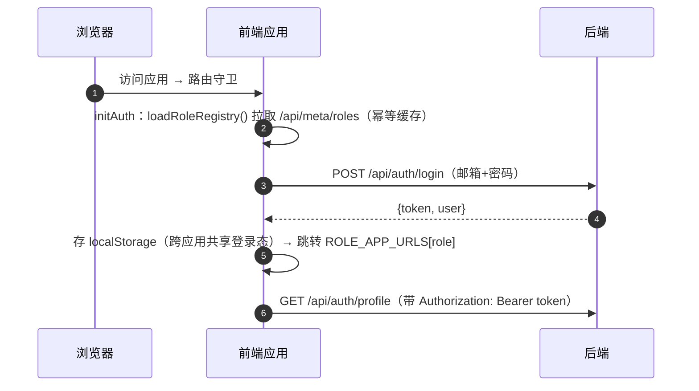
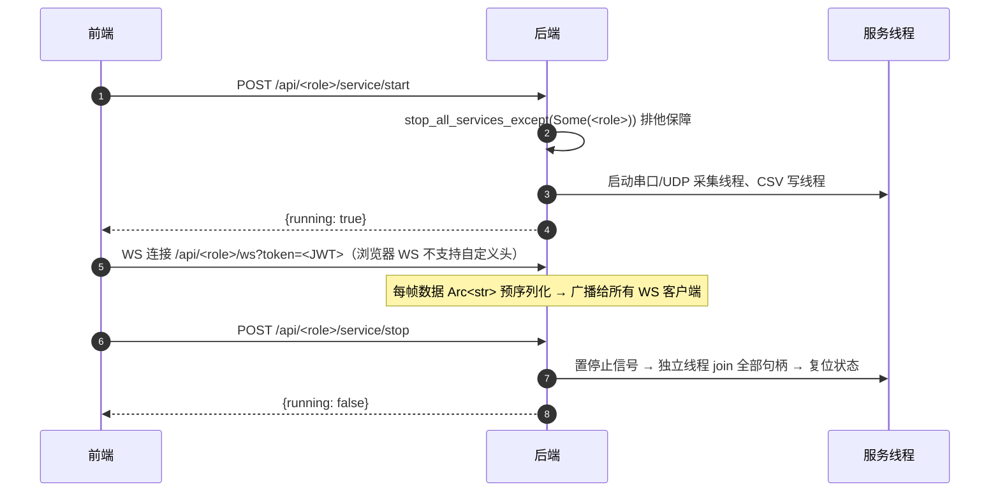
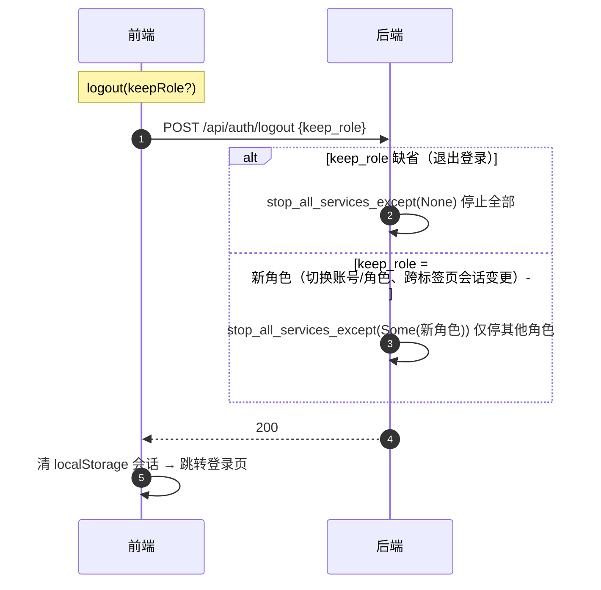

# 项目变更时序详解

> 面向 RustWeb-Vue（Rust + Axum 后端 + 9 个 Vue 3 前端）的**变更操作手册**。
> 本文档聚焦每种可能的变更**必须遵守的先后顺序**（时序）：什么必须先做、什么必须后做、每一步如何验证、踩错顺序会怎样。
> 涉及事实以当前代码为准（OpenAPI 62 路径 / 77 操作、9 个前端应用、dev 端口 5173–5181）。

---

## 目录

1. [变更全景图](#1-变更全景图)
2. [通用时序铁律](#2-通用时序铁律)
3. [场景 A：新增角色（全链路，最大变更）](#3-场景-a新增角色全链路最大变更)
4. [场景 B：修改已有 API / DTO（类型同步）](#4-场景-b修改已有-api--dto类型同步)
5. [场景 C：纯前端修改](#5-场景-c纯前端修改)
6. [场景 D：纯后端修改（无接口变更）](#6-场景-d纯后端修改无接口变更)
7. [场景 E：调整角色权限 / 菜单](#7-场景-e调整角色权限--菜单)
8. [场景 F：数据库结构变更](#8-场景-f数据库结构变更)
9. [场景 G：配置变更](#9-场景-g配置变更)
10. [场景 H：前端应用改名 / 换端口](#10-场景-h前端应用改名--换端口)
11. [场景 I：依赖升级](#11-场景-i依赖升级)
12. [场景 J：部署时序（deploy.bat 内部）](#12-场景-j部署时序deploybat-内部)
13. [场景 K：运行时时序（登录 / 服务 / WS / 登出）](#13-场景-k运行时时序登录--服务--ws--登出)
14. [验证与回滚](#14-验证与回滚)
15. [变更影响速查表](#15-变更影响速查表)

---

## 1. 变更全景图

先判断"我要改的是哪一类"，再跳转到对应场景：

| 变更类型 | 涉及环节 | 需要 `gen:api` | 需要重建前端 | 需要重启后端 |
|---|---|---|---|---|
| A. 新增角色 | 后端 + 前端 + 同步 + 部署接线 | ✅ | ✅ | ✅ |
| B. 修改 API / DTO | 后端 + 类型同步 | ✅ | ✅（受影响应用） | ✅ |
| C. 纯前端页面 / 组件 | 单个前端应用 | ❌ | ✅（该应用） | ❌ |
| D. 纯后端业务逻辑 | 后端 | ❌ | ❌ | ✅ |
| E. 调整角色权限 | 后端注册表 + 同步 | ✅ | 视情况 | ✅ |
| E. 调整菜单 | 仅 `packages/shared/src/roles.ts` | ❌ | ✅（受影响应用） | ❌ |
| F. 数据库变更 | `src/database.rs` + 存量库 | ❌ | ❌ | ✅ |
| G. 配置变更 | `.env` / `config-*.ini` | ❌ | ❌ | 视配置文件 |
| H. 应用改名 / 换端口 | 前后端 + 部署脚本 | 视情况 | ✅ | ✅ |
| I. 依赖升级 | Cargo / npm | ❌ | ✅ | ✅ |
| J. 一键部署 | 全链路 | ❌ | ✅（自动） | ✅（自动重启） |
| K. 运行时时序 | 无代码变更，理解语义 | ❌ | ❌ | ❌ |

---

## 2. 通用时序铁律

无论哪类变更，以下顺序**不可颠倒**，违反会直接失败或产生静默错误：

1. **前端必须先于后端构建**。`deploy.bat` 把 9 个前端 dist 在**编译期**内嵌进 exe（`src/embedded_assets.rs` 的 rust-embed），后端编译时若 `frontend/<app>/dist/` 不存在会直接编译失败。顺序固定：`build-frontends.ps1` → `cargo build --release --features embedded`。
2. **类型同步是"后端 → 生成 → 前端"单向流程**。`npm run gen:api` 内部时序固定为 `cargo test export_openapi`（生成 `openapi/openapi.json`）**然后** `orval`（生成 `packages/shared/src/api/generated/`）。跳过前者，orval 消费过期 spec；跳过后者，前端类型仍是旧版。
3. **`export_openapi` 测试是防漂移闸门**。它断言 49 个路径 / 61 个操作全部存在、且每个操作都有 `operationId`（`src/api_docs.rs`）。新增/删除路径后必须同步更新断言数量，否则 `npm run gen:api` 直接失败——"改接口后 gen:api 报错"几乎都是这个原因。
4. **生成文件不手改**。`openapi/openapi.json` 与 `packages/shared/src/api/generated/` 只由工具生成；修改 DTO/接口后跑 `npm run gen:api`，vue-tsc 报错处即需更新的调用点——这是设计好的"编译期引导"，不要绕过 vue-tsc。
5. **依赖只在根目录安装一次**。`npm install` 在项目根目录执行（npm workspaces 统一安装）；在子目录单独安装会产生重复依赖实例（曾导致 pinia 双实例黑屏）。
6. **数值类注释必须与实现一致**。`src/api_docs.rs` 断言注释（49/61）、`src/roles.rs` 模块头角色列表、AGENTS.md / README.md 中的数字，改一处必须全同步。
7. **服务资源排他**：同一时刻只有当前角色持有串口 / UDP 线程。后端 `start_service` 自动调用 `stop_all_services_except(Some(自身))`，前端登录/登出也会带 `keep_role` 通知后端。新增带线程的角色时必须在 `stop_all_services_except`（`src/common/service.rs`）中补一行停止调用。

---

## 3. 场景 A：新增角色（全链路，最大变更）

### 3.1 总时序图

### 3.2 分阶段时序明细

**阶段 1：后端注册表（先行，被所有后续阶段依赖）**

| 步骤 | 操作 | 文件 | 验证 |
|---|---|---|---|
| 1.1 | 加权限点 | `src/common/models.rs` 的 `Permission` 枚举 | `cargo check` |
| 1.2 | 注册角色（key / name / permissions） | `src/roles.rs` `ROLE_REGISTRY` | `cargo test export_openapi`（注册表经 `/api/meta/roles` 暴露，前端运行时拉取，无手写副本） |

**阶段 2：后端功能模块（依赖 1）**

| 步骤 | 操作 | 验证 |
|---|---|---|
| 2.1 | 复制 `src/role_template/` 为 `src/xxx/`（`mod.rs` / `handlers.rs` / `routes.rs` / `services.rs` 一级骨架） | — |
| 2.2 | 角色专有子模块放二级目录 `src/xxx/xxx/`（内含 `mod.rs`），一级 `mod.rs` 用 `pub use xxx::{...};` 再导出，外部路径保持 `crate::xxx::x` 不变 | — |
| 2.3 | 实现 handler + service；handler 加 `#[utoipa::path]`（tags = "xxx"、operation_id、request_body、responses），DTO 加 `#[derive(ToSchema)]` | — |
| 2.4 | `src/routes.rs` 挂载 `/api/xxx/*`，用 `permission_middleware` 保护 | `cargo check` |
| 2.5 | `src/api_docs.rs` 追加 paths/schemas/tags | — |
| 2.6 | **同步更新** `export_openapi` 测试的路径/操作数量断言（当前 49 / 61） | `cargo test export_openapi` 通过 |

**阶段 3：前端菜单与地址（依赖 1 的 key，可与阶段 2 并行）**

| 步骤 | 操作 | 文件 |
|---|---|---|
| 3.1 | 菜单（纯前端 UI 概念） | `packages/shared/src/roles.ts` 的 `MENU_CONFIG` 加 `userMenus` |
| 3.2 | 应用地址映射 | 同文件 `ROLE_APP_URLS` 加 `{dev, prod}` |
| 3.3 | 复制现有前端为新应用 | `frontend/xxx/`：改 `vite.config.ts`（`defineAppConfig({app, port}, __dirname)` 一行工厂调用，必须显式传 `__dirname`）、`package.json`、根 `package.json` workspaces |

注意 3.1 / 3.2 依赖阶段 1 完成后 `gen:api` 生成的 `RoleInfo` 类型，但菜单项手写时引用的 `Permission.XxxMonitor` 需阶段 1 已提交——实际开发中阶段 1 完成即可并行开始 3。

**阶段 4：类型同步（必须在阶段 1、2 完成后）**

| 步骤 | 操作 | 说明 |
|---|---|---|
| 4.1 | 根目录运行 `npm run gen:api` | 自动 `cargo test export_openapi && orval` |
| 4.2 | 确认生成 `generated/api/xxx.ts` | tags-split 模式按新 tag 拆分 |

**阶段 5：前端接线（依赖 4）**

| 步骤 | 操作 | 验证 |
|---|---|---|
| 5.1 | `frontend/xxx/src/api/index.ts` 组装对象 facade（如 `xxxApi = { ... }`），`setApiInstance(api)` 注入 | — |
| 5.2 | 二级目录 `src/xxx/` 放角色专有 views / api / composables | — |
| 5.3 | `frontend/xxx` 下 `npm run build` | vue-tsc 报错处即需修正的调用点 |

**阶段 6：部署接线（必须在阶段 5 之后）**

| 步骤 | 操作 | 文件 |
|---|---|---|
| 6.1 | 前端构建列表加一项（三波各 3 个，新增后注意波次平衡） | `build-frontends.ps1` 的 `$apps` |
| 6.2 | dev 模式静态托管 | `src/main.rs` 的 `nest_service("/xxx", ServeDir::new("dist-xxx")...)` |
| 6.3 | embedded 模式嵌入 + 路由 | `src/embedded_assets.rs`：`embed_assets!` 追加结构体、`embedded_router()` 追加三条路由（`/xxx`、`/xxx/`、`/xxx/*path`） |
| 6.4 | 组装与提示 | `deploy.bat`：copy dist 逻辑（embedded 下无需）、启动提示列表 |
| 6.5 | 端到端验证 | 跑 `deploy.bat`，用新角色账号登录，验证菜单/页面/权限 |

### 3.3 新增角色常见时序错误

- **先跑 gen:api 再改后端**：orval 消费旧 spec，前端类型与后端不匹配。
- **改完 api_docs.rs 忘记更新断言**：`cargo test export_openapi` 失败，阻塞 gen:api。
- **前端应用复制后忘了改 `ROLE_APP_URLS` / workspaces / base**：登录后跳转 404 或 404 静态资源。
- **新增带线程的角色（串口/UDP）**：漏改 `stop_all_services_except`（`src/common/service.rs`），导致登出后旧角色线程残留。
- **先编译后端再构建前端**：`cargo build --features embedded` 因 dist 缺失失败。

---

## 4. 场景 B：修改已有 API / DTO（类型同步）

### 4.1 时序图

### 4.2 时序明细

| 步骤 | 操作 | 验证 |
|---|---|---|
| 1 | 改后端 `src/<role>/` 的 handler / service / DTO | — |
| 2 | DTO 字段的 `///` 注释即 openapi schema description，按最终用户文档写 | — |
| 3 | 增删端点时同步 `src/api_docs.rs`：paths 列表 + 断言数组 + 数量注释（49/61） | — |
| 4 | `cargo test export_openapi` | 断言通过才继续 |
| 5 | 根目录 `npm run gen:api` | 生成文件有变化 |
| 6 | 在受影响应用目录 `npm run build` | vue-tsc 报错逐一定位 |
| 7 | 涉及 WS 的事件类型（不进 OpenAPI） | 手写于各前端 `types.ts` 的 `buildWebSocketUrl` 与事件类型 |

### 4.3 注意事项

- **只加字段、不删字段**：前端通常零改动即可通过构建（类型宽于运行时）。
- **删字段 / 改类型**：vue-tsc 会在所有引用点报错，逐个更新即可，不要用 `any` 绕过。
- **WebSocket 不参与同步**：WS 走 `/api/xxx/ws?token=`，token 校验在 handler 内，事件类型手写维护。
- **orval 生成文件与 openapi.json 提交仓库**，不手改；`Cargo.lock` 同样需要提交。

---

## 5. 场景 C：纯前端修改

不触碰后端 API 的任何改动（样式、组件、布局、本地逻辑）。

| 步骤 | 操作 | 验证 |
|---|---|---|
| 1 | 在对应 `frontend/xxx/` 目录修改（角色专有文件放 `src/xxx/` 二级目录；一级目录只放模板骨架） | Vite dev 热更新 |
| 2 | 需要验证类型时 `npm run build`（vue-tsc && vite build） | 构建通过 |
| 3 | 发布：跑 `deploy.bat` 或单独 `npm run build` + 后端 embedded 重编 | 浏览器验证 |

**时序要点**：纯前端改动**不需要** `npm run gen:api`，也不影响其他 7 个应用（各自独立构建）。若改了 `packages/shared/` 下的公共代码（如 `roles.ts` 菜单、`template/` 组件），则所有引用该包的应用都需重新构建。

---

## 6. 场景 D：纯后端修改（无接口变更）

| 步骤 | 操作 | 验证 |
|---|---|---|
| 1 | 改 `src/` 下逻辑（不加/不改对外 DTO） | `cargo check` / `cargo test` |
| 2 | 重启 `cargo run` | 日志正常 |
| 3 | 涉及服务线程时走 start/stop 验证 | 登出后线程清理（见场景 K） |

**时序要点**：无需 gen:api、无需重建前端。但若改动影响了 `openapi.json`（如新增 DTO 但没注册也会被断言发现），仍必须同步。

---

## 7. 场景 E：调整角色权限 / 菜单

### 7.1 改权限（后端注册表是唯一源）

**时序要点**：前端 key/name/permissions **无手写副本**，`gen:api` 后刷新页面即生效；若注册表未加载成功，前端权限为空数组（不影响登录，权限校验始终在后端）。

### 7.2 改菜单（纯前端 UI 概念）

| 步骤 | 操作 | 文件 |
|---|---|---|
| 1 | 改 `MENU_CONFIG`（加/删菜单项、改 path/icon/permissions） | `packages/shared/src/roles.ts` |
| 2 | 重新构建受影响应用 | `frontend/xxx` 下 `npm run build` |

菜单过滤规则：父菜单至少一个权限匹配 → 过滤子菜单 → 全部子菜单被过滤则父菜单隐藏（`filterMenusByPermissions`）。

---

## 8. 场景 F：数据库结构变更

建表与种子**内建在代码里**（`src/database.rs`，无 sqlx 迁移文件），所有 `CREATE TABLE` 都是 `IF NOT EXISTS` 幂等语句，在**单个事务**内执行。

### 8.1 时序明细

| 步骤 | 操作 | 注意事项 |
|---|---|---|
| 1 | 新增表：在 `create_tables` 加 `CREATE TABLE IF NOT EXISTS` | 新库自动创建，存量库重启后自动创建（幂等） |
| 2 | 修改已有表结构 | `IF NOT EXISTS` 不会改已有表！需要手写 `ALTER TABLE` 迁移语句（放在 create_tables 里），或删除旧库重建 |
| 3 | 新增种子账号 | `seed_passwords` 表存明文初始密码（随机生成，不打印日志），经 `GET /admin/pwd` 查询；历史库账号缺记录时会一次性重置初始密码 |
| 4 | 重启后端 | `cargo run` 或部署 exe |
| 5 | 验证 | SQLite 客户端查看表；`GET /admin/pwd` 确认种子账号 |

### 8.2 时序陷阱

- **改了表结构但存量库没迁移**：`CREATE TABLE IF NOT EXISTS` 静默跳过，新列不存在 → 运行时报错。必须补 `ALTER TABLE` 或删库。
- **种子账号邮箱格式**：`<role>@7304.com`（9 个角色），改名/新增角色时同步。
- **数据库文件位置**：开发在根目录 `rustweb.db`，部署在 `deploy/rustweb.db`，两边结构独立，迁移脚本都要生效。

---

## 9. 场景 G：配置变更

### 9.1 环境变量（`.env` / `deploy/.env`）

| 配置项 | 生效时机 | 说明 |
|---|---|---|
| `PORT` | 重启后端 | 默认 3000；deploy.bat 启动前会自动读取并检查端口占用 |
| `DATABASE_URL` | 重启后端 | 默认 `sqlite://rustweb.db` |
| `JWT_SECRET` | 重启后端 | **release 模式缺失直接拒绝启动**（`src/common/jwt.rs:init`） |
| `JWT_EXPIRATION` | 重启后端 | 默认 86400 秒 |
| `RUST_LOG` | 重启后端 | 日志级别 |
| `CORS_ORIGINS` | 重启后端 | **release 模式缺失/为空直接拒绝启动**（main.rs CORS 白名单，逗号分隔）；dev 模式放行任意来源 |

**时序要点**：部署环境首次启动 `deploy\.env` 不存在时由 deploy.bat 自动生成（含占位 JWT_SECRET / CORS_ORIGINS）；改端口后重启 exe 前，deploy.bat 会 netstat 检查旧端口占用并询问是否 kill。

### 9.2 角色配置（`config-*.ini`）

| 配置文件 | 生效时机 | 说明 |
|---|---|---|
| `config-fj200c_information.ini` | **热加载，修改立即生效** | 服务运行时改 `[Mock]` / `[ConnectionN]` / `[CSV]` 无需重启 |
| `config-fj200c_main.ini` | **需重启服务** | `[COM] Count = 5` 五路串口；`[MOCK] SimulationMenu = true` 模拟运行；`[REPORT] StatePoints`；`[CSV]` |
| `config-ftj1c.ini` | **需重启服务** | `[Udp] Mock = true`；`[IP]` 16 路组播地址 |

**时序要点**：热加载的配置文件"改完即生效"是**功能特性**（每次读取时重新解析），不要把它当 bug；其余两个文件改完必须走"停止服务 → 改文件 → 启动服务"，或直接重启后端。

---

## 10. 场景 H：前端应用改名 / 换端口

改一个应用的名字/端口，**必须同步修改以下全部位置**（漏一处即 404 / 白屏 / 构建失败），检查顺序建议从上到下：

| 序号 | 位置 | 改动 |
|---|---|---|
| 1 | `frontend/<app>/vite.config.ts` | `defineAppConfig({app, port}, __dirname)` 的 app 名与 port；`base` 由工厂自动按 app 名生成 |
| 2 | 根 `package.json` workspaces | 目录路径 |
| 3 | `packages/shared/src/roles.ts` | `ROLE_APP_URLS` 的 `{dev, prod}` 映射 |
| 4 | `src/main.rs`（dev 模式） | `nest_service("/xxx", ServeDir::new("dist-xxx")...)` |
| 5 | `src/embedded_assets.rs`（embedded 模式） | `embed_assets!` 结构体 + `embedded_router()` 三条路由（`/xxx`、`/xxx/`、`/xxx/*path`） |
| 6 | `build-frontends.ps1` | `$apps` 列表 |
| 7 | `deploy.bat` | 构建提示 / 启动地址提示 |
| 8 | `src/database.rs` | 种子账号邮箱 `<role>@7304.com` 若随改名变更 |

**时序要点**：改名后需先 `npm run gen:api`（若角色 key 变了）→ 各应用 `npm run build` → `cargo build --features embedded`。改端口只影响 dev 模式，生产端口由后端 `PORT` 决定。

---

## 11. 场景 I：依赖升级

### 11.1 后端（Cargo）

| 步骤 | 操作 | 验证 |
|---|---|---|
| 1 | 改 `Cargo.toml` 版本号 | — |
| 2 | `cargo build`（必要时 `cargo update`） | 编译通过 |
| 3 | `cargo test`（含 `export_openapi` 断言） | 测试通过 |
| 4 | 提交 `Cargo.lock` | **必须提交**（锁定后端依赖版本） |

### 11.2 前端（npm，根目录）

| 步骤 | 操作 | 验证 |
|---|---|---|
| 1 | 根目录改 `package.json` 或 `npm install <pkg>@<ver>` | 子目录绝不单独安装（重复依赖实例 → pinia 双实例黑屏） |
| 2 | 受影响应用 `npm run build` | vue-tsc 通过 |
| 3 | 提交 `package-lock.json` | **必须提交** |

**时序陷阱**：升级 axum / sqlx / vite 等大版本时，`openapi.json` 与 `generated/` 可能因序列化差异变化，需要重跑 `npm run gen:api` 并 diff 确认。

---

## 12. 场景 J：部署时序（deploy.bat 内部）

| 步骤 | 动作 | 验证点 |
|---|---|---|
| 1 | `build-frontends.ps1`：9 个应用并行（`Start-Job` 三波各 3 个），任一失败输出 `[FAILED]` 并 exit 1 | 全部 `[OK]` |
| 2 | `cargo build --release --features embedded` | 编译成功（dist 缺失会在此失败） |
| 3 | 组装 `deploy/`：exe + `.env`（自动生成，含 JWT_SECRET/CORS_ORIGINS 占位）+ 3 个 config ini（不存在则生成默认）+ `csv/` 目录 | 目录结构完整 |
| 4 | 端口占用检查：`netstat -ano` 找 LISTENING，choice 询问是否 kill | 端口空闲 |
| 5 | `start "RustWeb" cmd /k rust-web-backend.exe` | 浏览器访问对应路径 |

**时序要点**：
- 步骤 1 → 2 顺序不可颠倒（内嵌依赖）；步骤 3 的配置文件若已存在则**保留**（不覆盖用户修改）。
- release 模式下 `JWT_SECRET` / `CORS_ORIGINS` 缺失会拒绝启动——deploy.bat 自动生成的 `.env` 已含占位值，但**生产必须手工改成强随机值**。
- 本地验证 release 行为：先在根 `.env` 补齐两个变量再 `cargo build --release`。
- 新增角色后，`$apps` 三波分配要重新平衡（当前 3+3+3，加 1 个变 3+3+3+1，`build-frontends.ps1` 按 `$apps[0..2]` / `$apps[3..5]` / `$apps[6..8]` 硬编码切分，需手动调整）。

---

## 13. 场景 K：运行时时序（登录 / 服务 / WS / 登出）

### 13.1 登录时序

**时序要点**：
- 8 个用户端 + admin 共享同一 localStorage token，跨应用跳转 token 自动传递；跳转目标由 `ROLE_APP_URLS` 决定（dev 完整 URL / prod 路径前缀）。
- 登录失败/注册表未加载时权限为空数组，不影响登录流程；**权限校验始终在后端**（中间件）。
- 登录/切换账号：前端 `login()` 带 `keep_role=新角色` 调后端，后端 `stop_all_services_except(Some(新角色))` 停掉其他角色的线程。

### 13.2 服务启停时序（以带线程角色为例）

**时序要点**：
- `start_service` 自动调用 `stop_all_services_except(Some(自身))` —— 即使前端没通知，后端也保证"有且只有当前角色运行"。
- 停止是异步的（`stop_in_background`）：HTTP 立即返回，后台 join；启动时会 `wait_stopping` 防竞态。
- `config-fj200c_main.ini` / `config-ftj1c.ini` 修改后需先停服务再启动（不热加载）；`config-fj200c_information.ini` 热加载无需重启。

### 13.3 登出时序（keep_role 语义）

**时序陷阱（历史事故）**：登出请求必须先于会话清理发出——axios 请求拦截器若在微任务（异步）中才读 localStorage token，`logout()` 同步清 token 会导致登出请求 401、后端从未收到停止指令、串口线程继续运行。当前已修复为两层保障：拦截器同步读 token + `logout()` 显式传 token。

---

## 14. 验证与回滚

### 14.1 验证命令集（按变更类型）

| 变更 | 必跑命令 | 预期 |
|---|---|---|
| 后端任意 | `cargo check` / `cargo test` | 通过；`export_openapi` 断言通过 |
| 接口/DTO 变更 | `npm run gen:api` | openapi.json 与 generated/ 有更新 |
| 前端任意 | `frontend/<app>` 下 `npm run build` | vue-tsc && vite build 通过 |
| 部署 | `deploy.bat` | 9 个前端 `[OK]` → exe 编译 → 启动 |
| API 契约 | 浏览器 `http://localhost:3000/api-docs/openapi.json` | 与 openapi/openapi.json 一致 |

### 14.2 回滚策略

- 未提交的改动：`git checkout -- <file>` 或 `git restore`。
- 已提交的改动：`git revert <commit>`（新提交反向操作，不破坏历史）；或 `git reset --hard`（仅限未推送）。
- 部署回滚：`deploy/` 目录直接替换旧 exe（`.env` / `config-*.ini` / `rustweb.db` 保留，不覆盖）；前端 dist 内嵌于 exe，无法单独回滚前端，需重编 exe 或保留旧 exe。
- 数据库回滚：无迁移文件，靠 `ALTER TABLE` 反向语句或删除 `rustweb.db` 重建（种子账号会重新生成随机密码，需重新查 `GET /admin/pwd`）。

---

## 15. 变更影响速查表

| 我改了… | 必须跟着改… | 必须跑… | 常见漏改后果 |
|---|---|---|---|
| `Permission` 枚举 | `roles.rs` 注册表、api_docs.rs schemas | `gen:api` | 前端无权限、菜单消失 |
| `roles.rs` 注册表 | AGENTS.md/README 角色列表注释、api_docs.rs | `gen:api` | 文档漂移、前端权限过期 |
| 后端 handler/DTO | `api_docs.rs` paths/schemas/断言数量 | `gen:api` + 前端 build | gen:api 失败或前端类型不匹配 |
| 新增/删除 API 路径 | `export_openapi` 断言（49/61） | `cargo test export_openapi` | gen:api 阻塞 |
| 新增角色 | 权限枚举 + 注册表 + 模块 + 路由 + api_docs + MENU_CONFIG + ROLE_APP_URLS + 新前端 + deploy.bat + main.rs + embedded_assets.rs | 全链路 | 登录跳转 404 / 无菜单 / 构建失败 |
| 新增带线程角色 | `stop_all_services_except` 补一行 | — | 登出后线程残留 |
| 前端应用改名/换端口 | vite.config + workspaces + ROLE_APP_URLS + main.rs + embedded_assets.rs + build-frontends.ps1 + deploy.bat | 全链路 | 404 / 白屏 |
| `.env` 配置 | — | 重启后端 | release 下缺失 JWT_SECRET/CORS_ORIGINS 拒绝启动 |
| config ini | — | 热加载或重启服务（按文件） | 配置不生效 |
| `database.rs` 表结构 | 存量库迁移语句 | 重启 | 新列缺失运行时报错 |
| 公共包 `packages/shared` | 全部引用应用 | 全部受影响应用 build | 旧应用行为不一致 |
| `Cargo.toml` / `package.json` | `Cargo.lock` / `package-lock.json` 提交 | build + test | 依赖版本漂移 |
| 文档中的数字 | 所有提到同一数字的文档 | — | 防漂移注释失效 |

> 维护约定：本文件涉及的数字（59 / 74、9 个应用、端口等）与 AGENTS.md / README.md / `src/api_docs.rs` 注释共享同一事实源，修改时需一并更新。