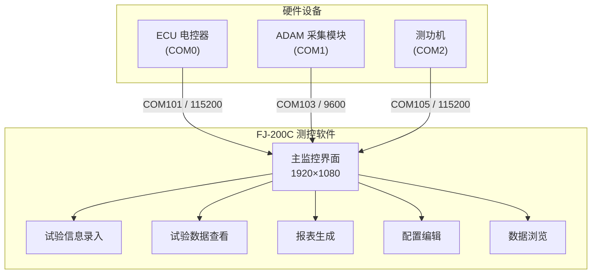
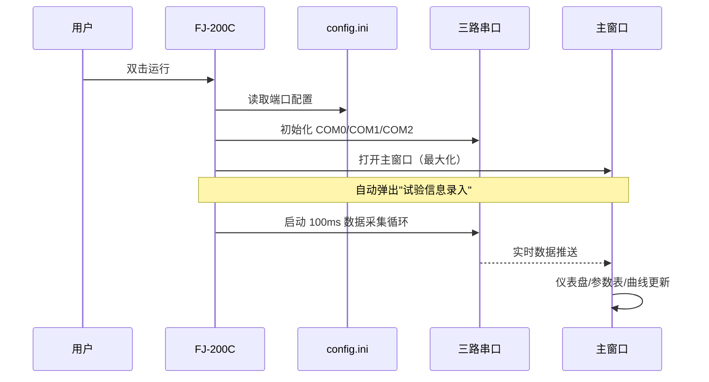
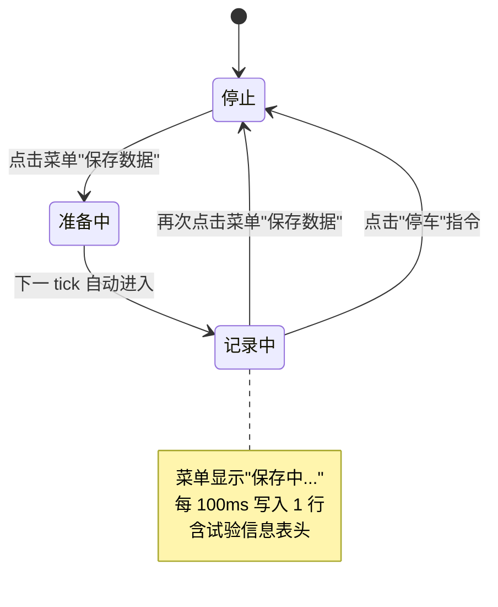
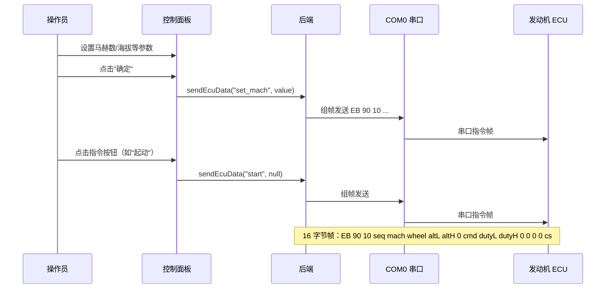
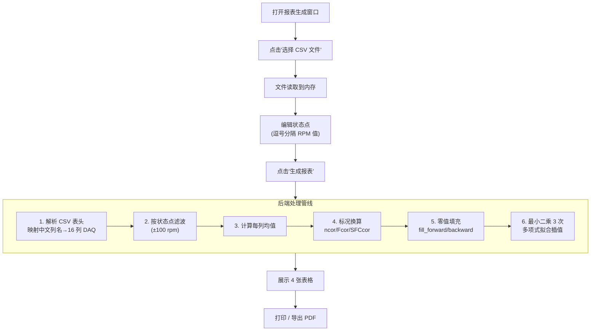
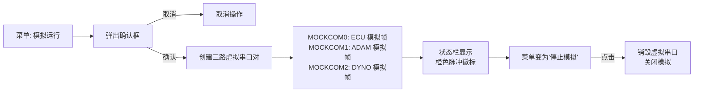
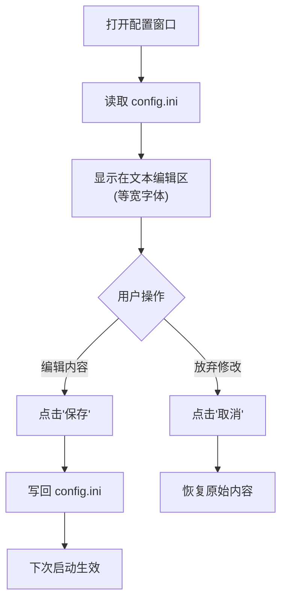
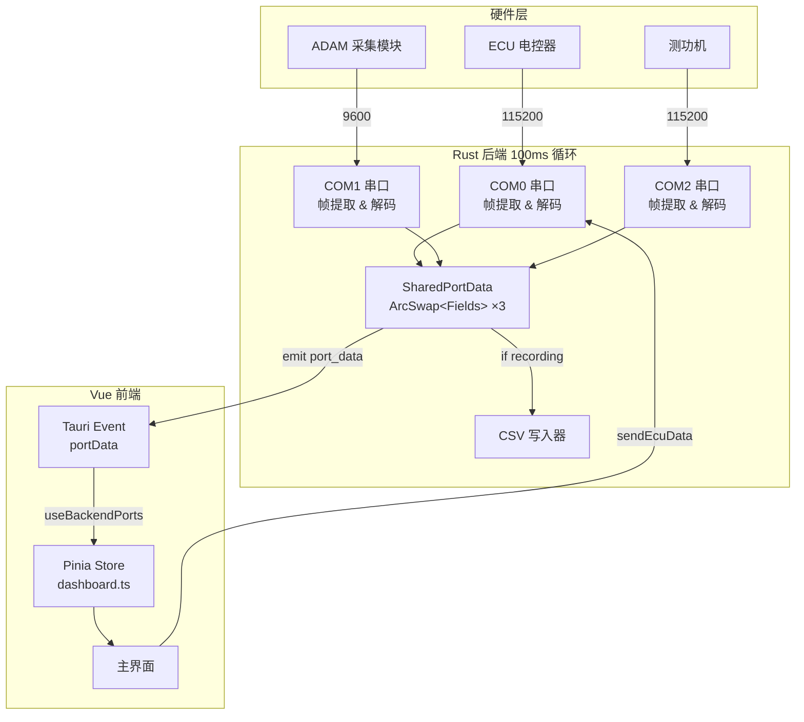

# FJ-200C 发动机测控软件 — 用户操作说明

## 一、软件概述

FJ-200C 发动机测控软件是一套专用于航空发动机试车台的实时数据采集、监控与试验数据管理桌面应用程序。软件通过三路独立串口分别连接 **ECU 电控器**、**ADAM 环境采集模块**和 **测功机**，实现发动机全状态参数的实时监控、指令下发、数据记录与报表生成。



| 通道 | 配置节 | 物理端口 | 波特率 | 数据内容 |
|---|---|---|---|---|
| COM0 | `[COM0]` | COM101 | 115200 | 发动机 ECU 参数（转速/温度/压力/故障码等 ~60 字段） |
| COM1 | `[COM1]` | COM103 | 9600 | 环境参数（大气温湿度/压力/进口温度等 8 通道） |
| COM2 | `[COM2] | COM105 | 115200 | 测功机参数（机油温度/扭矩/转速/功率） |

---

## 二、启动与初始化

### 启动流程



1. 双击桌面图标启动程序
2. 系统自动加载 `config.ini` 配置，初始化三路串口
3. 主窗口以最大化模式打开（设计尺寸 1920×1080，自动缩放适配当前屏幕）
4. **试验信息录入**子窗口自动弹出（见第四章）
5. 串口连接成功后，主界面仪表盘开始显示实时数据

> ⚠️ **首次使用**：请先通过菜单"打开配置"确认串口号与硬件一致（详见第十章）。

---

## 三、主界面总览

```
┌──────────────────────────────────────────────────────────────────────┐
│                        菜单栏（顶部）                                  │
├──────────────────┬───────────────────────────────────────────────────┤
│ ┌────仪表盘─────┐│ ┌─────────环境参数──────────┐                    │
│ │  Ng转速  排温  ││ │ 大气温度 | 大气湿度       │                    │
│ │  测功功率 燃油  ││ │ 大气压力 | 进口温度       │                    │
│ │  流量  Np转速  ││ │ 扭矩转速 | 扭矩           │                    │
│ └────────────────┘│ │ 扭矩功率 | 通道8           │                    │
│                    │ └──────────────────────────┘                    │
│ ┌──────────────────────────────────────────────────────────────────┐│
│ │                         ECU状态（22参数8列）                      ││
│ │ 马赫数 │ 海拔 │ Ng转速 │ 排温 │ 进温 │ Np转速 │ 油门 │ 发动机状态 ││
│ │ ...                                                             ││
│ └──────────────────────────────────────────────────────────────────┘│
│ ┌──故障码1──────┬────故障码2──────┬────附件状态──────┐              │
│ │ 自检排温异常    │ Ng转速故障      │ 停车电磁阀      │              │
│ │ 自检进温异常    │ Np转速故障      │ 燃油泵          │              │
│ │ ... (16项)     │ ... (11项)      │ ... (5项)       │              │
│ └────────────────┴────────────────┴─────────────────┘              │
│ ┌──────────参数曲线──────────┬──────────控制指令──────────┐          │
│ │ 折线图（5条曲线，双 Y 轴）  │ 参数配置（4 项）           │          │
│ │ • Ng转速 (青)  左轴 r/min  │ 马赫数 / 海拔 / 油门 / 轮载│          │
│ │ • Np转速 (紫)  左轴 r/min  │ 指令按钮（9 个）           │          │
│ │ • 排温 (红)    右轴 °C     │ 起动 / 停车 / 冷运转 / ... │          │
│ │ • 功率 (橙)    右轴 W      │                            │          │
│ │ • 燃油流量 (青) 右轴 r/min │                            │          │
│ └──────────────────────────┴──────────────────────────────┘          │
├──────────────────────────────────────────────────────────────────────┤
│ 状态栏：[模拟徽标] ECU收:xxxB xxx帧 | ADAM:xxxB | Dyno:xxxB | 发送帧 │
└──────────────────────────────────────────────────────────────────────┘
```

### 3.1 仪表盘（5 个圆形仪表）

实时显示发动机核心参数，指针式仪表直观展示：

| 仪表 | 量程 | 数据来源 |
|---|---|---|
| Ng 转速 | 0–15000 r/min | ECU |
| 排气温度 | 0–1200 °C | ECU |
| 测功机功率 | 0–50 W | 测功机（COM2） |
| 燃油流量 | 0–6000 脉冲/min | ECU |
| Np 转速 | 0–15000 r/min | ECU |

### 3.2 ECU 状态（22 参数）

以 8 列网格形式展示全部 ECU 解码参数，包含数值与单位：

- 飞行马赫数回传、海拔高度回传
- 燃气发生器转速 Ng、动力涡轮转速 Np
- 排气温度、进气温度
- 油门百分比、发动机状态（文本+十六进制）
- 工作电压、控制指令执行情况
- 故障码 1 / 故障码 2（十六进制）
- 滑油压力/温度、燃油压力
- 附件状态、换热器出口滑油温度、指纹码、帧计数

### 3.3 故障码与附件状态

三块面板并列显示：

- **故障码 1**（16 项）：自检排温异常、自检进温异常、自检滑压异常、自检滑温异常、自检燃压异常、自检 Ng 转速异常、自检 Np 转速异常、油路排气异常、冷运转异常、点火失败、起动超温、起动超时、起发转速低、Ng 转速超转、Np 转速超转、排温超温
- **故障码 2**（11 项）：Ng 转速故障、Np 转速故障、排温故障、滑温故障、滑压故障、燃压故障、ECU 电压异常、起动电压异常、发电电压异常、空中熄火、通信断开
- **附件状态**（5 项）：停车电磁阀、燃油泵、滑油泵、起发电机、轮载状态

> 故障激活时显示**红色闪烁**背景，附件激活时显示**绿色**背景。

### 3.4 参数曲线

ECharts 多轴折线图，每秒新增一个采样点，最多保留 100 个点（自动滚动）：

| 曲线 | 颜色 | Y 轴 | 单位 |
|---|---|---|---|
| Ng 转速 | 青色 | 左轴 | r/min |
| Np 转速 | 紫色 | 左轴 | r/min |
| 排气温度 | 红色 | 右轴 | °C |
| 测功机功率 | 橙色 | 右轴 | W |
| 燃油流量 | 青色 | 右轴 | 脉冲/min |

### 3.5 控制指令面板

**参数配置区（4 项）：**
- 飞行马赫数 → 输入后点"确定"
- 海拔高度 → 输入后点"确定"
- 恒定油门占空比 → 输入后点"确定"
- 轮载状态 → 下拉选择"地面"/"空中"

**指令按钮区（9 个按钮，5 列布局）：**

| 第 1 行 | 第 2 行 |
|---|---|
| 起动 | 恒定油门设定 |
| 停车 | 电控器自检 |
| 燃气发生器冷运转 | — |
| 停止燃气发生器冷运转 | — |
| 油路排气 | — |
| 空中起动 | — |

> 📌 点击**"起动"**会自动开始数据记录；点击**"停车"**会自动停止数据记录。

### 3.6 状态栏

- 左侧：**模拟运行中**徽标（仅模拟模式，橙色脉冲闪烁）、ECU 接收字节数/帧数、ADAM 接收字节数、测功机接收字节数
- 右侧：**显示发送帧**切换按钮、上一条发送指令名称与十六进制数据

---

## 四、试验信息录入

菜单"**试验信息录入**"或启动自动弹出 → 800×600 子窗口。


字段列表：

| 字段 | 说明 |
|---|---|
| 发动机编号 | 被测发动机编号 |
| 燃气发生器编号 | 燃气发生器编号 |
| 电控器编号 | ECU 编号 |
| 转速传感器编号 | 转速传感器编号 |
| 滑油温压一体传感器编号 | 滑油温压传感器编号 |
| 试验项目 | 下拉选择：检验试车 / 匹配试车 |
| 试验时间 | 自动填入当前北京时间（不可编辑） |

---

## 五、数据记录

### 操作步骤



1. 点击菜单栏**"保存数据"**
2. 系统自动创建 `csv/recording_YYYYMMDDHHMMSS.csv`
3. 文件首部写入试验信息（发动机编号、试验项目等）
4. 菜单文字变为 **"保存中..."**
5. 串口数据以 100ms 间隔持续写入
6. 再次点击**"保存数据"**（或点击控制面板"停车"）→ 停止记录，刷新文件

> 文件位于程序运行目录下的 `csv/` 文件夹，可直接用 Excel 或文本编辑器打开。

---

## 六、指令发送



### 指令帧格式

| 字节偏移 | 内容 | 说明 |
|---|---|---|
| 0–1 | `EB 90` | 帧头 |
| 2 | `10` | 指令标识 |
| 3 | seq | 序列号（递增） |
| 4 | mach | 马赫数 |
| 5 | wheel | 轮载状态 |
| 6–7 | altitude | 海拔高度（小端 LE） |
| 8 | `00` | 保留 |
| 9 | cmd | 控制指令码 |
| 10–11 | duty | 油门占空比（小端 LE） |
| 12–14 | `00 00 00` | 保留 |
| 15 | checksum | 累加和校验 |

---

## 七、报表生成

菜单"**生成报表**" → 1100×800 子窗口。

### 流程概览



### 四张结果表

| 表格 | 内容 | 可编辑 |
|---|---|---|
| 试验基本信息 | 发动机编号、电控器编号、传感器编号、试验项目、试验人员、试车台架等 15 项 | ✅ 是 |
| 试验性能数据 | 各状态点转速、推力、排温、燃油流量、大气温度、大气压力 | ❌ 否 |
| 试验标准数据 | 标况换算后的转速、推力、排温、耗油率 | ❌ 否 |
| 设计点性能数据 | 3 次多项式拟合插值的设计点值 | ❌ 否 |

### 状态点编辑

默认状态点为 30000 至 53000（步长 1000，共 24 点），格式为：

```
30000,31000,32000,33000,34000,35000,36000,37000,38000,39000,40000,
41000,42000,43000,44000,45000,46000,47000,48000,49000,50000,51000,
52000,53000
```

可按需修改为任意 RPM 值，逗号分隔。

---

## 八、模拟运行模式

用于离线调试与演示，无需连接真实硬件。



### 操作说明

| 步骤 | 操作 | 界面反馈 |
|---|---|---|
| 1 | 菜单 → **模拟运行** | 弹出确认框："请切换物理连线到模拟端口…" |
| 2 | 确认 | 状态栏出现橙色"**模拟运行中**"脉冲闪烁徽标 |
| 3 | 主界面正常接收模拟数据 | 仪表盘、ECU 参数、曲线全部更新 |
| 4 | 菜单 → **停止模拟** | 徽标消失，模拟结束 |

> ⚠️ **注意**：模拟模式使用 `MOCKCOM0/1/2` 三路虚拟串口对。进入前需将物理串口线切换到对应的虚拟串口。若 `config.ini` 中 `[MOCK] SimulationMenu = false`，则菜单项隐藏。

---

## 九、试验数据查看

菜单"**试验数据查看**" → 最大化子窗口。

以大字体（35px）全屏展示实时 ECU 数据，适用于远距离观察：

- **左面板**：22 个 ECU 参数以 4 列网格布局，大字体显示
- **右面板**：故障码 1（16 项）、故障码 2（11 项）、附件状态（5 项）

数据通过 IPC 命令 `getPortSnapshot(0)` 每 200ms 轮询获取。

---

## 十、配置编辑

菜单"**打开配置**" → 800×600 子窗口。



### 配置文件关键节

```ini
[COM]
Count=3

[COM0]
PORTNAME=COM101
BAUD=115200

[COM1]
PORTNAME=COM103
BAUD=9600

[COM2]
PORTNAME=COM105
BAUD=115200

[MOCK]
SimulationMenu=true

[MOCKCOM0]
PAIR1=COM101
PAIR2=MOCKCOM0_IN
; ...
```

> ⚠️ **修改端口后需重启程序**才能生效。

---

## 十一、数据浏览

菜单"**浏览数据**" → 800×600 子窗口。

1. 点击"选择文件"选取 CSV 数据文件
2. 表格自动展示全部数据列（动态列名）
3. 点击 **"另存为 TXT"** 导出为制表符分隔的文本文件

---

## 十二、主题切换

菜单 **"深色主题" / "浅色主题"** 可随时切换：

| 主题 | 特点 |
|---|---|
| 深色主题（默认） | 深蓝航空风格，适合暗室环境 |
| 浅色主题 | 白色背景，适合明亮环境 |

- 切换后立即生效
- 设置保存在浏览器 localStorage 中，下次启动自动恢复
- ECharts 图表配色随主题同步切换

---

## 十三、帮助

菜单"**帮助**" → 800×600 子窗口。

渲染 `README.md` 为 HTML 页面，包含 Mermaid 图表的交互式显示，可随时查阅最新文档。

---

## 十四、常见问题

### Q1: 串口打开失败怎么办？

- 确认设备管理器端口号与 `config.ini` 一致
- 确认波特率设置正确（ECU: 115200, ADAM: 9600, 测功机: 115200）
- 确认串口未被其他程序占用

### Q2: 数据未在界面显示？

- 检查状态栏的接收字节数是否增长
- 若无增长 → 检查串口连接与配置
- 若有增长 → 检查帧头匹配（ECU: `EB 90 2A`, ADAM: `>`, DYNO: `FF FF`）

### Q3: 记录文件在哪里？

程序运行目录下的 `csv/` 文件夹，文件名格式 `recording_YYYYMMDDHHMMSS.csv`。

### Q4: 如何导出报表？

打开"**生成报表**"子窗口 → 选择 CSV → 点击生成 → 使用浏览器打印功能（Ctrl+P）导出为 PDF。

### Q5: 模拟模式无法启动？

检查 `config.ini` 中 `[MOCK] SimulationMenu = true`。

---

## 十五、菜单速查

| 菜单项 | 功能 | 子窗口大小 |
|---|---|---|
| 试验信息录入 | 填写发动机/传感器编号等 | 800×600 |
| 试验数据查看 | 全屏实时 ECU 数据显示 | 最大化 |
| 打开配置 | 编辑 config.ini | 800×600 |
| 保存数据 | 开始/停止 CSV 录制 | — |
| 浏览数据 | 查看已录制的 CSV 文件 | 800×600 |
| 生成报表 | CSV → 4 表试验报告 | 1100×800 |
| 浅色/深色主题 | 切换界面主题 | — |
| 模拟运行/停止模拟 | 启动/停止离线模拟 | — |
| 帮助 | 查看 README 文档 | 800×600 |

---

## 十六、完整数据流



---

> **软件版本**：FJ-200C v2.0 | **技术栈**：Tauri v2 + Vue 3 + Rust + ECharts
